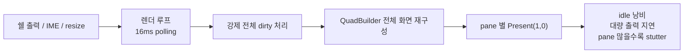

# PRD — M-14 Render Thread Safety

> **Feature**: M-14 Render Thread Safety  
> **Date**: 2026-04-20  
> **Status**: Draft v1.0  
> **Related Milestone Spec**: `C:\Users\Solit\obsidian\note\Projects\GhostWin\Milestones\m14-render-thread-safety.md`

---

## Executive Summary

| 관점 | 내용 |
|------|------|
| **Problem** | GhostWin은 기능 범위만 보면 M-13까지 터미널 기본기를 거의 완성했지만, 렌더 경로는 아직 두 가지 큰 약점을 동시에 안고 있다. 첫째, 창 리사이즈 중 `RenderFrame` 경계가 흔들려 구조적으로 안전하지 않다. 둘째, 화면이 거의 안 바뀌는 순간에도 렌더 루프가 계속 일을 하고, pane 수가 늘면 `Present(1, 0)` 비용까지 겹쳐 Windows Terminal, WezTerm, Alacritty 대비 체감 성능 열세가 크다. |
| **Solution** | M-14를 단순 "리사이즈 경쟁 조건 정리"가 아니라 **렌더 기준선 회복 마일스톤**으로 재정의한다. 즉, frame ownership(누가 읽고 누가 쓰는지 경계)을 안전하게 고치고, 동시에 idle / 대량 출력 / 4-pane resize 시나리오에서 성능 기준선을 다시 세운다. |
| **Function / UX Effect** | 사용자는 "기능은 되는데 무겁고 불안한 터미널"이 아니라, 창을 자주 늘리고 줄여도 깨지지 않고, 로그가 많이 나와도 WT/WezTerm/Alacritty 대비 **명확한 열세가 없는** 터미널을 기대할 수 있다. |
| **Core Value** | 이 문서는 새 기능 PRD가 아니다. GhostWin의 3대 비전 중 **③ 타 터미널 대비 성능 우수**를 다시 실제 코드 기준으로 맞추기 위한 복구 게이트다. M-14를 통과해야 이후 기능 추가가 "불안정하고 느린 기반" 위에 쌓이지 않는다. |

---

## 1. Product Overview

### 1.1 왜 지금 이 작업을 하나

2026년 4월 20일 기준으로 M-11, M-11.5, Phase 6-A/B/C, M-12, M-13은 모두 완료됐다.  
즉 지금 남은 다음 큰 작업은 새 기능 추가가 아니라 **기초 체력 회복**이다.

현재 사용자 관점의 문제는 두 갈래다.

- **안정성 문제**: 창 리사이즈 중 `span subscript out of range` Assertion 이 한 번이라도 보였다는 사실 자체가, 렌더 frame 경계가 아직 구조적으로 닫히지 않았다는 뜻이다.
- **성능 문제**: 실제 사용 체감에서 GhostWin 렌더가 Windows Terminal, WezTerm, Alacritty 보다 크게 뒤처진다. 특히 idle, 대량 출력, pane 분할 상태에서 이 열세가 더 잘 드러난다.

둘 중 하나만 고치면 충분하지 않다.

- 안정성만 고치고 계속 무거우면 "안전하지만 느린 터미널" 이 된다.
- 성능만 손보고 frame 경계가 흔들리면 "빠를 수는 있어도 믿고 못 쓰는 터미널" 이 된다.

그래서 M-14는 **안전성 + 성능 기준선 회복**을 함께 다루는 마일스톤으로 재정의한다.

### 1.2 이번 재정의에서 바뀌는 점

| 항목 | 기존 M-14 정의 | 이번 PRD의 M-14 정의 |
|------|----------------|----------------------|
| 핵심 질문 | "`_p` (내부 private frame 버퍼) 경쟁 조건을 어떻게 닫을까?" | "`_p` 경쟁 조건을 닫고도 왜 아직 느린지까지 함께 해결할까?" |
| 범위 중심 | 리사이즈 안전성 | 리사이즈 안전성 + 렌더 기준선 회복 |
| 완료 판단 | Assertion 방지 + ownership 설명 | Assertion 방지 + 내부 성능 수치 + 외부 비교 기준 통과 |
| 사용자 가치 | "안 깨진다" | "안 깨지고, 눈에 띄게 덜 버벅인다" |

---

## 2. 지금 어떻게 느린가

### 2.1 사용자가 체감하는 문제

사용자는 내부 구조를 모른다. 사용자가 느끼는 것은 아래 세 가지다.

1. **가만히 있어도 무겁다**
   화면이 거의 안 바뀌는데도 터미널이 계속 일하는 느낌이 든다.
2. **출력이 많아지면 밀린다**
   로그가 빠르게 쏟아질 때 스크롤이나 화면 반응이 경쟁 터미널보다 둔해 보인다.
3. **pane / resize 상황에서 더 심해진다**
   창 크기 조절이나 pane 분할 상태에서 stutter 가 커지고, 안정성 불안도 같이 드러난다.

### 2.2 현재 렌더 흐름의 문제 요약

> 아래 요약은 **현재 코드에서 확인된 사실**과, 그것이 실제 체감 열세에 얼마나 기여하는지에 대한 **현재 가설**을 함께 적은 것이다.  
> 코드로 확인된 사실: `16ms polling` 렌더 루프, 매 프레임 `force_all_dirty()`, `QuadBuilder` 의 전체 row/cell 2-pass 순회, pane 별 `Present(1, 0)` 경로.  
> 아직 가설인 부분: 이 항목들 각각이 실제 성능 열세에 기여하는 비중.  
> W1에서 Release 빌드 기준 계측으로 이 가설을 검증한다.

근거 코드:

- `ghostwin_engine.cpp` — `Sleep(16)` 렌더 루프, `force_all_dirty()`, pane 별 surface 순회
- `quad_builder.cpp` — background/text 2-pass row/cell 순회
- `dx11_renderer.cpp` — `DrawIndexedInstanced` 후 `Present(1, 0)`

핵심은 "GPU를 쓰느냐"가 아니라, **매 프레임 CPU와 Present 경로에 얼마나 불필요한 일을 시키느냐**다.

현재 코드는 다음 의심을 강하게 준다.

- dirty-row 구조가 있어도 실제로는 full redraw 에 가까운 경로가 남아 있다
- pane 수만큼 `Present(1, 0)` 비용이 누적된다
- 비교 터미널처럼 "화면이 안 바뀌면 거의 안 일하는" 상태가 아직 아니다

### 2.3 왜 이게 제품 문제인가

GhostWin의 존재 이유는 단순히 "윈도우에서 돌아가는 터미널 하나 더" 가 아니다.

- AI 에이전트 멀티플렉서
- Windows 네이티브 UX
- ghostty 기반 고성능 렌더

이 세 축이 같이 서야 한다.  
여기서 성능 축이 무너지면, 나머지 기능이 좋아도 "좋은 데모" 이상으로 올라가기 어렵다.

---

## 3. 목표

### 3.1 제품 목표

M-14의 목표는 아래 한 문장으로 요약된다.

> **GhostWin 렌더 경로를 "안전하고, 비교 가능한 성능 기준선 위에 있는 상태"로 되돌린다.**

### 3.2 세부 목표

| 목표 | 설명 |
|------|------|
| **G1. frame ownership 안정화** | 렌더 스레드가 읽는 frame 과 UI/resize 경로가 쓰는 frame 경계, 즉 "누가 읽고 누가 쓰는지"를 분명히 한다. |
| **G2. idle 낭비 제거** | 화면이 바뀌지 않을 때 계속 전체 화면을 다시 준비하는 구조를 멈춘다. |
| **G3. 대량 출력 기준선 회복** | 로그 폭주 시에도 "GhostWin만 유난히 버벅인다"는 상태를 벗어난다. |
| **G4. pane / resize 내구성 확보** | 4-pane 상태에서 resize 와 draw 가 겹쳐도 눈에 띄는 끊김과 구조 불안을 줄인다. |
| **G5. 비교 가능한 측정 체계 확보** | 내부 계측과 외부 비교 시나리오를 남겨, 다음 마일스톤에서도 같은 기준으로 회귀를 판단할 수 있게 한다. |

---

## 4. 이번 마일스톤에서 하지 않을 것

M-14는 범위를 넓게 보이게 만들 위험이 있다. 아래 항목은 이번 PRD의 **비목표**다.

- 새 사용자 기능 추가
- 테마, 설정, IME UX 확장
- 알림 패널, OSC, hook 기능 확장
- ghostty upstream 정리
- "최종 최고 성능" 달성

이번 목표는 **성능 세계 1위**가 아니다.  
먼저 해야 할 일은 **"지금 너무 느리고 불안하다"는 상태를 끝내는 것**이다.

---

## 5. 핵심 사용자 시나리오

### 5.1 시나리오 A — Idle

사용자는 터미널 창을 열어 두고 코드를 읽거나, AI 에이전트 응답을 기다린다.  
이때 GhostWin이 화면 변화가 거의 없는데도 계속 일을 많이 한다면, 조용히 불신이 쌓인다.

**JTBD**:  
"입력이 없는 동안 터미널이 거의 쉬고 있었으면 좋겠다."

### 5.2 시나리오 B — 대량 출력

사용자는 `git diff`, 빌드 로그, 테스트 로그, `npm install`, `cargo build`, 장문의 AI 출력처럼
한 번에 많은 줄이 나오는 작업을 자주 본다.

**JTBD**:  
"로그가 많아도 창 반응이 갑자기 둔해지지 않았으면 좋겠다."

### 5.3 시나리오 C — 4-pane resize

GhostWin의 강점은 pane 기반 멀티플렉서 UX다.  
그래서 성능 검증도 반드시 split 상태를 포함해야 한다.

**JTBD**:  
"4-pane 상태에서 pane 크기를 바꾸거나 창을 리사이즈해도 깨지지 않고, 체감이 확 나빠지지 않았으면 좋겠다."

---

## 6. 성공 기준

### 6.1 내부 성공 기준 — 우리가 직접 통제하는 기준

이 기준은 **go / no-go** 용이다.  
셋 중 하나라도 빠지면 M-14 완료로 보지 않는다.

> 아래 숫자는 **초기 가설 budget** 이다. 아직 GhostWin / Windows Terminal / WezTerm / Alacritty 의 동조건 실측이 없으므로, W1에서 Release 빌드 기준 측정 후 tighten 또는 relax 한다.  
> 즉, 이 표의 숫자는 "지금 즉시 확정된 절대 기준" 이 아니라 **측정 후 확정할 첫 버전 목표값** 이다.

| 시나리오 | 목표 | 측정 방법 |
|----------|------|-----------|
| **Idle (1-pane)** | 화면 변화가 없을 때 연속 full redraw 가 없어야 함. 초기 가설 budget: Release 빌드 기준 평균 CPU `2% 이하`, GPU는 실질 idle 수준에 가까워야 함 | 내부 렌더 계측 + Task Manager / GPU-Z / 동등 도구로 60초 평균 |
| **대량 출력 (1-pane)** | 일반 개발 로그 워크로드에서 장시간 끊김 없이 따라가야 함. 초기 가설 budget: `p95 frame time 16.7ms 이하` (60fps 예산 가설). 최소한 수 초 단위 freeze 는 없어야 함 | 내부 프레임 계측 + 고정 워크로드 스크립트 |
| **4-pane resize** | resize 중 Assertion / black frame / 장시간 멈춤이 없어야 함. 초기 가설 budget: `p95 frame time 33ms 이하` (30fps 체감 방어선 가설) | 4-pane 스트레스 시나리오 + 내부 계측 + 화면 녹화 확인 |

### 6.2 외부 성공 기준 — 경쟁 터미널 대비 기준

이 기준은 "홍보 문구"가 아니라 **체감 열세 해소 게이트**다.

비교 대상:

- Windows Terminal
- WezTerm
- Alacritty

비교 원칙:

- 같은 PC
- 같은 해상도 / 창 크기
- 최대한 비슷한 폰트 크기
- 같은 쉘 / 같은 출력 스크립트
- Release 빌드

> 전제: go / no-go 판정은 Release 빌드에서만 한다. Debug 측정값은 참고 자료로만 남기고, 최종 성능 판정에 사용하지 않는다.

비교 시나리오:

| 시나리오 | 비교 대상 | 판정 기준 |
|----------|-----------|-----------|
| **Idle (1-pane)** | WT / WezTerm / Alacritty | GhostWin만 유난히 CPU/GPU를 더 태우거나, 창이 "살아 움직이는 듯" 바쁘면 실패 |
| **대량 출력 (1-pane)** | WT / WezTerm / Alacritty | GhostWin이 세 비교군 모두보다 명확히 더 끊기고 뒤처지면 실패 |
| **Window resize** | WT / WezTerm / Alacritty | GhostWin만 유난히 drag/resizing이 거칠고 늦으면 실패 |
| **4-pane resize** | WT / WezTerm | GhostWin이 pane 상황에서 일관되게 마지막이고, 체감 열세가 명확하면 실패 |

> 참고: Alacritty는 GhostWin/WT/WezTerm과 pane 기능 축이 다르므로, 4-pane 비교는 제외한다.

명확한 열세 판정 규칙:

- 같은 시나리오를 3회 반복했을 때 2회 이상 일관되게 더 나쁜 결과가 나온다
- 수치 비교와 화면 녹화/체감 기록이 같이 남는다
- "조금 아쉽다" 수준이 아니라 반복 측정에서 분명한 차이를 설명할 수 있다

### 6.3 완료 게이트

아래 조건을 모두 만족해야 M-14를 닫는다.

1. 리사이즈 중 frame ownership 관련 Assertion / out-of-range 방어 코드에 의존하지 않는다.
2. `idle`, `대량 출력`, `4-pane resize` 3개 내부 시나리오가 반복 가능하게 문서화된다.
3. 내부 성능 계측 결과가 남는다.
4. 외부 비교 결과가 남는다.
5. 섹션 6.2 비교 시나리오 4개 중 3개 이상에서 GhostWin이 `명확한 열세` 판정을 받지 않는다.

---

## 7. Workstreams

이 섹션은 구현 설계가 아니라, 이번 PM이 관리할 **일 묶음**이다.

| Workstream | 목적 | 출력물 |
|------------|------|--------|
| **W1. 측정 가능성 확보** | "느리다"를 감정이 아니라 기록으로 바꾼다 | 렌더 타이밍 계측, 시나리오 정의, 결과 표 |
| **W2. frame ownership 정리** | resize 와 draw 사이 경계를 구조적으로 닫는다 | 안전한 frame 경계, 관련 문서 갱신 |
| **W3. idle / dirty 경로 회복** | 안 바뀌는 화면에서 불필요한 일을 줄인다 | skip-render / skip-present 기준선 |
| **W4. multi-pane present 정책 점검** | pane 수 증가 시 누적 비용을 관리한다 | pane 상황 비교 결과, 정책 결정 |
| **W5. 경쟁 비교 검증** | 내부 최적화가 실제 체감 개선으로 이어졌는지 확인한다 | WT / WezTerm / Alacritty 비교 기록 |

권장 순서:

> **W1 → W2 (병행 W3) → W4 → W5 재측정**  
> 먼저 측정 가능성을 만들고, 그 다음 frame 경계와 idle 경로를 고친 뒤, pane 정책을 조정하고 마지막에 비교군을 다시 잰다.

### 7.1 W1 측정 도구 표

| 측정 항목 | 1차 도구 | 보조 도구 | W1 출력물 |
|-----------|----------|-----------|-----------|
| GhostWin 내부 frame time | GhostWin 자체 계측 카운터 | 로그 파일 / CSV | 시나리오별 `avg / p95 / max` |
| CPU 사용률 | Task Manager / PerfMon / 동등 도구 | Process Explorer | 60초 평균 기록 |
| GPU 사용률 | GPU-Z / Task Manager GPU / 동등 도구 | WPA 필요 시 추가 | idle / load 비교 기록 |
| Present / frame pacing | PresentMon 또는 동등 도구 | 화면 녹화 | pane / resize 비교 기록 |
| 체감 stutter 검토 | 화면 녹화 | 메모 로그 | 수치와 연결된 판정 근거 |

W1 확인 항목:

- Release 빌드 측정 환경 준비
- `idle`, `대량 출력`, `4-pane resize` 재현 스크립트/절차 고정
- 현재 ghostty fork 의 `OPT 15` / `OPT 16` 패치가 hot path 성능에 실질 영향을 주는지 여부 확인

### 7.2 기존 동시성 분석과의 관계

`docs/03-analysis/concurrency/pane-split-concurrency-20260406.md` 는 중요한 배경 자료지만, **그 문서의 C-001 / C-002 / C-003를 현재 미해결 이슈로 그대로 복사하지 않는다.**

이유:

- `C-001 surfaces vector` 는 현재 `SurfaceManager` snapshot 구조가 들어간 뒤 전제가 일부 달라졌다
- `C-003 dual vt_mutex` 는 현재 single `ConPtySession::vt_mutex()` 경로로 상당 부분 정리됐다
- `C-002 resize torn read` 도 일부는 render-thread deferred resize 경로로 이미 이동했다

따라서 W2는 과거 분석 문서를 **역사적 배경**으로 참고하되, 현행 코드 기준으로 잔존 이슈만 다시 매핑한다.

---

## 8. 위험과 의사결정 포인트

| 위험 | 의미 | 대응 |
|------|------|------|
| **안정성 fix 가 성능을 더 악화시킬 위험** | 락 범위를 과하게 넓히면 frame 안전성은 좋아져도 더 느려질 수 있다 | M-14는 안정성-only fix 를 허용하지 않는다. 내부 성능 기준을 같이 통과해야 한다 |
| **성능 측정이 하드웨어 의존적으로 흔들릴 위험** | 같은 수치라도 PC마다 다를 수 있다 | 상대 비교 + 내부 수치를 같이 남긴다 |
| **숫자만 맞추고 체감이 나쁠 위험** | 평균값은 괜찮아도 끊김 burst 가 보일 수 있다 | p95 + 화면 녹화 + 외부 비교를 같이 본다 |
| **범위가 너무 커질 위험** | M-14가 "렌더 전면 재작성"으로 번질 수 있다 | 이번 PRD는 기준선 회복까지가 목표다. 새로운 기능/대규모 확장은 제외한다 |

---

## 9. Before / After

| 항목 | 현재 | M-14 완료 후 목표 |
|------|------|-------------------|
| frame 경계 | resize 와 draw 경계가 약함 | 읽는 frame / 쓰는 frame 경계가 설명 가능 |
| idle 상태 | 화면이 안 바뀌어도 바쁜 느낌 | 화면이 안 바뀌면 거의 쉬는 상태 |
| 대량 출력 | 경쟁 터미널 대비 열세 체감 큼 | 최소한 "GhostWin만 유난히 느리다"는 상태 탈출 |
| pane resize | stutter + 불안 | 안정성 확보 + 체감 열세 완화 |
| 완료 판단 | crash 방지 위주 | 안정성 + 내부 수치 + 외부 비교까지 포함 |

---

## 10. One-Line Summary

> **M-14는 더 이상 "리사이즈 race 하나를 고치는 마일스톤"이 아니라, GhostWin 렌더 경로를 안전성과 성능 기준선 위로 다시 올리는 복구 마일스톤이다.**
