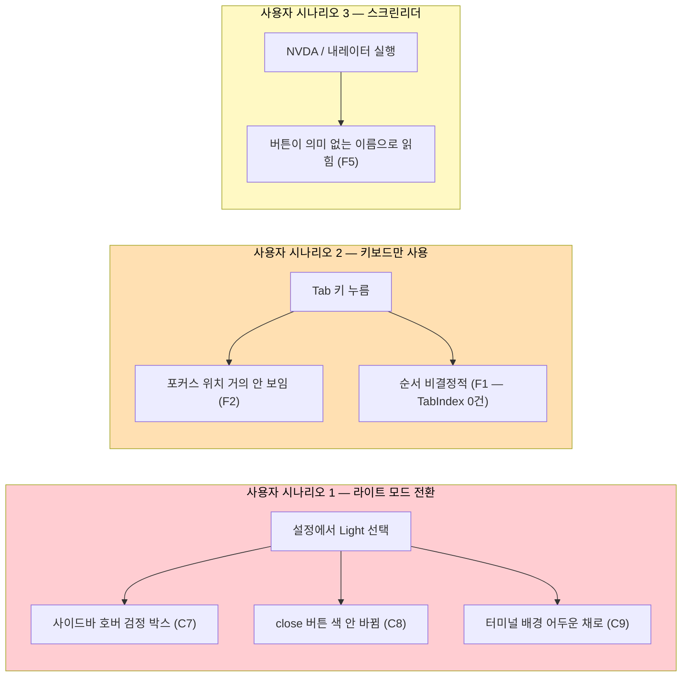
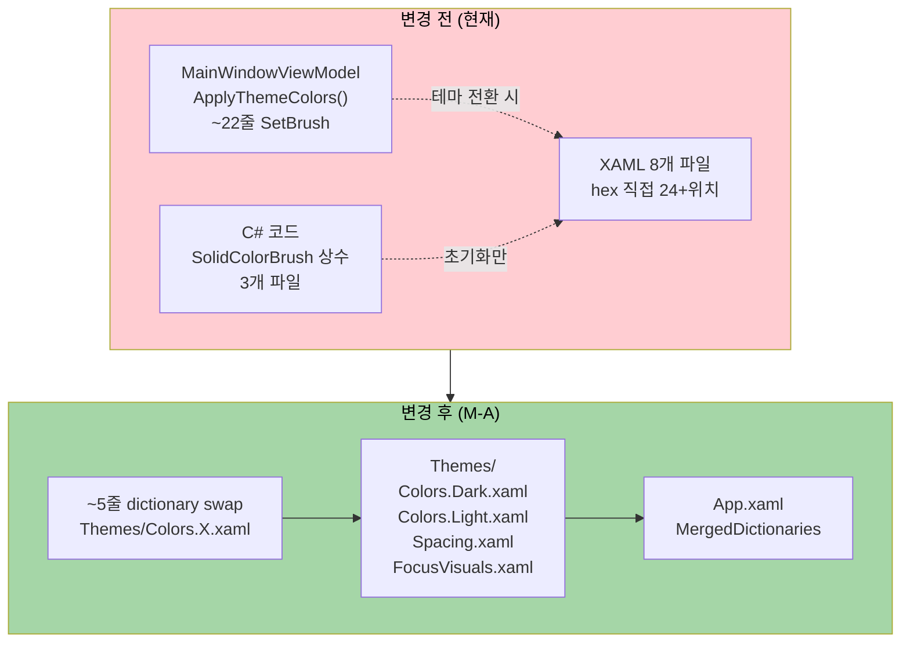
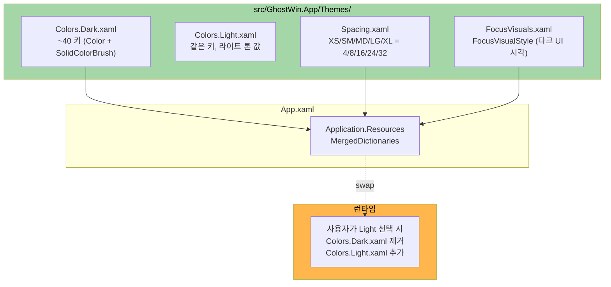
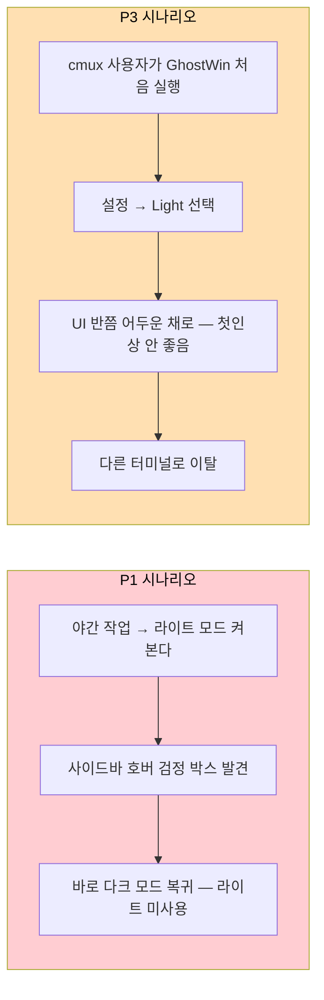
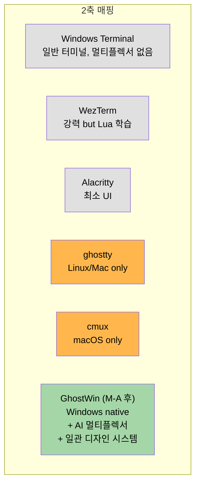
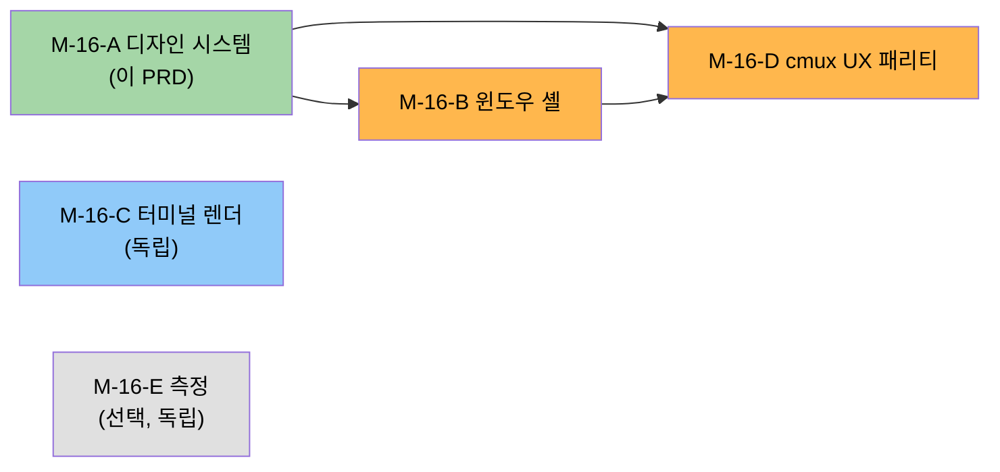

# PRD — M-16-A 디자인 시스템

> **한 줄 요약**: GhostWin 의 색·간격·포커스·접근성을 단일 디자인 토큰 시스템으로 정립하여, 라이트/다크 테마 전환의 명확한 버그(C7/C8/C9) 3건을 닫고, 이후 M-16 시리즈 4개 마일스톤이 안정적으로 쌓일 수 있는 base 를 제공한다.

## Executive Summary (4-Perspective)

| 관점 | 내용 |
|------|------|
| **Problem (현재 무엇이 깨져 있나)** | 색상 hex 값이 코드 전반 24+ 위치에 흩뿌려져 있고, 라이트 모드 전환 시 SidebarHover 가 검정 박스로 보임(C7), AccentColor·CloseHover·engine ClearColor 가 테마 전환에 반응하지 않음(C8/C9), 키보드 포커스 위치가 다크 UI 에서 거의 안 보임(F2), TabIndex/AutomationProperties.Name 명시가 0건이라 키보드·스크린리더 사용자가 UI 를 의미 있게 탐색 못 함. |
| **Solution (어떻게 해결하나)** | `src/GhostWin.App/Themes/` 폴더 신설 → `Colors.Dark.xaml` / `Colors.Light.xaml` / `Spacing.xaml` / `FocusVisuals.xaml` 4개 ResourceDictionary 로 분리. 테마 전환을 `Application.Resources.MergedDictionaries.Swap` 단일 패턴으로 통일하여 22줄 SetBrush 호출을 ~5줄로 축약. 모든 hex 를 `DynamicResource` 키로, ViewModel/Converter 의 `SolidColorBrush` 상수도 `Application.Current.FindResource` 로. C7/C8/C9 실명 버그 3건 동시 fix. |
| **Function & UX Effect (사용자가 무엇을 다르게 보게 되나)** | (1) 라이트 모드 사이드바 호버에 검정 박스가 사라지고 라이트 톤 회색으로 바뀜. (2) 라이트 모드에서 close 버튼·강조 색·터미널 background 도 라이트 톤으로 일관 전환. (3) Tab 키만으로 모든 폼 요소를 정해진 순서로 순회 가능. (4) 다크 UI 에서 Tab 포커스 위치가 명확한 outline 으로 보임. (5) 스크린리더가 모든 인터랙티브 요소를 의미 있는 이름으로 읽음. |
| **Core Value (이 마일스톤의 본질)** | "디자인 일관성" 자체보다 **"M-16 UI 완성도 시리즈 5개 마일스톤이 충돌 없이 쌓이는 base"** 가 본질. M-16-B 윈도우 셸이 FluentWindow 로 교체될 때, M-16-D ContextMenu 가 추가될 때, 모두 **단일 색·간격·포커스 시스템 위에서 작업**해야 retroactive rework 가 발생하지 않는다. 또한 부가적으로 GhostWin 의 첫 "라이트 모드 진정 지원" 출시. |

## Section 1 — Problem & User Context

### 1.1 사용자 직접 보고 결함 매핑

M-16-A 자체에 사용자가 PC 에서 직접 본 결함은 없다 (그것들은 M-16-C 분할 경계선/스크롤바/최대화 잘림 으로 흡수됨). 그러나 **C7/C8/C9 는 코드 read 만으로도 확정된 실명 버그** 로, 사용자가 PC 복귀 후 라이트 모드를 켜면 즉시 보일 결함이다.



### 1.2 페인 포인트 정량화

| 페인 | 위치 (코드 read 검증) | 사용자 영향 | 우선순위 |
|------|----------------------|------------|:-------:|
| C7 라이트 모드 SidebarHover = `#000000` 단색 (Opacity 누락) | `MainWindowViewModel.cs:256-257` | 라이트 모드 사용자 100% — 호버 시 검정 박스가 떠서 시각 깨짐 | 🔴 critical |
| C8 AccentColor / CloseHover Light branch 에 set 누락 | `MainWindowViewModel.cs:250-287` | 라이트 모드 사용자 100% — 강조색·close 버튼이 다크 톤으로 잔류 | 🔴 critical |
| C9 child HWND ClearColor 테마 전환 안 됨 (startup 1회) | `MainWindow.xaml.cs:277` | 라이트 모드 사용자 100% — 터미널 영역 background 가 어두운 채로 | 🔴 critical |
| C1-C6, C10-C13 색 hex 분산 + DynamicResource/StaticResource 혼재 | 8개 파일 24+ 위치 | 신규 마일스톤 작업 시 매번 hex 손댐 → 일관성 깨짐 | 🟠 high |
| #11 Spacing 매직 넘버 (4/6/8/12/16/24/32 mix) | 전체 XAML | 시각적으로 미묘하게 들쭉날쭉, 신규 작업 시 어느 값을 쓸지 매번 결정 | 🟡 medium |
| F1 TabIndex 0건 | 전체 XAML | 키보드 사용자가 Tab 키 순서 예측 못 함 | 🟠 high |
| F2 FocusVisualStyle 0건 | 전체 XAML | 다크 UI 에서 키보드 포커스 위치 거의 안 보임 | 🟠 high |
| F5 AutomationProperties.Name 일부 | 전체 XAML | 스크린리더 사용자 접근성 부족 | 🟡 medium |
| F6 Focusable=False 24건 (E2E + 사용자 차단 혼재) | 전체 XAML | 워크스페이스 ListBox 키보드 화살표 차단 등 | 🟡 medium |
| F7 Cursor="Hand" 단일 패턴 (5건) | 전체 XAML | 컨텍스트별 cursor 미사용 (IBeam, Wait 등) | 🟢 low |
| F8 hover 효과 일관성 검증 미완 | 전체 XAML | 일부 hover 동작 부재 가능 | 🟢 low |

### 1.3 Jobs-To-Be-Done (6-Part)

| Part | 내용 |
|------|------|
| **When** (상황) | Windows 개발자가 GhostWin 을 라이트 모드로 사용하거나, 키보드만으로 UI 를 탐색하거나, 시각 보조기술(스크린리더)을 사용할 때 |
| **I want to** (해야 할 일) | 모든 UI 요소가 선택한 테마(라이트/다크)에 맞게 자연스럽게 보이고, Tab 키만으로 폼을 순회할 수 있고, 포커스 위치를 시각적으로 알 수 있고, 스크린리더로 모든 버튼의 의미를 알 수 있다 |
| **So I can** (목적) | 시각 환경(밝은 사무실/어두운 야간)·입력 환경(키보드 only)·신체 조건(저시력)에 관계없이 GhostWin 을 차별 없이 사용할 수 있다 |
| **Currently** (현재 상태) | 라이트 모드는 일부만 작동(C7-C9), 키보드 포커스는 보이지 않음(F2), Tab 순서는 비결정적(F1), 스크린리더는 의미 없는 이름을 읽음(F5) |
| **Functional** (기능적 요구) | 단일 ResourceDictionary swap 으로 색·간격·포커스를 일관되게 전환, TabIndex/AutomationProperties.Name 을 모든 인터랙티브 요소에 명시 |
| **Emotional** (정서적 요구) | "라이트 모드도 진짜로 지원되는 도구다" 라는 신뢰감, "키보드만으로도 답답하지 않은 도구다" 라는 안정감, 그리고 개발자 입장에서 "신규 색상 작업할 때 어디 hex 쓸지 고민 안 해도 되는 도구" 라는 일관성 |

### 1.4 Why Now

- **2026-04-28** UI 완성도 감사 결과 39결함 중 **C7/C8/C9 가 코드 read 만으로도 100% 확정된 실명 버그** 로 발견됨
- **M-16-B/C/D 가 모두 M-A 의존**: FluentWindow 교체(M-B)·ContextMenu 추가(M-D)·터미널 렌더(M-C 일부) 모두 색 시스템 위에 작업하므로 M-A 가 늦으면 retroactive rework 누적
- **M-15 Stage A 직후의 자연스러운 흐름**: 측정 자동화는 확보됐고, 이제 사용자 체감 품질의 base 를 잡을 단계
- **사용자 PC 복귀 시 라이트 모드 시각 검증 가능**: 이번 마일스톤이 raw hardware 의존 단계가 거의 없는 base 작업이라 PC 미복귀 상태에서도 90% 진행 가능

## Section 2 — Solution Overview

### 2.1 핵심 아이디어 — Dictionary Swap 패턴



### 2.2 Themes 폴더 구조



### 2.3 21단계 작업 (M-A 마일스톤 stub 그대로 채택)

| 단계 | 내용 | 결함 흡수 | 추정 |
|:----:|---|---|:----:|
| 1 | `Themes/Colors.Dark.xaml` / `Colors.Light.xaml` 신설 (~40 키) | C* base | 1d |
| 2 | `Themes/Spacing.xaml` 신설 (XS/SM/MD/LG/XL **Margin/Padding 전용 Thickness 토큰**, P2-3) | #11 부분 | 0.5d |
| 3 | `Themes/FocusVisuals.xaml` 신설 | F2 | 0.5d |
| 4 | App.xaml MergedDictionaries 등록 + startup 사용자 설정 미리 적용 | C13 | 0.5d |
| 5 | CommandPaletteWindow.xaml hex 9건 → DynamicResource | C1 | 0.5d |
| 6 | NotificationPanelControl.xaml 자체 ResourceDict 제거 | C2 | 0.5d |
| 7 | MainWindow.xaml inline hex 5건 → DynamicResource | C3 | 0.5d |
| 8 | PaneContainerControl.cs SolidColorBrush 상수 → FindResource | C4 | 0.5d |
| 9 | WorkspaceItemViewModel Apple 색 4상수 → AgentRunningBrush 등 + INotifyPropertyChanged | C5 | 0.5d |
| 10 | ActiveIndicatorBrushConverter SolidColorBrush 상수 → ResourceDict | C6 | 0.5d |
| 11 | SettingsPageControl.xaml hex 직접 → DynamicResource | C12 | 0.5d |
| 12 | MainWindowViewModel.ApplyThemeColors → dictionary swap (~5줄) | C10 | 0.5d |
| 13 | **Light branch AccentColor / CloseHover / SidebarHover Opacity 정확 정의 — 실명 버그 fix** | **C7, C8** | 0.5d |
| 14 | **engine `RenderSetClearColor(uint rgb)` 콜백을 테마 전환 시 호출 — 실명 버그 fix** (호출 위치 — App.xaml.cs SettingsChangedMessage 확장 vs MainWindow.xaml.cs theme event vs ViewModel 의존성 신규 — 는 Design 결정, P2-2) | **C9** | 0.5d |
| 15 | DynamicResource/StaticResource 통일 | C11 | 0.5d |
| 16 | TabIndex 명시 (Settings, Sidebar 우선) | F1 | 1d |
| 17 | AutomationProperties.Name 보강 | F5 | 0.5d |
| 18 | Focusable=False 재검토 (E2E vs 사용자 차단 구분) | F6 | 0.5d |
| 19 | Cursor 다양화 (IBeam, Wait, Help, SizeWE) | F7 | 0.5d |
| 20 | hover 효과 일관성 grep + 정리 | F8 | 0.5d |
| 21 | 라이트 모드 시각 검증 (PC 복귀 시) | C7-C9 검증 | 0.5d |

**추정 총합**: 9-10 작업일 (1.5-2주)

### 2.4 Lean Canvas (1-pager)

| 칸 | 내용 |
|----|------|
| **Problem** | 라이트 모드 미동작 버그 3건(C7/C8/C9) + 색 hex 분산으로 신규 작업 시마다 일관성 깨짐 + 키보드/스크린리더 접근성 부재 |
| **Solution** | Themes/ ResourceDictionary 4개 + Dictionary swap 패턴 + TabIndex/AutomationProperties.Name 명시 |
| **Key Metrics** | hex 직접 사용 위치 0건 / 라이트 모드 시각 검증 통과 / Tab 키 순환 결정성 / 빌드 0 warning |
| **Unique Value Proposition** | "Windows 에서 진짜로 라이트/다크 모드를 모두 지원하면서 + 키보드만으로 완전 사용 가능한 + AI 에이전트 멀티플렉서 터미널" |
| **Unfair Advantage** | M-16 시리즈 base 완성 후 후속 4개 마일스톤이 일관 색·간격 위에서 작업되므로 retroactive rework 0 |
| **Channels** | 내부 도구 (본인 + 팀) → 잠재 OSS 공개 시 cmux 이주 사용자 |
| **Customer Segments** | (Section 3 Beachhead 참조) |
| **Cost Structure** | 9-10 작업일 (1.5-2주) — 시각 변경 위주 |
| **Revenue Streams** | N/A (비상업 / 내부 도구) |

## Section 3 — Target Users (Beachhead)

### 3.1 Beachhead Segment 4-Criteria 평가

| 기준 | 점수 (1-5) | 근거 |
|------|:---------:|------|
| **Reachable** (도달 가능성) | 5 | 본인 + 팀 (=즉시 도달) |
| **Affordable** (지불 능력) | N/A | 비상업 도구 — 의미 없음 |
| **Pain Severity** (고통 심도) | 4 | 라이트 모드 시각 깨짐은 즉시 체감, 키보드 접근성은 점진 체감 |
| **Strategic Value** (전략 가치) | 5 | M-16 시리즈 4개 마일스톤의 base — 막히면 후속 전체 막힘 |

→ **Beachhead 선택**: **본인 + 팀 내부 + (잠재) cmux 에서 macOS → Windows 이주하려는 사용자**

### 3.2 3 Personas

| Persona | 누구 | M-A 가 해결하는 핵심 페인 |
|---------|------|---------------------------|
| **P1 — Solitas (본인)** | 프로젝트 오너, Windows 11, AI 에이전트 멀티세션 사용자 | 신규 색상 작업할 때마다 어느 hex 쓸지 고민 끊기 + 라이트 모드도 실제로 동작하길 원함 |
| **P2 — 팀원 (내부 검증자)** | 같은 회사/개인 dev, 사이드 개발 환경 검증 | E2E 테스트 작성 시 Focusable=False 의 의도(차단 vs 도구)를 헷갈림 — F6 재검토로 명확화 필요 |
| **P3 — Potential cmux 이주자** | macOS 에서 cmux 사용 중, Windows 환경(회사 PC, WSL2 호스트) 추가 | cmux 의 라이트 모드 + 매끄러운 색 전환을 기대 — 현재 GhostWin 라이트 모드는 깨져 있어 첫인상에서 이탈 |

### 3.3 Persona 별 Story



## Section 4 — Market & Competitive Context

### 4.1 비상업 컨텍스트 명시

> **TAM/SAM/SOM 은 본 프로젝트가 비상업/내부 도구 우선이므로 매출 단위로 추정하지 않는다.** 잠재 사용자 풀로만 컨텍스트를 잡는다.

| 단계 | 잠재 사용자 풀 | 근거 |
|------|---------------|------|
| **TAM (잠재 OSS 공개 시)** | Windows 개발자 + AI 에이전트 사용자 (대략 10-100만 단위, 정확 수치 불명) | Windows Terminal MAU 는 비공개. cmux 는 macOS 한정 약 10,940 GitHub stars (2026-04 기준). 추측 |
| **SAM (도달 가능 풀)** | cmux 이주 macOS→Windows 사용자 + Claude Code 한국어/일본어 사용자 (수백~수천 단위) | cmux Windows 포팅 이슈 실제 존재. 추측 |
| **SOM (현실 도달)** | 본인 + 팀 + (선택) 한국 dev 커뮤니티 노출 시 수십 단위 | 즉시 도달 |

### 4.2 5 Competitors

| 경쟁자 | 라이트 모드 | 키보드 접근성 | 디자인 토큰 | GhostWin M-A 차별점 |
|--------|:---------:|:------------:|:----------:|---------------------|
| **Windows Terminal** (MS) | ✅ 정상 | ✅ Tab 순서 결정적 | ✅ JSON theme | 멀티플렉서 없음 (cmux 류 UX 부재) |
| **WezTerm** (cross-platform) | ✅ Lua config | 🟡 일부 | ✅ Lua theme | Lua DSL 학습 부담, AI 에이전트 통합 부재 |
| **Alacritty** (cross-platform) | ✅ TOML config | 🟡 단순 | 🟡 TOML | UI 자체가 거의 없음 (멀티플렉서 외부 tmux 의존) |
| **ghostty** (Linux/Mac only) | ✅ 정상 | ✅ | ✅ | **Windows 미지원** — 이게 GhostWin 존재 이유 |
| **cmux** (macOS only) | ✅ 정상 (참고 모델) | ✅ macOS 표준 | ✅ SwiftUI tokens | **macOS 한정** — Windows 에서 동등 경험 불가 |

→ **GhostWin M-A 의 의의**: 위 표에서 라이트 모드 + 키보드 접근성 + 디자인 토큰 3가지를 **Windows native + AI 에이전트 멀티플렉서** 라는 조합으로 동시 만족하는 유일한 옵션을 만든다.

### 4.3 Differentiation Map



## Section 5 — Functional Requirements

### 5.1 FR 목록 (필수 / 선택)

| FR | 내용 | 흡수 결함 | 우선순위 |
|----|------|-----------|:-------:|
| **FR-01** | `src/GhostWin.App/Themes/` 폴더에 `Colors.Dark.xaml`, `Colors.Light.xaml` 생성 — 동일 키 ~40개를 양쪽에 정의 | C1-C6, C10-C13 | 🔴 필수 |
| **FR-02** | `Themes/Spacing.xaml` 생성 — `Spacing.XS=4`, `Spacing.SM=8`, `Spacing.MD=16`, `Spacing.LG=24`, `Spacing.XL=32` **Thickness 토큰 (Margin/Padding 전용, P2-3)**. Width/Height/MaxWidth/FontSize/RowDef/ColDef 매직 넘버는 별도 mini-milestone (`m16-a-spacing-extra` 후보) 분리 | #11 부분 | 🔴 필수 |
| **FR-03** | `Themes/FocusVisuals.xaml` 생성 — 다크/라이트 양 모드에서 명확히 보이는 FocusVisualStyle 1개 | F2 | 🔴 필수 |
| **FR-04** | `App.xaml` MergedDictionaries 등록 + 시작 시 사용자 설정에서 즉시 dark/light 결정 (Light 시작 시 frame 깜박임 fix) | C13 | 🔴 필수 |
| **FR-05** | XAML 8개 파일 (CommandPalette / NotificationPanel / MainWindow / SettingsPage / 등) 의 hex 직접 사용을 모두 `DynamicResource` 키로 치환 | C1, C2, C3, C12 | 🔴 필수 |
| **FR-06** | C# 코드 3개 파일 (PaneContainerControl / WorkspaceItemViewModel / ActiveIndicatorBrushConverter) 의 `SolidColorBrush` 상수를 `Application.Current.FindResource` + INotifyPropertyChanged 갱신으로 치환 | C4, C5, C6 | 🔴 필수 |
| **FR-07** | `MainWindowViewModel.ApplyThemeColors` 22줄 SetBrush 호출을 `MergedDictionaries.Swap` 5줄로 단순화 | C10 | 🔴 필수 |
| **FR-08** | **Light branch 의 AccentColor / CloseHover / SidebarHover Opacity 정확 정의 (실명 버그 fix)** | **C7, C8** | 🔴 필수 |
| **FR-09** | **engine `RenderSetClearColor(uint rgb)` 콜백을 테마 전환 시 호출** (startup 1회 → 테마 변경 시 호출, 실명 버그 fix). API 이름 정정 — `SetClearColor` 아님 (P2-2). 호출 위치 (App.xaml.cs SettingsChangedMessage 확장 vs MainWindow.xaml.cs theme event vs ViewModel 의존성 신규) 는 Design 결정 | **C9** | 🔴 필수 |
| **FR-10** | DynamicResource/StaticResource 혼재 통일 (테마 전환 영향 색은 모두 DynamicResource) | C11 | 🟠 권장 |
| **FR-11** | 핵심 폼 (Settings, Sidebar) 에 TabIndex 명시 — Tab 순서 결정적 | F1 | 🟠 권장 |
| **FR-12** | 모든 인터랙티브 요소에 AutomationProperties.Name 보강 | F5 | 🟠 권장 |
| **FR-13** | Focusable=False 24건 재검토 — E2E 자동화 의도(유지) vs 사용자 키보드 차단 의도(제거) 구분 | F6 | 🟠 권장 |
| **FR-14** | Cursor 다양화 — 텍스트 영역 IBeam, 비활성 영역 Wait, 도움말 트리거 Help, splitter SizeWE | F7 | 🟡 선택 |
| **FR-15** | hover 효과 일관성 grep 정리 — 누락된 곳에 표준 hover style 추가 | F8 | 🟡 선택 |

### 5.2 NFR (비기능 요구)

| NFR | 내용 | 검증 방법 |
|-----|------|----------|
| **NFR-01** | 빌드 0 warning (Debug + Release) | `msbuild GhostWin.sln /p:Configuration=Debug /p:Platform=x64` |
| **NFR-02** | 단위 테스트 영향 없음 (시각 변경만) | C# 테스트 (`tests/GhostWin.Core.Tests` + `tests/GhostWin.App.Tests` + `tests/GhostWin.E2E.Tests`) 회귀 0 + C++ 테스트 (`tests/GhostWin.Engine.Tests.vcxproj` — `.vcxproj`) 회귀 0 (P1) |
| **NFR-03** | 테마 전환 응답 시간 < 100ms (사용자 체감 instant) | 수동 측정 (M-15 측정 인프라 활용 가능) |
| **NFR-04** | 라이트 모드 시각 검증 통과 (C7/C8/C9) | PC 복귀 후 시각 검사 |
| **NFR-05** | E2E 테스트 영향 없음 (Focusable=False E2E 의도 유지된 곳 체크) | `tests/GhostWin.MeasurementDriver` 시나리오 회귀 |

## Section 6 — Success Metrics

### 6.1 측정 가능 지표

| 지표 | Before (현재) | After (목표) | 측정 |
|------|:-------------:|:-----------:|------|
| hex 직접 사용 위치 (XAML + C#) | 24+ | 0 | grep `#[0-9A-Fa-f]{6}` |
| `SolidColorBrush` 인라인 상수 (C# 코드) | 8개 (3 파일) | 0 | grep `new SolidColorBrush` |
| ResourceDictionary 통합 키 수 | ~10 (산재) | ~40 (Themes/) | Read |
| 테마 전환 시 SetBrush 호출 수 | 22줄 | ~5줄 (swap) | Read |
| TabIndex 명시 인터랙티브 요소 비율 | 0% | 100% (Settings + Sidebar 폼) | Read |
| FocusVisualStyle 명시 비율 | 0% | 100% | Read |
| AutomationProperties.Name 명시 비율 | ~30% (추정) | 100% | Read + grep |
| 빌드 warning 수 | 0 (현재 유지) | 0 | msbuild |

### 6.2 시각 검증 체크리스트 (PC 복귀 후)

- [ ] 라이트 모드 사이드바 호버 시 검정 박스 사라짐 (C7)
- [ ] 라이트 모드 close 버튼이 라이트 톤 (C8)
- [ ] 라이트 모드 강조색이 라이트 톤 (C8)
- [ ] 라이트 모드 터미널 background 가 라이트 톤 (C9)
- [ ] 다크 모드 Tab 키 누르면 포커스 outline 명확히 보임 (F2)
- [ ] Tab 키만으로 Settings 폼 모든 요소 결정적 순서로 순회 (F1)
- [ ] NVDA / 내레이터로 모든 버튼이 의미 있는 이름 읽힘 (F5)

## Section 7 — Risks & Mitigations

### 7.1 리스크 매트릭스

| # | 리스크 | 심각도 | 가능성 | 완화 |
|:-:|-------|:-----:|:------:|------|
| R1 | wpfui `ApplicationThemeManager.Apply` 와 자체 dictionary swap 이중 적용 시 race | 🔴 high | 🟠 medium | 책임 정리 — wpfui 에는 wpfui 전용 키만 맡기고 GhostWin 키는 자체 swap 단일화 (C10 흡수) |
| R2 | XAML 8개 파일 × C# 3개 파일 동시 변경 — diff 큼 | 🟠 medium | 🔴 high | FR 단위로 commit 분리 (FR-01 → FR-02 → … → FR-15), 각 commit 빌드 통과 확인 |
| R3 | engine ClearColor 갱신 시 child HWND 재초기화 불필요 검증 부족 | 🟠 medium | 🟠 medium | 기존 startup 1회 코드 (`MainWindow.xaml.cs:277`) 와 동일 API 만 호출, 추가 부작용 없음 검증 |
| R4 | TabIndex 명시 변경이 E2E 테스트 의존 (`E2E_TerminalHost` 등) 깰 가능성 | 🟠 medium | 🟢 low | M-15 Stage A E2E 회귀 시나리오 idle/resize-4pane/load 3건 통과 확인 |
| R5 | INotifyPropertyChanged 갱신 누락으로 일부 ViewModel 색이 테마 전환에 안 따라감 | 🟠 medium | 🟠 medium | C5 작업 시 모든 brush property 에 OnPropertyChanged 명시, 단위 테스트 추가 가능 |
| R6 | 라이트 모드 시각 검증을 PC 복귀 전까지 못 함 | 🟢 low | 🔴 certainty | 코드 read + 색 값 검증으로 90% 사전 확정. 시각 검증은 step 21 로 마무리 단계 분리 |
| R7 | Focusable=False 재검토 시 E2E 자동화 의도와 사용자 차단 의도가 코드만으로 구분 어려움 | 🟢 low | 🟠 medium | 각 위치를 PR 리뷰에서 주석 추가 — `// E2E: keep` vs `// UX: remove` |

### 7.2 작업 분리 시 안전 전략

```mermaid
graph LR
    subgraph day12["Day 1-2 (안전 구간)"]
        D1["FR-01 Themes/ 신설"]
        D2["FR-02 Spacing.xaml"]
        D3["FR-03 FocusVisuals.xaml"]
        D4["FR-04 App.xaml 등록"]
    end

    subgraph day35["Day 3-5 (XAML 치환)"]
        D5["FR-05 hex → DynamicResource (8 파일)"]
    end

    subgraph day67["Day 6-7 (C# 치환)"]
        D6["FR-06 SolidColorBrush 상수 → FindResource"]
        D7["FR-07 ApplyThemeColors → swap"]
    end

    subgraph day8["Day 8 (실명 버그 fix — 마일스톤 핵심 가치)"]
        D8["FR-08 C7, C8 fix"]
        D9["FR-09 C9 fix"]
    end

    subgraph day910["Day 9-10 (접근성 + 검증)"]
        D10["FR-10~13 통일 + 접근성"]
        D11["FR-14, 15 cursor + hover"]
        D12["Step 21 시각 검증 (PC 복귀)"]
    end

    day12 --> day35 --> day67 --> day8 --> day910

    style day8 fill:#FFCDD2,color:#000
    style day12 fill:#A5D6A7,color:#000
    style day910 fill:#E1BEE7,color:#000
```



## Section 8 — Out of Scope & Dependencies

### 8.1 이번 마일스톤에서 하지 않을 것 (M-16 시리즈 분리)

| 항목 | 어디로 | 이유 |
|------|-------|------|
| Mica 백드롭 적용 | M-16-B 윈도우 셸 | FluentWindow 교체 + ClientAreaBorder 와 묶음 |
| GridSplitter (Sidebar/Notif divider) | M-16-B | 윈도우 셸 transition 작업과 묶음 |
| NotificationPanel/Settings 토글 transition | M-16-B | GridLengthAnimation 패턴, 셸 작업과 묶음 |
| ContextMenu 4영역 | M-16-D cmux UX 패리티 | 색·포커스 시스템 위에서 작업해야 함 (M-A 의존) |
| DragDrop A (워크스페이스 재정렬) | M-16-D | M-A + M-B 양쪽 의존 |
| 분할 경계선 padding-balance / dim overlay | M-16-C 터미널 렌더 | 사용자 직접 본 결함, 독립 마일스톤 |
| 스크롤바 시스템 / 최대화 잔여 padding 검증 | M-16-C | 터미널 렌더 영역, 독립 |
| PaneContainer visual tree 재구축 측정 | M-16-E (선택) | M-15 인프라 재사용, 독립 |
| i18n / 다국어 | 별도 마일스톤 후보 | 한국어 UI 부재 — 영어 hardcode 100% (별도 분리 필요) |

### 8.2 진입 조건

- ✅ M-15 Stage A 완료 (2026-04-27 archived)
- ✅ UI 완성도 감사 완료 (`docs/00-research/2026-04-28-ui-completeness-audit.md`)
- 🟡 PC hardware 접근 — 마일스톤 90% 진행 가능, step 21 시각 검증만 PC 필요

### 8.3 후속 마일스톤 의존성



### 8.4 비전 3대 축 기여도

| 비전 축 | M-A 기여 |
|--------|---------|
| ① cmux 기능 탑재 | 🟡 간접 — 색·포커스 base 가 없으면 cmux UX (ContextMenu/DragDrop) 가 일관성 깸 |
| ② AI 에이전트 멀티플렉서 기반 | 🟢 직접 (간접) — 라이트 모드 사용자 (밝은 사무실 AI dev) 가 GhostWin 을 신뢰하고 사용할 수 있게 |
| ③ 타 터미널 대비 성능 우수 | ⚪ 무관 — 시각 변경 위주, 성능 영향 없음 |

→ M-A 는 비전 ① 의 base + 비전 ② 의 라이트 모드 사용자 신뢰 회복. 비전 ③ 는 M-15 Stage B 또는 M-17 으로 별도.

---

## Plan 단계 진입 추천

이 PRD 의 분석 결과 M-16-A 는 다음 조건을 모두 만족합니다:

- 사용자 직접 보고 결함은 없으나 코드 read 만으로도 **C7/C8/C9 실명 버그 3건 확정**
- 후속 4개 마일스톤(M-B/C/D/E)의 base 로 retroactive rework 방지
- 비상업/내부 컨텍스트에 부합하는 명확한 범위 (1.5-2주)
- 진입 조건 모두 충족 (M-15 Stage A 완료, UI 감사 완료)
- PC hardware 의존이 마지막 단계만 (90% 사전 진행 가능)

**다음 단계**:

```bash
/pdca plan m16-a-design-system
```

→ Plan 문서가 본 PRD 를 자동 참조하여 21단계 작업의 실행 순서·각 단계 산출물·검증 기준을 구체화합니다.

---

## Revision History

| Version | Date | Changes |
|---------|------|---------|
| 0.1 | 2026-04-28 | Initial PRD by PM Agent Team (pm-discovery + pm-strategy + pm-research + pm-prd) |
| 0.2 | 2026-04-28 | Plan 0.2 사용자 리뷰 4건 fix 일부 PRD 반영 — (P1) NFR-02 의 테스트 명령을 실제 워크트리 검증 결과로 정정 (C# 3 csproj + C++ vcxproj 분리). (P2-2) Section 2.3 단계 14 + Section 5.1 FR-09 의 API 이름 `SetClearColor` → `RenderSetClearColor(uint rgb)` 정정, 콜백 호출 위치 결정을 Design 으로 보류 명시. (P2-3) Section 2.3 단계 2 + Section 5.1 FR-02 의 Spacing 토큰 범위를 Margin/Padding 전용 Thickness 로 좁힘, Width/Height/FontSize/RowDef/ColDef 매직 넘버는 별도 mini-milestone (`m16-a-spacing-extra`) 분리 명시. P2-1 (영향 파일 트리) 은 PRD 에 해당 표 없음으로 Plan 에서만 정정. |

---

*Attribution: PM Agent Team analysis frameworks adapted from [pm-skills](https://github.com/phuryn/pm-skills) by Pawel Huryn (MIT License) — JTBD 6-Part VP, Lean Canvas, Opportunity Solution Tree, Beachhead 4-Criteria.*
