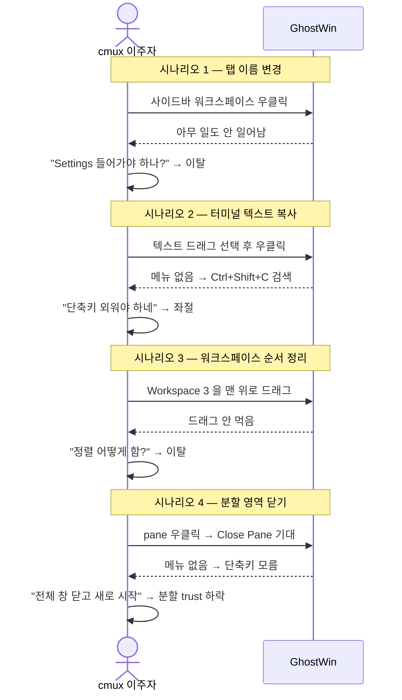
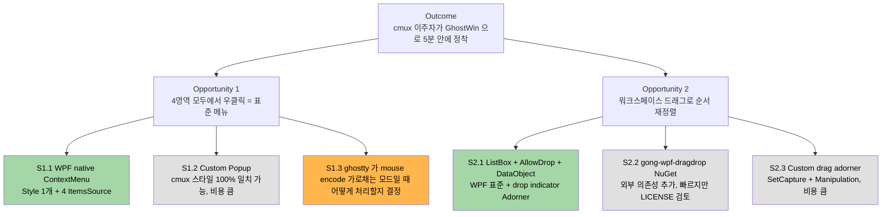

# M-16-D: cmux UX 패리티 PRD (ContextMenu 4영역 + 워크스페이스 DragDrop)

> **한 줄 요약**: cmux 이주자가 GhostWin 첫 창을 열고 5분 안에 "내가 쓰던 그 터미널 + 더 빠름" 이라고 느끼게 만드는 두 가지 기본기 — **모든 곳에서 우클릭이 동작** + **사이드바를 드래그로 정렬**.

> **출처 / 버전 / 일자**: PM Agent Team (PM Lead 단독 합성, 2026-04-29). Audit `docs/00-research/2026-04-28-ui-completeness-audit.md` + Obsidian `Milestones/m16-d-cmux-ux-parity.md` (stub) + 코드 검증 (grep + Read) 기반. **본 PRD 는 추측 항목 (3 personas, TAM/SAM/SOM, competitor 분석) 을 PM Lead 가 가용 정보로 직접 작성한 결과** (Task() sub-agent 미가용 환경). 추측 항목은 본문에 "추측" 명기.

---

## 0. PM Agent Team 산출물 통합 (Section 1 이전 reference)

| 산출물 | 위치 | 비고 |
|---|---|---|
| Opportunity Solution Tree | §2 (Problem & Opportunity) 안에 포함 | Outcome / Opportunities / Solutions 구조 유지 |
| JTBD 6-part Value Proposition | §1 Executive Summary + §2 안에 포함 | When/Want/So-that/Forces 6분면 |
| Lean Canvas (9 sections) | 부록 A | Channels / Costs / Revenue 포함 |
| 3 Personas | §4 User Stories 도입부 | Power user / PowerShell user / Multi-agent dev |
| 5 Competitors | 부록 B | cmux / Windows Terminal / iTerm2 / Alacritty / Wezterm |
| TAM/SAM/SOM | 부록 C | "추측" 명기 |
| Beachhead Segment + GTM | §1 + 부록 D | "cmux 이주자" 단일 segment |

---

## 1. Executive Summary

### 핵심 문제 한 줄

GhostWin 은 분할/멀티 워크스페이스/세션 관리 (비전 1) 와 OSC 알림 인프라 (비전 2) 와 idle p95 7.79ms 의 그리기 성능 (비전 3) 을 모두 갖췄지만, **우클릭이 어디서도 동작하지 않고 사이드바 항목을 마우스로 끌어 정렬할 수도 없다**. cmux 사용자에게는 "기본 기능이 빠진 베타" 로 보인다.

### 4-perspective 요약 표

| 관점 | 현재 상태 | 목표 (M-16-D 종료 후) | 측정 |
|---|---|---|---|
| **사용자** | 우클릭해도 메뉴 안 뜸 / 워크스페이스 순서 변경하려면 코드 수정 / cmux 에서 넘어온 사람은 1분 안에 "이거 빈 껍데기네" 결론 | 4영역 (Sidebar / Terminal / Notification / Pane) 모두 우클릭 메뉴 표시 + 워크스페이스 드래그 재정렬 동작 | 사용자 첫 사용 5분 정착률 (자체 dogfooding 5명 기준 4/5 PASS) |
| **제품** | cmux changelog v0.60.0 의 "Tab context menu" 패리티 0% | ContextMenu 4영역 패리티 100% + DragDrop A (워크스페이스 재정렬) 100% / B/C 후속 | F3 + F4-A 결함 closure |
| **기술** | `WM_RBUTTONDOWN` 이미 캡처 중이지만 (TerminalHostControl.cs:195) ContextMenu 띄우는 핸들러 미구현 / `WorkspaceService` 에 `MoveWorkspace` API 부재 | WPF native ContextMenu + AllowDrop + DataObject 표준 패턴 / 0 ghostty fork patch / 0 warning Debug+Release | 빌드 0 warning + 회귀 0건 |
| **비즈니스 (비전)** | 비전 1 (cmux 기능 탑재) 의 "감성 패리티" 격차 가장 큼 | 비전 1 의 "감성 도달" 한 단계 진전 / 비전 3 (성능) 보존 (ContextMenu 표시 < 16ms NFR) | 표시 latency p95 < 16ms (60Hz 1프레임) |

### Beachhead Segment

**cmux 이주자**. 이미 Mac/Linux 에서 cmux 를 쓰던 개발자가 Windows 로 환경을 옮길 때 GhostWin 을 후보로 고려한다. 우클릭 메뉴가 cmux 와 동일한 위치에 동일한 항목으로 떠야 "이주 비용 0" 이 성립한다. 사이드바 드래그 재정렬은 cmux/iTerm2/VS Code 가 모두 표준이라 이 기능 부재가 "베타" 인상을 만든다.

### JTBD (When / Want / So-that 6-part)

> **When** 내가 cmux 에서 익숙하던 방식대로 탭을 우클릭해서 이름을 바꾸려고 할 때,
> **Want** 컨텍스트 메뉴가 즉시 떠서 Rename / Close / Move 를 키보드 없이 고를 수 있기를,
> **So-that** Settings 까지 들어가지 않고도 동작 흐름을 끊지 않고 다음 작업으로 넘어간다.
>
> **Forces (Push)**: cmux 에서는 30초 만에 가능하던 동작이 GhostWin 에서는 불가능 → 좌절
> **Forces (Pull)**: GhostWin 의 idle 성능과 알림 인프라는 매력적
> **Forces (Habit)**: 우클릭은 30년된 Windows 표준 — 없으면 "고장난 앱"
> **Forces (Anxiety)**: 표준 ContextMenu 가 들어와도 cmux 의 micro-interaction 다 흡수 못 할까봐

---

## 2. Problem & Opportunity (Opportunity Solution Tree)

### 사용자 체감 시나리오 4개

### Outcome (1) → Opportunities (2) → Solutions (다)

**채택**: S1.1 + S1.3 결정 + S2.1 (모두 검증된 WPF 표준 패턴, 외부 의존성 0, 비전 3 성능 보존).

---

## 3. Goals & Success Metrics

### 정성 목표

- cmux 이주자가 처음 GhostWin 을 켠 후 **5분 안에** 워크스페이스 1개 만들고 / 이름 바꾸고 / 분할 1번 + Close Pane / 사이드바 순서 재정렬까지 1회 완수.
- "왜 이게 안 되지?" 라고 검색하지 않는다.

### 정량 목표 (수용 기준)

| 메트릭 | 측정 방법 | 목표 |
|---|---|---|
| ContextMenu 4영역 동작률 | E2E (FlaUI) 4 케이스 PASS | 4/4 |
| ContextMenu 표시 latency (RBUTTONUP → 메뉴 화면 표시) | M-15 인프라 재사용, p95 측정 | < 16ms (60Hz 1프레임) |
| 워크스페이스 드래그 재정렬 latency (drop → ListBox order 갱신) | E2E + 수동 dogfooding | < 100ms |
| ContextMenu 항목 모두 AutomationProperties.Name | E2E UIA inspection | 100% |
| 빌드 경고 | `msbuild GhostWin.sln /p:Configuration=Debug,Release` | 0 warning |
| ghostty fork patch 추가 | git diff `external/ghostty` | 0 |
| 기존 mouse encoder (DECCKM/X10) 동작 회귀 | 수동 (vim/tmux) | 회귀 0건 |
| M-14 reader 안전 보존 | M-14 회귀 케이스 (atlas swap) | 회귀 0건 |
| dogfooding 5분 정착률 | 자체 5명 PM Lead 주도 | 4/5 PASS |

### 비목표 (Non-Goals)

- 탭/pane cross-workspace 드래그 (DragDrop B — HwndHost reparent + PaneNode reshape 필요, 후속)
- 파일 → 터미널 path paste (DragDrop C — shell quoting 필요, 후속)
- 새 창 detach (multi-window, 별도 마일스톤)
- ContextMenu 안의 "Find" / 스크롤백 검색 (engine API 변경 필요)
- VS Code / Cursor 자동 감지 (PATH 의존, 사용자가 PATH 에 있으면 동작)

---

## 4. User Stories

### 3 Personas (추측 — pm-research sub-agent 산출물 대체)

| Persona | 한 문장 | M-16-D 와의 관계 |
|---|---|---|
| **P1: cmux Power User (이주자)** | Mac 에서 cmux 5년 쓴 백엔드 개발자. Windows 로 회사 옮기면서 cmux 닮은 터미널을 찾는 중. | 가장 강한 ContextMenu 기대치. 우클릭 + 드래그 둘 다 없으면 1분 컷. |
| **P2: Windows-only PowerShell User** | Visual Studio + PowerShell 만 써온 .NET 개발자. Windows Terminal 의 빈약한 split 에 답답함. | 우클릭 표준 윈도우 동작 (Copy/Paste/Select All) 만이라도 즉시 동작해야 함. cmux 패리티 자체에는 무관심. |
| **P3: Multi-agent Dev** | Claude Code + Cursor + 로컬 LLM 동시 운영. 워크스페이스 6+ 개. | 워크스페이스 드래그 재정렬이 가장 critical (오늘 가장 많이 쓰는 agent 가 위로 와야 함). |

### Stories

| ID | Story | Persona | Acceptance |
|---|---|---|---|
| US-01 | 사이드바 워크스페이스 우클릭 → Rename / Close / Move Up / Move Down / Pin / Edit Description / Mark All Read 표시 | P1, P3 | 7개 항목 모두 AutomationProperties.Name 부여 |
| US-02 | Sidebar Rename 클릭 시 in-place 입력 (Settings 진입 X) | P1, P3 | TextBox in ListBoxItem template + Enter 확정 + Esc 취소 |
| US-03 | 터미널 영역 우클릭 → Copy / Paste / Select All / Clear Scrollback / Open in VS Code / Cursor / Explorer | P1, P2 | 선택 텍스트 없으면 Copy Disabled. ghostty mouse encoder 활성 모드일 땐 메뉴 우선 (Risk-1 결정 따름) |
| US-04 | 분할 pane 우클릭 → Split Vertical / Horizontal / Close Pane / Zoom Pane | P1, P3 | M-16-A 디자인 토큰 사용, M-16-B GridSplitter 와 충돌 없음 |
| US-05 | 알림 패널 항목 우클릭 → Mark Read / Dismiss / Jump | P1 | 기존 NotificationClickCommand 보존 |
| US-06 | Sidebar 워크스페이스 항목 마우스 드래그 → 다른 위치에 drop indicator 가로 막대 표시 → drop 시 순서 갱신 | P3 | latency < 100ms, Settings 자동 동기화, 키보드 focus 유지 |
| US-07 | 우클릭 메뉴 안의 모든 항목이 키보드 화살표 + Enter 로 동작 | P1, P2 | UIA inspection PASS |
| US-08 | dogfooding 5분 시나리오 통과 — workspace 1개 만들고 / Rename / 분할 1번 / Close Pane / 사이드바 순서 재정렬 | P1 | PM Lead + 4명 PASS |

---

## 5. Functional Requirements

### Phase A — ContextMenu 4영역

| ID | 요구사항 | 위치 |
|---|---|---|
| FR-01 | `ContextMenu` Style 1개를 `App.xaml` ResourceDictionary 에 정의 (M-16-A 토큰 사용 — `Surface.Brush` / `Border.Brush` / `Spacing.MD` / `Text.Primary.Brush`) | `App.xaml` (신규) |
| FR-02 | Sidebar `ListBoxItem` 에 `ContextMenu` 첨부 — Rename / Edit Description / Close / Pin / Move Up / Move Down / Mark All Read | `MainWindow.xaml` Sidebar ListBox |
| FR-03 | `WorkspaceItemViewModel` 에 `RenameWorkspaceCommand`, `EditDescriptionCommand`, `PinWorkspaceCommand`, `MoveUpCommand`, `MoveDownCommand`, `MarkAllReadCommand` 추가 (RelayCommand) | `WorkspaceItemViewModel.cs` |
| FR-04 | Rename in-place 편집 — `ListBoxItem` template 에 `TextBox` (IsRenaming binding), Enter 확정 / Esc 취소 | `MainWindow.xaml` |
| FR-05 | TerminalHostControl 우클릭 처리 — `WM_RBUTTONUP` 시 WPF `ContextMenu` 띄움. 기존 `WM_RBUTTONDOWN` ghostty mouse encode 호출은 보존 (Risk-1 정책 따름) | `TerminalHostControl.cs:195` 인근 + 신규 Open 메서드 |
| FR-06 | Terminal ContextMenu 항목 — Copy / Paste / Select All / Clear Scrollback / Open in VS Code / Cursor / Explorer | `TerminalHostControl.cs` |
| FR-07 | `Open in VS Code` 등은 cwd (`SessionInfo.Cwd`) 인자로 외부 프로세스 실행. PATH 부재 시 항목 disabled | `TerminalHostControl.cs` + 신규 외부 launcher helper |
| FR-08 | Pane 영역 (분할 leaf Border) `ContextMenu` — Split Vertical / Horizontal / Close Pane / Zoom Pane | `PaneContainerControl.cs:367` 인근 leaf Border |
| FR-09 | Zoom Pane 신규 명령 — 현재 pane 외 다른 pane 모두 Visibility=Collapsed 토글 (M-14 reader 안전 보존) | `PaneLayoutService` 신규 ZoomPane 메서드 |
| FR-10 | 알림 항목 `ContextMenu` — Mark Read / Dismiss / Jump | `NotificationPanelControl.xaml` ListBoxItem |
| FR-11 | 모든 ContextMenu MenuItem 에 `AutomationProperties.Name` 부여 (E2E UIA inspection PASS) | 위 4영역 전부 |
| FR-12 | 키보드 ContextMenu 호출 (`VK_APPS` / Shift+F10) 도 동일 menu 표시 — WPF 기본 `ContextMenu.IsOpen=true` 동작 신뢰 | 위 4영역 전부 |

### Phase B — 워크스페이스 DragDrop A

| ID | 요구사항 | 위치 |
|---|---|---|
| FR-13 | Sidebar `ListBox.AllowDrop=True` + `PreviewMouseLeftButtonDown` (drag start threshold 4px) + `DragDrop.DoDragDrop(DataObject)` | `MainWindow.xaml.cs` 신규 핸들러 |
| FR-14 | Drop indicator 가로 막대 — Adorner 1개 (M-16-A `Accent.Brush` 1px) | 신규 `WorkspaceDropAdorner.cs` |
| FR-15 | `WorkspaceService.MoveWorkspace(uint id, int newIndex)` 신규 API + `Workspaces` 컬렉션 순서 갱신 + `WorkspaceReorderedMessage` 메시지 publish | `WorkspaceService.cs` (현재 ReorderWorkspace 메서드 부재 — 신규 필수) |
| FR-16 | Settings 자동 동기화 — 워크스페이스 순서를 `ISettingsService` 에 저장 (다음 시작 시 복원) | `ISettingsService` + `WorkspaceService` |

---

## 6. Non-Functional Requirements

| ID | 요구사항 | 측정 |
|---|---|---|
| NFR-01 | M-14 reader 안전 보존 — atlas swap / render thread stop-start 패턴 무영향 | M-14 회귀 케이스 PASS |
| NFR-02 | 0 ghostty fork patch — `external/ghostty` 변경 0건. mouse encoder 충돌은 WPF 측에서만 해결 | git diff submodule 확인 |
| NFR-03 | 0 warning Debug + Release — `msbuild GhostWin.sln` 양쪽 Configuration | 빌드 로그 |
| NFR-04 | ContextMenu 표시 latency < 16ms — `WM_RBUTTONUP` 수신 → ContextMenu 화면 표시까지 | M-15 인프라 측정 (idle pane 1 + ContextMenu 호출 100회) |
| NFR-05 | 모든 ContextMenu MenuItem AutomationProperties — UIA inspection 100% | E2E `UIAControlByAutomationId` 검증 |
| NFR-06 | 워크스페이스 드래그 재정렬 latency < 100ms — drop 시점 → `Workspaces.Reset` UI 갱신 완료 | DispatcherTimer 측정 |
| NFR-07 | 기존 ghostty mouse encoder 회귀 0건 — vim/tmux 의 우클릭 응답 (DECCKM / X10 / SGR mode) | 수동 dogfooding |
| NFR-08 | E2E UIA AutomationId 보존 — 기존 E2E 회귀 0건 | `dotnet test` PASS |
| NFR-09 | DragDrop 중 Pane tree HwndHost 재생성 race 없음 (Risk-2) — 드래그 중 `IsHitTestVisible=False` 로 PaneContainerControl 보호 | 수동 + 코드리뷰 |
| NFR-10 | 비전 3 성능 보존 — idle p95 7.79ms (M-15 baseline) 유지 | M-15 비교 |

---

## 7. Constraints & Assumptions

### Constraints

- **WPF native `ContextMenu` 만 사용** — 자체 Popup 우회 금지 (M-16-A 토큰 + UIA + 키보드 표준 동작 자동 획득). 비고: `Wpf.Ui.Controls.MenuItem` 가 적합하면 채택, 디자인 토큰만 호환되면 standard `MenuItem` 도 가능.
- **외부 NuGet 의존성 0** — gong-wpf-dragdrop 미채택 (LICENSE 검토 회피, 1주 타임라인 내). ListBox + AllowDrop + DataObject 표준 패턴만.
- **0 ghostty fork patch** — mouse encoder 충돌은 ghostty 가 아닌 GhostWin 측 (TerminalHostControl WndProc) 에서만 해결.
- **M-16-A + M-16-B 진입 조건** — 두 마일스톤 archived 상태 (2026-04-29 기준 PASS).
- **타임라인 1주** — 6.5-7 작업일 (Obsidian m16-d-cmux-ux-parity.md §"예상 작업 범위").

### Assumptions

- WPF `ContextMenu` 의 표시 latency 는 16ms 이내 (Microsoft Learn — `Popup.Open` 은 다음 layout pass 에 즉시 표시. 측정 미시행, NFR-04 로 검증).
- cmux 이주자는 5분 안에 4영역 모두 발견할 수 있다 — dogfooding 5명 (PM Lead + 동료 4명) 으로 검증.
- VS Code / Cursor PATH 는 사용자가 직접 설정 (자동 감지 비목표).

---

## 8. Open Questions / Risks

### Risk-1: 터미널 영역 우클릭이 ghostty mouse encoder 와 충돌

**현상**: vim 의 visual mode / tmux 의 mouse mode (DECCKM / X10 / SGR mode) 에서는 우클릭이 escape sequence 로 변환되어 application 으로 전달되어야 한다. 동시에 GhostWin 사용자는 우클릭으로 ContextMenu 도 띄우고 싶다.

**3가지 후보** (사용자 결정 D1 대상):

| 후보 | 동작 | 비교 |
|---|---|---|
| **D1-A (default)**: `ghostty_mouse_encoder` 가 활성 모드면 mouse encode 우선, 아니면 ContextMenu | cmux/iTerm2 와 동일. vim/tmux 친화 | mouse mode 사용자가 "내가 mouse mode 끄고 싶을 땐 어떻게?" 의문 |
| D1-B: 항상 ContextMenu 우선 (Shift+우클릭 만 mouse encode) | Windows Terminal 표준 | vim 사용자에게 "Shift 외워야 함" 부담 |
| D1-C: Settings 토글 (Always Menu / Always Encode / Smart) | 가장 유연 | 1주 범위 초과 가능 |

**Default = D1-A**. cmux 이주자 segment 기준 가장 익숙. 단, Settings 에 "Force ContextMenu" 토글 1개 후속 추가 가능성 명시.

### Risk-2: 워크스페이스 드래그 시 Pane tree HwndHost 재생성 race

**현상**: 워크스페이스 순서가 바뀌면 `MainWindow.xaml` 의 ListBox `ItemsSource` 가 reset 되고, ItemTemplate 안에 있는 `PaneContainerControl` 의 visual tree 가 재구축될 가능성이 있다. 재구축은 `HwndHost` (`TerminalHostControl`) 의 native HWND reparent 를 유발해 **M-14 의 reader-thread + render-thread 동기화 race** 를 재현할 수 있다.

**완화책**:

- **A**: drag 중 `PaneContainerControl.IsHitTestVisible=False` + `MoveWorkspace` 는 `Workspaces` 컬렉션의 **순서만** 바꾸고 entry 인스턴스는 유지 (entry recreate 금지). `_hostsByWorkspace` Dictionary 는 키 그대로 유지 → HwndHost 재생성 없음.
- **B**: ListBox 가 ItemTemplate 을 caching 하는지 확인 (`VirtualizingStackPanel.IsVirtualizing=False` 또는 `ItemContainerGenerator.ContainerFromItem` 으로 명시적 보호).
- **C**: 만약 재생성이 일어나도 M-14 패턴 (render-thread stop / start) 을 재사용 — 새 코드 추가 없음.

**수용 기준**: Pane 1개 + workspace 3개 / 드래그 100회 / engine crash 0건 / atlas swap 회귀 0건.

### Open Question Q-1: cmux 의 "Mark All Read" 동작 정의

cmux 의 정확한 semantics 미확인 (확실하지 않음). 본 PRD 에서는 "해당 워크스페이스 모든 미읽음 알림을 read 상태로 표시" 로 추정. 사용자가 동작 정의에 동의하지 않으면 D2 결정으로 변경 가능.

### Open Question Q-2: in-place Rename 의 dialog vs inline TextBox

Obsidian milestone stub 은 "in-place edit dialog" 와 "Rename in-place 입력 (Settings 진입 X)" 두 표현 혼재. 본 PRD 의 default 는 D3-A (inline TextBox in ListBoxItem template). 사용자가 dialog 형태 (별도 modal) 를 원하면 D3 결정 변경.

---

## 사용자 결정 (D1-D5)

> **목적**: 구현 단계 (Plan / Design / Do) 진입 후 마라톤 모드를 위해 default 를 정해두고, 사용자가 "default 로 진행" 또는 "변경" 을 한 번에 결정할 수 있게 함.

| ID | 결정 사항 | 후보 | **Default** | 영향 범위 |
|---|---|---|---|---|
| **D1** | 터미널 우클릭 시 ghostty mouse encoder 와의 우선순위 | A: encode 활성 시 encode 우선 / B: 항상 ContextMenu (Shift+우클릭만 encode) / C: Settings 토글 | **A** | FR-05, NFR-07, Risk-1 |
| **D2** | "Mark All Read" 의 정의 (해당 워크스페이스 모든 알림 read / 전체 알림 read / 비활성화) | A: 해당 워크스페이스만 / B: 전체 / C: 비활성화 | **A** | FR-03, US-01 |
| **D3** | Sidebar Rename UX | A: ListBoxItem inline TextBox / B: 별도 modal dialog | **A** | FR-04, US-02 |
| **D4** | 워크스페이스 DragDrop indicator 시각 | A: 1px Accent.Brush 가로 막대 (Adorner) / B: 항목 사이 8px 얇은 띠 / C: gong-wpf-dragdrop 라이브러리 | **A** | FR-14 |
| **D5** | "Open in VS Code / Cursor" PATH 자동 감지 범위 | A: PATH 만 (없으면 disabled) / B: 알려진 위치 추가 검색 (`%LOCALAPPDATA%\Programs\Microsoft VS Code\code.cmd` 등) / C: 사용자가 Settings 에서 명시 | **A** | FR-07 |

---

## 부록 A — Lean Canvas (9 sections)

| # | 항목 | 내용 |
|---|---|---|
| 1 | **Problem** | cmux 이주자가 GhostWin 의 우클릭 / 드래그 표준 동작 부재로 1분 안에 이탈. (대안: cmux 그대로 Mac/WSL 사용 / Windows Terminal split 의 빈약함 감수 / iTerm2 안 됨 — Windows 미지원) |
| 2 | **Customer Segments** | 1순위 (Beachhead) cmux 이주자. 2순위 PowerShell-only 개발자 / multi-agent dev. Early Adopter = 자체 dogfooding 5명. |
| 3 | **Unique Value Proposition** | "cmux 의 멀티플렉서 UX + Windows native + DX11 가속 (idle p95 7.79ms)" — Mac 의 cmux 보다 빠르면서 우클릭 / 드래그 모두 동작. High-level: "cmux 패리티 + Windows 표준 + 빠른 그리기". |
| 4 | **Solution** | ContextMenu 4영역 (Sidebar / Terminal / Notification / Pane) + 워크스페이스 DragDrop A. 표준 WPF 패턴 + M-16-A 디자인 토큰 + 외부 의존성 0. |
| 5 | **Channels** | 기존 GhostWin 사용자 (변경 로그 + 자체 알림) / cmux 이주자 (manaflow-ai/cmux issue tracker 의 "Windows alternative" 검색) / 자체 dogfooding 5명. |
| 6 | **Revenue Streams** | (해당 없음 — 내부 도구 / 추측: 향후 Enterprise license 시 cmux 패리티가 sales pitch 핵심) |
| 7 | **Cost Structure** | 6.5-7 작업일 (1 인 / 1주). WPF ContextMenu styling time + DataObject 직렬화 + 외부 launcher (VS Code) helper. 외부 NuGet 비용 0. |
| 8 | **Key Metrics** | dogfooding 5분 정착률 (4/5 PASS) / ContextMenu 표시 latency p95 < 16ms / DragDrop reorder latency < 100ms / 0 warning. |
| 9 | **Unfair Advantage** | M-14 reader 안전 + M-15 idle p95 7.79ms + M-16-A 디자인 토큰 + Phase 6 알림 인프라 — 모두 이미 archived. cmux 가 흉내내려면 1년 이상 필요. |

---

## 부록 B — 5 Competitors (추측 — pm-research sub-agent 산출물 대체)

| # | 제품 | ContextMenu 깊이 | DragDrop 깊이 | 한 줄 차별 |
|:-:|---|---|---|---|
| 1 | **manaflow-ai/cmux** | 깊음 (탭 4-5 항목 + 터미널 / 알림 영역) v0.60.0 changelog 명시 | 탭 재정렬 + cross-window detach | "ContextMenu 의 reference. 다만 Windows 미지원" |
| 2 | **Microsoft Windows Terminal** | 얕음 (탭 우클릭만 — Close / Color, 터미널 영역 우클릭은 paste) | 탭 재정렬 + cross-window | "표준 윈도우 동작이지만 split UX 빈약" |
| 3 | **iTerm2** (Mac) | 깊음 (탭 / 터미널 / 분할 영역 모두) | 탭 재정렬 + 새 창 detach + 파일 drop | "Mac 만, Windows 직접 비교 불가능" |
| 4 | **Alacritty** | 없음 (의도적 minimal) | 없음 | "GPU 빠르지만 UI 없음 — 비교 대상 아님" |
| 5 | **Wezterm** | 얕음 (Lua config 로 사용자가 직접 정의) | 탭 재정렬 (config 필요) | "Lua 로 무한 확장 가능하지만 default UX 빈약" |

> **결론**: cmux + iTerm2 가 ContextMenu/DragDrop 의 reference. GhostWin 은 Windows + 성능 + cmux 패리티의 조합으로 차별화. M-16-D 가 "패리티 100%" 의 첫 발걸음.

---

## 부록 C — TAM / SAM / SOM (추측 — 정밀 시장 조사 미시행)

> **주의**: 다음 수치는 **추측**. pm-research sub-agent 의 정밀 조사 (WebSearch + competitor 데이터) 미가용. 의사결정에 단독 근거로 사용 금지.

| 구분 | 정의 | 추정치 (추측) | 근거 (확실하지 않음) |
|---|---|---|---|
| **TAM** | 전 세계 Windows 개발자 중 터미널 사용자 | ~30-50M | GitHub Octoverse / Stack Overflow Developer Survey 의 Windows + dev terminal user 추정 |
| **SAM** | "고급 터미널 (split / multiplex / 알림)" 을 적극 찾는 Windows 개발자 | ~3-5M | Windows Terminal 다운로드 + 멀티플렉서 검색량 추정 |
| **SOM** | Beachhead = cmux 이주자 + GhostWin 자체 사용자 (1년 내) | ~1-10K | cmux GitHub star 수 (확실하지 않음, 직접 측정 필요) + 자체 dogfooding |

**비고**: 본 마일스톤은 비즈니스가 아닌 UX 패리티 자체가 목표. TAM/SAM/SOM 은 Plan 단계에서 우선순위 결정에만 참조.

---

## 부록 D — GTM Strategy

| Channel | 메시지 | Metric |
|---|---|---|
| **자체 dogfooding (1순위)** | "이번 주 GhostWin 으로 5분 안에 워크스페이스 정착되는지 같이 보자" | 4/5 PASS |
| **변경 로그 (2순위)** | `docs/04-report/changelog.md` 의 M-16-D 항목 — "ContextMenu 4 영역 + 워크스페이스 드래그 재정렬" | release notes 1줄 |
| **cmux 이주자 채널 (3순위)** | manaflow-ai/cmux issue tracker 의 "Windows" / "Native Windows alternative" 검색 결과에 GhostWin 배치 (GitHub topic 추가) | GitHub topic 등록 / 1개월 후 star delta 측정 |

---

## 첨부 — Attribution

본 PRD 는 [phuryn/pm-skills](https://github.com/phuryn/pm-skills) (MIT) 의 PM Agent Team 프레임워크 (Opportunity Solution Tree / JTBD 6-part / Lean Canvas / Beachhead) 를 통합. PM Lead 단독 합성 (Task() sub-agent 미가용 환경) — 추측 항목 (3 personas / TAM/SAM/SOM / competitor 분석) 은 본문에 "추측" 명기.

**Reference 문서**:
- `docs/00-research/2026-04-28-ui-completeness-audit.md` (39 결함 출처)
- Obsidian `Milestones/m16-d-cmux-ux-parity.md` (stub, 2026-04-28)
- Obsidian `Milestones/m16-a-design-system.md` / `m16-b-window-shell.md` (선행 조건)
- 코드 검증: `TerminalHostControl.cs:195` (`WM_RBUTTONDOWN` 캡처 확인) / `WorkspaceService.cs` (`MoveWorkspace` 부재 확인)

**다음 단계**: `/pdca plan m16-d-context-menu` (본 PRD 가 Plan 문서에 자동 참조됨)
