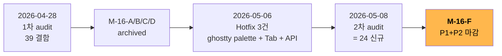

# M-16-F UI 체감 마감 — PRD

## Executive Summary

| 관점 | 한 줄 요약 |
|---|---|
| **Problem** | M-16-A/B/C/D + Hotfix 2026-05-06 closure 후 잔여 UI 결함 24건 발굴 (P1 1 + P2 12 + P3 11). 핵심: **ToolTip 6% 만 명시 / 캡션 버튼 a11y Name 누락 / 워크스페이스 close ✕ Name 누락 / Tab edge case / 최대화 하단 padding 시각 검증** |
| **Solution** | P1 + P2 핵심 묶음을 단일 사이클 (1.5주, 4 batch) 로 마감. 결함 별 수동 확인 verify gate. 자동화 검증 인프라는 별도 트랙 (M-16-F deliverable 아님). 다국어는 Out of Scope (영어 단일 운영 결정 2026-05-09) |
| **Function / UX 효과** | 모든 visible button ToolTip 명시 + a11y Name 100% + Tab navigation chrome 순환 정확 + 최대화 시 잘림 0px |
| **Core Value** | cmux 감성 도달 (UI 완성도 임계 통과). 사용자가 처음 화면을 보고 "다듬어졌다" 라 느끼는 marginal 결함 청산 |

## 1. 배경

### 1.1 출발점

### 1.2 결함 list 출처

- `docs/00-research/2026-05-08-ui-completeness-audit.md` — 2차 audit (24 결함 발굴)
- 본 사이클의 검증은 **수동 확인** 기반 (자동화 검증은 별도 트랙)

### 1.3 비전 정렬

GhostWin 3대 비전 축에서:

| 축 | 기여 |
|---|---|
| ① cmux 기능 탑재 | a11y Name + ToolTip + ContextMenu 우클릭 — cmux 감성 도달 |
| ② AI 에이전트 멀티플렉서 | 직접 영향 없음 (Phase 6 완결) |
| ③ 성능 우수 | 직접 영향 없음 (M-14/15 완결) |

→ **이 사이클은 비전 ① UI 완성도 마감** 사이클.

## 2. 결함 list

### 2.1 P1 — 사용자 시각 critical (1건)

| # | 결함 | 검증 방식 |
|:-:|---|---|
| **L6** | cell-snap residual padding (최대화 하단 잘림) | maximize 후 bottom 픽셀 수동 확인 |

### 2.2 P2 — UX 체감 / a11y (12 + 신규 2 = 14건)

| # | 결함 | 출처 |
|:-:|---|---|
| **A1** | ToolTip 6% — main 13 + settings 17 = 30 visible 중 2건만 명시 | UIA dump confirmed |
| **NEW-A** | 캡션 버튼 (Min/Max/Close) UIA Name 누락 | UIA dump line 14,15,16 |
| **NEW-B** | 워크스페이스 close ✕ Name + HelpText 누락 | UIA dump line 27 |
| **F1** | TabIndex 명시 잔여 (Sidebar 3 + SettingsPage 17 ✓ 다만 다른 영역 검증) | grep — partial closed |
| **F6** | Focusable=False 21건 — E2E 자동화 hook + 사용자 차단 혼재 | grep |
| **F9** | Tab passthrough Settings 열린 edge case 미검사 | grep + 수동 확인 |
| **F10** | SettingsPageControl 의 컨테이너 TabIndex 명시 누락 | grep |
| **F12** | NotifPanel ContextMenu 미정의 | UIA Menu type 0 |
| **F13** | Mouse wheel 줌 (Ctrl+Wheel) / 스크롤백 (Shift+Wheel) 단축키 미구현 | 코드 grep |
| **F15** | KeyboardNavigation.TabNavigation=None 부수효과 미검증 | grep |
| **L1** | Spacing 토큰 정의 후 inline `Margin="12,0"` 등 비일관 사용 잔존 | grep |
| **L3** | Sidebar item `Margin="4,1"` / `Padding="8,6"` magic 잔존 | grep |
| **L4** | NotificationPanelWidth GridLengthAnimationCustom 적용 검증 미완 | 수동 확인 (열기/닫기 애니메이션) |
| **C-NEW-1** | PaneContainerControl `Color.FromRgb` 하드코드 3건 — Light theme 미반영 | 직접 grep line 379, 404, 456 |

### 2.3 P3 — 누적 정리 가치 (11건, 후속)

A5 (i18n) / L2 / L5 / NEW-C / C-NEW-2 / F11 / F14 / A3 / A4 / A7 / A8 — M-16-G 또는 후속 사이클.

> A5 (i18n / 다국어): 2026-05-09 기준 영어 단일 운영 결정. 사용자 다양화 시점에 별도 사이클로 재논의.
> A6 (FlowDirection RTL): 영어 단일 운영이라 우선순위 후순위.

## 3. 목표 (사용자 관점)

| # | Before | After |
|:-:|---|---|
| 1 | 캡션 버튼 hover 시 정보 표시 안 됨 / 스크린리더 의도 파악 불가 | Min/Max/Close 모두 ToolTip + a11y Name 명시 |
| 2 | 워크스페이스 ✕ button 의도 파악 불가 | "Close workspace [Name]" Name + ToolTip |
| 3 | 최대화 시 터미널 하단 잘림 | 사방 균등 padding 분배, 잘림 0px |
| 4 | Tab 키 일부 영역에서 stuck | Sidebar / Settings / Pane chrome / NotifPanel ring 정확 순환 |
| 5 | NotifPanel 우클릭 시 메뉴 안 뜸 | 4영역 ContextMenu 일관성 (Sidebar/Pane/Terminal/NotifPanel) |
| 6 | Ctrl+Wheel / Shift+Wheel 단축키 부재 | 폰트 줌 + 스크롤백 |

## 4. Scope

### In Scope

- P1 1건 (L6) + P2 14건 = **15 결함** 마감
- 4 batch 구조: a11y → Tab/Focus → 시각·메뉴 → 토큰 정리
- 결함 별 verify gate (수동 확인 통과 시 closed)

### Out of Scope

- P3 11건 — M-16-G 후속 사이클로 분리
- **A5 i18n / 다국어 — 영어 단일 운영 결정 (2026-05-09)**. 사용자 다양화 시점에 별도 사이클로 재논의. cmux 의 17 언어 parity 도 미추진
- A6 FlowDirection RTL — 영어 단일 운영이라 불필요
- A7 HighContrast 모드 — 후순위
- **자동화 검증 인프라** (`UIAuditDiagnostics.cs` / xunit Collection / FlaUI 등) — 본 사이클 deliverable 아님. 별도 트랙으로 진행 (`tests/GhostWin.Automation.*`)
- 새 컨트롤 / 새 기능 — 결함 fix 만

## 5. 성공 지표

| 지표 | 측정 | 목표 |
|---|---|---|
| visible button ToolTip 비율 | 수동 카운트 / 30 visible buttons | ≥ 90% |
| a11y Name 비율 (visible interactive) | 수동 audit / total | ≥ 95% |
| 최대화 bottom 픽셀 | 최대화 후 화면 캡쳐 + 색상 확인 | terminal background = #1E1E2E (Dark) — 잘림 0px |
| Tab focus chain | 수동 Tab 시퀀스 → focused element 확인 | 명시 anchor → ⚙ → ListBox → cycle (Settings 열린 상태에서도 chrome ring 유지) |
| ContextMenu 일관성 | NotifPanel 우클릭 → 메뉴 표시 확인 | ≥ 1 menu item |
| Match Rate | gap-detector | ≥ 90% |

## 6. 의존성 / 위험

| 영역 | 의존 / 위험 | 대응 |
|---|---|---|
| **테마 결함 (C-NEW-1)** | PaneContainerControl 코드 측 변경 — render thread 영향 검증 필요 | M-14 render thread safety 회귀 검증 (M-15 baseline 비교) |
| **L6 시각 검증** | 가상 모니터 / 다중 모니터 환경에서 화면 캡쳐 좌표 불안정 | 사용자 본 PC 에서 직접 maximize → 하단 잘림 시각 확인 |
| **추측 fix 사이클** | 4번 잘못된 fix 의 교훈 (`feedback_exhaustive_search_before_fix.md`) | 결함 별 root cause verbatim trace + verify gate 통과 후 closure |

## 7. 일정

| Phase | 기간 | 산출물 |
|---|---|---|
| **Plan** | 0.5d | docs/01-plan/features/m16-f-ui-completion.plan.md |
| **Design** | 1d | docs/02-design/features/m16-f-ui-completion.design.md (결함별 fix pattern + batch 구조) |
| **Do** | 4-5d | 결함 15건 fix (4 batch sequential) + 빌드 0 warning |
| **Check** | 1d | gap-detector + 수동 확인 결과 비교 |
| **Iterate** | 0.5-1d | Match Rate 90% 까지 |
| **Report** | 0.5d | docs/04-report/features/m16-f-ui-completion.report.md |
| **합계** | **7.5-9일** (1.5주) | M-16-F archive |

## 8. Beachhead Segment + GTM

> **Beachhead**: 프로젝트 owner 본인 (영어 UI 단일 운영) — a11y 완전 + ToolTip + Tab 안정 + 최대화 잘림 0px = 일상 사용 marginal pain 청산

> **GTM**: 별도 release 마케팅 없음 — internal milestone. M-16-F closure 후 cmux 사용자 비교 audit (별도 사이클) 가 외부 GTM 기점.

## 9. 다음 액션

1. ✅ audit doc 최종화 (2026-05-08-ui-completeness-audit.md)
2. ✅ PRD 작성 (이 문서)
3. ✅ `/pdca plan m16-f-ui-completion`
4. ✅ `/pdca design m16-f-ui-completion`
5. 🟡 `/pdca do m16-f-ui-completion` — 4 batch sequential 진입

## 10. 참고

- [audit doc 2026-05-08](file:///C:/Users/Solit/Rootech/works/ghostwin/docs/00-research/2026-05-08-ui-completeness-audit.md)
- [audit doc 2026-04-28 (1차)](file:///C:/Users/Solit/Rootech/works/ghostwin/docs/00-research/2026-04-28-ui-completeness-audit.md)
- [Hotfix 2026-05-06 노트](file:///C:/Users/Solit/obsidian/note/Projects/GhostWin/Milestones/hotfix-2026-05-06.md)
- [memory feedback_exhaustive_search_before_fix.md](file:///C:/Users/Solit/.claude/projects/C--Users-Solit-Rootech-works-ghostwin/memory/feedback_exhaustive_search_before_fix.md)
- [memory feedback_ui_visual_audit.md](file:///C:/Users/Solit/.claude/projects/C--Users-Solit-Rootech-works-ghostwin/memory/feedback_ui_visual_audit.md)
