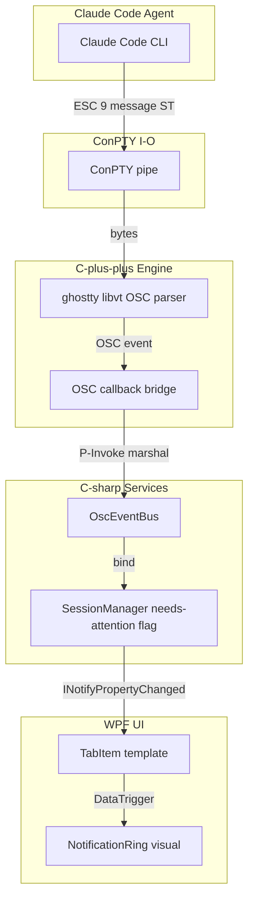

# PRD — Phase 6-A: OSC Hook + 알림 링 (Notification Ring)

> **문서 종류**: Product Requirements Document
> **작성일**: 2026-04-16
> **작성**: PM Agent Team (Discovery / Strategy / Research / GTM / PRD)
> **선행 인프라**: M-11.5 E2E Test Harness (Wave 2) — stub 준비 완료
> **상태**: Draft v1.0 (PDCA Plan 착수 전)
> **다음 단계**: `/pdca plan phase-6-a-osc-notification-ring`

---

## 한 줄 요약

**AI 에이전트가 보내는 "나 좀 봐주세요" 신호(OSC escape sequence)를
ghostty libvt 수준에서 가로채, 해당 탭 테두리에 알록달록한 링을 켜서
"어느 탭이 내 주의를 필요로 하는지" 한눈에 보이게 한다.**
이 한 가지가 동작하면 GhostWin 은 "Windows 용 Claude Code 멀티플렉서"
라는 존재 이유를 실제로 증명하게 된다.

---

## 1. Executive Summary (4-관점)

| 관점 | 내용 |
|------|------|
| **Problem** (문제) | Windows 에서 Claude Code 를 3~5 개 탭에 띄워 병렬 작업할 때, 어느 탭이 사용자 승인/입력을 기다리는지 알 수 없음. 탭을 일일이 클릭해 확인해야 해 에이전트 유휴 시간 증가 → 병렬 작업의 효율이 단일 작업보다도 떨어짐. |
| **Solution** (해결책) | ghostty libvt 가 파싱하는 OSC 9 / 99 / 777 이스케이프 시퀀스를 C++ Engine 콜백으로 노출하고, SessionManager 가 세션별 `needs-attention` 플래그를 유지하며, 탭 컨트롤이 해당 플래그에 바인딩된 색상 링을 표시한다. M-11.5 에서 준비된 stub (`TestOnlyInjectBytes`, `OscInjector.InjectOsc9`, `AutomationIds.NotificationRing`) 을 실제 동작으로 대체하는 작업. |
| **Function & UX Effect** (기능 + UX 효과) | Claude Code 가 Stop 이벤트를 송출하는 순간(권한 승인 요청, 작업 완료 등) 500 ms 이내에 탭 테두리에 링이 켜짐. 사용자는 탭 목록을 훑어만 봐도 주의가 필요한 탭을 발견. `Alt+{번호}` 또는 클릭으로 해당 탭으로 전환하면 링이 자동으로 꺼짐. |
| **Core Value** (핵심 가치) | "에이전트 병렬 실행의 효율을 사용자의 주의 분산 비용 없이 스케일". 가설이 참으로 검증되면 Phase 6-B (알림 패널 + Toast + 배지), Phase 6-C (Named pipe + git 상태)의 전제가 성립. 거짓이면 Phase 6 전체 재설계가 필요. **본 기능은 프로젝트 존재 이유 검증 게이트.** |

---

## 2. Vision Alignment — 3 대 축 대비 기여도

> 출처: `onboarding.md` §2, Obsidian `_index.md` 핵심 비전 표

| 비전 축 | 본 기능의 기여 | 근거 |
|---------|:-------------:|------|
| ① cmux 기능 탑재 | 간접 | cmux 의 notification ring UX 패턴을 Windows 네이티브로 재현. 다만 cmux 는 AGPL 이라 UX 만 차용(클린룸 재구현). |
| ② **AI 에이전트 멀티플렉서** | **직접 (핵심)** | 본 기능이 축 ② 의 **최소 증명 단위**. 이 신호 캡처가 안 되면 Phase 6 전체가 의미 없음. |
| ③ 타 터미널 대비 성능 | 중립 | OSC 파싱은 이미 libvt 내부에서 수행 중. 콜백 비용만 추가(<1 ms 목표). 성능 축을 훼손하지 않음. |

**결론**: 본 기능은 축 ② 에 100 % 집중한다. 축 ①/③ 에 과욕 부리지 않는다.

---

## 3. Architecture Flow (다이어그램)

**주의**: Mermaid v8.8.0 제약 준수 — subgraph ID 부여, `&` 미사용 (`.claude/rules/documentation.md` + `rkit:mermaid`).

---

## 4. User Personas (3 명)

### Persona 1 — "병렬 에이전트 개발자" 성지훈 (Beachhead)

| 항목 | 내용 |
|------|------|
| 역할 | 백엔드 개발자 / Claude Code Max 유료 구독자 |
| 환경 | Windows 11 + WSL2 + Claude Code CLI |
| 행동 | 평상시 3~5 개 에이전트 병렬 실행 (리팩토링 / 테스트 / 분석 / 문서화 분리) |
| Pain | 어느 탭이 승인 대기인지 모르므로, "Claude 가 지금 뭐 하고 있지" 를 1 분마다 탭 순회 확인. 흐름 깨짐. |
| Gain 기대 | 내 주의 자원을 에이전트 수만큼 나누지 않고, 에이전트가 나를 부를 때만 응답하면 됨. |

### Persona 2 — "AI 에이전트 도구 빌더" 김하나

| 항목 | 내용 |
|------|------|
| 역할 | 내부 에이전트 프레임워크 개발자 (사내 Claude Code 유사 도구) |
| 환경 | Windows 개발 머신, 자체 에이전트 CLI 로 OSC 9 송출 가능 |
| 행동 | 자사 에이전트가 사용자 이벤트를 송출했을 때 터미널이 반응하는지 체크 |
| Pain | Windows Terminal / WezTerm 은 OSC 9 를 사실상 무시 (소리만 나거나). UX 피드백 루프 없음. |
| Gain 기대 | GhostWin 을 "에이전트 UX 개발/검증 대상 터미널"로 채택 가능. |

### Persona 3 — "터미널 최적화 엔지니어" 박민수

| 항목 | 내용 |
|------|------|
| 역할 | 터미널 에뮬레이터 내부를 본 경험 있는 인프라 엔지니어 |
| 환경 | Windows + Linux 듀얼부팅, tmux 숙련자 |
| 행동 | OSC 777 로 tmux 세션 상태를 터미널 탭 UI 에 전달하고 싶어함 |
| Pain | tmux 는 멀티플렉싱만 있고 탭 시각화가 없음. Windows Terminal 은 OSC 777 무시. |
| Gain 기대 | tmux + GhostWin 조합으로 원격 세션 상태가 시각화됨. |

**Beachhead 선정**: Persona 1 (Moore 의 4 criteria 점수: **urgency 4 / budget 3 / pain 5 / influence 3 = 15**).
Persona 2/3 는 Phase 6-B 이후에 확보. Phase 6-A 는 Persona 1 에게 "감동"을 주는 데 집중.

---

## 5. User Stories (6 개)

| ID | Persona | Story |
|----|---------|-------|
| US-1 | 성지훈 | 나는 여러 Claude Code 세션을 병렬 실행할 때, 승인 대기 중인 탭을 **한눈에** 찾고 싶다. 그래야 다른 에이전트가 놀지 않는다. |
| US-2 | 성지훈 | 나는 해당 탭으로 전환하면 링이 **자동으로 꺼지길** 원한다. 수동 dismiss 는 귀찮다. |
| US-3 | 김하나 | 나는 내 에이전트가 송출한 OSC 9 가 탭에 반영되는지 **스크립트로 검증** 하고 싶다 (E2E 자동 테스트). |
| US-4 | 김하나 | 나는 OSC 메시지 내용(예: "Waiting for approval")을 탭 툴팁에서 볼 수 있길 원한다. 내용 없이 링만 켜지면 어떤 알림인지 모른다. |
| US-5 | 박민수 | 나는 색약(deuteranopia)이라 녹색/빨강 색 구분이 어렵다. 링에 **색 이외의 신호**(깜빡임 / 아이콘)도 있길 원한다. |
| US-6 | 박민수 | 나는 tmux 세션 안에서 OSC 를 발행할 때도 호스트 터미널 탭에 링이 켜지길 기대한다 (OSC pass-through). |

---

## 6. Functional Requirements

### FR-1 OSC 파싱 콜백 노출 (C++ Engine)

- ghostty libvt 의 기존 OSC 9 / 99 / 777 파서 결과를 C++ `gw_osc_callback_t` 타입으로 노출.
- P-Invoke 로 C# `ISessionManager.OnOscEvent(sessionId, oscKind, payload)` 호출.
- 파서 기준점: `external/ghostty@debcffbad` OSC handler.

### FR-2 OSC 종류 분류 + 정책

| OSC | 의미 | GhostWin 정책 |
|-----|------|--------------|
| **OSC 9** | iTerm2 notification / Claude Code Stop | `needs-attention = true` + 메시지 툴팁 저장 |
| **OSC 99** | tmux notify | `needs-attention = true` (tmux 호환) |
| **OSC 777 ; notify ; title ; body** | urxvt / iTerm2 ext | `needs-attention = true` + title/body 툴팁 |
| 기타 | 그 외 OSC | 기본 libvt 처리 그대로 |

### FR-3 세션별 상태 플래그

- `SessionManager` 가 `Dictionary<uint, NeedsAttentionState>` 유지.
- `NeedsAttentionState` = `{ bool IsActive, string LastMessage, DateTimeOffset RaisedAt }`.
- `TestOnlyInjectBytes` (M-11.5 stub) 이 이제 실제로 libvt 로 바이트 주입 → 콜백까지 왕복.

### FR-4 탭 UI 인디케이터 (알림 링)

- `TabItem` XAML 템플릿에 `<Border x:Name="NotificationRing">` 추가.
- `AutomationProperties.AutomationId = NotificationRing_{tabIndex}` (M-11.5 예약 상수 사용).
- DataTrigger: `SessionState.NeedsAttention == true` → Ring 가시화.
- 링 시각 스펙:
  - 테두리 두께 2 px (기본 탭 1 px 대비 강조)
  - 색상: 기본 `#FFB020` (amber), 테마에 따라 `#33A8FF` (dark) 대안
  - 애니메이션: 켜질 때 0 → 100 % opacity fade-in 250 ms, 끌 때 instant
  - 색약 대응: 링 옆에 작은 느낌표 아이콘(U+26A0) 병기 (색 + 형태 이중 신호)

### FR-5 자동 Dismiss

- 사용자가 해당 탭으로 포커스 전환 시 `NeedsAttention = false` 자동.
- 트리거: `TabControl.SelectionChanged` → `SessionManager.AcknowledgeAttention(sessionId)`.

### FR-6 툴팁 + 접근성

- `TabItem.ToolTip = LastMessage` (OSC payload).
- `AutomationProperties.HelpText` 에도 메시지 동기화 → 스크린리더 접근 가능.

---

## 7. Non-Functional Requirements

| 범주 | 요구사항 | 측정 방법 |
|------|----------|----------|
| **성능** | OSC 콜백 처리 (libvt → UI 링 표시) end-to-end < 500 ms (p95) | BenchmarkDotNet + UIA 시간 스탬프 |
| **성능** | 콜백 자체 (C++ → C# marshal) < 1 ms | ETW trace |
| **정확도** | Claude Code 의 Stop 이벤트 캡처율 100 % (false negative 0) | E2E 스크립트: `OscInjector` 10 회 주입 → 10 회 링 감지 |
| **정확도** | False positive rate < 1 % (무관한 OSC 로 링 켜짐 금지) | 비 9/99/777 OSC 100 개 fuzz 주입 → 0 회 링 |
| **접근성** | 색약 3 유형 (deuter/protan/tritan) 모두 구별 가능 | 시뮬레이터 스크린샷 수동 검증 (마일스톤 체크리스트) |
| **UI 쓰로틀** | 초당 OSC 100 회 주입해도 UI 프레임 드랍 없음 | 내부 debounce 100 ms (연속 알림은 1 회로 병합) |
| **스레드 안전성** | 콜백은 libvt I/O 스레드 → UI 스레드 marshal 필수. UI 직접 건드리면 안 됨. | ADR-006 `vt_mutex` 규칙 준수 |

---

## 8. Beachhead + GTM (Moore 4-criteria)

### Beachhead

| 후보 세그먼트 | Urgency | Budget | Pain | Influence | 합계 |
|--------------|:-------:|:------:|:----:|:---------:|:----:|
| **Windows + Claude Code Max 병렬 사용자** | 4 | 3 | 5 | 3 | **15** |
| Windows + 내부 에이전트 빌더 | 3 | 3 | 3 | 3 | 12 |
| tmux Windows 원격 사용자 | 2 | 2 | 3 | 2 | 9 |
| 일반 Windows Terminal 유저 | 1 | 2 | 1 | 1 | 5 |

→ **Beachhead = Windows + Claude Code 병렬 개발자** (Persona 1).

### GTM 채널

| 채널 | 전략 | KPI |
|------|------|-----|
| Claude Code Discord / GitHub Discussions | "Windows 에서 병렬 Claude 탭 식별 문제" 쓰레드 레퍼런스 답변 | 유입 clicks |
| Reddit r/ClaudeAI + r/windowsterminal | 데모 GIF + 설치 가이드 | 주간 star 증가 |
| Blog (개발자 한국어) | "Windows 에서 Claude Code 3 개 띄우고 5 분마다 탭 확인하던 나" 스토리 | 세션 복귀율 |
| Twitter/X 데모 | OSC 9 → 링 점등 15 초 클립 | 리트윗 수 |

**채택 측정 게이트**: 기능 출시 4 주 후 활성 사용자 중 OSC 알림을 주간 10 회 이상 받은 비율이 **30 %** 이상이어야 가설 검증 성공.

---

## 9. 경쟁 분석 (5 개)

| 제품 | OSC 9/99/777 | 탭 시각 링 | 에이전트 메시지 툴팁 | AGPL 이슈 | Windows 네이티브 |
|------|:--:|:--:|:--:|:--:|:--:|
| **cmux** (레퍼런스) | ◎ | ◎ | ◎ | AGPL-3.0 (듀얼) | ✗ (macOS only) |
| **Windows Terminal** | △ (bell 정도) | ✗ | ✗ | MIT | ◎ |
| **Warp** | ○ (자체 AI 전용) | △ | ○ | 비공개 | ○ |
| **Wave Terminal** | ○ | △ | ○ | Apache-2.0 | ○ (Electron) |
| **Tabby** | △ | ✗ | ✗ | MIT | ○ (Electron) |
| **GhostWin Phase 6-A** | **◎** | **◎** | **◎** | MIT + Ghostty MIT | **◎** |

범례: ◎ 완전 / ○ 부분 / △ 기본만 / ✗ 없음

**차별 요소**: Windows 네이티브 + OSC 3 종 완전 지원 + 탭 시각 링의 조합은 경쟁 제품 없음.

---

## 10. TAM / SAM / SOM (추측 포함 — "추측" 명기)

- **TAM**: Windows 개발자 전체 (≈ 14 M, Stack Overflow 2024 기준, **추측**)
- **SAM**: 그중 AI 코딩 에이전트(Claude Code / Copilot CLI / Cursor CLI) 정기 사용자 (≈ 800 K, **추측** — Claude Code MAU 공개 수치 없음)
- **SOM (1 년)**: SAM 중 "Windows + 병렬 3 개 이상 세션" 사용자 (≈ 50 K, **추측**) → GhostWin 초기 1 % 점유 목표 = **500 MAU**

**근거**:
- Claude MAU: Anthropic 공식 미공개, Similarweb 추정치는 claude.ai 웹 기준(≠ CLI). **확실하지 않음**.
- Windows 개발자 수: Stack Overflow Developer Survey 2024 기준 대략치. **확실하지 않음**.

→ 정량 숫자는 방향성 지표일 뿐. **본 PRD 의 성공 판정 근거는 §8 GTM KPI 와 §11 Success Metrics**.

---

## 11. Success Metrics

| 지표 | 목표 | 측정 |
|------|------|------|
| OSC → 링 표시 지연 (p95) | < 500 ms | M-11.5 E2E harness `notification_ring_visible` 시간 스탬프 |
| Stop 이벤트 캡처율 | ≥ 99.5 % | 1 주 dogfood 로그 (attentions raised / OSC sent) |
| False positive (무관 OSC 로 링) | < 1 % | fuzz E2E + 1 주 dogfood |
| 사용자 탭 전환 후 자동 dismiss 정확도 | 100 % | E2E 스크립트 |
| 주간 알림 수신 사용자 비율 (출시 4 주) | ≥ 30 % | 익명 텔레메트리 (opt-in) |
| Persona 1 인식 개선 설문 ("주의 분산 줄었다") | ≥ 7/10 | 50 명 설문 |

**가설 검증 판정**: 위 6 개 지표 중 **4 개 이상 달성 시 Phase 6-B 착수**. 2 개 이하면 Phase 6 재설계.

---

## 12. Phase 6-B 와의 연결점

| 구분 | Phase 6-A (본 PRD) | Phase 6-B (다음) |
|------|-------------------|------------------|
| 역할 | **데이터 소스** | **데이터 소비자 확장** |
| OSC 캡처 | ◎ (핵심) | 재사용 |
| 탭 링 | ◎ | 유지 |
| 알림 패널 (전체 목록 뷰) | ✗ | ◎ |
| Win32 Toast (창 비활성 시) | ✗ | ◎ |
| 에이전트 상태 배지 (실행/대기/오류/완료) | ✗ | ◎ |

**원칙**: Phase 6-A 는 "느끼는 첫 감동" 에 집중, Phase 6-B 는 "많이 알림을 다루는 파워 유저 만족도".
Phase 6-A 가 Success Metrics 를 통과하지 못하면 Phase 6-B 는 **착수하지 않는다**.

---

## 13. 전제 / 제약 / 위험

| 범주 | 내용 |
|------|------|
| 전제 | M-11 세션 복원 + M-11.5 E2E harness 완료 (M-11.5 는 2026-04-15 완료됨) |
| 전제 | ghostty libvt 가 OSC 9/99/777 을 이미 파싱 (**확인됨**, upstream `debcffbad`) |
| 제약 | cmux AGPL-3.0 — 코드 직접 포팅 금지, UX 만 클린룸 재구현 |
| 제약 | libvt API 불안정(v0.1.0) → VtCore 래퍼에 격리 (ADR-001, ADR-003) |
| 위험 (중) | 일부 쉘(oh-my-posh 등)이 OSC 를 남발해 false positive 증가 → debounce + OSC 종류 화이트리스트로 완화 |
| 위험 (중) | Claude Code 가 향후 OSC 코드를 변경하면 캡처 실패 → OSC 종류별 테스트 매트릭스 상시 유지 |
| 위험 (낮) | Persona 1 이 예상보다 작음 → §11 Success Metrics 로 조기 감지 |

---

## 14. Out of Scope (Phase 6-A 에서 안 함)

- 알림 패널 전체 리스트 뷰 (→ Phase 6-B)
- Win32 Toast 알림 (→ Phase 6-B)
- 에이전트 상태 배지 (실행중/오류/완료) (→ Phase 6-B)
- Named pipe 훅 서버 (→ Phase 6-C)
- git branch / PR 상태 표시 (→ Phase 6-C)
- 알림 소리, 진동 (→ Phase 6-B 이후 검토)

---

## 15. 참조

- `onboarding.md` — 3 대 비전 (§2, §6)
- Obsidian `_index.md` — 프로젝트 MOC
- Obsidian `Milestones/` — M-11.5 E2E harness 완료 (Wave 2)
- `docs/archive/2026-04/e2e-test-harness/` — stub 준비 보고서
- `src/GhostWin.Core/Interfaces/ISessionManager.cs` — `TestOnlyInjectBytes` 위치
- `.claude/rules/documentation.md` — 문서 스타일
- `.claude/rules/behavior.md` — 우회 금지 / 근거 기반
- pm-skills (MIT) by Pawel Huryn — JTBD / OST / Lean Canvas / Moore Beachhead 프레임워크

---

## Attribution

PM Agent Team PRD uses frameworks from
[pm-skills](https://github.com/phuryn/pm-skills) by Pawel Huryn (MIT License).

---

*End of PRD — Phase 6-A: OSC Hook + Notification Ring*
