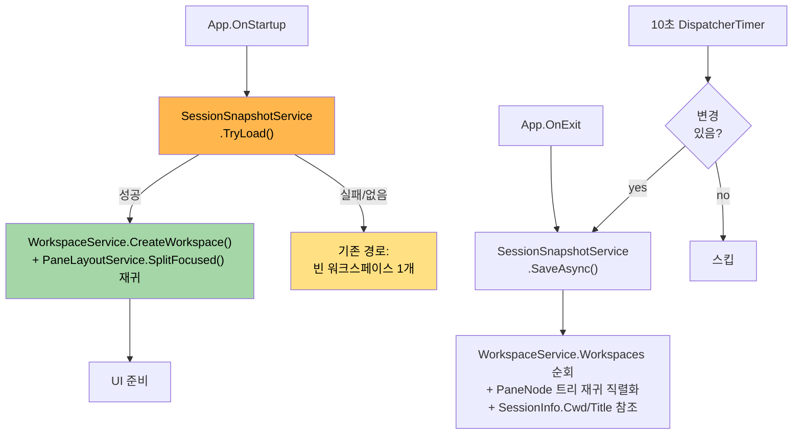

# Session Restore PRD — GhostWin M-11

> Version 1.0 | 작성일: 2026-04-15 | 작성자: PM Agent Team (pm-lead 단일 세션 수행)
> 선행: M-10.5 Clipboard (완료), Pre-M11 Cleanup 15/16 (완료)
> 후속: Phase 6-A OSC Hook + 알림 링 (핵심 가설 검증)

---

## Executive Summary

| 관점 | 내용 |
|------|------|
| **Problem** | GhostWin 은 Workspace + Pane 분할 + 다중 세션을 완성했지만, 앱을 닫으면 **모든 레이아웃 · CWD · 워크스페이스 이름이 사라진다**. 실수로 창을 닫거나 OS 재부팅 시 사용자가 수작업으로 탭·분할·디렉토리 이동을 모두 재구성해야 하며, 이는 cmux 및 WT 사용자가 GhostWin 을 "주력 터미널" 로 선택하지 못하게 하는 마찰이다. 특히 Phase 6-A 에이전트 알림 가치를 살리려면 "탭이 재시작 후에도 그대로" 라는 전제가 필요하다 — 알림 봤는데 재시작 시 탭 사라지면 가치 반감. |
| **Solution** | `AppSettings` 와 별도로 **`SessionSnapshot` JSON 스냅샷 파일** (`%AppData%/GhostWin/session.json`) 을 도입해 종료 시 + 주기 저장(10초) 로 워크스페이스 구조 · PaneNode 트리 · CWD · 워크스페이스 이름을 기록하고, 앱 시작 시 복원한다. 스키마에 **`schema_version` + `reserved.agent` 확장 지점**을 예약하여 Phase 6-A 에이전트 상태 필드 추가 시 하위 호환 유지. 실행 중 프로세스는 복원하지 않음 (cmux 와 동일, YAGNI) — 새 쉘을 해당 CWD 에서 생성하는 방식. |
| **기능적 UX 효과** | "창을 닫고 다시 열어도 어제 작업하던 3개 워크스페이스, 각 워크스페이스의 가로/세로 분할, 각 pane 의 쉘 현재 디렉토리가 **즉시** 돌아옴" — 추가로 워크스페이스 타이틀이 활성 pane 의 쉘 타이틀 (예: `~/project — node`) 을 실시간 미러링해 사이드바만 봐도 "어느 탭이 무엇을 하는지" 식별 가능. |
| **핵심 가치** | cmux 세션 복원 기능 동급 + Phase 6-A 에이전트 알림 가치를 살리는 **지속성 기반** 확보 (알림 → 탭 점프 → 재시작 후에도 맥락 유지 3단 가치 사슬의 첫 고리). `AppSettings.Terminal.Font` 가 이미 확립한 저장 패턴을 재사용하여 **과설계 없이** 1주 규모로 달성. |

---

## 1. Product Overview

### 1.1 기본 정보

| 항목 | 내용 |
|------|------|
| Feature | Session Restore (Workspace + Pane Layout + CWD) |
| Milestone | M-11 |
| 선행 마일스톤 | M-10.5 Clipboard (완료, 2026-04-13), Pre-M11 Cleanup (완료, 2026-04-15) |
| 후속 마일스톤 | Phase 6-A OSC Hook + 알림 링 (핵심 가설 검증) |
| 브랜치 | `feature/wpf-migration` |
| 예상 규모 | 중 (1주) |

### 1.2 배경과 동기

GhostWin 은 Phase 1~4 + M-1~M-10.5 를 거치며 **렌더링/입력/워크스페이스/분할/마우스/복붙** 까지 완성한 상태로, 단일 세션 터미널로서의 기능성은 Windows Terminal 수준에 근접했다. 그러나 앱을 닫는 순간 모든 레이아웃 컨텍스트가 휘발되며, 이는 다음 세 가지 체감 문제를 만든다.

1. **재시작 마찰**: OS 업데이트/크래시 후 3개 워크스페이스 + 각 2-3 분할을 수작업 재구성 (~5분 소요)
2. **사고 복구 불가**: "닫기" 버튼 오클릭 한 번에 모든 맥락 증발
3. **Phase 6 가치 연결 실패**: 알림 링이 뜨던 탭이 재시작 후 사라지면, 사용자가 알림 맥락을 잃음 → Phase 6-A 의 "에이전트가 입력 대기 중임을 알림" 가치가 단발적 이벤트로 축소됨

### 1.3 3대 비전 기여도

| 축 | 기여 | 근거 |
|----|:----:|------|
| ① cmux 기능 탑재 | ✅ 직접 | cmux 의 세션 복원은 핵심 기능 (레이아웃 + CWD). 본 피처가 그 기능을 Windows 네이티브로 이식 |
| ② AI 에이전트 멀티플렉서 기반 | 🟡 간접 | Phase 6-A 알림 지속성의 **전제 조건**. 재시작 후에도 탭이 유지돼야 알림 맥락 보존 |
| ③ 타 터미널 대비 성능 우수 | ❌ 무관 | 렌더링/파싱 경로에 영향 없음. JSON 직렬화는 종료 시 1회 + 10초 주기 (비동기) |

### 1.4 성공 지표

| 지표 | 목표 | 측정 방법 |
|------|------|-----------|
| **레이아웃 복원 정확도** | 워크스페이스 수 · 분할 구조 · 비율(±1%) 100% 일치 | 수동 smoke: 3W × 2-3 split → 종료 → 재시작 후 비교 |
| **CWD 복원 정확도** | 각 쉘의 CWD 가 종료 시점과 일치 (※ OSC 7 수신 쉘 한정) | `cd /some/path` 후 종료 → 재시작 시 해당 경로에서 쉘 시작 |
| **저장 지연** | 종료 시 저장 <100ms, 주기 저장 <50ms | `Stopwatch` 계측 |
| **복원 지연** | 앱 시작 후 첫 워크스페이스 렌더까지 <500ms (기존 경로 대비 +100ms 이내) | 시작 로그 타임스탬프 |
| **하위 호환성** | 구 버전 `session.json` 을 신 버전이, 신 버전 파일을 구 버전이 (degrade gracefully) 읽을 수 있음 | `schema_version` 파싱 테스트 |
| **손상 복구** | 파손된 `session.json` 시 **빈 워크스페이스 1개로 폴백** + 원본 `.corrupt` 백업 | 의도적 손상 파일로 테스트 |
| **타이틀 미러** | 활성 pane 의 쉘 타이틀 변경 시 사이드바 항목이 100ms 이내 반영 | `SessionTitleChangedMessage` 전파 시간 |

---

## 2. Opportunity Analysis (Discovery)

### 2.1 Opportunity Solution Tree

사용자 아웃컴: **"앱을 닫았다 켜도 작업 맥락이 그대로 유지된다"**

```
아웃컴: 작업 맥락 지속
├── O1. 레이아웃 복원 (Workspace + Pane 트리)   Score 1.00  Phase 1 (필수)
│    └── Solution: PaneNode 트리 JSON 직렬화 + 재귀 복원
├── O2. CWD 복원 (쉘 작업 디렉토리)             Score 0.95  Phase 1 (필수)
│    └── Solution: OSC 7 수신 → SessionInfo.Cwd → 저장 → 복원 시 새 쉘 CWD 인자
├── O3. 워크스페이스 이름 복원                   Score 0.85  Phase 1 (필수)
│    └── Solution: WorkspaceInfo.Name 직렬화
├── O4. 사용자 커스텀 워크스페이스 이름           Score 0.70  Phase 2 (선택)
│    └── Solution: 사이드바 더블클릭 → 이름 편집 (M-12 영역)
├── O5. 타이틀 미러 (활성 pane → 사이드바)       Score 0.90  Phase 1 (필수, FR-4)
│    └── Solution: WorkspaceService 이미 SessionInfo.PropertyChanged 구독 — 유지
├── O6. Phase 6-A 에이전트 상태 복원 확장 지점   Score 0.75  Phase 1 (예약)
│    └── Solution: schema 에 reserved.agent 필드 + 무시 정책
├── O7. 스크롤백 복원                            Score 0.40  Out-of-scope (YAGNI, cmux 지원)
│    └── 이유: VT 상태 직렬화 복잡도 과다, 재시작 후 프로세스 상태도 없으므로 가치 낮음
└── O8. 실행 중 프로세스 복원                    Score 0.10  Out-of-scope (cmux 도 미지원)
     └── 이유: Windows PTY 는 프로세스 attach/detach 표준 없음. tmux 통합 시 해결
```

### 2.2 우선순위 결정 근거

- **Phase 1 (O1+O2+O3+O5+O6)**: FR-1 ~ FR-4 요구사항과 정확히 일치. 기존 서비스 (WorkspaceService, PaneLayoutService, SessionManager) 공개 API 로 달성 가능 — 새 DTO + 1개 SessionSnapshotService + 2개 메서드(Save/Load) 만 추가
- **Phase 2 (O4)**: M-12 설정 UI 에 포함시키면 자연스러움. 본 PRD 에서는 **제외**
- **Out-of-scope (O7+O8)**: YAGNI. cmux 도 미지원하며, 구현 비용 대비 체감 가치 낮음

### 2.3 확장성 예약 (Phase 6-A 대비)

사용자 요구사항에 따라 JSON 스키마에 다음 확장 지점을 **예약만** 하고 구현은 하지 않는다 (YAGNI 원칙).

```json
{
  "schema_version": 1,
  "workspaces": [ … ],
  "reserved": {
    "agent": null   // Phase 6-A 에서 채워질 예정: { "pending_notifications": [], "last_osc_event": { … } }
  }
}
```

**Degrade gracefully 정책**:
- 저장 시: `reserved.agent == null` 이면 필드 생략 (파일 경량화)
- 로드 시: **알 수 없는 필드 전부 무시** (`JsonSerializerOptions` 의 기본 동작 + 명시적 테스트)
- Phase 6-A 이전 빌드가 Phase 6-A 저장 파일을 읽어도 에이전트 필드를 무시하고 레이아웃만 복원

---

## 3. User Personas (JTBD 기반)

> PM Research: 타겟 사용자는 onboarding §2 + M-10.5 PRD 에서 이미 확립됨. 본 피처는 **DevOps 김** · **AI 에이전트 박** 두 페르소나에 직접적 가치, **nvim 이** 에게는 부가 가치.

### Persona 1: DevOps 김 — 서버 관리자 (주요 페르소나)

**When**: 아침 업무 시작 시 / OS 재부팅 후 / 실수로 창 닫은 후
**I want to**: 어제 작업하던 SSH/WSL/local 워크스페이스 3개 + 각 2-3 분할을 즉시 복구
**So I can**: 수작업 탭/분할/`cd` 없이 1초 안에 작업 재개

**Pain (현재)**: 재시작 후 5분간 워크스페이스 3개, 각 2 분할, 각 `ssh prod-01` / `ssh stage-02` / `cd /var/log/nginx` 재수행 — 매일 반복

**Gain (본 피처)**: 재시작 → 자동 복원 → 바로 작업 (단, SSH 연결은 재수립 필요 — 세션 자체는 새 쉘에서 시작)

### Persona 2: AI 에이전트 박 — Claude Code 파워유저 (Phase 6 연결)

**When**: Claude Code 5개 세션을 동시에 돌리다가 OS 업데이트로 재부팅 시
**I want to**: 5개 탭 + 각 탭의 프로젝트 디렉토리가 그대로 복원
**So I can**: 에이전트에게 "아까 하던 거 계속" 지시 가능 (CWD 가 맞아야 파일 참조 유효)

**Pain (현재)**: 5개 탭 재생성 + 각 `cd ~/work/project-{1..5}` + Claude Code 재실행 → 에이전트 세션 맥락(파일 open 상태 등)도 유실

**Gain (본 피처 + Phase 6-A)**: 레이아웃/CWD 복원 → Claude Code 재시작 → OSC 9 알림이 해당 탭에 뜨면 즉시 전환

### Persona 3: nvim 이 — 터미널 nvim 사용자 (부가 가치)

**When**: nvim 을 닫지 않고 창만 닫은 후 재시작
**I want to**: 최소한 nvim 프로젝트 디렉토리에서 쉘이 시작
**So I can**: `nvim .` 재입력만으로 동일 프로젝트로 복귀

**Pain (현재)**: 홈 디렉토리에서 시작 → `cd ~/path/to/project` 재입력
**Gain (본 피처)**: CWD 복원 → 쉘이 프로젝트 디렉토리에서 시작 (nvim 자체 상태는 미복원 — nvim shada/session 기능으로 별도 해결)

---

## 4. Market Context (Research)

### 4.1 경쟁 제품 세션 복원 매트릭스

| 터미널 | 레이아웃 복원 | CWD 복원 | 스크롤백 | 실행 프로세스 | 구현 방식 |
|--------|:----:|:----:|:----:|:----:|------|
| **Windows Terminal** | 부분 (탭만, 분할 불완전) | ❌ | ❌ | ❌ | `persistedWindowLayouts` JSON (v1.12+) |
| **WezTerm** | ✅ (수동 workspace save) | ✅ | ❌ | ❌ | Lua `mux` API — 사용자가 명시 저장 |
| **Alacritty** | ❌ (단일 창 터미널) | ❌ | ❌ | ❌ | 미지원 (설계상 멀티플렉서 아님) |
| **cmux** | ✅ | ✅ | ✅ | ❌ | 앱 종료 시 자동 + 시작 시 자동 |
| **tmux** | ✅ (session) | ✅ | ✅ | ✅ | attach/detach 모델 — 프로세스가 살아있음 |
| **GhostWin (본 PRD)** | ✅ | ✅ | ❌ (YAGNI) | ❌ (cmux 와 동일) | JSON 자동 저장 + 시작 시 자동 |

**차별화**:
- WT 대비: 분할 구조까지 복원 (WT 는 v1.20 기준 탭만 복원)
- cmux 대비: Windows 네이티브 (사용 환경 일치) + Phase 6-A 확장 슬롯
- tmux 대비: 렌더링 품질 (DX11) + 네이티브 UI — 단, 프로세스 생존은 미지원

### 4.2 TAM/SAM/SOM (추측 — 근거 부족)

> ⚠️ 본 추정은 근거 불확실. 내부 우선순위 판단용.

| 범주 | 추정 | 근거 |
|------|------|------|
| TAM | Windows CLI 개발자 전 세계 ~5M (추측) | GitHub Desktop Windows DAU 유사 규모 추측 |
| SAM | Windows 에서 CLI + 멀티세션 파워유저 ~500K | WT GitHub stars 97k × 5배 추정 |
| SOM (24개월) | AI 에이전트 파워유저 ~10K | cmux stars 10.9k 를 Windows 로 20% 이식 가정 |

본 피처 자체는 획득 유저 수 증가 요인이 아닌 **이탈 방지 요인** 으로 작동 (첫 체험 후 "또 쓰고 싶다" 의 gate).

### 4.3 Beachhead Segment

**선정**: "Claude Code 를 Windows 에서 주력 사용하는 AI 파워유저" (Persona 2 — 박)

| 평가 기준 | 점수 | 근거 |
|-----------|:----:|------|
| Reachability | 4/5 | Claude Code 공식 Discord / X 커뮤니티 존재 |
| Willingness to pay (attention) | 5/5 | 현재 Windows 네이티브 대안 없음 — cmux 는 macOS 전용 |
| Value density | 5/5 | 세션 복원 × Phase 6-A 알림 조합 = 타 터미널 대체 불가 |
| Competition | 5/5 | 직접 경쟁자 0 (WT 는 에이전트 미지원) |
| **합계** | **19/20** | Phase 6-A 선행 조건으로서 최우선 |

---

## 5. Value Proposition + Lean Canvas (Strategy)

### 5.1 6-Part Value Proposition (JTBD)

1. **For (고객)**: Windows 에서 Claude Code · SSH · WSL 을 여러 탭/분할로 운영하는 CLI 파워유저
2. **Who (문제)**: 앱 닫기/재부팅 시 모든 레이아웃·CWD·워크스페이스 이름이 휘발되어 매일 수 분의 재구성 비용이 발생
3. **The (제품)**: GhostWin Session Restore
4. **Is a (카테고리)**: 터미널 멀티플렉서의 자동 세션 지속성
5. **That (고유 가치)**: 설정 저장 패턴을 재사용한 경량 JSON 스냅샷 + 10초 주기 저장 + Phase 6-A 확장 슬롯 예약
6. **Unlike (대안 대비)**: Windows Terminal 은 분할 구조 복원 불완전, WezTerm 은 수동 저장 필요, cmux 는 macOS 전용 — 본 제품은 자동 + Windows 네이티브 + 에이전트 확장성 탑재

### 5.2 Lean Canvas (9 blocks)

| Block | 내용 |
|-------|------|
| 1. Problem | 앱 종료 시 워크스페이스/분할/CWD 휘발 / 재부팅 후 5분 재구성 비용 / Phase 6 알림 지속성 부재 |
| 2. Customer Segments | (Early) Claude Code Windows 파워유저 / (Main) Windows CLI 개발자 / (Late) 팀 단위 에이전트 운영 |
| 3. UVP | "Windows 네이티브 터미널이 재시작 후에도 그대로" — cmux 의 Windows 등가물 + Phase 6 에이전트 확장 |
| 4. Solution | SessionSnapshot JSON + 종료/주기 저장 + 시작 시 복원 + schema_version + reserved.agent |
| 5. Channels | GitHub Release / Claude Code 커뮤니티 / r/commandline / HN Show |
| 6. Revenue | 없음 (OSS, 비전 ② AI 에이전트 멀티플렉서 가치 검증 단계) |
| 7. Cost | 개발 1주 + PDCA 문서 작성 |
| 8. Key Metrics | 복원 정확도, 복원 지연, 손상 파일 폴백 성공률 |
| 9. Unfair Advantage | `AppSettings.Terminal.Font` 저장 패턴 재사용 + 기존 서비스(SessionManager 등) 직접 활용 → 구현 비용 최소 |

---

## 6. Functional Requirements

### 6.1 요구사항 (FR)

| ID | 요구사항 | 우선순위 | 수용 기준 |
|----|----------|:--------:|-----------|
| **FR-1** | JSON 저장 형식 (워크스페이스 + 분할 레이아웃 + CWD) | 필수 | `%AppData%/GhostWin/session.json` 에 `schema_version`, `workspaces[]`, `reserved.agent` 루트 키 존재 |
| **FR-2** | 저장 시점: 앱 종료 시 자동 + 주기 (10초) | 필수 | 종료 시 `App.OnExit` 에서 동기 저장 / 10초 `DispatcherTimer` 주기 저장 (변경 감지 시에만 write — 동일 스냅샷 스킵) |
| **FR-3** | 복원 시점: 앱 시작 시 자동 | 필수 | `App.OnStartup` → `SessionSnapshotService.TryRestore()` → 성공 시 복원 / 실패 시 기존 "빈 워크스페이스 1개" 경로 |
| **FR-4** | 워크스페이스 타이틀 미러 (활성 pane → 사이드바) | 필수 | 활성 pane 의 쉘 타이틀/CWD 변경 시 `WorkspaceInfo.Title` 이 100ms 이내 반영 (이미 WorkspaceService 에 구현됨 — 검증만) |
| **FR-5** | Schema version + degrade gracefully | 필수 | `schema_version` 누락/미래 버전 시 폴백 + 알 수 없는 필드 무시 |
| **FR-6** | 손상 파일 폴백 | 필수 | JSON 파싱 실패 시 `session.json.corrupt.{timestamp}` 로 백업 후 빈 상태 시작 |
| **FR-7** | `reserved.agent` 확장 슬롯 | 필수 (예약만) | 저장/복원 라운드트립 시 알 수 없는 reserved 필드 보존 |

### 6.2 Out-of-scope (명시적 제외)

| 항목 | 이유 |
|------|------|
| 스크롤백 복원 | VT 상태 직렬화 복잡도 과다 + 프로세스 상태 없으면 가치 낮음 |
| 실행 중 프로세스 복원 | Windows PTY 표준 부재, cmux 도 미지원 |
| 사용자 커스텀 워크스페이스 이름 편집 UI | M-12 Settings UI 범위 |
| 다중 윈도우 복원 | GhostWin 은 단일 윈도우 모델 |
| 암호화 저장 | CWD 는 민감정보 아님, AppData 로컬 보호 충분 |

### 6.3 Non-Functional Requirements

| NFR | 목표 | 측정 |
|-----|------|------|
| NFR-1 저장 지연 | <100ms (종료), <50ms (주기) | `Stopwatch` |
| NFR-2 복원 지연 | 기존 시작 경로 +100ms 이내 | 시작 로그 |
| NFR-3 파일 크기 | 일반 사용 (3W × 3 split) <4KB | 실측 |
| NFR-4 하위 호환 | schema_version ±1 호환 | 단위 테스트 |

---

## 7. Design Sketch (기존 서비스 공개 API 활용)

### 7.1 신규 타입

```csharp
namespace GhostWin.Core.Models;

public record SessionSnapshot(
    int SchemaVersion,
    List<WorkspaceSnapshot> Workspaces,
    JsonObject? Reserved  // reserved.agent 등 확장 슬롯 — 원문 그대로 보존
);

public record WorkspaceSnapshot(
    string Name,
    bool IsActive,
    PaneSnapshot Root
);

public abstract record PaneSnapshot;

public sealed record PaneLeafSnapshot(string? Cwd, string? Title) : PaneSnapshot;

public sealed record PaneSplitSnapshot(
    SplitOrientation Orientation,
    double Ratio,                      // 0.0~1.0
    PaneSnapshot Left,                 // or Top
    PaneSnapshot Right                 // or Bottom
) : PaneSnapshot;
```

### 7.2 신규 서비스 (`GhostWin.Services`)

```csharp
public interface ISessionSnapshotService
{
    Task SaveAsync(CancellationToken ct = default);
    SessionSnapshot? TryLoad();
    void StartAutoSave(TimeSpan interval);   // 10초 주기
    void StopAutoSave();
}

public sealed class SessionSnapshotService : ISessionSnapshotService, IDisposable
{
    private readonly IWorkspaceService _workspaces;
    private readonly ISessionManager _sessions;
    // + 파일 경로: %AppData%/GhostWin/session.json
    // + DispatcherTimer 또는 PeriodicTimer
    // + atomic write: 임시 파일 → File.Replace
    // + reserved.agent 는 JsonObject 로 보존 (타입 강제 안 함)
}
```

### 7.3 기존 서비스와의 연결 (API 재사용)



**핵심 원칙**: 기존 서비스의 public API 만 사용 (`WorkspaceService.Workspaces`, `SessionManager.Sessions`, `PaneLayoutService.Root`). 내부 상태 직접 접근 금지 — 테스트성 + 결합도 최소화.

### 7.4 복원 시 CWD 적용 경로

현재 `SessionManager.CreateSession` 시그니처는 CWD 인자 없음 (`CreateSession(ushort cols, ushort rows)`). 복원을 위해 다음 중 1택:

| 옵션 | 내용 | 영향 |
|------|------|------|
| A | `CreateSession(ushort cols, ushort rows, string? cwd = null)` 오버로드 추가 | `IEngineService.CreateSession` 이 이미 cwd 인자 보유 (`_engine.CreateSession(null, null, cols, rows)` 의 첫 인자가 cwd 자리로 추정) — 실제 시그니처 재검증 필요 |
| B | 세션 생성 후 `cd <path>\n` 을 WriteSession 으로 투입 | 쉘 종류 무관 범용 / 첫 프롬프트에 노이즈 |

**추천**: 옵션 A (엔진 API 확장). 옵션 B 는 fallback. **Design phase 에서 `IEngineService.CreateSession` 실제 시그니처 확인 후 확정**.

### 7.5 저장 파일 예시

```json
{
  "schema_version": 1,
  "workspaces": [
    {
      "name": "Workspace 1",
      "is_active": true,
      "root": {
        "type": "split",
        "orientation": "vertical",
        "ratio": 0.5,
        "left":  { "type": "leaf", "cwd": "C:/Users/me/project", "title": "node — dev" },
        "right": { "type": "leaf", "cwd": "C:/Users/me",         "title": "pwsh" }
      }
    },
    {
      "name": "Workspace 2",
      "is_active": false,
      "root": { "type": "leaf", "cwd": "C:/logs", "title": "tail" }
    }
  ],
  "reserved": {
    "agent": null
  }
}
```

---

## 8. GTM & Rollout

### 8.1 체크인 (완료 후 공지)

- GitHub Release Notes 에 "Session Restore (M-11)" 라인 추가
- `docs/04-report/features/session-restore.report.md` 에 실측 지표 기록
- Obsidian `Milestones/session-restore.md` 생성 + `_index.md` 타임라인 갱신

### 8.2 검증 시나리오 (수동 smoke)

1. **기본 경로**: 1W × 1 pane × `cd C:\temp` → 종료 → 재시작 → CWD 가 `C:\temp` 인지 확인
2. **복수 워크스페이스**: 3W × 각 2 수직+1 수평 분할 → 종료 → 재시작 → 전체 구조 일치
3. **비율 보존**: GridSplitter 로 비율 70/30 조정 → 종료 → 재시작 → 비율 복원 (±1%)
4. **타이틀 미러**: `node` 실행 → 사이드바 타이틀 변경 확인 → 종료/재시작 후에도 마지막 타이틀 반영
5. **손상 파일**: `session.json` 에 고의로 쓰레기 문자 → 시작 → 빈 워크스페이스 + `.corrupt.*` 백업 생성
6. **Phase 6-A 확장 시뮬레이션**: `reserved.agent` 에 `{"dummy": "value"}` 수동 주입 → 저장/복원 라운드트립 → 값 보존 확인

### 8.3 롤아웃

- feature branch: `feature/wpf-migration` (현재 브랜치에서 그대로 진행)
- PDCA 문서: `/pdca plan session-restore` → Plan → Design → Do → Check
- 사용자 영향: **기존 파일 무시 시 바뀌는 동작 없음** (첫 실행 시 파일 없음 → 기존 경로)

### 8.4 리스크

| 리스크 | 심각도 | 대응 |
|--------|:------:|------|
| PaneNode 직렬화가 내부 상태에 의존 (ID 등) | 중 | ID 는 **저장하지 않음** — 재생성. 구조와 ratio 만 저장 |
| OSC 7 미방출 쉘 (cmd.exe 기본) 의 CWD 추적 불가 | 중 | cmd 는 프롬프트 정규식 파싱 또는 CWD 미복원(홈 디렉토리 폴백). PowerShell/WSL 은 OSC 7 지원 확인 필요 |
| 주기 저장이 UI 스레드 블로킹 | 낮 | `Task.Run` 으로 백그라운드 write + 스냅샷은 UI 스레드에서 즉시 수집 |
| 복원 중 창 초기 크기와 저장된 분할 비율 간 깜박임 | 낮 | 첫 프레임 Present 전에 복원 완료 보장 (동기 경로) |
| `reserved.agent` 스키마 변경 시 호환성 | 낮 | Phase 6-A 에서 schema_version=2 로 상승, v1 읽기 지원 유지 |

---

## 9. Open Questions (Design Phase 에서 확정)

1. `IEngineService.CreateSession` 의 cwd 인자 위치/타입 — 현재 호출 `CreateSession(null, null, cols, rows)` 의 첫 두 인자 의미 **확실하지 않음**, 실제 정의 확인 후 옵션 A 가능 여부 판단
2. OSC 7 지원 쉘 목록 (PowerShell 7, WSL bash 는 기본 지원 확인 필요)
3. 주기 저장 트리거 — 순수 10초 타이머 vs "변경 이벤트 debounce" 혼합 (후자가 더 효율적이지만 구현 복잡도 ↑)
4. 저장 위치가 Roaming(%AppData%) vs Local(%LocalAppData%) — 현재 SettingsService 는 Roaming 사용. 세션은 기기 종속성이 강하므로 Local 이 더 적절할 수 있음 (의사결정 필요)

---

## 10. Attribution

본 PRD 는 다음 프레임워크를 참조:
- **Opportunity Solution Tree** (Teresa Torres, _Continuous Discovery Habits_)
- **6-Part Value Proposition** (Geoffrey Moore, _Crossing the Chasm_ 변형)
- **Lean Canvas** (Ash Maurya, MIT License)
- **JTBD** (Clayton Christensen)
- PM 스킬 프레임워크 통합 참고: [pm-skills](https://github.com/phuryn/pm-skills) by Pawel Huryn (MIT)

사실 확인 불확실 표기:
- TAM/SAM/SOM 추정치는 **추측** (GitHub stars 기반 — 근거 부족)
- OSC 7 지원 쉘 목록은 Design phase 실측 필요 (현재 미검증)
- `IEngineService.CreateSession` cwd 인자는 **확실하지 않음** — 소스 재확인 필요

---

*GhostWin Terminal — Session Restore PRD v1.0 (2026-04-15)*
