# UI 완성도 — 39개 결함 + 5개 마일스톤 분리

> **한 줄 요약**: 사용자가 "UI 완성도가 부족하다 + 분할 시 경계선 변동 + 최대화 하단 잘림 + 스크롤바 미표시" 등을 직접 보고. 코드베이스 광범위 직접 read + grep 으로 3 카테고리 (Layout / Color-Theme / Focus-Keyboard-Mouse) 39개 결함을 발굴, 5개 마일스톤으로 분리.

## 조사 배경

- **시작**: 2026-04-28 사용자가 "UI 완성도를 조금 높혀야겠어. 전체 코드베이스 분석을 통해 현재 UI 적인 이슈와 문제 개선점을 모두 보고" 요청
- **첫 시도 실수**: Explore agent 결과를 검증 없이 신뢰하여 false negative 다수 (예: 이미 구현된 KeyBinding 을 "없다" 단정). 사용자가 정정 지적
- **두 번째 시도 (본 보고서)**: 카테고리별 직접 read + grep + WebSearch (ghostty/cmux 패턴) + 사용자 본 결함 우선

## 39개 결함 종합

### Layout / Sizing 카테고리 (18개)

| # | 결함 | 위치 | 결정 |
|:-:|---|---|---|
| 1 | 분할 경계선 layout shift | `PaneContainerControl.cs:367-372` | ghostty padding-balance + dim overlay 완전 이식 |
| 2 | 스크롤바 미표시 (시각 컨트롤 부재) | `IEngineService.cs:41` (ScrollViewport delta API 만) | WPF ScrollBar + Settings system/always/never |
| 3 | 최대화 하단 잔여 padding | `engine-api/ghostwin_engine.cpp:1004-1005` (cell-snap floor) | root cause 확정, 해결안은 PC 복귀 후 측정 결과로 |
| 4 | Mica 백드롭 미적용 | `App.xaml.cs` (DwmSetWindowAttribute 0건) | Wpf.Ui FluentWindow 교체 |
| 5 | GridSplitter 부재 (Sidebar/Notif divider) | `MainWindow.xaml:382, 390` (Rectangle 만) | DragCompleted + outer-transparent / inner-hairline 패턴 |
| 6 | NotificationPanel/Settings 토글 즉시 변경 (transition 0) | `MainWindowViewModel.cs:107` | GridLengthAnimation 채택 (NotificationPanel + Settings 통합) |
| 7 | PaneContainer visual tree 재구축 (분할/포커스/전환마다) | `PaneContainerControl.cs:160-161` | M-15 인프라 재사용 측정 |
| 8 | ResizeBorderThickness="4" (좁음) | `MainWindow.xaml:14` | "8" Windows 표준 |
| 9 | Sidebar ListBox MaxHeight 부재 | `MainWindow.xaml:295-377` | ScrollViewer 명시 추가 |
| 10 | Settings MaxWidth=680 + 32px padding (좌측 몰림) | `SettingsPageControl.xaml:33-34` | HorizontalAlignment="Center" |
| 11 | Spacing 매직 넘버 (4/6/8/12/16/24/32 mix) | 전체 | Spacing.xaml 토큰 정립 |
| 12 | CommandPalette Width=500 + Margin Top=80 고정 | `CommandPaletteWindow.xaml:6, 13` | 비율 기반 또는 MinMax |
| 13 | BorderThickness=8 사방 inset (최대화 시) | `MainWindow.xaml.cs:96-118` | #4 흡수 (FluentWindow + ClientAreaBorder 명시 적용) |
| 14 | OnDpiChanged 시 BorderThickness 재계산 없음 | `MainWindow.xaml.cs:66-88` | #4 흡수 |
| 15 | Sidebar ＋ 버튼 28×28 (Fitts 32 미만) | `MainWindow.xaml:282` | 32×32 |
| 16 | Caption row zero-size E2E button 6개 (layout 영향 미세) | `MainWindow.xaml:198-229` | 별도 hidden Panel 격리 |
| 17 | GHOSTWIN 헤더 Opacity=0.4 (컨트라스트 부족) | `MainWindow.xaml:275` | DynamicResource SecondaryText 사용 |
| 18 | active indicator 음수 Margin="-8,2,6,2" | `MainWindow.xaml:314` | Padding 으로 변경 |

### Color / Theme 카테고리 (13개)

| # | 결함 | 위치 | 정확도 |
|:-:|---|---|:-:|
| C1 | CommandPalette 가 ResourceDictionary 미사용 (hex 9건 hardcode) | `CommandPaletteWindow.xaml:11-70` | ✅ |
| C2 | NotificationPanel 자체 색 시스템 (MainWindow ResourceDict 미사용) | `NotificationPanelControl.xaml:6, 13-21, 80` | ✅ |
| C3 | MainWindow.xaml body inline hex 5건 | `MainWindow.xaml:9, 108, 115, 144, 327, 355, 361` | ✅ |
| C4 | PaneContainerControl SolidColorBrush 상수 3건 | `PaneContainerControl.cs:298, 323, 368` | ✅ |
| C5 | WorkspaceItemViewModel Apple 시스템 색 4 상수 | `WorkspaceItemViewModel.cs:9-12` | ✅ |
| C6 | ActiveIndicatorBrushConverter SolidColorBrush 상수 | `ActiveIndicatorBrushConverter.cs:10` | ✅ |
| **C7** | **Light 모드 SidebarHover/Selected = #000000 단색 (opacity 누락 — 명확한 버그)** | `MainWindowViewModel.cs:256-257` | ✅ 버그 |
| **C8** | **AccentColor / CloseHover Dark/Light 모두 set 누락 (테마 전환 안 됨)** | `MainWindowViewModel.cs:250-287` | ✅ 버그 |
| **C9** | **child HWND ClearColor 테마 전환 안 됨** | `MainWindow.xaml.cs:277` (startup 1회만) | ✅ 버그 |
| C10 | wpfui ApplicationThemeManager.Apply ↔ 자체 ApplyThemeColors 이중 적용 | App + MainWindowViewModel | 🟡 |
| C11 | DynamicResource vs StaticResource 혼재 | `MainWindow.xaml:81 Static / :59 Dynamic` 등 | ✅ |
| C12 | SettingsPageControl 의 hex 직접 (#636366, #8E8E93, #0091FF) | `:63, 133, 174` | ✅ |
| C13 | App.xaml `Theme="Dark"` 하드코딩 (Light 시작 시 frame 깜박임) | `App.xaml:8` | ✅ |

→ **결정**: ResourceDictionary 통합 (Option 2: Dark/Light dict swap) — C1-C13 13개 일괄 검증/fix. C10 은 이중 적용 책임을 정리하면서 닫는다.

### Focus / Keyboard / Mouse 카테고리 (8개)

| # | 결함 | 정확도 | 영향 |
|:-:|---|:-:|---|
| F1 | TabIndex 명시 0건 | ✅ | 키보드 Tab 순서 비결정적 |
| F2 | FocusVisualStyle 명시 0건 | ✅ | 다크 UI 키보드 포커스 시각 거의 안 보임 |
| F3 | ContextMenu 명시 0건 | ✅ | 우클릭 메뉴 전무 (cmux 핵심 UX 부재) |
| F4 | DragDrop / AllowDrop 사실상 0건 | ✅ | 워크스페이스 드래그 재정렬 / 탭 이동 / 파일 drop 모두 불가 |
| F5 | AutomationProperties.Name 일부만 | ✅ | 스크린리더 접근성 부족 |
| F6 | Focusable=False 24건 (E2E + 사용자 차단 혼재) | ✅ | 워크스페이스 ListBox 키보드 화살표 차단 등 |
| F7 | Cursor="Hand" 단일 패턴 (5건) | ✅ | Wait/IBeam 등 컨텍스트별 cursor 미사용 |
| F8 | hover 효과 일관성 (검증 미완) | 🟡 | 일부 hover 동작 부재 가능 |

→ **결정**: F3 (ContextMenu 4영역) + F4-A (워크스페이스 드래그 재정렬) 단독 마일스톤. F4-B/C (pane cross-workspace 이동 / 파일 drop) 는 후속 후보. F1+F5+F6+F7+F8 표준 접근성 묶음. F2 는 Color/Theme 마일스톤에 흡수.

## 5개 마일스톤 분리

```mermaid
graph LR
    MA["<b>M-16-A 디자인 시스템</b><br/>ResourceDictionary 통합<br/>Dark/Light dict swap<br/>FocusVisualStyle<br/>Spacing 토큰<br/>접근성 묶음"]
    MB["<b>M-16-B 윈도우 셸</b><br/>FluentWindow 교체<br/>Mica + ClientAreaBorder<br/>GridSplitter 부재<br/>NotificationPanel/Settings<br/>transition + Layout 정리"]
    MC["<b>M-16-C 터미널 렌더</b><br/>분할 경계선<br/>ghostty padding-balance<br/>dim overlay<br/>스크롤바 시스템<br/>잔여 padding 검증"]
    MD["<b>M-16-D cmux UX 패리티</b><br/>ContextMenu 4영역<br/>DragDrop A<br/>(B/C 후속 후보)"]
    ME["<b>M-16-E PaneContainer 측정</b><br/>visual tree 재구축<br/>diff-based update 검토"]

    MA --> MB
    MA --> MD
    MB --> MD

    style MA fill:#A5D6A7,color:#000
    style MB fill:#FFB74D,color:#000
    style MC fill:#FFB74D,color:#000
    style MD fill:#FFB74D,color:#000
    style ME fill:#E0E0E0,color:#000
```

### 마일스톤 상세

| 마일스톤 | 흡수 결함 | 추정 작업 | 의존성 |
|---|---|:-:|---|
| **M-16-A 디자인 시스템** | Color/Theme C1-C13 + Layout #11 (Spacing) + F1+F5-F8 + F2 | 1.5-2주 | 없음 (base) |
| **M-16-B 윈도우 셸** | Layout #4, #5, #6, #8-10, #12, #15-18 + #13, #14 흡수 | 1주 | M-A |
| **M-16-C 터미널 렌더** | Layout #1 + #2 + #3 (검증) | 1.5-2주 | 독립 |
| **M-16-D cmux UX 패리티** | F3 + F4-A (워크스페이스 재정렬). F4-B/C 는 후속 후보 | 1주 | M-A, M-B |
| **M-16-E 측정 (선택)** | Layout #7 | 3-4일 | 독립 |

**총 추정**: 5-6주 (병렬 가능)

## 잠재 미조사 카테고리

| 카테고리 | 우선순위 | 메모 |
|---|:-:|---|
| **i18n / 다국어** | 🟡 중 | 영어 hardcode 100% — 한국어 사용자 본인 프로젝트인데 한국어 UI 없음. cmux 17 언어 지원 |
| **DPI / Pixel-snap** | 🟢 낮 | M-13 / M-14 으로 상당 부분 처리, 추가 결함 가능성 낮음 |
| **Z-order / Airspace** | 🟢 낮 | M-13 IME preview / M-10c selection overlay 로 처리 |

## 사용자가 본 결함 (최우선 출처)

| 결함 | 카테고리 | 마일스톤 |
|---|---|:-:|
| **분할 경계선 때문에 pane 선택 시 화면 렌더링 크기 변화** | Layout #1 | M-16-C |
| **최대화 시 터미널 하단 잘림** | Layout #3 | M-16-C |
| **스크롤바 미표시** | Layout #2 | M-16-C |

## 다음 액션

1. **사용자 PC 복귀**
2. `/pdca pm m16-a-design-system` — PM Agent Team 으로 PRD 자동 생성
3. PRD 검토 + `/pdca plan` → `/pdca design` → `/pdca do` 순서 진행
4. M-A 완료 후 M-B → M-D 순서. M-C 는 병렬 가능

## 참고 자료

- [cmux 공식 changelog](https://cmux.com/docs/changelog) — v0.62 ~ v0.63 기능 비교
- [ghostty padding-balance](https://ghostty.org/docs/config/reference)
- [WPF UI ClientAreaBorder](https://wpfui.lepo.co/api/Wpf.Ui.Controls.ClientAreaBorder.html)
- [Microsoft Mica/Acrylic](https://learn.microsoft.com/en-us/windows/apps/windows-app-sdk/system-backdrop-controller)
- [WPF GridLengthAnimation (Marlon Grech)](https://marlongrech.wordpress.com/2007/08/20/gridlength-animation/)

## 메모

- 본 보고서 작성 시 첫 시도의 false negative (Explore agent 단독 신뢰) 는 두 번째 시도에서 직접 read + grep 으로 모두 정정. 메모리에 `feedback_ui_visual_audit.md` 로 패턴 저장
- 사용자 hardware 가 모바일이라 시각 검증 일부는 PC 복귀 후 진행 — 본 보고서는 코드 측 사실 + 가설 분리 명시
- onboarding.md 의 cmux URL `nicholasgasior` 는 404 — 실제는 `manaflow-ai/cmux` (별도 정정 작업 필요)
