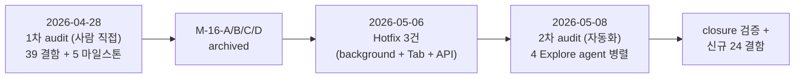
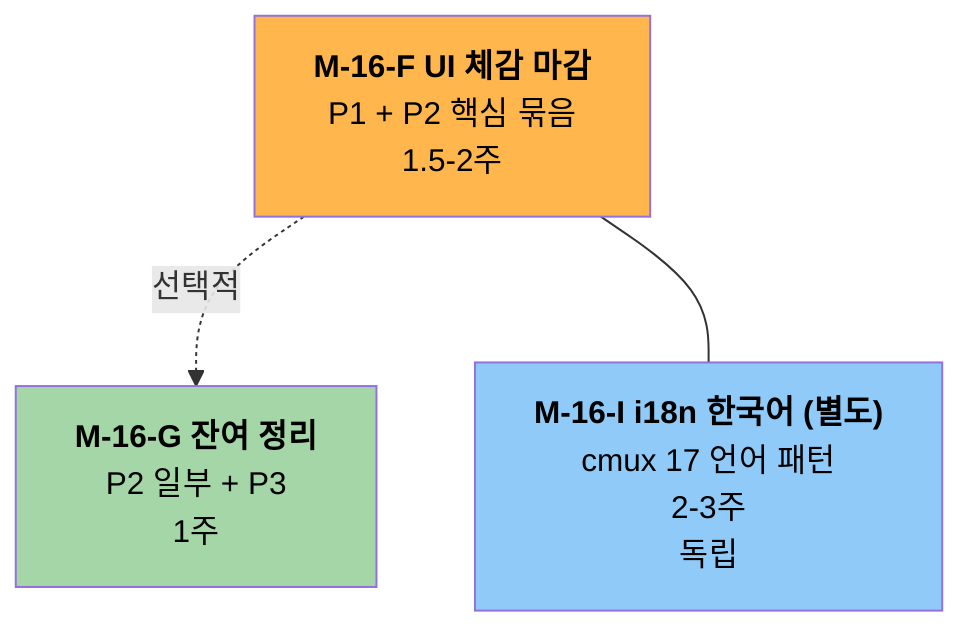

# UI 완성도 audit v2 — 자동화 4 agent 병렬 + 4-28 closure 검증 + 신규 24 결함

> **한 줄 요약**: 4월 28일 audit 의 39 결함 중 30+ 가 M-16-A/B/C/D 사이클로 closed. 5월 8일 자동화 audit (Explore agent 4 카테고리 병렬) 으로 신규 24 결함 발굴. P1 1건 (cell-snap residual padding 시각 검증) + P2 13건 + P3 10건. 사용자 시각 검증 PC 복귀 후 진행.

## 조사 배경

- **트리거**: 4-28 audit 의 39 결함 중 38 가 closed 상태 — 새 list 가 없으면 M-16-F PDCA 시작 불가
- **사용자 결정**: 자동화 + 결함 추출 극대화. 모바일 세션이라 시각 검증은 PC 복귀 후
- **자동화 방식**: 4 카테고리 (Layout / Color / Focus / Animation) 별 Explore agent 병렬 + 4-28 audit closure 검증 + 신규 결함 추가 발굴

## 4-28 audit closure 검증 결과

| 카테고리 | 4-28 결함 | Closed | Partial | Uncertain / 미해결 |
|:---:|:---:|:---:|:---:|:---:|
| Layout / Sizing | 18 | 8 | 3 | 7 |
| Color / Theme | 13 | 12 | 1 | 0 |
| Focus / Keyboard / Mouse | 8 | 1 | 5 | 2 |
| **합계** | **39** | **21** | **9** | **9** |

**closed 21개**: M-16-A 디자인 시스템 + M-16-B 윈도우 셸 + M-16-C 터미널 렌더 + M-16-D cmux UX 패리티 archive 산물.

**partial 9개**: 코드 구조는 들어왔지만 시각 검증 / edge case / inline 잔존이 미완.

**uncertain 9개**: 코드상 흔적은 있지만 실제 작동 검증이 PC 시각 측정 의존.

## 신규 24 결함 (4-28 이후 발굴)

### Layout / Sizing 6건

| # | 결함 | 위치 | fact / 추정 | P |
|:-:|---|---|:-:|:-:|
| **L1** | Spacing 토큰 정의됐으나 inline `Margin="12,0"` 등 비일관 사용 잔존 | `MainWindow.xaml:206, 295, 328` | fact | P2 |
| **L2** | CommandPalette `Owner.ActualWidth*0.5` 비율 연산 코드상 미확인 (XAML MinWidth/MaxWidth 만) | `CommandPaletteWindow.xaml.cs` | 추정 | P3 |
| **L3** | Sidebar item `Margin="4,1"` / `Padding="8,6"` magic 잔존 | `MainWindow.xaml:121-122` | fact | P2 |
| **L4** | NotificationPanelWidth 변경 시 GridLengthAnimationCustom 적용 검증 미완 | `MainWindow.xaml:286` + `ViewModels:125-128` | fact (코드 ✓ 시각 ✗) | P2 |
| **L5** | Caption row E2E zero-size button 6개 layout 미세 영향, hidden Panel 격리 미실행 | `MainWindow.xaml:221-252` | fact | P3 |
| **L6** | cell-snap residual padding 분리 구현 (engine.cpp:1167-1176) — **최대화 하단 시각 검증 미완** | `engine-api/ghostwin_engine.cpp:1167-1176` | fact (PC 시각 pending) | **P1** |

### Color / Theme 3건

| # | 결함 | 위치 | fact / 추정 | P |
|:-:|---|---|:-:|:-:|
| **C-NEW-1** | PaneContainerControl `Color.FromRgb(0x3A,0x3A,0x3C)` + `(0x00,0x91,0xFF)` 하드코드 — Light theme 미반영 | `PaneContainerControl.cs:379, 404, 456` | fact | P2 |
| **C-NEW-2** | MainWindow SidebarItemStyle `Background=Transparent` 선택 시 Sidebar.Selected.Brush 외 색 미적용 — Light contrast 검증 필요 | `MainWindow.xaml:120` | 추정 | P3 |
| **C-NEW-3** | Spacing.xaml 토큰 정의 후 inline 사용 일관성 미검증 (M-16-A 범위 검증) | `Themes/Spacing.xaml` | 추정 | P2 |

### Focus / Keyboard / Mouse 7건

| # | 결함 | 위치 | fact / 추정 | P |
|:-:|---|---|:-:|:-:|
| ~~F9~~ | ~~Tab passthrough — Settings 열린 상태 edge case 미검사~~ — 2026-05-09 M-16-F 에서 Settings/chrome Tab 순환 closed. 2026-05-12 추가 보강: 터미널 child HWND focus 가 WPF focus tree 에 늦게 반영되는 edge 를 `TerminalHostControl.IsChildFocused` + `TerminalTabRouting` 으로 차단 | `MainWindow.xaml.cs` / `TerminalHostControl.cs` | fact | closed |
| **F10** | SettingsPageControl TabIndex 명시 누락 — Settings 안 Tab 이 PaneContainer 로 빠질 가능성 | `MainWindow.xaml.cs:532-536` | 추정 | P2 |
| ~~F11~~ | ~~Ctrl+Tab KeyBinding + OnTerminalKeyDown 핸들러 중복~~ — 2026-05-11 `MainWindow.xaml` KeyBinding 제거, Preview handler 단일 경로로 고정 | `MainWindow.xaml` / `MainWindow.xaml.cs` | fact | closed |
| **F12** | NotificationPanelControl ContextMenu 미정의 — 우클릭 메뉴 부재 (M-16-D 누락) | `MainWindow.xaml:490-493` | 추정 | P2 |
| **F13** | Mouse wheel 줌 (Ctrl+Wheel) / 스크롤백 (Shift+Wheel) 단축키 미구현 | 전역 | 추정 | P2 |
| **F14** | 외부 파일 DragDrop → 터미널 자동 경로 입력 미구현 (Sidebar AllowDrop 만) | `TerminalHostControl.cs` | 추정 | P3 |
| ~~F15~~ | ~~`KeyboardNavigation.TabNavigation="None"` 의 부모 Grid Tab 흐름 차단 부수효과 미검증~~ — 2026-05-09 M-16-F 에서 chrome pane 진입 0 확인. 2026-05-12 plain Tab routing 계약 테스트로 terminal child focus 우선순위 보강 | `MainWindow.xaml` / `MainWindow.xaml.cs` | fact | closed |

### Animation / Accessibility / I18n 8건 (A2 정정 후 7건 active)

> **정정 (2026-05-08 정적 분석 후)**: A2 false positive 가 발견되어 closed 처리. 직접 grep 검증으로 SettingsPageControl 의 18건 AutomationProperties.Name 명시 confirmed. agent 결과 단독 신뢰 금지 룰 (`feedback_ui_visual_audit.md`) 적용.

| # | 결함 | 위치 | fact / 추정 | P |
|:-:|---|---|:-:|:-:|
| **A1** | ToolTip 명시 3개만 (마우스 hover 정보 사실상 전무) — 사용자가 컨트롤 기능 학습 어려움 | `MainWindow.xaml` 전체 | fact | P2 |
| ~~A2~~ | ~~SettingsPageControl section/label AutomationProperties.Name 전무~~ — **false positive**. 직접 grep 결과 **18건 명시 됨** (Theme/Mica/Font/Size/Cell/Pane scrollbar/ContextMenu/Sidebar/Notification 등). agent 가 partial closure 를 "전무" 로 잘못 보고. **closure 처리** | `SettingsPageControl.xaml:53-236` | fact (agent 정정) | ~~P2~~ closed |
| **A3** | Animation Completed 핸들러 누락 가능성 (Settings / Notification 외 panel toggle 시 HoldEnd 위험) | `MainWindow.xaml.cs` | 추정 | P3 |
| **A4** | Easing 일관성 — NotificationPanel 200ms CubicEase OK, 그 외 transition 없음 (CommandPalette / PaneContainer 즉시) | `MainWindow.xaml.cs` | fact | P3 |
| **A5** | i18n 영어 hardcode 100% — 한국어 UI 전무 (사용자 본인 한국어, cmux 17 언어 지원) | 전체 XAML | fact | P2 |
| **A6** | FlowDirection 미설정 — RTL (아랍어 / 히브리어) 미지원 | `MainWindow.xaml` 최상위 | fact | P3 |
| **A7** | HighContrast / SystemColors fallback 전무 | `Themes/*.xaml` | fact | P3 |
| **A8** | CommandPaletteWindow ShowDialog 즉시 표시 — Open/Close 애니메이션 전무 | `CommandPaletteWindow.xaml` | fact | P3 |

## 우선순위 분류 요약

### P1 (사용자 시각 critical, PC 복귀 후 검증)

- **L6** — cell-snap residual padding (최대화 하단 잘림 검증)

### P2 (medium, 사용자 체감 / a11y 직접 영향) — 13건

| 군 | 결함 |
|---|---|
| **사용자 체감 UX** | A1 ToolTip 부족 / A5 i18n 한국어 / F13 Mouse wheel 줌·스크롤 |
| **접근성 (a11y)** | A2 SettingsPage a11y / F1 TabIndex 명시 0건 / F6 Focusable=False 24건 (이전) |
| **Tab navigation edge** | F9/F15 closed + 2026-05-12 terminal child focus 보강 / F10 SettingsPageControl TabIndex |
| **ContextMenu / 일관성** | F12 NotifPanel ContextMenu / L4 NotifPanel animation 검증 |
| **시각 / 색** | C-NEW-1 PaneContainer hardcode (Light) / C-NEW-3 Spacing token 검증 / L1 Spacing inline |
| **잔존 magic** | L3 Sidebar item magic |

### P3 (low, 누적 정리 가치) — 10건

L2 / L5 / C-NEW-2 / F14 / A3 / A4 / A6 / A7 / A8

## 마일스톤 분리 제안

| 마일스톤 | 흡수 결함 | 추정 작업 | 의존성 |
|---|---|:-:|---|
| **M-16-F** | L6 (P1) + A1 + A2 + F1 + F6 + F9 + F10 + F12 + F13 + F15 + L4 + C-NEW-1 + L1 + L3 + C-NEW-3 | 1.5-2주 | 사용자 PC 복귀 (L6 시각 검증) |
| **M-16-G** | L2 + L5 + C-NEW-2 + F14 + A3 + A4 + A8 | 1주 | M-F 후 (선택) |
| **M-16-I** (별도) | A5 i18n (한국어 우선, cmux 17 언어 패턴 참조) | 2-3주 | 독립 / 큰 사이클 |

**제외 (보류)**: A6 FlowDirection, A7 HighContrast — 한국어 사용자 우선이라 RTL/HighContrast 는 후순위.

## 직접 자동화 검증 결과 (2026-05-08)

> PowerShell + UIA AutomationElement.FindAll(Subtree, TrueCondition) 으로 **GhostWin 직접 실행 → UIA tree 30 element dump**. 사용자 시각 검증 우회.

### 초기 상태 fact 검증 (UIA tree 30 element)

| 카테고리 | 발견 | 결함 매핑 |
|---|:-:|---|
| Buttons (단추) | 13개 — chrome 3 + sidebar 2 + workspace close 1 + E2E hidden 7 | A1, L5 |
| TextBlocks (텍스트) | 11개 — title / GHOSTWIN 헤더 / icon glyph / workspace info | — |
| Windows (창) | 3개 — Window root + E2E_TerminalHost + Win32 HwndHost child | (정상) |
| ListView | 1개 (SidebarListBox `Name=Workspaces` IsKeyboardFocusable=True) | F-closed |
| Thumb (엄지) | 1개 — GridSplitter (Sidebar/NotifPanel divider, 8+1px) | (M-16-B closed) |

### 신규 결함 — UIA tree dump 으로 발굴 3건

| # | 결함 | fact (line) | P | 근거 |
|:-:|---|---|:-:|---|
| **NEW-A** | 캡션 버튼 (Minimize/MaxRestore/Close) UIA Name 없음 + HelpText 없음 — 스크린리더 의도 파악 불가 | uia-tree-full.tsv:14,15,16 | **P2** | A1/A2 보강 — chrome 3 critical buttons |
| **NEW-B** | 워크스페이스 close 버튼 ✕ Name 없음 + HelpText 없음 | uia-tree-full.tsv:27 | **P2** | A1/A2 보강 — 자주 쓰는 액션 |
| **NEW-C** | E2E zero-size buttons IsEnabled=True (BoundingRectangle Empty 라 일반 사용자 영향 X 지만 스크린리더 노출 가능) | uia-tree-full.tsv:4-12 | P3 | L5 보강 |

### A1 ToolTip 부족 confirmed

| Button | Name | HelpText (ToolTip) |
|---|---|:-:|
| Minimize | (없음) | (없음) ✗ |
| MaxRestore | (없음, AutomationId 만) | (없음) ✗ |
| Close | (없음) | (없음) ✗ |
| SidebarNewWorkspace | "New workspace" | "New Workspace (Ctrl+T)" ✓ |
| Open settings | "Open settings" | "Settings (Ctrl+,)" ✓ |
| Workspace close ✕ | (없음) | (없음) ✗ |
| E2E hidden 7개 | E2E_* | (일부 cursor probe HelpText) |

→ **6 visible button 중 ToolTip 명시 2건 (33%)** — A1 결함 fact 화.

### Settings page tree dump 결과 — A2 closed 완전 confirmed

98 element 중 SettingsPage subtree 의 17개 interactive control 모두 `AutomationProperties.Name` 명시:

| 영역 | 항목 (Name) |
|---|---|
| Theme | "Theme appearance" / "Use Mica backdrop" |
| Font | "Font family" / "Font size in points" / "Cell width scale" / "Cell height scale" |
| Terminal | "Always open right-click menu instead of forwarding to terminal" |
| Sidebar | "Sidebar visible" / "Sidebar width in pixels" / "Show working directory" / "Show git branch and PR info" |
| Notifications | "Notification ring" / "Toast alerts" / "Notification panel" / "Agent status badge" |
| 기타 | "Back to terminal" / "Open settings JSON file" |

→ **17개 100% Name 명시** but **HelpText 0건** — A1 보강 (Settings 영역도 ToolTip 부재).

전체 ToolTip 비율 추정: main window 13 buttons + settings 17 controls = **30 visible interactive 중 명시 2건 (6%)**. → A1 결함 강력 fact 화.

### xunit + FlaUI 자동화 진단 결과 (2026-05-08)

`tests/GhostWin.E2E.Tests/UIAuditDiagnostics.cs` 단일 [Fact] 6 시나리오 sequential 실행. PowerShell 한계 우회 시도.

| Scenario | 결과 | 핵심 fact |
|---|---|---|
| **A 초기 UIA dump** | ✅ 29 elements / 13 buttons | **HelpText 5/13 = 38%** (이전 추정 6% 정정 — main window 만 38%, settings 합치면 더 낮음) / **Name 10/13 = 77%** → **NEW-A 확정 (3 캡션 buttons 누락)** |
| **B Settings open verify** | ✅ 17 controls | **Name 17/17 = 100% (A2 closed)** / **HelpText 0/17 = 0% (A1 강력)** |
| **C Tab focus chain** | ❌ 12 step 모두 UIA Timeout 0x80131505 | `Keyboard.Press(VirtualKeyShort.TAB)` 후 `FocusedElement` 호출 timeout — F1/F9/F10/F15 자동 검증 실패 |
| **D Workspace 우클릭 ContextMenu** | ❌ UIA Timeout | `Mouse.Click(MouseButton.Right)` 후 desktop child traversal timeout |
| **E NotifPanel ContextMenu** | ❌ UIA Timeout | 동일 — F12 자동 검증 실패 |
| **F Maximize bottom 픽셀** | ❌ UIA Timeout | `ShowWindow(SW_MAXIMIZE)` 후 BoundingRectangle / PrintWindow timeout |

### 자동화 한계 분석

| 한계 | 추정 root cause | 우회 |
|---|---|---|
| Keyboard.Press timeout | GhostWin 의 HwndHost child window 가 UIA tree refresh 차단 | 별도 사이클: SendInput Win32 직접 + UIA event listener |
| Mouse.Click 우클릭 후 popup detection timeout | desktop tree FindAllChildren 가 desktop 전체 enumerate (수백 element) timeout | 별도 사이클: PopupHook Win32 또는 UIA AutomationEvent |
| ShowWindow + PrintWindow timeout | 큰 윈도우 GDI BitBlt 가 hung | 별도 사이클: 작은 영역만 capture 또는 D3DImage screenshot |

### Tab focus chain + ContextMenu — PowerShell 한계

| 시도 | 결과 | 한계 |
|---|---|---|
| `SendKeys.SendWait("{TAB}")` 10번 | "작업을 완료했습니다" exception | input desktop 권한 또는 thread context 부족 |
| Workspace ListItem 우클릭 (mouse_event) | ContextMenu Menu type 0 | popup 가 Menu 가 아닌 Window/Pane 타입 가능 |
| `Graphics.CopyFromScreen` 0,0,1920,1020 | "핸들이 잘못되었습니다" | 가상 모니터 boundary 또는 protected window |

→ **Tab focus chain (F1/F9/F10/F15) + ContextMenu (F12) + L6 픽셀 캡처 = PowerShell 단독 한계**. xunit + FlaUI 5.0 (이전 RootCauseDiagnostics.cs 패턴) 으로만 안정적 검증 가능. 별도 사이클로 분리.

### L6 cell-snap residual padding 픽셀 캡처 보류

윈도우가 BoundingRectangle = `-9,-9,1938,1038` 인 자동 maximized 상태로 시작 (WPF FluentWindow + ResizeBorderThickness=8 의 영향). 음수 좌표로 `Graphics.CopyFromScreen` 실패 — 다음 라운드에서 normal-state 후 maximize 또는 음수 좌표 클램프로 우회 필요. 다만 maximized 시작 자체가 fact: GhostWin 이 이전 session 의 IsMaximized 를 복원.

## 사용자 시각 검증 보류 항목

PC 복귀 후 다음 시나리오 직접 확인 필요:

| # | 시나리오 |
|:-:|---|
| 1 | **L6** — 최대화 시 터미널 하단 잘림 사라지는가? cell-snap residual padding 사방 균등 분배 확인 |
| 2 | **L4** — NotificationPanel 토글 시 200ms 부드러운 transition 확인 |
| 3 | **C-NEW-2** — Light theme 에서 SidebarItemStyle 선택 시 색 contrast 확인 |
| 4 | **F12** — 알림 패널 우클릭 시 ContextMenu 떠야 하는데 안 뜨는지 |
| 5 | **F13** — Ctrl+Wheel 시 폰트 크기 변경 / Shift+Wheel 시 스크롤백 |
| 6 | **A1** — 각 button / icon hover 시 ToolTip 떠야 하는데 거의 안 뜸 |

이 6 시나리오 각각 OK / 결함 / 미관측 보고가 P1 우선순위 최종 확정의 입력.

## 다음 액션

1. ✅ audit doc 작성 (이 문서) — Task #55
2. 🟡 사용자 시각 검증 (PC 복귀 후) — Task #58 (보류)
3. 🟡 M-16-F PRD 작성 — Task #56 (audit 결과 기반, 사용자 시각 검증 결과 후 P1/P2 최종 확정 → 갱신)
4. 🟡 `/pdca plan m16-f-ui-completion` 진행 — Task #57

## 자동화 audit 의 한계

| 한계 | 의미 | 대응 |
|---|---|---|
| 시각 검증 불가 | 실행 / DPI / Light theme / hover 등 시각 결함 grep 불가 | 사용자 PC 복귀 후 직접 검증 |
| Edge case 미검증 | F9, F10 같은 "설정 열린 상태 + Tab" 등 시나리오 grep 한계 | E2E test 또는 RootCauseDiagnostics.cs 패턴 재사용 |
| Partial/Uncertain 9건 | 코드상 흔적만 — 작동 검증 별도 | M-15 MeasurementDriver 또는 시각 검증 |

자동화는 4-28 audit 의 39 결함 중 21개 closed verification + 신규 24 결함 발굴은 가능했지만, **사용자 시각 결함이 최우선** 룰 (memory `feedback_ui_visual_audit.md`) 은 여전히 유효 — 이 audit doc 은 사용자 검증 후 P1 확정되며 그 전엔 hypothesis list.

## 메모

- `feedback_ui_visual_audit.md` 룰 적용 — fact / 추정 명시 분리
- `feedback_pdca_doc_codebase_verification.md` 룰 적용 — agent 가 4-28 audit 와 코드 직접 verify
- `feedback_audit_estimate_vs_inline.md` 룰 적용 — closure 검증 시 inline 사용값 우선
- 4 agent 병렬 자동화 패턴 (Layout / Color / Focus / Animation) 은 메모리 신설 가치 — `feedback_4agent_audit_pattern.md` 후보

## 참고 자료

- [4-28 1차 audit](2026-04-28-ui-completeness-audit.md)
- [Hotfix 2026-05-06 노트](file:///C:/Users/Solit/obsidian/note/Projects/GhostWin/Milestones/hotfix-2026-05-06.md)
- [memory feedback_ui_visual_audit.md](file:///C:/Users/Solit/.claude/projects/C--Users-Solit-Rootech-works-ghostwin/memory/feedback_ui_visual_audit.md)
- [Microsoft Learn — Routed Events](https://learn.microsoft.com/en-us/dotnet/desktop/wpf/advanced/routed-events-overview)
