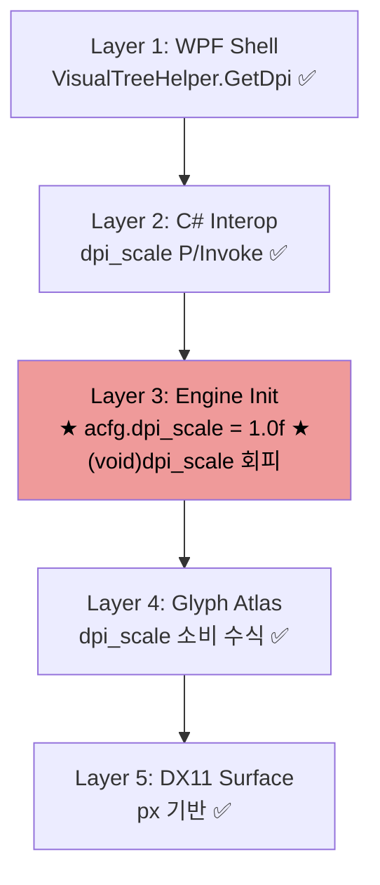
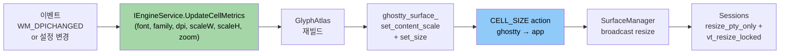

# dpi-scaling-integration — 스케일 파이프라인 통합 계획

> **부모 마일스톤**: [[Milestones/pre-m11-backlog-cleanup]] Group 4 #13
> **상태**: Plan 갱신됨 (2026-04-15) — **4 agent 병렬 재검증 (team mode) + 5 결정 확정**
> **최초 Placeholder**: 2026-04-14
> **선행 예정 마일스톤**: M-12 Settings UI

---

## 맨 위 요약 (1~2 문장)

DPI 를 런타임에 바꾸고, 설정 창에서 폰트/줌까지 같은 파이프라인으로 변경 가능하게 만드는 작업. 단순 "DPI 96 고정 해제" 가 아니라 **"스케일 전반의 런타임 재적용 시스템"** 이 본질.

---

## Executive Summary

| Perspective | Content |
|-------------|---------|
| **Problem** | DPI 가 `ghostwin_engine.cpp:355` 에서 `1.0f` 로 강제됨. C# → native 배선은 이미 살아있으나 엔진이 값을 버림. 런타임 DPI 변경 미지원 (`DpiChanged` 핸들러 0 건). ghostty C API 의 DPI 함수 전부 미사용. 설정 시스템이 C++ / C# 이원화 + Observer 구현자 0 명 상태. M-12 에서 폰트 UI 추가 시 재구조화 필요 위험 |
| **Solution** | **통합 API `UpdateCellMetrics(font, family, dpi, scaleW, scaleH, zoom)`** 단일 진입점. ghostty 3 API (`set_content_scale`, `set_size`, `CELL_SIZE action`) 전부 통합. WPF `DpiChanged` 런타임 핸들러 추가. C# `AppSettings.Terminal.Font` 필드 선제 추가. C++ `ISettingsObserver` 체인 활성화 |
| **Function/UX Effect** | 고 DPI 모니터에서 선명한 렌더 + 모니터 간 이동 자동 반응 + M-12 설정 창이 폰트/DPI/줌을 즉시 반영 (앱 재시작 불필요) |
| **Core Value** | Pre-M11 재설계 3 건 중 마지막. M-12 수용 기반. 스케일 변경 파이프라인 확립 |

---

## 배경 — 재검증으로 확인된 사실

### Placeholder 주장 vs 실제 (4 agent 재검증)

| 항목 | Placeholder | 재검증 결과 |
|------|-------------|-------------|
| "DPI 96 하드코딩" | 대략 묘사 | **정확히 `ghostwin_engine.cpp:355` 1 줄** (`acfg.dpi_scale = 1.0f`) + `:356` `(void)dpi_scale` 회피 |
| "이전 수정 → 되돌림" | 주장 | **git 확인** — `31a2235` 도입 (2026-04-13) → `3a28730` 되돌림 (2026-04-14). TODO 주석에 "coordinated cell size + viewport + ConPTY resize 필요" 명시 |
| "부분 대응" | 암시 | **확정** — C# (WPF Shell → Interop → Engine init) 전체 배선 **살아 있음**. 엔진 내부 1 줄만 덮어씀. 반쪽 구현 |
| "동기화 안 되어 깨짐" | 주장 | **확실하지 않음** — 되돌림 주석에 "text overflow" 명시되나 실제 재현 증거 없음. 선제 판단 가능성 |

### 추가 발견 (Placeholder 에 없던 것)

| 발견 | 출처 | 시사점 |
|------|------|--------|
| `DpiChanged` WPF 핸들러 0 건 | Agent 1 | 모니터 이동 시 반응 안 함 |
| `gw_render_resize` 에 DPI 인자 없음 | Agent 1 | 리사이즈 경로에 DPI 갱신 채널 없음 |
| ghostty C API 의 `set_content_scale`, `set_size`, `CELL_SIZE action` 전부 미사용 | Agent 4 | ghostty 가 이미 해주는 일을 우리가 안 쓰는 중 |
| C++ `src/settings/` 에 폰트/셀 scale 스키마 있음, 관찰자 0 명 | Agent 3 | 인프라는 있지만 껍데기만 살아있음 |
| C# `AppSettings` 에 폰트 필드 자체 없음 | Agent 3 | M-12 에서 추가될 것. 선제 추가 권장 |
| `MainWindow.xaml.cs:194` 폰트 하드코딩 (`14.0f`, `"Cascadia Mono"`) | Agent 3 | 런타임 변경 불가 |

---

## 지금 어떻게 작동하는가 — 5 계층 지도



**95% 배선 완성**, Layer 3 한 줄에서 차단.

---

## 목표 상태 — 스케일 통합 파이프라인



---

## 5 가지 결정 확정 (사용자 2026-04-15)

| # | 결정 | 선택 | 의미 |
|:-:|------|:----:|------|
| 1 | 엔진 API | **B (통합)** | `UpdateCellMetrics(font, family, dpi, scaleW, scaleH, zoom)` 단일 진입점 |
| 2 | ghostty C API | **C (전부)** | `set_content_scale` + `set_size` + `CELL_SIZE action` 콜백 |
| 3 | 런타임 DPI 변경 | **B (반응함)** | `WM_DPICHANGED` / `Window.DpiChanged` 처리 |
| 4 | `AppSettings` 폰트 | **B (선제 추가)** | `Terminal.Font { Size, Family }` 필드 미리 추가. M-12 가 UI 만 바인딩 |
| 5 | Observer 체인 | **B (활성화)** | `ISettingsObserver` 구현체 신설 — 설정 변경 → 자동 파이프라인 |

→ **완전 조합**. 설정 시스템까지 이번에 통합.

---

## 해결 방법 — 5 결정 반영 상세

### 5.1 결정 1 — `UpdateCellMetrics` 통합 API

```csharp
// IEngineService (C#)
int UpdateCellMetrics(
    float fontSizePt,       // 예: 14.0
    string fontFamily,      // 예: "Cascadia Mono"
    float dpiScale,         // 예: 1.5 (150%)
    float cellWidthScale,   // 예: 1.0 (기본)
    float cellHeightScale,  // 예: 1.0 (기본)
    float zoom);            // 예: 1.0 (기본)
```

엔진 내부에서:
1. Effective font size = `fontSizePt × dpiScale × zoom`
2. GlyphAtlas 재빌드 (필요 시 — 폰트 패밀리 바뀌거나 size 변경)
3. 모든 Surface 에 새 cell metrics broadcast
4. 각 Session `resize_pty_only + vt_resize_locked`

### 5.2 결정 2 — ghostty C API 통합

| API | 역할 | 호출 시점 |
|-----|------|-----------|
| `ghostty_surface_set_content_scale(sfc, sx, sy)` | 런타임 DPI 전달 | `UpdateCellMetrics` 시 |
| `ghostty_surface_set_size(sfc, w_px, h_px)` | 픽셀 크기 갱신 (내부에서 cols/rows 재계산) | 동상 |
| `GHOSTTY_ACTION_CELL_SIZE` 콜백 수신 | ghostty 가 새 cell px 통지 | ghostty → 우리 엔진 |

### 5.3 결정 3 — WPF `DpiChanged` 핸들러

```csharp
// MainWindow.xaml.cs
protected override void OnDpiChanged(DpiScale oldDpi, DpiScale newDpi)
{
    base.OnDpiChanged(oldDpi, newDpi);  // Windows 자동 창 크기 조정 수용
    _engineService.UpdateCellMetrics(
        fontSize, fontFamily, (float)newDpi.DpiScaleX,
        cellW, cellH, zoom);
}
```

### 5.4 결정 4 — `AppSettings.Terminal.Font` 선제 추가

```csharp
public class TerminalSettings {
    public FontSettings Font { get; set; } = new();
}
public class FontSettings {
    public float Size { get; set; } = 14.0f;
    public string Family { get; set; } = "Cascadia Mono";
    public float CellWidthScale { get; set; } = 1.0f;
    public float CellHeightScale { get; set; } = 1.0f;
}
```

필드만 추가 (UI 없음). JSON 직렬화 포함. `MainWindow.xaml.cs:194` 의 하드코딩을 이 값으로 교체.

### 5.5 결정 5 — `ISettingsObserver` 활성화

C++ `src/settings/settings_manager.cpp` 에 **엔진 측 observer 구현체** 신설:

```cpp
class CellMetricsObserver : public ISettingsObserver {
    void on_settings_changed(const AppConfiguration& cfg, ChangedFlags flags) override {
        if (flags & (ChangedFlags::TerminalFont | ChangedFlags::TerminalWindow)) {
            engine_->update_cell_metrics(cfg.terminal.font, ...);
        }
    }
};
```

C# `SettingsService` ↔ C++ `SettingsManager` 통합 방식은 Design 에서 결정 (후보: C# 이 직접 `UpdateCellMetrics` 호출 / C++ Observer 가 C# 이벤트 수신).

---

## 왜 안전한가

| 근거 | 출처 |
|------|------|
| PerMonitorV2 manifest 이미 정상 | Agent 1 (`app.manifest`) |
| Layer 1/2/4/5 배선 완성. Layer 3 만 복구 필요 | Agent 1 (5 계층 지도) |
| ghostty C API 가 이미 제공 중 (우리만 안 씀) | Agent 4 (`ghostty.h:1090,1093`) |
| vt-mutex cycle 에서 `resize_pty_only + vt_resize_locked` 분리 완료 → Surface broadcast 기반 존재 | 본 프로젝트 최근 commit |
| `31a2235` 되돌림의 우려 ("text overflow") 가 cols/rows 재계산을 반드시 포함하는 통합 API 로 원천 차단 | Agent 2 |

---

## 작업 범위

### 필수 작업

| # | 위치 | 변경 | LOC |
|:-:|------|------|:---:|
| 1 | `src/engine-api/ghostwin_engine.h/.cpp` | `UpdateCellMetrics` native 함수 신설 + `gw_render_init` 의 `:355` 복구 | ~80 |
| 2 | `src/GhostWin.Core/Interfaces/IEngineService.cs` | `UpdateCellMetrics` 인터페이스 추가 | ~10 |
| 3 | `src/GhostWin.Interop/EngineService.cs`, `NativeEngine.cs` | P/Invoke + 구현 | ~30 |
| 4 | `src/renderer/glyph_atlas.cpp/.h` | 런타임 재빌드 지원 (현재는 재생성만) | ~50 |
| 5 | `src/engine-api/ghostwin_engine.cpp` | `gw_surface_resize` 에 DPI 전파 + `set_content_scale` + `set_size` 호출 | ~40 |
| 6 | ghostty `CELL_SIZE action` 콜백 연결 | ~30 |
| 7 | `src/GhostWin.App/MainWindow.xaml.cs` | `OnDpiChanged` override + 하드코딩 폰트 제거 | ~30 |
| 8 | `src/GhostWin.App/Controls/TerminalHostControl.cs` | 필요 시 `DpiChanged` 전파 | ~20 |
| 9 | `src/GhostWin.Core/Models/AppSettings.cs` | `TerminalSettings + FontSettings` 추가 | ~30 |
| 10 | `src/GhostWin.Services/SettingsService.cs` | Font 섹션 로드/저장 | ~20 |
| 11 | `src/settings/settings_manager.cpp` | C++ observer 활성화 로직 | ~30 |
| 12 | C# ↔ C++ 설정 브릿지 | Design 에서 결정 | ~40 |
| 13 | ADR (신규 또는 ADR-006 옆) | DPI/폰트 파이프라인 결정 | — |

소계: 코드 ~410 LOC + 문서

### 선택 작업

| # | 항목 | 비고 |
|:-:|------|------|
| 14 | 줌 단축키 (`Ctrl+=`, `Ctrl+-`) | 본 cycle 스코프 포함 여부 결정 필요 |
| 15 | 단위 테스트 (멀티 DPI 시각 검증) | 복잡, 별도 cycle 권장 |

---

## 비교표 — 원 Placeholder vs 갱신본

| 항목 | 원 Placeholder | 갱신본 |
|------|---------------|--------|
| 문제 기술 | "DPI 96 하드코딩" | **정확한 1 줄 + 반쪽 구현 상태** |
| 해결 후보 | A (per-window) / B (monitor event) | **통합 API 1 개 + ghostty 3 API + DpiChanged** |
| 예상 LOC | Plan 400, Design 600, Do 대 | Plan 300 + Design 600 + **Do ~410 LOC** |
| M-12 수용 | 언급 없음 | **선제 AppSettings 확장 + Observer 활성화** |

---

## 리스크 + 완화

| 리스크 | 발생 가능성 | 영향 | 완화 |
|--------|:----------:|:----:|------|
| `31a2235` 의 "text overflow" 재발 | 중 | 중 | 통합 API 가 cols/rows 재계산까지 원자적으로 수행 |
| ghostty `CELL_SIZE action` 콜백 처리 복잡 | 중 | 중 | Design 에서 콜백 스레드 안전성 명세 |
| `DpiChanged` 와 `SizeChanged` 순서 경쟁 | 저 | 중 | WPF 보장 순서 사용 + 단일 tick 처리 |
| C# ↔ C++ 설정 이원화 충돌 | 중 | 중 | Design 에서 **단일 출처** 결정 (후보: C# primary, C++ observer 는 reflection) |
| Atlas 재빌드 중 렌더 스레드 race | 저 | 고 | vt-mutex cycle 의 `vt_mutex` 활용, shared_ptr alias 패턴 |
| 모니터 이동 시 setWindowPos 누락 | 저 | 저 (창 크기 불일치) | `base.OnDpiChanged` 호출로 WPF 자동 처리 수용 |

---

## 확실하지 않은 부분 (Design 에서 결정)

- ⚠️ `ghostty_surface_set_content_scale + set_size` 가 내부적으로 ConPTY resize 까지 트리거하는지 (Agent 4) — Design 에서 ghostty Zig 구현 확인 필요
- ⚠️ C# ↔ C++ 설정 이원화 방침 (Agent 3) — "C# primary, C++ mirror" vs "C++ primary, C# wrapper" 중 선택
- ⚠️ `CELL_SIZE action` 콜백을 WPF UI 스레드에서 받을지 엔진 스레드에서 받을지
- ⚠️ 줌 (Ctrl+=/-) 단축키를 본 cycle 에 포함할지 M-12 로 미룰지

---

## 진입 조건

- [x] 코드 재검증 완료 (4 agent 병렬, 2026-04-15)
- [x] 5 결정 확정 (사용자 2026-04-15)
- [x] 본 Plan 갱신 완료
- [ ] Design 문서 작성 (Plan LOC ~410 → Design LOC ~600 예상)
- [ ] ADR 초안 (Scale Pipeline)
- [ ] Design 승인 후 `/pdca do dpi-scaling-integration` 진입

---

## 요약 한 줄

DPI + 폰트 + 줌을 **한 진입점 (`UpdateCellMetrics`)** 으로 받고, ghostty C API 통합 + WPF `DpiChanged` 핸들러 + `AppSettings` 선제 확장 + Observer 활성화를 **한 cycle** 에 처리. Pre-M11 마지막 재설계 + M-12 수용 기반.

---

## 관련 문서

- `docs/adr/` (신규 또는 ADR-014 Scale Pipeline 예정)
- Obsidian [[Backlog/tech-debt]] #20
- Obsidian [[Milestones/pre-m11-backlog-cleanup]] Group 4 #13
- Obsidian [[Milestones/roadmap]] (M-12 Settings UI)
- 되돌림 commit: `3a28730` (2026-04-14, `ghostwin_engine.cpp:352-356` TODO)
- 이전 시도 commit: `31a2235` (2026-04-13, `dpi_scale` 파라미터 도입)
- ghostty C API: `external/ghostty/include/ghostty.h:1090,1093,724-728`
- MSDN DPI Awareness: https://learn.microsoft.com/en-us/windows/win32/hidpi/high-dpi-desktop-application-development-on-windows
- MSDN WM_DPICHANGED: https://learn.microsoft.com/en-us/windows/win32/hidpi/wm-dpichanged
