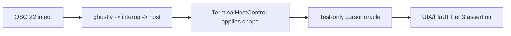
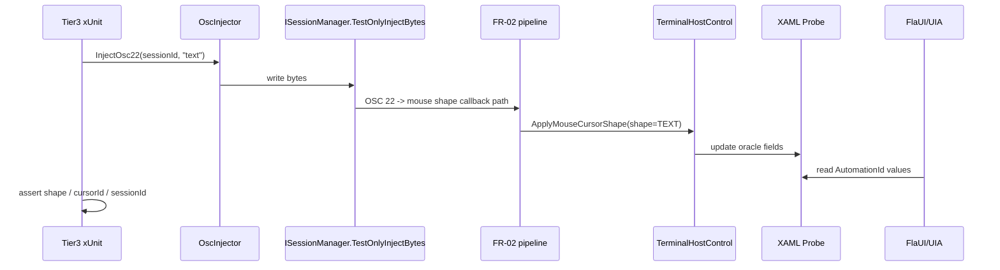

# Plan — FR-02 Mouse Cursor Automation

> **문서 종류**: Plan
> **작성일**: 2026-04-19
> **대상 범위**: FR-02 Mouse Cursor Shape의 신뢰도 높은 자동화 검증
> **선행 구현**: `docs/01-plan/features/fr-02-mouse-cursor-shape.plan.md` 구현 완료
> **기반 인프라**: `tests/GhostWin.E2E.Tests/` (M-11.5 E2E 허브)
> **목표 마일스톤**: M-13 FR-02 검증 완결

> **구현 완료 메모 (2026-04-20)**  
> 이 Plan 의 핵심 범위는 모두 구현됐다.
> - Tier 3 Oracle UIA: 완료
> - session/workspace 회귀 시나리오: 완료
> - Tier 4 Win32 smoke (`GetCursorInfo`): 완료
>
> 실제 구현에서 달라진 점:
> - probe 컨트롤은 hidden `TextBlock` 대신 **0x0 `Button` + AutomationProperty** 로 갔다. WPF/UIA 에서 더 안정적으로 노출됐다.
> - `TestOnlyInjectBytes` 는 child stdin 이 아니라 **direct VT injection path** 로 바뀌었다. `OSC 22` 는 VT output parser 가 봐야 해서 이 경로가 맞다.
> - Win32 smoke 는 `SetCursorPos + WM_SETCURSOR + GetCursorInfo()` 조합으로 구현됐다.
>
> 최종 결과는 `docs/04-report/features/fr-02-mouse-cursor-automation.report.md` 를 기준으로 본다.

---

## Executive Summary

| 관점 | 내용 |
|------|------|
| **Problem** | 현재 FR-02는 단위 테스트와 수동 클릭 테스트는 가능하지만, "실제로 어떤 cursor shape가 앱 내부에 적용됐는지"를 안정적으로 재현·검증하는 자동화 경로가 없다. UIA/FlaUI는 OS-level cursor shape를 직접 읽어주지 않아 바로 검증하면 flaky해진다. |
| **Solution** | `TerminalHostControl`이 최종 적용한 `mouse shape / mapped cursor id / session id`를 **test-only cursor oracle**로 노출하고, `OSC 22` 주입 기반 Tier 3 UIA Property E2E로 검증한다. 실제 Win32 `GetCursorInfo` 기반 검증은 Slow/Nightly 보조 계층으로 분리한다. |
| **Function / UX Effect** | `text`, `pointer`, `ew-resize`, `default` 같은 핵심 shape가 자동화 테스트로 반복 검증된다. 실패 시 원인이 injection / interop / UI apply 중 어디인지 바로 좁혀진다. |
| **Core Value** | FR-02를 "수동으로 되는 것 같다" 수준에서 "지속적으로 회귀를 잡는 기능"으로 승격한다. disconnected session, active desktop, 실제 마우스 위치 같은 flaky 요소를 기본 CI 경로에서 제거한다. |

---

## 1. 현재 상태

### 1.1 이미 있는 자산

| 자산 | 위치 | 현재 활용 |
|------|------|----------|
| xUnit E2E 허브 | `tests/GhostWin.E2E.Tests/` | Tier 1~3 구조 존재 |
| UIA/FlaUI 기반 Fixture | `Infrastructure/GhostWinAppFixture.cs` | 앱 실행 + MainWindow 접근 |
| AutomationId 상수 모음 | `Infrastructure/AutomationIds.cs` | E2E selector source of truth |
| OSC 주입 스텁 | `Stubs/OscInjector.cs` | 현재 OSC 7 / OSC 9만 존재 |
| FR-02 구현 경로 | `src/GhostWin.App/...`, `src/GhostWin.Interop/...`, `src/engine-api/...` | mouse shape callback은 이미 연결됨 |
| mapper 단위 테스트 | `tests/GhostWin.App.Tests/Input/MouseCursorShapeMapperTests.cs` | 1차 정적 매핑 검증 가능 |
| workspace 전환 경로 | `MainWindow.xaml`, `MainWindowViewModel.cs` | **부분 보유** — `Ctrl+Tab` keyboard 경로 존재, 사이드바 `ListBox` UIA 선택 가능성 있음. dedicated AutomationId 자산은 아직 없음 |

### 1.2 지금 부족한 것

| 부족한 것 | 이유 |
|-----------|------|
| 앱 내부에 적용된 최종 cursor 상태를 읽는 oracle | UIA는 OS cursor 모양을 직접 노출하지 않음 |
| `OSC 22` 주입 유틸 | 현재 `OscInjector`는 mouse shape 시퀀스를 주입하지 못함 |
| Tier 3 E2E 시나리오 | NotificationRing 예약 파일만 있고 cursor 전용 시나리오 없음 |
| session/workspace 전환 회귀 검증 | 수동으로만 확인됨 |
| Slow/Nightly 실커서 smoke | `GetCursorInfo` 기반 보조 검증이 아직 없음 |

### 1.3 왜 OS cursor 직접 검증만으로 가면 안 되는가

| 방식 | 장점 | 문제 |
|------|------|------|
| `GetCursorInfo`만 사용 | 실제 시스템 포인터를 본다 | active desktop 필요, 마우스 위치 의존, 포커스/hover 타이밍 민감 |
| UIA property oracle | CI 친화적, deterministic, root cause 분리 쉬움 | 앱에 test-only probe 추가 필요 |

결론:
- **기본 CI**: UIA property oracle
- **보조 smoke**: Win32 `GetCursorInfo`

---

## 2. 설계 핵심 결정

### D-1. 기본 검증 경로는 "oracle-first"



핵심:
- 테스트는 "앱이 무엇을 적용했다고 믿는가"를 먼저 검증
- OS-level pointer는 별도 smoke로 분리

### D-2. oracle은 최소 3개 값을 노출한다

| 필드 | 이유 |
|------|------|
| `shape` | ghostty enum 값이 맞는지 확인 |
| `cursorId` | mapper 결과가 맞는지 확인 |
| `sessionId` | 잘못된 pane/host에 적용되지 않았는지 확인 |

### D-3. probe는 UIA에서 읽을 수 있어야 한다

후보:
1. 숨김 `TextBlock` + `AutomationProperties.AutomationId`
2. 기존 Window의 `AutomationProperties.HelpText`
3. test-only hidden button/property surface

추천:
- **숨김 probe element 3개**
- 이유: 읽기 단순, 파싱 명확, 기존 AutomationId 패턴과 일관

구현 규칙:
- `Visibility="Hidden"`
- `IsHitTestVisible="False"`
- `Opacity="0"`

이유:
- `Visibility="Collapsed"`는 UIA에서 읽기 어려울 수 있어 채택하지 않음
- probe는 visual tree에 남아 있어야 한다

### D-4. `OSC 22` 주입을 1차 자동화 경로로 사용한다

`vim insert/normal` 자동화는 가능하지만 외부 프로세스/상태 전이가 추가되어 flaky 포인트가 많다.

우선순위:
1. `OSC 22` 직접 주입으로 shape 파이프라인 자체 검증
2. 그 다음 필요 시 vim 통합 smoke 추가

---

## 3. 목표 아키텍처



---

## 4. 구현 범위

### 4.1 In Scope

- `OSC 22` injection helper 추가
- cursor oracle probe 추가
- Tier 3 UIA Property E2E 시나리오 추가
- session/workspace 전환 cursor 유지 검증
- optional Slow/Nightly Win32 smoke 설계까지 문서화

### 4.2 Out of Scope

- pyautogui 기반 Vision 비교
- external vim/neovim 전체 통합 자동화
- 실제 사용자 마우스 입력 레코딩
- cross-machine cursor theme 차이 흡수
- 멀티 pane 동시 다른 shape 비교를 위한 per-pane probe (이번 범위는 active-session 단일 probe)

---

## 5. 구현 단계 (PDCA Plan)

### Step 1. test-only cursor oracle 정의

**목표**: UIA가 읽을 수 있는 deterministic 상태 표면 생성

**수정 파일**
- `src/GhostWin.App/MainWindow.xaml`
- `src/GhostWin.App/MainWindow.xaml.cs`
- 필요 시 `src/GhostWin.App/Controls/TerminalHostControl.cs`

**작업**
- 숨김 probe 3개 추가
  - `E2E_MouseCursorShape`
  - `E2E_MouseCursorId`
  - `E2E_MouseCursorSession`
- **`TerminalHostControl.ApplyMouseCursorShape()`를 1차 probe 갱신 지점으로 사용**
  - 이유: 실제 cursor 적용이 일어나는 마지막 공통 지점
  - 이유: `PaneContainerControl.BuildElement()`의 복원/재바인드 경로도 자동으로 포함
  - `MainWindow.OnMouseShape`는 session state 갱신과 host routing만 담당

**권장 XAML 구조 (의사 코드)**

```xml
<StackPanel Visibility="Hidden"
            IsHitTestVisible="False"
            Opacity="0">
    <TextBlock x:Name="MouseCursorShapeProbe"
               AutomationProperties.AutomationId="E2E_MouseCursorShape" />
    <TextBlock x:Name="MouseCursorIdProbe"
               AutomationProperties.AutomationId="E2E_MouseCursorId" />
    <TextBlock x:Name="MouseCursorSessionProbe"
               AutomationProperties.AutomationId="E2E_MouseCursorSession" />
</StackPanel>
```

참고:
- app 프로젝트는 test assembly의 `AutomationIds` 타입을 직접 참조하지 않으므로
  XAML에서는 literal string 또는 app 내부 상수 방식을 사용한다

**완료 기준**
- UIA로 probe 3개를 찾고 문자열 값을 읽을 수 있음

### Step 2. `OSC 22` 주입 helper 추가

**목표**: 외부 TUI 상태 없이 mouse shape를 직접 주입

**수정 파일**
- `tests/GhostWin.E2E.Tests/Stubs/OscInjector.cs`

**작업**
- `InjectOsc22(ISessionManager mgr, uint sessionId, string value)` 추가
- 예: `\x1b]22;text\x1b\\`
- 대표 shape 문자열 상수 helper도 함께 제공 가능

**완료 기준**
- test 코드에서 한 줄로 `text/pointer/ew-resize/default` 주입 가능

### Step 3. AutomationIds 확장

**목표**: probe를 selector source of truth에 등록

**수정 파일**
- `tests/GhostWin.E2E.Tests/Infrastructure/AutomationIds.cs`

**작업**
- probe용 AutomationId 상수 추가

**완료 기준**
- 테스트가 문자열 literal 없이 probe를 찾음

### Step 4. Tier 3 UIA Property 시나리오 추가

**목표**: deterministic E2E를 기본 자동화 경로로 고정

**수정 파일**
- `tests/GhostWin.E2E.Tests/Tier3_UiaProperty/MouseCursorShapeScenarios.cs`
- 필요 시 `GhostWinAppFixture.cs`

**시나리오**
- `InjectOsc22("text")` -> probe contains `shape=8 (TEXT)`, `cursorId=32513 (IDC_IBEAM)`
- `InjectOsc22("pointer")` -> probe contains `shape=3 (POINTER)`, `cursorId=32649 (IDC_HAND)`
- `InjectOsc22("ew-resize")` -> probe contains `shape=28 (EW_RESIZE)`, `cursorId=32644 (IDC_SIZEWE)`
- `InjectOsc22("default")` -> probe contains `shape=0 (DEFAULT)`, `cursorId=32512 (IDC_ARROW)`

**probe 직렬화 규칙**
- `shape=<int> (<enum-name>)`
- `cursorId=<int> (<cursor-name>)`
- `sessionId=<uint>`

예:

```text
shape=8 (TEXT)
cursorId=32513 (IDC_IBEAM)
sessionId=3
```

테스트는 full-string 완전 일치보다 `contains` 기반 검증을 우선한다

**완료 기준**
- Tier 3 4개 시나리오 PASS

### Step 5. 복원/격리 시나리오 추가

**목표**: FR-02의 실제 회귀 포인트를 잡음

**추가 시나리오**
- 다른 세션에 shape 주입 -> probe sessionId가 새 세션으로 바뀜
- workspace 전환 후 복귀 -> 마지막 shape 유지
- shape 재적용 없이 동일 값 반복 주입 -> probe 값 안정 유지

메모:
- workspace 전환 자동화 메커니즘은 **첫 시도에서 실측 후 결정**
  - 후보 A: `Ctrl+Tab` keyboard 경로
  - 후보 B: 사이드바 `ListBox` item UIA 선택
  - 현재는 keyboard 경로 존재만 확인됨, dedicated AutomationId는 아직 없음

**완료 기준**
- session/workspace 관련 2~3개 추가 시나리오 PASS

### Step 6. Slow/Nightly Win32 smoke (보조)

**목표**: 실제 OS-level cursor를 읽는 보조 검증 추가

**수정 파일**
- `tests/GhostWin.E2E.Tests/Tier4_Keyboard/` 또는 `Tier5_Vision/`
- 새 `Win32CursorSmokeScenarios.cs` 권장

**작업**
- `SetCursorPos`로 pane 위에 마우스 이동
- `GetCursorInfo()`로 `HCURSOR` 확인
- `Trait("Nightly","true")` 또는 `Trait("Slow","true")`

**완료 기준**
- interactive session에서만 돌리는 보조 smoke 확보

---

## 6. 파일 변경 예상

| 파일 | 책임 |
|------|------|
| `src/GhostWin.App/MainWindow.xaml` | Hidden probe 요소 추가 |
| `src/GhostWin.App/MainWindow.xaml.cs` | probe host hookup / 필요 시 fallback 갱신 |
| `src/GhostWin.App/Controls/TerminalHostControl.cs` | latest cursor state + 1차 probe 갱신 지점 |
| `tests/GhostWin.E2E.Tests/Stubs/OscInjector.cs` | `OSC 22` 주입 helper |
| `tests/GhostWin.E2E.Tests/Infrastructure/AutomationIds.cs` | probe AutomationId 상수 |
| `tests/GhostWin.E2E.Tests/Tier3_UiaProperty/MouseCursorShapeScenarios.cs` | deterministic E2E 본체 |
| `tests/GhostWin.E2E.Tests/Tier4_Keyboard/Win32CursorSmokeScenarios.cs` | optional Slow/Nightly 보조 smoke |

---

## 7. 검증 기준

### 7.1 기본 CI 통과 기준

- App unit tests PASS
- Tier 3 cursor E2E PASS
- probe 값이 shape / cursorId / sessionId 모두 기대값 일치

### 7.2 PRD/FR-02 매핑

| 요구 | 자동화 대응 |
|------|-------------|
| `TEXT -> IBeam` | `OSC 22 text` |
| `POINTER -> Hand` | `OSC 22 pointer` |
| `EW/NS resize` | `OSC 22 ew-resize/ns-resize` |
| 기본값 복귀 | `OSC 22 default` |
| session 독립 | 다른 sessionId로 probe 확인 |
| workspace 복귀 | 전환 후 probe 값 유지 |

### 7.3 실패 시 해석 가능성

| 실패 위치 | 의미 |
|-----------|------|
| 주입 실패 | `TestOnlyInjectBytes` / injector 문제 |
| shape는 맞고 cursorId 틀림 | mapper 문제 |
| probe 미갱신 | UI apply / dispatcher 문제 |
| sessionId 틀림 | host routing 문제 |

---

## 8. 리스크와 대응

| 리스크 | 심각도 | 대응 |
|--------|:------:|------|
| test-only probe가 production UI를 오염 | 낮 | `Visibility="Hidden"`, `IsHitTestVisible="False"`, `Opacity="0"` + E2E 전용 AutomationId로만 노출 |
| `OSC 22` 문자열 형식 불일치 | 중 | ghostty parser 형식 기준으로 helper 고정 + 최소 1개 smoke |
| UIA에서 숨김 요소 읽기 실패 | 중 | HelpText 또는 Name fallback 준비 |
| Win32 smoke flaky | 중 | Nightly/Slow 전용으로만 운영 |

---

## 9. 예상 일정

| 단계 | 예상 |
|------|------|
| probe + injector | 0.5일 |
| Tier 3 E2E 1차 시나리오 | 0.5일 |
| session/workspace 회귀 시나리오 | 0.5일 |
| optional Win32 smoke | 0.5일 |
| **합계** | **1.5 ~ 2일** |

---

## 10. 최종 권고

신뢰도 높은 자동화 테스트는 **"실커서 직접 읽기"가 아니라 "앱 내부 oracle + 직접 주입"**가 기본이어야 한다.

이 계획의 장점:
- CI 친화적
- flaky 요인 최소화
- 실패 원인 분리 쉬움
- 기존 M-11.5 E2E 허브와 자연스럽게 합쳐짐

다음 액션은 이 문서를 기준으로 `probe -> injector -> Tier 3 scenario` 순서로 구현하는 것이다.

---

*FR-02 Mouse Cursor Automation Plan v1.1 — 2026-04-19 (보강: Hidden probe 규칙 + probe 갱신 지점 고정 + XAML 예시 + probe 직렬화 규칙 + workspace 자동화 전제 명시 + per-pane probe 범위 제외)*
