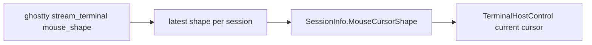
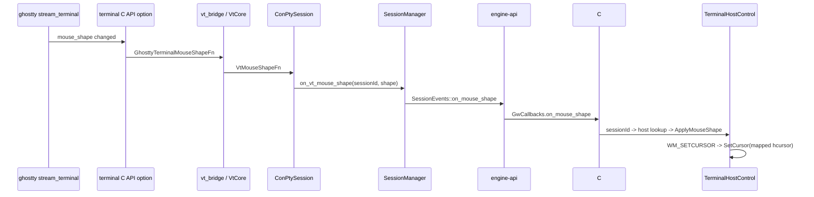

# Plan — FR-02: Mouse Cursor Shape

> **문서 종류**: Plan
> **작성일**: 2026-04-18
> **대상 범위**: M-13 FR-02 (PDCA Act/Iterate 단계, FR-01과 같은 사이클 내 처리)
> **선행 분석**: `docs/03-analysis/m13-input-ux.analysis.md`
> **관련 PRD**: `docs/00-pm/m13-input-ux.prd.md` (FR-02 범위 재해석)
> **마일스톤**: M-13 안에서 마무리 (M-15 분리 안 함 — 결정 사유: 응집성 + 일정 정합)

---

## Executive Summary

| 관점 | 내용 |
|------|------|
| **Problem** | ghostty가 mouse shape를 바꾸어도 GhostWin의 pane child HWND 커서는 항상 Arrow로 고정된다. `Session::mouse_shape`, `SessionInfo.MouseCursorShape` 필드는 있으나 실제 이벤트 소스와 UI sink가 비어 있다. |
| **Solution** | ghostty `stream_terminal`의 `.mouse_shape` 이벤트를 terminal C API callback으로 노출하고, `vt_bridge` → `VtCore` → `ConPtySession` → `SessionManager` → `engine C API` → `C# interop` → `TerminalHostControl` `WM_SETCURSOR` 경로로 전달한다. ghostty enum 34종 전체를 매핑하고, Windows 기본 커서로 표현이 어려운 항목은 Arrow fallback으로 정리한다. |
| **Function / UX Effect** | vim insert 모드에서 I-beam, 링크 hover에서 Hand, split 경계나 resize 상황에서 Size 커서가 즉시 반영된다. pane 전환/워크스페이스 전환 후에도 마지막 shape가 유지된다. |
| **Core Value** | TUI 앱 상호작용 품질을 Windows Terminal/ghostty 계열 수준으로 끌어올린다. GhostWin이 AI 에이전트 멀티플렉서일 뿐 아니라 일상 TUI 터미널로도 자연스럽게 쓰이게 만든다. |

---

## 1. 현재 상태 파악

### 1.1 실제 코드 기준 결론

이번 재조사 결과, 기존 M-13 PRD/Plan의 일부 가정은 현재 코드 구조와 맞지 않는다.

| 항목 | 기존 가정 | 실제 상태 |
|------|-----------|-----------|
| mouse shape 원천 | `GHOSTTY_ACTION_MOUSE_SHAPE` app runtime action handler | GhostWin은 ghostty app runtime을 쓰지 않음 |
| GhostWin 경로 | `action handler -> vt_bridge` | **더 적합한 경로는 `stream_terminal effect callback -> terminal C API option -> vt_bridge`** |
| ghostty terminal API 노출 | 없음 | **로컬 패치 패턴이 이미 존재** (`desktop_notification`) |
| UI sink | `FrameworkElement.Cursor`면 충분 | **GhostWin은 `HwndHost` child HWND 구조라 `WM_SETCURSOR` 처리 쪽이 더 안전** |

핵심은 FR-02가 "불가능"한 것이 아니라, **원래 Plan의 진입점 가정이 틀렸고 다른 경로로 구현해야 한다**는 점이다.

### 1.2 이미 준비된 것

| 계층 | 상태 | 위치 | 검증 |
|------|------|------|:---:|
| ghostty enum 정의 (34종) | 완료 | `external/ghostty/include/ghostty.h:660-696` | ✅ 직접 확인 |
| ghostty `stream_terminal` mouse shape 상태 반영 | 완료 (Terminal.zig:82 `mouse_shape: mouse.Shape = .text`) | `external/ghostty/src/terminal/Terminal.zig:82`, `stream_terminal.zig` | ⚠️ 추측 — Step 1 진행 시 effect 발사 지점 실측 필요 |
| terminal C API 확장 패턴 | 완료 (`desktop_notification` 로컬 패치 존재) | `external/ghostty/src/terminal/c/terminal.zig` (submodule dirty 확인) | ✅ git status로 검증 |
| OSC 22 파서 | 완료 | `external/ghostty/src/terminal/osc/parsers/mouse_shape.zig` | ✅ 직접 확인 |
| vt bridge callback 패턴 | 완료 (`title_changed`, `desktop_notify`) | `src/vt-core/vt_bridge.h`, `src/vt-core/vt_bridge.c` | ✅ |
| Session native state 필드 | 완료 (stub, dead field 상태) | `src/session/session.h` `mouse_shape` | ✅ |
| SessionInfo C# 상태 필드 | 완료 (stub, dead field 상태) | `src/GhostWin.Core/Models/SessionInfo.cs` `MouseCursorShape` | ✅ |

### 1.3 아직 비어 있는 것

| 계층 | 현재 공백 |
|------|-----------|
| ghostty terminal C API | `mouse_shape` callback option 없음 |
| vt bridge | `VtMouseShapeFn`, `vt_bridge_set_mouse_shape_callback()` 없음 |
| VtCore | `set_mouse_shape_callback()` 없음 |
| ConPTY | `SessionConfig::VtMouseShapeFn` 없음 |
| SessionManager | `fire_mouse_shape_event()` 없음 |
| engine C API | `GwMouseShapeFn`, `GwCallbacks.on_mouse_shape` 없음 |
| C# interop | `NativeCallbacks.OnMouseShape`, `GwCallbackContext.OnMouseShape` 없음 |
| UI | `TerminalHostControl`에서 native child HWND 커서 변경 없음 |

---

## 2. 설계 핵심 결정

### D-1. ghostty 진입점은 action handler가 아니라 terminal effect callback으로 간다

이유:
- GhostWin은 `ghostty_terminal_*` 기반이다.
- 이미 Phase 6-A에서 `desktop_notification`을 같은 방식으로 뚫었다.
- 로컬 submodule patch가 있어 작업 패턴이 검증되었다.

### D-2. latest-value 모델로 간다

desktop notification처럼 히스토리를 쌓는 이벤트가 아니라, mouse shape는 "지금 상태"다.

따라서 모델은 다음이 맞다.



- 마지막 값 하나만 유지
- 중복 값이면 UI 업데이트 생략
- pane 재생성/워크스페이스 전환 시 최신 값만 재적용

### D-3. UI sink는 `WM_SETCURSOR`를 우선 사용한다

GhostWin의 실제 터미널 입력 영역은 WPF 컨트롤이 아니라 `TerminalHostControl`이 만든 child HWND다.

따라서:
- 내부 상태 저장: `TerminalHostControl.CurrentMouseShape`
- 실제 OS cursor 반영: child HWND `WndProc`에서 `WM_SETCURSOR` 처리
- 필요 시 shape 변경 시점에 `SetCursor` 즉시 호출 + `InvalidateRect`/`SendMessage(WM_SETCURSOR)`는 보조 수단

> ⚠️ **추측 — Step 6 구현 시 실측 검증 필요**: `FrameworkElement.Cursor`보다 Airspace/HwndHost 구조에 안전할 것으로 **추정**한다. WPF Airspace 이슈는 알려진 패턴이지만 GhostWin의 child HWND 구조에서 직접 실측한 결과는 아직 없다.
> Fallback 전략: Step 6에서 먼저 `WM_SETCURSOR` 시도 → 동작 안 하면 `FrameworkElement.Cursor` 보조 추가.

### D-4. 적용 범위는 "host 단위", source of truth는 "session 단위"

| 레벨 | 책임 |
|------|------|
| `SessionInfo.MouseCursorShape` | 세션의 최신 shape 저장 |
| `PaneContainerControl` | 해당 session을 표시 중인 host 찾기 |
| `TerminalHostControl` | child HWND 커서 반영 |

이렇게 하면 pane 재사용, workspace 전환, host 재생성에도 일관성이 유지된다.

---

## 3. 목표 파이프라인



---

## 4. 구현 범위

### 4.1 In Scope

- ghostty terminal C API에 mouse shape callback option 추가
- `vt_bridge` / `VtCore` / `ConPtySession` / `SessionManager` / `engine-api` / `C# interop` 연결
- `SessionInfo.MouseCursorShape`를 실제 저장소로 사용
- `TerminalHostControl` child HWND 커서 반영
- ghostty enum 34종 전체 매핑 + 미지원 fallback
- pane/workspace 전환 시 최신 shape 재적용

### 4.2 Out of Scope

- ghostty upstream 반영 작업
- custom cursor bitmap 제작
- cursor theme/설정 UI
- OS 전체 cursor override
- TUI가 보내지 않는 상황을 추론하는 폴링 로직

---

## 5. 구현 단계 (PDCA Plan)

### Step 1. ghostty terminal C API에 mouse shape callback 추가

**목표**: `stream_terminal`의 `.mouse_shape` 상태 변화를 GhostWin이 현재 쓰는 terminal C API로 노출

**수정 파일**
- `external/ghostty/include/ghostty/vt/terminal.h`
- `external/ghostty/src/terminal/c/terminal.zig`
- `external/ghostty/src/terminal/stream_terminal.zig`

**작업**
- `GhosttyTerminalMouseShapeFn` typedef 추가
- `GHOSTTY_TERMINAL_OPT_MOUSE_SHAPE` option 추가
- `Effects.mouse_shape` 필드와 trampoline 추가
- `.mouse_shape` 분기에서 callback 발사

**완료 기준**
- desktop notification 패턴처럼 C callback 등록/해제가 가능
- 새 shape가 들어올 때 callback이 1회 호출됨

### Step 2. vt bridge / VtCore 경로 추가

**목표**: ghostty terminal option을 GhostWin C/C++ 경계까지 전달

**수정 파일**
- `src/vt-core/vt_bridge.h`
- `src/vt-core/vt_bridge.c`
- `src/vt-core/vt_core.h`
- `src/vt-core/vt_core.cpp`

**작업**
- `VtMouseShapeFn` typedef 추가
- `vt_bridge_set_mouse_shape_callback()` 추가
- `VtCore::set_mouse_shape_callback()` 추가

**완료 기준**
- `VtCore` 사용자 입장에서 `set_title_callback`, `set_desktop_notify_callback`와 같은 수준의 API가 생김

### Step 3. ConPTY / SessionManager 이벤트 승격

**목표**: I/O thread에서 들어온 mouse shape를 session event로 승격

**수정 파일**
- `src/conpty/conpty_session.h`
- `src/conpty/conpty_session.cpp`
- `src/session/session_manager.h`
- `src/session/session_manager.cpp`
- `src/session/session.h`

**작업**
- `SessionConfig::VtMouseShapeFn` 추가
- `ConPtySession`에서 pending/latest shape 보관 후 lock 밖에서 callback 발사
- `SessionEvents::MouseShapeFn` 추가
- `fire_mouse_shape_event()` 구현
- `Session::mouse_shape`를 실제 latest cache로 사용

**완료 기준**
- session ID와 shape 값이 `SessionManager`까지 도달
- 중복 shape는 건너뛰거나 최소한 상위 레이어에서 dedupe 가능

### Step 4. engine C API + C# interop 연결

**목표**: native event를 WPF UI thread까지 올림

**수정 파일**
- `src/engine-api/ghostwin_engine.h`
- `src/engine-api/ghostwin_engine.cpp`
- `src/GhostWin.Interop/NativeEngine.cs`
- `src/GhostWin.Interop/NativeCallbacks.cs`
- `src/GhostWin.Interop/EngineService.cs`
- `src/GhostWin.Core/Interfaces/IEngineService.cs`

**작업**
- `GwMouseShapeFn` typedef 추가
- `GwCallbacks.on_mouse_shape` 추가
- `GwCallbackContext.OnMouseShape` 추가
- `NativeCallbacks.OnMouseShape` 구현
- dispatcher marshaling 추가

**완료 기준**
- `MainWindow` 또는 동등 UI 조립 지점에서 `(sessionId, shape)` 콜백을 받을 수 있음

### Step 5. SessionInfo / 서비스 계층 연결

**목표**: UI가 최신 shape를 세션 상태로 조회 가능하게 함

**수정 파일**
- `src/GhostWin.Services/SessionManager.cs`
- 필요 시 `src/GhostWin.Core/Interfaces/ISessionManager.cs`
- `src/GhostWin.Core/Models/SessionInfo.cs`

**작업**
- `UpdateMouseCursorShape(sessionId, shape)` 추가
- 세션 전환 시 최신 값 유지

**완료 기준**
- `SessionInfo.MouseCursorShape`가 dead field가 아니게 됨
- host 재구성 시 재적용 가능한 상태 저장소가 됨

### Step 6. TerminalHostControl 실제 커서 반영

**목표**: child HWND에서 OS cursor가 실제로 바뀌게 함

**수정 파일**
- `src/GhostWin.App/Controls/TerminalHostControl.cs`
- `src/GhostWin.App/Controls/PaneContainerControl.cs`
- `src/GhostWin.App/MainWindow.xaml.cs`

**작업**
- `MouseCursorShapeMapper` 또는 동등 helper 추가
- `TerminalHostControl`에 latest shape / mapped `HCURSOR` 캐시 추가
- `WndProc`에 `WM_SETCURSOR` 처리 추가
- sessionId 기준 host lookup 후 `ApplyMouseShape()` 호출

**완료 기준**
- vim insert/normal, 링크 hover, resize 경계에서 커서가 즉시 바뀜
- pane 전환 후에도 host가 최신 값을 반영

### Step 7. 테스트와 수동 검증

**목표**: 매핑/이벤트/복원 시나리오를 고정

**수정/추가 파일**
- `tests/GhostWin.App.Tests/Input/MouseCursorShapeMapperTests.cs`
- 필요 시 `tests/GhostWin.App.Tests/...` host 적용 테스트
- 필요 시 `tests/...` native callback smoke test

**작업**
- 34종 enum 매핑 테스트
- fallback 테스트
- 중복 업데이트 무시 테스트
- pane/workspace 전환 시 재적용 수동 시나리오

**완료 기준**
- 자동 테스트 + 수동 시나리오 체크리스트 통과

---

## 6. 파일 변경 예상

### 6.1 ghostty submodule

| 파일 | 책임 |
|------|------|
| `external/ghostty/include/ghostty/vt/terminal.h` | public terminal callback typedef / option ID 추가 |
| `external/ghostty/src/terminal/c/terminal.zig` | C API callback 저장 + trampoline |
| `external/ghostty/src/terminal/stream_terminal.zig` | mouse shape effect 발사 |

### 6.2 GhostWin native

| 파일 | 책임 |
|------|------|
| `src/vt-core/vt_bridge.h` | C bridge 선언 |
| `src/vt-core/vt_bridge.c` | ghostty terminal option 연결 |
| `src/vt-core/vt_core.h` | C++ wrapper 선언 |
| `src/vt-core/vt_core.cpp` | callback 등록 |
| `src/conpty/conpty_session.h/.cpp` | I/O thread event 승격 |
| `src/session/session_manager.h/.cpp` | session event fan-out |
| `src/session/session.h` | latest mouse shape state |
| `src/engine-api/ghostwin_engine.h/.cpp` | C API callback 노출 |

### 6.3 GhostWin C# / WPF

| 파일 | 책임 |
|------|------|
| `src/GhostWin.Interop/NativeEngine.cs` | P/Invoke struct slot |
| `src/GhostWin.Interop/NativeCallbacks.cs` | unmanaged callback -> dispatcher |
| `src/GhostWin.Interop/EngineService.cs` | callback wiring |
| `src/GhostWin.Core/Interfaces/IEngineService.cs` | callback context 계약 |
| `src/GhostWin.Core/Models/SessionInfo.cs` | latest shape 저장 |
| `src/GhostWin.Services/SessionManager.cs` | session state 업데이트 |
| `src/GhostWin.App/MainWindow.xaml.cs` | callback 수신 + host 적용 |
| `src/GhostWin.App/Controls/PaneContainerControl.cs` | sessionId -> host lookup |
| `src/GhostWin.App/Controls/TerminalHostControl.cs` | child HWND cursor 적용 |

---

## 7. 매핑 정책

### 7.1 1차 매핑 (필수)

| ghostty shape | Win32/WPF 적용 |
|---------------|----------------|
| `DEFAULT`, `CELL` | Arrow |
| `TEXT`, `VERTICAL_TEXT` | IBeam |
| `POINTER`, `ALIAS`, `COPY` | Hand |
| `HELP` | Help |
| `WAIT` | Wait |
| `PROGRESS` | AppStarting |
| `CROSSHAIR` | Cross |
| `NOT_ALLOWED`, `NO_DROP` | No |
| `MOVE`, `GRAB`, `GRABBING` | Hand |
| `COL_RESIZE`, `EW_RESIZE` | SizeWE |
| `ROW_RESIZE`, `NS_RESIZE` | SizeNS |
| `N_RESIZE`, `S_RESIZE` | SizeNS |
| `E_RESIZE`, `W_RESIZE` | SizeWE |
| `NE_RESIZE`, `SW_RESIZE`, `NESW_RESIZE` | SizeNESW |
| `NW_RESIZE`, `SE_RESIZE`, `NWSE_RESIZE` | SizeNWSE |

### 7.2 2차 매핑 (fallback)

| ghostty shape | 처리 |
|---------------|------|
| `CONTEXT_MENU`, `ALL_SCROLL`, `ZOOM_IN`, `ZOOM_OUT` | Arrow 또는 가장 가까운 기본 시스템 커서 |

원칙:
- Windows 기본 커서로 안정적으로 표현 가능한 것만 직접 매핑
- 애매하면 Arrow fallback
- custom cursor는 이번 범위에서 하지 않음

---

## 8. 리스크와 대응

| 리스크 | 심각도 | 설명 | 대응 |
|--------|:------:|------|------|
| submodule patch 충돌 | 중 | `external/ghostty`가 이미 dirty 상태 | desktop notification 패치와 같은 파일만 최소 수정 |
| `WM_SETCURSOR` 누락 | 중 | shape 값은 바뀌지만 실제 포인터가 안 바뀔 수 있음 | `TerminalHostControl`에서 child HWND 기준 처리 |
| 이벤트 과다 | 낮 | mouse move 중 같은 shape 반복 emit 가능 | latest-value 비교 후 동일 값 skip |
| pane 재사용 시 복원 누락 | 중 | host는 재사용되지만 최신 shape 재적용이 빠질 수 있음 | `SessionInfo.MouseCursorShape`를 source of truth로 사용 |
| WPF `Cursor`만 사용 | 중 | HwndHost child 영역에 안 먹을 수 있음 | 이번 계획에서는 채택하지 않음 |

---

## 9. 검증 계획 (Check)

### 9.1 자동 테스트

- ghostty enum -> mapped cursor ID 테스트
- 미지원 enum -> Arrow fallback 테스트
- 같은 shape 연속 적용 시 host 갱신 최소화 테스트
- `SessionManager.UpdateMouseCursorShape()` 상태 저장 테스트

### 9.2 수동 테스트

| 시나리오 | 기대 결과 |
|----------|-----------|
| vim insert 진입 | I-beam |
| vim normal 복귀 | Arrow |
| 링크 hover TUI | Hand 또는 설계한 fallback |
| OSC 22 또는 동등 mouse-shape 시퀀스 주입 (`text`) | I-beam |
| OSC 22 또는 동등 mouse-shape 시퀀스 주입 (`pointer`) | Hand |
| OSC 22 또는 동등 mouse-shape 시퀀스 주입 (`ew-resize`, `ns-resize`) | SizeWE / SizeNS |
| workspace 전환 후 복귀 | 마지막 shape 유지 |
| 세션 close 후 다른 pane 활성화 | 다른 세션 shape 정상 유지 |

### 9.3 로그/진단 (KeyDiag/ImeDiag 패턴 보존)

진단 코드는 **삭제하지 않고 env var gate 뒤로 보존**한다 (FR-01 ImeDiag 패턴, M-13 옵션 A 결정 일관성).

| 컴포넌트 | 신설 위치 | 활성화 |
|---|---|---|
| `MouseShapeDiag` 클래스 | `src/GhostWin.App/Diagnostics/MouseShapeDiag.cs` (KeyDiag 패턴 복제) | env var `GHOSTWIN_MOUSESHAPEDIAG=1` |
| native LOG | `LOG_I("mouse-shape", "sid=%u shape=%d")` (`session_manager.cpp` 등) | 항상 출력 (다른 LOG와 동일 정책) |
| C# 진단 LOG | `MouseShapeDiag.Log("OnMouseShape", "sid=... shape=...")` | env OFF 시 zero-cost early-out |
| UI 적용 LOG | `MouseShapeDiag.Log("ApplyMouseShape", "session=... host=... mapped=...")` | 동일 |

활성화 방법:
- 평소 F5: env var 미포함 → 진단 OFF
- 진단 시: `scripts/run_with_log.ps1` 또는 `launchSettings.json`에 일시적으로 `GHOSTWIN_MOUSESHAPEDIAG=1` 추가

### 9.4 PRD 수용 기준 (AC) 매핑

`/pdca analyze m13-input-ux` 재실행 시 gap-detector가 추적할 수 있도록 PRD AC와 본 Plan 검증 항목을 명시 매핑한다.

| AC | PRD 수용 기준 (요약) | 본 Plan 검증 위치 | 통과 기준 |
|:---:|---|---|---|
| AC-07 | vim insert 모드 → I-beam 커서 | §9.2 "vim insert 진입" + §9.1 enum→Cursor 단위 테스트 (`TEXT`→IBeam) | 수동 검증 OK + 단위 테스트 PASS |
| AC-08 | vim normal 모드 → Arrow 복귀 | §9.2 "vim normal 복귀" + §9.1 (`DEFAULT`→Arrow) | 수동 검증 OK + 단위 테스트 PASS |
| AC-09 | pane 간 독립적 유지 | §9.2 "세션 close 후 다른 pane" + "workspace 전환 후 복귀" | 수동 검증 OK (잔상 없음) |
| AC-10 | ghostty enum 전체 매핑 (미지원 → Arrow fallback) | §7.1 1차 매핑 + §7.2 2차 매핑 + §9.1 fallback 테스트 | 34종 모두 매핑 함수에 case 존재 + fallback 4종 (`CONTEXT_MENU`, `ALL_SCROLL`, `ZOOM_IN`, `ZOOM_OUT`) → Arrow 검증 |

---

## 10. 예상 일정

| 단계 | 예상 |
|------|------|
| ghostty patch + vt bridge | 0.5일 |
| ConPTY / SessionManager / engine-api | 0.5일 |
| C# interop + UI sink | 0.5일 |
| 테스트 + 수동 검증 | 0.5일 |
| **합계** | **1.5 ~ 2일** |

---

## 11. Act 기준

구현 후 결과에 따라 다음 중 하나로 정리한다.

1. **성공**
   M-13 FR-02 완료로 마감 → `/pdca analyze m13-input-ux` 재실행하여 Match Rate ≥ 90% 확인 → `/pdca report m13-input-ux`
2. **부분 성공**
   기본/IBeam/Resize만 우선 출하, 나머지 커서는 fallback 유지. M-13 종료 시점에 미커버 enum을 follow-up backlog로 기록
3. **구조 문제 발견**
   ghostty submodule patch를 별도 ADR 또는 upstream-sync follow-up으로 분리. 그래도 M-13 자체는 FR-01만으로 종료 가능 (gap-detector 옵션 A 경로)

---

## 12. 최종 권고

FR-02는 지금 구현 가능한 범위다. 다만 **기존 PRD의 "action handler 경로"는 폐기하고**, **desktop notification과 같은 terminal option callback 패턴으로 재설계**해야 한다.

이 문서를 기준으로 진행하면:
- 기존 로컬 ghostty 패치 경험을 재사용하고
- GhostWin의 실제 `HwndHost` 구조에 맞는 UI sink를 선택하며
- dead field였던 `SessionInfo.MouseCursorShape` / `Session::mouse_shape`를 실제 자산으로 살릴 수 있다.

다음 액션은 `/pdca do fr-02-mouse-cursor-shape` 수준으로 바로 구현에 들어가는 것이다.

---

## 13. 부록 — ghostty 로컬 패치 정책 (Plan-local ADR)

### 배경
사후 조사 (`docs/03-analysis/m13-input-ux.analysis.md` §10) 결과, ghostty submodule에 이미 **로컬 패치 3건**이 적용되어 있음을 확인:

```
M include/ghostty/vt/terminal.h
M src/terminal/c/terminal.zig
M src/terminal/stream_terminal.zig
```

이는 Phase 6-A `desktop_notification` callback 도입 시 추가된 것으로 추정 (`docs/00-research/ghostty-upstream-sync-analysis.md` 참조).

`CLAUDE.md` `ghostty 서브모듈` 절의 *"로컬 패치: 없음"* 표기는 **실제 코드와 불일치**.

### 본 Plan의 결정

| 항목 | 정책 |
|---|---|
| FR-02 mouse_shape 패치 | desktop_notification과 **동일한 3개 파일에 최소 추가**. 이 외 submodule 파일/구조 변경 금지 |
| ADR 형태 | 본 부록(Plan-local) 우선. M-13 종료 후 ADR-014 등으로 승격 검토 |
| upstream PR | M-13 범위 외 (§4.2 Out of Scope). FR-02 안정화 후 별도 작업 |
| 문서 정정 | Step 1 완료 시점에 **`AGENTS.md`와 `CLAUDE.md` 둘 다 갱신**. 내용은 "로컬 패치: 2건 (desktop_notification + mouse_shape)"로 정정 |

### 정당화 근거

1. **선례 존재**: desktop_notification (Phase 6-A) — upstream 미반영 상태로 production 사용 중
2. **upstream 대기 비용**: ghostty 메인테이너 리뷰 수일~수주 소요. M-13 일정 (2~3.5일) 초과
3. **변경 범위 작음**: callback option 1개 추가 — 기존 패치 패턴 그대로 복제
4. **Rollback 안전**: ghostty submodule 재pull 시 자동 제거 가능 (별도 stash로 보존)

### 향후 마이그레이션
upstream PR 머지 시:
1. 본 부록 §13 삭제 또는 "(완료)" 표시
2. `AGENTS.md` `ghostty 서브모듈` 절 정정
3. `CLAUDE.md` `ghostty 서브모듈` 절 정정
4. ADR-014 (있다면) 폐기 또는 history-only 표시
5. 코드 변경 없음 (interface가 동일하면)

---

*FR-02 Mouse Cursor Shape Plan v1.1 — 2026-04-18 (보강: enum 34종 정정 + 방향별 resize 매핑 추가 + FR-02 전용 수동 검증 시나리오 교체 + AGENTS.md 우선 정정)*
