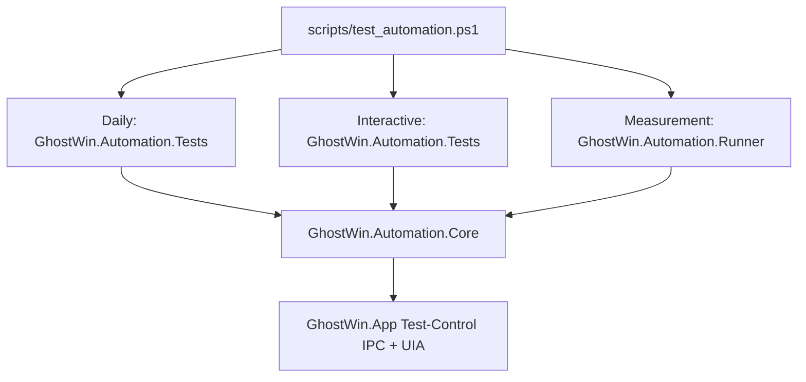

# GhostWin Test Automation Consolidation Implementation Plan

> **For agentic workers:** REQUIRED SUB-SKILL: Use superpowers:subagent-driven-development (recommended) or superpowers:executing-plans to implement this plan task-by-task. Steps use checkbox (`- [ ]`) syntax for tracking.

**Goal:** GhostWin의 테스트 자동화 코드를 하나의 유지보수 체계로 정리한다.

**Architecture:** 물리적으로 모든 테스트를 한 프로젝트에 몰아넣지 않는다. 대신 `scripts/test_automation.ps1`을 단일 실행 입구로 두고, 앱 자동화 코드는 `tests/GhostWin.Automation.*` 아래로 모은다. 오래된 Python runner, 개별 PS1, PoC FlaUI 프로젝트는 커버리지 흡수 확인 후 제거한다.

**Tech Stack:** PowerShell 5.1, xUnit, FlaUI 5.0, .NET 10, MSBuild, Win32/typeperf, GhostWin Test-Control IPC

---

## 맨 위 요약

현재 테스트 자동화는 새 xUnit 체계와 예전 실험 코드가 같이 남아 있다. 최종 상태는 **단일 실행 입구 + 단일 자동화 코드 소유권 + 명확한 Daily/Interactive/Measurement 분리**다.



## 정리 원칙

| 원칙 | 설명 |
|---|---|
| 하나의 입구 | 개발자는 `scripts/test_automation.ps1`만 기억한다. |
| 하나의 자동화 소유권 | 앱 실행, 종료, artifact, wait, IPC는 `GhostWin.Automation.Core`가 맡는다. |
| 계층은 유지 | Unit, Daily, Interactive, Measurement는 실행 조건이 달라서 suite로 나눈다. |
| 삭제 전 흡수 | legacy 파일은 같은 커버리지가 새 suite에 있음을 확인한 뒤 제거한다. |
| artifact 통일 | 모든 결과는 `artifacts/test-automation/<timestamp>/...` 아래에 둔다. |

## 현재 분류

| 분류 | 현재 경로 | 최종 처리 |
|---|---|---|
| 유지 | `tests/GhostWin.Automation.Core/` | 앱 lifecycle, artifact, wait, IPC 공통 기반으로 유지 |
| 유지 | `tests/GhostWin.Automation.Core.Tests/` | runner/script 계약과 core 단위 테스트 유지 |
| 유지 | `tests/GhostWin.Automation.Tests/` | Daily + Interactive 앱 자동화의 주 테스트 프로젝트로 승격 |
| 흡수 후 제거 | `tests/GhostWin.E2E.Tests/` | 필요한 테스트를 `GhostWin.Automation.Tests`로 옮긴 뒤 프로젝트 제거 |
| 흡수 후 제거 | `tests/GhostWin.MeasurementDriver/` | `GhostWin.Automation.Runner` 또는 Core 기반 runner로 이동 |
| 제거 | `tests/e2e-flaui-*` | PoC FlaUI 프로젝트. 커버리지 매핑 후 삭제 |
| 제거 | `scripts/e2e/e2e_operator/` | Python runner. 필요한 capture/readiness 아이디어만 C# runner로 흡수 |
| 제거 | `scripts/e2e/venv/` | 저장소에 남아 있으면 안 되는 로컬 가상환경 |
| 제거 또는 archive | `scripts/test_*.ps1`, `scripts/diag_*.ps1`, `scripts/repro_first_pane.ps1` | `test_automation.ps1` suite로 흡수한 뒤 삭제 또는 `docs/archive`로 이동 |
| 유지 | `tests/GhostWin.App.Tests/`, `tests/GhostWin.Core.Tests/` | 자동화가 아닌 제품 단위 테스트. 단일 runner에서 호출만 담당 |
| 유지 | `tests/GhostWin.Engine.Tests/`, `tests/*.cpp` | native 엔진 테스트. 자동화 통합 대상이 아니라 build/test entry에 연결 |

## 목표 구조

```text
scripts/
  test_automation.ps1              # 테스트 실행 단일 입구

tests/
  GhostWin.Automation.Core/        # 앱 실행/종료/IPC/UIA/artifact 공통 기반
  GhostWin.Automation.Core.Tests/  # core + runner contract 테스트
  GhostWin.Automation.Tests/       # Daily + Interactive 앱 자동화
  GhostWin.Automation.Runner/      # Measurement/Diagnostic 콘솔 runner
  GhostWin.App.Tests/              # 앱 단위/계약 테스트
  GhostWin.Core.Tests/             # core 단위 테스트
  GhostWin.Engine.Tests/           # native engine 테스트
```

## Task 1: legacy 자동화 인벤토리와 제거 기준 고정

**Files:**
- Create: `docs/03-analysis/testing/legacy-automation-inventory.md`
- Modify: `tests/GhostWin.Automation.Core.Tests/AutomationRunnerScriptTests.cs`

- [ ] **Step 1: 인벤토리 문서 작성**

Create `docs/03-analysis/testing/legacy-automation-inventory.md`:

```markdown
# Legacy Automation Inventory

작성일: 2026-05-09

## 제거 기준

legacy 파일은 아래 3조건을 모두 만족할 때 제거한다.

1. 같은 사용자 시나리오가 `GhostWin.Automation.Tests` 또는 `GhostWin.Automation.Runner`에 있다.
2. `scripts/test_automation.ps1`에서 실행 가능하다.
3. 실패 artifact가 `artifacts/test-automation/<timestamp>/...`에 남는다.

## 분류

| legacy 경로 | 새 위치 | 처리 |
|---|---|---|
| `tests/GhostWin.E2E.Tests/Tier1_FileState/FileStateScenarios.cs` | `tests/GhostWin.Automation.Tests/StateTests.cs` | move |
| `tests/GhostWin.E2E.Tests/Tier2_UiaRead/UiaStructureScenarios.cs` | `tests/GhostWin.Automation.Tests/StructureTests.cs` | compare then remove |
| `tests/GhostWin.E2E.Tests/Tier3_UiaProperty/NotificationRingScenarios.cs` | `tests/GhostWin.Automation.Tests/NotificationTests.cs` | compare then remove |
| `tests/GhostWin.E2E.Tests/Tier3_UiaProperty/MouseCursorShapeScenarios.cs` | `tests/GhostWin.Automation.Tests/CursorOracleTests.cs` | compare then remove |
| `tests/GhostWin.E2E.Tests/Tier4_Keyboard/Win32CursorSmokeScenarios.cs` | `tests/GhostWin.Automation.Tests/Interactive/Win32CursorSmokeTests.cs` | move |
| `tests/GhostWin.MeasurementDriver/` | `tests/GhostWin.Automation.Runner/Measurement/` | move |
| `tests/e2e-flaui-cross-validation/` | none | delete after coverage check |
| `tests/e2e-flaui-split-content/` | `tests/GhostWin.Automation.Tests/CommandTests.cs` | compare then delete |
| `scripts/e2e/e2e_operator/` | `tests/GhostWin.Automation.Runner/Diagnostics/` | absorb selected readiness/capture logic |
| `scripts/repro_first_pane.ps1` | `scripts/test_automation.ps1 -Suite Diagnostic -DiagnosticScenario first-pane` | replace |
| `scripts/test_m11_cwd_peb.ps1` | `tests/GhostWin.Automation.Tests/StateTests.cs` | delete after state test passes |
| `scripts/test_m11_e2e_restore.ps1` | `tests/GhostWin.Automation.Tests/StateTests.cs` | delete after state test passes |
| `scripts/test_settings_e2e.ps1` | `tests/GhostWin.Automation.Tests/SettingsTests.cs` | delete after settings test passes |
| `scripts/test_settings_all_e2e.ps1` | `tests/GhostWin.Automation.Tests/SettingsTests.cs` | delete after settings test passes |
| `scripts/test_korean_*.ps1` | `tests/GhostWin.Automation.Tests/Interactive/KoreanImeInteractiveTests.cs` | move only active scenario |
| `scripts/test_kr*.ps1` | `tests/GhostWin.Automation.Tests/Interactive/KoreanImeInteractiveTests.cs` | move only active scenario |
| `scripts/diag_e2e_*.ps1` | `tests/GhostWin.Automation.Runner/Diagnostics/` | replace |
```

- [ ] **Step 2: runner contract test에 인벤토리 문서 존재 검증 추가**

Add this test to `tests/GhostWin.Automation.Core.Tests/AutomationRunnerScriptTests.cs`:

```csharp
[Fact]
public void LegacyAutomationInventory_documents_all_cleanup_targets()
{
    var repoRoot = FindRepoRoot();
    var inventoryPath = Path.Combine(repoRoot, "docs", "03-analysis", "testing", "legacy-automation-inventory.md");

    File.Exists(inventoryPath).Should().BeTrue();
    var inventory = File.ReadAllText(inventoryPath);

    inventory.Should().Contain("tests/GhostWin.E2E.Tests/");
    inventory.Should().Contain("tests/GhostWin.MeasurementDriver/");
    inventory.Should().Contain("tests/e2e-flaui-cross-validation/");
    inventory.Should().Contain("scripts/e2e/e2e_operator/");
    inventory.Should().Contain("scripts/test_m11_cwd_peb.ps1");
    inventory.Should().Contain("scripts/test_korean_");
}
```

- [ ] **Step 3: 테스트 실행**

Run:

```powershell
dotnet test tests\GhostWin.Automation.Core.Tests\GhostWin.Automation.Core.Tests.csproj -c Debug --no-restore --filter FullyQualifiedName~LegacyAutomationInventory
```

Expected: PASS.

- [ ] **Step 4: 커밋**

```powershell
git add docs/03-analysis/testing/legacy-automation-inventory.md tests/GhostWin.Automation.Core.Tests/AutomationRunnerScriptTests.cs
git commit -m "test: document legacy automation cleanup"
```

## Task 2: MeasurementDriver를 Automation Runner로 이동

**Files:**
- Create: `tests/GhostWin.Automation.Runner/GhostWin.Automation.Runner.csproj`
- Move: `tests/GhostWin.MeasurementDriver/**` -> `tests/GhostWin.Automation.Runner/Measurement/**`
- Modify: `scripts/measure_render_baseline.ps1`
- Modify: `scripts/test_automation.ps1`
- Modify: `GhostWin.sln`

- [ ] **Step 1: runner 프로젝트 생성**

Create `tests/GhostWin.Automation.Runner/GhostWin.Automation.Runner.csproj`:

```xml
<Project Sdk="Microsoft.NET.Sdk">
  <PropertyGroup>
    <OutputType>Exe</OutputType>
    <TargetFramework>net10.0-windows</TargetFramework>
    <UseWindowsForms>true</UseWindowsForms>
    <Platforms>x64</Platforms>
    <PlatformTarget>x64</PlatformTarget>
    <Nullable>enable</Nullable>
    <ImplicitUsings>enable</ImplicitUsings>
    <LangVersion>latest</LangVersion>
    <AllowUnsafeBlocks>true</AllowUnsafeBlocks>
  </PropertyGroup>

  <ItemGroup>
    <ProjectReference Include="..\GhostWin.Automation.Core\GhostWin.Automation.Core.csproj" />
    <PackageReference Include="FlaUI.Core" Version="5.0.0" />
    <PackageReference Include="FlaUI.UIA3" Version="5.0.0" />
  </ItemGroup>
</Project>
```

- [ ] **Step 2: MeasurementDriver 소스 이동**

Move these files without changing behavior:

```text
tests/GhostWin.MeasurementDriver/Contracts/*.cs
tests/GhostWin.MeasurementDriver/Infrastructure/*.cs
tests/GhostWin.MeasurementDriver/Scenario/*.cs
tests/GhostWin.MeasurementDriver/Verification/*.cs
tests/GhostWin.MeasurementDriver/Program.cs
```

Destination:

```text
tests/GhostWin.Automation.Runner/Measurement/
```

Namespace rename:

```text
GhostWin.MeasurementDriver -> GhostWin.Automation.Runner.Measurement
```

- [ ] **Step 3: baseline script의 runner 탐색 경로 변경**

In `scripts/measure_render_baseline.ps1`, replace `Resolve-MeasurementDriverExe` with `Resolve-AutomationRunnerExe`:

```powershell
function Resolve-AutomationRunnerExe {
    param([string]$RepoRoot, [string]$Configuration)

    $runnerRoot = Join-Path $RepoRoot 'tests\GhostWin.Automation.Runner\bin'
    $candidates = @(
        (Join-Path $runnerRoot "x64\$Configuration\net10.0-windows\GhostWin.Automation.Runner.exe"),
        (Join-Path $runnerRoot "$Configuration\net10.0-windows\GhostWin.Automation.Runner.exe")
    )
    foreach ($p in $candidates) {
        if (Test-Path -LiteralPath $p) { return $p }
    }
    throw "GhostWin.Automation.Runner.exe not found. Looked in:`n  $($candidates -join "`n  ")"
}
```

- [ ] **Step 4: runner 인자에 measurement command 추가**

`tests/GhostWin.Automation.Runner/Program.cs` must accept:

```text
measurement --scenario idle --pid 123 --output-json result.json
measurement --scenario resize-4pane --pid 123 --output-json result.json
measurement --scenario load --pid 123 --output-json result.json
```

- [ ] **Step 5: 검증**

Run:

```powershell
dotnet build tests\GhostWin.Automation.Runner\GhostWin.Automation.Runner.csproj -c Debug --no-restore
dotnet test tests\GhostWin.E2E.Tests\GhostWin.E2E.Tests.csproj -c Debug --no-restore --filter FullyQualifiedName~MeasurementDriver
```

Expected: build PASS, contract tests PASS after namespace update.

- [ ] **Step 6: 커밋**

```powershell
git add tests/GhostWin.Automation.Runner scripts/measure_render_baseline.ps1 scripts/test_automation.ps1 GhostWin.sln tests/GhostWin.E2E.Tests
git rm -r tests/GhostWin.MeasurementDriver
git commit -m "test: move measurement driver into automation runner"
```

## Task 3: E2E.Tests를 Automation.Tests로 흡수

**Files:**
- Move: `tests/GhostWin.E2E.Tests/Tier1_FileState/FileStateScenarios.cs`
- Move: `tests/GhostWin.E2E.Tests/Tier2_UiaRead/UiaStructureScenarios.cs`
- Move: `tests/GhostWin.E2E.Tests/Tier3_UiaProperty/*.cs`
- Move: `tests/GhostWin.E2E.Tests/Tier4_Keyboard/*.cs`
- Modify: `tests/GhostWin.Automation.Tests/GhostWin.Automation.Tests.csproj`
- Modify: `scripts/test_automation.ps1`
- Modify: `GhostWin.sln`

- [ ] **Step 1: interactive attribute 이동**

Move:

```text
tests/GhostWin.E2E.Tests/Infrastructure/InteractiveFactAttribute.cs
tests/GhostWin.E2E.Tests/Infrastructure/InteractiveTestGate.cs
```

To:

```text
tests/GhostWin.Automation.Tests/Infrastructure/
```

Namespace:

```text
GhostWin.E2E.Tests.Infrastructure -> GhostWin.Automation.Tests.Infrastructure
```

- [ ] **Step 2: Tier 테스트 이동**

Move Tier files into:

```text
tests/GhostWin.Automation.Tests/LegacyCoverage/
tests/GhostWin.Automation.Tests/Interactive/
```

Rules:

| old category | new category |
|---|---|
| file/UIA read/property tests | `Category=DailyE2E` |
| keyboard/mouse/Win32 tests | `Category=Interactive` |

- [ ] **Step 3: runner에서 Interactive project 변경**

In `scripts/test_automation.ps1`, change:

```powershell
$interactiveProject = Join-Path $repoRoot 'tests\GhostWin.E2E.Tests\GhostWin.E2E.Tests.csproj'
```

to:

```powershell
$interactiveProject = Join-Path $repoRoot 'tests\GhostWin.Automation.Tests\GhostWin.Automation.Tests.csproj'
```

- [ ] **Step 4: 검증**

Run:

```powershell
dotnet test tests\GhostWin.Automation.Tests\GhostWin.Automation.Tests.csproj -c Debug --no-restore --filter Category=DailyE2E
dotnet test tests\GhostWin.Automation.Tests\GhostWin.Automation.Tests.csproj -c Debug --no-restore --filter Category=Interactive
```

Expected: Daily PASS in normal automation environment. Interactive tests SKIP unless `GHOSTWIN_INTERACTIVE_AUTOMATION=1`.

- [ ] **Step 5: E2E 프로젝트 제거**

Remove from `GhostWin.sln`:

```text
tests\GhostWin.E2E.Tests\GhostWin.E2E.Tests.csproj
```

Then:

```powershell
git rm -r tests\GhostWin.E2E.Tests
git add tests/GhostWin.Automation.Tests scripts/test_automation.ps1 GhostWin.sln
git commit -m "test: merge e2e suite into automation tests"
```

## Task 4: old FlaUI PoC 프로젝트 제거

**Files:**
- Remove: `tests/e2e-flaui-cross-validation/`
- Remove: `tests/e2e-flaui-split-content/`
- Modify: `docs/03-analysis/testing/legacy-automation-inventory.md`

- [ ] **Step 1: 커버리지 대응 확인**

Confirm:

```powershell
dotnet test tests\GhostWin.Automation.Tests\GhostWin.Automation.Tests.csproj -c Debug --no-restore --filter "FullyQualifiedName~CommandTests|FullyQualifiedName~StructureTests"
```

Expected: split, pane, initial structure scenarios PASS.

- [ ] **Step 2: PoC 제거**

```powershell
git rm -r tests/e2e-flaui-cross-validation tests/e2e-flaui-split-content
```

- [ ] **Step 3: 인벤토리 상태 갱신**

Update rows:

```markdown
| `tests/e2e-flaui-cross-validation/` | none | removed |
| `tests/e2e-flaui-split-content/` | `tests/GhostWin.Automation.Tests/CommandTests.cs` | removed |
```

- [ ] **Step 4: 커밋**

```powershell
git add docs/03-analysis/testing/legacy-automation-inventory.md
git commit -m "test: remove legacy flaui poc projects"
```

## Task 5: Python e2e runner 제거

**Files:**
- Remove: `scripts/e2e/e2e_operator/`
- Remove: `scripts/e2e/runner.py`
- Remove: `scripts/e2e/requirements.txt`
- Remove: `scripts/e2e/venv/`
- Keep or archive: `scripts/e2e/evaluator_summary.schema.json`
- Modify: `scripts/test_automation.ps1`
- Modify: `docs/03-analysis/testing/legacy-automation-inventory.md`

- [ ] **Step 1: Diagnostic suite 추가**

In `scripts/test_automation.ps1`, extend suite:

```powershell
[ValidateSet('Daily', 'Interactive', 'Measurement', 'Diagnostic', 'All')]
[string]$Suite = 'Daily'
```

Add:

```powershell
if ($Suite -in @('Diagnostic', 'All')) {
    & dotnet run --project (Join-Path $repoRoot 'tests\GhostWin.Automation.Runner\GhostWin.Automation.Runner.csproj') `
        -c $Configuration -- diagnostic --results-root $runRoot
    if ($LASTEXITCODE -ne 0) {
        throw "Diagnostic suite failed with exit code $LASTEXITCODE"
    }
}
```

- [ ] **Step 2: Python runner 파일 제거**

```powershell
git rm -r scripts/e2e/e2e_operator
git rm scripts/e2e/runner.py scripts/e2e/requirements.txt
git rm -r scripts/e2e/venv
```

- [ ] **Step 3: 검증**

Run:

```powershell
dotnet test tests\GhostWin.Automation.Core.Tests\GhostWin.Automation.Core.Tests.csproj -c Debug --no-restore --filter FullyQualifiedName~AutomationRunnerScriptTests
```

Expected: PASS after contract test update.

- [ ] **Step 4: 커밋**

```powershell
git add scripts/test_automation.ps1 docs/03-analysis/testing/legacy-automation-inventory.md
git commit -m "test: replace python e2e runner"
```

## Task 6: 개별 PS1 테스트 스크립트 제거

**Files:**
- Remove: `scripts/test_m11_cwd_peb.ps1`
- Remove: `scripts/test_m11_e2e_restore.ps1`
- Remove: `scripts/test_settings_e2e.ps1`
- Remove: `scripts/test_settings_all_e2e.ps1`
- Remove or archive: `scripts/test_korean_*.ps1`, `scripts/test_kr*.ps1`
- Remove or archive: `scripts/diag_e2e_*.ps1`, `scripts/repro_first_pane.ps1`
- Modify: `docs/03-analysis/testing/legacy-automation-inventory.md`

- [ ] **Step 1: 대응 suite 실행**

Run:

```powershell
powershell -NoProfile -ExecutionPolicy Bypass -File scripts\test_automation.ps1 -Suite Daily -Configuration Debug -NoBuild
powershell -NoProfile -ExecutionPolicy Bypass -File scripts\test_automation.ps1 -Suite Interactive -Configuration Debug -NoBuild
```

Expected: Daily PASS. Interactive only runs when interactive gate is enabled; otherwise skipped or blocked by gate.

- [ ] **Step 2: script 제거**

```powershell
git rm scripts/test_m11_cwd_peb.ps1 scripts/test_m11_e2e_restore.ps1
git rm scripts/test_settings_e2e.ps1 scripts/test_settings_all_e2e.ps1
git rm scripts/test_korean_*.ps1 scripts/test_kr*.ps1
git rm scripts/diag_e2e_*.ps1 scripts/repro_first_pane.ps1
```

- [ ] **Step 3: 남은 test script 검색**

Run:

```powershell
rg --files scripts | rg "test_|diag_|repro_|e2e"
```

Expected allowed list:

```text
scripts/test_automation.ps1
scripts/measure_render_baseline.ps1
scripts/e2e/evaluator_summary.schema.json
```

- [ ] **Step 4: 커밋**

```powershell
git add docs/03-analysis/testing/legacy-automation-inventory.md
git commit -m "test: remove legacy automation scripts"
```

## Task 7: 단일 체계 회귀 방지 테스트 추가

**Files:**
- Modify: `tests/GhostWin.Automation.Core.Tests/AutomationRunnerScriptTests.cs`

- [ ] **Step 1: legacy 경로 금지 테스트 추가**

Add:

```csharp
[Fact]
public void Repository_does_not_keep_legacy_automation_entrypoints()
{
    var repoRoot = FindRepoRoot();
    var forbidden = new[]
    {
        Path.Combine(repoRoot, "tests", "GhostWin.E2E.Tests"),
        Path.Combine(repoRoot, "tests", "GhostWin.MeasurementDriver"),
        Path.Combine(repoRoot, "tests", "e2e-flaui-cross-validation"),
        Path.Combine(repoRoot, "tests", "e2e-flaui-split-content"),
        Path.Combine(repoRoot, "scripts", "e2e", "e2e_operator"),
        Path.Combine(repoRoot, "scripts", "e2e", "venv"),
    };

    forbidden.Where(Directory.Exists).Should().BeEmpty();
}
```

- [ ] **Step 2: script allowlist 테스트 추가**

Add:

```csharp
[Fact]
public void Scripts_keep_single_automation_entrypoint()
{
    var repoRoot = FindRepoRoot();
    var scripts = Directory.EnumerateFiles(Path.Combine(repoRoot, "scripts"), "*.*", SearchOption.TopDirectoryOnly)
        .Select(Path.GetFileName)
        .Where(name => name is not null && (
            name.StartsWith("test_", StringComparison.OrdinalIgnoreCase) ||
            name.StartsWith("diag_", StringComparison.OrdinalIgnoreCase) ||
            name.StartsWith("repro_", StringComparison.OrdinalIgnoreCase)))
        .ToArray();

    scripts.Should().BeEquivalentTo(["test_automation.ps1"]);
}
```

- [ ] **Step 3: 검증**

Run:

```powershell
dotnet test tests\GhostWin.Automation.Core.Tests\GhostWin.Automation.Core.Tests.csproj -c Debug --no-restore --filter FullyQualifiedName~AutomationRunnerScriptTests
```

Expected: PASS.

- [ ] **Step 4: 커밋**

```powershell
git add tests/GhostWin.Automation.Core.Tests/AutomationRunnerScriptTests.cs
git commit -m "test: guard single automation entrypoint"
```

## Task 8: 문서와 Obsidian 반영

**Files:**
- Modify: `docs/01-plan/features/ghostwin-test-automation-reboot.plan.md`
- Create: `docs/04-report/features/test-automation-consolidation.report.md`
- Modify: `C:\Users\Solit\obsidian\note\Projects\GhostWin\Backlog\tech-debt.md`
- Modify: `C:\Users\Solit\obsidian\note\Projects\GhostWin\Milestones\m11-5-e2e-harness.md`

- [ ] **Step 1: 기존 계획 문서에 완료 상태 추가**

In `docs/01-plan/features/ghostwin-test-automation-reboot.plan.md`, add:

```markdown
## 후속 정리 결과

테스트 자동화 실행 입구는 `scripts/test_automation.ps1`로 통합한다.
앱 자동화 코드는 `tests/GhostWin.Automation.*` 아래에서 유지한다.
예전 Python runner, PoC FlaUI 프로젝트, 개별 PS1 테스트 스크립트는 커버리지 흡수 후 제거한다.
```

- [ ] **Step 2: report 작성**

Create `docs/04-report/features/test-automation-consolidation.report.md`:

```markdown
# Test Automation Consolidation Report

## 요약

GhostWin 테스트 자동화는 `scripts/test_automation.ps1` 단일 입구와 `tests/GhostWin.Automation.*` 단일 소유권으로 정리됐다.

## Before / After

| 항목 | Before | After |
|---|---|---|
| 실행 입구 | Python runner, 개별 PS1, xUnit, measurement script 혼재 | `scripts/test_automation.ps1` |
| 앱 lifecycle | 여러 script/project가 중복 구현 | `GhostWin.Automation.Core` |
| Interactive 구분 | 파일/프로젝트마다 다름 | `Category=Interactive` |
| Measurement | `GhostWin.MeasurementDriver` 별도 | `GhostWin.Automation.Runner` |
| artifact | 여러 위치 | `artifacts/test-automation/<timestamp>/...` |

## 검증

```powershell
dotnet test tests\GhostWin.Automation.Core.Tests\GhostWin.Automation.Core.Tests.csproj -c Debug --no-restore
powershell -NoProfile -ExecutionPolicy Bypass -File scripts\test_automation.ps1 -Suite Daily -Configuration Debug -NoBuild
```
```

- [ ] **Step 3: Obsidian 반영**

Append to `C:\Users\Solit\obsidian\note\Projects\GhostWin\Backlog\tech-debt.md`:

```markdown
### 테스트 자동화 파편화 정리

- 상태: 완료
- 결과: `scripts/test_automation.ps1` 단일 실행 입구와 `tests/GhostWin.Automation.*` 단일 자동화 소유권으로 정리
- 제거: legacy E2E project, MeasurementDriver 별도 프로젝트, Python e2e runner, PoC FlaUI 프로젝트, 개별 PS1 테스트 스크립트
```

- [ ] **Step 4: 커밋**

```powershell
git add docs/01-plan/features/ghostwin-test-automation-reboot.plan.md docs/04-report/features/test-automation-consolidation.report.md
git add "C:\Users\Solit\obsidian\note\Projects\GhostWin\Backlog\tech-debt.md" "C:\Users\Solit\obsidian\note\Projects\GhostWin\Milestones\m11-5-e2e-harness.md"
git commit -m "docs: report test automation consolidation"
```

## 완료 기준

| 기준 | 확인 명령 |
|---|---|
| 단일 runner 존재 | `Test-Path scripts\test_automation.ps1` |
| legacy E2E 프로젝트 없음 | `Test-Path tests\GhostWin.E2E.Tests` returns false |
| MeasurementDriver 별도 프로젝트 없음 | `Test-Path tests\GhostWin.MeasurementDriver` returns false |
| Python runner 없음 | `Test-Path scripts\e2e\e2e_operator` returns false |
| venv 없음 | `Test-Path scripts\e2e\venv` returns false |
| 개별 자동화 PS1 없음 | `rg --files scripts \| rg "test_|diag_|repro_"` returns only `scripts/test_automation.ps1` |
| daily 실행 가능 | `scripts\test_automation.ps1 -Suite Daily -NoBuild` |
| contract 통과 | `dotnet test tests\GhostWin.Automation.Core.Tests\GhostWin.Automation.Core.Tests.csproj -c Debug --no-restore` |

## 주의할 점

`GhostWin.App.Tests`, `GhostWin.Core.Tests`, `GhostWin.Engine.Tests`는 자동화 파편화가 아니라 제품 단위/엔진 테스트다. 이들은 삭제 대상이 아니며, 단일 runner에서 호출할 수 있게 연결하는 것이 목표다.

## 요약 한 줄

**테스트 자동화는 하나의 실행 입구와 하나의 자동화 코드 소유권으로 모으고, 실행 조건이 다른 테스트는 suite로만 나눈다.**
