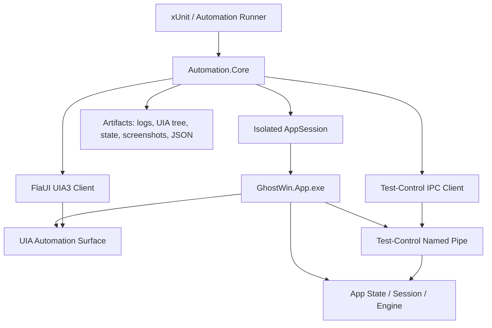
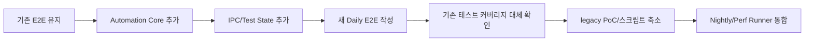

# GhostWin App 테스트 자동화 재구성 계획

작성일: 2026-05-09  
작성 기준: 코드베이스 분석 결과만 반영

## 1. 목표

GhostWin App 테스트 자동화를 처음부터 다시 정리한다.

핵심 목표는 다음 4가지다.

| 목표 | 설명 |
|---|---|
| 안정성 | CI/로컬에서 반복 실행해도 상태 오염, 포커스 실패, 고정 sleep 때문에 흔들리지 않게 한다. |
| 격리성 | 테스트마다 독립된 프로필, 앱 데이터, 로그, artifact를 사용한다. 개발자가 실행 중인 GhostWin을 죽이지 않는다. |
| 관측성 | 실패하면 UIA tree, 로그, 앱 상태, screenshot, JSON 결과를 자동으로 남긴다. |
| 확장성 | 새 기능이 생겨도 AutomationId, IPC command, scenario test를 같은 패턴으로 추가한다. |

현재 구조는 FlaUI, named pipe, MeasurementDriver, Python runner, PowerShell script가 각각 따로 자동화를 담당한다. 이 계획은 이들을 하나의 자동화 체계로 통합한다.

## 2. 현재 문제 요약

| 문제 | 현재 증상 | 새 구조에서의 처리 |
|---|---|---|
| 전역 프로세스 종료 | `GhostWin.App` 이름으로 모든 프로세스를 종료한다. | 테스트가 시작한 PID만 종료한다. |
| 실제 AppData 사용 | `%APPDATA%` 또는 실제 session 파일을 건드린다. | 테스트별 임시 profile/appdata를 사용한다. |
| 고정 sleep 의존 | 250ms, 500ms, 4s, 8s 대기값이 흩어져 있다. | 조건 기반 wait와 실패 diagnostics를 사용한다. |
| 포커스 의존 | keyboard/mouse 자동화가 foreground에 크게 의존한다. | daily 테스트는 UIA/IPC 중심으로 구성하고, keyboard/mouse는 nightly로 분리한다. |
| AutomationId 부족 | 일부 컨트롤은 Name만 있고, pane/notification item 식별이 어렵다. | 안정적인 AutomationId와 테스트 전용 state surface를 추가한다. |
| runner 중복 | xUnit fixture, MeasurementDriver, Python runner, PowerShell이 lifecycle을 중복 구현한다. | 공통 AppSession/Runner로 통합한다. |

## 3. 새 자동화 원칙

1. **FlaUI Keyboard/Mouse를 기본 수단으로 쓰지 않는다.**
   - 키보드/마우스 입력은 Windows foreground, input desktop, timing에 의존한다.
   - Daily gate에서는 UIA read/invoke와 IPC command를 우선 사용한다.

2. **앱 제어는 typed IPC로 한다.**
   - `ExecuteCommand`, `InjectOsc`, `GetState`, `ResetState`, `WaitForReady` 같은 명령을 JSON protocol로 제공한다.
   - 모든 요청은 성공/실패 응답과 상태 버전을 반환한다.

3. **검증은 UIA property와 app state를 함께 사용한다.**
   - UIA는 사용자에게 노출되는 자동화 표면이 제대로 있는지 검증한다.
   - app state는 실제 내부 상태가 맞는지 검증한다.

4. **실제 입력/픽셀/성능 검증은 별도 계층으로 분리한다.**
   - Win32 cursor, PrintWindow, pixel sample, PresentMon, CPU capture는 daily 테스트가 아니다.
   - Nightly 또는 수동 diagnostic/perf 시나리오로 실행한다.

## 4. 목표 아키텍처



### 구성 요소

| 구성 요소 | 위치 | 역할 |
|---|---|---|
| `GhostWin.Automation.Core` | `tests/GhostWin.Automation.Core/` | 앱 실행, 종료, 격리 profile, artifact, wait, UIA helper 제공 |
| `GhostWin.Automation.Tests` | `tests/GhostWin.Automation.Tests/` | 새 daily E2E 테스트 suite |
| `GhostWin.Automation.Runner` | `tests/GhostWin.Automation.Runner/` | perf/diagnostic/nightly scenario 실행 |
| Test-control IPC | `src/GhostWin.App/Automation/` | 테스트 전용 typed command protocol |
| AutomationId catalog | 앱과 테스트 공유 가능 위치 | 안정적인 ID 목록과 생성 규칙 제공 |

## 5. 테스트 계층

| 계층 | 실행 주기 | 입력 방식 | 예시 |
|---|---|---|---|
| Unit/Contract | 모든 PR | 앱 실행 없음 | formatter, parser, JSON contract |
| App-Control E2E | 모든 PR 또는 daily | UIA + IPC | split, workspace, settings, notification, cursor oracle |
| Interactive Smoke | nightly/수동 | 실제 keyboard/mouse/Win32 | foreground, actual cursor, context menu |
| Diagnostic/Perf | 수동/성능 회귀 | runner + artifact | render-perf, CPU, screenshot, pixel sample |

## 6. 구현 단계

### Phase 1. Automation Core 기반 만들기

목표: 모든 자동화가 공유할 앱 실행/종료/격리/관측 기반을 만든다.

작업:

- `AppSession` 생성
  - 테스트별 `RunId`, `ProfileDir`, `ArtifactDir`, `Pid`, `MainWindowHandle` 보관
  - 앱 실행 시 테스트 전용 환경변수 주입
  - 종료 시 해당 PID만 정상 종료 후 필요하면 강제 종료
- `AppLauncher` 생성
  - `GHOSTWIN_APP_EXE` 우선
  - Debug/Release 후보 경로 탐색
  - working directory 고정
- `Waiter` 생성
  - `WaitUntil` 공통 helper
  - timeout 시 reason과 diagnostics 저장
- `ArtifactWriter` 생성
  - `uia-tree.tsv`
  - `app-state.json`
  - `ghostwin.log`
  - `screenshot.png`
  - `test-result.json`

완료 기준:

- 테스트 하나가 독립 profile로 앱을 시작하고, main window를 찾고, 종료까지 수행한다.
- 실패 시 artifact directory가 항상 생성된다.

### Phase 2. Test-Control IPC 정식화

목표: 앱 제어를 keyboard/mouse가 아니라 typed IPC로 처리한다.

명령 초안:

| 명령 | 역할 |
|---|---|
| `WaitForReady` | 앱 초기화, 첫 pane/session 준비 완료 확인 |
| `GetState` | workspace, pane, session, focused pane, cursor oracle 상태 조회 |
| `ResetState` | 테스트 시작 전 앱 상태 초기화 |
| `ExecuteCommand` | `NewWorkspace`, `SplitVertical`, `SplitHorizontal`, `ClosePane`, `OpenSettings` 등 실행 |
| `InjectOsc` | OSC 9, OSC 22 등 테스트 입력 주입 |
| `SetSettings` | 테스트 중 설정값 변경 |

응답 형식:

```json
{
  "ok": true,
  "stateVersion": 12,
  "data": {},
  "error": null
}
```

완료 기준:

- IPC command는 항상 ack를 반환한다.
- 테스트는 pipe 연결 실패, command 실패, state mismatch를 명확히 구분한다.

### Phase 3. UIA 표면 정리

목표: 테스트가 Name 문자열에 의존하지 않고 안정적인 AutomationId로 찾을 수 있게 한다.

추가/정리 대상:

| 영역 | 필요한 표면 |
|---|---|
| Pane | `E2E_TerminalHost_{PaneId}`, `SessionId`, `IsFocused` |
| Workspace | `E2E_WorkspaceItem_{WorkspaceId}` |
| Notification | `E2E_NotificationItem_{NotificationId}`, `E2E_NotificationRing_{WorkspaceId}` |
| Settings | 모든 조작 가능한 control에 AutomationId |
| Command Palette | result list와 result item AutomationId |
| Context Menu | menu item AutomationId |
| Cursor Oracle | `shape`, `cursorId`, `sessionId`, `version`, `updatedAt` |

완료 기준:

- App-Control E2E는 `ByName` 탐색을 기본 경로로 쓰지 않는다.
- 같은 AutomationId가 여러 의미로 중복되지 않는다.

### Phase 4. 새 Daily E2E Suite 작성

목표: 현재 핵심 기능을 안정적인 daily 테스트로 다시 작성한다.

테스트 묶음:

| 테스트 묶음 | 검증 내용 |
|---|---|
| `StructureTests` | main window, pane, sidebar, settings, notification panel, command palette 자동화 표면 |
| `CommandTests` | new workspace, split vertical/horizontal, close pane, open/close settings |
| `StateTests` | session/workspace/pane state, restore, active pane 변경 |
| `CursorOracleTests` | OSC22 주입 후 cursor oracle 상태 |
| `NotificationTests` | OSC9 주입, unread ring, panel list, mark read, dismiss |
| `SettingsTests` | 설정 변경, 저장, reload 후 유지 |

완료 기준:

- foreground 없이 실행된다.
- keyboard/mouse 입력 없이 핵심 앱 동작을 검증한다.
- 테스트 실패 시 원인 확인에 필요한 artifact가 남는다.

### Phase 5. Interactive/Nightly Suite 분리

목표: 환경 의존 테스트를 daily gate와 분리한다.

대상:

- 실제 `FlaUI.Keyboard.TypeSimultaneously`
- 실제 `FlaUI.Mouse.Click`
- Win32 cursor handle 검증
- context menu 우클릭 검증
- PrintWindow screenshot/pixel sample

완료 기준:

- nightly 테스트는 `Trait("Category", "Interactive")` 또는 별도 runner 옵션으로만 실행된다.
- daily 실패와 nightly 실패가 구분되어 보고된다.

### Phase 6. Runner와 기존 스크립트 통합

목표: 현재 흩어진 runner를 하나의 공통 구조로 합친다.

흡수 대상:

| 기존 요소 | 처리 |
|---|---|
| `GhostWin.MeasurementDriver` | 시나리오/JSON contract는 재사용, lifecycle은 새 runner로 이동 |
| `measure_render_baseline.ps1` | thin wrapper로 축소 |
| `scripts/e2e/e2e_operator` | readiness/window/focus 로직 중 좋은 부분만 흡수 |
| `repro_first_pane.ps1` | diagnostic scenario로 이동 |
| `tests/e2e-flaui-*` | 새 suite로 흡수 후 legacy 처리 |

완료 기준:

- 앱 lifecycle 소유자가 하나로 줄어든다.
- artifact 형식이 공통화된다.
- PowerShell/Python/C#이 같은 역할을 중복 수행하지 않는다.

## 7. 에이전트 작업 분배

| 에이전트 | 담당 | 산출물 |
|---|---|---|
| Agent A | Automation Core | `AppSession`, `AppLauncher`, `Waiter`, `ArtifactWriter` |
| Agent B | GhostWin.App 자동화 표면 | AutomationId 정리, IPC command, state snapshot |
| Agent C | Daily E2E Suite | structure/command/state/cursor/notification/settings 테스트 |
| Agent D | Runner/Perf 통합 | 새 runner, measurement scenario, legacy script 축소 |
| Main Agent | 통합 검토 | 공통 contract 확정, 충돌 조정, 전체 빌드/테스트 |

병렬 작업 규칙:

- Agent A와 B는 먼저 interface contract를 짧게 맞춘다.
- Agent C는 A/B의 최소 contract가 생긴 뒤 테스트를 작성한다.
- Agent D는 A의 AppSession 기반을 사용한다.
- 같은 파일을 여러 에이전트가 동시에 수정하지 않는다.

## 8. 마이그레이션 순서



기존 테스트는 새 suite가 같은 커버리지를 확보하기 전까지 삭제하지 않는다.

## 9. 성공 기준

최종적으로 다음 조건을 만족해야 한다.

- Daily 테스트가 foreground 없이 안정적으로 실행된다.
- 테스트가 시작한 앱 프로세스만 종료한다.
- 테스트별 profile/appdata/artifact가 완전히 분리된다.
- `%APPDATA%`, `C:\temp`, 고정 sleep 의존이 사라진다.
- UIA 탐색은 안정적인 AutomationId 중심이다.
- IPC command는 모두 ack와 구조화된 error를 반환한다.
- keyboard/mouse/Win32/pixel 검증은 nightly 또는 diagnostic으로 분리된다.
- 실패 시 재현에 필요한 artifact가 자동으로 남는다.

## 10. 첫 번째 실행 단위

가장 먼저 할 일은 `Automation Core + isolated AppSession`이다.

이유:

- 앱 실행/종료/격리가 안정되지 않으면 새 테스트도 똑같이 흔들린다.
- IPC, UIA, runner, perf 통합 모두 AppSession을 기반으로 붙는다.
- 기존 테스트를 유지하면서도 새 구조를 옆에 만들 수 있어 위험이 낮다.

첫 PR 범위:

1. `tests/GhostWin.Automation.Core` 프로젝트 추가
2. `AppSession`으로 GhostWin.App 실행/종료
3. 테스트별 임시 profile/appdata/artifact 생성
4. `UIA3Automation`으로 main window 확인
5. smoke test 1개 추가
6. 실패 시 UIA tree와 기본 로그 저장

첫 PR 완료 후 다음 PR에서 IPC protocol을 붙인다.
