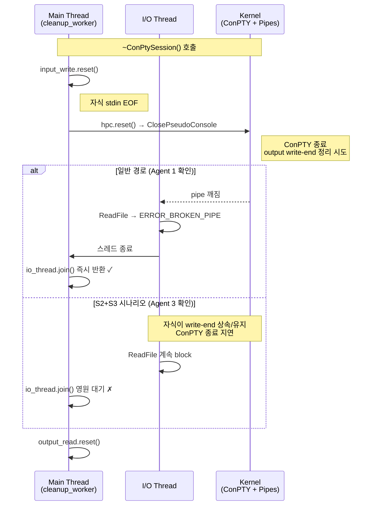

# io-thread-timeout-v2 — I/O 스레드 종료 보장 정리 계획

> **부모 마일스톤**: [[Milestones/pre-m11-backlog-cleanup]] Group 4 #11
> **상태**: Plan 갱신됨 (2026-04-15) — **4 agent 병렬 재검증 (team mode, opus) 결과 반영**
> **최초 Placeholder**: 2026-04-14

---

## 맨 위 요약 (1~2 문장)

I/O 스레드가 `ReadFile` 에서 블록 중일 때 종료 안 깨어나는 희박한 시나리오가 있다. 원 Placeholder 는 "UB 가 발생해 되돌림" 이라 적었으나 실제는 **C++ 표준이 정의한 `~future()` block** 때문에 timeout 시도가 무효화된 것. 해결은 **`CancelIoEx` 1 줄** 추가로 충분하다 (ghostty 동일 패턴).

---

## Executive Summary

| Perspective | Content |
|-------------|---------|
| **Problem** | `ConPtySession` 소멸자의 `io_thread.join()` 에 타임아웃 없음. 일반 경로에서는 `ClosePseudoConsole` 이 pipe 를 끊어 `ReadFile` 이 즉시 실패 반환하지만, 자식 프로세스가 output write-end 를 상속/유지하는 희박한 시나리오에서 영구 hang 가능 |
| **Solution** | `hpc.reset()` 직후 + `join()` 직전에 **`CancelIoEx(output_read, nullptr)` 1 줄** 호출. 동기 `ReadFile` 을 확정적으로 깨움. ghostty `Exec.zig:217` 와 동일 패턴, 프로젝트 `file_watcher.cpp:74` 에 `CancelIo` 선례 존재 |
| **Function/UX Effect** | 체감 버그 "창 닫았는데 안 꺼짐" ([[Backlog/tech-debt]] #6) 해소. Graceful shutdown 안정성 향상 |
| **Core Value** | Graceful shutdown 의 마지막 퍼즐. `3a28730` 에서 되돌린 `std::async` 접근의 실패 원인을 표준 근거로 정리해 **재발 방지 교훈 주석** 남김 |

---

## 배경 — Placeholder 진단이 왜 부정확했나

2026-04-14 작성된 Placeholder 는 다음을 주장.

| Placeholder 주장 | 4 agent 재검증 결과 |
|------------------|---------------------|
| "std::async + wait_for 시도 → UB → 되돌림" | **용어 부정확**. UB 가 아니라 **C++ 표준 [futures.async]/5 가 정의한 `~future()` block**. 결과는 hang 지속, 원인은 정의된 동작 (Agent 2) |
| "std::async 객체의 소멸이 detach 를 보장 안 함" | 의미상 맞음, 정확히는 "**`std::future` 소멸자가 shared state ready 까지 block**". `detach` 는 `std::thread` 멤버 (Agent 2) |
| "소멸자 영구 블록 가능" | 일반 경로는 안전. **특정 시나리오** (자식이 output write-end 핸들 상속 + ClosePseudoConsole 지연) 에서 가능 (Agent 3) |
| "후보 A (jthread) / B (IOCP) / C (워치독) 3 중 선택" | **후보 1 개로 확정 가능** — `CancelIoEx`. 나머지는 과잉 또는 불충분 (Agent 4) |

즉 원 Placeholder 는 **기억 기반 서술** 으로, 실제는 **단일 명확한 해결책** 이 있는 정리 작업.

---

## 지금 어떻게 작동하는가

### 현재 소멸자 시퀀스



### 현재 코드 (`src/conpty/conpty_session.cpp:359-390`)

```cpp
// 1. Close input pipe → child sees EOF
impl_->input_write.reset();
// 2. Close ConPTY → sends CTRL_CLOSE_EVENT to child
impl_->hpc.reset();
// 3. I/O thread's ReadFile returns failure → loop exits → joinable
//    hpc.reset() breaks the ConPTY pipe, causing ReadFile to fail
//    and the I/O loop to exit. join() should return quickly after that.
if (impl_->io_thread.joinable()) {
    impl_->io_thread.join();   // ← 타임아웃 없음
}
// 4. Close output pipe
impl_->output_read.reset();
```

### 이전 `std::async` 시도 (`31a2235`, 2026-04-13)

```cpp
// Commit 31a2235 에서 시도, 3a28730 에서 되돌림
if (impl_->io_thread.joinable()) {
    auto future = std::async(std::launch::async, [&] { impl_->io_thread.join(); });
    if (future.wait_for(std::chrono::seconds(3)) == std::future_status::timeout) {
        fprintf(stderr, "[conpty] I/O thread join timeout (3s), detaching\n");
        impl_->io_thread.detach();
    }
}
```

**왜 이게 안 됐나** (C++ 표준 [futures.async]/5):

> "the `future` obtained from `std::async(std::launch::async, ...)` has an associated shared state; the destructor will **block until the associated thread completes**, as if by `join()`."

즉:
1. `wait_for(3s)` 가 `timeout` 반환 → shared state 여전히 ready 아님
2. `if` 블록 종료 시 **`~future()` 가 `join()` 완료까지 다시 block**
3. `io_thread.detach()` 줄은 **도달하기 전** 소멸자가 또 block
4. 결과: "3 초 timeout 후 detach" 의도는 **표준상 성립 불가**

이 실패를 `3a28730` 주석은 "hpc.reset()이 파이프를 끊어 ReadFile이 즉시 실패" 라고만 기록하고 **표준 근거 교훈은 안 남겼다** — 같은 실수 재발 위험.

---

## 문제 상황 — 사용자 체감

> "창 닫았는데 앱이 안 꺼짐" ([[Backlog/tech-debt]] #6)


빈도는 드묾. 하지만 발생 시 **사용자 직접 체감 + 프로세스 kill 필요**.

---

## 해결 방법 — `CancelIoEx` 1 줄 추가

### 핵심 아이디어

`CancelIoEx(output_read, nullptr)` 를 `hpc.reset()` 직후 + `join()` 직전에 호출. **동기 `ReadFile` 을 확정적으로 깨움**.

### 의사 코드 (Before → After)

**Before** (`conpty_session.cpp:367-374` 부근):
```cpp
impl_->hpc.reset();                              // ConPTY close
if (impl_->io_thread.joinable()) {
    impl_->io_thread.join();                     // 희박하게 영원 대기 가능
}
```

**After**:
```cpp
impl_->hpc.reset();                              // ConPTY close
// Force-cancel any pending ReadFile on output_read in case the child process
// inherited or is still holding the pipe's write-end (S2+S3 scenario).
// CancelIoEx deterministically wakes the blocking ReadFile, which then returns
// ERROR_OPERATION_ABORTED. The I/O loop exits and join() returns.
// Pattern mirrors ghostty external/ghostty/src/termio/Exec.zig:217-225.
if (!CancelIoEx(impl_->output_read.get(), nullptr)) {
    DWORD err = GetLastError();
    if (err != ERROR_NOT_FOUND) {  // ERROR_NOT_FOUND = nothing to cancel, OK
        log_win32_error("CancelIoEx", err);
    }
}
if (impl_->io_thread.joinable()) {
    impl_->io_thread.join();
}
```

### 왜 `CancelIoEx` 인가 — 5 대안 비교 (Agent 4)

| 대안 | 복잡도 | 재작성 규모 | 안전성 | 선례 | 판정 |
|------|:-----:|:----------:|:-----:|:----:|:----:|
| `CancelSynchronousIo(thread_handle)` | 저 | +5 줄 | 동기 한정, THREAD_TERMINATE 필요 | 프로젝트 없음 | 2 순위 |
| **`CancelIoEx(handle, nullptr)`** | **저** | **+3 줄** | **동기/비동기 모두, 권한 불필요** | **ghostty + file_watcher.cpp:74** | **✅ 1 순위** |
| IOCP 전환 | 고 | 전면 재작성 | 견고 | 프로젝트 없음 | 과잉 |
| `jthread` + `stop_token` 단독 | 중 | + 조합 필수 | blocking 못 깨움 | file_watcher (SetEvent와 조합) | 불충분 |
| detach + 경고 로그 | 매우 저 | +5 줄 | 리소스 리크 | 없음 | 우회 금지 규칙 위반 |

---

## 왜 안전한가

| 근거 | 출처 |
|------|------|
| `CancelIoEx` 는 지정 핸들의 모든 미처리 I/O (동기/비동기) 취소 | MSDN `https://learn.microsoft.com/en-us/windows/win32/fileio/cancelioex-func` |
| ghostty 가 동일 ConPTY 환경에서 동일 패턴 사용 | `external/ghostty/src/termio/Exec.zig:217-225` |
| 프로젝트 내 `CancelIo` 선례 존재 | `src/settings/file_watcher.cpp:74` |
| 현재 `ReadFile` 은 NULL overlapped 동기 호출 | `conpty_session.cpp:290` (Agent 4 확인) |
| `ERROR_NOT_FOUND` 반환 (취소할 I/O 없음) 은 정상 — 이미 pipe close 로 깨어났음 | MSDN |
| 일반 경로에서 pipe close 가 먼저 발동하면 CancelIoEx 는 no-op | 현 동작과 호환 |

**부작용 없음**: CancelIoEx 는 핸들 단위 취소라 I/O 스레드 외에 영향 없음. 이미 정상 종료 중이면 no-op.

---

## 작업 범위

### 필수 작업

| # | 위치 | 변경 | LOC |
|---|------|------|:---:|
| 1 | `src/conpty/conpty_session.cpp:367-374` 부근 | `CancelIoEx` 호출 추가 + 교훈 주석 | ~10 |
| 2 | 소멸자 상단 주석 | "shutdown sequence" 다이어그램 + `std::async` 교훈 (3a28730 실패 원인을 표준 근거로) | ~15 |
| 3 | `docs/adr/` 또는 Obsidian ADR | 신규 ADR (Shutdown Wakeup) 검토 — Design phase 결정 | — |

소계: ~25 LOC

### 선택 작업 (Design 에서 결정)

| # | 항목 | 비고 |
|---|------|------|
| A | `file_watcher.cpp:74` 도 `CancelIoEx` 로 통일 검토 | 현재 `CancelIo` — 차이 미미하지만 API 일관성 |
| B | `WaitForSingleObject(child_process, shutdown_timeout_ms)` 경로 검증 | 본 작업과 별개 |
| C | 단위 테스트 추가 — "자식이 write-end 상속한 상태에서 종료" 재현 | 복잡, 신중히 결정 |

---

## 비교표 — 원 Placeholder vs 갱신본

| 항목 | 원 Placeholder | 갱신본 |
|------|---------------|--------|
| UB 주장 | "std::async UB" | **C++ 표준이 정의한 `~future()` block** (UB 아님) |
| hang 가능성 | "드물지만 가능" | **S2+S3 특정 시나리오에서 이론상 가능** (코드 경로 명시) |
| 해결 후보 | 3 개 (jthread / IOCP / 워치독) | **1 개** (CancelIoEx) + 4 개 배제 근거 |
| 작업 규모 | 중 (~400 Design) | **소 (~25 LOC)** |
| 참조 구현 | 언급 없음 | **ghostty Exec.zig:217** + `file_watcher.cpp:74` |

---

## 확실하지 않은 부분

- ⚠️ `CancelIoEx` 호출 시 `output_read` 핸들이 다른 곳에서 race 없이 살아있는지 — 현 소멸자 순서상 OK로 보이지만 Do phase 에서 테스트 필요 (Agent 4)
- ⚠️ ConPTY 의 `output_read` 파이프가 `CancelIoEx` 에 반응한다는 MSDN 명시적 보장 없음 — 단 ghostty 선례가 강한 실증 (Agent 4)
- ⚠️ S3 시나리오 (자식이 write-end 핸들 상속) 가 `pwsh` / `cmd.exe` 기본 동작에서 실제 발생하는지 재현 근거는 코드/문서 내 없음 (Agent 3)

---

## 진입 조건

- [x] 코드 재검증 완료 (4 agent 병렬, 2026-04-15)
- [x] Plan 갱신 완료 (본 문서)
- [ ] Design 문서 작성 (CancelIoEx 통합 + 교훈 주석 포함)
- [ ] `/pdca do io-thread-timeout-v2` 진입

---

## 요약 한 줄

`CancelIoEx` **1 줄 추가**로 `io_thread.join()` hang 가능성 제거. 원 Placeholder 가 주장한 "UB" 는 **C++ 표준의 `~future()` block** 이었고, 3-후보 비교가 아니라 ghostty 와 같은 **단일 명확한 해결책**이 있다.

---

## 관련 문서

- `docs/02-design/features/io-thread-timeout-v2.design.md` (Design phase 에서 작성)
- Obsidian [[Backlog/tech-debt]] #6
- Obsidian [[Milestones/pre-m11-backlog-cleanup]] Group 4 #11
- 되돌림 commit: `3a28730` (2026-04-14)
- 도입 commit: `31a2235` (2026-04-13)
- ghostty 참조: `external/ghostty/src/termio/Exec.zig:217-225`
- 프로젝트 선례: `src/settings/file_watcher.cpp:74`
- C++ 표준: [futures.async]/5 — https://en.cppreference.com/w/cpp/thread/future/~future
- MSDN CancelIoEx: https://learn.microsoft.com/en-us/windows/win32/fileio/cancelioex-func
