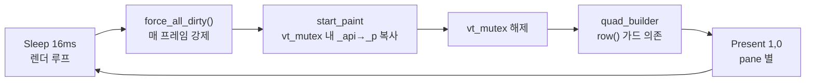
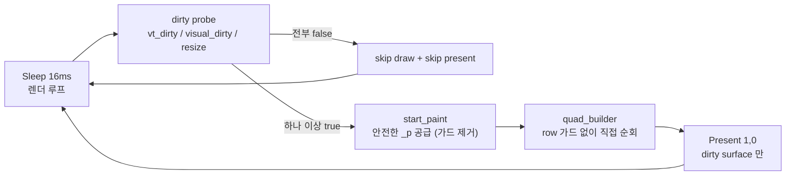

# M-14 Render Thread Safety & Baseline Recovery — Plan

> **Summary**: GhostWin 렌더 경로를 (a) resize race 방어 가드 없이도 안전한 frame 경계 + (b) idle/load/multi-pane resize 시나리오에서 WT/WezTerm/Alacritty 대비 명확한 열세가 없는 성능 기준선, 두 가지를 함께 회복하는 마일스톤.
>
> **Project**: GhostWin Terminal
> **Milestone**: M-14
> **Author**: 노수장
> **Date**: 2026-04-20
> **Status**: Draft v1.0
> **Upstream PRD**: `docs/00-pm/m14-render-thread-safety.prd.md`
> **Implementation Guide (sibling)**: `docs/01-plan/features/temp-m14-render-thread-safety.plan.md` (subagent-DD 포맷, 세부 Task checkbox 는 여기 참조)

---

## Executive Summary

| 관점 | 내용 |
|------|------|
| **Problem** | `_api/_p` dual-state 가 있음에도 `RenderFrame::row()` 는 여전히 "resize race 시 빈 span 반환" 방어 가드에 의존한다 ([render_state.h:52-57](src/renderer/render_state.h:52)). 동시에 렌더 루프가 매 프레임 `force_all_dirty()` + 전체 row/cell 2-pass 순회 + pane 별 `Present(1, 0)` 로 진행되어 idle/대량 출력/4-pane resize 세 시나리오에서 체감 열세가 크다. |
| **Solution** | W1 먼저 Release 빌드 + PresentMon 기반 계측 경로를 넣어 "어디가 느린지" 를 수치로 고정 → W2 `_p` read path 를 가드 없이 안전한 구조로 정리 → W3 `force_all_dirty()` 상시 호출을 제거하고 visual invalidation 을 별도 epoch 로 분리 → W4 clean-surface skip-present 로 pane 수 누적 비용 재측정 → W5 WT/WezTerm/Alacritty 비교로 완료 게이트 판정. |
| **Function / UX Effect** | 사용자는 "안 깨지지만 무거운" 상태에서 벗어나, (1) idle 에서 CPU/GPU 실질 휴식, (2) 로그 폭주 시 끊김 없는 스크롤, (3) 4-pane resize 에서 stutter 없는 반응을 체감한다. |
| **Core Value** | GhostWin 비전 3축 중 **③ 타 터미널 대비 성능 우수**를 실제 코드 위에서 복구한다. M-14 를 통과해야 이후 기능이 "느리고 불안한 기반" 위에 쌓이지 않는다. |

---

## 1. Overview

### 1.1 Purpose

M-14 는 새 기능 마일스톤이 아니다. 두 개의 독립된 문제를 **한 게이트** 아래 묶어 닫는 복구 마일스톤이다.

1. **안전성**: `_p` 를 읽는 경로가 방어 가드 없이도 구조적으로 안전해야 한다
2. **성능 기준선**: idle / 대량 출력 / 4-pane resize 세 시나리오에서 경쟁 터미널 대비 명확한 열세가 없어야 한다

둘 중 하나만 닫으면 "안전하지만 느림" 또는 "빠르지만 믿고 못 씀" 이 되므로, 함께 닫는다.

### 1.2 Background

PRD `docs/00-pm/m14-render-thread-safety.prd.md` 에서 이미 문제 재정의와 성공 기준이 확정됐다. Plan 의 역할은 그 PRD 를 **실행 가능한 Task 묶음 + 정량 가설 budget + 검증 경로** 로 변환하는 것이다.

Plan 단계에서 확정되지 않는 것 (Design 단계로 넘김):
- `_p` 안전화의 구체 구조 선택 (front/back swap vs `_p.reshape()` 락 범위 확장 vs shared_mutex)
- `visual_epoch` 의 memory ordering 정책 (release/acquire vs relaxed)
- perf 계측 로그 스키마 최종본

### 1.3 Related Documents

| 문서 | 용도 |
|------|------|
| `docs/00-pm/m14-render-thread-safety.prd.md` | PRD — 문제 재정의, 성공 기준, Workstream |
| `docs/03-analysis/concurrency/pane-split-concurrency-20260406.md` | 역사적 배경 (C-001/C-003 은 이미 해결됨을 확인, [engine.cpp:162-164](src/engine-api/ghostwin_engine.cpp:162) 주석 참조) |
| `C:\Users\Solit\obsidian\note\Projects\GhostWin\Milestones\m14-render-thread-safety.md` | Obsidian milestone spec |
| `C:\Users\Solit\obsidian\note\Projects\GhostWin\Architecture\dx11-rendering.md` | 현 DX11 렌더 경로 문서 |
| `docs/01-plan/features/temp-m14-render-thread-safety.plan.md` | 구현 세부 Task checkbox + code sketch (subagent-DD 포맷). 본 plan 과 병행 참조 |

---

## 2. Scope

### 2.1 In Scope

- [ ] Release 빌드 기반 perf 계측 hook + PresentMon 통합 수집 스크립트
- [ ] `_p` read path 를 `row()` 방어 가드 없이도 안전하게 만드는 구조 (구체 방식은 Design 에서 확정)
- [ ] `force_all_dirty()` 상시 호출 제거 + `visual_epoch` 기반 selective invalidation
- [ ] clean-surface skip-present (vt_dirty / visual_dirty / resize_applied 모두 false 일 때 draw/present 생략)
- [ ] 4-pane resize 스트레스 시나리오 고정 + baseline 수집
- [ ] WT / WezTerm / Alacritty 비교 기록
- [ ] Plan/Design/PRD/Obsidian milestone 문서 동기화

### 2.2 Out of Scope

- 새 사용자 기능 (IME UX 확장, 알림/OSC/hook 확장, 테마/설정 추가)
- "렌더 전면 재작성" 규모의 구조 변경 (예: atlas 재설계)
- DXGI tearing mode (`DXGI_SWAP_EFFECT_FLIP_DISCARD` + `DXGI_PRESENT_ALLOW_TEARING`) — W4 결과가 pane 수에 선형 증가하면 **follow-up milestone 조건**으로 기록
- ghostty upstream rebase (단, fork 의 OPT 15/16 패치가 hot path 성능에 영향 있는지 확인은 W1 범위 내)
- "성능 세계 1위" 달성 — 목표는 **경쟁 터미널 대비 명확한 열세가 없는 상태**

---

## 3. Requirements

### 3.1 Functional Requirements

| ID | Requirement | 근거 PRD 섹션 | Priority | Status |
|----|-------------|---------------|----------|--------|
| **FR-01** | Release 빌드에서 `GHOSTWIN_RENDER_PERF` 환경 변수가 set 일 때 per-frame per-surface perf 샘플을 구조화 로그로 기록 | PRD 7.1 | High | Pending |
| **FR-02** | `measure_render_baseline.ps1` 는 `idle / load / resize` 3개 시나리오를 인자로 받아 자동 실행하고 CSV 형식으로 결과 저장 | PRD 7.1 W1 | High | Pending |
| **FR-03** | `_p` read path (`RenderFrame::row()`) 에서 empty-span 방어 가드 **제거 후에도** [quad_builder.cpp](src/renderer/quad_builder.cpp) hot path 가 crash/assertion 없이 동작 | PRD 3.2 G1, 완료 게이트 #1 | High | Pending |
| **FR-04** | 렌더 루프가 `vt_dirty = false && visual_dirty = false && resize_applied = false` 일 때 draw/present 를 호출하지 않음 (clean-surface skip) | PRD 3.2 G2, G4 | High | Pending |
| **FR-05** | `Session::visual_epoch` 가 selection / IME composition / activate 같은 **non-VT visual change** 시점에서만 증가하고, 렌더 스레드가 이 값을 surface 별로 추적 | PRD 3.2 G2 | High | Pending |
| **FR-06** | W5 에서 WT / WezTerm / Alacritty 3종 비교 결과 표가 `docs/04-report/features/m14-render-baseline.report.md` 에 기록 | PRD 6.2, 완료 게이트 #4 | High | Pending |
| **FR-07** | Obsidian `Milestones/m14-render-thread-safety.md` + `Backlog/tech-debt.md` 가 M-14 종료 상태로 갱신 | PRD 7 W5 | Medium | Pending |

### 3.2 Non-Functional Requirements

> ⚠️ **모든 수치는 초기 가설 budget**. W1 실측 + W5 경쟁사 비교 후 tighten 또는 relax 한다. Go/No-Go 판정은 Release 빌드에서만.

| Category | 초기 가설 Budget | 측정 방법 | 확정 시점 |
|----------|------------------|-----------|-----------|
| **Idle CPU (1-pane)** | Release 빌드 60초 평균 `≤ 2%` (GhostWin 단독. OS overhead 제외) | Task Manager / Process Explorer 60초 평균 | W1 수집 후 W5 비교로 확정 |
| **Load p95 frame time (1-pane)** | `≤ 16.7ms` (60fps 예산 가설) | 내부 perf log p95 + PresentMon `msBetweenPresents` | W1/W3 수집 후 W5 비교로 확정 |
| **Resize p95 frame time (4-pane)** | `≤ 33ms` (30fps 체감 방어선 가설) | 내부 perf log + 화면 녹화 stutter 확인 | W4 수집 후 W5 비교로 확정 |
| **외부 비교 열세 판정 규칙** | 동일 시나리오 3회 반복 중 2회 이상 일관된 열세 + 수치 + 녹화로 설명 가능해야 "명확한 열세" | 비교 시나리오 4개 중 3개 이상 통과 (PRD 6.3 #5) | W5 종료 시 |
| **안전성: row() 가드 제거 후 안정성** | 1시간 random resize + 4-pane 분할 스트레스에서 assertion / UAF / 검정 프레임 0건 | 자동화 stress test + 수동 drag | W2 직후 |

---

## 4. Success Criteria

### 4.1 Definition of Done

다음 5개 게이트를 **모두** 만족해야 M-14 를 닫는다 (PRD 6.3 1:1 매핑).

- [ ] **게이트 #1 안전성**: [render_state.h:52-57](src/renderer/render_state.h:52) `row()` 의 empty-span 방어 가드를 제거하고도 stress test 통과
- [ ] **게이트 #2 시나리오 재현성**: `idle / load / 4-pane resize` 3개 시나리오가 `measure_render_baseline.ps1` 로 반복 가능
- [ ] **게이트 #3 내부 수치**: 3개 시나리오 각각 `avg / p95 / max` 수치가 CSV 로 기록되고 report 문서에 수록
- [ ] **게이트 #4 외부 비교**: WT / WezTerm / Alacritty 비교 결과가 report 에 기록 (Alacritty 는 pane 축 차이로 4-pane 비교 제외)
- [ ] **게이트 #5 열세 탈출**: PRD 6.2 비교 시나리오 4개 중 3개 이상에서 GhostWin 이 "명확한 열세" 판정을 받지 않음

### 4.2 Quality Gates

- [ ] `msbuild GhostWin.sln /p:Configuration=Debug /p:Platform=x64` 성공
- [ ] `msbuild GhostWin.sln /p:Configuration=Release /p:Platform=x64` 성공
- [ ] `render_state_test` + `dx11_render_test` 전부 PASS (Debug)
- [ ] 컴파일 경고 zero (메모리 규칙 `feedback_no_warnings` 준수)
- [ ] `force_all_dirty()` 상시 호출 제거 후 IME composition 오버레이 회귀 없음

---

## 5. Risks and Mitigation

| ID | Risk | 영향 | 가능성 | Mitigation |
|----|------|------|--------|------------|
| **R-01** | 안전성 fix 가 lock 범위를 넓혀 성능을 더 악화 | High | Medium | M-14 는 안전성-only fix 허용 안 함. FR-03 통과 후 반드시 W3 재측정으로 회귀 확인 |
| **R-02** | `visual_epoch` 의 memory ordering 실수로 dropped redraw (selection 안 그려짐 등) | High | Medium | Design 단계에서 ordering 정책 명시 후 단위 테스트. `fetch_add` / `load` 양쪽 모두 동일 ordering 사용 (P2 개선 사항) |
| **R-03** | 계측 overhead 자체가 관측 대상 왜곡 (`std::getenv` 매 프레임 호출 등) | Medium | High | `GHOSTWIN_RENDER_PERF` 는 프로세스 시작 시 1회 static 읽기. 매 프레임 조건 분기는 atomic bool 로 단축 (P3 개선) |
| **R-04** | 4-pane `Present(1, 0)` 이 clean-surface skip 후에도 선형 증가하면 근본 해결 불가 | High | Medium | follow-up 조건으로 기록 (DXGI tearing mode 전환은 별도 milestone) |
| **R-05** | PC 하드웨어 의존성으로 비교 수치 흔들림 | Medium | High | 동일 PC 절대 수치 + 경쟁 대비 상대 수치 병기. 3회 반복 중 2회 이상 일관성 요구 |
| **R-06** | 범위 확산 ("렌더 전면 재작성" 으로 번짐) | High | Medium | Scope 2.2 엄수. Design 단계에서 in-scope/out-of-scope 재확정 |
| **R-07** | ghostty fork OPT 15 (desktop notification) / OPT 16 (mouse shape) 패치가 hot path 에 개입해 측정 혼선 | Low | Low | W1 에서 전후 비교로 영향 확인. 영향 있으면 Design 에 기록 (P 개선 사항) |

---

## 6. Architecture Considerations

### 6.1 Project Level

| Level | Selected | 이유 |
|-------|:--------:|------|
| Starter | ☐ | - |
| Dynamic | ☐ | - |
| **Enterprise** | ☒ | WPF + Native (DX11/ConPTY/ghostty-vt) 이종 프로세스 경계 + 스레드 다중화 (UI/Render/IO/Worker) |

### 6.2 Key Architectural Decisions (Plan 단계 확정 사항)

| Decision | Options | Selected | 근거 |
|----------|---------|----------|------|
| perf 계측 활성화 방식 | 빌드 플래그 / 환경 변수 / 런타임 설정 | **환경 변수** (`GHOSTWIN_RENDER_PERF`) | 프로세스 시작 시 1회 static 읽기 → overhead 최소. 재빌드 불필요 |
| perf 로그 형식 | LOG_I printf / JSON / CSV 직접 | **LOG_I 구조화 + 후처리 CSV 변환** | 기존 LOG 인프라 재사용. 후처리 단계에서 분석 유연성 확보 |
| 외부 Present 측정 | 자체 `QueryPerformanceCounter` only / PresentMon / WPA ETW | **내부 `QPC` + PresentMon 병행** | 자체 측정은 `Present()` 내부 블로킹만 포착. DWM-to-display 은 PresentMon 필요 |
| 성능 판정 빌드 | Debug / Release | **Release only** | Debug 는 `/Od` + STL checked iterators 로 수치 왜곡. 참고 자료로만 기록 |
| `_p` 안전화 구조 | **Design 단계에서 확정** | — | 현재 baseline 은 이미 `resize()` 가 vt_mutex 내부에서 수행되지만, `frame()` 참조가 락 밖으로 탈출한 뒤에도 안전하지 않다. 따라서 Design 선택지는 `(a) _front/_back 2-buffer swap`, `(b) reader-visible immutable snapshot handle`, `(c) shared_mutex` 같은 **락 밖 reader 안전성** 을 직접 해결하는 방식으로 한정한다. |
| `visual_epoch` ordering | relaxed / acq-rel | **Design 단계에서 확정** | publisher/consumer 대칭 필수 (P2). Design 에서 race model 명시 |

### 6.3 Architecture Flow (Before / After 개념도)

**Before (현재)**:



**After (M-14 완료 후 목표)**:



---

## 7. Implementation Plan (Workstreams)

세부 Task checkbox + code sketch 는 `docs/01-plan/features/temp-m14-render-thread-safety.plan.md` 참조 (subagent-DD 포맷). 본 섹션은 각 Workstream 의 **목적·산출물·개선 지점 (P1-P6)·완료 조건** 만 기술한다.

### 7.1 W1 — 측정 가능성 확보

**목적**: "느리다" 를 감정에서 수치로 전환.

**주요 산출물**:
- `src/renderer/render_perf.h` — `RenderPerfSample` / `DrawPerfResult` 구조체
- `src/engine-api/ghostwin_engine.cpp` — 계측 hook (env var static 1회 읽기, 매 프레임 atomic bool 분기 — **개선 P3**)
- `src/renderer/dx11_renderer.cpp` — `upload_and_draw_timed()` 분리
- `scripts/measure_render_baseline.ps1` — `idle / load / resize` 3 시나리오 + **PresentMon 래핑** (개선 P5)
- Release 빌드 3 시나리오 baseline CSV (`docs/04-report/features/m14-render-baseline-w1.csv`)

**W1 전제 확인 항목**:
- Release 빌드 환경 구축 완료 (CRT 링크, Zig cache 경로 등)
- PresentMon 바이너리 확보 + 실행 권한
- OPT 15 / OPT 16 fork 패치가 render hot path 에 실질 영향을 주는지 before/after 비교 (개선 P — R-07 대응)

**완료 조건**: 3 시나리오 각각 60초 Release baseline 이 CSV 로 기록되고 p95/avg/max 계산.

---

### 7.2 W2 — `_p` read path 안전화 (가드 제거)

**목적**: [render_state.h:52-57](src/renderer/render_state.h:52) `row()` 의 empty-span 방어 가드를 제거해도 안전하게.

**사실 확인** (본 Plan 작성 시):
- `_api/_p` dual-state 이미 존재 ([render_state.h:131-132](src/renderer/render_state.h:131))
- `TerminalRenderState::resize()` precondition: caller holds vt_mutex ([render_state.h:123-125](src/renderer/render_state.h:123))
- `start_paint()` 은 vt_mutex 내부에서 `_api → _p` 복사
- 현재 insufficient baseline: `SessionManager::resize_session()` 은 이미 vt_mutex 아래에서 `state->resize()` 를 호출한다 ([session_manager.cpp:406-412](src/session/session_manager.cpp:406)). 즉 "`_p.reshape()` 을 vt_mutex 내부로" 는 **새 대안이 아니라 이미 적용된 상태**다.
- 문제 위치: 렌더 스레드가 `frame()` 으로 `_p` 참조를 받고 vt_mutex 해제 후 [quad_builder.cpp:80,117](src/renderer/quad_builder.cpp:80) 2-pass 순회. 이 구간에서 `_p` 자체가 다른 스레드에 의해 reshape 될 가능성을 guard 가 방어 중.
- 또한 `frame()` reader 는 render hot path 하나만이 아니다. 현재 코드 기준으로 최소 다음 경로가 lock-free snapshot contract 를 공유한다:
  - `ghostwin_engine.cpp:169` — render surface draw
  - `ghostwin_engine.cpp:1053` — `gw_session_get_cell_text`
  - `ghostwin_engine.cpp:1083` — `gw_session_get_selected_text`
  - `ghostwin_engine.cpp:1172` — `gw_session_find_word_bounds`
  - `ghostwin_engine.cpp:1223` — `gw_session_find_line_bounds`
  - `terminal_window.cpp:69` — standalone terminal window render loop

**주요 산출물**:
- Design 단계에서 선택한 안전화 구조의 구현 (후보: front-back swap / reader-visible immutable snapshot handle / shared_mutex)
- **swap 방식 채택 시**: swap 은 반드시 `start_paint()` 의 vt_mutex 내부에서 수행 (**개선 P1** — 본문에 명시)
- `tests/render_state_test.cpp` — reshape-during-read stress 테스트 (가드 제거 전: FAIL 재현, 가드 제거 후: PASS)
- `frame()` 를 읽는 모든 경로가 동일 snapshot contract 를 따르도록 확인:
  - render hot path
  - cell text / selected text 조회
  - word/line bounds 조회
  - standalone `terminal_window.cpp` 경로
- [quad_builder.cpp:82,117](src/renderer/quad_builder.cpp:82) `if (row.empty()) continue; // guard: resize race` 2 줄 제거

**완료 조건**:
- Stress test 1시간 random resize 통과 (FR-03)
- W1 baseline 대비 idle/load 회귀 5% 이내 (R-01 방어)

---

### 7.3 W3 — idle 낭비 제거 + visual invalidation 분리

**목적**: `force_all_dirty()` 상시 호출 제거. selection/IME/activate 같은 **non-VT visual change** 는 VT dirty 와 분리된 `visual_epoch` 으로 재추적하고, resize 는 기존 `resize_applied + state->resize()` 경로로 별도 유지.

**주요 산출물**:
- `src/session/session.h` — `Session::visual_epoch` 도입 (memory ordering 은 Design 에서 확정 — **개선 P2**)
- `src/session/session_manager.cpp` + IME / selection / activate 경로 — `visual_epoch.fetch_add()` 호출 추가
- `src/engine-api/surface_manager.h` — `RenderSurface::last_visual_epoch` 필드
- `src/engine-api/ghostwin_engine.cpp` — render loop 의 dirty probe 로직:
  ```
  visual_dirty = (surf->last_visual_epoch != session->visual_epoch.load())
  if (!vt_dirty && !visual_dirty && !resize_applied) return; // skip
  ```
- [ghostwin_engine.cpp:165](src/engine-api/ghostwin_engine.cpp:165) `state.force_all_dirty()` 호출 제거
- resize 는 `visual_epoch` 에 섞지 않는다. resize redraw 는 `resize_applied` + `state->resize()` dirty propagation 으로만 설명 가능해야 한다.
- `composition_visible` flag 과 `visual_epoch` 의 중복 관계 정리 (**개선 P4**): IME 활성화 자체로 epoch 증가 → quad_builder 의 `draw_cursor` 인자는 유지하되 "매 프레임 활성" 이 아닌 "상태 변화 시 재그림" 으로 의미 변경

**완료 조건**:
- idle 시나리오 baseline 이 W1 대비 **유의미한 감소** (CSV 로 증명)
- selection / IME / activate 동작 회귀 없음 (수동 확인 + 기존 e2e)

---

### 7.4 W4 — multi-pane present 재측정 + 정책 고정

**목적**: clean-surface skip-present 후 pane 수 증가 시 실제 누적 비용 재측정. M-14 범위에서는 tearing mode 전환 없이 `Present(1, 0)` 유지.

**주요 산출물**:
- 4-pane 스트레스 재현 절차 (`measure_render_baseline.ps1 -Scenario resize` 확장)
- W4 baseline CSV — pane 수 별 p95 frame time + present_ms
- W4 판정:
  - p95 가 pane 수에 **선형 증가하지 않음** → M-14 범위 내 해결로 수용
  - p95 가 여전히 선형 증가 → **follow-up milestone 조건 기록** (DXGI tearing mode 전환 후보)

**완료 조건**: 4-pane resize baseline CSV + 판정 결과 report 에 수록.

---

### 7.5 W5 — 외부 비교 + 문서 닫기

**목적**: 내부 개선이 실제 체감 열세 해소로 이어졌는지 확인. PRD 완료 게이트 #4, #5 판정.

**주요 산출물**:
- `docs/04-report/features/m14-render-baseline.report.md`:
  - Before (W1) / After (W3/W4) 내부 수치 비교표
  - WT / WezTerm / Alacritty 비교표 (4 시나리오 × 3 회 반복)
  - "명확한 열세" 판정 기록 (규칙: 3회 중 2회 이상 일관 + 수치+녹화 설명 가능)
- PRD `docs/00-pm/m14-render-thread-safety.prd.md` — 가설 budget 을 실측 확정값으로 업데이트
- Obsidian `Milestones/m14-render-thread-safety.md` — status 를 active → done (또는 follow-up split)
- Obsidian `Backlog/tech-debt.md` — 렌더 안전성 관련 항목 closed / narrowed

**Fallback Path (완료 게이트 #5 실패 시 — 개선 P6)**:

| 실패 패턴 | 분기 |
|-----------|------|
| 1 시나리오만 열세 | report 에 follow-up 기록, M-14 는 닫음 |
| 2 시나리오 열세 (3개 미달) | `/pdca iterate m14-render-thread-safety` 로 재진입 (최대 3회) |
| 구조적 한계로 판단 (예: Present 선형 증가) | M-15 신규 milestone 분할 (예: `m15-render-tearing-mode`). M-14 는 "W1-W4 부분 완료" 로 archive |

**완료 조건**: 5개 게이트 전부 통과 또는 Fallback Path 분기 결정이 문서화됨.

---

## 8. Spec Coverage Check

| PRD 요구 | 커버 Workstream | FR/NFR |
|----------|------------------|--------|
| W1 측정 가능성 확보 | 7.1 | FR-01, FR-02, R-03, R-07 |
| frame ownership 안정화 (G1) | 7.2 | FR-03, NFR 안전성, R-01 |
| idle 낭비 제거 (G2) | 7.3 | FR-04, FR-05, NFR Idle CPU, R-02 |
| 대량 출력 기준선 (G3) | 7.3 + 7.1 재측정 | NFR Load p95 |
| pane/resize 내구성 (G4) | 7.4 | NFR Resize p95, R-04 |
| 비교 측정 체계 (G5) | 7.5 | FR-06 |
| Release-only 성능 판정 | 7.1, 7.5 | NFR 전체 + 6.2 Key Decision |
| OPT 15/16 영향 확인 | 7.1 W1 전제 | R-07 |
| PM/Obsidian 문서 갱신 | 7.5 | FR-07 |
| "명확한 열세 판정 규칙" (3회 중 2회) | 7.5 | NFR 외부 비교 열세 판정 |
| 완료 게이트 #5 실패 분기 | 7.5 Fallback Path | R-04, R-06 |

---

## 9. Next Steps

1. [ ] **Plan 리뷰 후 Design 단계 진입**: `/pdca design m14-render-thread-safety`
2. [ ] Design 단계에서 확정해야 할 항목:
   - W2 `_p` 안전화 구조 선택 (front/back vs immutable snapshot handle vs shared_mutex) — trade-off 표 필수
   - W3 `visual_epoch` memory ordering 정책 (publisher/consumer 대칭 — P2)
   - W1 perf 로그 스키마 최종본 + PresentMon 후처리 파서 설계
3. [ ] Design 완료 후 `/pdca do m14-render-thread-safety` 로 구현 시작

---

## Plan Self-Review

- [x] PRD 모든 Workstream + 완료 게이트 + NFR 을 FR/NFR/Risk 로 전환 완료
- [x] 현행 코드 사실 기반 (dual_mutex 오해 없음, `_api/_p` 이미 존재 전제, 방어 가드 위치 명시)
- [x] 정량 수치 전부 "가설 budget" 라벨
- [x] P1 (swap in vt_mutex), P2 (ordering 대칭), P3 (env var static), P4 (composition_visible 관계), P5 (PresentMon 통합), P6 (Fallback Path) 모두 plan 본문에 반영
- [x] Design 에 넘기는 결정 항목 명시 (`_p` 구조, ordering, perf 스키마)
- [x] Fallback Path 로 완료 게이트 실패 시 분기 정의
- [x] `_p` 용어는 본문 최초 등장 시 `_p (내부 private render snapshot)` 로 풀어 설명됨 (PRD 와 일관)
- [x] "렌더 전면 재작성" 범위 제외 명시 (R-06)

---

## Version History

| Version | Date | Changes | Author |
|---------|------|---------|--------|
| 1.0 | 2026-04-20 | Initial Plan based on PRD v1.0 + temp subagent-DD draft + P1-P6 개선 | 노수장 |
