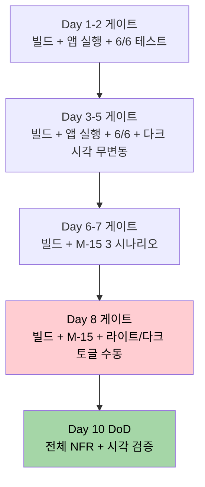

# M-16-A 디자인 시스템 — 실행 계획

> **한 줄 요약**: PRD 의 21단계 FR 을 **5개 day-bucket × commit 분리 × 회귀 검증 시점** 으로 풀어 낸 실행 계획. 3 critical 실명 버그 (C7/C8/C9) 가 Day 8 에 집중되며, 진입 전 Day 1-2 의 Themes/ 신설 commit 1개가 빌드 안전성의 base.

---

## Executive Summary

| 관점 | 내용 |
|------|------|
| **Problem** | PRD 가 정의한 20개 결함 (C1-C13 + #11 + F1, F2, F5-F8) 을 흩어진 상태로 두면 M-16-B/D 가 retroactive rework 누적. 특히 C7/C8/C9 실명 버그가 라이트 모드 사용자 100% 영향. |
| **Solution** | PRD 의 FR-01 ~ FR-15 를 **5 day-bucket** (Day 1-2 안전 / Day 3-5 XAML 치환 / Day 6-7 C# 치환 / Day 8 실명 버그 fix / Day 9-10 접근성+검증) 으로 분리. 각 FR 단위 commit + 매 bucket 끝 회귀 검증 (build 0 warning + 단위 테스트 6/6 + M-15 측정 시나리오 3 PASS). |
| **Function/UX Effect** | 각 commit 이 독립적으로 revertable, 매 day-bucket 끝마다 빌드/테스트가 통과되는 안전 상태. Day 8 commit 직후 PC 복귀 사용자가 라이트 모드 시각 검증으로 가치 즉시 확인 가능. |
| **Core Value** | **"M-16 시리즈 5개 마일스톤이 충돌 없이 쌓이는 base"** 라는 PRD 의 본질을 **"매 day-bucket 끝마다 안전 복귀 가능한 commit chain"** 으로 실행 보증. |

---

## 1. Overview

### 1.1 Purpose

PRD (`docs/00-pm/m16-a-design-system.prd.md`) 가 정의한 M-16-A 디자인 시스템 의 **실행 일정 + commit 분리 + 회귀 검증 시점** 을 구체화. PRD 가 "무엇/왜" 라면 Plan 은 "언제/어떻게".

### 1.2 Background

- 2026-04-28 UI 완성도 감사 (`docs/00-research/2026-04-28-ui-completeness-audit.md`) → 39결함 발굴, M-16 시리즈 5마일스톤 분리
- M-15 Stage A archived (2026-04-27, 97% Match Rate) → 측정 인프라 확보
- M-16-A 가 base — M-16-B/C/D 모두 의존
- C7/C8/C9 = 코드 read 만으로 100% 확정된 실명 버그 (라이트 모드 사용자 100% 영향)

### 1.3 Related Documents

- **PRD**: `docs/00-pm/m16-a-design-system.prd.md` (8 섹션, 4-perspective Executive Summary, 21단계 FR, 7 리스크)
- **UI 감사**: `docs/00-research/2026-04-28-ui-completeness-audit.md` (39결함 발굴 근거)
- **마일스톤 stub**: `C:\Users\Solit\obsidian\note\Projects\GhostWin\Milestones\m16-a-design-system.md`
- **WPF Shell 아키텍처**: `C:\Users\Solit\obsidian\note\Projects\GhostWin\Architecture\wpf-shell.md`
- **CLAUDE.md**: 프로젝트 규칙 (`CLAUDE.md` + `.claude/rules/*.md`)

---

## 2. Scope

### 2.1 In Scope (PRD FR-01 ~ FR-15)

- [ ] **FR-01** `src/GhostWin.App/Themes/Colors.Dark.xaml` + `Colors.Light.xaml` 신설 (~40 키)
- [ ] **FR-02** `Themes/Spacing.xaml` 신설 (XS/SM/MD/LG/XL = 4/8/16/24/32 **Thickness 토큰, Margin/Padding 전용** — P2-3 fix)
- [ ] **FR-03** `Themes/FocusVisuals.xaml` 신설 (FocusVisualStyle, 다크/라이트 양 모드 가시)
- [ ] **FR-04** `App.xaml` MergedDictionaries 등록 + startup 사용자 설정 즉시 적용 (C13 frame 깜박임 fix)
- [ ] **FR-05** XAML 8개 파일 hex 직접 사용 → DynamicResource 치환 (C1, C2, C3, C12)
- [ ] **FR-06** C# 3개 파일 SolidColorBrush 상수 → FindResource + INotifyPropertyChanged (C4, C5, C6)
- [ ] **FR-07** MainWindowViewModel.ApplyThemeColors 22줄 → MergedDictionaries.Swap 5줄 (C10)
- [ ] **FR-08** Light branch AccentColor / CloseHover / SidebarHover Opacity 정확 정의 — **실명 버그 fix** (C7, C8)
- [ ] **FR-09** engine `RenderSetClearColor(uint rgb)` 테마 전환 콜백 추가 — **실명 버그 fix** (C9, **호출 위치 Design 결정 — P2-2**)
- [ ] **FR-10** DynamicResource/StaticResource 혼재 통일 (C11)
- [ ] **FR-11** 핵심 폼 (Settings, Sidebar) TabIndex 명시 (F1)
- [ ] **FR-12** 인터랙티브 요소 AutomationProperties.Name 보강 (F5)
- [ ] **FR-13** Focusable=False 24건 재검토 (E2E vs UX 차단 구분, F6)
- [ ] **FR-14** Cursor 다양화 — IBeam/Wait/Help/SizeWE (F7)
- [ ] **FR-15** hover 효과 일관성 grep 정리 (F8)

### 2.2 Out of Scope

| 항목 | 어디로 |
|------|--------|
| Mica 백드롭 / FluentWindow 교체 / GridSplitter / GridLengthAnimation | M-16-B 윈도우 셸 |
| ContextMenu 4영역 / Workspace DragDrop | M-16-D cmux UX 패리티 |
| 분할 경계선 dim overlay / 스크롤바 시스템 / 최대화 잔여 padding | M-16-C 터미널 렌더 |
| PaneContainer visual tree 재구축 측정 | M-16-E (선택) |
| i18n 한국어 UI | 별도 마일스톤 후보 |
| **Width/Height/MaxWidth/FontSize/RowDef/ColDef 매직 넘버 토큰화** (Spacing 매직 넘버 #11 의 일부) | **별도 mini-milestone 후보 (`m16-a-spacing-extra`) — P2-3 fix** |

---

## 3. Requirements

### 3.1 Functional Requirements (PRD FR 인용)

| ID | 요약 | 흡수 결함 | 우선순위 | 추정 |
|----|------|-----------|:-------:|:----:|
| FR-01 | Themes/Colors.Dark.xaml + Colors.Light.xaml 신설 (~40 키) | C* base | 🔴 필수 | 1d |
| FR-02 | Themes/Spacing.xaml 신설 (**Margin/Padding 전용 Thickness 토큰** — Width/Height/FontSize/RowDef/ColDef 는 M-A out-of-scope, P2-3 fix) | #11 부분 | 🔴 필수 | 0.5d |
| FR-03 | Themes/FocusVisuals.xaml 신설 | F2 | 🔴 필수 | 0.5d |
| FR-04 | App.xaml MergedDictionaries 등록 + startup 적용 | C13 | 🔴 필수 | 0.5d |
| FR-05 | XAML 8개 hex → DynamicResource | C1, C2, C3, C12 | 🔴 필수 | 1.5d |
| FR-06 | C# 3개 SolidColorBrush 상수 → FindResource | C4, C5, C6 | 🔴 필수 | 1d |
| FR-07 | ApplyThemeColors → MergedDictionaries.Swap | C10 | 🔴 필수 | 0.5d |
| FR-08 | Light branch AccentColor/CloseHover/SidebarHover fix | **C7, C8** | 🔴 필수 | 0.5d |
| FR-09 | engine **`RenderSetClearColor(uint rgb)`** 테마 전환 콜백 (호출 위치는 Design 결정 — App.xaml.cs SettingsChangedMessage 확장 vs MainWindow.xaml.cs theme event vs ViewModel 의존성 신규, P2-2) | **C9** | 🔴 필수 | 0.5d |
| FR-10 | DynamicResource/StaticResource 통일 | C11 | 🟠 권장 | 0.5d |
| FR-11 | Settings/Sidebar TabIndex 명시 | F1 | 🟠 권장 | 1d |
| FR-12 | AutomationProperties.Name 보강 | F5 | 🟠 권장 | 0.5d |
| FR-13 | Focusable=False 재검토 | F6 | 🟠 권장 | 0.5d |
| FR-14 | Cursor 다양화 | F7 | 🟡 선택 | 0.5d |
| FR-15 | hover 일관성 정리 | F8 | 🟡 선택 | 0.5d |

**총합**: 9-10 작업일 (1.5-2주). FR-14/15 는 시간 부족 시 별도 mini-milestone 으로 분리 가능 (필수 아님).

### 3.2 Non-Functional Requirements

> **검증 명령 정책 (P1 fix)**: `tests/GhostWin.Engine.Tests` 는 **`.vcxproj` (C++)** 이므로 `dotnet test` 대상 아님. C# 테스트는 별도 `.csproj` 들로 분리되어 있고, 앱 실행은 `scripts/run_wpf.ps1` (`build_wpf.ps1` 부재). 모든 명령은 워크트리에서 실제 동작 확인 후 명시.

| 카테고리 | 기준 | 측정 방법 (실제 명령) | 검증 시점 |
|---------|------|----------|----------|
| **빌드 품질** | 0 warning (Debug + Release) | `msbuild GhostWin.sln /p:Configuration=Debug /p:Platform=x64 /m` | 매 commit |
| **C# 단위 테스트** | 회귀 0 (Core/App 양쪽 PASS) | `dotnet test tests/GhostWin.Core.Tests/GhostWin.Core.Tests.csproj` + `dotnet test tests/GhostWin.App.Tests/GhostWin.App.Tests.csproj` | 매 day-bucket 끝 |
| **C++ 단위 테스트** | 회귀 0 (`GhostWin.Engine.Tests.vcxproj`) | `msbuild tests/GhostWin.Engine.Tests/GhostWin.Engine.Tests.vcxproj /p:Configuration=Debug /p:Platform=x64` 후 `vstest.console.exe` 또는 VS Test Explorer 실행 | Day 7 + Day 10 |
| **앱 실행 sanity** | XAML 파싱/리소스 로딩 정상, 기동 후 정상 종료 | `scripts/run_wpf.ps1` (또는 `scripts/run_wpf_diag.ps1` 진단 모드) | FR-04, FR-05 commit 직후 |
| **렌더 성능 회귀 0** | M-15 Stage A 시나리오 3건 (idle/resize-4pane/load) PASS | `scripts/measure_render_baseline.ps1` | Day 7 + Day 8 + Day 10 |
| **테마 전환 응답** | < 100ms (체감 instant) | 수동 측정 (Settings 토글 후 시각 확인) | Day 8 후 |
| **E2E 회귀 0** | UIA AutomationId 보존 (기존 시나리오 PASS) | `dotnet test tests/GhostWin.E2E.Tests/GhostWin.E2E.Tests.csproj` + M-15 측정 자동 회귀 | Day 7 + Day 10 |
| **라이트 모드 시각** | C7/C8/C9 시각 검증 통과 | PC 복귀 후 시각 검사 | Day 10 |

---

## 4. Success Criteria

### 4.1 Definition of Done

- [ ] FR-01 ~ FR-09 (필수 9개) 모두 구현 완료 + 각 commit 빌드 통과
- [ ] FR-10 ~ FR-13 (권장 4개) 구현 완료
- [ ] FR-14 ~ FR-15 (선택 2개) 구현 완료 또는 별도 mini-milestone 으로 분리 결정
- [ ] hex 직접 사용 위치 0건 (`grep '#[0-9A-Fa-f]\{6\}' src/GhostWin.App/`)
- [ ] `new SolidColorBrush(` 인라인 상수 0건 (C# 코드)
- [ ] 라이트 모드 시각 검증 통과 (C7/C8/C9, PC 복귀 시)
- [ ] 다크 UI Tab 포커스 outline 명확히 보임 (F2)
- [ ] Tab 키만으로 Settings 폼 결정적 순회 (F1)
- [ ] `/pdca analyze m16-a-design-system` Match Rate ≥ 90%

### 4.2 Quality Criteria

- [ ] 빌드 0 warning (Debug + Release) — `msbuild GhostWin.sln /p:Configuration=Debug /p:Platform=x64 /m`
- [ ] C# 테스트 회귀 0 — `dotnet test` 가 `Core.Tests` + `App.Tests` 양쪽에서 PASS
- [ ] C++ 테스트 회귀 0 — `GhostWin.Engine.Tests.vcxproj` 빌드 + 실행 PASS
- [ ] M-15 측정 시나리오 3건 PASS (성능 회귀 0) — `scripts/measure_render_baseline.ps1`
- [ ] 모든 commit 메시지가 `.claude/rules/commit.md` 규칙 준수 (영문, type prefix, AI 언급 무)
- [ ] 모든 commit 이 독립적으로 revertable (혼합 변경 없음)

---

## 5. Risks & Mitigation

PRD 7개 리스크 + Plan 추가 리스크 2개:

| # | 리스크 | 심각도 | 가능성 | 완화 | 발생 시점 |
|:-:|-------|:-----:|:------:|------|----------|
| **R1** | wpfui ApplicationThemeManager.Apply ↔ 자체 dictionary swap 이중 적용 race | 🔴 high | 🟠 medium | C10 작업 시 책임 정리 — wpfui 키만 wpfui 가, GhostWin 키는 자체 swap 단일화 | FR-07 (Day 6-7) |
| **R2** | XAML 8 + C# 3 동시 변경 — diff 큼 | 🟠 medium | 🔴 high | FR 단위 commit 분리, 매 commit 빌드 통과 확인 | FR-05~07 (Day 3-7) |
| **R3** | engine ClearColor 갱신 시 child HWND 재초기화 부작용 검증 부족 | 🟠 medium | 🟠 medium | 기존 startup 1회 코드 (`MainWindow.xaml.cs:277`) 와 동일 API 만 호출, M-15 시나리오 3건 회귀 검증 | FR-09 (Day 8) |
| **R4** | TabIndex 명시 → E2E 테스트 의존 (`E2E_TerminalHost`) 깰 가능성 | 🟠 medium | 🟢 low | M-15 idle/resize-4pane/load 3 시나리오 회귀 검증 (Day 7 + Day 10) | FR-11 (Day 9-10) |
| **R5** | INotifyPropertyChanged 갱신 누락 → 일부 ViewModel brush 가 테마 전환에 반응 안 함 | 🟠 medium | 🟠 medium | FR-06 작업 시 모든 brush property 에 OnPropertyChanged 명시, Day 8 직후 라이트/다크 토글 수동 검증 | FR-06 (Day 6-7) |
| **R6** | 라이트 모드 시각 검증을 PC 복귀 전까지 못 함 | 🟢 low | 🔴 certainty | 코드 read + Color hex 값 사전 계산으로 90% 사전 확정. Step 21 시각 검증 분리 (Day 10) | Day 10 |
| **R7** | Focusable=False 재검토 시 E2E vs UX 의도 코드만으로 구분 어려움 | 🟢 low | 🟠 medium | 각 위치에 PR 주석 — `// E2E: keep` vs `// UX: remove` | FR-13 (Day 9-10) |
| **R8 (Plan 추가)** | DynamicResource 키 누락 시 런타임 XAML exception (앱 크래시 가능) | 🟡 medium | 🟢 low | FR-05 commit 직후 앱 실행 (`scripts/build_wpf.ps1` 후 launch 1회) — XAML 파싱 단계에서 즉시 발견 | FR-05 (Day 3-5) |
| **R9 (Plan 추가)** | git submodule (ghostty fork) 사이드 변경 충돌 | 🟢 low | 🟢 low | Plan 기간 동안 `external/ghostty` 서브모듈 변경 금지 (M-A 는 WPF 만 변경) | 전체 |

---

## 6. Architecture Considerations (WPF 특화)

### 6.1 Project Level Selection

| Level | Characteristics | 적합성 | Selected |
|-------|-----------------|--------|:--------:|
| Starter | 단순 구조 (`components/`, `lib/`, `types/`) | ✗ Web 전용 | ☐ |
| Dynamic | Feature-based + BaaS | ✗ Web 전용 | ☐ |
| **Enterprise** | **Strict layer separation, DI, 4-project structure** | **✓ GhostWin (WPF + DX11 + ConPTY + Engine API)** | **✅** |

> rkit 의 Starter/Dynamic/Enterprise 분류는 web 중심. GhostWin 은 4-project structure (`GhostWin.App` / `GhostWin.Engine` / `engine-api` / `external/ghostty`) 로 Enterprise 특성에 가깝지만 web stack 이 아님. M-A 는 그 중 `GhostWin.App` (WPF presentation) 만 건드린다.

### 6.2 Key Architectural Decisions (M-A 한정)

| Decision | Options | Selected | Rationale |
|----------|---------|----------|-----------|
| 테마 전환 패턴 | (a) ApplicationThemeManager 단독 / (b) ResourceDictionary swap / (c) ViewModel SetBrush 22줄 | **(b) ResourceDictionary swap** | wpfui 키와 GhostWin 키 책임 분리, 22줄 → 5줄 (PRD R1 완화) |
| Color 정의 위치 | (a) 단일 Colors.xaml + Boolean Converter / (b) Dark.xaml + Light.xaml 2개 | **(b) 2개 dict swap** | 키 누락 검출 용이, MergedDictionaries 표준 패턴 |
| Spacing 토큰 타입 (P2-3 fix) | (a) Thickness 단일 / (b) Thickness + double 분리 / (c) Margin/Padding 전용 Thickness, Width/Height/FontSize 는 M-A out-of-scope | **(c) Margin/Padding 전용 Thickness, 나머지는 별도 mini-milestone** | XAML 매직 넘버는 Margin/Padding (Thickness) 외에도 Width/Height/MaxWidth/FontSize/RowDef/ColDef 가 다양한 타입으로 혼재. M-A 가 Thickness 단일 토큰만 도입하면 일괄 치환 불가, 4종 타입 토큰을 모두 설계하면 마일스톤 범위 폭증. 가장 안전한 선택은 `Spacing.XS~XL` Thickness 만 정립하고, 나머지 매직 넘버 (Width/Height/FontSize/RowDef/ColDef) 는 별도 mini-milestone (`m16-a-spacing-extra` 후보) 으로 분리 |
| Focus Visual 접근법 | (a) FrameworkElement.FocusVisualStyle 개별 / (b) ResourceDictionary 의 Style.TargetType=Control 전역 | **(b) 전역** | 모든 Control 자동 적용, 누락 위험 감소 |
| ViewModel brush 갱신 | (a) FindResource 1회 + 캐시 / (b) FindResource + INotifyPropertyChanged 매번 | **(b) INotifyPropertyChanged** | 테마 전환 시 자동 재바인딩 (PRD R5 완화) |
| Spacing 토큰 마이그레이션 | (a) 일괄 치환 (FR-02 commit 안에) / (b) 점진 — XAML 작업 시마다 | **(a) 일괄, 단 Margin/Padding 전용** | M-A 의 base 가치 — 절반만 토큰 적용된 상태 회피. P2-3 결정 적용으로 일괄 범위가 Margin/Padding 으로 좁혀짐 |
| **C9 engine ClearColor 콜백 경로 (P2-2)** | (a) `MainWindowViewModel` 에 `IEngineService` 의존성 신규 추가 / (b) `App.xaml.cs` 의 `SettingsChangedMessage` 핸들러에 `_engine.RenderSetClearColor(...)` 추가 (font metric 갱신과 동일 패턴) / (c) `MainWindow.xaml.cs` 의 theme change event 처리에서 호출 | **Design 단계 결정 보류** | `MainWindowViewModel(...)` 생성자가 현재 `IEngineService` 받지 않음 (확인됨), API 이름은 `SetClearColor` 가 아니라 `RenderSetClearColor(uint rgb)` (확인됨). 이미 `App.xaml.cs:74` → `SettingsChangedMessage` 발송, `MainWindowViewModel.cs:115` register 패턴 존재. ViewModel 책임 비대화 vs App 책임 집중 vs MainWindow code-behind 의 결정이 큰 아키텍처 영향이라 Design 에서 결정. **Plan 은 옵션 3개만 제시** |

### 6.3 영향 받는 파일 (실제 워크트리 검증 — P2-1 fix)

> **검증 (2026-04-28)**: `Views/` 폴더 자체가 존재하지 않음. `CommandPaletteWindow.xaml` 과 `MainWindow.xaml` 은 `src/GhostWin.App/` 루트에, `NotificationPanelControl.xaml` / `PaneContainerControl.cs` / `SettingsPageControl.xaml` 은 모두 `Controls/` 아래에 위치.

```
src/GhostWin.App/
├── App.xaml                                      [FR-04: MergedDictionaries 등록]
├── App.xaml.cs                                   [FR-04: startup theme 적용 순서, FR-09 후보 (P2-2)]
├── CommandPaletteWindow.xaml                     [FR-05: hex 9건] ← 루트 (Views/ 가 아님)
├── CommandPaletteWindow.xaml.cs                  [FR-05 부수]
├── MainWindow.xaml                               [FR-05: hex 5건]
├── MainWindow.xaml.cs                            [FR-09 후보 (P2-2): engine ClearColor 콜백 위치]
├── ViewModels/
│   ├── MainWindowViewModel.cs                    [FR-07/08: ApplyThemeColors swap + Light fix, FR-09 후보 (P2-2)]
│   ├── WorkspaceItemViewModel.cs                 [FR-06: Apple 색 4상수 → FindResource]
│   └── (SettingsPageViewModel, TerminalTabViewModel — 영향 없음 가능성 높음, FR-12 시 확인)
├── Controls/                                     ← Views/ 가 아님 (P2-1 fix)
│   ├── NotificationPanelControl.xaml             [FR-05: 자체 ResourceDict 제거]
│   ├── NotificationPanelControl.xaml.cs          [FR-05 부수]
│   ├── PaneContainerControl.cs                   [FR-06: SolidColorBrush 상수 3건]
│   ├── SettingsPageControl.xaml                  [FR-05: hex 3건]
│   ├── SettingsPageControl.xaml.cs               [FR-05 부수]
│   └── TerminalHostControl.cs                    [FR-13 검토 후보 (Focusable=False E2E vs UX 구분)]
├── Converters/
│   ├── ActiveIndicatorBrushConverter.cs          [FR-06: SolidColorBrush 상수 1건]
│   └── InverseBoolToVisibilityConverter.cs       [영향 없음]
└── Themes/                                       [FR-01~03: 신설 (현재 미존재 — 충돌 없음)]
    ├── Colors.Dark.xaml
    ├── Colors.Light.xaml
    ├── Spacing.xaml
    └── FocusVisuals.xaml
```

> **변경 없는 영역**: `engine-api/ghostwin_engine.cpp` 는 native side 변경 없음 (FR-09 는 기존 `IEngineService.RenderSetClearColor(uint rgb)` API 호출 추가만, Design 에서 어디서 호출할지 결정).

---

## 7. Convention Prerequisites

### 7.1 기존 프로젝트 규약 확인

- [x] `CLAUDE.md` — 프로젝트 규칙 정의됨
- [x] `.claude/rules/behavior.md` — 우회 금지, 빌드 실패 대응
- [x] `.claude/rules/commit.md` — 영문 type-prefix, AI 언급 무
- [x] `.claude/rules/documentation.md` — 한국어 + 다이어그램 + 비교표
- [x] `.claude/rules/build-environment.md` — VS18 Insiders + msbuild
- [ ] WPF 명명 규약 — XAML element x:Key 패턴 (M-A 가 정립)
- [ ] Spacing 토큰 명명 — `Spacing.XS/SM/MD/LG/XL` (M-A 가 정립)

### 7.2 M-A 가 정립할 신규 규약

| 카테고리 | 규약 | 예 |
|---------|------|------|
| **ResourceDictionary x:Key** | `<Group>.<Variant>.<Modifier>` 도트 구분 | `Sidebar.Hover.Background`, `Accent.Primary.Brush` |
| **Spacing 토큰** | XS=4, SM=8, MD=16, LG=24, XL=32 (Thickness) | `<Setter Property="Padding" Value="{StaticResource Spacing.MD}"/>` |
| **DynamicResource vs StaticResource** | 테마 영향 색 = DynamicResource, 정적 layout = StaticResource | Brush → Dynamic, Spacing → Static |
| **AutomationProperties.Name** | 모든 인터랙티브 요소 (Button/MenuItem/ListBoxItem) 에 한국어 또는 영어 명시 | `AutomationProperties.Name="새 워크스페이스"` |
| **TabIndex 명시** | 폼 안에서만 명시 (Sidebar, Settings). 무명시 = Tab 순회 제외 의도가 아님 | `TabIndex="1"` |

### 7.3 환경 변수

M-A 는 신규 환경 변수 없음. 기존 변수 (`GHOSTWIN_TERMINAL_OPT_*`, `GHOSTWIN_DEBUG_*`) 영향 없음.

### 7.4 Pipeline Integration

GhostWin 은 9-phase Development Pipeline (web 중심) 미적용. PDCA 사이클 (PM → Plan → Design → Do → Check → Report → Archive) 만 사용.

---

## 8. 실행 계획 (Day-by-Day, Plan 의 핵심 차별화)

### 8.1 5 Day-Bucket 분할

```mermaid
graph LR
    subgraph day12["Day 1-2 — 안전 base 구축"]
        D1["FR-01 Themes/Colors.Dark.xaml + Light.xaml"]
        D2["FR-02 Spacing.xaml"]
        D3["FR-03 FocusVisuals.xaml"]
        D4["FR-04 App.xaml MergedDictionaries"]
    end

    subgraph day35["Day 3-5 — XAML 치환"]
        D5["FR-05 XAML 8개 hex → DynamicResource"]
    end

    subgraph day67["Day 6-7 — C# 치환"]
        D6["FR-06 SolidColorBrush 상수 제거"]
        D7["FR-07 ApplyThemeColors → swap"]
    end

    subgraph day8["Day 8 — 실명 버그 fix (가치 핵심)"]
        D8["FR-08 C7, C8 Light branch fix"]
        D9["FR-09 C9 engine ClearColor 콜백"]
        DCHECK1["회귀 검증 1차 — M-15 시나리오 3건"]
    end

    subgraph day910["Day 9-10 — 접근성 + 시각 검증"]
        D10["FR-10~13 통일 + 접근성 (TabIndex/AutomationProperties)"]
        D11["FR-14, 15 cursor + hover (선택)"]
        D12["Step 21 라이트 모드 시각 검증 (PC 복귀)"]
        DCHECK2["회귀 검증 2차"]
    end

    day12 --> day35 --> day67 --> day8 --> day910

    style day8 fill:#FFCDD2,color:#000
    style day12 fill:#A5D6A7,color:#000
    style day35 fill:#90CAF9,color:#000
    style day67 fill:#FFE082,color:#000
    style day910 fill:#E1BEE7,color:#000
```



### 8.2 Day-by-Day 일정

#### Day 1 — Themes 폴더 신설 + Color 정의 (FR-01)

- [ ] `src/GhostWin.App/Themes/` 디렉터리 생성
- [ ] `Colors.Dark.xaml` 작성 — ~40 키 (Color + SolidColorBrush, x:Key 명명 규약 준수)
- [ ] `Colors.Light.xaml` 작성 — 동일 키, 라이트 톤 값 (C7/C8 사전 계산: SidebarHover Opacity=0.04, AccentColor=#0091FF, CloseHover=#FFE5E5 등)
- [ ] **commit**: `feat: add Themes/Colors.Dark.xaml and Colors.Light.xaml`
- [ ] 빌드 확인: `msbuild GhostWin.sln /p:Configuration=Debug /p:Platform=x64 /m`

#### Day 2 — Spacing + FocusVisuals + App.xaml (FR-02, 03, 04)

- [ ] `Themes/Spacing.xaml` 작성 — `Spacing.XS=4, SM=8, MD=16, LG=24, XL=32` **Thickness 토큰 (Margin/Padding 전용, P2-3)**
- [ ] `Themes/FocusVisuals.xaml` 작성 — Style.TargetType=Control 전역 FocusVisualStyle (다크/라이트 양 모드 가시)
- [ ] `App.xaml` MergedDictionaries 등록 (3개 추가)
- [ ] `App.xaml.cs` startup 시 사용자 설정에서 즉시 dark/light 결정 (C13 frame 깜박임 fix)
- [ ] **commit 3개**:
  - `feat: add Themes/Spacing.xaml margin padding tokens`
  - `feat: add Themes/FocusVisuals.xaml global style`
  - `feat: register Themes MergedDictionaries in App.xaml`
- [ ] 빌드 + 앱 실행 확인: `msbuild GhostWin.sln ... /m` → `scripts/run_wpf.ps1` (frame 깜박임 시각 검증)

**Day 1-2 회귀 게이트**:
- `msbuild GhostWin.sln /p:Configuration=Debug /p:Platform=x64 /m` 0 warning
- `scripts/run_wpf.ps1` 정상 기동 + 정상 종료
- `dotnet test tests/GhostWin.Core.Tests/GhostWin.Core.Tests.csproj` PASS
- `dotnet test tests/GhostWin.App.Tests/GhostWin.App.Tests.csproj` PASS

#### Day 3-4 — XAML hex → DynamicResource (FR-05 절반)

> **실제 파일 위치 (P2-1 검증)**: `CommandPaletteWindow.xaml` 은 `src/GhostWin.App/` 루트, 나머지는 `src/GhostWin.App/Controls/`.

- [ ] `src/GhostWin.App/CommandPaletteWindow.xaml` hex 9건 → DynamicResource (C1)
- [ ] `src/GhostWin.App/Controls/NotificationPanelControl.xaml` 자체 ResourceDict 제거, 통합 키 (C2)
- [ ] `src/GhostWin.App/MainWindow.xaml` inline hex 5건 → DynamicResource (C3)
- [ ] **commit 3개** (파일별 분리)
- [ ] 매 commit 후 빌드 (`msbuild ... /m`) + 앱 실행 (`scripts/run_wpf.ps1`) — XAML 파싱 에러 즉시 발견 (R8 완화)

#### Day 5 — XAML hex → DynamicResource (FR-05 후반) + Margin/Padding 일괄 치환

- [ ] `src/GhostWin.App/Controls/SettingsPageControl.xaml` hex 직접 → DynamicResource (C12)
- [ ] **모든 XAML 의 Margin/Padding 매직 넘버 → `Spacing.*` Thickness 토큰 일괄 치환** (FR-02 base 활용, #11 부분 흡수, **P2-3**)
- [ ] **Width/Height/MaxWidth/FontSize/RowDefinition Height/ColumnDefinition Width 매직 넘버는 그대로 둠** (M-A out-of-scope, `m16-a-spacing-extra` 후보)
- [ ] **commit 2개**:
  - `refactor: settings page hex to dynamic resource`
  - `refactor: margin padding to spacing tokens`
- [ ] 빌드 확인

**Day 3-5 회귀 게이트**:
- `msbuild GhostWin.sln /p:Configuration=Debug /p:Platform=x64 /m` 0 warning
- `scripts/run_wpf.ps1` 정상 기동 + 정상 종료
- `dotnet test` (Core + App) PASS
- 다크 모드 시각 변동 없음 (수동)

#### Day 6-7 — C# SolidColorBrush 상수 제거 + Swap 패턴 (FR-06, 07)

- [ ] `src/GhostWin.App/Controls/PaneContainerControl.cs` SolidColorBrush 상수 3건 → `Application.Current.FindResource` (C4)
- [ ] `src/GhostWin.App/ViewModels/WorkspaceItemViewModel.cs` Apple 색 4상수 → ResourceDict 키 + INotifyPropertyChanged (C5, R5 완화)
- [ ] `src/GhostWin.App/Converters/ActiveIndicatorBrushConverter.cs` SolidColorBrush 상수 → ResourceDict (C6)
- [ ] `src/GhostWin.App/ViewModels/MainWindowViewModel.cs` `ApplyThemeColors` 22줄 → MergedDictionaries.Swap 5줄 (C10, R1 완화)
- [ ] **commit 4개**
- [ ] **회귀 검증 1차**:
  - `scripts/measure_render_baseline.ps1` (M-15 시나리오 3건 자동 실행, R4 완화)
  - `msbuild tests/GhostWin.Engine.Tests/GhostWin.Engine.Tests.vcxproj /p:Configuration=Debug /p:Platform=x64` + vstest.console 실행 (C++ 회귀)
  - `dotnet test tests/GhostWin.E2E.Tests/GhostWin.E2E.Tests.csproj` (E2E 회귀)

**Day 6-7 회귀 게이트**:
- `msbuild GhostWin.sln /p:Configuration=Debug /p:Platform=x64 /m` 0 warning
- M-15 측정 시나리오 3 PASS
- C# (Core + App + E2E) + C++ (Engine.Tests.vcxproj) 회귀 0

#### Day 8 — 실명 버그 fix (M-A 가치 핵심)

- [ ] FR-08: Light branch AccentColor / CloseHover / SidebarHover Opacity 정확 정의 (C7, C8)
  - SidebarHover Opacity 0.04 (라이트 톤 회색)
  - AccentColor #0091FF (라이트 모드 강조 파란색)
  - CloseHover #FFE5E5 (라이트 모드 close 호버 붉은톤)
- [ ] FR-09: engine `RenderSetClearColor(uint rgb)` 테마 전환 콜백 추가 (C9, **호출 위치는 Design 결정 — P2-2**)
  - 결정 옵션 (Plan 6.2 표 참고):
    (a) `MainWindowViewModel` 에 `IEngineService` 의존성 신규 추가 후 theme event 처리에서 호출
    (b) `App.xaml.cs` 의 `SettingsChangedMessage` 핸들러 확장 — 이미 font metric 갱신 패턴 존재 (line 74)
    (c) `MainWindow.xaml.cs` 의 theme change event 처리에서 호출 — 기존 startup 1회 코드 (`:277`) 와 동일 위치
  - API: `_engine.RenderSetClearColor(uint rgb)` (이름 정정 — `SetClearColor` 아님, P2-2)
- [ ] **commit 2개**:
  - `fix: light theme accent and sidebar hover colors (C7 C8)`
  - `fix: engine clear color follows theme switch (C9)`
- [ ] **회귀 검증**: `scripts/measure_render_baseline.ps1` (M-15 시나리오 3건) + 라이트/다크 토글 수동 검증 (테마 전환 < 100ms)

**Day 8 회귀 게이트**:
- `msbuild GhostWin.sln /p:Configuration=Debug /p:Platform=x64 /m` 0 warning
- M-15 측정 시나리오 3 PASS
- 라이트 모드 SidebarHover / AccentColor / ClearColor 사전 계산 값 일치 (코드 read 검증)

#### Day 9 — 접근성 보강 (FR-10, 11, 12, 13)

- [ ] FR-10: DynamicResource/StaticResource 통일 (C11) — grep `StaticResource` 으로 brush 참조만 골라 Dynamic 으로 변경
- [ ] FR-11: TabIndex 명시 (Settings, Sidebar 핵심 폼) — F1
- [ ] FR-12: AutomationProperties.Name 보강 (모든 Button/MenuItem/ListBoxItem) — F5
- [ ] FR-13: Focusable=False 24건 재검토, `// E2E: keep` vs `// UX: remove` 주석 (R7 완화) — F6
- [ ] **commit 4개**

#### Day 10 — 선택 항목 + 시각 검증

- [ ] FR-14: Cursor 다양화 — IBeam/Wait/Help/SizeWE (시간 부족 시 별도 mini-milestone 으로 분리)
- [ ] FR-15: hover 효과 일관성 grep 정리 (시간 부족 시 별도 mini-milestone)
- [ ] **Step 21 라이트 모드 시각 검증** (PC 복귀 — 5개 NFR 시각 체크리스트 수행, 라이트 SidebarHover 검정 박스 사라짐 / Light close 라이트 톤 / Light 강조색 라이트 톤 / Light 터미널 background 라이트 톤 / 다크 Tab 포커스 outline 명확)
- [ ] **회귀 검증 2차**:
  - `scripts/measure_render_baseline.ps1` (M-15 시나리오 3건)
  - `dotnet test` (Core + App + E2E 3개 csproj)
  - C++ Engine.Tests vstest.console 실행
- [ ] **commit**: `chore: m16-a milestone complete + visual verification`

**Day 10 회귀 게이트 (DoD)**: 모든 NFR PASS + 4.1 DoD 체크리스트 완료

### 8.3 Commit 분리 전략 (R2 완화)

| 원칙 | 예시 |
|------|------|
| 1 commit = 1 FR (가능 시) | `feat: add Themes/Spacing.xaml tokens` |
| 1 FR 내 여러 파일 = 파일별 분리 | FR-05 → CommandPalette / NotificationPanel / MainWindow / Settings 4 commit |
| 회귀 검증 commit 분리 | `test: m15 baseline regression check after fr-08` |
| 실명 버그 fix = 별도 commit | `fix: light theme accent and sidebar hover colors (C7 C8)` |
| 빌드 실패 시 새 commit 으로 fix | `--amend` 금지 (`.claude/rules/commit.md` 준수) |

추정 commit 수: **18-22 commit** (Day 1: 1, Day 2: 3, Day 3-5: 5-6, Day 6-7: 4, Day 8: 2, Day 9: 4, Day 10: 1-2)

### 8.4 회귀 검증 시점



### 8.5 진입 가능 조건 (Pre-Day-1 체크)

- [x] PRD 작성 완료 (`docs/00-pm/m16-a-design-system.prd.md`)
- [x] M-15 Stage A archived
- [x] UI 완성도 감사 완료
- [x] Themes 폴더 미존재 (충돌 없음 — `ls src/GhostWin.App/Themes/` 미존재 확인)
- [ ] PC hardware 시각 검증 (Day 10 만 필요, Day 1-9 는 모바일/원격 진행 가능)

---

## 9. Next Steps

### 9.1 즉시 다음 단계

```bash
/pdca design m16-a-design-system
```

→ Design 문서 (`docs/02-design/features/m16-a-design-system.design.md`) 가 본 Plan 의 21단계 FR 을 **모듈/클래스/메서드 시그니처 + ResourceDictionary x:Key 표 + 테마 전환 시퀀스 다이어그램** 으로 구체화합니다.

### 9.2 Design 단계에서 확정할 것

- ResourceDictionary 키 ~40개 정확한 명명 + Color hex 값 (Dark/Light 양쪽)
- Spacing.* 토큰 5개 정확한 Thickness 값 (**Margin/Padding 전용**, P2-3)
- FocusVisualStyle 의 Border thickness/color (다크/라이트 가시 검증)
- `MainWindowViewModel.ApplyThemeColors` 새 시그니처 (5줄 swap)
- **engine `RenderSetClearColor(uint rgb)` 콜백 호출 위치 결정 (P2-2)** — Plan 6.2 표의 옵션 (a)/(b)/(c) 중 선택. 결정 기준: ViewModel 책임 비대화 vs App 책임 집중 vs MainWindow code-behind 적합성. 추천 출발점은 (b) `App.xaml.cs SettingsChangedMessage` 확장 (이미 font metric 갱신 동일 패턴 존재) — 그러나 Design 에서 이 결정을 명시 문서화
- ViewModel brush property 의 INotifyPropertyChanged 패턴
- **(별도 mini-milestone 후보)** `m16-a-spacing-extra` — Width/Height/MaxWidth/FontSize/RowDef/ColDef 매직 넘버 토큰화 설계 (M-A out-of-scope, P2-3)

### 9.3 Do 단계 진입 후 Plan 변경 트리거

다음 발견 시 본 Plan 갱신:
- FR-05 작업 중 hex 인 줄 알았던 것이 ARGB literal (32-bit) 발견 → 키 매핑 재정의 필요
- FR-09 engine ClearColor 콜백이 native 에서 thread 격리 필요 발견 → R3 완화 강화
- M-15 시나리오 회귀 발생 → 즉시 commit revert + Plan 의 day-bucket 재배치

---

## Version History

| Version | Date | Changes | Author |
|---------|------|---------|--------|
| 0.1 | 2026-04-28 | Initial draft (PRD 자동 참조 + 21 FR 의 5 day-bucket 분할 + commit 분리 + 회귀 검증 시점) | 노수장 |
| 0.2 | 2026-04-28 | 사용자 리뷰 P1/P2 4건 fix — (P1) 회귀 게이트 명령 정정 — `tests/GhostWin.Engine.Tests` 가 `.vcxproj` (C++) 임을 반영, C# 테스트는 `Core.Tests` + `App.Tests` + `E2E.Tests` 분리, `scripts/build_wpf.ps1` 부재로 `scripts/run_wpf.ps1` 로 교체. (P2-1) 영향 파일 트리를 실제 워크트리 (`Views/` 부재, `Controls/` + 일부 루트) 로 정정. (P2-2) FR-09 의 engine API 이름 `SetClearColor` → `RenderSetClearColor(uint rgb)` 정정, 콜백 호출 위치 (ViewModel 의존성 추가 vs `App.xaml.cs SettingsChangedMessage` 확장 vs `MainWindow.xaml.cs` theme event) 결정을 Design 으로 보류, 6.2 결정 표에 옵션 명시. (P2-3) Spacing 토큰을 Thickness (Margin/Padding 전용) 만 도입하고 Width/Height/FontSize/RowDef/ColDef 매직 넘버는 별도 mini-milestone (`m16-a-spacing-extra` 후보) 로 분리, Day 5 작업 범위 좁힘. | 노수장 |
