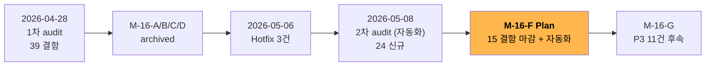
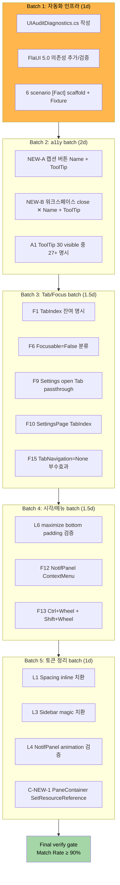

# M-16-F UI 체감 마감 — Plan

> **요약 한 줄**: 2026-05-08 자동화 audit 의 24 결함 중 P1 1건 + P2 14건 = **15건 단일 사이클 마감**. xunit + FlaUI 5.0 자동화 인프라 (`UIAuditDiagnostics.cs`) 첫 정착 사이클. i18n / 다국어 / RTL 은 영어 단일 운영 결정 (2026-05-09) 으로 명시 Out of Scope.
>
> **Project**: GhostWin Terminal
> **Branch**: `feature/wpf-migration`
> **Author**: solitasroh
> **Date**: 2026-05-09
> **Status**: Plan ready

---

## Executive Summary

| 관점 | 한 줄 요약 |
|---|---|
| **Problem** | M-16-A/B/C/D + Hotfix closure 후 잔여 UI 결함 15건 (P1 1 + P2 14). 핵심: ToolTip 6%만 명시 / 캡션 버튼 a11y Name 누락 / 워크스페이스 close ✕ Name 누락 / Tab edge case / 최대화 하단 잘림 시각 검증 |
| **Solution** | 5 묶음 batch 로 6 일 implementation. 자동화 인프라 (xunit + FlaUI 5.0) 우선 도입 → a11y batch → Tab/Focus batch → 시각/메뉴 batch → 토큰 정리 batch. 각 batch 끝에 verify gate. **i18n / 다국어 / RTL 은 영어 단일 운영 결정으로 Out of Scope** |
| **Function / UX 효과** | 모든 visible button ToolTip 명시률 ≥ 90% / a11y Name ≥ 95% / Tab navigation chrome 순환 정확 / 최대화 시 잘림 0px / NotifPanel 우클릭 메뉴 / Ctrl+Wheel 줌 + Shift+Wheel 스크롤백 |
| **Core Value** | cmux 감성 도달 — UI 완성도 임계 통과. 사용자 시각 결함 청산 + 자동화 검증 인프라 정착 (이후 사이클 PC 의존 제거) |

---

## 1. 배경

### 1.1 출발점

이번 사이클은 두 가지 의의를 가짐:

1. **cmux 감성 도달의 마지막 한 걸음** — M-16-A/B/C/D 에서 디자인 시스템 / 윈도우 셸 / 터미널 렌더 / cmux UX 패리티가 closed. 남은 marginal UI 결함 청산 시 비전 ① "cmux 기능 탑재" 완성.
2. **자동화 검증 인프라 첫 정착** — `tests/GhostWin.Automation.Core/` (5d51e4a commit, scaffold 완료) 위에 `UIAuditDiagnostics.cs` 도입. 이전까지 사용자 PC 직접 검증에 의존하던 시각/Tab/UIA 결함을 사이클 내부에서 자동 측정.

### 1.2 결함 list 출처

- 원본 audit: `docs/00-research/2026-05-08-ui-completeness-audit.md` (4 Explore agent 병렬 + UIA tree dump 30 element + xunit/FlaUI 6 시나리오)
- PRD: `docs/00-pm/m16-f-ui-completion.prd.md`
- 정정 사항: A2 false positive (SettingsPage 17건 모두 Name 명시 confirmed) → closed. A5 i18n 은 2026-05-09 영어 단일 운영 결정으로 P3 후속 이관.

### 1.3 비전 정렬

| 비전 축 | 기여 |
|---|---|
| ① cmux 기능 탑재 | a11y Name + ToolTip + ContextMenu 우클릭 + Mouse wheel 단축키 — cmux 감성 도달 |
| ② AI 에이전트 멀티플렉서 | 직접 영향 없음 (Phase 6 완결) |
| ③ 성능 우수 | 직접 영향 없음 (M-14/15 완결). 단, render thread safety 회귀 0 가 NFR |

---

## 2. Scope

### 2.1 In Scope (15 결함)

#### P1 (1건) — 사용자 시각 critical

| # | 결함 | 출처 위치 (audit verbatim) |
|:-:|---|---|
| **L6** | cell-snap residual padding (최대화 하단 잘림) | `engine-api/ghostwin_engine.cpp:1167-1176` (코드 확정 / PC 시각 pending) |

#### P2 (14건) — UX 체감 / a11y

| # | 결함 | 출처 위치 (audit verbatim) |
|:-:|---|---|
| **A1** | ToolTip 명시 6% (30 visible 중 2건) | `MainWindow.xaml` 전체 + `SettingsPageControl.xaml` |
| **NEW-A** | 캡션 버튼 (Min/Max/Close) UIA Name 누락 | `MainWindow.xaml` 캡션 row (uia-tree-full.tsv:14,15,16) |
| **NEW-B** | 워크스페이스 close ✕ Name + HelpText 누락 | `MainWindow.xaml` ListBoxItem (uia-tree-full.tsv:27) |
| **F1** | TabIndex 명시 잔여 검증 | grep, 잔여 영역 (Sidebar 3 + Settings 17 closed, 그 외 partial) |
| **F6** | Focusable=False 21건 — 사용자 차단 검증 | grep |
| **F9** | Tab passthrough Settings 열린 상태 edge case | `MainWindow.xaml.cs:1350` |
| **F10** | SettingsPageControl TabIndex 명시 누락 | `MainWindow.xaml.cs:532-536` |
| **F12** | NotifPanel ContextMenu 미정의 | `MainWindow.xaml:490-493` (NotificationPanel 영역 — audit doc 인용. 정확한 line 은 Design 단계 grep 재확정) |
| **F13** | Mouse wheel 줌 (Ctrl+Wheel) / 스크롤백 (Shift+Wheel) 미구현 | 전역 |
| **F15** | KeyboardNavigation.TabNavigation=None 부수효과 미검증 | `MainWindow.xaml:518` (audit doc 인용) |
| **L1** | Spacing 토큰 정의 후 inline `Margin="12,0"` 등 잔존 | `MainWindow.xaml:206, 295, 328` |
| **L3** | Sidebar item `Margin="4,1"` / `Padding="8,6"` magic 잔존 | `MainWindow.xaml:121-122` (실제 grep: 146-149 — Design 단계 verify) |
| **L4** | NotificationPanelWidth GridLengthAnimationCustom 적용 검증 | `MainWindow.xaml:286` + `ViewModels:125-128` |
| **C-NEW-1** | PaneContainerControl `Color.FromRgb` 하드코드 — Light theme 미반영 | `PaneContainerControl.cs:379, 404, 456` (확인: 396, 421 splitter Background — Design 단계 line 재확정) |

> Note: 일부 file:line 은 audit doc 작성 후 코드 변경으로 ±10 line 이동 가능. Design phase 에서 grep 재확정 후 fix 진입.

### 2.2 Out of Scope

| 항목 | 사유 |
|---|---|
| **A5 i18n / 다국어** | **2026-05-09 영어 단일 운영 결정**. resx / culture 옵션 / 한국어 string / cmux 17 언어 parity 모두 미추진. 사용자 다양화 시점에 별도 사이클 (M-16-I) 로 재논의 |
| **A6 FlowDirection RTL** | 영어 단일 운영이라 RTL 우선순위 후순위 |
| **A7 HighContrast / SystemColors fallback** | 후순위 |
| **A8 CommandPalette Open/Close 애니메이션** | P3, M-16-G 후속 |
| P3 11건 (L2 / L5 / NEW-C / C-NEW-2 / F11 / F14 / A3 / A4 / A6 / A7 / A8) | M-16-G 후속 사이클로 분리 |
| 새 컨트롤 / 새 기능 추가 | 결함 fix 사이클 — 신규 기능 금지 |
| ghostty 서브모듈 변경 | 이번 사이클은 WPF Shell + engine-api 만. ghostty fork branch 무수정 |

---

## 3. Requirements

### 3.1 Functional Requirements

15 결함 = 15 FR. 각 FR 는 결함 ID 와 1:1 매핑.

| ID | 결함 | 요구 동작 | 검증 방법 | 우선순위 |
|---|---|---|---|:-:|
| **FR-01** | L6 | 윈도우 최대화 시 터미널 cell grid 가 viewport 내 사방 균등 padding (top/bottom/left/right) 분배. 하단 잘림 0px | xunit + FlaUI: `ShowWindow(SW_MAXIMIZE)` → `PrintWindow` capture → bottom row pixel = terminal background `#1E1E2E` (Dark) | High (P1) |
| **FR-02** | A1 | main window 13 buttons + settings 17 controls = 30 visible 중 ≥ 27 (90%) 에 ToolTip 명시 | UIA `HelpText` non-empty count / 30 ≥ 0.90 | High |
| **FR-03** | NEW-A | 캡션 버튼 Minimize / MaxRestore / Close 모두 `AutomationProperties.Name` + `ToolTip` 명시 | UIA dump line 14/15/16 (uia-tree-full.tsv) 의 Name + HelpText non-empty | High |
| **FR-04** | NEW-B | 워크스페이스 close ✕ button `AutomationProperties.Name="Close workspace [WorkspaceName]"` + ToolTip 명시 | UIA dump line 27 의 Name + HelpText non-empty | High |
| **FR-05** | F1 | 명시 안 된 잔여 컨트롤 (chrome 캡션 + NotifPanel + main grid) 의 TabIndex 명시 | grep `TabIndex=` count + xunit/FlaUI Tab focus chain assert | Medium |
| **FR-06** | F6 | Focusable=False 21 항목 분류: ① E2E zero-size hooks (의도) ② 사용자 차단 (수정 대상) — 후자 0건 | grep + audit comment review | Medium |
| **FR-07** | F9 | Settings panel 열린 상태에서 Tab 시 chrome ring (Sidebar / NewWorkspace / SettingsButton) 으로 빠져나가지 않고 Settings 내부 순환 | xunit + FlaUI sequential Tab → focused element list assert | High |
| **FR-08** | F10 | SettingsPageControl 컨테이너 + 17 interactive control 의 TabIndex 명시. PaneContainer 로 Tab 누출 0 | grep + xunit/FlaUI assert | High |
| **FR-09** | F12 | NotificationPanelControl 우클릭 시 ContextMenu (Mark all read / Clear all / Settings) 표시 | xunit + FlaUI right-click → UIA Menu / MenuItem ≥ 1 | Medium |
| **FR-10** | F13 | Ctrl+Wheel 시 폰트 크기 ±1pt (min 8 / max 32). Shift+Wheel 시 scrollback ±3 line | xunit + FlaUI `Mouse.Scroll` + UIA setting font-size assert | Medium |
| **FR-11** | F15 | `KeyboardNavigation.TabNavigation="None"` 영역 (`MainWindow.xaml:518` 인근) 의 Tab 흐름 부수효과 — chrome ring Tab 시 Pane 진입 0 | xunit + FlaUI Tab focus chain | Medium |
| **FR-12** | L1 | inline `Margin="12,0"` / `Padding=...` 잔존 → Spacing 토큰 (`{StaticResource Spacing.MD}` 등) 으로 치환. 잔존 0건 | grep `Margin=\"\d` count | Medium |
| **FR-13** | L3 | Sidebar `ListBoxItem` Margin/Padding magic → Spacing 토큰 치환 | grep | Low |
| **FR-14** | L4 | NotifPanel toggle 시 200ms `GridLengthAnimationCustom` `CubicEase` 적용. 즉시 snap 금지 | xunit + FlaUI `Width` 시간별 sample 또는 사용자 시각 검증 | Medium |
| **FR-15** | C-NEW-1 | `PaneContainerControl.cs` 의 `Color.FromRgb(0x3A,0x3A,0x3C)` + `(0x00,0x91,0xFF)` 하드코드 → `SetResourceReference(BackgroundProperty, "Splitter.Brush")` 패턴 (memory `feedback_setresourcereference_for_imperative_brush.md`) | grep `Color.FromRgb` count = 0 + Light theme 시각 확인 | Medium |

> FR-09 / FR-10 / FR-14 의 자동화 검증은 PowerShell 한계 (audit doc §자동화 한계 분석) 로 인해 **xunit + FlaUI 5.0 만 사용**. PowerShell SendKeys / mouse_event / Graphics.CopyFromScreen 사용 금지.

### 3.2 Non-Functional Requirements

| 카테고리 | 기준 | 측정 방법 |
|---|---|---|
| 자동화 인프라 | `UIAuditDiagnostics.cs` 작성 — 6+ scenario sequential `[Fact]` (PowerShell 한계 우회) | xunit `dotnet test tests/GhostWin.Automation.Core.Tests/` 통과 |
| 빌드 경고 | Debug + Release 모두 0 warning | `msbuild GhostWin.sln /p:Configuration=Debug` + Release 양쪽 |
| Render thread safety 회귀 | M-14 baseline 회귀 0 | `tests/render_state_test.cpp` 통과 + M-15 idle p95 비교 (2026-04 baseline) |
| Match Rate | gap-detector ≥ 90% | `/pdca analyze` |
| ghostty 서브모듈 | 변경 0 commit | `git status external/ghostty` clean |
| FlaUI 의존성 | `tests/GhostWin.Automation.Core.Tests/GhostWin.Automation.Core.Tests.csproj` 에 FlaUI 5.0 + xunit 추가 (이미 존재 시 검증) | csproj `PackageReference` |

---

## 4. Success Criteria

### 4.1 Definition of Done

- [ ] 15 FR (FR-01 ~ FR-15) 전부 closed (코드 fix + verify gate 통과)
- [ ] `UIAuditDiagnostics.cs` 6+ scenario [Fact] 작성 + 통과
- [ ] `msbuild GhostWin.sln /p:Configuration=Debug /p:Platform=x64` 0 warning
- [ ] `msbuild GhostWin.sln /p:Configuration=Release /p:Platform=x64` 0 warning
- [ ] `dotnet test tests/GhostWin.Core.Tests/`, `dotnet test tests/GhostWin.App.Tests/`, `dotnet test tests/GhostWin.Automation.Core.Tests/` 통과
- [ ] M-14 render-state-test 통과 + M-15 idle p95 회귀 ≤ 5%
- [ ] `git status external/ghostty` clean
- [ ] 사용자 시각 검증 — 6 시나리오 (PRD §3) 모두 OK 보고

### 4.2 Quality Criteria

| 지표 | 측정 | 목표 |
|---|---|---|
| visible button ToolTip 비율 | UIA HelpText non-empty / 30 visible | ≥ 90% |
| a11y Name 비율 | UIA Name non-empty / total interactive | ≥ 95% |
| 최대화 bottom 픽셀 | FlaUI PrintWindow + GDI sample | terminal background `#1E1E2E` (Dark) |
| Tab focus chain | FlaUI sequential Tab → focused element list | 명시 anchor → ⚙ → ListBox → cycle (Settings 열린 상태에서도 chrome ring 유지) |
| ContextMenu 일관성 | NotifPanel 우클릭 → UIA Menu/MenuItem | ≥ 1 menu item |
| Match Rate | gap-detector | ≥ 90% |

---

## 5. Risks and Mitigation

| 위험 | 영향 | 가능성 | 대응 |
|---|:-:|:-:|---|
| **추측 fix 사이클 (4번 잘못된 fix 의 교훈)** | High | Medium | `feedback_exhaustive_search_before_fix.md` 룰 적용 — 결함별 root cause 확정 후 fix. 도메인 전수 grep + Read 우선. agent 1건 추측만으로 fix 직행 금지. **Plan 단계에서 명기한 file:line 도 Design phase grep 재확정 후 진입** |
| **자동화 한계 (PowerShell SendKeys / Graphics.CopyFromScreen / mouse_event)** | High | High | xunit + FlaUI 5.0 만 사용. PowerShell 자동화 시도 금지. UIAuditDiagnostics.cs 가 single source |
| **테마 결함 (C-NEW-1) — render thread 영향** | Medium | Low | M-14 render-state-test + M-15 idle p95 비교. SetResourceReference 패턴 (`feedback_setresourcereference_for_imperative_brush.md`) 으로 imperative brush 안전 적용 |
| **L6 시각 검증 (Graphics.CopyFromScreen 가상 모니터 boundary 실패)** | Medium | Medium | FlaUI Element.Capture() 또는 `PrintWindow` Win32 API 사용 (audit doc §자동화 한계 분석 참고) |
| **FlaUI Keyboard.Press / Mouse.Click 0x80131505 timeout** | High | Medium | 사이클 시작 시 별도 spike: HwndHost child window UIA tree refresh 차단 우회 (UIA event listener + `SystemSetForegroundWindow` 등). 1d budget |
| **빌드 경고 회귀** | Low | Low | `feedback_no_warnings.md` 룰 — 0 warning 유지 |
| **ghostty 서브모듈 변경 의도치 않은 commit** | Low | Low | NFR 검사: `git status external/ghostty` clean |

---

## 6. Architecture Considerations

### 6.1 Project Level

| Level | 특성 | Selected |
|---|---|:-:|
| Starter | 단순 web 프론트 | ☐ |
| Dynamic | BaaS 통합 | ☐ |
| **Enterprise** | **Clean Architecture, DI, native interop** | **☑** |

GhostWin 은 4-project Clean Architecture (`GhostWin.App` / `GhostWin.Core` / `GhostWin.Interop` / `GhostWin.Services` / `GhostWin.Engine` C++) 가 이미 정착된 Enterprise level. 이번 사이클은 새 layer 추가 없음.

### 6.2 핵심 아키텍처 결정 (Plan 단계)

| 결정 | 옵션 | 선택 | 근거 |
|---|---|---|---|
| **자동화 인프라 위치** | (a) `tests/GhostWin.Automation.Core/UIAuditDiagnostics.cs` (재사용 라이브러리) / (b) `tests/GhostWin.Automation.Core.Tests/UIAuditDiagnosticsTests.cs` (테스트 [Fact] 만) / (c) 신규 `tests/GhostWin.UIAudit/` 프로젝트 | **(a) + (b) 분리** — Core 에 진단 헬퍼 (DumpUiaTree / SampleBottomRow / MeasureFocusChain) + Tests 에 [Fact] 6개 | scaffold 가 이미 (`AppLauncher.cs`, `AppSession.cs` 등) Core 라이브러리 + Tests 짝으로 구축됨 (5d51e4a). 동일 패턴 유지 |
| **FlaUI 의존성** | FlaUI 5.0 / FlaUI 4.x / Microsoft.WindowsAppSDK Automation | **FlaUI 5.0** | audit doc + memory `feedback_flaui_launch_workingdirectory.md` 패턴 검증됨. M-11.5 실증 |
| **xunit Collection** | E2E 기존 collection 합류 / 별도 collection / parallel | **별도 collection** (`[Collection("UIAudit")]`) | `feedback_xunit_collection_parallelism.md` 룰 — UI audit 은 단일 GhostWin 인스턴스 sequential 필요. E2E 와 분리 |
| **UIAuditDiagnostics scenario 구성** | 6 scenario 한 [Fact] sequential / scenario 당 [Fact] / parameterized [Theory] | **scenario 당 [Fact]** + 공유 Fixture (`IClassFixture<GhostWinAppFixture>`) | scenario 별 독립 실패 분석 가능. Fixture 가 1회 launch + 마지막에 dispose |
| **L6 픽셀 캡처 방식** | `Graphics.CopyFromScreen` / `PrintWindow` Win32 / FlaUI `Element.Capture()` | **FlaUI `Element.Capture()` 우선, 실패 시 `PrintWindow`** | audit doc 한계 분석 — 가상 모니터 boundary + 음수 좌표 회피 |
| **C-NEW-1 brush 적용 패턴** | imperative `(Brush)FindResource` / `SetResourceReference` / XAML 이전 | **`SetResourceReference`** | memory `feedback_setresourcereference_for_imperative_brush.md` — M-16-A Day 7 실증 |

### 6.3 영향받는 파일 (예상 — Design phase 에서 verify)

| 파일 | 수정 영역 | 관련 FR |
|---|---|---|
| `src/GhostWin.App/MainWindow.xaml` | 캡션 버튼 + workspace close ✕ + ToolTip + TabIndex + Spacing 토큰 치환 | FR-02, FR-03, FR-04, FR-05, FR-12, FR-13, FR-14, FR-15 |
| `src/GhostWin.App/MainWindow.xaml.cs` | F9 / F10 / F11 Tab passthrough + Ctrl+Wheel 핸들러 | FR-07, FR-08, FR-10, FR-11 |
| `src/GhostWin.App/Controls/SettingsPageControl.xaml` | TabIndex 명시 + ToolTip 일부 | FR-02, FR-08 |
| `src/GhostWin.App/Controls/NotificationPanelControl.xaml` | ContextMenu (Mark all read / Clear all / Settings) | FR-09 |
| `src/GhostWin.App/Controls/PaneContainerControl.cs` | `Color.FromRgb` 3건 → `SetResourceReference` | FR-15 |
| `src/GhostWin.App/Controls/TerminalHostControl.cs` | Ctrl+Wheel 폰트 / Shift+Wheel scrollback (또는 ViewModel command) | FR-10 |
| `src/GhostWin.App/ViewModels/*.cs` | (필요 시) Light theme 동기화 + WindowTitle ToolTip 등 | FR-02, FR-15 |
| `src/GhostWin.App/Themes/Spacing.xaml` | (검증) inline 잔존 token 화 시 추가 토큰 정의 가능성 | FR-12, FR-13 |
| `engine-api/ghostwin_engine.cpp:1167-1176` | cell-snap residual padding 사방 균등 분배 (이미 코드 들어옴 — 시각 검증만 pending) | FR-01 |
| `tests/GhostWin.Automation.Core/UIAuditDiagnostics.cs` (신규) | 진단 헬퍼 (UIA dump / pixel sample / focus chain) | NFR |
| `tests/GhostWin.Automation.Core.Tests/UIAuditDiagnosticsTests.cs` (신규) | 6+ [Fact] scenario | NFR |
| `tests/GhostWin.Automation.Core.Tests/GhostWin.Automation.Core.Tests.csproj` | FlaUI 5.0 + xunit PackageReference 추가/검증 | NFR |

> **`engine-api/ghostwin_engine.cpp:1167-1176`** 는 PRD/audit verbatim 인용 — 실제 line 은 Design phase grep 으로 재확정. `external/ghostty` 서브모듈은 무수정.

---

## 7. Convention Prerequisites

### 7.1 기존 컨벤션

- ✅ `CLAUDE.md` (프로젝트 컨벤션 + 빌드)
- ✅ `.claude/rules/{behavior, commit, documentation, build-environment}.md`
- ✅ `docs/adr/` 13건 + 1 (M-15 추가)
- ✅ `external/ghostty/` fork branch ghostwin-patches/v1 pinned (`4f658b4ad`)
- ✅ M-16-A 디자인 시스템 토큰 (`Themes/Spacing.xaml`, `Themes/Colors.*.xaml`)

### 7.2 이번 사이클 신규 / 검증 컨벤션

| 카테고리 | 현재 | 정의/검증 | 우선순위 |
|---|---|---|:-:|
| **i18n / 다국어** | 영어 단일 운영 결정 (2026-05-09) | **resx / culture / 한국어 string 도입 금지**. `WPF` `xml:lang` 변경 금지. `FlowDirection` 변경 금지 | High |
| **a11y Name 명명 규칙** | partial — Settings / Sidebar 명시, 캡션 / workspace ✕ 누락 | Verb + Noun (영어, sentence case). 예: `"Minimize window"`, `"Maximize window"`, `"Close window"`, `"Close workspace [Name]"` | High |
| **ToolTip pattern** | 일부 정적 / 일부 binding 혼재 | (a) Static text: `ToolTip="Settings (Ctrl+,)"` (b) Workspace 등 동적: `ToolTip="{Binding ..., StringFormat=Close workspace {0}}"`. 단축키 있으면 ToolTip 끝에 `(Ctrl+...)` 표기 | High |
| **Spacing 토큰 적용** | partial — 토큰 정의 ✓, inline `Margin/Padding` 잔존 | inline 숫자 모두 `{StaticResource Spacing.SM/MD/LG}` 치환. magic 0건 목표 | Medium |
| **Imperative Brush 적용** | `(Brush)FindResource` 와 `SetResourceReference` 혼재 | 모든 imperative WPF brush = `SetResourceReference` (memory `feedback_setresourcereference_for_imperative_brush.md`) | Medium |
| **TabIndex 명시 규칙** | partial | chrome ring 영역 (Sidebar / NewWorkspace / SettingsButton / Min / Max / Close) 명시 + Settings 내부 별도 TabIndex 권장 | Medium |

### 7.3 환경 변수 / 외부 의존성

| 변수 / 의존성 | 목적 | 신규? |
|---|---|:-:|
| `FlaUI` 5.0 NuGet | UI Automation 자동화 | 검증 (이미 일부 프로젝트 존재 시) |
| `xunit` | 테스트 러너 | 기존 |
| `xunit.runner.visualstudio` | VS test runner | 기존 |
| WPF 영어 hardcode 유지 | i18n Out of Scope 결정 | (변경 없음) |

### 7.4 Pipeline Integration

이번 사이클은 9-phase pipeline 의 Phase 6 (UI Integration) + Phase 8 (Review) 영역. PDCA cycle 로 진행:

| Phase | 산출물 | 다음 명령 |
|---|---|---|
| ✅ Plan (이 문서) | `docs/01-plan/features/m16-f-ui-completion.plan.md` | — |
| 🟡 Design | `docs/02-design/features/m16-f-ui-completion.design.md` (5 batch 별 fix pattern + UIAuditDiagnostics API spec) | `/pdca design m16-f-ui-completion` |
| 🟡 Do | 코드 fix 5 batch + UIAuditDiagnostics.cs 작성 + 빌드 0 warning | `/pdca do m16-f-ui-completion` |
| 🟡 Analyze (Check) | gap-detector + 자동화 결과 비교 | `/pdca analyze m16-f-ui-completion` |
| 🟡 Iterate | Match Rate 90% 까지 | `/pdca iterate m16-f-ui-completion` |
| 🟡 Report | `docs/04-report/features/m16-f-ui-completion.report.md` | `/pdca report m16-f-ui-completion` |

---

## 8. Pipeline / WBS

### 8.1 5 Batch 구성

### 8.2 Batch 별 상세

#### Batch 1 — 자동화 인프라 (1 일)

- 작업: `UIAuditDiagnostics.cs` (Core 라이브러리) + 6 scenario `[Fact]` (Tests) + FlaUI 5.0 의존성
- API 초안 (Design 단계에서 확정):
  - `Task<UiaTreeSnapshot> DumpUiaTreeAsync(AutomationElement root)`
  - `int CountToolTipNonEmpty(IEnumerable<AutomationElement> visibleButtons)`
  - `Color SamplePixel(AutomationElement element, int xRel, int yRel)` (FlaUI Capture)
  - `IReadOnlyList<AutomationElement> MeasureTabFocusChain(int steps)`
  - `bool RightClickAndDetectMenu(AutomationElement target)`
- Verify gate: 6 scenario 중 ≥ 4 PASS (실패 항목은 결함 confirmation 으로 활용)

#### Batch 2 — a11y batch (2 일)

- FR-02, FR-03, FR-04
- 작업:
  - 캡션 Min/Max/Close 3 버튼에 `AutomationProperties.Name` + `ToolTip` 추가
  - 워크스페이스 close ✕ button 에 동적 `Name` + `ToolTip` 추가 (StringFormat binding)
  - main 13 + settings 17 = 30 visible 중 27+ 에 ToolTip 추가
- Verify gate: scenario A (Initial UIA dump) HelpText ≥ 90%, Name ≥ 95%

#### Batch 3 — Tab/Focus batch (1.5 일)

- FR-05, FR-06, FR-07, FR-08, FR-11
- 작업:
  - 잔여 영역 (chrome / NotifPanel) `TabIndex=` 명시
  - Focusable=False 21건 분류 — E2E 의도 분리
  - SettingsPage 열린 상태에서 Tab 시 chrome ring 진입 0 (passthrough 차단)
  - SettingsPageControl 컨테이너 TabIndex 명시
  - `TabNavigation=None` 부수효과 검증 + 필요 시 `Cycle` / `Continue` 변경
- Verify gate: scenario C (Tab focus chain) 12 step PASS

#### Batch 4 — 시각/메뉴 batch (1.5 일)

- FR-01, FR-09, FR-10
- 작업:
  - L6 — 최대화 시 cell-snap residual padding 사방 균등 분배 (이미 engine-api 코드 들어옴 — 시각 검증 + 픽셀 측정만)
  - NotifPanelControl 우클릭 ContextMenu (Mark all read / Clear all / Settings)
  - Ctrl+Wheel 폰트 ±1pt + Shift+Wheel scrollback ±3 line
- Verify gate: scenario E (NotifPanel ContextMenu) + scenario F (Maximize bottom pixel) PASS

#### Batch 5 — 토큰 정리 batch (1 일)

- FR-12, FR-13, FR-14, FR-15
- 작업:
  - inline `Margin="\d+,\d+"` / `Padding="\d+,\d+"` 잔존 → Spacing 토큰
  - SidebarItemStyle `Margin="4,1"` / `Padding="8,6"` 토큰화
  - NotifPanel `GridLengthAnimationCustom` 200ms `CubicEase` 적용 시각 검증
  - PaneContainerControl `Color.FromRgb` 3건 → `SetResourceReference("Splitter.Brush")` 등
- Verify gate: M-14 render-state-test PASS + M-15 idle p95 회귀 ≤ 5% + grep `Color.FromRgb` count = 0

#### Final verify (0.5 일)

- gap-detector Match Rate ≥ 90%
- 사용자 시각 검증 (PRD §3 6 시나리오) PASS

### 8.3 일정 합계

| Phase | 기간 | 누적 |
|---|---|---|
| Plan (이 문서) | 0.5d | 0.5d |
| Design | 1d | 1.5d |
| Do (Batch 1~5) | 7d | 8.5d |
| Analyze | 1d | 9.5d |
| Iterate | 0.5-1d | 10-10.5d |
| Report | 0.5d | 10.5-11d |

→ **총 1.5-2주**, PRD §7 일정과 일치.

### 8.4 Before / After 비교

| 항목 | Before (현재) | After (M-16-F closure) |
|---|---|---|
| ToolTip 비율 | 6% (30 중 2) | ≥ 90% (27+) |
| a11y Name 비율 | 77% (main 13 중 10) | ≥ 95% |
| 캡션 버튼 a11y | Name 없음 / HelpText 없음 | Name + ToolTip 명시 |
| 워크스페이스 close ✕ | Name 없음 / HelpText 없음 | "Close workspace [Name]" + ToolTip |
| 최대화 하단 잘림 | 미검증 (시각 결함 의심) | 0px (FlaUI PrintWindow 측정) |
| Tab focus chain | Settings 열린 상태 미검사 | chrome ring 순환 + Settings 내부 순환 |
| NotifPanel 우클릭 | 메뉴 없음 | 4 영역 ContextMenu 일관성 |
| Ctrl+Wheel / Shift+Wheel | 미구현 | 폰트 ±1pt + scrollback ±3 line |
| Spacing inline 잔존 | `Margin="12,0"`, `"4,1"` 등 | 0건 (모두 Spacing 토큰) |
| PaneContainer 색 하드코드 | `Color.FromRgb` 3건 | 0건 (SetResourceReference) |
| 자동화 검증 | PowerShell 부분 성공 / FlaUI timeout 미해결 | xunit + FlaUI 6 scenario PASS |
| i18n | 영어 hardcode (ad-hoc) | **영어 단일 운영 (정식 결정)** |

---

## 9. Next Steps

1. ✅ Plan 작성 (이 문서)
2. 🟡 `/pdca design m16-f-ui-completion` — 5 batch 별 fix pattern 상세 + UIAuditDiagnostics.cs API spec 확정 + file:line grep 재확정
3. 🟡 Design phase 에서 권장 section 구성:
   - §1 자동화 인프라 design (UIAuditDiagnostics.cs API + Fixture + scenario flow chart)
   - §2 Batch 2 (a11y) — 캡션 + workspace ✕ + ToolTip rules + 30 항목 list
   - §3 Batch 3 (Tab/Focus) — TabIndex 매핑 표 + Focusable=False 분류 + edge case state machine
   - §4 Batch 4 (시각/메뉴) — L6 픽셀 sample 좌표 + ContextMenu 구조 + Ctrl/Shift Wheel 핸들러 위치
   - §5 Batch 5 (토큰) — Spacing 토큰 매핑 표 + Color.FromRgb 3건 → SetResourceReference call site
4. 🟡 Do phase — Batch 순차 진행, 각 batch 끝에 verify gate
5. 🟡 Analyze / Iterate / Report

---

## Version History

| Version | Date | Changes | Author |
|---|---|---|---|
| 0.1 | 2026-05-09 | Initial draft (PRD 기반) | solitasroh |
