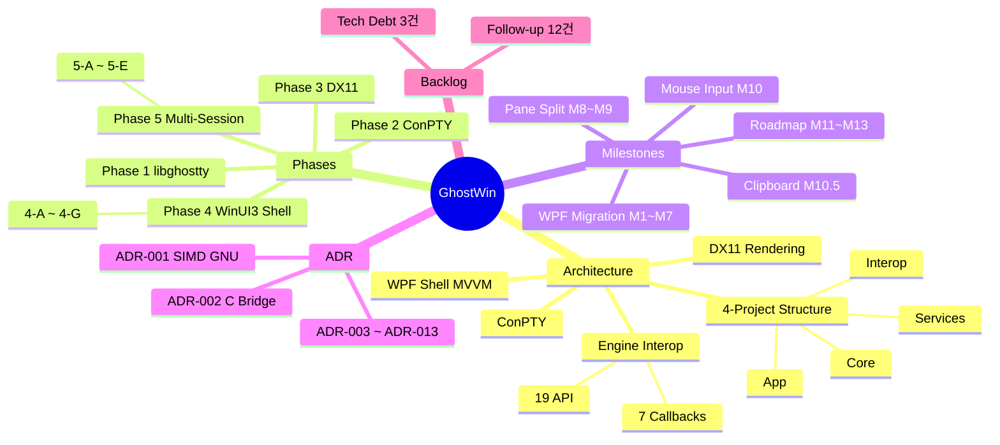
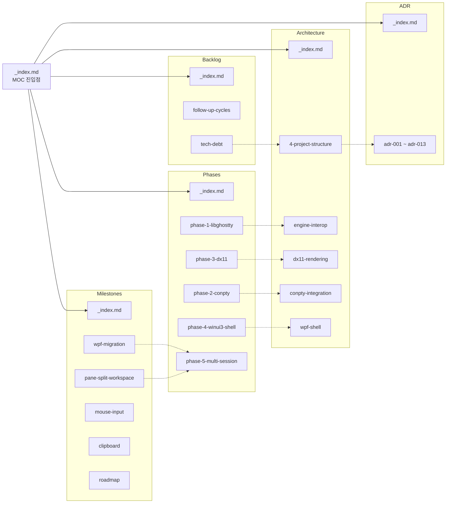
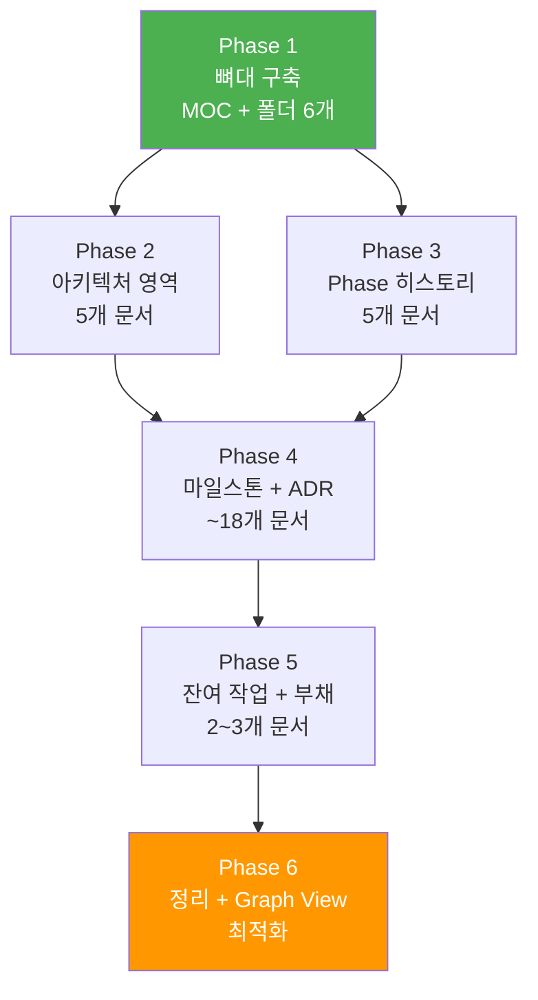
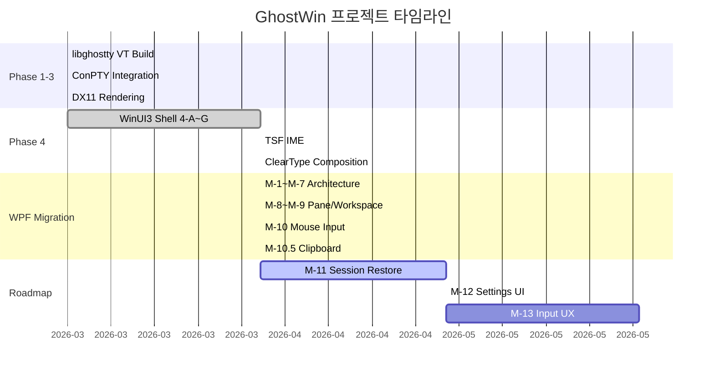
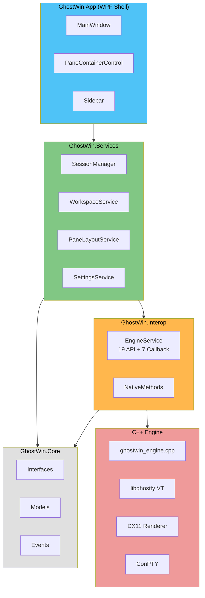

# Obsidian Project Map Plan -- GhostWin Knowledge Base

> **Summary**: GhostWin 프로젝트의 전체 아키텍처, Phase 히스토리, 마일스톤, 기술 결정(ADR), 잔여 작업을 Obsidian vault에 다중 문서 지식맵으로 구성하여, Graph View로 탐색 가능한 학습 자료를 만든다.
>
> **Project**: GhostWin Terminal
> **Feature**: obsidian-project-map
> **Date**: 2026-04-13
> **Status**: Draft
> **Vault Path**: `C:\Users\Solit\obsidian\note\Projects\GhostWin\`

---

## Executive Summary

| Perspective        | Content |
|--------------------|---------|
| **Problem**        | GhostWin은 13개 ADR, 5개 Phase, 13개 마일스톤, 12건 follow-up이 분산된 docs/ 폴더에 존재하며, 전체 그림을 한눈에 파악하기 어렵다. 새로운 세션마다 CLAUDE.md를 읽어야 맥락을 잡을 수 있다. |
| **Solution**       | Obsidian vault에 모듈화된 마크다운 문서들을 `[[wiki-link]]`로 연결하고, Graph View를 인터랙티브 마인드맵으로 활용한다. 6단계로 점진 구축한다. |
| **기능적 UX 효과** | 프로젝트의 어느 지점이든 클릭 2~3번으로 도달 가능. 노드 간 관계를 시각적으로 탐색하면서 프로젝트 전체 흐름을 학습할 수 있다. |
| **핵심 가치**      | "흩어진 문서 더미"에서 "탐색 가능한 지식 그래프"로 전환. 프로젝트 온보딩과 의사결정 추적이 자기 문서화된다. |

---

## 1. 범위와 목표

### 1.1 핵심 목표

1. GhostWin 프로젝트 전체를 **모듈화된 Obsidian 문서**로 구성
2. `[[wiki-link]]`로 문서 간 관계를 명시하여 **Graph View 마인드맵** 생성
3. MOC(Map of Content) 패턴으로 **계층적 탐색 구조** 제공
4. 각 문서는 **독립적으로 읽을 수 있되**, 링크로 맥락 확장 가능

### 1.2 성공 기준

| 지표 | 목표 | 측정 방법 |
|------|------|-----------|
| 문서 수 | 30~50개 모듈 | 파일 카운트 |
| 링크 밀도 | 문서당 평균 3~5개 `[[link]]` | Obsidian Graph View |
| 커버리지 | Phase 1~5, M-1~M-13, ADR 13건 전체 포함 | MOC 체크리스트 |
| 탐색 깊이 | MOC → 카테고리 → 상세 문서 (최대 3 depth) | 직접 탐색 |
| Graph View | 의미 있는 클러스터 5~6개 식별 가능 | 시각 확인 |

### 1.3 Out of Scope

- 기존 `docs/` 문서의 내용 복사/이동 (링크로 참조만)
- Obsidian 플러그인 커스텀 개발
- 자동 동기화 스크립트 (수동 업데이트)
- 코드 레벨 API 문서화 (소스 코드가 권위 출처)

---

## 2. Vault 구조 설계

### 2.1 전체 지식 그래프 구조



### 2.2 문서 간 연결 관계



### 2.3 폴더 구조

```
Projects/GhostWin/
├── _index.md                    # MOC 진입점 (전체 지도)
├── Architecture/
│   ├── _index.md                # 아키텍처 MOC
│   ├── 4-project-structure.md   # Clean Architecture 4-프로젝트
│   ├── engine-interop.md        # C++/C#  Interop 레이어
│   ├── dx11-rendering.md        # DX11 렌더링 파이프라인
│   ├── conpty-integration.md    # ConPTY 통합
│   └── wpf-shell.md             # WPF Shell + MVVM
├── Phases/
│   ├── _index.md                # Phase 히스토리 MOC
│   ├── phase-1-libghostty.md
│   ├── phase-2-conpty.md
│   ├── phase-3-dx11.md
│   ├── phase-4-winui3-shell.md  # 4-A~G 통합
│   └── phase-5-multi-session.md # 5-A~E 통합
├── Milestones/
│   ├── _index.md                # 마일스톤 MOC
│   ├── wpf-migration.md         # M-1~M-7 통합
│   ├── pane-split-workspace.md  # M-8~M-9
│   ├── mouse-input.md           # M-10
│   ├── clipboard.md             # M-10.5
│   └── roadmap.md               # M-11~M-13 미래
├── ADR/
│   ├── _index.md                # ADR 목록 MOC
│   ├── adr-001-simd-gnu.md
│   ├── adr-002-c-bridge.md
│   ├── ...                      # ADR 003~013
│   └── adr-013-embedded-shader.md
└── Backlog/
    ├── _index.md                # 잔여 작업 MOC
    ├── follow-up-cycles.md      # 12건 follow-up
    └── tech-debt.md             # 기술 부채
```

### 2.2 태그 체계

| 태그 | 용도 | 예시 |
|------|------|------|
| `#phase/1` ~ `#phase/5` | Phase 분류 | phase-3-dx11.md |
| `#milestone/M-1` ~ `#milestone/M-13` | 마일스톤 분류 | wpf-migration.md |
| `#status/done` `#status/pending` | 완료 상태 | 각 문서 frontmatter |
| `#arch/core` `#arch/interop` `#arch/services` `#arch/app` | 레이어 분류 | 아키텍처 문서 |
| `#adr` | ADR 표시 | ADR 문서들 |
| `#type/research` `#type/decision` `#type/guide` | 문서 유형 | 모든 문서 |

### 2.3 문서 템플릿

각 문서는 YAML frontmatter + 본문 구조:

```yaml
---
title: "문서 제목"
tags: [phase/3, status/done, arch/interop]
created: 2026-04-13
related: []
---
```

---

## 3. 구현 단계

### 3.1 단계별 흐름



> Phase 2와 Phase 3은 병렬 진행 가능

### Phase 1: 뼈대 구축 (MOC + 폴더)

- `_index.md` 메인 MOC 작성
- 5개 하위 폴더 + 각 `_index.md` MOC 작성
- 총 6개 파일, `[[link]]`로 상호 연결

### Phase 2: 아키텍처 영역

- 4-프로젝트 구조 (Core → Interop → Services → App)
- Engine Interop (19 API + 7 콜백)
- DX11 렌더링 파이프라인
- ConPTY 통합
- WPF Shell + MVVM
- 총 5개 파일 + MOC 업데이트

### Phase 3: Phase 히스토리

- Phase 1~5 각각 요약 문서 (archive 문서 참조 링크 포함)
- Match Rate, 핵심 결정, 교훈 요약
- 총 5개 파일 + MOC 업데이트

### Phase 4: 마일스톤 + ADR

- WPF 마일스톤 (M-1~M-7 통합, M-8~M-9, M-10, M-10.5)
- 로드맵 (M-11~M-13)
- ADR 13건 각각 요약 문서
- 총 ~18개 파일 + MOC 업데이트

### Phase 5: 잔여 작업 + 기술 부채

- Follow-up 12건 정리
- 기술 부채 3건
- 총 2~3개 파일 + MOC 업데이트

### Phase 6: 정리 + Graph View 최적화

- 태그 일관성 검증
- 링크 누락 보완
- Graph View에서 클러스터 확인 및 조정

---

## 4. 문서 작성 원칙

### 4.1 핵심 원칙

1. **요약 우선**: 각 문서는 핵심 내용을 2~3 문단으로 요약. 상세는 원본 docs/ 링크로
2. **독립 가독성**: 각 문서를 단독으로 읽어도 맥락 파악 가능
3. **링크 = 관계**: `[[문서명]]` 링크는 "이 문서와 관련 있음"을 의미
4. **현재 상태 반영**: 완료/진행중/대기 상태를 frontmatter `status` 태그로 명시
5. **원본 존중**: 기존 docs/ 내용을 복사하지 않고, 경로와 핵심만 기록

### 4.2 문서 크기 가이드

| 유형 | 목표 길이 | 설명 |
|------|:---------:|------|
| MOC (_index.md) | 30~60줄 | 링크 목록 + 간단 설명 |
| 요약 문서 | 50~100줄 | 핵심 정보 + 원본 참조 |
| ADR 요약 | 20~40줄 | 결정 + 근거 + 참조 |

---

## 5. 리스크와 대응

| 리스크 | 영향 | 대응 |
|--------|:----:|------|
| 문서 수 과다 → 유지보수 부담 | 중 | 50개 이내 제한, 통합 가능한 건 통합 |
| 원본 docs/ 변경 시 동기화 누락 | 중 | 참조 링크만 유지, 내용 복사 최소화 |
| Graph View 노드 과밀 | 소 | 태그 필터 + 폴더 기반 로컬 그래프 활용 |

---

## 6. 프로젝트 타임라인 (참고)



### 6.1 아키텍처 레이어 흐름



---

## 7. 예상 산출물

| 항목 | 수량 |
|------|:----:|
| MOC 문서 | 6개 |
| 아키텍처 문서 | 5개 |
| Phase 문서 | 5개 |
| 마일스톤 문서 | 5개 |
| ADR 요약 문서 | 13개 |
| Backlog 문서 | 2~3개 |
| **합계** | **~37개** |
