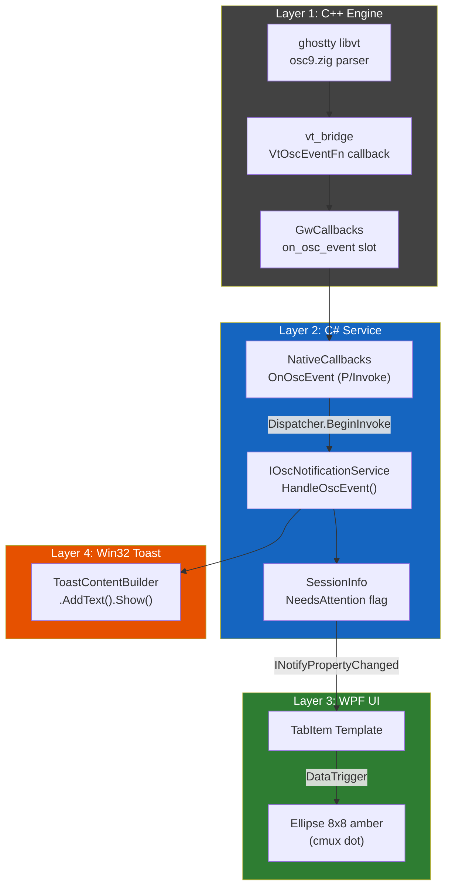

# Plan — Phase 6-A: OSC Hook + 알림 링 (Notification Ring)

> **문서 종류**: Plan Plus (Brainstorming-Enhanced)
> **작성일**: 2026-04-16
> **PRD 참조**: `docs/00-pm/phase-6-a-osc-notification-ring.prd.md`
> **선행 완료**: M-11 Session Restore + M-11.5 E2E Test Harness (8/8 PASS)
> **상태**: Plan approved (Phase 1-4 brainstorming 완료)

---

## Executive Summary

| 관점 | 내용 |
|------|------|
| **Problem** | Windows에서 Claude Code 3~5개 탭 병렬 실행 시, 어느 탭이 승인 대기인지 알 수 없음. 탭 순회 확인 비용 → 에이전트 유휴 시간 증가. |
| **Solution** | ghostty libvt의 OSC 9/99/777 파서 결과를 C++ → C# 콜백 파이프라인으로 노출. 전용 `IOscNotificationService`가 세션별 NeedsAttention 상태 관리 + Win32 Toast. 탭에 cmux 스타일 작은 원형 점(dot) 표시, 탭 전환 시 자동 소등. |
| **Function / UX Effect** | Claude Stop 송출 500ms 이내 탭 점 점등. 탭 훑기만으로 주의 필요 탭 발견. Alt+N 전환 시 자동 소등. 창 비활성 시 Win32 Toast로 Windows 알림 센터에 표시. |
| **Core Value** | **프로젝트 존재 이유(비전 ② AI 에이전트 멀티플렉서) 검증 게이트**. 이 가설 통과 → Phase 6-B/C 진행, 미통과 → Phase 6 전체 재설계. |

---

## 1. User Intent Discovery (Phase 1 결과)

| 질문 | 사용자 선택 |
|------|----------|
| **핵심 우선순위** | OSC 9 캡처 + 탭 링 + **Win32 Toast 알림까지** (PRD의 Phase 6-B 범위 일부 당김) |
| **UI 스타일** | cmux 스타일 — 탭 텍스트 옆 **작은 원형 점** (미니멀, 기존 탭 레이아웃 변경 최소) |

**PRD 대비 변경**: PRD §14는 Toast를 Out of Scope(→ Phase 6-B)로 분류했으나, 사용자 판단에 따라 Phase 6-A v1 범위에 포함. 이유: 창이 비활성일 때 탭 점은 안 보이므로, Toast가 없으면 UX 루프가 불완전.

---

## 2. Alternatives Explored (Phase 2 결과)

### 검토한 3가지 접근

| 접근 | 핵심 | 장점 | 단점 |
|------|------|------|------|
| **A: 기존 Messenger 패턴 확장** | `WeakReferenceMessenger.Default.Send(new OscNotificationMessage(...))` | 기존 코드 패턴 100% 일관 | Phase 6-B 확장 시 구독자 추가만 필요 (큰 단점 아님) |
| **B: 전용 IOscNotificationService** | 새 서비스 계층이 NeedsAttention + Toast + 설정 모두 소유 | SRP 깔끔, Phase 6-B/C 즉시 확장 가능 | 파일 추가 4-5개, v1 기준 과설계 가능성 |
| C: SessionManager 인라인 | OSC 핸들러를 SessionManager 내부에 직접 구현 | 가장 빠름, 최소 파일 | SessionManager 비대화, Toast 테스트 어려움 |

### 선택: **B (전용 IOscNotificationService)**

근거: Phase 6-A는 프로젝트 존재 이유 검증 → Phase 6-B/C 확장이 사실상 확정적. SRP 분리를 v1부터 해두면 Phase 6-B 진입 시 리팩토링 비용 제거.

---

## 3. YAGNI Review (Phase 3 결과)

### In Scope (v1)

| # | 항목 | 분류 |
|:-:|------|:---:|
| 1 | OSC 9 콜백 파이프라인 (C++ → C#) | Core |
| 2 | OSC 99/777 콜백 함께 | Core |
| 3 | `IOscNotificationService` + `OscNotificationService` + DI | Core |
| 4 | 탭 원형 점 (cmux dot) + Auto-dismiss | Core |
| 5 | Win32 Toast 알림 | 추가 |
| 6 | ConPTY stdin 주입 (`TestOnlyInjectBytes` 실동작) | 추가 |
| 7 | E2E Tier 3 테스트 (NotificationRing AutomationId 검증) | 추가 |
| 8 | AppSettings enable/disable 토글 | 추가 |

### Out of Scope (Phase 6-B 이후)

- Toast 클릭 → 해당 탭 이동
- 알림 히스토리/로그 패널
- 에이전트 상태 배지 (진행중/완료/대기/오류)
- 탭 점 색상 커스터마이징 (M-12 Settings UI)
- Named pipe 훅 서버 (Phase 6-C)
- 알림 소리/진동

---

## 4. Architecture (4계층 파이프라인)



### 계층별 책임

| Layer | 스레드 | 책임 | 변경 파일 수 |
|:-----:|:-----:|------|:---:|
| 1 C++ | I/O thread | libvt 파서 결과를 C# 으로 marshal | 5 |
| 2 C# Service | UI thread (Dispatcher) | NeedsAttention 상태 관리 + Toast 발사 + 설정 검사 | 5 (신규 3 + 수정 2) |
| 3 WPF UI | UI thread | 탭 점 표시 + Auto-dismiss | 2 |
| 4 Toast | UI thread | Windows 알림 센터 | Layer 2 내 처리 |

---

## 5. 핵심 컴포넌트 목록

### C++ (5개 파일)

| 파일 | 변경 내용 |
|------|----------|
| `src/vt-core/vt_bridge.h` | `VtOscEventFn` typedef + `vt_bridge_set_osc_callback()` 추가 |
| `src/vt-core/vt_core.h` | `set_osc_callback(OscEventFn, void*)` 메서드 추가 |
| `src/vt-core/vt_core.cpp` | ghostty stream handler에서 `show_desktop_notification` 액션 발생 시 콜백 호출 |
| `src/engine-api/ghostwin_engine.h` | `GwCallbacks`에 `on_osc_event` 슬롯 추가 |
| `src/engine-api/ghostwin_engine.cpp` | `make_session_events()`에서 osc callback 연결 |

### C# Core/Service (신규 3 + 수정 5)

| 파일 | 종류 | 내용 |
|------|:---:|------|
| `IOscNotificationService.cs` | **NEW** | `HandleOscEvent()`, `IsNeedsAttention()`, `DismissAttention()` |
| `OscNotificationService.cs` | **NEW** | 구현: NeedsAttention 관리 + Toast + 설정 체크 + debounce 100ms |
| `OscNotificationMessage.cs` | **NEW** | `record OscNotificationMessage(uint SessionId, OscKind Kind, string Payload)` |
| `SessionInfo.cs` | 수정 | `NeedsAttention` 프로퍼티 + `LastOscMessage` + `AttentionRaisedAt` |
| `NativeCallbacks.cs` | 수정 | `[UnmanagedCallersOnly] OnOscEvent(nint ctx, uint sid, int kind, nint payload)` |
| `EngineService.cs` | 수정 | `GwCallbacks` 구조체에 osc 필드 추가 + marshal |
| `App.xaml.cs` | 수정 | DI에 `IOscNotificationService` 등록 |
| `SessionManager.cs` | 수정 | `ActivateSession()`에서 `DismissAttention()` 호출 + `TestOnlyInjectBytes()` 실제 구현 |

### WPF UI (2개 파일)

| 파일 | 내용 |
|------|------|
| `MainWindow.xaml` | TabItem DataTemplate에 `Ellipse` 8×8 amber dot + `AutomationProperties.AutomationId` |
| `MainWindow.xaml.cs` | TabControl SelectionChanged에서 DismissAttention 호출 (auto-dismiss 보강) |

### E2E 테스트 (2개 파일)

| 파일 | 내용 |
|------|------|
| `Tier3_UiaProperty/NotificationRingScenarios.cs` | **NEW** — OscInjector로 OSC 9 주입 → ring 표시 UIA 검증 |
| `Stubs/OscInjector.cs` | `[Obsolete]` 제거 + `TestOnlyInjectBytes` 실동작으로 활성화 |

### 설정 (1개 파일)

| 파일 | 내용 |
|------|------|
| `AppSettings.cs` / `ISettingsService` | `Notifications.RingEnabled` (default: true), `Notifications.ToastEnabled` (default: true) |

---

## 6. Data Flow (3가지 경로)

### Flow 1: OSC 캡처 → 탭 점

```
Claude Code stdout → ConPTY → libvt osc9.zig
→ show_desktop_notification action
→ vt_bridge VtOscEventFn callback (I/O thread)
→ GwCallbacks.on_osc_event (C++)
→ NativeCallbacks.OnOscEvent (P/Invoke, I/O thread)
→ Dispatcher.BeginInvoke (UI thread 전환)
→ IOscNotificationService.HandleOscEvent()
→ SessionInfo.NeedsAttention = true
→ INotifyPropertyChanged → XAML DataTrigger
→ Ellipse.Visibility = Visible (amber dot)
```

### Flow 2: 자동 소등 (Auto-dismiss)

```
사용자가 해당 탭 클릭 또는 Alt+N
→ SessionManager.ActivateSession(sessionId)
→ IOscNotificationService.DismissAttention(sessionId)
→ SessionInfo.NeedsAttention = false
→ Ellipse.Visibility = Collapsed
```

### Flow 3: Toast (병렬)

```
HandleOscEvent() 내부에서 동시에:
→ if (Settings.Notifications.ToastEnabled && !앱_포커스_중)
→ ToastContentBuilder.AddText(payload).Show()
→ Windows Action Center에 표시
(클릭 → 탭 이동은 Phase 6-B)
```

---

## 7. 구현 순서

| Wave | 항목 | 의존성 | 검증 |
|:----:|------|:-----:|------|
| **W1** | C++ Layer: vt_bridge + GwCallbacks OSC 콜백 추가 | 없음 | `gw_test` 또는 C++ 단위 테스트로 콜백 호출 확인 |
| **W2** | C# Layer: NativeCallbacks + IOscNotificationService + DI 등록 | W1 | 앱 실행 후 `echo -e '\033]9;test\033\\'` → 로그 출력 확인 |
| **W3** | WPF UI: TabItem dot + Auto-dismiss + Settings | W2 | 수동 검증: OSC 9 송출 → 탭 점 점등 → 탭 전환 → 소등 |
| **W4** | Win32 Toast: OscNotificationService에서 Toast 발사 | W2 | 수동 검증: 창 비활성 시 Toast 표시 |
| **W5** | TestOnlyInjectBytes 실동작 + E2E Tier 3 | W3 | `dotnet test --filter "Tier=3"` |
| **W6** | 통합 검증 + 설정 enable/disable | W1-W5 | `dotnet test --filter "Tier!=Slow"` 전체 PASS |

### Wave 별 예상 시간

| Wave | 예상 | 누적 |
|:----:|:---:|:---:|
| W1 | 2-3시간 | 2-3시간 |
| W2 | 2-3시간 | 4-6시간 |
| W3 | 2-3시간 | 6-9시간 |
| W4 | 1-2시간 | 7-11시간 |
| W5 | 2-3시간 | 9-14시간 |
| W6 | 1-2시간 | 10-16시간 |

**총 예상**: 1.5~2일 (집중 세션)

---

## 8. 비기능 요구사항 (NFR)

| 범주 | 요구 | 측정 |
|------|------|------|
| **성능** | OSC → 탭 점 표시 end-to-end < 500ms (p95) | E2E 타임스탬프 |
| **성능** | C++ → C# marshal < 1ms | ETW trace |
| **정확도** | Stop 이벤트 캡처율 ≥ 99.5% | E2E OscInjector 반복 주입 |
| **정확도** | False positive < 1% | 비-알림 OSC fuzz 주입 |
| **쓰로틀** | 초당 100회 OSC에도 UI 프레임 드랍 없음 | debounce 100ms 적용 |
| **스레드 안전** | I/O thread → Dispatcher.BeginInvoke | ADR-006 vt_mutex 규칙 |

---

## 9. 위험 + 완화

| 위험 | 심각도 | 완화 |
|------|:------:|------|
| oh-my-posh 등 쉘 도구가 OSC 남발 → false positive | 중 | debounce 100ms + OSC 종류 화이트리스트 (9/99/777만) |
| Claude Code가 향후 OSC 코드 변경 | 중 | OSC 종류별 E2E 테스트 매트릭스 상시 유지 |
| vt_bridge에 콜백 추가 시 ghostty libvt ABI 영향 | 낮 | VtCore 래퍼 격리 (ADR-001, ADR-003). ghostty 내부 수정 없이 콜백 훅만 |
| Toast NuGet 패키지 .NET 10 호환성 | 낮 | `Microsoft.Windows.CsWinRT` 또는 직접 WinRT interop |

---

## 10. Success Metrics (PRD §11 동일)

| 지표 | 목표 |
|------|------|
| OSC → ring 표시 지연 (p95) | < 500ms |
| Stop 이벤트 캡처율 | ≥ 99.5% |
| False positive rate | < 1% |
| Auto-dismiss 정확도 | 100% |
| 주간 알림 수신 사용자 비율 (4주 후) | ≥ 30% |
| Persona 1 인식 개선 설문 | ≥ 7/10 |

**판정**: 6개 중 **4개 이상** 달성 시 Phase 6-B 착수. 2개 이하 → Phase 6 재설계.

---

## 11. Brainstorming Log (핵심 결정)

| Phase | 결정 | 대안 | 근거 |
|:-----:|------|------|------|
| 1 | Toast를 Phase 6-A 범위에 포함 | PRD는 Phase 6-B로 분류 | 창 비활성 시 탭 점 안 보임 → UX 루프 불완전 |
| 1 | cmux dot (작은 원형 점) | 탭 테두리 전체 하이라이트 | 미니멀 + 기존 레이아웃 변경 최소 |
| 2 | IOscNotificationService (Approach B) | Messenger 확장(A) / 인라인(C) | Phase 6-B/C 확장 확정적 → SRP 선투자 합리적 |
| 3 | OSC 99/777 동시 구현 | OSC 9만 (최소) | ghostty 파서가 이미 3종 모두 처리. 콜백 확장 비용 ≈ 0 |
| 3 | E2E Tier 3 + TestOnlyInjectBytes 포함 | UI 수동 검증만 | M-11.5 선행 인프라 활용 → 자동 검증이 가설 재현성 보장 |
| 4 | 4계층 파이프라인 | 2계층(C++ + C# 통합) | 기존 Title/CWD 콜백 경로와 동일 구조 유지 |

---

## 12. Phase 6-B 연결점

| Phase 6-A 산출물 | Phase 6-B 활용 |
|-----------------|---------------|
| `IOscNotificationService` | 알림 패널 뷰가 구독 |
| `SessionInfo.NeedsAttention` | 에이전트 상태 배지 바인딩 |
| `OscNotificationMessage` | 알림 히스토리 로그에 적재 |
| Toast 인프라 | 클릭 → 탭 이동 Action 추가 |
| OSC 콜백 파이프라인 | Phase 6-C Named pipe 서버의 데이터 소스 |

---

## 13. 참조

- **PRD**: `docs/00-pm/phase-6-a-osc-notification-ring.prd.md`
- **M-11.5 보고서**: `docs/archive/2026-04/e2e-test-harness/e2e-test-harness.report.md`
- **Obsidian**: `Milestones/m11-5-e2e-harness.md` (선행 인프라 체크리스트)
- **ghostty OSC 파서**: `external/ghostty/src/terminal/osc/parsers/osc9.zig`
- **ghostty OSC 타입**: `external/ghostty/include/ghostty/vt/osc.h` (GHOSTTY_OSC_COMMAND_SHOW_DESKTOP_NOTIFICATION = 9)
- **ADR-001**: GNU+simd=false, **ADR-003**: DLL 격리, **ADR-006**: vt_mutex
- **onboarding.md**: 3대 비전

---

*End of Plan Plus — Phase 6-A: OSC Hook + Notification Ring*
