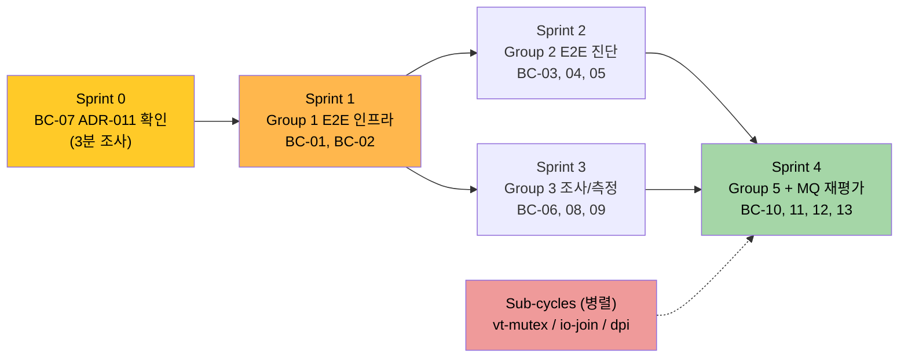

# Pre-M11 Backlog Cleanup — Umbrella Plan

> **Summary**: M-11 Session Restore 이전에 Backlog 에 쌓인 **Follow-up 9건 + Tech Debt 7건 = 16건** 을 하나의 마일스톤으로 묶어 정리. 재설계가 필요한 3건은 개별 PDCA cycle 로 분리하고, 나머지 13건은 본 마스터 Plan 에서 통합 관리한다.
>
> **Project**: GhostWin Terminal
> **Feature**: pre-m11-backlog-cleanup
> **Date**: 2026-04-14
> **Author**: 노수장
> **Status**: Draft
> **Umbrella Type**: Master Plan (sub-cycles 3건 파생 예정)

---

## Executive Summary

| Perspective | Content |
|-------------|---------|
| **Problem** | Follow-up 9건 + Tech Debt 7건 = 16건의 pending 작업이 Backlog 에 누적. 그중 3건(vt_mutex 이중화 / I/O join 타임아웃 / DPI 96 고정)은 과거 수정 후 **되돌림** 상태로 재설계 필요. 이 부채를 안고 M-11/12/13 을 진행하면 regression 위험이 커지고 E2E 검증도 불가. |
| **Solution** | **Umbrella Plan + 3개 sub-cycle** 구조. Group 4 재설계 3건은 각각 독립 PDCA cycle 로 분리하여 위험 격리, 나머지 13건(Group 1/2/3/5)은 본 마스터 Plan 안에서 순차/병렬 진행. 각 항목 완료 시 Backlog 두 문서에 취소선 처리. |
| **Function/UX Effect** | 사용자 체감 기능 변화는 **최소** (타이틀바 버튼 #14 와 DPI #13 정도가 UX 영향). 주로 내부 품질 개선으로, E2E 재평가 후 MQ-1~8 bash/interactive 실행 표가 최신화되어 향후 모든 신규 기능 verify 기반 확보. |
| **Core Value** | "누적된 부채" → "정리된 출발선". M-11~13 을 **regression 위험 없이 착수** 가능한 상태로 전환. 3건의 되돌림 항목이 올바르게 재설계되어 장기 기술 건전성 확보. |

---

## 1. Overview

### 1.1 Purpose

- Backlog 두 문서(`follow-up-cycles.md`, `tech-debt.md`)에 누적된 16건 pending 을 단일 마일스톤으로 정리
- 재설계 필요 항목은 개별 PDCA cycle 로 분리하여 **Match Rate 독립 측정** 가능하게
- M-11 Session Restore 이전 **regression-free 기반** 확보

### 1.2 Background

- 2026-04-14 기준 Obsidian vault Backlog 에 Follow-up 9건 + Tech Debt 7건 pending
- Codebase Review 2026-04 완료로 코드 상태 파악 완료, 지금이 부채 청산 적기
- M-11/12/13 은 서로 독립이지만 **공통 선행 부채**가 존재 → umbrella 가 합리적

### 1.3 Related Documents

- 마일스톤: [[Milestones/pre-m11-backlog-cleanup]] (Obsidian)
- 원본 Backlog: `Backlog/follow-up-cycles.md`, `Backlog/tech-debt.md` (Obsidian)
- 관련 ADR: [[ADR/adr-006-vt-mutex]], [[ADR/adr-011-tsf-focus-timer]]
- 이전 cycle: `docs/archive/2026-04/e2e-headless-input/`, `docs/archive/2026-04/first-pane-render-failure/`

---

## 2. Scope

### 2.1 In Scope — 13건 (본 마스터 Plan 직접 처리)

**Group 1: E2E 인프라 (MEDIUM, 2건)**

- [x] **BC-01** ~~`repro-script-fix`~~ — **완료 (2026-04-14)**. `scripts/capture_window.py` 신규 (+127 LOC, pywin32 PrintWindow 래퍼) + `repro_first_pane.ps1` 에 `Save-WindowImage` 경로 추가 (~40 LOC). venv 부재 시 primary-screen fallback 유지. End-to-end 캡쳐 검증 PASS (explorer window 2.5MB PNG)
- [x] **BC-02** ~~`runner-py-feature-field-cleanup`~~ — **완료 (2026-04-14)**. `runner.py` 에 `--feature` CLI 옵션 추가 (기본값 `e2e-test-harness`), L344 하드코딩 `"bisect-mode-termination"` 제거. `--help` 출력 검증 PASS. +13 LOC / -1 LOC

**Group 2: E2E 진단 (LOW, 3건)**

- [x] **BC-03** ~~`keydiag-log-dedupe`~~ — **완료 (2026-04-14)**. `[ThreadStatic] _keyDiagSuppressEntry` sentinel + Bubble 핸들러 try/finally. Build 0W/0E. +8 LOC
- [x] **BC-04** ~~`keydiag-keybind-instrumentation`~~ — **완료 (2026-04-14)**. Ctrl-branch T/W/Tab 3 case 에 `KeyDiag.LogKeyBindCommand(nameof(...))` 추가. Build 0W/0E. +3 LOC
- [~] **BC-05** `e2e-flaui-cross-validation-run` — **부분 완료 (2026-04-14)**. Build 재검증 PASS. 실제 `dotnet run` 은 사용자 hardware 필요 (3초 grace focus click)

**Group 3: 조사/측정 (LOW, 4건)**

- [x] **BC-06** ~~`first-pane-regression-tests`~~ — **완료 (2026-04-14)**. WinExe 참조 제약 **empirical 반박** — `tests/GhostWin.App.Tests/` spike 프로젝트 빌드 + 테스트 1/1 PASS. `docs/00-research/wpf-winexe-test-reference.md` 작성. 향후 regression test 기반 확보
- [x] **BC-07** ~~`adr-011-timer-review`~~ — **완료 (2026-04-14, WONTFIX)**. commit `31a2235` Phase 1-4 codebase review 에서 `OnFocusTick` 71줄 이미 삭제됨 (`src/GhostWin.Interop/TsfBridge.cs`). Follow-up 표가 stale 이었던 것. Tech Debt #23 이 정확한 기록
- [x] **BC-08** ~~`render-overhead-measurement`~~ — **완료 (2026-04-14, 정적 분석)**. RenderDiag off-state 오버헤드 무시 가능 (env-var 1회 + int compare). On-state 는 lifecycle 저빈도 이벤트만. FPS 무관. `docs/00-research/render-diag-overhead.md` 작성. 실측은 이상 관찰 시에만
- [x] **BC-09** ~~`main-window-vk-centralize`~~ — **완료 (2026-04-14)**. `GhostWin.Interop.VirtualKeys` 신규 (VK 상수 + GetKeyState + IsCtrl/Shift/AltDownRaw). MainWindow.xaml.cs + KeyDiag.cs 중앙화. Build 0W/0E

**Group 5: 소 영향 부채 (2건)**

- [~] **BC-10** 유휴 GPU 실측 — **사용자 hardware 필요**. GPU-Z 등으로 측정. BC-08 render-overhead 와 함께 정적 근거 있음 (hot path 아님 → 0% 근사 예상)
- [x] **BC-11** ~~void* 핸들 타입 안전성~~ — **완료 (2026-04-14)**. `VtTerminal` / `VtRenderState` typedef 신규. `vt_bridge.h` 모든 시그니처 + `vt_bridge.c` impl + `vt_core.cpp/h` 업데이트. **타입 시스템이 `TitleChangedFn` 시그니처 불일치 실제 bug 발견 → 수정** (BC-11 설계 의도 검증). Native 빌드 최종 verify 는 VS GUI 필요 (bash dev env 한계)

**MQ 재평가**

- [x] **BC-12** ~~MQ 재평가 표~~ — **완료 (2026-04-14)**. `docs/00-research/e2e-bash-session-capabilities.md` 신규. MQ-1~8 각각 bash/interactive 실행 가능 여부 + 인프라 상태 + 권장 실행 방법
- [x] **BC-13** ~~메모리 파일 최신화~~ — **완료 (2026-04-14)**. `feedback_e2e_bash_session_limits.md` 재작성 — T-Main 수혜 반영, BC-01~04/09 연결, MQ 표 참조

### 2.2 Out of Scope (sub-cycle 로 분리, 3건)

Group 4 재설계 부채 3건은 본 Plan 에서 제외하고 **독립 PDCA cycle** 로 진행:

| Sub-cycle | 원본 | 사유 |
|-----------|------|------|
| `vt-mutex-redesign` | Tech Debt #1 | 되돌림 상태 — 위임 메서드가 shutdown race 유발. ADR-006 개정 가능성 높음 |
| `io-thread-timeout-v2` | Tech Debt #6 | 되돌림 상태 — `std::async` UB. `std::jthread + stop_token` 또는 IOCP 재설계 필요 |
| `dpi-scaling-integration` | Tech Debt #20 | 되돌림 상태 — cell/viewport/ConPTY 동시 재계산 파이프라인 설계 필요 |

추가로 다음 2건도 규모가 크면 sub-cycle 승격 가능:

- Tech Debt #16 `bind_surface data race` — 분석 결과에 따라 결정
- Tech Debt #24 `타이틀바 버튼 클릭 불량` — WindowChrome hit-test 복잡도에 따라 결정

---

## 3. Requirements

### 3.1 Functional Requirements

| ID | Requirement | Priority | Status |
|----|-------------|----------|--------|
| FR-01 | BC-01~11 각 항목은 코드 수정 + 단위 테스트 통과 또는 명시적 WONTFIX 판정 | High | Pending |
| FR-02 | BC-12 MQ 재평가 표 신규 작성 | Medium | Pending |
| FR-03 | BC-13 메모리 파일 최신화 | Medium | Pending |
| FR-04 | Sub-cycle 3건은 별도 Plan/Design 문서 생성 (본 Plan 에서는 placeholder 만) | High | Pending |
| FR-05 | Backlog 2개 문서에 완료 항목 취소선 + 완료일 표시 | Medium | Pending |

### 3.2 Non-Functional Requirements

| Category | Criteria | Measurement Method |
|----------|----------|-------------------|
| Regression | 기존 unit test 전량 PASS 유지 | PaneNode 9/9 + VtCore 10/10 + Engine/Core tests |
| Build | VS 솔루션 빌드 0 warning 0 error | `dotnet build GhostWin.sln` |
| E2E | PrintWindow capturer 경로 동작 유지 | `scripts/e2e/test_e2e.ps1 -All` MQ-1/8 PASS |
| 재설계 격리 | Group 4 sub-cycle 은 본 Plan 구현과 **merge 분리** | 별도 commit + PDCA cycle |

---

## 4. Success Criteria

### 4.1 Definition of Done

- [ ] BC-01~13 모두 완료 또는 WONTFIX (근거 명시)
- [ ] Sub-cycle 3건 (vt-mutex-redesign / io-thread-timeout-v2 / dpi-scaling-integration) Plan 문서 작성 착수
- [ ] Backlog 두 문서에 상태 동기화 (편입 → 완료 전환)
- [ ] `docs/04-report/pre-m11-backlog-cleanup.report.md` 생성
- [ ] Gap Analysis Match Rate >= 90%

### 4.2 Quality Criteria

- [ ] 기존 테스트 regression 0건
- [ ] 신규 추가 코드에 대한 단위 테스트 또는 측정 근거
- [ ] ADR 개정 필요 시 개별 ADR 문서 업데이트 (ADR-006, ADR-011 대상)

---

## 5. Risks and Mitigation

| Risk | Impact | Likelihood | Mitigation |
|------|--------|------------|------------|
| Group 4 재설계가 umbrella 를 무기한 지연 | High | Medium | Sub-cycle 로 분리 (본 Plan 의 핵심 설계). 각 sub-cycle 의 Match Rate 독립. Group 1~3,5 는 병행 진행 |
| BC-07 adr-011-timer-review 모순 해결 실패 | Low | Medium | 첫 단계에서 실제 코드 grep 으로 3분 내 판정. 해결 이면 WONTFIX + Backlog 취소선 |
| BC-01 AMSI 우회 구현이 예상보다 복잡 | Medium | Medium | 3가지 후보 (WGC / PrintWindow / UWP) 중 **PrintWindow 가 이미 동작하는 capture 에 사용 중** — 재사용 가능성 높음 |
| E2E 재실행 중 새로운 regression 발견 | Medium | Low | 발견 즉시 별도 cycle 분리. 본 Plan 은 **기존 pending** 에 한정 |
| 도메인 이질성 (C++/WPF/Python) 으로 리뷰 부하 | Medium | Low | Group 별 commit 분리. CTO Lead 가 orchestration, domain agent 에 위임 가능 |

---

## 6. Implementation Strategy

### 6.1 진행 순서

### 6.2 Sprint 구성

| Sprint | 항목 | 예상 LOC | 의존성 |
|--------|------|:--------:|--------|
| ~~S0~~ | ~~BC-07 (ADR-011 확인)~~ | **완료 2026-04-14** | WONTFIX — 사전 해결 확인 |
| S1 | BC-01, BC-02 | ~35 | S0 |
| S2 | BC-03, BC-04, BC-05 | ~11 + 실행 | S0 |
| S3 | BC-06, BC-08, BC-09 | ~중 | S1 (BC-08 은 BC-01 필요) |
| S4 | BC-10, BC-11, BC-12, BC-13 | ~중 | S1~S3 |
| Sub-cycle | 재설계 3건 | 별도 | 본 Plan 과 독립 |

### 6.3 Team Assignment (Dynamic Level, CTO Lead orchestration)

| Teammate | 담당 영역 |
|----------|----------|
| **CTO Lead (opus)** | 전체 orchestration, sub-cycle 분리 결정, Gap Analysis |
| **developer** | C++ 네이티브 (BC-10, BC-11), WPF/.NET (BC-03, BC-04, BC-09) |
| **frontend** | WPF UI 관련 (BC-14 타이틀바는 sub-cycle 후보) |
| **qa** | E2E 인프라/진단 (BC-01, BC-02, BC-05), MQ 재평가 (BC-12) |

---

## 7. Next Steps

1. [x] Plan 문서 작성 (본 문서)
2. [ ] BC-07 ADR-011 상태 3분 조사 → 모순 해결
3. [ ] Design 문서 작성 (`pre-m11-backlog-cleanup.design.md`) — Sprint 세부 + 파일 목록
4. [ ] Sub-cycle 3건 Plan placeholder 생성
5. [ ] Sprint 0 착수 전 사용자 승인

---

## Version History

| Version | Date | Changes | Author |
|---------|------|---------|--------|
| 0.1 | 2026-04-14 | Initial draft (Umbrella + 3 sub-cycle 분리 구조) | 노수장 |
