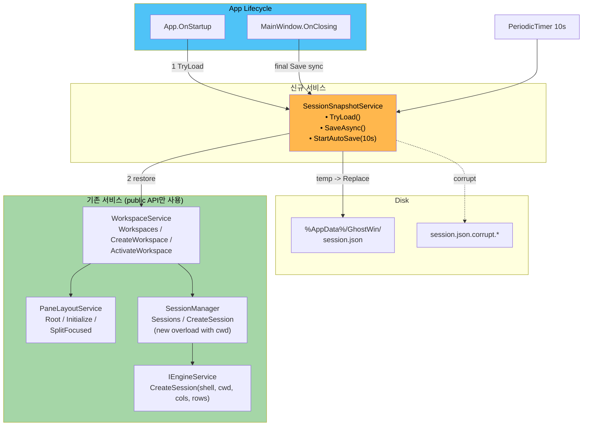
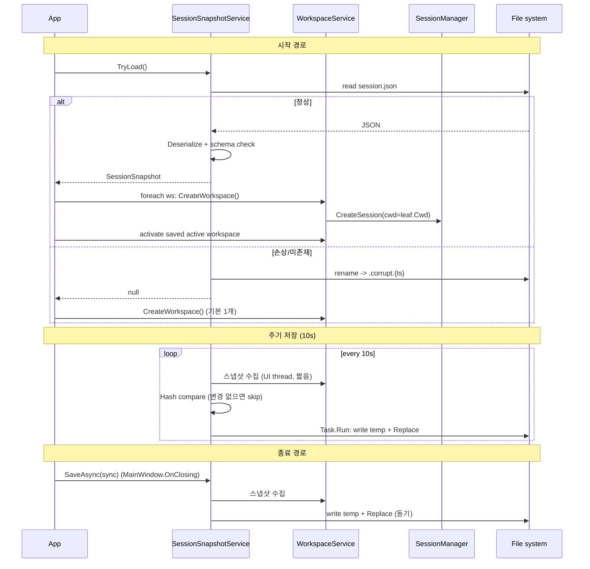

# Session Restore — M-11 Plan

> Version 1.0 | 작성일: 2026-04-15 | 선행 PRD: `docs/00-pm/session-restore.prd.md`
> 브랜치: `feature/wpf-migration` | 예상 규모: 중 (1주)
> 후속: Phase 6-A OSC Hook + 알림 링 (핵심 가설 검증 — 본 피처는 그 전제 조건)

---

## Executive Summary

| 관점 | 내용 |
|------|------|
| **Problem** | 앱을 닫으면 **워크스페이스 / Pane 분할 / CWD / 이름이 전부 휘발**. 실수 클릭 · OS 재부팅 시 매일 5분 재구성 비용. Phase 6-A 의 "에이전트 알림 지속성" 전제가 무너진다 (재시작 시 탭 사라지면 알림 맥락 증발). |
| **Solution** | `%AppData%/GhostWin/session.json` 스냅샷 + `SessionSnapshotService` (Singleton, IDisposable). **종료 시 동기 저장** + **10초 주기 비동기 저장** + **앱 시작 시 자동 복원**. 기존 서비스(WorkspaceService / PaneLayoutService / SessionManager) 의 public API 재사용, 새 DTO 는 `record` 기반, 원자 쓰기 (temp → File.Replace). 스키마에 `schema_version=1` + `reserved.agent` 확장 슬롯 예약 (Phase 6-A 에서 채움). |
| **Function UX Effect** | "어제 작업 그대로 3개 워크스페이스 + 분할 + CWD 가 **즉시** 열림". 활성 pane 의 쉘 타이틀이 사이드바 워크스페이스 라벨에 실시간 미러 (FR-4 — WorkspaceService 에 이미 일부 배선됨, 검증만). |
| **Core Value** | cmux 세션 복원 등가 + Phase 6-A **에이전트 알림 지속성** 기반 확보. `AppSettings` 저장 패턴 · 기존 API 재사용으로 1주 규모 / 과설계 없음 (YAGNI). 실행 중 프로세스 복원은 **제외** (cmux 도 미지원, Windows PTY 표준 부재). |

---

## 1. Scope — 무엇을 하고 무엇을 안 하는가

### 1.1 In-scope (본 Plan)

- 워크스페이스 목록 (이름 · 활성 여부 · 순서) 저장 · 복원
- 각 워크스페이스의 `PaneNode` 트리 구조 (분할 방향 · 비율) 저장 · 복원
- 각 leaf pane 의 **CWD + 쉘 타이틀** 저장 · 복원
- 저장 시점 2 가지: 앱 종료 (`MainWindow.OnClosing`) + 10초 주기 타이머
- 손상 파일 폴백 (`.corrupt.{timestamp}` 백업 + 빈 워크스페이스 1 개)
- `schema_version=1` + `reserved.agent` 확장 슬롯 **예약** (Phase 6-A 대비, 읽기 라운드트립 보존)
- 엔진 API (`IEngineService.CreateSession`) 의 `initialDir` 인자 까지 `ISessionManager` 에 **전파** (오버로드 추가 — OQ-4 확정 항목)

### 1.2 Out-of-scope (명시적 제외 — PRD §6.2)

| 항목 | 이유 |
|------|------|
| 스크롤백 복원 | VT 상태 직렬화 복잡도 과다. cmux 는 지원하지만 가치-비용 비율이 낮다. |
| 실행 중 프로세스 복원 (attach/detach) | Windows PTY 표준 없음. tmux 통합 시 별도 논의. |
| 워크스페이스 이름 편집 UI | M-12 Settings UI 범위. 본 Plan 은 **복원만** 담당. |
| 다중 윈도우 복원 | GhostWin 단일 윈도우 모델. |
| 암호화 저장 | CWD 는 민감정보 아님. AppData 로컬 ACL 로 충분. |
| cmd.exe CWD 완벽 복원 | cmd 는 OSC 7 미발행 (프롬프트 정규식 파싱은 범위 밖) — CWD 미기록 시 쉘 기본값 폴백 |

---

## 2. 기능 요구사항 (FR)

PRD §6.1 확정 — 본 Plan 은 변경 없이 계승하되 **수용 기준을 구현 관점** 으로 정교화.

| ID | 요구사항 | 수용 기준 (Plan 해석) |
|----|----------|-----------------------|
| **FR-1** | JSON 스냅샷 저장 (workspace + PaneNode 트리 + CWD + 이름) | `%AppData%/GhostWin/session.json`. 루트에 `schema_version`, `workspaces[]`, `reserved` 필드. `PaneSnapshot` 은 `leaf` / `split` 두 variant (discriminated union, `type` 필드). |
| **FR-2** | 저장 시점: 종료 시 + 10초 주기 | 종료: `MainWindow.OnClosing` 의 **UI 리소스 정리 단계 (현 `SaveWindowBounds` 직후)** 에서 **동기** `Save()`. 주기: `PeriodicTimer` (비동기, UI 스레드 블로킹 금지). 변경 감지 시에만 write (이전 스냅샷 해시 비교). |
| **FR-3** | 복원 시점: 앱 시작 시 자동 | `App.OnStartup` 의 DI 설정 직후, `MainWindow` 생성 전에 `TryLoad()` 호출. 성공 시 `WorkspaceService` 상에 재구성. 실패 시 현재 경로 (빈 워크스페이스 1 개) 유지. |
| **FR-4** | 워크스페이스 타이틀 = 활성 pane 쉘 타이틀 미러 | `WorkspaceService.CreateWorkspace` 에 **이미 구현**됨 (`SessionInfo.PropertyChanged` 구독 → `WorkspaceInfo.Title/Cwd` 갱신, `WorkspaceService.cs:66-77`). **복원 경로에서도 동일 배선 재연결**. 측정: `SessionTitleChangedMessage` 전파 100ms 이내. |
| **FR-5** | schema_version + reserved.agent 확장 | 로더는 `schema_version == 1` 만 현재 해석. `> 1` 이면 "빈 상태 + 원본 백업" 폴백 (미래 호환). `< 1` 은 존재하지 않음. `reserved` 는 `JsonObject` 로 원문 보존 (타입 강제 금지). |
| **FR-6** | 손상 파일 폴백 | `JsonException` 또는 `schema_version > 1` 시 `session.json.corrupt.yyyyMMdd-HHmmss` 로 rename, 빈 워크스페이스 1 개로 시작. 시작 로그에 1줄 기록. |
| **FR-7** | `reserved.agent` 라운드트립 보존 | `reserved` 를 읽으면 그대로 유지 후 다음 저장 시 재기록. 알려지지 않은 필드 전부 무시하지만 **제거하지 않음** — Phase 6-A 빌드와 v1 빌드 간 상호운용 보장. |

---

## 3. 비기능 요구사항 (NFR)

| ID | 목표 | 근거 | 측정 |
|----|------|------|------|
| **NFR-1** | 종료 저장 < 100ms | `OnClosing` 의 2초 타임아웃 내 여유 확보 | `Stopwatch` — 저장 경로 양끝 |
| **NFR-2** | 주기 저장 < 50ms (변경 없으면 스킵) | UI 프레임 16.7ms 기준으로도 2~3 프레임 밖에 안 됨 (UI 스레드 밖 실행) | `Stopwatch` + trace |
| **NFR-3** | 복원 지연 +100ms 이내 (기존 시작 경로 대비) | 첫 프레임 Present 전 동기 경로에서 실행 → 사용자 체감 지연은 "빈 화면 시간 증가" 로 표출 | `App.OnStartup` ↔ `MainWindow.Loaded` 타임스탬프 |
| **NFR-4** | 파일 크기 < 4KB (일반 사용 3W × 3 split) | PaneNode 당 ~100B × 9 leaf + 메타 = 1KB 미만 추정 | 실측 로그 |
| **NFR-5** | 하위 호환 (±1 major) | Phase 6-A 에서 v2 로 올릴 때 v1 읽기 유지 | `schema_version` 분기 단위 테스트 |
| **NFR-6** | 원자적 쓰기 | 쓰는 도중 크래시 시 기존 파일 보존 | `File.WriteAllText(tmp)` → `File.Replace(tmp, dst, backup)` 패턴 |
| **NFR-7** | UI 스레드 비차단 (주기 저장) | 10초 타이머가 UI freeze 유발 금지 | `PeriodicTimer` + `Task.Run(Save)` — 스냅샷 수집은 UI 스레드 (짧음), 직렬화·write 는 background |

---

## 4. 아키텍처 스케치

### 4.1 서비스 다이어그램



### 4.2 기여 매트릭스 — 누가 무슨 데이터를 공급하는가

| 데이터 | 공급자 (기존) | 참조 API |
|--------|---------------|----------|
| 워크스페이스 목록 · 이름 · 활성 여부 | `IWorkspaceService` | `Workspaces`, `ActiveWorkspaceId` |
| PaneNode 트리 (분할 방향 · 비율) | `IPaneLayoutService` | `Root` (IReadOnlyPaneNode) |
| 쉘 CWD · 타이틀 | `ISessionManager` → `SessionInfo.Cwd/Title` | `Sessions.FirstOrDefault(Id == paneId.SessionId)` |
| 새 쉘 생성 (복원 시 CWD 적용) | `ISessionManager.CreateSession(cols, rows, **cwd**)` — **오버로드 추가** | 엔진은 이미 `initialDir` 인자 지원 |

### 4.3 저장 / 복원 시퀀스



---

## 5. 데이터 모델

### 5.1 C# 타입

위치: `GhostWin.Core.Models` (직렬화 타입) + `GhostWin.Core.Interfaces` (서비스 계약).

```csharp
namespace GhostWin.Core.Models;

public sealed record SessionSnapshot(
    int SchemaVersion,
    DateTimeOffset SavedAt,
    IReadOnlyList<WorkspaceSnapshot> Workspaces,
    int ActiveWorkspaceIndex,        // -1 = 없음 (빈 상태)
    System.Text.Json.Nodes.JsonObject? Reserved // reserved.agent 등 — 원문 보존
);

public sealed record WorkspaceSnapshot(
    string Name,
    PaneSnapshot Root,
    System.Text.Json.Nodes.JsonObject? Reserved // 워크스페이스 수준 예약 슬롯 (Phase 6-A 선택)
);

// Discriminated union — JSON "type": "leaf" | "split"
[System.Text.Json.Serialization.JsonPolymorphic(TypeDiscriminatorPropertyName = "type")]
[System.Text.Json.Serialization.JsonDerivedType(typeof(PaneLeafSnapshot), "leaf")]
[System.Text.Json.Serialization.JsonDerivedType(typeof(PaneSplitSnapshot), "split")]
public abstract record PaneSnapshot;

public sealed record PaneLeafSnapshot(
    string? Cwd,                   // null = 쉘 기본 CWD
    string? Title,                 // 참고용 (복원 시 쉘 OSC 로 덮어씀)
    System.Text.Json.Nodes.JsonObject? Reserved
) : PaneSnapshot;

public sealed record PaneSplitSnapshot(
    SplitOrientation Orientation,  // Horizontal | Vertical (기존 enum 재사용)
    double Ratio,                  // 0.0~1.0 (±1% 정확도)
    PaneSnapshot Left,             // 세로 분할 기준 왼쪽 / 가로 분할 기준 위
    PaneSnapshot Right             // 세로 분할 기준 오른쪽 / 가로 분할 기준 아래
) : PaneSnapshot;
```

### 5.2 왜 `PaneNode` 를 **직접** 직렬화하지 않는가

| 선택지 | 장점 | 단점 |
|--------|------|------|
| (A) `PaneNode` 에 `[JsonSerializable]` 직접 붙임 | 코드 적음 | 내부 필드 (`Id`, `SessionId`) 까지 노출 → 복원 시 ID 충돌 / 구조 결합도 ↑ |
| **(B, 채택)** 별도 `PaneSnapshot` record 도입 + `PaneNode` ↔ `PaneSnapshot` 변환기 | 내부 ID 는 **저장 안 함** (재생성). 테스트/마이그레이션 용이. record equality 로 hash compare 간편 | 변환기 2개 (toSnapshot / fromSnapshot) 추가 |

PRD §8.4 리스크 ("PaneNode 직렬화가 내부 상태에 의존") 해결.

### 5.3 저장 파일 예시 (schema v1)

```json
{
  "schema_version": 1,
  "saved_at": "2026-04-15T21:30:00+09:00",
  "active_workspace_index": 0,
  "workspaces": [
    {
      "name": "Workspace 1",
      "root": {
        "type": "split",
        "orientation": "Vertical",
        "ratio": 0.5,
        "left":  { "type": "leaf", "cwd": "C:/Users/me/project", "title": "node - dev" },
        "right": { "type": "leaf", "cwd": "C:/Users/me",         "title": "pwsh" }
      }
    },
    { "name": "Workspace 2", "root": { "type": "leaf", "cwd": "C:/logs", "title": "tail" } }
  ],
  "reserved": { "agent": null }
}
```

### 5.4 Phase 6-A 예약 필드 정책 (사용자 요구사항)

- `SessionSnapshot.Reserved["agent"]` = Phase 6-A 전용 슬롯
- `PaneLeafSnapshot.Reserved` = pane 단위 확장 (예: 알림 상태)
- **현 빌드 규칙**: 읽으면 `JsonObject` 그대로 보관, 저장 시 재기록 (값 자체는 해석하지 않음)
- Phase 6-A 에서 예상되는 스키마 (**참고용** — 본 Plan 에서 구현 안 함):
  ```json
  "reserved": {
    "agent": {
      "pending_notifications": [{"pane_id": 3, "at": "...", "kind": "osc-9"}],
      "last_osc_event": { "seq": "9", "payload": "build done", "at": "..." }
    }
  }
  ```

---

## 6. 신규 인터페이스

### 6.1 `ISessionSnapshotService`

```csharp
namespace GhostWin.Core.Interfaces;

public interface ISessionSnapshotService
{
    /// <summary>디스크에서 스냅샷을 읽어 반환. 없음/손상 시 null (손상은 .corrupt 로 격리 후 null).</summary>
    SessionSnapshot? TryLoad();

    /// <summary>현 WorkspaceService 상태를 스냅샷으로 저장. 종료 경로에서 사용 (동기 경로 기반).</summary>
    Task SaveAsync(CancellationToken ct = default);

    /// <summary>주기적(기본 10s) 자동 저장 시작. 변경 감지 시에만 write.</summary>
    void StartAutoSave(TimeSpan interval);

    /// <summary>주기 저장 중단 (Dispose 시 자동 호출).</summary>
    void StopAutoSave();
}
```

### 6.2 `ISessionManager` 오버로드 추가 (OQ-4 확정)

현 시그니처: `uint CreateSession(ushort cols = 80, ushort rows = 24)` — 내부에서 `_engine.CreateSession(null, null, cols, rows)` 호출 (shellPath / initialDir 둘 다 null).

**엔진 측 시그니처** (이미 존재 — 확인 완료, `IEngineService.cs:24`):
```csharp
uint CreateSession(string? shellPath, string? initialDir, ushort cols, ushort rows);
```

**변경안**:
```csharp
// ISessionManager
uint CreateSession(ushort cols = 80, ushort rows = 24);
uint CreateSession(string? cwd, ushort cols = 80, ushort rows = 24); // ★ 신규
```

`SessionManager` 내부 구현에서 `_engine.CreateSession(null, cwd, cols, rows)` 로 전달. `shellPath` 는 **이번 Plan 범위 밖** (M-12 설정 UI 에서 사용자 쉘 선택 시 확장).

---

## 7. 구현 순서 (Phase 1-A ~ 1-E)

PRD §7 의 4 단계를 구현 리스크 순으로 재배치.

### Phase 1-A — 데이터 모델 + 직렬화 왕복 테스트 (리스크 최소 · 선행)

1. `SessionSnapshot`, `WorkspaceSnapshot`, `PaneSnapshot` (+ 2 derived) record 추가 (`GhostWin.Core.Models`)
2. `System.Text.Json` 옵션: `snake_case` + `WriteIndented=true` + polymorphic discriminator
3. **Unit test**: `SessionSnapshot` round-trip (직렬화 → 역직렬화 → equality)
4. **Unit test**: `reserved` 필드가 알려지지 않은 하위 필드를 **보존** 하는지 확인
5. 빌드: `dotnet build GhostWin.sln -c Debug`

Exit criteria: 직렬화 단위 테스트 전부 PASS, `schema_version > 1` 시 폴백 로직 포함.

### Phase 1-B — `SessionSnapshotService` 골격 + TryLoad

1. `ISessionSnapshotService` + `SessionSnapshotService` 구현 (`GhostWin.Services`)
2. 파일 경로: `%AppData%/GhostWin/session.json` (Roaming — §8.1 결정 참조)
3. `TryLoad()`:
   - 파일 없음 → null
   - `JsonException` → `.corrupt.{ts}` 로 rename, null 반환, `Debug.WriteLine` 로그
   - `schema_version != 1` → 동일 폴백 (alien schema 격리)
4. DI 등록: `App.xaml.cs` `ConfigureServices` 에 `AddSingleton<ISessionSnapshotService, SessionSnapshotService>()`
5. 아직 호출처 연결 없음 — 빌드만 통과

Exit criteria: 유닛 테스트 (정상/손상/alien schema 3 케이스).

### Phase 1-C — `SaveAsync` (종료 경로에만 먼저 붙임)

1. 스냅샷 수집: `WorkspaceService.Workspaces` 순회 → 각 `PaneLayout.Root` → 재귀 `PaneNode → PaneSnapshot`
2. CWD / Title 조회: leaf 의 `SessionId` → `ISessionManager.Sessions.FirstOrDefault`
3. 원자적 쓰기: `File.WriteAllTextAsync(tmpPath)` → `File.Replace(tmpPath, dstPath, backupPath: null)`
4. 연결: `MainWindow.OnClosing` 의 UI 리소스 정리 섹션 (현 `SaveWindowBounds` 직후) 에 **동기**  호출:
   ```csharp
   try { await snapshotSvc.SaveAsync().ConfigureAwait(false); }
   catch (Exception ex) { App.WriteCrashLog("SessionSnapshot.Save", ex); }
   ```
   (기존 2초 타임아웃 안에 들어와야 함 — NFR-1)

Exit criteria: 수동 smoke — 2W × 2 split 만들고 종료 → `session.json` 생성 확인, 구조 육안 일치.

### Phase 1-D — 복원 경로 (`TryRestore` — App.OnStartup)

1. `SessionManager.CreateSession(string? cwd, ...)` 오버로드 추가 (§6.2)
2. `WorkspaceService` 에 복원용 내부 메서드 추가 검토:
   - **옵션 A**: 공개 API 만 사용 → `CreateWorkspace()` 로 기본 W 만들고 **루트 leaf 교체는 불가** → 기본 1W 후 `SplitFocused` 로 트리 재조립 (복잡)
   - **옵션 B (추천)**: `WorkspaceService` 에 `RestoreFromSnapshot(SessionSnapshot)` 내부 메서드 추가 (public, but 호출자는 `SessionSnapshotService` 전용). `PaneLayoutService` 에 `InitializeFromTree(PaneSnapshot)` 도 추가
3. 호출처: `App.OnStartup` 의 `mainWindow.Show()` **전**:
   ```csharp
   var snapshot = snapshotSvc.TryLoad();
   if (snapshot != null) workspaceSvc.RestoreFromSnapshot(snapshot);
   else workspaceSvc.CreateWorkspace(); // 기존 경로
   ```
4. 활성 워크스페이스 복원: `snapshot.ActiveWorkspaceIndex` → `ActivateWorkspace(id)`
5. 타이틀 미러 재배선: `WorkspaceService.CreateWorkspace` 내부의 `SessionInfo.PropertyChanged` 구독 로직을 `RestoreFromSnapshot` 에도 적용 (FR-4)

Exit criteria: 수동 smoke 1~4 (PRD §8.2) 전부 PASS.

### Phase 1-E — 주기 저장 + 변경 감지

1. `StartAutoSave(TimeSpan.FromSeconds(10))` 호출 추가 (`App.OnStartup` 복원 직후)
2. `PeriodicTimer` 기반 (DispatcherTimer 대신 — UI 스레드 독립성)
3. 틱마다:
   - UI 스레드에서 스냅샷 수집 (`Dispatcher.InvokeAsync`, 빠른 수집만)
   - 직전 스냅샷과 **구조적 equality** (record equality) 비교 → 같으면 skip
   - 다르면 `Task.Run` 으로 직렬화 + 쓰기 (NFR-7)
4. `Dispose` / `OnClosing` 에서 `StopAutoSave` + 최종 `SaveAsync` 호출
5. **중복 저장 방지**: 종료 경로의 동기 저장과 주기 저장이 동시에 뛰지 않도록 `SemaphoreSlim(1,1)` 로 직렬화

Exit criteria: smoke 5 (손상 파일) + 6 (reserved 라운드트립) PASS, 1시간 돌려도 메모리 증가 없음.

---

## 8. 결정 사항 / Open Questions 처리

PRD §9 의 4 개 OQ — Plan 단계에서 확정한 것과 Design 으로 이월할 것을 명시.

### OQ-1. 복원 시 쉘 시작 순서 (순차 vs 병렬)

**확정 (Plan)**: **순차** (foreach workspace). 근거:
- 워크스페이스 수는 일반적으로 3~10 개 → 병렬화 이득 < 코드 복잡도
- 각 `CreateSession` 은 엔진 측에서 이미 비동기 ConPTY 초기화 사용 — 응답 시간은 API 호출 경과시간이 아니라 첫 출력 도착까지
- NFR-3 (복원 +100ms) 목표는 순차로 충족 가능 (엔진 측 비동기 덕)

### OQ-2. CWD 디렉토리가 사라진 경우

**확정 (Plan)**: **폴백 체계 3 단계**:
1. `Directory.Exists(cwd)` 체크 — 존재 시 그대로 전달
2. 부재 시 부모 디렉토리 재귀 탐색 (최대 3 단계) — 존재하는 가장 가까운 상위 디렉토리 사용
3. 전부 실패 시 `null` 전달 (엔진 = 쉘 기본 CWD)

근거: nvim 이 페르소나 (§3 persona 3) 는 프로젝트 폴더가 사라져도 "가장 가까운 상위" 에서 시작해도 `nvim .` 한 번이면 복귀 가능. 크래시보다 낫다.

### OQ-3. 저장 중 크래시 시 파일 무결성

**확정 (Plan)**: **원자적 쓰기 + 백업**:
- `File.Replace(tempPath, destPath, backupPath)` — Win32 `ReplaceFile` 기반, 저널 파일시스템에서 원자적
- 백업 경로 `session.json.bak` 은 항상 유지 (마지막 성공 저장본)
- 복원 시: `session.json` 파싱 실패 → `.bak` 시도 → 둘 다 실패 시 `.corrupt` 격리 + 빈 상태

### OQ-4. `IEngineService.CreateSession` 인자 의미 — **해결**

`src/GhostWin.Core/Interfaces/IEngineService.cs:24` 확인:
```csharp
uint CreateSession(string? shellPath, string? initialDir, ushort cols, ushort rows);
```
- 첫 번째: `shellPath` (null = 기본 쉘)
- 두 번째: `initialDir` = CWD (null = 쉘 기본)

현 `SessionManager.cs:23` 는 `_engine.CreateSession(null, null, cols, rows)` 로 둘 다 null 전달. **따라서 Plan §6.2 오버로드 추가만으로 CWD 복원 경로가 깔끔히 열린다**.

### OQ-5. 저장 위치 — Roaming vs Local (PRD §9-4)

**확정 (Plan)**: **Roaming (%AppData%)** 유지.
- PRD 는 "기기 종속성 강하므로 Local 이 나을 수 있다" 고 제기했으나:
- 현 `SettingsService` 가 이미 Roaming 사용 → **일관성** 우선
- CWD 에 기기별 drive letter (`C:/`, `D:/`) 가 들어가면 **다른 기기에서 복원 실패** 는 맞지만, §8.2 OQ-2 폴백 (디렉토리 없으면 상위 탐색 → 기본 CWD) 이 이미 이 케이스 처리
- 사용자가 단일 기기라면 문제 없음, 여러 기기여도 "세션 구조 (워크스페이스 수, 분할)" 는 유용

**재검토 조건**: 동기화 문제 리포트 시 `Local` 로 이동 (schema v1 파일 경로 변경 — M-12 에서 이주 마이그레이션 한 번 만 실행).

### Design 으로 이월

- **OSC 7 지원 쉘 실제 목록** (PowerShell 7, WSL bash, cmd.exe) — Design 의 "Compatibility Matrix" 에서 각 쉘 실측 후 확정
- `WorkspaceService.RestoreFromSnapshot` 의 내부 API 디자인 (§7 Phase 1-D 옵션 B) — public 메서드 시그니처, 테스트 우선 순위

---

## 9. 테스트 전략

### 9.1 레벨별

| 레벨 | 테스트 | 커버 |
|------|--------|------|
| Unit | `SessionSnapshot` 직렬화 왕복 (정상 / schema>1 / JSON 깨짐 / reserved 필드 보존) | FR-1, FR-5, FR-7 |
| Unit | `PaneNode ↔ PaneSnapshot` 변환 (leaf / 1-level split / 3-level nested split) | FR-1 |
| Unit | `SessionSnapshotService.TryLoad` 경로 3 종 (정상 / 손상 / alien schema) | FR-6 |
| Unit | 변경 감지 skip 로직 (equal snapshot → no write) | NFR-2 |
| Integration | 저장 → 재시작 → 복원 시뮬 (실제 파일 I/O, 엔진 mock) | FR-2, FR-3 |
| Integration | CWD 폴백 3 단계 (존재 / 부모 존재 / 전부 없음) | OQ-2 |
| Manual smoke | PRD §8.2 의 6 시나리오 | 전체 |

### 9.2 수동 Smoke (PRD §8.2 그대로 계승)

1. 기본: 1W × 1 pane × `cd C:\temp` → 종료 → 재시작 → CWD 일치
2. 복수 W: 3W × 각 2 수직+1 수평 분할 → 재시작 → 구조 일치
3. 비율 보존: GridSplitter 로 70/30 조정 → 재시작 → ±1%
4. 타이틀 미러: `node` 실행 → 사이드바 타이틀 변경 → 재시작 후에도 반영
5. 손상 파일: `session.json` 에 쓰레기 문자 → 시작 → 빈 상태 + `.corrupt.*` 생성
6. Phase 6-A 시뮬: `reserved.agent={"dummy":"v"}` 주입 → 저장/복원 왕복 → 값 보존

### 9.3 계측

- `Stopwatch` 로 `SaveAsync`, `TryLoad` 각각 측정 → NFR-1/2/3 게이트
- 종료 시 로그 1줄: `[SessionSnapshot] Saved in 42ms, 1.2KB, 3 workspaces`

---

## 10. 리스크 및 대응

PRD §8.4 계승 + Plan 해석 추가.

| 리스크 | 심각 | Plan 대응 |
|--------|:----:|-----------|
| cmd.exe CWD 추적 불가 (OSC 7 미발행) | 중 | `SessionInfo.Cwd` 가 빈 문자열이면 **CWD 저장 안 함** (null). 복원 시 쉘 기본 CWD. |
| `SessionInfo.Cwd` 가 OSC 7 수신 전이면 stale | 중 | 주기 저장이 10초마다 갱신 → 창 닫기 직전 OSC 7 수신했으면 종료 저장이 반영 |
| 주기 저장이 UI 프리즈 | 낮 | `PeriodicTimer` + `Task.Run` + UI 스레드 수집은 수 ms (NFR-7) |
| 복원 중 `PaneLayoutService.Initialize` 후 split 재귀 시 레이아웃 flicker | 낮 | `MainWindow` 생성 전에 복원 완료 → 첫 렌더에 이미 최종 구조 |
| `reserved.agent` 스키마가 Phase 6-A 에서 변경됨 | 낮 | schema_version=2 로 상승. v1 빌드는 `> 1` 이면 alien schema 폴백 (§OQ 처리) |
| `WorkspaceService.RestoreFromSnapshot` 추가로 공개 API 팽창 | 낮 | `internal` 대신 public 이지만 문서에 "SessionSnapshotService 전용" 명시 — M-12 리팩토링에서 `internal` + InternalsVisibleTo 로 이주 가능 |
| `PaneNode` 에 `Id` 를 저장하지 않아 외부 dict 재바인딩 이슈 | 낮 | 복원 후 `PaneNode.Id` 는 **새로 발급** — TerminalHostControl 은 항상 현재 `PaneLayoutService` 에서 조회하므로 영향 없음 (확인됨) |

---

## 11. 의존성

- **기존 서비스 (변경 없음)**: `IWorkspaceService`, `IPaneLayoutService`, `IEngineService`
- **기존 서비스 (오버로드 추가)**: `ISessionManager` — §6.2
- **신규 서비스**: `ISessionSnapshotService` + `SessionSnapshotService`
- **DI 등록**: `App.xaml.cs` `ConfigureServices` — `AddSingleton<ISessionSnapshotService, SessionSnapshotService>()`
- **외부 라이브러리**: `System.Text.Json` (기본 제공, .NET 10) — 신규 NuGet 없음
- **참고 패턴**: `SettingsService` (`src/GhostWin.Services/SettingsService.cs`) — 파일 경로 관리 · `AppData/GhostWin/` 디렉토리 생성 · JSON 왕복 → **동일 패턴 복제**

---

## 12. Phase 6-A 예약 인터페이스 (사용자 특별 요구)

본 Plan 에서 **예약만** 하고 구현하지 않는다. Phase 6-A 착수 시 다음을 수정:

| 항목 | 현 Plan (v1) | Phase 6-A (v2 예상) |
|------|--------------|---------------------|
| `SessionSnapshot.Reserved` | `JsonObject?` 원문 보존 | 동일 (확장만) |
| `SessionSnapshot.Reserved["agent"]` | `null` 또는 알려지지 않은 구조 | `{ pending_notifications, last_osc_event, ... }` |
| `PaneLeafSnapshot.Reserved` | `JsonObject?` 원문 보존 | pane 단위 에이전트 상태 (알림 링 잔상 등) |
| `schema_version` | `1` | `2` (필드 추가만, 하위 호환) |
| 로더 동작 | `> 1` → alien schema 폴백 | `1` ↔ `2` 양방향 읽기 지원 |

**불변 보장**: v1 빌드가 v2 파일을 읽을 때 `reserved` 는 `JsonObject` 로 그대로 보관 → 다시 저장 시 재기록. v2 빌드와 v1 빌드 간 왔다갔다 해도 에이전트 상태가 **증발하지 않는다**.

---

## 13. 요약 한 줄

> **`%AppData%/GhostWin/session.json` 으로 워크스페이스 · Pane 트리 · CWD 를 자동 저장 · 복원하고, Phase 6-A 에이전트 상태를 담을 `reserved.agent` 슬롯을 미리 예약한다.**

---

## Appendix A. 변경 파일 (예상)

| 파일 | 변경 | 분류 |
|------|------|:----:|
| `src/GhostWin.Core/Models/SessionSnapshot.cs` | 신규 | ADD |
| `src/GhostWin.Core/Models/PaneSnapshot.cs` | 신규 (+ 2 derived) | ADD |
| `src/GhostWin.Core/Interfaces/ISessionSnapshotService.cs` | 신규 | ADD |
| `src/GhostWin.Services/SessionSnapshotService.cs` | 신규 | ADD |
| `src/GhostWin.Services/SessionSnapshotMapper.cs` | 신규 (PaneNode ↔ PaneSnapshot 변환) | ADD |
| `src/GhostWin.Core/Interfaces/ISessionManager.cs` | `CreateSession(cwd, cols, rows)` 오버로드 | MOD |
| `src/GhostWin.Services/SessionManager.cs` | 오버로드 구현 | MOD |
| `src/GhostWin.Services/WorkspaceService.cs` | `RestoreFromSnapshot(SessionSnapshot)` 추가 | MOD |
| `src/GhostWin.Services/PaneLayoutService.cs` | `InitializeFromTree(PaneSnapshot, ...)` 추가 | MOD |
| `src/GhostWin.App/App.xaml.cs` | DI 등록 + 복원 호출 + AutoSave 시작 | MOD |
| `src/GhostWin.App/MainWindow.xaml.cs` | `OnClosing` 에 종료 저장 + `StopAutoSave` | MOD |
| `tests/...` (신규 테스트 프로젝트 또는 기존 확장) | 직렬화 · 폴백 · 통합 | ADD |

## Appendix B. 참고 문서

- PRD: `docs/00-pm/session-restore.prd.md`
- Obsidian Architecture: `C:/Users/Solit/obsidian/note/Projects/GhostWin/Architecture/wpf-shell.md`
- 4-project-structure: `C:/Users/Solit/obsidian/note/Projects/GhostWin/Architecture/4-project-structure.md`
- 저장 패턴 레퍼런스: `src/GhostWin.Services/SettingsService.cs`
- 엔진 API 원본: `src/GhostWin.Core/Interfaces/IEngineService.cs:24`
- 종료 경로: `src/GhostWin.App/MainWindow.xaml.cs:275` (`OnClosing`)

---

*GhostWin Terminal — Session Restore Plan v1.0 (2026-04-15)*
