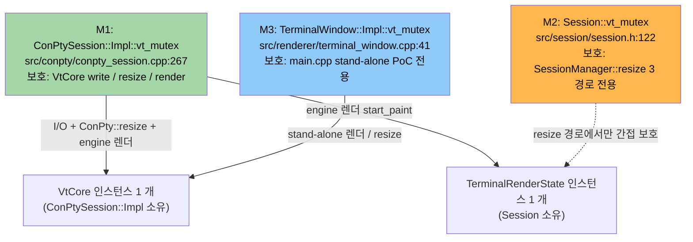

# vt-mutex-redesign — 자물쇠 통합 정리 계획

> **부모 마일스톤**: Pre-M11 Backlog Cleanup, Group 4 #10
> **상태**: Plan 갱신됨 (2026-04-15) — **4명 병렬 코드 재검증 결과 반영**
> **최초 Placeholder**: 2026-04-14

---

## 맨 위 요약 (1~2 문장)

VT 엔진을 보호하는 자물쇠가 **같은 이름으로 세 개** 존재하는 상태를 정리한다. 원래 Placeholder 는 "이중화 + 데드락 위험 + 이전 통합 시도 되돌림" 이라 적었으나, **코드 재검증 결과 그 진단이 부정확**했다. 실제 작업은 **소규모 리팩토링** 에 해당한다.

---

## Executive Summary

| 관점 | 내용 |
|------|------|
| **Problem** | `ConPtySession::Impl::vt_mutex` (M1), `Session::vt_mutex` (M2), `TerminalWindow::Impl::vt_mutex` (M3) 세 자물쇠가 같은 이름으로 공존. M2 는 `SessionManager::resize_*` 3 경로 전용, M1 은 실질 VT 보호자, M3 는 `src/main.cpp` stand-alone PoC 전용. ADR-006 문서는 이 구조를 반영하지 못함 |
| **Solution** | **M2 제거 + M1 으로 통합**. 단순 삭제는 아님 — `ConPtySession::resize` 를 두 함수로 분리하고 resize 3 경로 패턴을 변경해야 함 |
| **Function/UX Effect** | 사용자 체감 없음. 내부 일관성 개선 + 미래 부채 예방 |
| **Core Value** | ADR-006 과 코드 간 단일 소스 확보. dual-mutex 분기 주석 삭제 가능 |

---

## 배경 — Placeholder 에 적혀 있던 진단이 왜 부정확했나

2026-04-14 에 작성된 원 Placeholder 는 다음 세 가지를 주장했다.

| Placeholder 주장 | 코드 재검증 결과 |
|------------------|------------------|
| "이중화 (dual mutex)" | **삼중화**. M1, M2, M3 세 개 존재 (Agent 1, Agent 4 확인) |
| "데드락 위험" | **현 HEAD 에서 재현 불가**. 잠금 순서 단방향 (M2→M1), 역방향 경로 0 건 (Agent 2 확인) |
| "이전 통합 시도 → shutdown race → 되돌림" | **git 히스토리로 입증 안 됨**. `git log --all -G "vt_mutex"` 및 reflog 무결과. "shutdown race 되돌림"은 별개 작업 (I/O 스레드 join 타임아웃, commit `3a28730`) 과 혼동된 것으로 보임 (Agent 3 확인) |

즉 원 Placeholder 는 **기억/추정 기반 서술**이었을 가능성이 높다. Plan 갱신본은 **코드베이스 사실에만 의존**한다.

---

## 지금 어떻게 작동하는가

### 자물쇠 3 개의 위치와 역할



### 현재 M2 의 잔존 역할

M2 는 도입 당시 (`cf66be9`, 2026-04-04 Phase 5-B) "per-session 격리 + I/O + 렌더 + 메인 3-way 동기화" 의도였으나, 3 일 뒤 `8e4e6c2` 의 "dual-mutex bug fix" 로 **렌더/IO 는 M1 으로 이전**되었다. 그 결과 M2 의 현재 잔존 역할은 단 하나다.

> `SessionManager::resize_*` 3 경로에서 `conpty->resize()` 와 `state->resize()` 두 호출의 **원자성 보장**

사용처 전수 (Agent 1 확인):

| # | 위치 | 함수 | 호출자 |
|---|------|------|--------|
| A | `session_manager.cpp:328` | `resize_all` | **dead code** (호출자 0 건) |
| B-1 | `session_manager.cpp:396` | `resize_session` | `gw_session_resize` → C# `EngineService.SessionResize` (실제 호출 0 건, 확실하지 않음) |
| B-2 | `session_manager.cpp:396` | `resize_session` | `gw_surface_create` → WPF UI 스레드 (HwndHost 콜백) |
| B-3 | `session_manager.cpp:396` | `resize_session` | `gw_surface_resize` → WPF UI 스레드 (`OnRenderSizeChanged`) |
| C | `session_manager.cpp:414` | `apply_pending_resize` | `SessionManager::activate` → UI 스레드 추정 |

**모든 실호출 경로가 WPF UI 스레드 단일**. 다른 스레드가 M2 를 잡는 코드는 0 건.

---

## 문제 상황 — 사용자 체감 없음, 내부 부채

M2 자체는 **데드락 / race 를 유발하지 않음** (Agent 2 확인). 문제는 다음 두 가지다.

1. **ADR-006 문서와 코드의 불일치**: ADR 은 "Impl 내부 단일 `vt_mutex`" 를 기술하지만 실제 코드는 3 개 공존. "Phase 3 마이그레이션 노트" 도 3-way 동기화를 명시하나 코드는 그 형태가 아님
2. **dual-mutex 경고 주석이 영구 잔존**: `ghostwin_engine.cpp:139` 의 `// Use ConPtySession's internal vt_mutex (NOT Session::vt_mutex)` 주석은 "실수로 M2 를 잡으면 visibility 가 깨진다" 는 함정을 명시하는 코드 냄새. M2 가 살아있는 한 이 함정은 계속 열려 있음

체감 없는 부채이지만, M-11 이후 새 기능 (session-restore 등) 이 추가되면 "M1 잡아야 하는지 M2 잡아야 하는지" 혼동 가능성이 커진다.

---

## 해결 방법 — M2 제거, 단 단순 삭제 불가

### 핵심 아이디어

M2 로 묶이던 `conpty->resize() + state->resize()` 원자성 보장을 **M1 아래로 이동**. `ConPtySession::resize` 를 **PTY syscall 부분** 과 **VT+멤버 갱신 부분** 으로 분리해서 caller 가 묶어서 처리하도록 한다.

### 의사 코드 (Before → After)

**Before (M2 사용)**:
```cpp
std::lock_guard lock(sess->vt_mutex);           // M2
sess->conpty->resize(cols, rows);                // 내부에서 M1 lock+unlock
sess->state->resize(cols, rows);                 // M2 보호만
```

**After (M1 통합)**:
```cpp
sess->conpty->resize_pty_only(cols, rows);       // PTY syscall, M1 밖
{
    std::lock_guard lock(sess->conpty->vt_mutex());  // M1
    sess->conpty->vt_resize_locked(cols, rows);
    sess->state->resize(cols, rows);
}
```

### 왜 단순 삭제가 안 되는가

M2 를 그냥 빼면 두 가지 race 가 즉시 발생한다 (Agent 2 정적 검증).

| 시나리오 | 호출 시퀀스 | 결과 |
|----------|-------------|------|
| **A. 부분 적용 잔상** | UI 가 `conpty->resize(80,30)` 완료, 렌더 스레드가 M1 잡고 `start_paint` 진입, `state` 는 아직 120x40 | 새 VT 데이터를 옛 layout 으로 렌더 → garbage column 1 프레임 |
| **B. `_api.reshape` 도중 진입** | `state->resize` 가 `cell_buffer` move 직후 `cap_cols` 갱신 전, 렌더가 M1 만 잡고 `_api.row(r)` 호출 | **heap OOB read/write** (실제 크래시 가능) |

→ `state->resize` 를 반드시 **같은 M1 아래로 넣어야** 안전.

---

## 왜 안전한가

| 근거 | 출처 |
|------|------|
| `state->resize` 는 다른 mutex 안 잡음 (leaf) | Agent 3, `render_state.cpp:231-299` 전수 확인 |
| `state->resize` 는 DX11 / COM / ghostty C API 호출 없음 | Agent 3 |
| M1 은 leaf mutex — 재진입 / 역순 경로 없음 | Agent 2 |
| 모든 실호출 경로가 WPF UI 스레드 단일 | Agent 1 |
| 현재 HEAD 코드에 데드락 경로 0 건 | Agent 2 |

**유일한 부수 효과**: `state->resize` slow path 에서 `std::vector<CellData>` 재할당 + memcpy 발생. M1 보유 시간이 늘어나 I/O 스레드가 잠시 대기. 단 `RenderFrame::reshape` 은 monotonic high-water mark 설계라 일반 사용 시 fast path (메타데이터만) 진입.

---

## 작업 범위

### 필수 작업 (M2 제거)

| # | 위치 | 변경 내용 | LOC 추정 |
|---|------|-----------|---------|
| 1 | `src/conpty/conpty_session.h` / `.cpp` | `resize_pty_only(cols,rows)` + `vt_resize_locked(cols,rows)` 신설. 기존 `resize()` 는 둘을 호출하는 얇은 래퍼로 유지 (호환성) | ~50 |
| 2 | `src/session/session_manager.cpp:321-337, 392-399, 412-418` | After 패턴 적용 | ~30 |
| 3 | `src/session/session.h:122` | `std::mutex vt_mutex;` 필드 제거 | 1 |
| 4 | `src/session/session.h:8-9, 91, 119, 120` | "vt_mutex 로 보호" 주석을 "M1 (`ConPtySession::vt_mutex()`) 로 보호" 로 수정 | ~5 |
| 5 | `src/renderer/render_state.h:112`, `render_state.cpp:246` | contract 주석 명확화 ("`ConPtySession::vt_mutex()` 사용") | ~4 |
| 6 | `src/engine-api/ghostwin_engine.cpp:139-141` | "NOT Session::vt_mutex" 경고 주석 단순화 (M2 사라지면 의미 없음) | ~3 |

소계: 코드 변경 ~90 LOC

### 부수 작업 (선택)

| # | 항목 | 위치 | 본 cycle 포함 여부 |
|---|------|------|:------------------:|
| 7 | `SessionManager::resize_all` dead code 제거 | `session_manager.cpp` | **포함 권장** (확인 작업만 필요) |
| 8 | `force_all_dirty()` race (시나리오 D, 기존 부채) | `ghostwin_engine.cpp:142` | **별도** (M2 와 무관) |
| 9 | M3 (`TerminalWindow::Impl::vt_mutex`) 정리 | `terminal_window.cpp`, `main.cpp` | **별도** (stand-alone PoC 활용도 확인 필요) |
| 10 | `EngineService.SessionResize` C# dead code | `EngineService.cs:117` | **별도** (동적 호출 확인 필요) |

### 문서 작업

| # | 위치 | 변경 내용 |
|---|------|-----------|
| 11 | `docs/adr/006-vt-mutex-thread-safety.md` | 실제 코드 구조 반영. "Alacritty 동일 패턴" claim 은 저장소 내 근거 없음으로 표기 |
| 12 | `C:\Users\Solit\obsidian\note\Projects\GhostWin\ADR\adr-006-vt-mutex.md` | 동일 (SoT 정합) |
| 13 | 본 plan 문서 | 본 갱신으로 완료 |
| 14 | `Backlog/tech-debt.md` #1 | "이중화" → 정리 작업 명세 |

---

## 비교표 — 원 Placeholder vs 갱신본

| 항목 | 원 Placeholder (2026-04-14) | 갱신본 (2026-04-15) |
|------|----------------------------|---------------------|
| 자물쇠 수 | 이중화 (2 개) | **3 개** (M1+M2+M3) |
| 데드락 위험 | 있다고 주장 | **현 코드에 없음** (정적 검증 완료) |
| 이전 통합 시도 | "위임 방식 → shutdown race 유발 → 되돌림" | **git 무근거**. 작성자 기억/추정 가능성 |
| 해결 방향 | Single-writer / RwLock / lock-free queue 3 후보 | **M2 제거 + M1 통합** (단순화) |
| Plan LOC 예상 | ~300 | 본 문서 (~200) |
| Design LOC 예상 | ~500 | ~200 (ADR 개정 초안 포함) |
| Do 범위 | "중-대" | **중-소** (~90 LOC) |

---

## 확실하지 않은 부분 (진입 전 확인)

- ⚠️ `ResizePseudoConsole` syscall 을 M1 밖에서 호출해도 안전한가 — 현재 코드도 syscall 후 M1 획득 사이 window 가 존재하므로 **기존 동작 유지**로 판단하나 100% 단정 어려움 (Agent 2)
- ⚠️ `EngineService.SessionResize` C# dead code 확인 — grep 결과 0 건이나 동적/리플렉션 호출 가능성 (Agent 1)
- ⚠️ 부수 작업 #7 ~ #10 본 cycle 포함 여부 — Design 에서 결정

---

## 진입 조건

- [x] 코드 재검증 완료 (4 명 병렬, 2026-04-15)
- [x] Plan 갱신 완료 (본 문서)
- [ ] ADR-006 개정 완료 (Task #2)
- [ ] `Backlog/tech-debt.md` #1 갱신 완료 (Task #3)
- [ ] `/pdca design vt-mutex-redesign` 진입 (Task #4)

---

## 요약 한 줄

세 개의 자물쇠 중 **M2 를 제거하고 M1 으로 통합**. 원 Placeholder 가 가정한 데드락/위임 race 는 코드에 없고, 실제 작업은 `ConPtySession::resize` 분리 + 3 경로 패턴 변경 + 문서 갱신으로 **약 90 LOC + 문서**.

---

## 관련 문서

- `docs/adr/006-vt-mutex-thread-safety.md` (본 계획과 동시 개정)
- Obsidian `ADR/adr-006-vt-mutex.md` (SoT)
- Obsidian `Backlog/tech-debt.md` #1
- Obsidian `Milestones/pre-m11-backlog-cleanup.md` Group 4 #10
- Obsidian `Architecture/conpty-integration.md`
- 이전 dual-mutex fix commit: `8e4e6c2` (2026-04-07)
- M2 도입 commit: `cf66be9` (2026-04-04)
