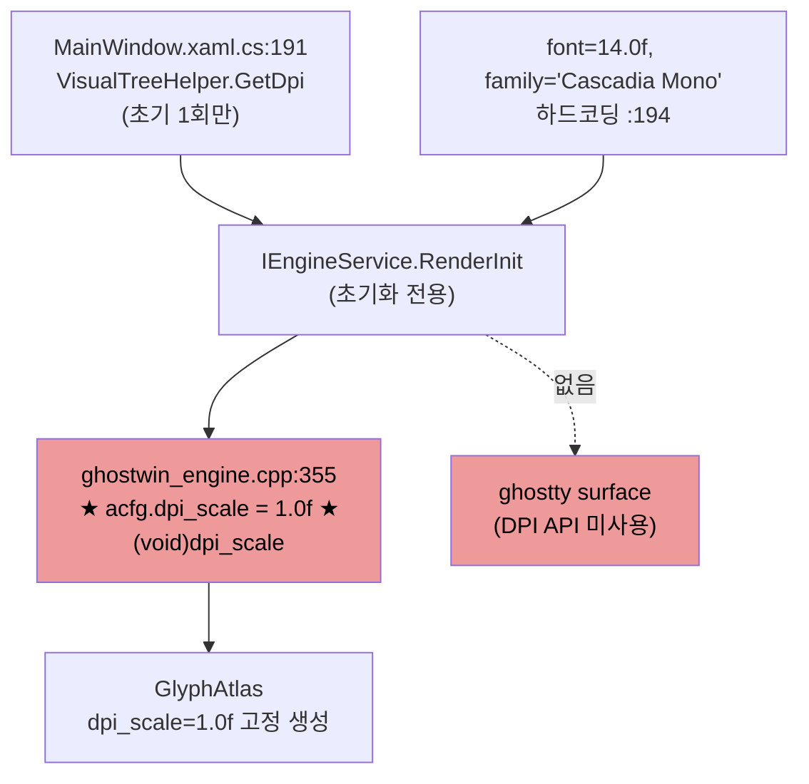
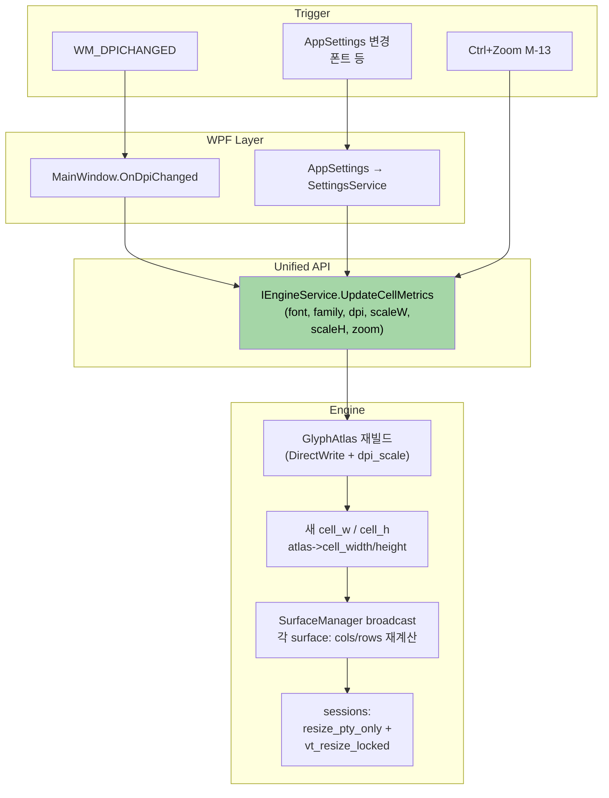
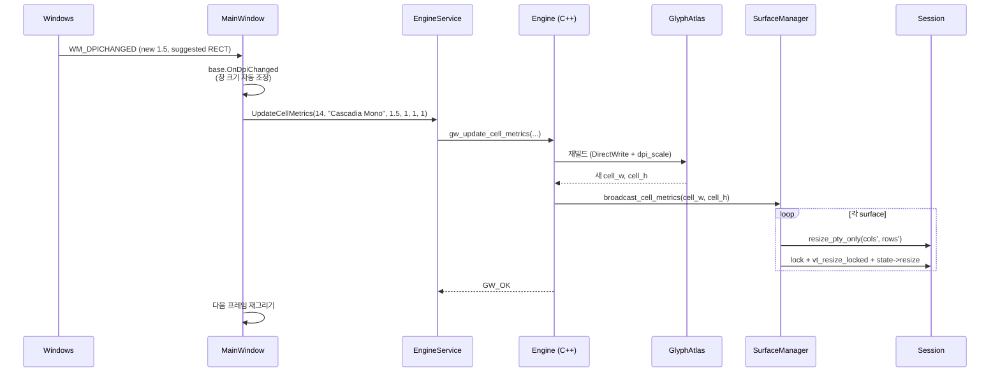
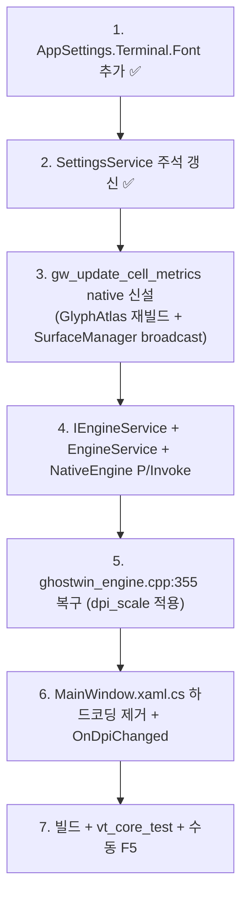

# dpi-scaling-integration Design Document

> **Summary**: DPI/폰트/줌 을 단일 API `UpdateCellMetrics` 로 받고, ghostty C API 3 개 (`set_content_scale`, `set_size`, `CELL_SIZE action`) 통합, WPF `DpiChanged` 런타임 핸들러 추가, `AppSettings.Terminal.Font` 선제 확장, `ISettingsObserver` 활성화.
>
> **Project**: GhostWin Terminal
> **Author**: 노수장
> **Date**: 2026-04-15
> **Status**: **Design 초안 v2** (Plan 갱신: 2026-04-15, 5 결정: B / **N/A** / B / B / B — 결정 2 는 코드 검증 결과 구조상 해당 없음)
> **Plan**: [dpi-scaling-integration.plan.md](../../01-plan/features/dpi-scaling-integration.plan.md)

---

## Executive Summary

| Perspective | Content |
|-------------|---------|
| **Problem** | `ghostwin_engine.cpp:355` 에서 `dpi_scale` 무시. 런타임 DPI 변경 핸들러 부재. 설정 시스템 이원화 + `ISettingsObserver` 구현 0 건. M-12 Settings UI 수용 불가 상태 |
| **Solution** | 통합 API `UpdateCellMetrics(font, family, dpi, scaleW, scaleH, zoom)` 단일 진입점 + `GlyphAtlas` 재빌드 + `SurfaceManager` broadcast + WPF `OnDpiChanged` override + `AppSettings.Terminal.Font` 선제 추가 + `ISettingsObserver` 인프라 활성화 (C# primary) |
| **Function/UX Effect** | 고 DPI 모니터 선명 렌더 + 모니터 이동 자동 반응 + M-12 폰트 UI 가 즉시 반영 (앱 재시작 불필요) |
| **Core Value** | Pre-M11 재설계 마지막. 스케일 파이프라인 확립 + M-12 수용 기반 |

---

## 1. 목표와 비목표

### 목표

1. `UpdateCellMetrics` 통합 런타임 API 신설 + `GlyphAtlas` 재빌드 + `SurfaceManager` broadcast
2. WPF `OnDpiChanged` 런타임 핸들러 (모니터 이동 대응)
3. `AppSettings.Terminal.Font` 선제 확장 (M-12 UI 가 바인딩만)
4. `ISettingsObserver` 인프라 활성화 (C# primary 모델 — §4.9)
5. `MainWindow.xaml.cs:194` 의 하드코딩 (`14.0f`, `"Cascadia Mono"`) 제거
6. 회귀 없음 (vt_core_test + 빌드 경고 0)

### 비목표

- 줌 단축키 (`Ctrl+=` / `Ctrl+-`) — M-12 UX 범위
- M-12 설정 창 UI 자체 — M-12 별도
- 멀티 DPI 시각 테스트 자동화 — 별도 cycle
- `file_watcher.cpp` 의 `CancelIo`→`CancelIoEx` 통일 — 별도
- **ghostty `ghostty_surface_*` API 통합** — GhostWin 구조상 해당 없음 (§참고)

### 참고: ghostty API 사용 범위 명확화

GhostWin 은 ghostty 의 **VT 파서 + render state 모듈만** 사용 (`ghostty_terminal_t`, `ghostty_render_state_t`). Surface / pty 하이레벨 모듈 (`ghostty_surface_t`, `ghostty_pty_t`) 은 **사용하지 않고** 자체 구현 (DX11 swapchain + Win32 ConPTY).

따라서 `ghostty_surface_set_content_scale` / `set_size` / `GHOSTTY_ACTION_CELL_SIZE` 는 GhostWin 의 `RenderSurface` (`surface_manager.h:29-42`) 와 **별개 개념** — 통합 대상이 아님. 셀 크기 재계산은 GhostWin 자체 `GlyphAtlas` (DirectWrite 래퍼) 가 담당하며, `dpi_scale` 은 GlyphAtlas 가 소비한다.

**결정 2 = N/A** (애초에 해당 없음).

---

## 2. 현재 상태 (Before)

### 2.1 구조



### 2.2 현재 구현된 배선 (유지)

- `app.manifest` — PerMonitorV2 ✅
- `VisualTreeHelper.GetDpi` — WPF 측 DPI 획득 ✅
- `IEngineService.RenderInit(..., float dpiScale)` P/Invoke 시그니처 ✅
- `ghostwin_engine.cpp:313` — `float dpi_scale` 파라미터 수신 ✅
- `GlyphAtlas` 의 `dpi_scale` 수식 소비 경로 ✅ (입력만 1.0 고정)

### 2.3 차단 지점

- `ghostwin_engine.cpp:355` — 엔진이 받은 DPI 를 무시
- `MainWindow.xaml.cs:194` — 폰트 하드코딩
- `MainWindow` 에 `OnDpiChanged` override 부재
- `gw_render_resize` 에 DPI 인자 없음
- `UpdateCellMetrics` 런타임 API 부재 → 재빌드 경로 자체가 없음
- `AppSettings` 에 Font 필드 부재
- `ISettingsObserver` 구현자 0 건

---

## 3. 목표 상태 (After)

### 3.1 전체 파이프라인



### 3.2 호출 시퀀스 (사용자가 150% 모니터로 창 이동)



---

## 4. 상세 작업 명세

### 4.1 C++ Engine — 통합 API

**파일**: `src/engine-api/ghostwin_engine.h`, `.cpp`

**신규 native 함수**:

```cpp
// ghostwin_engine.h
GWAPI int gw_update_cell_metrics(GwEngine engine,
    float font_size_pt,
    const wchar_t* font_family,
    float dpi_scale,
    float cell_w_scale,
    float cell_h_scale,
    float zoom);
```

**구현 흐름** (`.cpp`):
1. 파라미터 null/범위 검증
2. `effective_font_pt = font_size_pt * zoom` 계산
3. `AtlasConfig` 구성 후 `GlyphAtlas::create_or_rebuild(..., dpi_scale)` 호출
4. `eng->atlas` 교체 (기존 shared_ptr 패턴으로 render thread race 방지)
5. `SurfaceManager::broadcast_cell_metrics()` 호출 (§4.4)
6. `GW_OK` 반환

**`gw_render_init` 변경**:
```cpp
// :352-356 현재
// TODO: DPI-aware rendering requires coordinated cell size + viewport + ConPTY resize.
// Simply passing dpi_scale here makes cells larger while viewport stays the same,
// causing text overflow. Needs proper design cycle. Keep 1.0f for now.
acfg.dpi_scale = 1.0f;
(void)dpi_scale;

// :352-356 변경 후
// Initial DPI applied here. Runtime DPI changes (monitor move, settings)
// flow through gw_update_cell_metrics() which atomically coordinates
// atlas rebuild + surface broadcast + per-session resize, resolving the
// "text overflow" concern from 31a2235 → 3a28730.
acfg.dpi_scale = (dpi_scale > 0.0f) ? dpi_scale : 1.0f;
```

### 4.2 GlyphAtlas — 런타임 재빌드

**파일**: `src/renderer/glyph_atlas.h`, `.cpp`

현재 `GlyphAtlas::create` 만 있음. 재빌드는 새 인스턴스 생성 + 기존 해제 패턴.

**추가 고려**:
- 이전 atlas 파괴 타이밍 — 렌더 스레드가 사용 중이면 shared_ptr alias 활용 (vt-mutex cycle 패턴 재사용)
- Engine `eng->atlas` 가 현재 `std::unique_ptr` 인지 확인, `shared_ptr` 로 승격 필요 여부 Design review

**권장**: Engine `atlas` 를 `shared_ptr<GlyphAtlas>` 로 승격. render thread 가 frame 시작 시 `atlas_` 를 local shared_ptr 로 복사. 교체 중에도 이전 atlas 안전 참조.

### 4.3 ghostty API 통합 — **해당 없음 (N/A)**

~~ghostty C surface API 통합~~ — **GhostWin 에 존재하지 않는 개념**이라 제거.

**근거** (코드 검증):
- `surface_manager.h:29-42` — `RenderSurface` 는 DX11 `IDXGISwapChain2` 기반. ghostty surface 와 무관
- GhostWin 이 ghostty 에서 사용하는 모듈: **`ghostty_terminal_t` + `ghostty_render_state_t`** (VT 파서 + render state) 만
- `ghostty_surface_*`, `ghostty_pty_*` 은 ghostty 상위 (Exec, pty) 모듈 — GhostWin 이 자체 구현 (Win32 ConPTY)

**cell 크기 재계산 담당**: 자체 `GlyphAtlas` (DirectWrite 래퍼). `AtlasConfig.dpi_scale` 을 소비해 font metrics × dpi_scale 로 px 크기 산출. ghostty 개입 없음.

### 4.4 SurfaceManager broadcast

**파일**: `src/engine-api/surface_manager.*` (구조 확인 필요)

**새 broadcast 로직**은 `SurfaceManager` 내부가 아니라 **`EngineImpl::update_cell_metrics`** 안에서 수행. 이유: `SurfaceManager` 는 session 접근자가 없고 (non-owning), `SessionManager` 와 `SurfaceManager` 둘 다 `EngineImpl` 이 소유하므로 엔진 레벨에서 조율이 자연스러움.

```cpp
// ghostwin_engine.cpp 내부 (gw_update_cell_metrics 안)
auto cell_w = eng->atlas->cell_width();
auto cell_h = eng->atlas->cell_height();
for (auto& surf : eng->surface_mgr->active_surfaces()) {  // shared_ptr snapshot
    uint16_t cols = std::max<uint16_t>(1, surf->width_px / cell_w);
    uint16_t rows = std::max<uint16_t>(1, surf->height_px / cell_h);
    auto session = eng->session_mgr->get(surf->session_id);  // shared_ptr
    if (!session || !session->conpty) continue;

    // vt-mutex-redesign cycle 에서 확립된 분리 패턴 재사용
    session->conpty->resize_pty_only(cols, rows);
    std::lock_guard lock(session->conpty->vt_mutex());
    session->conpty->vt_resize_locked(cols, rows);
    session->state->resize(cols, rows);
}
```

**안전성** (vt-mutex cycle 과 동일 근거):
- `active_surfaces()` 는 shared_ptr snapshot — 중간에 destroy 되어도 안전
- `SessionManager::get(id)` 도 shared_ptr 반환 — cleanup 과 race 방지
- lock 순서 단방향 (M1 만), 데드락 위험 없음

### 4.5 WPF — OnDpiChanged

**파일**: `src/GhostWin.App/MainWindow.xaml.cs`

```csharp
protected override void OnDpiChanged(DpiScale oldDpi, DpiScale newDpi)
{
    base.OnDpiChanged(oldDpi, newDpi);  // WPF 자동 창 크기 조정 수용

    var font = _settingsService.Settings.Terminal.Font;
    _engineService.UpdateCellMetrics(
        fontSizePt: (float)font.Size,
        fontFamily: font.Family,
        dpiScale: (float)newDpi.DpiScaleX,
        cellWidthScale: (float)font.CellWidthScale,
        cellHeightScale: (float)font.CellHeightScale,
        zoom: 1.0f);
}
```

**하드코딩 제거** (`:194`):
```csharp
// Before
int renderInitRc = _engine.RenderInit(IntPtr.Zero, 100, 100, 14.0f, "Cascadia Mono", dpiScale);

// After
var font = _settingsService.Settings.Terminal.Font;
int renderInitRc = _engine.RenderInit(
    IntPtr.Zero, 100, 100,
    (float)font.Size, font.Family, dpiScale);
```

### 4.6 C# — AppSettings 확장

**파일**: `src/GhostWin.Core/Models/AppSettings.cs`

```csharp
public sealed class AppSettings {
    // ... 기존 ...
    public TerminalSettings Terminal { get; set; } = new();  // ← 신규
}

public sealed class TerminalSettings {
    public FontSettings Font { get; set; } = new();
}

public sealed class FontSettings {
    public double Size { get; set; } = 14.0;
    public string Family { get; set; } = "Cascadia Mono";
    public double CellWidthScale { get; set; } = 1.0;
    public double CellHeightScale { get; set; } = 1.0;
}
```

JSON 직렬화 자동 지원 (System.Text.Json 기본). 기존 설정 파일에 `Terminal` 없으면 default 사용.

### 4.7 IEngineService 인터페이스

**파일**: `src/GhostWin.Core/Interfaces/IEngineService.cs`

```csharp
int UpdateCellMetrics(
    float fontSizePt,
    string fontFamily,
    float dpiScale,
    float cellWidthScale,
    float cellHeightScale,
    float zoom);
```

**구현** (`src/GhostWin.Interop/EngineService.cs`):
```csharp
public int UpdateCellMetrics(...) =>
    NativeEngine.gw_update_cell_metrics(_engine,
        fontSizePt, fontFamily, dpiScale,
        cellWidthScale, cellHeightScale, zoom);
```

**P/Invoke** (`NativeEngine.cs`):
```csharp
[DllImport(...)]
internal static extern int gw_update_cell_metrics(
    IntPtr engine,
    float fontSizePt,
    [MarshalAs(UnmanagedType.LPWStr)] string fontFamily,
    float dpiScale,
    float cellWidthScale,
    float cellHeightScale,
    float zoom);
```

### 4.8 C++ SettingsManager Observer 활성화

**파일**: `src/settings/settings_manager.cpp` + 신규 observer

**신규 클래스**:
```cpp
class CellMetricsObserver : public ISettingsObserver {
public:
    explicit CellMetricsObserver(Engine* engine) : engine_(engine) {}
    void on_settings_changed(const AppConfiguration& cfg,
                              ChangedFlags flags) override {
        if (flags & (ChangedFlags::TerminalFont | ChangedFlags::TerminalWindow)) {
            engine_->update_cell_metrics(
                cfg.terminal.font.size_pt,
                cfg.terminal.font.family,
                /* dpi */ engine_->current_dpi(),
                cfg.terminal.font.cell_width_scale,
                cfg.terminal.font.cell_height_scale,
                /* zoom */ 1.0f);
        }
    }
private:
    Engine* engine_;
};
```

**등록**: `Engine` 생성 시 `settings_mgr->register_observer(std::make_shared<CellMetricsObserver>(this))`

### 4.9 C# ↔ C++ 설정 브릿지 (단일 출처)

**결정 사항** (Design review 에서 확정):

**후보 1 — C# primary + C++ mirror**:
- C# `SettingsService` 가 단일 출처
- 설정 변경 시 `IEngineService.UpdateCellMetrics` 직접 호출
- C++ `SettingsManager` 는 observer 만 유지 (C++ 내부 컴포넌트가 설정을 받는 용도, C# 이벤트 브릿지 불필요)

**후보 2 — C++ primary + C# wrapper**:
- C++ `SettingsManager` 가 단일 출처
- C# 은 P/Invoke 로 읽기
- 설정 변경 시 C++ observer 체인 작동

**권장 (Design review 에서 확정)**: **후보 1**. 이유:
- 현재 `SettingsService` 가 이미 주 출처 역할
- C++ `settings_manager` 에 observer 등록자가 0 명이라 사실상 inactive
- 후보 2 는 C# 에서 WPF 바인딩을 C++ 측과 양방향 동기화 필요 → 복잡도 큼

**C++ Observer 활성화 범위**: C++ 내부 컴포넌트가 설정을 참조해야 할 때만 (예: 향후 `file_watcher`, `tsf` 의 설정 연동). 현 cycle 에서는 **infrastructure 만 깨워두기** (구현 껍데기 + 단위 테스트 수준). 실제 `CellMetricsObserver` 는 C# 이 직접 `UpdateCellMetrics` 호출하는 방식으로 대체 — **§4.8 CellMetricsObserver 는 선택 작업으로 격하**.

---

## 5. 구현 순서 (Do phase 체크리스트)



§4.3 ghostty 통합 제거로 **10 단계 → 7 단계**. S1, S2 이미 완료.

---

## 6. 테스트 계획

### 6.1 기존 (회귀)

| 테스트 | 기대 |
|--------|:---:|
| `vt_core_test` (10) | PASS |
| 솔루션 빌드 + 경고 0 | PASS |

### 6.2 수동 F5 검증 (사용자 hardware)

| 시나리오 | 기대 |
|----------|------|
| 100% 모니터에서 앱 실행 | 기존 대비 시각적 차이 없음 |
| 150% / 175% / 200% 모니터에서 앱 실행 | 폰트 선명, cell 크기 비례 확대, cols/rows 자동 재계산 |
| 100% → 150% 모니터로 창 드래그 이동 | 즉시 반영 (깜빡임 허용, 잔상 없음) |
| Alt+V pane 분할 | 각 pane 이 현재 DPI 에 맞는 cell 크기 사용 |
| `AppSettings.json` 의 `Terminal.Font.Size` 수동 수정 후 앱 재시작 | 새 크기로 반영 (런타임 UI 는 M-12) |

### 6.3 확실하지 않음 — Design review 후 결정

- ghostty `CELL_SIZE action` 콜백 스레드 컨텍스트 (UI vs 엔진 내부)
- atlas 교체 중 렌더 스레드 shared_ptr alias 필요 여부
- `gw_render_resize` 에도 DPI 인자 추가할지 아니면 `UpdateCellMetrics` 만으로 충분할지

---

## 7. 마이그레이션 / 호환성

### API 호환성

- `IEngineService.RenderInit` 시그니처 **유지** (dpi_scale 파라미터 이미 존재)
- `UpdateCellMetrics` 는 **신규** → 기존 호출자 영향 없음
- `AppSettings` 신규 필드 `Terminal` → JSON 없으면 default 적용 (기존 설정 파일 호환)

### 동작 호환성

- 100% DPI 단일 모니터 환경: 시각 변화 없음
- 고 DPI 환경: 이전 (작게 보임) → 올바른 크기 (사용자 체감 개선)
- 모니터 이동: 이전 (앱 재시작 필요) → 즉시 반영

---

## 8. 리스크 + 완화

| 리스크 | 발생 가능성 | 영향 | 완화 |
|--------|:----------:|:----:|------|
| `31a2235` 의 "text overflow" 재발 | 중 | 중 | `UpdateCellMetrics` 가 cols/rows 재계산까지 원자적으로 수행. §4.4 broadcast 패턴 |
| Atlas 재빌드 중 렌더 스레드 race | 저 | 고 | shared_ptr alias (vt-mutex cycle 패턴 재사용) — Do 중 확인 후 필요시 승격 |
| `DpiChanged` + `SizeChanged` 순서 경쟁 | 저 | 중 | WPF 보장 순서 + `base.OnDpiChanged` 우선 호출 |
| C# ↔ C++ 설정 이원화 혼선 | 중 | 중 | **C# primary** 확정 — Observer 는 infrastructure 만 깨워두기 |
| 모니터 이동 시 setWindowPos 누락 | 저 | 저 | `base.OnDpiChanged` 호출로 WPF 자동 처리 수용 |

---

## 9. 확실하지 않은 부분 (Do phase 에서 해소)

| 항목 | 해소 방법 |
|------|-----------|
| `eng->atlas` shared_ptr 승격 필요 여부 | Do phase S3 에서 확인 — render thread race 발견 시 승격. 우선 `unique_ptr + UI 스레드 단일 호출` 가정 |
| `gw_render_resize` 에 DPI 인자 추가 여부 | `UpdateCellMetrics` 만으로 충분하면 생략 |

---

## 10. 체크리스트 (Design → Do 진입 전)

- [x] Plan 갱신 완료
- [x] 5 결정 확정 (BCBBB)
- [x] 본 Design 작성 완료
- [x] 참조 구현 (ghostty + MSDN) 확인
- [x] 작업 순서 10 단계 체크리스트
- [x] 리스크 7 건 + 완화책
- [x] 확실하지 않은 4 항목 명시
- [ ] Design review (사용자 승인)
- [ ] `/pdca do dpi-scaling-integration` 진입

---

## 11. 요약 한 줄

**`UpdateCellMetrics` 단일 API + GlyphAtlas 재빌드 + SurfaceManager broadcast + `OnDpiChanged` + `AppSettings.Terminal.Font` + Observer 인프라 (C# primary)** 를 한 cycle 에 통합. Pre-M11 마지막 재설계.

### v2 개정 기록 (2026-04-15)

- 초안 v1 에서 제안한 **ghostty `ghostty_surface_*` API 통합 (결정 2 = C)** 는 코드 검증 결과 **구조상 해당 없음** 으로 판명 → `N/A` 로 처리
- GhostWin 의 `RenderSurface` 는 DX11 swapchain, ghostty `ghostty_surface_t` 와 별개 개념
- 스코프 축소: 구현 10 단계 → **7 단계**, 예상 LOC ~410 → **~250**

---

## 관련 문서

- [Plan](../../01-plan/features/dpi-scaling-integration.plan.md)
- Obsidian [[Backlog/tech-debt]] #20
- Obsidian [[Milestones/pre-m11-backlog-cleanup]] Group 4 #13
- Obsidian [[Milestones/roadmap]] (M-12)
- 되돌림 commit: `3a28730` (2026-04-14)
- 이전 시도 commit: `31a2235` (2026-04-13)
- MSDN WM_DPICHANGED: https://learn.microsoft.com/en-us/windows/win32/hidpi/wm-dpichanged
- MSDN PerMonitorV2: https://learn.microsoft.com/en-us/windows/win32/hidpi/high-dpi-desktop-application-development-on-windows
- 관련 cycle: vt-mutex-redesign (resize_pty_only + vt_resize_locked 분리 패턴)
