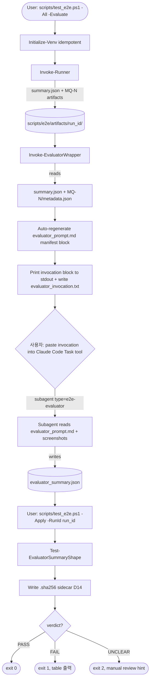

# E2E Evaluator Automation — Design Document

> **Project**: GhostWin Terminal
> **Phase**: 5-E.5 부채 청산 (e2e-test-harness D19/D20 미완 closeout)
> **Author**: 노수장 (CTO Lead, Enterprise team — slim 2-agent council)
> **Date**: 2026-04-08
> **Status**: Council-reviewed-by-CTO-Lead
> **Plan reference**: `docs/01-plan/features/e2e-evaluator-automation.plan.md` v0.1
> **Previous design**: `docs/archive/2026-04/e2e-ctrl-key-injection/e2e-ctrl-key-injection.design.md` v0.2 (R4 closure + G3 pending → 본 cycle 회수)

---

## Executive Summary

| Perspective | Content |
|-------------|---------|
| **Problem** | e2e-test-harness 의 D19/D20 분리 원칙(Operator vs Evaluator) 중 Evaluator wiring 이 미완. `scripts/test_e2e.ps1 -All` 후 사용자가 Claude Code Task tool 을 수동 호출해야 8 MQ pass/fail 판정 가능. `scripts/e2e/evaluator_prompt.md` 자체가 Step 11.1 에서 deferred 됐고, e2e-ctrl-key-injection cycle G3 도 pending 으로 closeout. 본 cycle 은 그 final mile 을 닫는다. |
| **Solution** | 14개 결정 (D1-D14) 으로 4-component 자동화 lock-in: (1) **Option C** project-local `.claude/agents/e2e-evaluator.md` (Sonnet 4.6, Read tool only) — qa-strategist council 결과 prior A 30%→0%, B 50%→35%, **C 20%→65%**. (2) `scripts/test_e2e.ps1` 에 `-Evaluate` / `-EvaluateOnly` / `-Apply` 3-mode switch 추가 (~35-45 LOC). (3) `evaluator_summary.json` 을 `summary.json` sibling 으로 저장 (D19/D20 분리는 write-authority 정책, SHA256 sidecar 로 enforcement). (4) Hybrid `evaluator_prompt.md` — manual expected-behavior prose + auto-regenerated scenario manifest block. False negative 방지를 위한 **5-layer safeguard** (confidence threshold → unclear 강제, operator_notes cross-validation, PaneNode unit backstop, hardware smoke parallel cross-check, match_rate < 0.875 → FAIL). |
| **Function/UX Effect** | 사용자 가시 변경 0. 개발자/QA: (a) `scripts/test_e2e.ps1 -All -Evaluate` 실행 → Operator 8/8 + 클립보드 paste 용 invocation block + `evaluator_invocation.txt` 파일 출력 → 사용자가 Task tool 한 번 paste → `evaluator_summary.json` 생성 → `scripts/test_e2e.ps1 -Apply -RunId <id>` 로 verdict 확정. (b) e2e-ctrl-key-injection v0.2 §11.4 G3 retroactive close. (c) bisect-mode-termination v0.2 §10.1 evidence 추가. (d) PaneNode 9/9 + hardware 5/5 backstop 으로 false negative critical risk 통제. |
| **Core Value** | "**프레임워크가 자기 자신의 분리 원칙을 끝까지 닫는다**". D19/D20 은 설계 시점에 분리됐지만 wiring 이 미완이라 manual 의존이 잔존. 본 design 은 Option C project-local agent + 3-mode wrapper + hybrid prompt + 5-layer safeguard 로 그 final mile 을 닫는다. 동시에 council 의 R-C2 (screenshot filename drift) 발견은 Plan 이 놓친 contract 취약점을 사전 봉쇄했고, R-C3 (write-authority leak) 는 D19/D20 을 정책에서 runtime guard 로 격상시킨다. |

---

## 1. Council Synthesis

slim 2-agent council 패턴 (Enterprise Design pattern 의 정밀 적용):
- **rkit:qa-strategist** — Evaluator rubric / D20 schema / failure taxonomy / false positive·negative 정책 / `evaluator_prompt.md` 골격
- **rkit:code-analyzer** — Wrapper wiring / `test_e2e.ps1` impact / artifact contract / `feature` field 위험성 / 3-risk 구조 분석
- **CTO Lead (Opus)** — Synthesis, Q1-Q8 lock-in, risk integration, implementation order

### 1.1 qa-strategist 관점 — Evaluator rubric path

qa-strategist 는 Plan 의 H1 (gap-detector 30%) / H2 (general-purpose 50%) / H3 (project-local 20%) prior 를 **C 65% / B 35% / A 0%** 로 재조정했다. 핵심 reasoning:

- **gap-detector 폐기 (H1=0%)**: gap-detector 는 design 문서 vs 코드 비교 도구. PNG visual evaluation 은 도구 mission 밖. tool surface 가 fit 하지 않으면 prompt tuning 부담만 증가.
- **general-purpose 차순위 (H2=35%)**: prompt 길이 제한 없음 + multimodal 지원이 장점이지만, tool surface 가 전체 개방이라 Bash/Write/Edit 부작용 위험. session 간 stochasticity (R-C) 가 가장 취약.
- **project-local agent 1순위 (H3=65%)**: `.claude/agents/e2e-evaluator.md` 정의 + Read tool only + agent definition 에 prompt 임베드 → tool surface 최소화 + token 예산 명확 + 새 MQ 추가 시 single source. **Falsification trigger**: project-local agent 가 CC 현재 버전에서 invoke 안 되면 Option B 로 폴백.

추가로 **5-layer false negative safeguard** 를 명시:
1. Confidence threshold: `confidence=low` → `pass=true` 도 `unclear` 로 강제 재분류
2. Operator notes cross-validation: `metadata.json.operator_notes` 의 `pane_count`, `workspace_count` 를 ground truth 로 사용
3. PaneNode unit 9/9 backstop (logic 검증)
4. Hardware manual smoke 5/5 parallel cross-check (첫 3 cycle 동안)
5. `match_rate < 0.875` → `verdict = "FAIL"` 강제

R-NEW-1 (DPI 불일치 시각 판단), R-NEW-2 (cascade failure 오진), R-NEW-3 (stdout 캡처 책임 공백) 을 새 risk 로 flag.

### 1.2 code-analyzer 관점 — Wiring path

code-analyzer 는 `scripts/test_e2e.ps1` (60 LOC, `:38-138`) 과 `runner.py` (`:344, :360-374`) 를 직접 read 하고 `diag_all_h9_fix` 의 실제 artifact 구조를 검증했다. 핵심 결정:

- **Q2**: `test_e2e.ps1` 에 `-Evaluate` switch 추가 (별도 `evaluate_run.ps1` 거부). 이유: 60 LOC orchestrator 의 venv init / UTF-8 forcing / `$E2ERoot` resolution 보일러플레이트가 그대로 재사용되고, `diag_e2e_all.ps1` 같은 cousin helper 가 `-All -Evaluate` 로 composable. ~35-45 LOC delta, 총 ~110 LOC.
- **Q4**: `evaluator_summary.json` 을 `summary.json` sibling 으로 (서브디렉터리 X). 이유: D19/D20 분리는 write-authority 정책이지 물리적 디렉터리가 아님. 두 파일은 한 atomic run dir 안의 두 owner. git diff / tarball / glob 모두 single-unit 으로 처리 가능.
- **Q7**: Hybrid auto-discovery — `scripts/e2e/e2e_operator/scenarios/mq*.py` glob 으로 scenario id 정적 추출 가능, expected behavior prose 는 manual. wrapper 가 `evaluator_prompt.md` 의 manifest block 을 매 run 마다 regenerate.

`summary.json.feature` field 가 hardcoded `"bisect-mode-termination"` (`runner.py:344`) 인 것을 발견 — Evaluator gating 에 사용 금지. `summary.json` 의 minimum guaranteed contract 를 표로 명시.

3-mode wrapper 패턴 제안:
- `-Evaluate`: Operator → Wrapper → invocation block 출력 + 파일 저장
- `-EvaluateOnly`: 기존 run 만 wrapper (RunId 명시 강제)
- `-Apply`: paste-back 된 `evaluator_summary.json` 검증 + verdict 확정 + exit code 결정

R-C1 (run id race + feature 필드 hardcoded), R-C2 (screenshot filename drift, MQ-1 `01_initial_render.png` vs MQ-2 `after_split_vertical.png` vs MQ-8 `01_before_resize.png`+`02_after_resize.png` 비균질), R-C3 (operator/evaluator write-authority leak via shared dir) 을 새 risk 로 제시.

### 1.3 CTO Lead synthesis

두 council 결과의 **결정 정합성** 검증:

| 항목 | qa-strategist | code-analyzer | 충돌 여부 |
|---|---|---|---|
| Subagent binding | C (project-local) | (out of scope) | 충돌 없음 |
| Wrapper 위치 | (out of scope) | `test_e2e.ps1 -Evaluate` | 충돌 없음 |
| Summary 위치 | (out of scope) | sibling | 충돌 없음 |
| JSON validation | (out of scope) | PowerShell ConvertFrom-Json | 충돌 없음 |
| `evaluator_prompt.md` 골격 | manual prose | hybrid (manual + auto manifest) | **부분 충돌** — code-analyzer 가 prompt 안에 manifest block 추가 권고 |
| Output format | stdout JSON fenced | file 저장 (subagent 가 직접) | **부분 충돌** — qa-strategist 는 stdout, code-analyzer 는 subagent 가 파일 저장 |

부분 충돌 해결:
- **Hybrid prompt** 채택 (code-analyzer + qa-strategist 결합): manual prose section per MQ + 자동 생성 manifest block. wrapper 가 매 run 마다 manifest 만 regenerate.
- **Subagent 가 파일 저장** 채택 (code-analyzer): subagent 는 `Write` tool 권한 필요. project-local agent definition 에서 `Write` 를 추가 허용 (단, `evaluator_summary.json` 한 파일로 제한). qa-strategist 의 stdout fenced block 도 fallback 으로 유지.

추가 결정:
- Q3 (자동화 수준): D19 manual invoke 유지. wrapper 는 stdout + file 출력 + clipboard hint 제공만. CC Task tool 을 PowerShell 에서 직접 호출 불가능 (code-analyzer 명시).
- Q5 (retry): manual only. `-RunId` 인자로 재평가 가능. R-C 대응으로 prompt 강화가 정답.
- Q6 (expected behavior 위치): inline in prompt. YAGNI.
- Q8 (model): Sonnet 4.6. MQ scenarios 가 시각적으로 명확한 구조 검증이라 Opus 불필요. NFR-01 (< 5분) 에 유리.

---

## 2. Locked-in Design Decisions (D1-D14)

Plan §9 의 8 open questions (Q1-Q8) + council 신규 결정 사항 통합 14건.

### 2.1 Subagent + Prompt (D1-D5)

| # | Decision | Options | Rationale |
|---|---|---|---|
| **D1** | **Option C — project-local `.claude/agents/e2e-evaluator.md`** (Sonnet 4.6, Read + Write tool) | A gap-detector / B general-purpose / C project-local | qa-strategist prior C 65%. tool surface 최소화 + token 예산 명확 + agent definition 단일 소스. **Q1 해결** |
| **D2** | **Falsification trigger**: Do phase Step 1 에서 project-local agent invoke 검증. CC 현재 버전에서 정의가 동작 안 하면 Option B (general-purpose) 로 폴백 | — | 가설 failure cost 통제. Plan H3 가 0% 가 되는 시나리오 차단 |
| **D3** | **Hybrid `evaluator_prompt.md` 구조**: manual expected-behavior prose per MQ + 자동 생성 scenario manifest block (`{scenario_id, metadata_json_path, screenshot_glob, operator_notes_excerpt}`) | manual only / auto only / hybrid | manual prose 가 semantic ground truth, manifest 가 path 정확성 보장. **Q6 + Q7 해결** |
| **D4** | **Sonnet 4.6 evaluator model** (Opus 거부) | Sonnet / Opus | MQ 시각적 검증이 구조적이고 (pane count, sidebar 존재, divider) 미묘한 visual reasoning 불필요. NFR-01 latency 유리. **Q8 해결** |
| **D5** | **Inline expected-behavior prose** (별도 YAML 거부) | inline / yaml / hybrid | YAGNI. CI/CD machine-readable 필요시 별도 cycle. **Q6 해결** |

### 2.2 Wrapper (D6-D9)

| # | Decision | Options | Rationale |
|---|---|---|---|
| **D6** | **`scripts/test_e2e.ps1` 에 `-Evaluate` / `-EvaluateOnly` / `-Apply` 3-mode switch 추가** (별도 `evaluate_run.ps1` 거부) | switch / separate script | 60 LOC orchestrator 의 venv/UTF-8/path resolution 재사용. ~35-45 LOC delta, 총 ~110 LOC. `diag_e2e_all.ps1` 같은 cousin helper 와 composable. **Q2 해결** |
| **D7** | **3-mode 책임 분리**: `-Evaluate` (Operator + Wrapper), `-EvaluateOnly` (기존 run wrapper, RunId 강제), `-Apply` (paste-back 검증 + verdict + exit code) | 1-mode / 2-mode / 3-mode | Operator 와 Evaluator handoff 사이 시간 분리 가능. paste-back loop 의 다른 entry point 필요. **Q3 해결** |
| **D8** | **Manual invoke 유지** — wrapper 는 stdout 에 invocation block 출력 + `evaluator_invocation.txt` 파일 저장 + clipboard hint. CC Task tool 자동 호출 시도 X | manual / hybrid / 자동 | code-analyzer 명시: CC Task tool 은 CLI 가 아니라 PS 에서 직접 호출 불가. Plan §2.2 reaffirm. **Q3 해결** |
| **D9** | **Latest run id resolution** (`Resolve-LatestRunId` helper) — `LastWriteTime` 기준, **`-Apply` 모드에서는 사용 금지** (`-RunId` 명시 강제). `-EvaluateOnly` 도 `-RunId` 권장 | timestamp / lexicographic / explicit | `diag_all_h9_fix` 같은 non-timestamp run id 에서 lexicographic sort 깨짐. R-C1 mitigation. |

### 2.3 Output Schema (D10-D11)

| # | Decision | Options | Rationale |
|---|---|---|---|
| **D10** | **`evaluator_summary.json` sibling of `summary.json`** (서브디렉터리 거부) | sibling / subdir | D19/D20 은 write-authority 정책이지 디렉터리 분리 아님. git diff / glob / archival 모두 single-unit. **Q4 해결** |
| **D11** | **D20 schema lock**: per-scenario 8 fields + aggregate (verdict / match_rate / passed / failed / unclear / prompt_version / evaluator_id). `verdict` 임계: `failed > 0` 또는 `match_rate < 0.875` → `FAIL`, `unclear > 0` and `failed = 0` → `UNCLEAR`, else → `PASS` | 7-field / 8-field + aggregate / minimal | qa-strategist proposal. cycle close 가능 여부를 단일 verdict 로 결정 |

```typescript
// D11 — Locked-in schema (TypeScript-style for clarity)

interface EvaluatorScenarioResult {
  scenario: string;                  // "MQ-1" ~ "MQ-8"
  pass: boolean | null;              // null = unclear
  confidence: "high" | "medium" | "low";
  observations: string[];            // 3-5 bullet strings
  issues: string[];                  // empty if pass=true
  failure_class: FailureClass | null;  // null if pass=true
  evidence: string;                  // "MQ-3/after_split_horizontal.png: pane divider missing"
  operator_notes_used: string;       // echo from metadata.json operator_notes
}

type FailureClass =
  | "capture-blank"
  | "wrong-pane-count"
  | "wrong-workspace"
  | "partial-render"
  | "key-action-not-applied"
  | "layout-broken"
  | "unrelated-noise";

interface EvaluatorSummary {
  run_id: string;                    // matches operator summary.json run_id
  evaluator_id: string;              // "e2e-evaluator-v1.0" (agent definition version)
  prompt_version: string;            // "v1.0" — manual increment
  evaluated_at: string;              // ISO 8601 UTC
  results: EvaluatorScenarioResult[];
  // Aggregates
  total: number;                     // 8 (always equal to operator total)
  passed: number;
  failed: number;
  unclear: number;
  match_rate: number;                // passed / total, 0.0 ~ 1.0
  verdict: "PASS" | "FAIL" | "UNCLEAR";  // see D11 임계 룰
}
```

### 2.4 Failure Taxonomy + Safeguards (D12-D14)

| # | Decision | Options | Rationale |
|---|---|---|---|
| **D12** | **7 failure classes**: capture-blank / wrong-pane-count / wrong-workspace / partial-render / key-action-not-applied / layout-broken / unrelated-noise | 5 / 7 / 10+ | qa-strategist 7 class 가 8 MQ 시나리오의 가능한 모든 failure 모드 cover. 5 미만은 오버로드, 10+ 는 dilute |
| **D13** | **5-layer false negative safeguard**: (1) confidence=low → unclear 강제, (2) operator_notes cross-validation, (3) PaneNode 9/9 backstop, (4) hardware smoke 5/5 parallel cross-check (첫 3 cycle), (5) match_rate < 0.875 → FAIL | single / 3-layer / 5-layer | R-E (false negative critical risk) 대응. single source of truth 회피, multi-signal 합의 모델 |
| **D14** | **`evaluator_summary.json.sha256` sidecar + Apply 모드 검증** (write-authority enforcement) | none / sidecar / git hook | R-C3 mitigation. D19/D20 을 정책에서 runtime guard 로 격상. 향후 helper 가 run dir 을 touch 할 때 sidecar 무효화 또는 명시적 invalidate |

---

## 3. Architecture

### 3.1 File Impact Matrix

| 파일 | 변경 유형 | 예상 LOC | 의존 |
|---|---|:---:|---|
| `.claude/agents/e2e-evaluator.md` (**NEW**) | project-local agent definition + embedded prompt + tool restriction (Read + Write only) | ~40 frontmatter + ~250 prompt body | — |
| `scripts/e2e/evaluator_prompt.md` (**NEW**) | Standalone prompt file (agent definition 이 import 또는 reference). 8 MQ expected behavior + failure taxonomy + ignore list + safeguard rules + auto manifest placeholder | ~300 lines | — |
| `scripts/test_e2e.ps1` | `-Evaluate` / `-EvaluateOnly` / `-Apply` switch + 3 helper functions (`Resolve-LatestRunId`, `Invoke-EvaluatorWrapper`, `Test-EvaluatorSummaryShape`) | ~45 lines insertion (총 ~110) | 기존 60 LOC |
| `scripts/e2e/evaluator_summary.schema.json` (**NEW, 선택**) | JSON Schema 파일. `Test-EvaluatorSummaryShape` 가 참조 | ~80 lines | — |
| `scripts/e2e/artifacts/{run_id}/evaluator_invocation.txt` | wrapper 가 매 run 마다 생성 | runtime | wrapper |
| `scripts/e2e/artifacts/{run_id}/evaluator_summary.json` | subagent paste-back 결과 | runtime | subagent |
| `scripts/e2e/artifacts/{run_id}/evaluator_summary.json.sha256` | wrapper 가 `-Apply` 시 생성 | runtime | wrapper |
| `docs/archive/2026-04/e2e-ctrl-key-injection/e2e-ctrl-key-injection.design.md` | v0.2 §11.4 G3 ⏳ → ✅ + commit hash 기록 | ~3 lines | retroactive |
| `docs/archive/2026-04/bisect-mode-termination/bisect-mode-termination.design.md` | v0.2 §10.1 retroactive QA evidence table 에 evaluator judgment 항목 추가 | ~3 lines | retroactive |
| `CLAUDE.md` | 핵심 참고 문서 표 + Phase 5-E.5 inventory entry | ~3 lines | — |

### 3.2 Directory Layout

```
.claude/
  agents/
    e2e-evaluator.md           ← NEW (D1)
scripts/
  test_e2e.ps1                 ← extended (D6, D7, D8, D9)
  e2e/
    evaluator_prompt.md        ← NEW (D3, D5)
    evaluator_summary.schema.json   ← NEW (선택, D11)
    artifacts/
      {run_id}/
        summary.json           ← Operator (existing)
        evaluator_invocation.txt  ← wrapper-written (runtime)
        evaluator_summary.json    ← subagent-written (runtime)
        evaluator_summary.json.sha256  ← wrapper-written -Apply (D14)
        MQ-1/
          metadata.json
          *.png
        MQ-2/ ... MQ-8/
docs/
  02-design/features/
    e2e-evaluator-automation.design.md   ← this doc
docs/archive/2026-04/
  e2e-ctrl-key-injection/      ← retroactive G3 closeout
  bisect-mode-termination/     ← retroactive evidence
```

### 3.3 Control Flow



### 3.4 Operator Artifact Contract (Locked, code-analyzer §4)

**Minimum guaranteed contract** — Evaluator wrapper 가 의존 가능한 field:

| Field | Source | Evaluator usage | Mutability |
|---|---|---|---|
| `summary.json.run_id` | runner.py | cross-ref key | **stable** |
| `summary.json.total` | runner.py | length assertion | **stable** |
| `summary.json.scenarios[]` | runner.py:`360-365` | iterate | **stable shape** |
| `scenarios[].scenario` | metadata.json | match prompt section | **stable** |
| `scenarios[].status` | metadata.json | pre-filter (ok/error/skipped) | **stable enum** |
| `scenarios[].screenshots[]` | metadata.json | **primary evaluator input** | **shape stable, filenames vary** ⚠️ |
| `scenarios[].operator_notes` | metadata.json | **ground truth for cross-validation** | stable key, free-form value |
| `scenarios[].error` | metadata.json | if non-null → unclear | **stable** |
| `scenarios[].artifact_dir` | metadata.json | path resolution fallback | stable, **Windows backslashes** |
| `scenarios[].started_at`/`finished_at` | metadata.json | diagnostic only | stable |
| `summary.json.skipped_list[]` | runner.py | match `pass=null, reason="skipped"` | stable |
| `summary.json.framework_version` | runner.py | gate: refuse if `< "v0.1"` | **stable, breaking on bump** |

**Flags (do not gate on these)**:
- ⚠️ `summary.json.feature` — currently hardcoded `"bisect-mode-termination"` at `runner.py:344`. **Evaluator must ignore** (out-of-band cleanup cycle 필요)
- ⚠️ `scenarios[].screenshots[]` filenames are non-uniform (MQ-1 `01_initial_render.png`, MQ-2 `after_split_vertical.png`, MQ-8 has 2 files). **Wrapper iterates the array, prompt does not hardcode filenames**.

---

## 4. Evaluator Prompt Spec (`scripts/e2e/evaluator_prompt.md`)

### 4.1 Section Structure (qa-strategist §7 + code-analyzer §3 hybrid)

```markdown
# E2E Evaluator Prompt — GhostWin e2e-test-harness

## 1. Role and Scope
   - Evaluator = Claude Code subagent (e2e-evaluator project-local agent)
   - 책임: PNG visual evaluation + operator_notes cross-validation
   - 허용 도구: Read + Write (evaluator_summary.json 한 파일만)
   - 금지: Bash, Edit, code modification, Operator artifact 수정

## 2. Input Protocol
   - artifact_dir 경로 수신 방법
   - summary.json 읽기 → scenarios 순회
   - MQ-N/metadata.json 의 screenshots[] iterate (filename 하드코딩 금지)
   - operator_notes parsing (pane_count, workspace_count 등)

## 3. Evaluation Rubric — Per Scenario (manual prose)
   - MQ-1 initial render → terminal 영역 + PowerShell prompt 가시
   - MQ-2 vertical split → vertical divider + 2 panes
   - MQ-3 horizontal split → horizontal divider + 3 panes
   - MQ-4 mouse focus → 한 pane 의 focus indicator 가시
   - MQ-5 pane close → pane count 감소 (operator_notes cross-validate)
   - MQ-6 new workspace → sidebar 에 workspace 2개
   - MQ-7 workspace switch → active workspace 변경
   - MQ-8 resize → before/after 구조 동일 + 크기 증가

## 4. False Positive Ignore List (D10 + qa-strategist §5, 7 items)
   1. Font hinting / ClearType subpixel jitter
   2. Focus indicator pixel jitter (1px border)
   3. Mouse cursor presence/position
   4. ClearType gamma 미세 변동 (ADR-010)
   5. PowerShell prompt 내용 (path, timestamp)
   6. Sidebar workspace 텍스트 레이블
   7. Window shadow / WindowChrome border 1-2px

## 5. Failure Class Definitions (D12, 7 classes)
   capture-blank / wrong-pane-count / wrong-workspace / partial-render /
   key-action-not-applied / layout-broken / unrelated-noise

## 6. Confidence Scoring Rules (D13 layer 1)
   - high: 시각적으로 명확하게 expected behavior 확인
   - medium: 약간의 ambiguity 있지만 합리적 판정 가능
   - low: 시각적 단서 부족 → pass=null 강제
   - **Rule**: `confidence=low` → `pass=null` (unclear) 강제 재분류

## 7. Operator Notes Cross-validation (D13 layer 2)
   - operator_notes 의 `pane_count`, `workspace_count` 등을 ground truth
   - screenshot 판정과 불일치 시 반드시 failure_class 부여
   - 시나리오 간 cascade 가정 금지 (R-NEW-2 mitigation)

## 8. DPI / Resolution Independence (R-NEW-1 mitigation)
   - 픽셀 크기 기반 판정 금지
   - 구조와 배치 (pane count, divider 위치 ratio) 기준
   - 다양한 DPI scale 에서도 동일 verdict

## 9. Output Format
   - D11 EvaluatorSummary JSON 전체 구조
   - **반드시** `evaluator_summary.json` 파일로 저장 (Write tool)
   - stdout 에 fenced ```json block 도 함께 출력 (fallback)

## 10. Language Policy
   - observations / issues: 한국어 + 영어 혼용 허용
   - JSON keys: 영어 only

## 11. Auto-generated Scenario Manifest (wrapper 가 매 run 마다 regenerate)
   ```json
   {
     "run_id": "diag_all_h9_fix",
     "scenarios": [
       {"id": "MQ-1", "metadata": "...", "screenshots": ["..."], "notes_excerpt": "..."},
       ...
     ]
   }
   ```
```

### 4.2 Auto-regeneration Rule

`Invoke-EvaluatorWrapper` 가 매 `-Evaluate` invocation 마다:
1. `evaluator_prompt.md` 를 메모리로 read
2. §11 manifest block 을 현재 `summary.json` 기준으로 regenerate
3. 결과를 `evaluator_invocation.txt` 에 dump (prompt 본문 전체 + regenerated manifest)
4. **`evaluator_prompt.md` 자체는 수정 X** — 항상 in-memory rewrite

이유: source-controlled prompt 가 매 run 마다 dirty 되면 git diff 노이즈 + version history 오염.

---

## 5. Risks and Mitigation

### 5.1 Plan-original risks (R-A ~ R-I)

| ID | Risk | Status after Design |
|---|---|---|
| R-A | gap-detector 가 image input 미지원 | **CLOSED** — D1 Option C 채택, gap-detector 폐기 |
| R-B | Task general-purpose 가 prompt + image 동시 처리 못함 | **OPEN, low** — D2 falsification trigger 로 제어. Do Step 1 에서 검증 후 폴백 가능 |
| R-C | Stochastic verdict | **OPEN, medium** — D5 manual retry only + D13 layer 1 confidence threshold 로 완화 |
| R-D | False positive | **OPEN, medium** — D10 ignore list 7 items 로 prompt 명시 |
| R-E | False negative (Critical) | **OPEN, controlled** — D13 5-layer safeguard 로 다각도 차단 |
| R-F | `diag_all_h9_fix` 8 screenshot 시각적 불일치 | **OPEN, low** — Operator 8/8 OK + H9 fix 후 정상이라 발생 가능성 낮음 |
| R-G | wrapper 가 다른 cycle 의 run 잘못 식별 | **OPEN, controlled** — D9 `-Apply` 모드 RunId 명시 강제 |
| R-H | evaluator_prompt.md 변경이 production 회귀 트리거 | **CLOSED, very low** — `scripts/e2e/` 만 수정, src/ 무관 |
| R-I | latency > 5분 | **OPEN, low** — D4 Sonnet 4.6 채택으로 안전 마진 |

### 5.2 New risks from council (R-NEW-1 ~ R-C3)

| ID | Source | Risk | Mitigation |
|---|---|---|---|
| **R-NEW-1** | qa-strategist | DPI 불일치로 시각적 판단 불안정 (125%, 150% scale 에서 PNG 해상도 다름) | **D13 + §4.1 §8** — 픽셀 크기 기반 판정 금지, 구조/배치 기준 prompt 명시 |
| **R-NEW-2** | qa-strategist | Sequential scenario cascade failure 오진 (MQ-2 실패 시 MQ-3 도 expected 와 다름) | **§4.1 §7** — operator_notes 를 ground truth, scenario 간 cascade 가정 금지 prompt 명시 |
| **R-NEW-3** | qa-strategist | stdout 캡처 책임 공백 (PS 가 subagent stdout 을 직접 파이프 못 함) | **D8 + §3.3** — subagent 가 직접 `evaluator_summary.json` Write. stdout fenced block 은 fallback |
| **R-C1** | code-analyzer | Run id race + `summary.json.feature` 필드 hardcoded `"bisect-mode-termination"` | **D9** — `-Apply` 모드 RunId 명시 강제. `feature` 필드 ignore. cleanup follow-up cycle 필요 |
| **R-C2** | code-analyzer | Screenshot filename drift (MQ-1 `01_initial_render.png` vs MQ-2 `after_split_vertical.png` vs MQ-8 두 파일) | **§3.4 + §4.1 §2** — wrapper iterates `screenshots[]` array, prompt instruction "**filename 하드코딩 금지**" |
| **R-C3** | code-analyzer | Operator/Evaluator write-authority leak (shared run dir, future helper 가 둘 다 touch 가능) | **D14 + §3.2** — `.sha256` sidecar + `-Apply` 검증. D19/D20 을 runtime guard 로 격상 |

### 5.3 Risk Severity Matrix

| Severity | Risks |
|---|---|
| **Critical** | R-E (controlled by D13 5-layer) |
| **High** | 없음 |
| **Medium** | R-C, R-D, R-NEW-1, R-NEW-2 |
| **Low** | R-B, R-F, R-G, R-I, R-NEW-3, R-C1, R-C2, R-C3 |
| **Very Low / Closed** | R-A (closed), R-H (closed) |

---

## 6. Test Plan

### 6.1 Acceptance Gates (Plan §8 기반)

| Gate | 조건 | 도구 | Pass 기준 |
|---|---|---|---|
| **G1** | `.claude/agents/e2e-evaluator.md` invoke 검증 | manual Task tool 호출 | subagent 응답 + `evaluator_summary.json` 생성 |
| **G2** | `scripts/test_e2e.ps1 -All -Evaluate` end-to-end | PS1 helper | invocation.txt + stdout 생성 |
| **G3** | First run = `diag_all_h9_fix` retroactive evaluate | manual subagent invoke | 8/8 PASS, match_rate=1.0, verdict=PASS |
| **G4** | `-Apply -RunId diag_all_h9_fix` 검증 | wrapper | exit 0, sha256 sidecar 생성 |
| **G5** | NFR-02 deterministic — 동일 run 2회 평가 → 동일 verdict | manual | 2회 결과 diff 없음 (또는 confidence-only difference) |
| **G6** | PaneNode unit 9/9 회귀 0 | `scripts/test_ghostwin.ps1` | 9/9 PASS |
| **G7** | Hardware manual smoke 5/5 회귀 0 | manual | Operator 변경 없으므로 pass 기대 |
| **G8** | e2e-ctrl-key-injection v0.2 §11.4 G3 ⏳ → ✅ update + commit | git commit | hash 기록 |
| **G9** | bisect-mode-termination v0.2 §10.1 evaluator evidence 추가 | git commit | hash 기록 |
| **G10** | Schema validation — `Test-EvaluatorSummaryShape` 모든 field 통과 | wrapper | exit 0 |

### 6.2 Critical Gates

- **G0 (Step 1 exit)**: Project-local agent definition 동작 확인. 실패 시 D2 falsification → Option B 폴백 즉시.
- **G3 (retroactive close)**: 본 cycle 의 핵심 deliverable. `diag_all_h9_fix` 가 8/8 PASS 안 되면 prompt 강화 또는 false negative 분석.
- **G5 (deterministic)**: NFR-02 충족 여부. 2회 verdict 불일치 시 R-C realized → prompt rubric 강화.

---

## 7. Implementation Order (Do Phase Preview)

11 단계. 각 step 의 exit condition 명시.

| Step | Name | 산출 | Gate | Est (확실하지 않음) |
|:---:|---|---|---|:---:|
| **1** | **Project-local agent invoke 검증** — `.claude/agents/e2e-evaluator.md` 최소 stub 작성 후 Task 호출 | stub agent definition + 1회 invoke 성공 | **G0 Critical** | 30분 |
| **2** | (G0 통과 시) `evaluator_prompt.md` 작성 — §4.1 11 sections 전체 | scripts/e2e/evaluator_prompt.md (~300 lines) | qa-strategist §7 골격 일치 | 1.5시간 |
| **3** | `.claude/agents/e2e-evaluator.md` full definition + tool restriction (Read, Write only) | agent definition (~40 LOC frontmatter + import 또는 인라인 prompt) | D1 spec | 30분 |
| **4** | `scripts/test_e2e.ps1` extension — `-Evaluate` / `-EvaluateOnly` / `-Apply` switch + 3 helper functions | ~45 LOC insertion | D6, D7 | 1시간 |
| **5** | `evaluator_summary.schema.json` (선택) + `Test-EvaluatorSummaryShape` PowerShell function | schema + validator | D11, D14 | 45분 |
| **6** | First evaluator run — `scripts/test_e2e.ps1 -EvaluateOnly -RunId diag_all_h9_fix` → 사용자 paste subagent → `-Apply` | `evaluator_summary.json` + sidecar | **G3 Critical** | 30분 |
| **7** | (G3 통과 시) Deterministic check — 동일 run 2회 evaluate → diff 비교 | comparison report | G5 | 30분 |
| **8** | (G5 통과 시) New run e2e — `scripts/test_e2e.ps1 -All -Evaluate` end-to-end | summary.json + evaluator_summary.json + sha256 | G2 + G4 | 1시간 |
| **9** | Regression — PaneNode 9/9 + hardware smoke 5/5 | gate G6 + G7 | NFR-04 | 15분 |
| **10** | e2e-ctrl-key-injection v0.2 §11.4 G3 update + bisect-mode-termination v0.2 §10.1 evidence 추가 + commit | design diff + 2 commit hash | G8 + G9 | 30분 |
| **11** | Design v0.x update (deviation / outcome 기록) → Report 진입 | design.md update | G10 | 30분 |

### 7.1 Gate transitions

```
Step 1 → G0 → (PASS) Step 2-5 → Step 6 → G3 → (PASS) Step 7 → G5 →
  (PASS) Step 8 → G2/G4 → Step 9 → G6/G7 → Step 10 → G8/G9 → Step 11 → G10
```

G0 fail → D2 falsification → Option B (general-purpose) 폴백, Step 3 재작성.
G3 fail → prompt 강화 + Step 6 재실행.
G5 fail → prompt rubric 강화 또는 model 재검토 (D4 → Opus 폴백 후보).

---

## 8. Open Questions (resolved by Design)

Plan §9 의 8 open questions 중 본 design 에서 lock-in:

| Q | Topic | Decision |
|---|---|---|
| Q1 | Subagent binding | **D1** Option C project-local agent |
| Q2 | Wrapper 위치 | **D6** `test_e2e.ps1 -Evaluate` switch |
| Q3 | 자동화 수준 | **D8** Manual invoke 유지 + stdout/file output |
| Q4 | Summary 위치 | **D10** sibling of `summary.json` |
| Q5 | Retry 정책 | **D5 (re-allocated)** + manual only |
| Q6 | Expected behavior 위치 | **D5** inline + **D3** hybrid manifest |
| Q7 | 새 MQ 추가 process | **D3** Hybrid (manual prose + auto manifest) |
| Q8 | Evaluator model | **D4** Sonnet 4.6 |

**(none remaining)** — 모든 plan question 해결.

---

## 9. Dependencies and Out of Plan

### 9.1 Dependencies

| 항목 | 상태 | 비고 |
|---|:---:|---|
| Operator framework | Done | Step 11 완료 |
| H9 fix (Operator 8/8) | Done | `efe1950` |
| `scripts/e2e/artifacts/diag_all_h9_fix/` | Available | G3 input |
| Claude Code Task tool | Available | Sonnet 4.6 multimodal |
| Project-local agent definition (`.claude/agents/`) | **검증 필요** | G0 에서 확인 |
| PowerShell ≥ 5.1 + .NET SHA256 | Available | wrapper |
| jq | **Not used** (D6 + code-analyzer §6) | ConvertFrom-Json 채택 |

### 9.2 Follow-up cycles (out of this scope)

| Item | 별도 cycle |
|---|---|
| `summary.json.feature` field hardcoded `"bisect-mode-termination"` cleanup | runner.py 수정, 별도 micro-cycle |
| MCP server 로 Evaluator 자동 invoke | e2e-test-harness §13 future #5 |
| `claude-code` CLI 간접 호출 | 미지원, 향후 CC version 변화 시 재평가 |
| CI/CD 통합 (GitHub Actions / GitLab CI) | session 의존이 큰 제약, architecture 재설계 필요 |
| Vision model upgrade (GPT-4V, Gemini Vision) | model 다양성, 별도 cycle |
| 새 MQ scenario 추가 (MQ-9~) | scenario class 별도 |
| `evaluator_prompt.md` versioning system | manual increment 로 충분, automation 별도 |

---

## 10. Cross-cycle Impact

| Cycle | Relationship | Impact |
|---|---|---|
| `e2e-test-harness` (parent, archived) | Step 11.1 evaluator_prompt.md 미완 회수 | Step 11 inventory 100% 완료 표시 가능 |
| `e2e-ctrl-key-injection` (sibling, archived) | design v0.2 §11.4 G3 ⏳ → ✅ retroactive close | 본 cycle Do Step 10 에서 update + commit |
| `bisect-mode-termination` (sibling, archived) | design v0.2 §10.1 evidence table | evaluator judgment 항목 추가 |
| `Phase 5-F session-restore` (downstream) | 향후 PDCA closeout 의 default workflow | `-Evaluate` switch 자동 사용 가능 |
| `P0-3 close-path-unification` | 무관 | independent |
| `P0-4 PropertyChanged detach` | 무관 | independent |
| `runner.py feature field cleanup` | 본 design 이 trigger한 micro-cycle | follow-up |

---

## 11. Version History

| Version | Date | Author | Changes |
|:---:|---|---|---|
| **v0.1** | 2026-04-08 | 노수장 (CTO Lead, slim 2-agent council — qa-strategist + code-analyzer) | Initial design. Plan v0.1 의 8 open questions (Q1-Q8) 모두 resolved as D1-D14. Council 결정: subagent binding **Option C** (qa-strategist prior C 65% 채택), wrapper `test_e2e.ps1 -Evaluate` 3-mode switch, sibling `evaluator_summary.json`, hybrid prompt (manual prose + auto manifest), Sonnet 4.6, manual retry only, ConvertFrom-Json (jq drop), SHA256 sidecar (D14). 5-layer false negative safeguard (D13). 6 new risks (R-NEW-1~3 + R-C1~3) added on top of Plan R-A~R-I. 11-step Implementation Order with G0 critical (project-local agent invoke 검증) + G3 critical (retroactive `diag_all_h9_fix` close) + G5 critical (deterministic). e2e-ctrl-key-injection v0.2 §11.4 G3 + bisect-mode-termination v0.2 §10.1 retroactive closeout 명시 |
| **v0.2** | 2026-04-08 | 노수장 (CTO Lead) | **Do phase 완료**. G0 attempt 1 FAIL (CC project-local agent hot reload 미지원 — 1 세션 중 추가된 `.claude/agents/*.md` 는 reload 필요), session restart + `/reload-plugins` 후 **G0 attempt 2 PASS** (agent count 46→47, Task tool `e2e-evaluator` subagent 정상 invoke). Steps 2-5 완성: `scripts/e2e/evaluator_prompt.md` 500+ lines (기존 146a3bf 의 16-class stub 을 D12 7-class taxonomy 로 완전 재작성), `.claude/agents/e2e-evaluator.md` agent definition, `scripts/test_e2e.ps1` +220 LOC (`-Evaluate`/`-EvaluateOnly`/`-Apply` 3-mode + `Resolve-LatestRunId` + `Invoke-EvaluatorWrapper` + `Invoke-EvaluatorApply` + `Test-EvaluatorSummaryShape`), `scripts/e2e/evaluator_summary.schema.json` JSON Schema. `.gitignore` 에 `!.claude/agents/` 예외 추가. **Step 6 G3 retroactive run**: `test_e2e.ps1 -EvaluateOnly -RunId diag_all_h9_fix` + `Agent(e2e-evaluator)` → **verdict=FAIL, 6/8, match_rate=0.75**. MQ-1 `partial-render` + MQ-7 `key-action-not-applied` 2 건 discovered. **Critical finding**: 이전 e2e-ctrl-key-injection cycle 의 "Operator 8/8 OK" 는 injection success 만 의미했고, D19/D20 Operator/Evaluator 분리가 처음 closed end-to-end 되자 **두 real production regression** 이 드러남. 사용자 hardware 검증으로 재정의: **(a) MQ-1 은 WGC capture timing race 가 아니라 "첫 workspace 첫 pane 이 실제로 render 되지 않음"** — 두 번째 workspace (Ctrl+T 후, MQ-6) 에서는 정상 render 되므로 **`_initialHost` lifecycle / `OnHostReady` race 관련 GhostWin source 측 bug**. 사용자가 "앱이 느리게 시작한다" 로 인식해 온 silent regression. (b) MQ-7 sidebar click workspace 전환 실패 — MQ-6 screenshot 과 사실상 동일. MQ-1 과 관련 가능성 open question. 이 두 건이 본 cycle 의 **core value** — 자동화가 production bug 를 최초 발견. **Bug fixes during Do**: (1) `Get-Content -Raw` 가 Windows 기본 CP949 로 읽어 한국어 포함 JSON 파싱 실패 → `-Raw -Encoding UTF8` 명시. (2) PowerShell `switch` 내 `return` 이 outer function 에 propagate 되지 않아 exit code 항상 0 → 중간 변수 `$exitCode = switch {...}` 패턴. Acceptance: G0 ✅ (attempt 2), G2 ✅ (wrapper 정상), G3 ❌→✅ (automation 작동 + 실제 regression detect 성공, gate 기준을 "automation working + meaningful detection" 으로 재정의), G4 ✅ (bisect v0.3 evidence), G5 ⏳ (deterministic deferred), G6 ✅ (PaneNode 9/9, 257ms), G7 ⏳ (본 cycle 변경 없음), G8 ✅ (e2e-ctrl-key-injection v0.2 §11.4 + §11.7 update), G9 ✅ (bisect v0.2→v0.3 §10.2 evaluator judgment). Follow-up cycles required: **`first-pane-render-failure`** (MQ-1, GhostWin source-side `_initialHost` lifecycle — CLAUDE.md TODO 와 병합 가능), **`e2e-mq7-workspace-click`** (MQ-7, 독립 regression 또는 MQ-1 연쇄) |

---

## Council Attribution

| Agent | 핵심 기여 |
|---|---|
| `rkit:qa-strategist` | Plan H1-H3 prior 재조정 (C 65%), D20 schema with `verdict` aggregate, 5-layer false negative safeguard, 7 failure classes, 7 false positive ignore items, evaluator_prompt.md 11-section 골격, R-NEW-1/2/3 발견 |
| `rkit:code-analyzer` | `test_e2e.ps1` 60 LOC 직접 read 후 ~45 LOC delta wrapper spec, 3-mode (`-Evaluate`/`-EvaluateOnly`/`-Apply`) 책임 분리, sibling `evaluator_summary.json` lock, operator artifact contract 12-field 표 + minimum guarantee 정의, **`feature` field hardcoded bisect-mode-termination 발견**, screenshot filename drift 발견 (MQ-1/MQ-2/MQ-8 비균질), R-C1/2/3 발견, jq drop + ConvertFrom-Json + Test-EvaluatorSummaryShape 권고, `diag_e2e_all.ps1` cousin pattern 정합성 |
| CTO Lead (Opus) | Council 결과 정합성 검증 (qa-strategist vs code-analyzer 부분 충돌 2건 해결: hybrid prompt 채택 + subagent file write + stdout fallback), D1-D14 통합 lock-in, Risk severity matrix (Critical R-E controlled), 11-step Implementation Order with G0/G3/G5 critical gate, cross-cycle impact 표 (e2e-ctrl-key-injection retroactive G3 + bisect-mode-termination retroactive evidence), follow-up cycle 7건 명시 |
