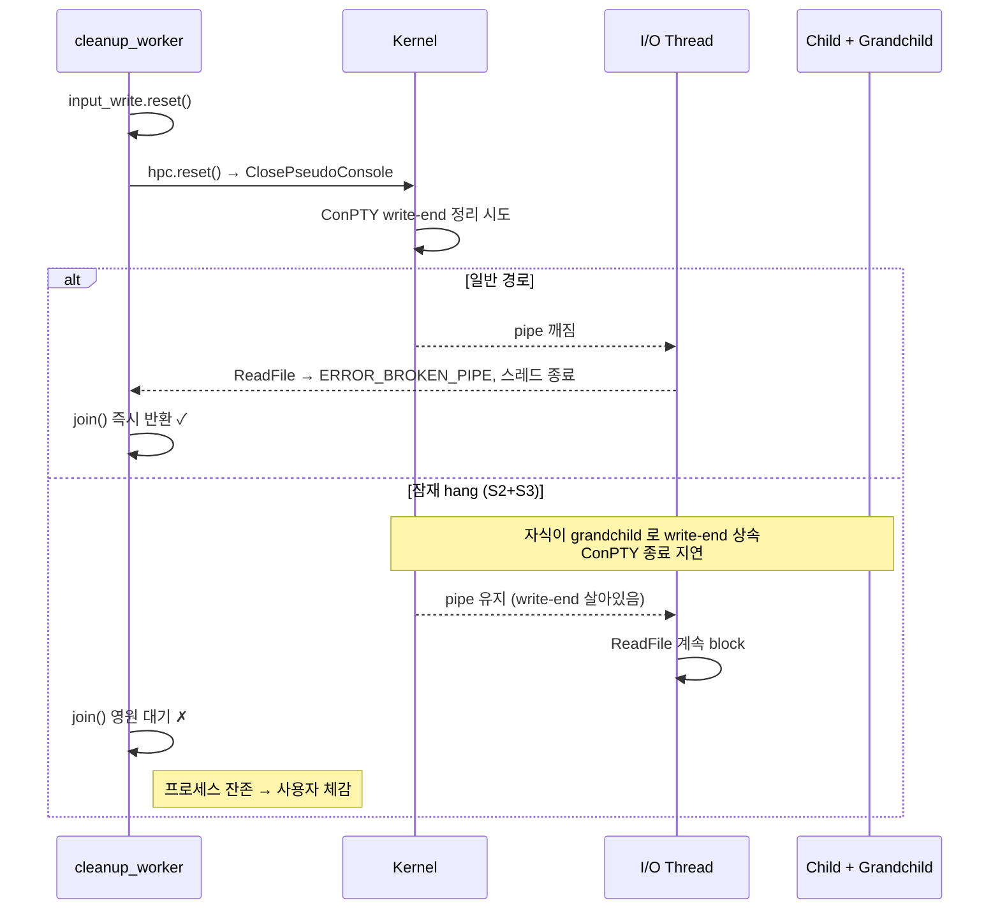
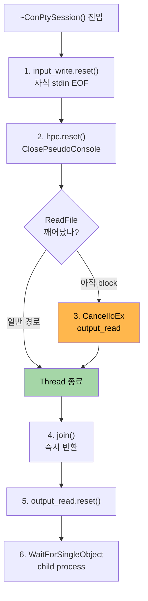

# io-thread-timeout-v2 Design Document

> **Summary**: `ConPtySession` 소멸자의 `io_thread.join()` 앞에 `CancelIoEx(output_read, nullptr)` 를 추가해 동기 `ReadFile` 을 확정적으로 깨운다. `std::async + wait_for` 이전 시도 실패의 표준 근거를 교훈 주석으로 남겨 재발 방지.
>
> **Project**: GhostWin Terminal
> **Author**: 노수장
> **Date**: 2026-04-15
> **Status**: **Design 초안** (Plan 갱신: 2026-04-15)
> **Plan**: [io-thread-timeout-v2.plan.md](../../01-plan/features/io-thread-timeout-v2.plan.md)

---

## Executive Summary

| Perspective | Content |
|-------------|---------|
| **Problem** | `ConPtySession::~ConPtySession()` 의 `io_thread.join()` 에 타임아웃 없음. 일반 경로는 안전하지만 자식 프로세스가 output pipe write-end 를 상속/유지하는 시나리오에서 영구 hang 가능 |
| **Solution** | `hpc.reset()` 직후 + `join()` 직전에 **`CancelIoEx(output_read, nullptr)` 호출**. ghostty `Exec.zig:217-225` 동일 패턴. `ERROR_NOT_FOUND` (취소할 I/O 없음 = 이미 pipe close 로 깨어남) 는 정상으로 무시 |
| **Function/UX Effect** | "창 닫았는데 앱 안 꺼짐" 사용자 체감 버그 해소 |
| **Core Value** | Graceful shutdown 완결. `std::async` 실패 원인이 UB 아니라 **C++ 표준 [futures.async]/5 가 정의한 `~future()` block** 이라는 점을 소스 주석에 표준 근거와 함께 남김 |

---

## 1. 목표와 비목표

### 목표

1. **`io_thread.join()` 영구 대기 경로 제거** — `CancelIoEx` 로 확정적 깨움
2. **`std::async` 시도 실패 교훈 보존** — 소스 주석에 C++ 표준 근거 + cppreference 링크
3. **회귀 없음** — 기존 vt_core_test 및 빌드 통과
4. **경고 0 유지** (`feedback_no_warnings` 규칙)

### 비목표

- `file_watcher.cpp` 의 `CancelIo` 를 `CancelIoEx` 로 통일 — API 일관성 차원, 별도 cycle
- IOCP / OVERLAPPED 전환 — 과잉 (단일 PTY 읽기에는 불필요)
- 자식 프로세스 wait 타임아웃 (`WaitForSingleObject`) 변경 — 이미 `shutdown_timeout_ms=5000` 작동 중, 본 작업 무관
- 신규 ADR 작성 — 소스 주석 + Obsidian `Backlog/tech-debt.md` 갱신으로 충분 (기존 ADR-006 수준의 큰 결정 아님)

---

## 2. 현재 상태 (Before)

### 2.1 소멸자 순서 (`conpty_session.cpp:359-390`)

```cpp
ConPtySession::~ConPtySession() {
    // 1. Close input pipe -> child sees EOF
    impl_->input_write.reset();

    // 2. Close ConPTY -> sends CTRL_CLOSE_EVENT to child
    impl_->hpc.reset();

    // 3. I/O thread's ReadFile returns failure -> loop exits -> joinable
    //    hpc.reset() (step 2) breaks the ConPTY pipe, causing ReadFile to fail
    //    and the I/O loop to exit. join() should return quickly after that.
    if (impl_->io_thread.joinable()) {
        impl_->io_thread.join();                 // ← 타임아웃 없음
    }

    // 4. Close output pipe (after I/O thread exits)
    impl_->output_read.reset();

    // 5. Wait for child process with timeout
    if (impl_->child_process) { /* ... WaitForSingleObject ... */ }
}
```

### 2.2 잠재 hang 경로



### 2.3 이전 실패 시도 (`31a2235` → `3a28730`)

```cpp
// 31a2235 (시도, 되돌림됨)
auto future = std::async(std::launch::async, [&] { impl_->io_thread.join(); });
if (future.wait_for(std::chrono::seconds(3)) == std::future_status::timeout) {
    fprintf(stderr, "[conpty] I/O thread join timeout (3s), detaching\n");
    impl_->io_thread.detach();  // ← 여기 도달 못 함
}
// ← if 블록 종료 시 ~future() 가 join() 완료까지 다시 block
// [futures.async]/5
```

**실패 원인** (C++ 표준):
- `std::async(std::launch::async, ...)` 반환 `future` 의 소멸자는 **shared state ready 까지 block**
- `wait_for(3s) == timeout` 후 scope 종료 시 `~future()` 가 `join()` 완료 대기 → detach 도달 불가
- **UB 가 아니라 "표준이 정의한 block"** — 결과는 hang 지속

---

## 3. 목표 상태 (After)

### 3.1 소멸자 순서 (변경 후)

```cpp
ConPtySession::~ConPtySession() {
    // Shutdown sequence -- order matters!
    //
    // Why CancelIoEx (not std::async + wait_for):
    //   A previous attempt (31a2235) used
    //       std::async(std::launch::async, [&]{ io_thread.join(); })
    //       .wait_for(3s) == timeout  →  io_thread.detach()
    //   This does NOT time-out a hang. Per C++ standard [futures.async]/5,
    //   the future returned by std::async(launch::async, ...) has a
    //   destructor that BLOCKS until the shared state is ready
    //   (essentially re-joining the worker thread), so the detach() below
    //   is never reached. Reverted in 3a28730.
    //   Reference: https://en.cppreference.com/w/cpp/thread/future/~future

    // 1. Close input pipe -> child sees EOF
    impl_->input_write.reset();

    // 2. Close ConPTY -> sends CTRL_CLOSE_EVENT to child (+ wakes ReadFile in
    //    the common case). Called from the cleanup thread (not I/O thread)
    //    to avoid deadlock.
    impl_->hpc.reset();

    // 3. Force-cancel any pending I/O on the output pipe in case the child
    //    inherited or still holds the pipe's write-end, which would keep
    //    ReadFile blocking indefinitely despite ClosePseudoConsole (see
    //    Backlog/tech-debt.md #6). CancelIoEx cancels both synchronous and
    //    asynchronous I/O on the given handle; ReadFile then returns with
    //    ERROR_OPERATION_ABORTED and the loop exits.
    //    Pattern mirrors ghostty external/ghostty/src/termio/Exec.zig:217-225.
    //    MSDN: https://learn.microsoft.com/en-us/windows/win32/fileio/cancelioex-func
    if (impl_->output_read && !CancelIoEx(impl_->output_read.get(), nullptr)) {
        DWORD err = GetLastError();
        if (err != ERROR_NOT_FOUND) {
            // ERROR_NOT_FOUND means no outstanding I/O to cancel, which is
            // normal when the pipe-close in step 2 already woke ReadFile.
            log_win_error("CancelIoEx(output_read)", err);
        }
    }

    // 4. I/O thread exits and becomes joinable (either via pipe break in
    //    step 2 or CancelIoEx in step 3). Plain join() is sufficient now.
    if (impl_->io_thread.joinable()) {
        impl_->io_thread.join();
    }

    // 5. Close output pipe (after I/O thread exits)
    impl_->output_read.reset();

    // 6. Wait for child process with timeout (unchanged)
    if (impl_->child_process) { /* ... WaitForSingleObject ... */ }
}
```

### 3.2 동작 흐름



---

## 4. 상세 작업 명세

### 4.1 코드 변경 — `src/conpty/conpty_session.cpp`

| 위치 | 변경 내용 | LOC |
|------|-----------|:---:|
| 소멸자 상단 (`:359` 바로 뒤) | `std::async` 실패 교훈 주석 블록 추가 (C++ 표준 근거 + cppreference 링크) | ~12 |
| 단계 2 주석 (`:365-367`) | "wakes ReadFile in the common case" 명시 | ~1 |
| 단계 2 와 3 사이 신규 추가 | `CancelIoEx` 호출 + `ERROR_NOT_FOUND` 처리 + MSDN 링크 주석 | ~13 |
| 단계 3 주석 (`:369-371`) 기존 | 교정 — "either via pipe break or CancelIoEx" | ~1 |

**총 LOC**: 약 **27 LOC** (주석 포함)

### 4.2 Include 요구사항

`CancelIoEx` 는 `<windows.h>` 에 이미 포함 (`conpty_session.cpp:11` 에서 이미 `#include <windows.h>`). **추가 include 불필요**.

### 4.3 로깅

기존 `log_win_error(const char* context, DWORD error)` 함수 (`conpty_session.cpp:59`) 재사용. 신규 헬퍼 불필요.

### 4.4 문서 갱신

| 파일 | 변경 |
|------|------|
| `docs/01-plan/features/io-thread-timeout-v2.plan.md` | ✅ 갱신 완료 (2026-04-15) |
| 본 Design 문서 | ✅ 본 문서 |
| Obsidian `Backlog/tech-debt.md` #6 | Report phase 에서 완료 표기 |
| Obsidian `Milestones/pre-m11-backlog-cleanup.md` Group 4 #11 | Report phase 에서 완료 표기 |

---

## 5. 구현 순서 (Do phase 체크리스트)


---

## 6. 테스트 계획

### 6.1 기존 테스트 (회귀 방지)

| 테스트 | 현재 | 기대 |
|--------|:----:|:----:|
| `vt_core_test` (10) | PASS | PASS |
| `GhostWin.Core.Tests` | PASS | PASS |
| 솔루션 전체 빌드 | SUCCESS + 0 warning | SUCCESS + 0 warning |

### 6.2 수동 검증 (F5, 사용자 hardware)

| 시나리오 | 기대 결과 |
|----------|-----------|
| 정상 종료: 탭 닫기 (X 버튼) | 프로세스 즉시 정리, 잔존 없음 |
| 앱 종료: 메인 창 닫기 | 모든 세션 정리 + 프로세스 종료 |
| 자식 프로세스 정상 종료 전 창 닫기 (`pwsh` 실행 중 X) | 강제 종료 경로 정상 작동 (기존 `shutdown_timeout_ms=5000` 유지) |

### 6.3 부하 테스트 (선택)

S3 재현 (자식이 write-end 핸들 상속) 스크립트 작성은 복잡하고 재현 빈도 낮아 **본 cycle 비포함**. 향후 필요 시 별도.

---

## 7. 마이그레이션 / 호환성

### API 호환성

- `ConPtySession` public API 변경 없음. 순수 소멸자 내부 구현 변경
- Windows SDK 요구사항 변경 없음 (CancelIoEx 는 Vista+ 기본)

### 동작 호환성

- 일반 경로 (pipe close 로 깨어남): CancelIoEx 가 `ERROR_NOT_FOUND` 반환 → no-op, 기존 동작 유지
- 이상 경로 (pipe 유지): 기존 hang → 즉시 종료 (개선)

---

## 8. 리스크와 완화

| 리스크 | 발생 가능성 | 영향 | 완화 |
|--------|:----------:|:----:|------|
| `output_read` 핸들이 CancelIoEx 호출 시점에 이미 무효 | 낮음 | 낮음 (null 체크로 방어) | `if (impl_->output_read && !CancelIoEx(...))` 패턴 |
| `CancelIoEx` 가 ConPTY pipe 에 반응 안 하는 Windows 엣지케이스 | 낮음 | 중 | ghostty 선례 + MSDN. 의심 시 `CancelSynchronousIo` 로 fallback (별도 cycle) |
| `ERROR_NOT_FOUND` 가 아닌 다른 에러 로그가 빈번히 찍힘 | 낮음 | 낮음 (로그 노이즈) | `log_win_error` 는 stderr, 치명적 아님. Do phase 에서 실제 관찰 후 필요하면 억제 |
| 단계 3 주석이 step 번호와 혼동 | 낮음 | 낮음 | 단계 번호 일관성 있게 갱신 (4→4, 5→5, 6→6 로 재번호) |

---

## 9. 체크리스트 (Design → Do 진입 전)

- [x] Plan 코드 사실 기반 갱신 완료 (2026-04-15)
- [x] 본 Design 초안 작성 완료
- [x] C++ 표준 근거 확보 ([futures.async]/5)
- [x] 참조 구현 확인 (ghostty `Exec.zig:217-225`)
- [x] 프로젝트 내 선례 확인 (`file_watcher.cpp:74` 의 `CancelIo`)
- [x] 변경 위치 정확히 식별 (`conpty_session.cpp:359-390`)
- [x] 로깅 함수 확인 (`log_win_error` 재사용)
- [ ] Design review (사용자 승인)
- [ ] `/pdca do io-thread-timeout-v2` 진입

---

## 10. 확실하지 않은 부분

- ⚠️ S3 시나리오 (자식이 write-end 핸들 상속) 가 `pwsh` / `cmd.exe` 기본 동작에서 실제 발생 빈도 — 재현 근거 없으나 tech-debt #6 사용자 체감 보고로 간접 확인
- ⚠️ `CancelIoEx` 가 ConPTY output pipe 에 반응한다는 **MSDN 명시적 보장 없음** — 단 ghostty 동일 ConPTY 에서 실사용 중인 것이 강력한 근거

두 "확실하지 않음" 모두 Do phase 후 수동 검증 (F5) 으로 부분 검증 가능.

---

## 관련 문서

- [Plan](../../01-plan/features/io-thread-timeout-v2.plan.md)
- Obsidian [[Backlog/tech-debt]] #6
- Obsidian [[Milestones/pre-m11-backlog-cleanup]] Group 4 #11
- 이전 시도: `31a2235` (도입), `3a28730` (되돌림)
- ghostty 참조: `external/ghostty/src/termio/Exec.zig:217-225`
- 프로젝트 선례: `src/settings/file_watcher.cpp:74`
- C++ 표준: [futures.async]/5 — https://en.cppreference.com/w/cpp/thread/future/~future
- MSDN CancelIoEx: https://learn.microsoft.com/en-us/windows/win32/fileio/cancelioex-func
