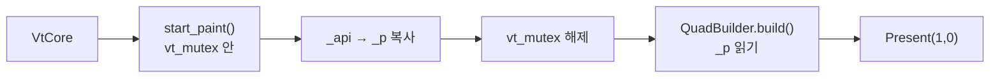
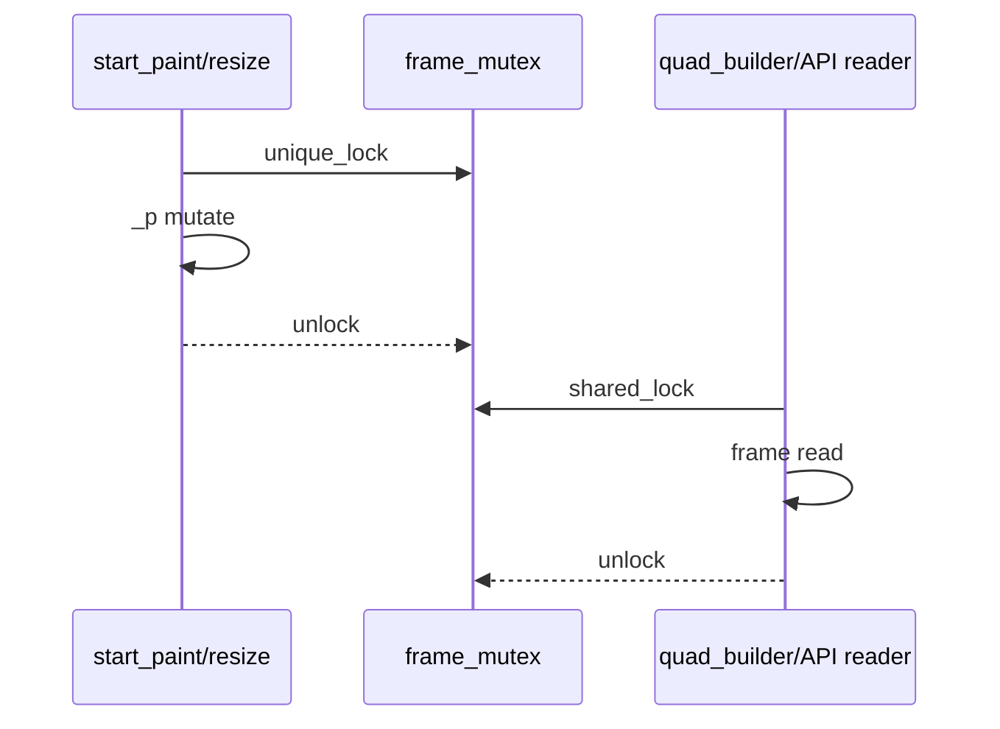
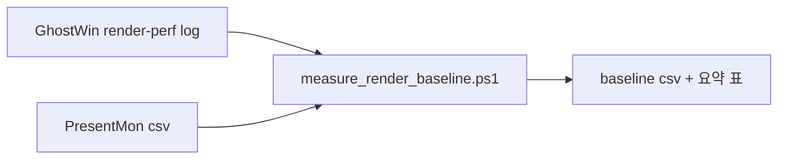

# M-14 Render Thread Safety & Baseline Recovery — Design

> **Feature**: M-14 Render Thread Safety & Baseline Recovery  
> **Project**: GhostWin Terminal  
> **Date**: 2026-04-20  
> **Author**: 노수장  
> **Status**: Draft v1.0  
> **PRD**: `docs/00-pm/m14-render-thread-safety.prd.md`  
> **Plan**: `docs/01-plan/features/m14-render-thread-safety.plan.md`

---

## Executive Summary

| 관점 | 내용 |
|------|------|
| **Problem** | 현재 GhostWin은 `_p` (내부 private render snapshot) 를 lock 없이 읽는 경로를 여러 곳에 두고 있어서 `row()` 방어 가드에 기대고 있다. 동시에 렌더 루프는 매 프레임 `force_all_dirty()`를 호출해 idle 시에도 과하게 일하고, pane 수가 늘면 `Present(1, 0)` 비용까지 겹친다. |
| **Solution** | 이번 설계는 세 가지를 확정한다. 1) `_p` 읽기는 `shared_mutex + FrameReadGuard` 로 통일해 방어 가드 없이도 안전하게 만든다. 2) non-VT redraw 는 `visual_epoch` 로 분리하고, resize 는 기존 `resize_applied + state->resize()` 경로로 남긴다. 3) perf 계측은 내부 `render-perf` 로그 + PresentMon 후처리로 고정한다. |
| **Function / UX Effect** | 사용자는 창 resize 중 깨지지 않고, idle 에서 덜 바쁘며, 대량 출력과 4-pane resize 에서 지금보다 훨씬 덜 버벅이는 터미널을 얻게 된다. |
| **Core Value** | 이 설계는 "가드 추가로 증상만 막는 상태"를 끝내고, 안전성과 성능을 함께 설명 가능한 구조로 바꾼다. |

---

## 1. 지금 어떻게 작동하는가

### 1.1 현재 렌더 흐름



현재 코드에서 확인되는 사실:

- 렌더 루프는 `Sleep(16)` polling 이다.
- `render_surface()` 는 매 프레임 `state.force_all_dirty()` 를 부른다.
- `QuadBuilder::build()` 는 row/cell 전체를 2-pass 로 순회한다.
- `Present(1, 0)` 는 surface 별로 호출된다.
- `RenderFrame::row()` 는 resize race 시 empty span 을 반환하는 방어 가드를 갖고 있다.

### 1.2 `frame()` reader 는 하나가 아니다

이 점이 이번 설계의 핵심이다. 문제는 render hot path 하나만의 문제가 아니다.

| reader | 현재 위치 | 특징 |
|--------|-----------|------|
| render surface draw | `ghostwin_engine.cpp:169` | 가장 자주 도는 hot path |
| cell text 조회 | `ghostwin_engine.cpp:1053` | API 호출형 reader |
| selected text 조회 | `ghostwin_engine.cpp:1083` | 여러 row 를 길게 읽음 |
| word bounds | `ghostwin_engine.cpp:1172` | row scan |
| line bounds | `ghostwin_engine.cpp:1223` | frame 메타데이터 사용 |
| standalone terminal window | `terminal_window.cpp:69` | 별도 경로지만 같은 `TerminalRenderState` 계약 사용 |

즉, `_p` 의 안전성은 "quad builder만 안 깨지면 됨"이 아니라 **모든 reader가 같은 계약을 따라야** 닫힌다.

---

## 2. 문제 상황

### 2.1 사용자 관점

사용자는 아래처럼 느낀다.

- 창을 자주 늘리고 줄일 때 불안하다
- 가만히 두어도 터미널이 바쁜 느낌이 든다
- 로그가 많이 나오면 경쟁 터미널보다 더 끊긴다
- pane 가 많을수록 더 느려진다

### 2.2 코드 관점

현재 약점은 세 가지다.

1. **`frame()` 참조가 락 밖으로 탈출한다**
2. **non-VT redraw 와 VT dirty 가 섞여 있다**
3. **성능 측정 기준이 아직 고정되지 않았다**

### 2.3 지금의 임시 방어

| 임시 방어 | 위치 | 한계 |
|-----------|------|------|
| `row()` empty span 반환 | `render_state.h` | 크래시만 막고 ownership 문제는 그대로 |
| `if (row.empty()) continue` | `quad_builder.cpp` | 정상 frame 전제를 무너뜨림 |
| `_api → _p` min-size copy | `render_state.cpp` | 손상 완화만 하고 원인 제거는 아님 |
| `force_all_dirty()` 상시 호출 | `ghostwin_engine.cpp` | IME/selection redraw 는 되지만 idle 성능이 무너짐 |

---

## 3. 이전 시도와 왜 부족했는가

### 3.1 "`_p.reshape()` 를 vt_mutex 안에서만 하면 되지 않나?"

이건 이미 현재 baseline 에 상당 부분 들어가 있다.

```cpp
std::lock_guard lock(sess->conpty->vt_mutex());
sess->conpty->vt_resize_locked(cols, rows);
sess->state->resize(cols, rows);
```

문제는 그 다음이다.

- `start_paint()` 가 `_p` 를 만든 뒤
- `frame()` 으로 참조를 넘기고
- 락을 풀고 나서
- reader 가 그 참조를 계속 읽는다

즉 "`writer를 vt_mutex 안으로 넣는다`"만으로는 부족하고,  
**reader lifetime 자체를 보호하는 계약**이 필요하다.

### 3.2 `_front/_back` 2-buffer swap 만으로 충분한가?

처음 보기엔 좋아 보이지만, `const RenderFrame& frame()` 계약을 유지하면 아직 구멍이 남는다.

이유:

- reader 가 `_front` 참조를 받은 뒤
- 다음 paint 에서 `_front/_back` 이 swap 되고
- 이전 `_front` 가 다시 write 대상이 되면
- old reference 가 다시 위험해진다

즉 2-buffer swap 단독은 **참조 lifetime pinning**이 없으면 충분하지 않다.

---

## 4. 대안 비교

### 4.1 `_p` 안전화 대안

| 대안 | 장점 | 단점 | 판단 |
|------|------|------|------|
| **A. 현재 상태 유지 + guard** | 구현 쉬움 | 근본 해결 아님 | 기각 |
| **B. 2-buffer swap only** | write/read 분리 직관적 | `const&` reader lifetime 문제 남음 | 기각 |
| **C. immutable snapshot handle** | lock-free reader 가능 | publish/reuse 구현이 복잡하고, 잘못하면 full copy 비용 큼 | 보류 |
| **D. `shared_mutex + FrameReadGuard`** | 모든 reader에 동일 계약 적용 가능, 현재 코드 변경 범위 예측 가능 | build 동안 resize writer 가 잠시 대기 | **채택** |

### 4.2 `visual_epoch` ordering 대안

| 대안 | 장점 | 단점 | 판단 |
|------|------|------|------|
| relaxed | 가장 빠름 | redraw publish 의미가 흐려짐 | 기각 |
| acq_rel everywhere | 단순 | 필요 이상으로 강함 | 보류 |
| **writer release / reader acquire** | publish 의미가 분명하고 설명 가능 | 약간의 주의 필요 | **채택** |

### 4.3 perf 로그 대안

| 대안 | 장점 | 단점 | 판단 |
|------|------|------|------|
| LOG 없이 PresentMon만 사용 | 외부 기준 좋음 | GhostWin 내부 구간 분해 불가 | 기각 |
| 내부 LOG만 사용 | 구현 쉬움 | display 쪽 지연 분리 어려움 | 기각 |
| **내부 `render-perf` + PresentMon 병행** | 내부/외부 둘 다 잡음 | 스크립트 작업 필요 | **채택** |

---

## 5. 해결 방법

### 5.1 W2 — `shared_mutex + FrameReadGuard`

#### 핵심 아이디어

`TerminalRenderState::frame()` 처럼 **락 없는 참조 반환 API를 없애고**,  
reader 가 읽는 동안 shared lock 을 잡는 RAII 객체로 바꾼다.



#### 새 계약

```cpp
class FrameReadGuard {
public:
    FrameReadGuard(std::shared_lock<std::shared_mutex> lock,
                   const RenderFrame& frame)
        : lock_(std::move(lock)), frame_(&frame) {}

    const RenderFrame& get() const { return *frame_; }

private:
    std::shared_lock<std::shared_mutex> lock_;
    const RenderFrame* frame_;
};
```

```cpp
class TerminalRenderState {
public:
    bool start_paint(std::mutex& vt_mutex, VtCore& vt);
    FrameReadGuard acquire_frame() const;
    void resize(uint16_t cols, uint16_t rows);

private:
    mutable std::shared_mutex frame_mutex_;
    RenderFrame _api;
    RenderFrame _p;
};
```

#### writer 규칙

- `start_paint()` 는 `vt_mutex` + `unique_lock(frame_mutex_)`
- `resize()` 도 `unique_lock(frame_mutex_)`
- `_p` 를 바꾸는 코드는 오직 이 두 경로만

#### Lock Ordering (불변)

이 순서는 구현 전제이자 리뷰 기준이다.

1. `vt_mutex` 먼저, `frame_mutex` 나중. **반대 순서 금지**
2. reader 는 `frame_mutex` 하나만 잡는다. **reader 경로에서 `vt_mutex` 금지**
3. writer 는 `vt_mutex` 보유 상태에서만 `frame_mutex` 를 획득한다

즉 허용되는 패턴은 아래 두 개뿐이다.

```text
writer: vt_mutex -> frame_mutex
reader: frame_mutex only
```

허용하지 않는 패턴:

```text
reader: frame_mutex -> vt_mutex
writer: frame_mutex only
writer: frame_mutex -> vt_mutex
```

이 규칙을 문서로 먼저 고정하지 않으면, 구현 중 반대 순서가 한 군데라도 들어와 교착 상태가 생길 수 있다.

#### reader 규칙

모든 reader 는 아래 패턴으로 통일:

```cpp
auto frame_guard = state.acquire_frame();
const auto& frame = frame_guard.get();
// frame 사용
```

대상:

- `render_surface()`
- `gw_session_get_cell_text`
- `gw_session_get_selected_text`
- `gw_session_find_word_bounds`
- `gw_session_find_line_bounds`
- `terminal_window.cpp`

현재 call site 확인 결과:

- 위 6개 reader 호출 지점은 **현재 코드 기준 모두 `vt_mutex` 미보유 상태에서 `frame()` 을 읽는다**
- 따라서 새 계약은 "`reader 는 `frame_mutex`만 잡는다" 를 그대로 적용할 수 있다
- 이후 새 reader 추가 시에도 동일 규칙을 따라야 한다

#### reader 길이별 정책

모든 reader 가 같은 락을 쓰더라도, **락 유지 시간 정책은 동일하면 안 된다.**

| Reader 유형 | 예시 | 허용 락 유지 |
|-------------|------|--------------|
| **짧은 순회 hot path** | `render_surface()` build, `terminal_window.cpp` render loop | `FrameReadGuard` 유지한 채 바로 순회 |
| **짧은 메타 조회** | `gw_session_find_line_bounds` | `FrameReadGuard` 유지 가능 |
| **긴 row scan / 문자열 생성** | `gw_session_get_selected_text`, `gw_session_find_word_bounds`, 필요 시 `gw_session_get_cell_text` 확장판 | guard 안에서 필요한 row/메타를 **local 복사** 후 즉시 guard 해제, 이후 local 데이터로 작업 |

설계 원칙:

- render hot path 는 copy 비용을 피하기 위해 shared lock 유지
- 긴 API reader 는 writer starvation 방지를 위해 **copy-first semantic** 사용

이를 위해 `TerminalRenderState` 는 두 API 중 하나를 제공한다.

```cpp
FrameReadGuard acquire_frame() const;
RenderFrameCopy acquire_frame_copy() const;
```

여기서 `RenderFrameCopy` 는 긴 API reader 가 필요한 최소 범위의 local snapshot 이다.

즉 이번 설계의 계약은 다음과 같다.

- **짧은 reader**: guard 유지
- **긴 reader**: copy 후 guard 즉시 해제

이 규칙이 없으면 `gw_session_get_selected_text()` 같은 긴 reader 가 shared lock 을 오래 잡아 resize writer 를 밀어내고, 결국 `vt_mutex` 대기까지 연쇄될 수 있다.

#### 왜 이 설계를 고르나

- 현재 코드에 가장 덜 침습적이다
- reader 범위를 전부 덮는다
- `_p` full copy 같은 새 성능 리스크를 만들지 않는다
- guard 제거 여부를 명확히 판정할 수 있다

### 5.2 W3 — `visual_epoch` 는 non-VT visual 전용

#### 원칙

`visual_epoch` 는 아래 이벤트만 표현한다.

- selection 변경
- IME composition 변경
- session activate 로 인한 시각 변화

resize 는 포함하지 않는다.

이유:

- resize 는 이미 `needs_resize` / `resize_applied`
- `state->resize()` 가 dirty propagation

이 두 경로가 따로 있으므로, resize 까지 `visual_epoch` 에 섞으면  
"왜 redraw 되었는지" 해석이 흐려진다.

#### ordering

writer:

```cpp
// plain fields write
session->selection.start_row = start_row;
session->selection.start_col = start_col;
...
session->visual_epoch.fetch_add(1, std::memory_order_release);
```

reader:

```cpp
const uint32_t visual_epoch =
    session->visual_epoch.load(std::memory_order_acquire);
const bool visual_dirty = (surf->last_visual_epoch != visual_epoch);
```

#### render 판단식

```cpp
bool vt_dirty = state.start_paint(session->conpty->vt_mutex(), vt);
bool visual_dirty = (surf->last_visual_epoch != visual_epoch);

if (!vt_dirty && !visual_dirty && !resize_applied) {
    return; // skip draw + skip present
}
```

### 5.3 W1 — perf 로그 스키마 확정

#### 로그 형식

한 줄 하나, surface 하나.

```text
[INF][render-perf] frame=123 sid=7 panes=4 vt_dirty=1 visual_dirty=0 resize=0
start_us=420 build_us=3100 draw_us=900 present_us=15500 total_us=19920 quads=8120
```

#### 필드

| 필드 | 의미 |
|------|------|
| `frame` | render loop frame id |
| `sid` | session/surface id |
| `panes` | 현재 active surface 수 |
| `vt_dirty` | VT 쪽 변경 여부 |
| `visual_dirty` | non-VT visual 변경 여부 |
| `resize` | 이번 frame 에 resize 적용 여부 |
| `start_us` | `start_paint()` 시간 |
| `build_us` | `QuadBuilder` 시간 |
| `draw_us` | upload + draw 시간 |
| `present_us` | `Present(1, 0)` 블로킹 시간 |
| `total_us` | surface 전체 시간 |
| `quads` | instance 수 |

#### 수집 방식



#### `measure_render_baseline.ps1` 원칙

- Release 빌드만 사용
- `idle / load / resize` 3개 시나리오 지원
- PresentMon 경로는 인자 또는 환경 변수로 받음
- 내부 로그와 PresentMon 결과를 같은 output 폴더에 저장
- 현재 ghostty fork 의 `OPT 15` / `OPT 16` 패치 영향 확인을 위해 on/off 또는 equivalent baseline 비교 모드를 지원

#### `present_us` 해석 주의

`present_us` 는 단순 GPU draw 시간이 아니다.

여기에는 아래가 섞일 수 있다.

- vsync 대기
- driver queue depth
- DWM compositor 타이밍
- `Present(1, 0)` 내부 block

즉 `present_us` 는 "**present call 이 얼마나 오래 막혔는가**"로 해석해야 하고,
GPU pure draw cost 와 동일시하면 안 된다.  
그래서 이번 설계는 내부 `present_us` 와 PresentMon 결과를 **같이** 본다.

### 5.4 W4 — pane 정책

이번 M-14에서는 `Present(1, 0)`를 유지한다.  
대신 **clean surface는 draw/present 자체를 생략**한다.

즉 이번 마일스톤의 목표는:

- pane 수가 늘어도 dirty surface만 present 하게 만들기
- 그래도 여전히 선형 증가가 심하면 follow-up 근거를 남기기

tearing mode 전환은 이번 범위 밖이다.

#### 4-pane resize 절차

이번 milestone 에서는 재현 절차를 애매하게 두지 않는다.

1. 앱 시작
2. 4-pane 상태를 미리 만든다
3. `resize` 시나리오에서는 아래 둘 중 하나로 고정한다

| 방식 | 적용 |
|------|------|
| **1차 기준** | 창 전체 resize 반복 |
| **2차 보조** | splitter drag 수동 반복 |

원칙:

- baseline CSV 기준 시나리오는 **창 전체 resize 반복**으로 통일
- splitter drag 는 보조 관찰용으로만 남긴다

이렇게 해야 반복 측정이 가능하고, 수동 drag 편차가 주 판정에 섞이지 않는다.

---

## 6. 왜 안전한가

1. **reader lifetime 이 명시된다**  
   이제 `const RenderFrame&` 가 lock 없이 떠다니지 않는다.

2. **모든 reader 가 같은 규칙을 쓴다**  
   render path만 고치고 API helper가 남는 문제가 없다.

3. **resize 와 visual invalidation 이 분리된다**  
   resize 는 `resize_applied`, 시각 상태 변화는 `visual_epoch` 로 따로 설명된다.

4. **성능 측정도 구조화된다**  
   "느낌상 느리다"가 아니라 `start/build/draw/present` 로 쪼개서 본다.

---

## 7. 비교표

### 7.1 현재 / 개선 후

| 항목 | 현재 | 개선 후 |
|------|------|---------|
| frame read 계약 | lock-free `const&` | `FrameReadGuard` shared lock |
| resize 보호 | writer 쪽만 부분 보호 | reader/writer 모두 계약 명시 |
| non-VT redraw | `force_all_dirty()` 상시 호출 | `visual_epoch` 기반 선택 redraw |
| resize 신호 | visual dirtiness 와 섞임 | `resize_applied` 경로로 분리 |
| perf 측정 | 단편적 추정 | 내부 로그 + PresentMon 병행 |

### 7.2 대안 비교 최종 선택

| 영역 | 후보 | 선택 |
|------|------|------|
| `_p` 안전화 | guard 유지 / 2-buffer only / immutable handle / shared_mutex | **shared_mutex + FrameReadGuard** |
| visual redraw 신호 | force_all_dirty 상시 / mixed epoch / non-VT epoch only | **non-VT epoch only** |
| ordering | relaxed / release-acquire / acq-rel everywhere | **release-acquire** |
| perf 측정 | 내부만 / 외부만 / 병행 | **병행** |

---

## 8. 검증 계획

### 8.1 단위/엔진 검증

- `render_state_test`
  - reshape-during-read stress
  - guard 제거 후 PASS
- `dx11_render_test`
  - 계측 추가 후 smoke PASS

### 8.2 시나리오 검증

- `idle`
- `load`
- `4-pane resize`

각 시나리오에서 남겨야 할 것:

- GhostWin 내부 CSV
- PresentMon CSV
- 화면 녹화 또는 최소 스크린 기록

### 8.3 guard 제거 시점

`RenderFrame::row()` 방어 가드와 `quad_builder.cpp:82,117` guard 는 **가장 먼저 지우지 않는다.**

순서는 반드시 아래를 따른다.

1. `FrameReadGuard` / `acquire_frame_copy()` 계약 구현
2. 6개 reader 전부 새 계약으로 마이그레이션
3. stress test 추가
4. 새 계약 상태에서 PASS 확인
5. 그 다음에만 `row()` / `quad_builder` guard 제거

즉 guard 제거는 **W2 contract 완성 직후의 마지막 단계**다.

### 8.4 외부 비교

- Windows Terminal
- WezTerm
- Alacritty

같은 PC, 같은 창 크기, 같은 쉘, Release 기준.

### 8.5 Fallback

완료 게이트 #5 실패 시 분기는 plan 과 동일하게 유지한다.

| 실패 패턴 | 분기 |
|-----------|------|
| 1 시나리오만 열세 | report 에 follow-up 기록, M-14 는 닫음 |
| 2 시나리오 이상 열세 | `/pdca iterate m14-render-thread-safety` 로 재진입 |
| 구조적 한계로 판단 | 후속 milestone 분리 (`m15-render-tearing-mode` 등) |

### 8.6 idle 락 오버헤드 follow-up

이번 설계는 안전성을 위해 idle 에도 `start_paint()` 가 `vt_mutex + frame_mutex` 를 잡는 구조를 유지한다.

이 경로의 비용이 W1/W3 측정 후에도 의미 있게 남으면, 다음 조건에서 follow-up 검토를 연다.

- `idle` 시나리오에서 CPU가 기대보다 높음
- `start_us` 대부분이 "dirty 없음" 프레임인데도 누적됨

이 경우 후보는:

- VT dirty pre-check atomic
- render wake-up 조건 기반 대기
- 더 가벼운 idle probe 경로

단, 이 항목은 **이번 M-14의 선행 설계 변경**이 아니라 **측정 후 분기용 follow-up**이다.

---

## 9. 요약 한 줄

> **M-14의 설계 핵심은 `_p`를 lock-free 참조에서 `FrameReadGuard` 계약으로 바꾸고, `force_all_dirty()`를 non-VT redraw 전용 `visual_epoch`로 치환해, 안전성과 성능을 같이 회복하는 것이다.**
