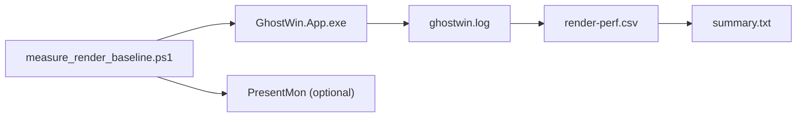
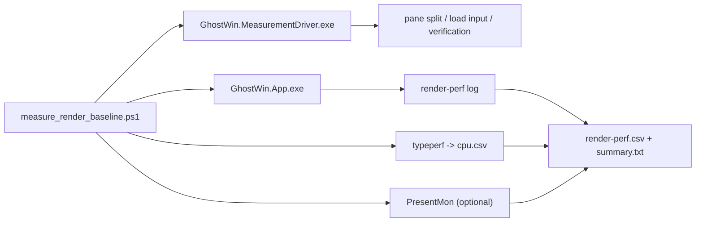

# M-15 Render Baseline Comparison — Design

> **Feature**: M-15 Render Baseline Comparison  
> **Project**: GhostWin Terminal  
> **Date**: 2026-04-23  
> **Author**: 노수장  
> **Status**: Draft v1.0  
> **Origin**: `docs/archive/2026-04/m14-render-thread-safety/m14-render-thread-safety.report.md`  
> **Milestone Stub**: `C:\Users\Solit\obsidian\note\Projects\GhostWin\Milestones\m15-render-baseline-comparison.md`

---

## Executive Summary

| 관점 | 내용 |
|------|------|
| **Problem** | M-14는 렌더 경로의 구조적 안전성과 idle 낭비 제거를 끝냈지만, 4-pane resize 자동 CSV, load 자동화, idle CPU 절대값, 경쟁 터미널 비교는 비어 있다. 지금 상태로는 "내부 개선은 있었다" 까지는 말할 수 있어도 "경쟁사 대비 명확한 열세가 없다" 는 판정은 못 한다. |
| **Solution** | M-15는 두 단계로 간다. **Stage A** 에서 GhostWin 내부 기준선 자동화를 먼저 닫는다. entrypoint 는 기존 `measure_render_baseline.ps1` 를 유지하고, UI 조작은 별도 C# measurement driver 로 분리해 `idle`, `resize-4pane`, `load` 세 시나리오를 자동화한다. **Stage B** 에서 같은 artifact 포맷을 유지한 채 WT / WezTerm / Alacritty 비교를 붙인다. |
| **Function / UX Effect** | 사용자가 체감한 "이전보다 약간 개선" 을 숫자로 다시 설명할 수 있게 된다. 특히 4-pane resize 와 대량 출력 시나리오를 수동 관찰이 아니라 재현 가능한 CSV 로 남긴다. |
| **Core Value** | GhostWin 비전 ③ "타 터미널 대비 성능 우수" 를 정성에서 정량으로 끌어올린다. M-15의 본질은 최적화가 아니라 **측정 무결성 회복** 이다. |

---

## 1. 지금 어떻게 작동하는가

### 1.1 현재 측정 스크립트 구조

현재 기준 entrypoint 는 [measure_render_baseline.ps1](C:/Users/Solit/Rootech/works/ghostwin/scripts/measure_render_baseline.ps1) 하나다.



현재 이미 되는 것:

- `idle` baseline 자동 수집
- `resize` 1-pane 자동 resize (`SetWindowPos`)
- `render-perf.csv` + `summary.txt` 산출
- PresentMon 병행 수집 옵션

현재 비어 있는 것:

- `-Panes > 1` 는 의도적으로 reject
- `load` 시나리오는 사용자가 직접 명령을 쳐야 함
- idle CPU 절대값은 파일 artifact 가 없음
- 경쟁 터미널 비교는 별도 수동 작업

### 1.2 이미 재사용 가능한 자동화 자산

이번 설계는 새 프레임워크를 만드는 것이 아니라, 기존 자산을 measurement 쪽으로 재조합한다.

| 자산 | 위치 | 이번 M-15 에서 쓰는 방식 |
|------|------|-------------------------|
| GhostWin 실행/윈도우 대기 | `tests/GhostWin.E2E.Tests/Infrastructure/GhostWinAppFixture.cs` | 앱 launch / main window handle 대기 패턴 참조 |
| Win32 창 배치 | `scripts/arrange_compare.ps1`, `scripts/arrange_windows.ps1` | 비교 단계(Stage B) 에서 quadrant arrange 재사용 |
| 테스트용 VT / OSC 주입 | `tests/GhostWin.E2E.Tests/Stubs/OscInjector.cs` | 필요 시 running app 제어 패턴 참조 |
| GhostWin test-only injection | `src/GhostWin.Services/SessionManager.cs` | load/input 보조 경로 후보 |
| SendInput 입력 유틸 | `scripts/e2e/e2e_operator/input.py` | load drive 설계 참고용, 직접 재사용은 보류 |

핵심 판단:

- **측정/수집은 PowerShell**
- **UI 조작은 C# helper**
- **artifact 포맷은 M-14 유지**

---

## 2. 문제 상황

### 2.1 지금 남아 있는 Gap

M-14 report 기준으로 M-15가 닫아야 할 공백은 네 가지다.

| ID | 공백 | 지금 왜 문제인가 |
|----|------|------------------|
| G1 | 4-pane resize 자동 CSV 없음 | "참을 만" 이라는 수동 관찰만 있고 수치가 없다 |
| G2 | WT / WezTerm / Alacritty 비교 없음 | 외부 비교 없이 비전 ③ 판정을 못 한다 |
| G4 | load 자동화 없음 | 대량 출력 기준선이 사용자 손에 달려 있다 |
| G5 | idle CPU 절대값 없음 | idle 최적화 체감은 있지만 증빙이 없다 |

### 2.2 왜 단일 PowerShell 확장만으로는 부족한가

직관적으로는 `measure_render_baseline.ps1` 하나에 모든 동작을 다 넣고 싶어진다.  
하지만 실제로는 아래 이유로 좋지 않다.

- pane 4개 생성은 키 조합, 포커스, 대기, 확인이 필요하다
- load drive 는 foreground/input 실패를 구분해야 한다
- PowerShell 단독 Win32 입력은 디버깅이 거칠고, 기존 E2E 자산과도 분리된다
- 측정 실패와 UI 자동화 실패를 한 파일에서 같이 다루면 원인 구분이 어려워진다

즉 M-15의 문제는 "스크립트 기능 추가" 가 아니라,  
**측정 계층과 UI 조작 계층의 책임을 분리하지 않으면 신뢰 가능한 baseline 이 안 나온다** 는 데 있다.

---

## 3. 대안 비교

### 3.1 구조 대안

| 대안 | 장점 | 단점 | 판단 |
|------|------|------|------|
| **A. 기존 PowerShell 스크립트에 전부 추가** | 파일 수 적음 | 입력/포커스/pane 검증이 한 파일에 몰림 | 기각 |
| **B. PowerShell + C# measurement driver** | 측정과 UI 조작 책임 분리, 기존 E2E 자산 재사용 가능 | helper project 1개 추가 필요 | **채택** |
| **C. 처음부터 GhostWin/WT/WezTerm/Alacritty 공통 harness** | 최종 구조는 깔끔 | 초반 범위 과다, 내부 baseline 공백이 그대로 섞임 | 보류 |

### 3.2 입력 drive 대안

| 대안 | 장점 | 단점 | 판단 |
|------|------|------|------|
| raw PowerShell `SendInput` | 빠른 프로토타입 | 기존에 foreground / modifier 문제 이력 많음 | 기각 |
| Python `input.py` 직접 재사용 | 이미 있는 코드 | measurement entrypoint 가 PowerShell과 Python 이중 구조가 됨 | 보류 |
| **C# driver 내부에서 Win32/FlaUI 제어** | 현재 test 자산과 같은 언어/도구, 에러 구분 쉬움 | helper 구현 필요 | **채택** |

### 3.3 CPU 수집 대안

| 대안 | 장점 | 단점 | 판단 |
|------|------|------|------|
| Task Manager 수동 기록 | 구현 0 | artifact 가 남지 않음 | 기각 |
| PerfMon GUI 세션 | 풍부한 정보 | 자동화/보관이 번거로움 | 보류 |
| **`typeperf` CSV 수집** | 기본 제공 도구, 파일 artifact 생성 | 카운터 경로를 정확히 잡아야 함 | **채택** |

---

## 4. 해결 방법

## 4.1 전체 구조



역할 분리는 아래처럼 고정한다.

| 컴포넌트 | 책임 | 하지 않는 것 |
|----------|------|--------------|
| `measure_render_baseline.ps1` | 앱 실행, env var, artifact 폴더, CPU 수집, PresentMon 수집, 요약 파일 생성 | pane split / 키 입력 판단 |
| `GhostWin.MeasurementDriver.exe` | 4-pane 생성, load command 실행, pane 수 검증, foreground 확인 | 성능 수치 계산 |
| `render-perf` 로그 | 내부 렌더 timing source of truth | UI 상태 판단 |

### 4.1.1 예정 파일 구조

이번 설계는 새 코드 위치도 미리 고정한다.

| 경로 | 역할 |
|------|------|
| `scripts/measure_render_baseline.ps1` | 기존 entrypoint 유지, scenario orchestration 확장 |
| `tests/GhostWin.MeasurementDriver/GhostWin.MeasurementDriver.csproj` | measurement 전용 콘솔 helper |
| `tests/GhostWin.MeasurementDriver/Program.cs` | 인자 파싱 + scenario dispatch |
| `tests/GhostWin.MeasurementDriver/GhostWinController.cs` | GhostWin window 탐색, foreground, pane 조작 |
| `tests/GhostWin.MeasurementDriver/Scenario/ResizeFourPaneScenario.cs` | 4-pane 생성 + pane count 확인 |
| `tests/GhostWin.MeasurementDriver/Scenario/LoadScenario.cs` | fixed workload 입력 + 실행 확인 |
| `tests/GhostWin.MeasurementDriver/Scenario/IdleScenario.cs` | idle 시나리오용 최소 준비 동작 |
| `tests/GhostWin.MeasurementDriver/Verification/PaneCountVerifier.cs` | baseline validity gate |

판단 이유:

- helper 는 프로덕션 기능이 아니라 **measurement 전용 도구** 이므로 `src/` 가 아니라 `tests/` 아래가 맞다.
- 기존 `GhostWin.E2E.Tests` 는 xUnit 허브이므로, 배치 실행 도구까지 섞기보다 별도 콘솔 helper 로 분리하는 편이 책임이 분명하다.
- Stage B 비교 단계에서 공통 helper 가 더 필요하면, 그때도 같은 measurement namespace 아래에서 확장한다.

### 4.2 Stage 분리

이번 설계는 milestone 전체를 두 단계로 나눈다.

| Stage | 범위 | 목표 |
|------|------|------|
| **Stage A** | GhostWin 내부 기준선 자동화 | G1 / G4 / G5 close-out |
| **Stage B** | WT / WezTerm / Alacritty 비교 | G2 close-out + 최종 판정 |

**현재 구현 계획의 직접 범위는 Stage A** 다.  
Stage B 는 같은 artifact 포맷 위에 얹는 다음 작업이다.

---

## 5. Stage A 상세 설계

### 5.1 시나리오 1 — `idle`

이건 기존 흐름을 유지하고 CPU artifact 만 추가한다.

#### 동작

1. GhostWin 실행
2. `GHOSTWIN_RENDER_PERF=1`
3. `typeperf` 로 프로세스 CPU 카운터 수집 시작
4. `DurationSec` 동안 대기
5. 앱 종료
6. `render-perf.csv`, `summary.txt`, `cpu.csv` 저장

#### 산출물

| 파일 | 의미 |
|------|------|
| `ghostwin.log` | raw render log |
| `render-perf.csv` | parsed timing CSV |
| `summary.txt` | avg / p95 / max 요약 |
| `cpu.csv` | idle CPU artifact |
| `presentmon.csv` | optional |

### 5.2 시나리오 2 — `resize-4pane`

이게 Stage A의 핵심이다.

#### 핵심 원칙

4-pane 측정은 **pane 4개가 실제로 만들어졌다는 검증이 통과할 때만** baseline 으로 인정한다.

#### 동작

1. PowerShell이 GhostWin 실행
2. driver 가 메인 윈도우 handle 획득
3. driver 가 GhostWin foreground 확보
4. driver 가 분할 단축키로 pane 4개 생성
5. driver 가 UIA 또는 동등 경로로 pane count = 4 확인
6. 확인 성공 시에만 PowerShell이 기존 resize loop 시작
7. `render-perf.csv` 와 `summary.txt` 생성

#### 왜 pane count 검증이 gate 인가

M-14에서 `-Panes > 1` 를 막은 이유가 바로 오인 방지였다.  
M-15에서 그 guard 를 푸는 대신, 더 강한 조건으로 바꾼다.

```text
declared panes=4
        +
driver observed panes=4
        +
resize loop executed
      => valid 4-pane baseline
```

이 세 조건 중 하나라도 빠지면 baseline 은 invalid 로 기록한다.

### 5.3 시나리오 3 — `load`

#### 핵심 원칙

load 는 "사용자가 적당히 무거운 명령을 친다" 가 아니라,  
**항상 같은 고정 workload 를 실행한다** 로 바뀌어야 한다.

#### 표준 workload 조건

- 로컬 시스템에 항상 존재
- 관리자 권한 불필요
- 네트워크 비의존
- 출력량이 충분히 큼
- 매번 약간 달라도 렌더 부하 자체는 충분히 재현 가능

초기 표준 workload 제안:

```powershell
Get-ChildItem -Recurse C:\Windows\System32 | Format-List
```

#### 동작

1. GhostWin 실행
2. driver 가 foreground 확보
3. driver 가 fixed workload 입력 및 실행
4. 일정 시간 perf + CPU 수집
5. artifact 저장

#### 입력 경로 원칙

- 첫 구현은 **실제 사용자 입력 경로와 같은 키 입력 기반**을 우선한다
- test-only VT 주입은 `OSC` 류 검증에는 좋지만, 여기서는 terminal output load 를 실제 경로로 만드는 목적이 더 중요하다
- 단, 키 입력 실패가 구조적으로 반복되면 fallback 후보로 test-only command injection 을 별도 비교한다

---

## 6. Validation / Failure Handling

### 6.1 검증 원칙

| 항목 | M-15 기준 |
|------|-----------|
| pane 수 검증 | 4-pane baseline 은 pane 4개 확인 후에만 기록 |
| 시나리오 라벨 | `idle`, `resize-4pane`, `load` 가 artifact 폴더와 summary 에 남아야 함 |
| CPU 기록 | 수동 메모 금지, 파일 artifact 필수 |
| 0 sample | 경고로 넘기지 않고 baseline 실패 처리 |
| 입력 성공 | load 명령이 실제 실행됐다는 흔적이 없으면 실패 |

### 6.2 실패 처리

| 실패 유형 | 처리 |
|-----------|------|
| pane 생성 실패 | resize 측정 시작 안 함, invalid baseline 으로 종료 |
| foreground / input 실패 | load baseline 실패 |
| `render-perf` sample 0건 | baseline 실패 |
| CPU 수집 실패 | idle gap 미해결로 남기고 실패 기록 |

### 6.3 summary 규칙

`summary.txt` 는 성능 수치뿐 아니라 baseline validity 도 같이 써야 한다.

예:

```text
scenario:       resize
mode:           4-pane
valid:          yes
observed_panes: 4
sample_count:   1380
...
```

실패 시:

```text
scenario:       resize
mode:           4-pane
valid:          no
reason:         pane count mismatch (expected 4, observed 2)
```

---

## 7. 테스트 전략

### 7.1 작은 검증

| 대상 | 확인 내용 |
|------|-----------|
| measurement driver 인자 파싱 | `idle` / `resize-4pane` / `load` 를 올바르게 해석하는가 |
| pane count 검증 | 4-pane 여부를 잘못 판정하지 않는가 |
| script-driver 연결 | helper 실패를 스크립트가 놓치지 않는가 |

### 7.2 실행 검증

최소 실행 검증은 아래 세 개다.

1. `idle` 1회
   - `render-perf.csv` 생성
   - `cpu.csv` 생성
2. `resize-4pane` 1회
   - pane 4개 확인 후 CSV 생성
3. `load` 1회
   - 자동 입력 후 CSV 생성

여기서 1차 합격선은 "수치가 좋다" 가 아니라  
**artifact 가 기대한 구조로 남는다** 는 것이다.

---

## 8. Stage B 메모 (비교 단계)

Stage A가 끝나면 같은 artifact 포맷으로 비교 단계에 들어간다.

| 항목 | 계획 |
|------|------|
| 비교 대상 | GhostWin / WT / WezTerm / Alacritty |
| 창 배치 | `arrange_compare.ps1` 계열 재사용 |
| 비교 시나리오 | idle / resize / load / 4-pane |
| 판정 | 3회 중 2회 이상 일관 + 수치 + 녹화 설명 가능 |

Stage B 는 Stage A 의 산출 형식을 바꾸지 않고,  
**동일 형식 artifact 를 터미널 4종에 대해 늘리는 작업** 으로 본다.

---

## 9. 왜 이 설계가 안전한가

1. **기존 entrypoint 유지**
   [measure_render_baseline.ps1](C:/Users/Solit/Rootech/works/ghostwin/scripts/measure_render_baseline.ps1) 를 버리지 않아서 M-14 artifact 연속성이 유지된다.

2. **측정과 UI 조작 분리**
   성능 수치 계산 로직과 pane/input 제어 로직이 분리되어 실패 원인 추적이 쉬워진다.

3. **pane 수 검증 gate**
   M-14에서 있었던 "1-pane를 4-pane로 오인" 문제를 구조적으로 막는다.

4. **artifact 중심 검증**
   Task Manager 수동 메모 같은 휘발성 증거 대신 CSV / summary 파일을 남긴다.

5. **Stage 분리**
   내부 기준선 자동화와 경쟁사 비교를 한 번에 섞지 않아 범위 폭발을 막는다.

---

## 10. 비교표 — 지금 vs M-15 이후

| 항목 | 지금 | M-15 Stage A 이후 |
|------|------|-------------------|
| idle baseline | 자동 | 자동 + CPU artifact 포함 |
| resize baseline | 1-pane만 자동 | 4-pane까지 자동 |
| load baseline | 사용자 수동 입력 | 고정 workload 자동 |
| baseline validity | sample 존재 여부 위주 | pane 수 / 입력 성공 / CPU artifact 까지 검증 |
| 경쟁사 비교 준비도 | 수동 준비 | Stage B 바로 진입 가능 |

---

## 한 줄 요약

> M-15는 기존 `measure_render_baseline.ps1` 를 entrypoint 로 유지하고, UI 조작은 별도 C# measurement driver 로 분리해 `idle`, `resize-4pane`, `load` 내부 기준선을 자동화하며, pane 수·입력 성공·CPU artifact 를 baseline validity gate 로 둔다.
