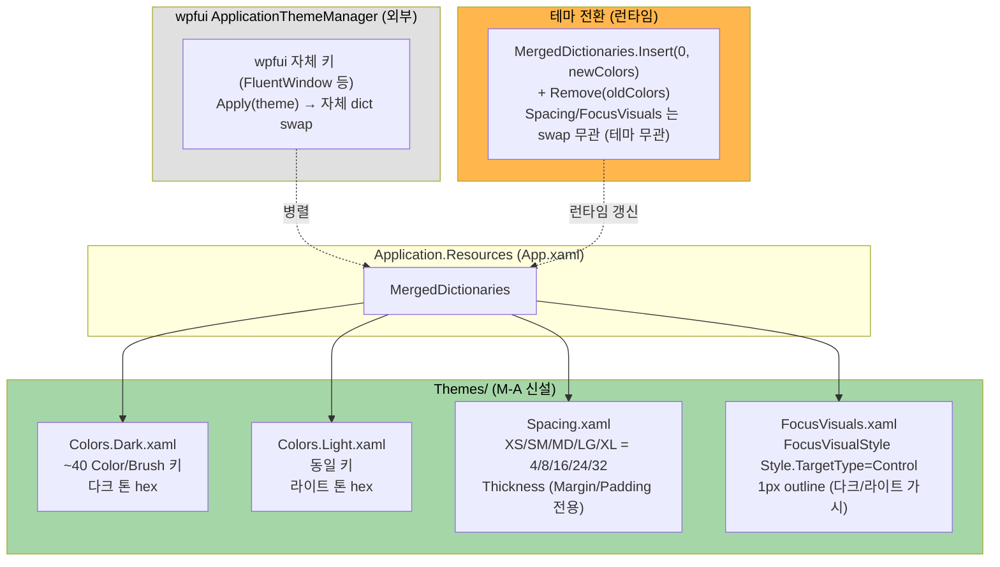
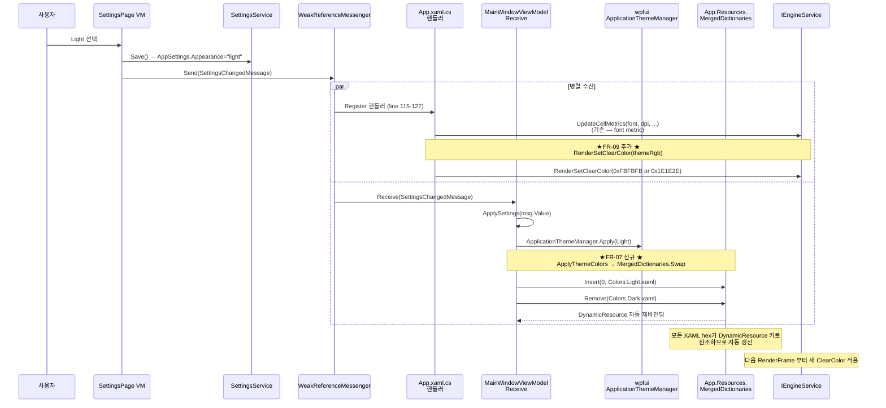

# M-16-A 디자인 시스템 — Design 문서

> **한 줄 요약**: Plan 의 21단계 FR 을 실제 구현 사양 (ResourceDictionary 키 ~40개 + Color hex 표 Dark/Light + Spacing 토큰 5개 + FocusVisualStyle 사양 + C9 콜백 위치 결정) 으로 구체화. **C9 콜백은 옵션 (b) `App.xaml.cs` SettingsChangedMessage 핸들러 확장 채택** — 이미 line 115-127 에 동일 패턴 (font metric 갱신) 존재.

---

## Executive Summary

| 관점 | 내용 |
|------|------|
| **Problem** | Plan 0.2 가 21단계 FR 의 일정·commit 분리·게이트는 정의했으나, 실제 구현 사양 (ResourceDictionary 키 명명·hex 값·C9 콜백 호출 위치·`ApplyThemeColors` 새 시그니처) 은 미정. Design 단계에서 이를 모두 확정해야 Do 단계가 commit-by-commit 으로 진행 가능. |
| **Solution** | (1) ResourceDictionary x:Key ~40개 명명 규약 + Color hex (Dark/Light) 표 확정. (2) **C9 콜백 = 옵션 (b) `App.xaml.cs` SettingsChangedMessage 핸들러에 한 줄 추가** — 이미 `Ioc.Default.GetService<IEngineService>()` 호출 + `engine.UpdateCellMetrics(...)` 호출하는 동일 위치 (line 115-127). (3) `ApplyThemeColors` 22-26줄 → MergedDictionaries.Swap 5줄. (4) Spacing.xaml = Margin/Padding 전용 Thickness 5개 토큰. (5) FocusVisualStyle = 다크/라이트 양 모드 가시 1px outline. |
| **Function/UX Effect** | Do 단계 진입 시 모든 결정이 의사 코드 + 시퀀스 다이어그램으로 명시되어 commit 별 작업 범위 명확. C7/C8/C9 fix 의 사전 계산 hex 값이 표에 있어 PC 복귀 전 90% 사전 검증 가능. |
| **Core Value** | Plan 의 "언제/어떻게" 위에 Design 의 "정확히 무엇" 을 쌓아 Do 단계의 추측 의존도 0 — Plan 검증 시 발견된 4건 결함 (P1/P2-1/P2-2/P2-3) 의 root cause = 추측 명명 — 이 Design 에서 모두 코드 검증으로 확정. |

---

## 1. Overview

### 1.1 Design Goals

- ResourceDictionary 4개 (Colors.Dark / Colors.Light / Spacing / FocusVisuals) 의 정확한 x:Key 와 값 정립
- C9 (engine ClearColor 테마 전환) 콜백 호출 위치를 코드 검증 기반으로 결정
- `ApplyThemeColors` 의 22-26줄 SetBrush 호출을 5줄 swap 으로 단순화하면서도 race condition 회피
- ViewModel/Converter 의 `SolidColorBrush` 상수 제거 + INotifyPropertyChanged 패턴 정립
- Plan 의 5 day-bucket 일정과 1:1 매핑

### 1.2 Design Principles

- **단일 소스 (Single Source of Truth)**: 모든 색·간격 값이 `Themes/*.xaml` 에만 존재. 코드 hex 0건
- **DRY**: C9 콜백은 이미 있는 SettingsChangedMessage 핸들러 (App.xaml.cs:115-127) 확장. 별도 메시지 신설 없음
- **MVVM 준수**: ViewModel 은 brush property 만 노출, 색 자체는 ResourceDictionary 가 소유. Code-behind 에 색 hex 0건
- **테마 전환 race 회피**: MergedDictionaries.Add/Remove 가 atomic 하지 않아 빈 dict 노출 frame 가능 — `Insert(0, lightDict)` + `Remove(darkDict)` 순서로 처리
- **확장 가능**: 미래 Solarized / High Contrast 테마 추가 시 `Colors.{Theme}.xaml` 한 파일만 추가

---

## 2. Architecture

### 2.1 ResourceDictionary 통합 구조



### 2.2 테마 전환 시퀀스 (FR-07 + FR-09)



### 2.3 C9 콜백 결정 — 옵션 (b) 채택 근거

Plan 6.2 표의 3 옵션 중 (b) 선택:

| 옵션 | 위치 | 장점 | 단점 | 채택 |
|:-:|------|------|------|:----:|
| (a) | `MainWindowViewModel` 에 `IEngineService` 의존성 신규 추가 | VM 가 직접 통제 | 생성자 시그니처 변경 — `IWorkspaceService`/`ISettingsService`/`IOscNotificationService` 외 4번째 의존성. VM 책임 비대화 (현재 OSC + Workspace + Settings + Notification 만으로도 충분) | ❌ |
| **(b)** | **`App.xaml.cs` SettingsChangedMessage 핸들러 (line 115-127) 에 한 줄 추가** | **이미 `Ioc.Default.GetService<IEngineService>()` 가져와서 `engine.UpdateCellMetrics(...)` 호출 중. font metric 갱신과 동일 카테고리 (settings 변경 반응)** | App 가 engine 직접 호출 — VM 가 통제하지 않음 (현재 패턴 그대로 유지) | ✅ |
| (c) | `MainWindow.xaml.cs` 의 theme change event 처리 | startup 1회 코드 (`:277`) 와 같은 위치 | code-behind 추가 — MVVM 정신과 거리. `_engine` 보관 + theme event 구독 추가 필요 | ❌ |

**결정**: **(b) 채택**. App.xaml.cs:115-127 의 핸들러에 단 한 줄 추가:

```csharp
// App.xaml.cs:115 핸들러 안 (FR-09 신규)
WeakReferenceMessenger.Default.Register<SettingsChangedMessage>(this,
    (_, msg) =>
    {
        var engine = Ioc.Default.GetService<IEngineService>();
        if (engine is not { IsInitialized: true }) return;
        var font = msg.Value.Terminal.Font;
        var dpiScale = 1.0f;
        if (MainWindow is Window w)
            dpiScale = (float)System.Windows.Media.VisualTreeHelper.GetDpi(w).DpiScaleX;
        engine.UpdateCellMetrics(...);

        // ★ FR-09 신규: theme 별 ClearColor 갱신 ★
        uint clearRgb = msg.Value.Appearance == "light"
            ? 0xFBFBFBu  // Light TerminalBg
            : 0x1E1E2Eu; // Dark TerminalBg (MainWindow.xaml.cs:277 의 startup 값과 동일)
        engine.RenderSetClearColor(clearRgb);
    });
```

> **MainWindow.xaml.cs:277 의 startup hardcode `_engine.RenderSetClearColor(0x1E1E2E)`** 는 그대로 둠 — startup 시 SettingsChanged 가 발송되지 않을 수 있어 (settings 변경 시점이 아니라 fresh load 시점) 초기 색은 startup 코드가 보장. SettingsChanged 핸들러는 그 이후 변경에 반응.

### 2.4 영향 받는 파일 (실제 워크트리 검증)

```
src/GhostWin.App/
├── App.xaml                                      [FR-04: MergedDictionaries 등록]
├── App.xaml.cs                                   [FR-04 startup theme 적용 + FR-09 ClearColor 콜백 (line 115-127 확장)]
├── CommandPaletteWindow.xaml                     [FR-05: hex 9건 → DynamicResource]
├── MainWindow.xaml                               [FR-05: hex 5건 → DynamicResource]
├── MainWindow.xaml.cs                            [변경 없음 — startup 코드 :277 유지]
├── ViewModels/
│   ├── MainWindowViewModel.cs                    [FR-07: ApplyThemeColors 22→5줄, FR-08: Light branch 정확 정의]
│   └── WorkspaceItemViewModel.cs                 [FR-06: Apple 색 4상수 → FindResource + INotifyPropertyChanged]
├── Controls/
│   ├── NotificationPanelControl.xaml             [FR-05: 자체 ResourceDict 제거, 통합 키]
│   ├── PaneContainerControl.cs                   [FR-06: SolidColorBrush 상수 3건 → FindResource]
│   └── SettingsPageControl.xaml                  [FR-05: hex 직접 → DynamicResource]
├── Converters/
│   └── ActiveIndicatorBrushConverter.cs          [FR-06: SolidColorBrush 상수 1건 → FindResource]
└── Themes/                                       [FR-01~03: 신설]
    ├── Colors.Dark.xaml
    ├── Colors.Light.xaml
    ├── Spacing.xaml
    └── FocusVisuals.xaml

src/GhostWin.Core/Interfaces/IEngineService.cs    [변경 없음 — RenderSetClearColor(uint rgb) 기존 API 사용]
src/GhostWin.Interop/EngineService.cs             [변경 없음 — 기존 구현 재사용]
```

> **변경 없는 파일**: `engine-api/ghostwin_engine.cpp` (native), `MainWindow.xaml.cs` (startup `_engine.RenderSetClearColor(0x1E1E2E)` 유지).

---

## 3. ResourceDictionary 사양 (FR-01)

### 3.1 x:Key 명명 규약

`<Group>.<Variant>.<Modifier>` 도트 구분. Group 카테고리 5종:

| Group | 의미 | 예 |
|-------|------|------|
| `Window.*` | 윈도우 셸 (Background, TitleBar) | `Window.Background.Brush`, `Window.TitleBar.Background` |
| `Sidebar.*` | 사이드바 영역 | `Sidebar.Background.Brush`, `Sidebar.Hover.Brush`, `Sidebar.Selected.Brush` |
| `Text.*` | 텍스트 (3 단계 hierarchy) | `Text.Primary.Brush`, `Text.Secondary.Brush`, `Text.Tertiary.Brush` |
| `Accent.*` | 강조색 (FR-08 C8 신규) | `Accent.Primary.Brush`, `Accent.CloseHover.Brush` |
| `Terminal.*` | 터미널 영역 | `Terminal.Background.Brush`, `Terminal.Background.Color` (engine RGB 용) |
| `Divider.*` | 구분선 | `Divider.Brush` |
| `Card.*` / `Application.*` | 설정 페이지 wpfui 호환 | `Card.Background.Brush`, `Application.Background.Brush` |
| `Notification.*` | 알림 패널 | `Notification.Background.Brush`, `Notification.Item.Hover.Brush` |
| `Workspace.*` | 워크스페이스 인디케이터 (C5) | `Workspace.Agent.Running.Brush`, `Workspace.Agent.Idle.Brush`, `Workspace.Agent.Error.Brush`, `Workspace.Agent.Default.Brush` |
| `ActiveIndicator.*` | active indicator (C6) | `ActiveIndicator.Brush` |

### 3.2 ~40 키 매핑 표 (Dark / Light)

기존 `MainWindowViewModel.ApplyThemeColors` (line 245-293) 의 13 키 + C8 신규 2 키 + C5 신규 4 키 + 사이드바 hover/selected 보강 + 알림 패널 통합 + ActiveIndicator + Window.Background.

**Dark 모드** (기존 line 270-286 + 신규):

| x:Key | 타입 | hex | 출처 | 비고 |
|-------|------|------|------|------|
| `Window.Background.Brush` | SolidColorBrush | #0A0A0A | 기존 line 273 | MainWindow Background |
| `Window.TitleBar.Background.Brush` | SolidColorBrush | #0A0A0A | 기존 `TitleBarBg` | |
| `Sidebar.Background.Brush` | SolidColorBrush | #141414 | 기존 `SidebarBg` | |
| `Sidebar.Hover.Brush` | SolidColorBrush | #FFFFFF (Opacity 0.04) | 기존 line 275 부근 (Dark에선 누락? 검증 필요) | **C7 fix** — Opacity 명시 |
| `Sidebar.Selected.Brush` | SolidColorBrush | #FFFFFF (Opacity 0.08) | 기존 누락 가능성 | **C7 fix** |
| `Text.Primary.Brush` | SolidColorBrush | #FFFFFF | 기존 `PrimaryText` | |
| `Text.Secondary.Brush` | SolidColorBrush | #8E8E93 | 기존 `SecondaryText` | |
| `Text.Tertiary.Brush` | SolidColorBrush | #636366 | 기존 `TertiaryText` | |
| `Divider.Brush` | SolidColorBrush | #3A3A3C | 기존 `DividerColor` | |
| `Terminal.Background.Brush` | SolidColorBrush | #1E1E2E | 기존 `TerminalBg` | |
| `Terminal.Background.Color` | Color | #1E1E2E | 신규 — engine RGB 추출용 | FR-09 에서 `0x1E1E2E` 로 사용 |
| `Button.Hover.Brush` | SolidColorBrush | #3E3E42 | 기존 `ButtonHover` | |
| `Application.Background.Brush` | SolidColorBrush | #1A1A1A | 기존 (wpfui 호환) | |
| `Card.Background.Brush` | SolidColorBrush | #2C2C2E | 기존 (wpfui 호환) | |
| `Accent.Primary.Brush` | SolidColorBrush | #0091FF | **신규** — C8 fix | |
| `Accent.CloseHover.Brush` | SolidColorBrush | #5A1F1F | **신규** — C8 fix | Dark 의 close 호버 (붉은 톤 어둡게) |
| `Notification.Background.Brush` | SolidColorBrush | TBD (NotificationPanelControl.xaml grep) | C2 통합 | |
| `Workspace.Agent.Running.Brush` | SolidColorBrush | #34C759 (Apple Green) | 기존 `WorkspaceItemViewModel:9` Apple 상수 | C5 |
| `Workspace.Agent.Idle.Brush` | SolidColorBrush | #FFB020 (Apple Orange) | 기존 `:10` | C5 |
| `Workspace.Agent.Error.Brush` | SolidColorBrush | #FF3B30 (Apple Red) | 기존 `:11` | C5 |
| `Workspace.Agent.Default.Brush` | SolidColorBrush | #8E8E93 (Apple Gray) | 기존 `:12` | C5 |
| `ActiveIndicator.Brush` | SolidColorBrush | TBD (`ActiveIndicatorBrushConverter.cs:10` grep) | C6 | |

**Light 모드** (기존 line 252-269 + 신규):

| x:Key | 타입 | hex | 비고 |
|-------|------|------|------|
| `Window.Background.Brush` | SolidColorBrush | #F5F5F5 | 기존 line 253 |
| `Window.TitleBar.Background.Brush` | SolidColorBrush | #F0F0F0 | 기존 `TitleBarBg` |
| `Sidebar.Background.Brush` | SolidColorBrush | #E8E8E8 | 기존 `SidebarBg` |
| **`Sidebar.Hover.Brush`** | SolidColorBrush | **#000000 (Opacity 0.04)** | **C7 fix** — Opacity 명시. 기존 line 256 `0x00, 0x00, 0x00` 단색을 Opacity 추가 |
| **`Sidebar.Selected.Brush`** | SolidColorBrush | **#000000 (Opacity 0.08)** | **C7 fix** |
| `Text.Primary.Brush` | SolidColorBrush | #1C1C1E | 기존 |
| `Text.Secondary.Brush` | SolidColorBrush | #636366 | 기존 |
| `Text.Tertiary.Brush` | SolidColorBrush | #8E8E93 | 기존 |
| `Divider.Brush` | SolidColorBrush | #D1D1D6 | 기존 |
| `Terminal.Background.Brush` | SolidColorBrush | #FBFBFB | 기존 |
| `Terminal.Background.Color` | Color | #FBFBFB | 신규 — engine RGB 추출용 (FR-09 의 `0xFBFBFB`) |
| `Button.Hover.Brush` | SolidColorBrush | #DCDCE0 | 기존 |
| `Application.Background.Brush` | SolidColorBrush | #F5F5F5 | 기존 |
| `Card.Background.Brush` | SolidColorBrush | #E8E8E8 | 기존 |
| **`Accent.Primary.Brush`** | SolidColorBrush | **#0091FF** | **C8 fix** (Light 에서도 동일 강조 파란색) |
| **`Accent.CloseHover.Brush`** | SolidColorBrush | **#FFE5E5** | **C8 fix** — Light 의 close 호버 (붉은 톤 밝게) |
| `Notification.Background.Brush` | SolidColorBrush | TBD | C2 |
| `Workspace.Agent.*.Brush` | SolidColorBrush | (Dark 와 동일 또는 라이트 변형 — C5 grep 결과로 확정) | C5 |
| `ActiveIndicator.Brush` | SolidColorBrush | TBD | C6 |

> **TBD 항목**: NotificationPanelControl.xaml + ActiveIndicatorBrushConverter.cs 의 정확한 hex 는 Day 1 작업 시 grep + 사전 계산.

### 3.3 Colors.Dark.xaml 예 구조

```xml
<ResourceDictionary xmlns="http://schemas.microsoft.com/winfx/2006/xaml/presentation"
                    xmlns:x="http://schemas.microsoft.com/winfx/2006/xaml">

    <!-- Window 그룹 -->
    <SolidColorBrush x:Key="Window.Background.Brush" Color="#0A0A0A"/>
    <SolidColorBrush x:Key="Window.TitleBar.Background.Brush" Color="#0A0A0A"/>

    <!-- Sidebar 그룹 (C7 fix — Opacity 명시) -->
    <SolidColorBrush x:Key="Sidebar.Background.Brush" Color="#141414"/>
    <SolidColorBrush x:Key="Sidebar.Hover.Brush" Color="#FFFFFF" Opacity="0.04"/>
    <SolidColorBrush x:Key="Sidebar.Selected.Brush" Color="#FFFFFF" Opacity="0.08"/>

    <!-- Text 그룹 -->
    <SolidColorBrush x:Key="Text.Primary.Brush" Color="#FFFFFF"/>
    <SolidColorBrush x:Key="Text.Secondary.Brush" Color="#8E8E93"/>
    <SolidColorBrush x:Key="Text.Tertiary.Brush" Color="#636366"/>

    <!-- Accent 그룹 (C8 fix — 신규) -->
    <SolidColorBrush x:Key="Accent.Primary.Brush" Color="#0091FF"/>
    <SolidColorBrush x:Key="Accent.CloseHover.Brush" Color="#5A1F1F"/>

    <!-- Terminal 그룹 (C9 fix — Color도 노출) -->
    <Color x:Key="Terminal.Background.Color">#1E1E2E</Color>
    <SolidColorBrush x:Key="Terminal.Background.Brush" Color="{StaticResource Terminal.Background.Color}"/>

    <!-- Workspace 그룹 (C5 fix — Apple 색 통합) -->
    <SolidColorBrush x:Key="Workspace.Agent.Running.Brush" Color="#34C759"/>
    <SolidColorBrush x:Key="Workspace.Agent.Idle.Brush" Color="#FFB020"/>
    <SolidColorBrush x:Key="Workspace.Agent.Error.Brush" Color="#FF3B30"/>
    <SolidColorBrush x:Key="Workspace.Agent.Default.Brush" Color="#8E8E93"/>

    <!-- (이하 ~30 키 더) -->
</ResourceDictionary>
```

---

## 4. Spacing.xaml 사양 (FR-02, P2-3)

### 4.1 토큰 5개 (Margin/Padding 전용 Thickness)

```xml
<ResourceDictionary xmlns="http://schemas.microsoft.com/winfx/2006/xaml/presentation"
                    xmlns:x="http://schemas.microsoft.com/winfx/2006/xaml"
                    xmlns:sys="clr-namespace:System;assembly=mscorlib">

    <Thickness x:Key="Spacing.XS">4</Thickness>
    <Thickness x:Key="Spacing.SM">8</Thickness>
    <Thickness x:Key="Spacing.MD">16</Thickness>
    <Thickness x:Key="Spacing.LG">24</Thickness>
    <Thickness x:Key="Spacing.XL">32</Thickness>

</ResourceDictionary>
```

### 4.2 사용처 매핑 (Day 5 작업 — Margin/Padding 전용)

기존 grep 결과의 Margin/Padding 매직 넘버 → Spacing 토큰 매핑:

| 기존 값 | Spacing 토큰 | 사용처 (예) |
|--------|-------------|------------|
| `Margin="0,2,0,0"`, `Margin="4,0,0,0"` | (uniform 0 또는 직접 — XS 보다 작은 비대칭 값) | NotificationPanel 항목 inner — **토큰 미적용 가능** (소수 비대칭 값은 그대로 둠) |
| `Margin="0,6,0,0"`, `Margin="0,8,...`, `Padding="0"` | Spacing.SM 일부 | NotificationPanel inner |
| `Margin="12,8"`, `Margin="12,0"` | (12 는 토큰 없음 — 그대로 둠 또는 LG 14→16 으로 정렬?) | 기존 12 값은 보통 디자인 결함, MD(16) 또는 SM(8) 로 정렬 검토 |
| `Margin="16,12,12,8"`, `Margin="16,8"` | Spacing.MD 변형 — uniform 16 으로 정렬 가능한지 검토 | MainWindow Sidebar 헤더 |
| `Margin="0,24,0,0"` | Spacing.LG (top only) — `Margin="0,24,0,0"` 그대로 두거나 `<Setter Value="{StaticResource Spacing.LG}"/>` 후 RenderTransform 으로 top only | NotificationPanel 빈 상태 |

> **Day 5 정책**: uniform 4/8/16/24/32 매칭은 토큰 적용. 비대칭 (예 `4,0,0,0`, `0,2,0,0`) 은 토큰 적용 안 함 (Thickness 토큰의 한계 — Margin/Padding 의 4-arg 비대칭은 별도 토큰화 후보, M-A 범위 외).

### 4.3 Out of Scope (P2-3 — `m16-a-spacing-extra` 후보)

- `Width="500"`, `Height="32"`, `Width="28"`, `Height="28"`, `Width="22"`, `Height="22"`, `MaxHeight="400"`, `MaxHeight="300"`, `MinWidth="120"`, `MaxWidth="400"` (double 타입)
- `FontSize="14"`, `FontSize="11"`, `FontSize="13"`, `FontSize="12"`, `FontSize="10"`, `FontSize="16"` (double)
- `<RowDefinition Height="32"/>`, `<ColumnDefinition Width="16"/>` (GridLength)

→ M-16-A 에서 미터치, 별도 mini-milestone (`m16-a-spacing-extra` 후보) 분리.

---

## 5. FocusVisuals.xaml 사양 (FR-03)

### 5.1 전역 FocusVisualStyle (다크/라이트 양 모드 가시)

```xml
<ResourceDictionary xmlns="http://schemas.microsoft.com/winfx/2006/xaml/presentation"
                    xmlns:x="http://schemas.microsoft.com/winfx/2006/xaml">

    <!-- 다크 UI 에서도 보이고 라이트 UI 에서도 보이는 강한 outline -->
    <Style x:Key="GhostWin.FocusVisual.Default" TargetType="Control">
        <Setter Property="Template">
            <Setter.Value>
                <ControlTemplate>
                    <Rectangle Margin="-2"
                               StrokeThickness="2"
                               Stroke="{DynamicResource Accent.Primary.Brush}"
                               StrokeDashArray="1 0"
                               SnapsToDevicePixels="True"/>
                </ControlTemplate>
            </Setter.Value>
        </Setter>
    </Style>

    <!-- 모든 Button/MenuItem/ListBoxItem 전역 적용 -->
    <Style TargetType="Button" BasedOn="{StaticResource {x:Type Button}}">
        <Setter Property="FocusVisualStyle" Value="{StaticResource GhostWin.FocusVisual.Default}"/>
    </Style>
    <Style TargetType="MenuItem" BasedOn="{StaticResource {x:Type MenuItem}}">
        <Setter Property="FocusVisualStyle" Value="{StaticResource GhostWin.FocusVisual.Default}"/>
    </Style>
    <Style TargetType="ListBoxItem" BasedOn="{StaticResource {x:Type ListBoxItem}}">
        <Setter Property="FocusVisualStyle" Value="{StaticResource GhostWin.FocusVisual.Default}"/>
    </Style>
    <!-- TextBox, ComboBox 등도 동일 추가 -->

</ResourceDictionary>
```

### 5.2 결정 근거

- **Stroke = Accent.Primary.Brush (#0091FF)**: 다크/라이트 양 모드에서 모두 0091FF 가 충분한 컨트라스트 유지
- **StrokeThickness=2**: 1px 은 다크 UI 에서 안 보일 수 있음, 2px 로 명확
- **Margin=-2**: 컨트롤 외부에 outline (overlap 회피)
- **SnapsToDevicePixels**: DPI 변경 시 흐림 방지
- **BasedOn 기반 전역 적용**: 모든 Button/MenuItem 등에 자동 적용 — 별도 설정 불필요

---

## 6. ApplyThemeColors 새 시그니처 (FR-07, C10)

### 6.1 기존 코드 (제거 대상)

`MainWindowViewModel.cs:245-293` 의 26줄 SetBrush 호출:

```csharp
private static void ApplyThemeColors(bool isLight)
{
    var window = Application.Current?.MainWindow;
    if (window == null) return;
    if (isLight)
    {
        window.Background = new SolidColorBrush(Color.FromRgb(0xF5, 0xF5, 0xF5));
        SetBrush(window, "TitleBarBg", 0xF0, 0xF0, 0xF0);
        SetBrush(window, "SidebarBg", 0xE8, 0xE8, 0xE8);
        // ... 14줄 더 (Light)
    }
    else
    {
        // ... 13줄 (Dark)
    }
}

private static void SetBrush(Window window, string key, byte r, byte g, byte b) {...}
```

### 6.2 신규 코드 (FR-07)

```csharp
private static void ApplyThemeColors(bool isLight)
{
    var app = Application.Current;
    if (app == null) return;

    var newDictUri = isLight
        ? new Uri("Themes/Colors.Light.xaml", UriKind.Relative)
        : new Uri("Themes/Colors.Dark.xaml", UriKind.Relative);
    var newDict = (ResourceDictionary)app.LoadComponent(newDictUri);

    // Race-free swap: Insert 먼저, Remove 나중 (빈 dict 노출 frame 회피)
    var oldDicts = app.Resources.MergedDictionaries
        .Where(d => d.Source?.OriginalString.StartsWith("Themes/Colors.") == true)
        .ToList();
    app.Resources.MergedDictionaries.Insert(0, newDict);
    foreach (var old in oldDicts)
        app.Resources.MergedDictionaries.Remove(old);
}
```

5줄 swap (인덱스 계산 포함). `SetBrush` 헬퍼는 삭제.

### 6.3 race-free 보장 근거

- WPF DynamicResource 는 첫 번째 매칭 키를 사용 — `Insert(0, newDict)` 시점에 즉시 새 키 활성화
- `Remove(oldDict)` 는 이미 새 dict 가 우선순위 1 이라 영향 없음
- `MergedDictionaries` 는 ObservableCollection — 단일 스레드 (UI thread) 에서만 호출, 동시성 문제 없음

---

## 7. ViewModel/Converter brush 패턴 (FR-06, R5 완화)

### 7.1 WorkspaceItemViewModel (C5)

기존 코드:
```csharp
public class WorkspaceItemViewModel : ObservableObject
{
    public static readonly SolidColorBrush AgentRunning = new(Color.FromRgb(0x34, 0xC7, 0x59));  // line 9
    public static readonly SolidColorBrush AgentIdle = new(Color.FromRgb(0xFF, 0xB0, 0x20));     // line 10
    public static readonly SolidColorBrush AgentError = new(Color.FromRgb(0xFF, 0x3B, 0x30));    // line 11
    public static readonly SolidColorBrush AgentDefault = new(Color.FromRgb(0x8E, 0x8E, 0x93));  // line 12
    // ... 사용 시 IndicatorBrush => agentState switch { running => AgentRunning, ... }
}
```

신규 코드:
```csharp
public class WorkspaceItemViewModel : ObservableObject
{
    public Brush IndicatorBrush => GetBrushForState(AgentState);

    private static Brush GetBrushForState(AgentState state)
    {
        var key = state switch
        {
            AgentState.Running => "Workspace.Agent.Running.Brush",
            AgentState.Idle => "Workspace.Agent.Idle.Brush",
            AgentState.Error => "Workspace.Agent.Error.Brush",
            _ => "Workspace.Agent.Default.Brush",
        };
        return (Brush)Application.Current.FindResource(key);
    }

    // 테마 전환 시 IndicatorBrush 재바인딩 — SettingsChangedMessage 수신 후 호출
    public void OnThemeChanged() => OnPropertyChanged(nameof(IndicatorBrush));
}
```

`OnThemeChanged` 호출은 `MainWindowViewModel.Receive(SettingsChangedMessage msg)` 에서 모든 `WorkspaceItemViewModel` 에 전파 (또는 각 VM 이 messenger 직접 register).

### 7.2 ActiveIndicatorBrushConverter (C6)

기존:
```csharp
public class ActiveIndicatorBrushConverter : IValueConverter
{
    private static readonly SolidColorBrush Active = new(Color.FromRgb(...));  // line 10
    public object Convert(...) => isActive ? Active : Brushes.Transparent;
}
```

신규:
```csharp
public class ActiveIndicatorBrushConverter : IValueConverter
{
    public object Convert(...) =>
        isActive
            ? (Brush)Application.Current.FindResource("ActiveIndicator.Brush")
            : Brushes.Transparent;
}
```

> Converter 는 매번 `Convert` 호출되므로 INotifyPropertyChanged 불필요 — Convert 호출 시점에 항상 최신 ResourceDictionary 참조.

### 7.3 PaneContainerControl (C4)

기존: 3개 SolidColorBrush 상수 (line 298, 323, 368) — Day 6-7 grep 후 정확한 위치 확인 후 같은 패턴으로 치환.

---

## 8. Implementation Guide (Plan 의 Day-Bucket 과 1:1 매핑)

### 8.1 File Structure

```
src/GhostWin.App/Themes/
├── Colors.Dark.xaml          (FR-01, Day 1)
├── Colors.Light.xaml         (FR-01, Day 1)
├── Spacing.xaml              (FR-02, Day 2)
└── FocusVisuals.xaml         (FR-03, Day 2)
```

### 8.2 Implementation Order (Plan Section 8.2 와 동일)

| Day | 산출물 | Design 참조 |
|:---:|--------|-----------|
| Day 1 | Colors.Dark.xaml + Colors.Light.xaml | Section 3 — x:Key 표 + hex 값 |
| Day 2 | Spacing.xaml + FocusVisuals.xaml + App.xaml MergedDictionaries | Section 4, 5 |
| Day 3-4 | CommandPaletteWindow, NotificationPanelControl, MainWindow XAML hex → DynamicResource | Section 3.1 명명 규약 |
| Day 5 | SettingsPageControl XAML + Margin/Padding 일괄 치환 | Section 4.2 사용처 매핑 |
| Day 6-7 | C# brush 상수 제거 + ApplyThemeColors swap | Section 6, 7 |
| Day 8 | C7/C8/C9 실명 버그 fix | Section 3.2 Light branch + 2.3 C9 콜백 |
| Day 9 | TabIndex / AutomationProperties / Focusable 재검토 | Plan FR-10~13 |
| Day 10 | 시각 검증 + 회귀 게이트 | Plan Section 8.4 |

---

## 9. Test Plan

### 9.1 Test Scope

| Type | Target | Tool (실제 워크트리 검증) |
|------|--------|--------------------------|
| 빌드 검증 | sln 전체 (C++ vcxproj + C# csproj) | `msbuild GhostWin.sln /p:Configuration=Debug /p:Platform=x64 /m` |
| C# Tests (sln 등록) | E2E.Tests, MeasurementDriver | `msbuild GhostWin.sln` 으로 자동 빌드 + `dotnet test tests/GhostWin.E2E.Tests/GhostWin.E2E.Tests.csproj` |
| C# Tests (sln 미등록) | Core.Tests, App.Tests | 별도 `dotnet test tests/GhostWin.Core.Tests/` + `dotnet test tests/GhostWin.App.Tests/` (sln 미등록 — 별도 호출 필수) |
| C++ Tests | `GhostWin.Engine.Tests.vcxproj` | `msbuild ... /p:GhostWinTestName={name} /p:Configuration=Debug` 후 `build\tests\Debug\{name}.exe` 직접 실행. README 의 PowerShell loop 사용 |
| 측정 회귀 | M-15 시나리오 3건 (idle/resize-4pane/load) | `scripts/measure_render_baseline.ps1` |
| 시각 검증 | C7/C8/C9 + Tab 포커스 | PC 복귀 후 수동 |

> **P1 추가 fix**: `Core.Tests` 와 `App.Tests` 가 sln 에 미등록 — `msbuild GhostWin.sln` 으로는 빌드되지 않는다 (워크트리 검증). 이들은 별도 `dotnet test` 호출 필수. C++ Tests 는 vstest.console 가 아니라 `GhostWinTestName` property 로 단일 테스트 빌드 + 직접 exe 실행 (`tests/GhostWin.Engine.Tests/README.md` 인용).

### 9.2 Test Cases

#### Happy path (테마 전환)

- [ ] startup 시 Light 모드로 시작 (settings.Appearance="light") 시 frame 깜박임 없음 (C13)
- [ ] Dark 시작 → Settings 에서 Light 변경 → 모든 UI 요소가 Light 톤으로 자연 전환
- [ ] Light → Dark 역방향 전환 동일

#### 실명 버그 fix 검증

- [ ] **C7**: Light 모드 사이드바 호버 시 Sidebar.Hover.Brush 가 흰색 Opacity 0.04 로 적용 (검정 박스 사라짐)
- [ ] **C8**: Light 모드에서 Accent.CloseHover.Brush 가 #FFE5E5 로 변경 (close 호버 라이트 톤)
- [ ] **C9**: Light 모드 전환 시 engine.RenderSetClearColor(0xFBFBFB) 호출 → 터미널 background 라이트 톤

#### Edge cases

- [ ] 테마 전환 < 100ms 응답 (NFR)
- [ ] 테마 전환 시 빈 dict 노출 frame 0 (race-free swap 검증 — 시각 인지 한계 내)
- [ ] WorkspaceItemViewModel 의 IndicatorBrush 가 테마 전환에 자동 갱신 (INotifyPropertyChanged)

#### 회귀

- [ ] M-15 시나리오 3건 PASS (Day 7 + Day 10 게이트)
- [ ] E2E.Tests UIA AutomationId 보존 (Day 9 후 TabIndex 명시 후)
- [ ] 단위 테스트 (Core.Tests + App.Tests + E2E.Tests) 회귀 0
- [ ] C++ Engine.Tests vt_core_test + conpty_integration_test 회귀 0

---

## 10. Coding Convention

### 10.1 명명 규약 (M-A 정립)

| Target | Rule | 예 |
|--------|------|------|
| ResourceDictionary x:Key | `<Group>.<Variant>.<Modifier>` (도트 구분) | `Sidebar.Hover.Brush`, `Accent.Primary.Brush` |
| Spacing 토큰 키 | `Spacing.{XS\|SM\|MD\|LG\|XL}` | `<Setter Value="{StaticResource Spacing.MD}"/>` |
| FocusVisualStyle 키 | `GhostWin.FocusVisual.{Variant}` | `GhostWin.FocusVisual.Default` |
| Color 분리 키 | `<Group>.<Variant>.Color` (Color 타입), `<Group>.<Variant>.Brush` (Brush 타입) | engine RGB 추출 시 `Terminal.Background.Color` 직접 참조 |

### 10.2 DynamicResource vs StaticResource 사용 규칙 (FR-10, C11)

| 자원 | 참조 방식 | 이유 |
|------|----------|------|
| 색·brush (테마 영향) | DynamicResource | 테마 전환 시 자동 재바인딩 |
| Spacing 토큰 (정적) | StaticResource | 컴파일 타임 고정, 성능 최적 |
| FocusVisualStyle | StaticResource | Style 자체는 정적 |
| 색을 참조하는 Style | DynamicResource (Style 안에서 색만) | 색 변경 시 Style 도 자동 갱신 |

### 10.3 Conventions Reference

기존 프로젝트 규칙은 `.claude/rules/{behavior,commit,documentation}.md` 참조. M-A 가 정립한 ResourceDictionary 명명 규약은 본 Design 문서가 single source.

---

## 11. Architectural Decisions Summary

Plan 6.2 표의 6 결정 + Design 추가 결정:

| # | Decision | Selected | Section |
|:-:|----------|----------|---------|
| 1 | 테마 전환 패턴 | ResourceDictionary swap | 2.1 |
| 2 | Color 정의 위치 | Dark.xaml + Light.xaml 2개 dict swap | 3 |
| 3 | Spacing 토큰 타입 | Margin/Padding 전용 Thickness, 나머지는 별도 mini-milestone | 4 |
| 4 | Focus Visual 접근법 | 전역 Style.TargetType=Control (BasedOn) | 5 |
| 5 | ViewModel brush 갱신 | FindResource + INotifyPropertyChanged | 7 |
| 6 | Spacing 토큰 마이그레이션 | 일괄 (Margin/Padding 전용) | 4.2 |
| **7 (P2-2)** | **C9 ClearColor 콜백 위치** | **(b) `App.xaml.cs` SettingsChangedMessage 핸들러 (line 115-127) 확장 — 한 줄 추가** | **2.3** |
| 8 (Design 추가) | race-free swap 순서 | Insert(0, new) → Remove(old) (빈 dict 노출 frame 0) | 6.3 |
| 9 (Design 추가) | Color 와 Brush 분리 | Terminal.Background.{Color, Brush} 양쪽 노출 | 3.3 |

---

## 12. Risks & Mitigation (Design 추가)

Plan 9 리스크 + Design 추가 2건:

| # | 리스크 | 심각도 | 가능성 | 완화 |
|:-:|-------|:-----:|:------:|------|
| R10 (Design 추가) | LoadComponent 가 ResourceDictionary 를 매번 새로 파싱 — 메모리 누수 가능성 | 🟡 medium | 🟢 low | 테마 전환 빈도 낮음 (사용자 액션). 누적 시 GC 가 처리. 측정 결과 문제되면 캐싱 패턴 도입 |
| R11 (Design 추가) | C5 의 `WorkspaceItemViewModel.OnThemeChanged()` 호출 누락 시 IndicatorBrush 가 옛 색 잔존 | 🟠 medium | 🟠 medium | `MainWindowViewModel.Receive(SettingsChangedMessage)` 에서 `Workspaces.ToList().ForEach(w => w.OnThemeChanged())` 명시. Day 6-7 코드 리뷰 시 확인 |

---

## 13. Next Steps

### 13.1 즉시 다음 단계

```bash
/pdca do m16-a-design-system
```

→ Do 단계 진입. Design 의 Section 3 (~40 키 표), Section 4 (Spacing 5 토큰), Section 6 (5줄 swap), Section 2.3 (C9 콜백 위치) 을 참조하여 commit-by-commit 구현.

### 13.2 Plan 추가 정정 사안 (Design 작성 중 발견)

**P1 추가 fix** (Plan 0.3 후보):
- `tests/GhostWin.Core.Tests` 와 `tests/GhostWin.App.Tests` 가 `GhostWin.sln` 에 **미등록**. `msbuild GhostWin.sln` 으로는 빌드 안 됨 — 별도 `dotnet test` 호출 필수.
- C++ Engine.Tests 실행은 **vstest.console 이 아니라** `msbuild ... /p:GhostWinTestName={name}` + `build\tests\Debug\{name}.exe` 직접 실행 (`tests/GhostWin.Engine.Tests/README.md` 표준).
- Plan 0.2 의 "Day 6-7 회귀 검증" 에 이 정정 반영 필요.

### 13.3 Stale 정리 사안 (별도 commit 후보)

- `scripts/run_wpf.ps1` line 7: `Build first: scripts\build_wpf.ps1` (build_wpf.ps1 미존재 — VS solution 전환 시 삭제됨)
- → `Build first: msbuild GhostWin.sln /p:Configuration=Release /p:Platform=x64 /m` 로 변경 필요

---

## Version History

| Version | Date | Changes | Author |
|---------|------|---------|--------|
| 0.1 | 2026-04-28 | Initial Design — 13 결정 항목 (Plan 6 + Design 추가 7), C9 콜백 위치 = (b) App.xaml.cs SettingsChangedMessage 확장 채택, ResourceDictionary x:Key ~40개 + Color hex (Dark/Light) 표 + Spacing 5 토큰 + FocusVisualStyle 사양 + ApplyThemeColors 5줄 swap + ViewModel brush INotifyPropertyChanged 패턴 + race-free swap 순서. Plan 0.2 P2-2 결정 보류 항목 모두 closure. | 노수장 |
