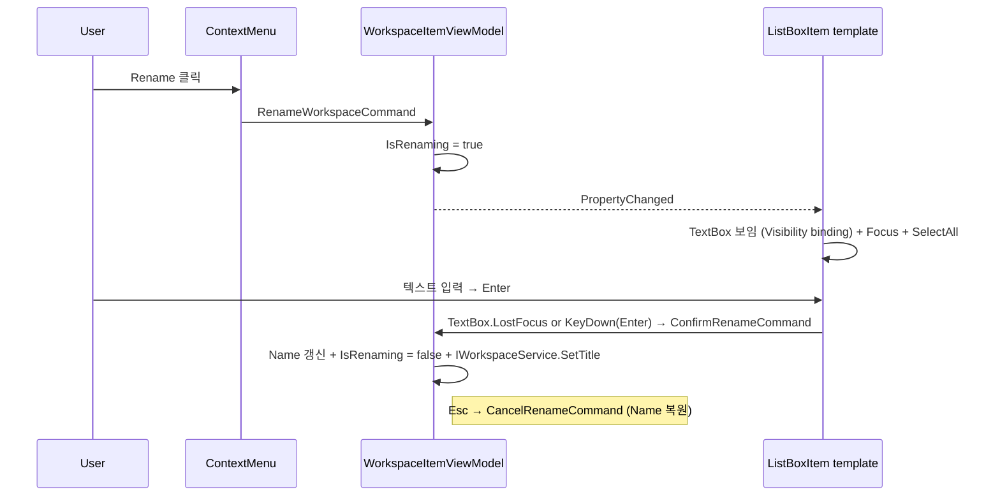

# M-16-D Design v0.1 — cmux UX 패리티

> **한 줄 요약**: Plan v0.1 의 16 FR + 10 NFR 을 **15 architectural decision (D-01..D-15)** + 3 sequence diagram + 파일 단위 구조 spec 으로 분해.

> **출처**: Plan `docs/01-plan/features/m16-d-context-menu.plan.md` + 코드 fact 표 직접 재검증.

---

## 0. Phase 별 Decision Map

```mermaid
graph LR
    subgraph PA["Phase A — ContextMenu 4영역"]
        DA1[D-01 ContextMenu Style 1개]
        DA2[D-02 Sidebar 7항목 menu]
        DA3[D-03 Inline Rename]
        DA4[D-04 Terminal RBUTTONUP 분기]
        DA5[D-05 External Launcher]
        DA6[D-06 Pane 4-5항목 + ZoomPane]
        DA7[D-07 Notification 3항목]
    end

    subgraph PB["Phase B — Workspace DragDrop"]
        DB1[D-08 MoveWorkspace API]
        DB2[D-09 ListBox AllowDrop]
        DB3[D-10 Drop Adorner]
        DB4[D-11 Persist Order]
    end

    subgraph PC["Phase C — Settings + 검증"]
        DC1[D-12 Force Toggle]
        DC2[D-13 PATH probe]
        DC3[D-14 AutomationProperties 일괄]
        DC4[D-15 ZoomPane reader 안전]
    end

    PA --> PB --> PC
```



**총 15 결정**: A=7, B=4, C=4.

---

## 1. Phase A 결정 (D-01..D-07)

### D-01 ContextMenu base style — `App.xaml`

**선택지**:
- (a) **WPF 표준 `MenuItem` + Style** (default — 외부 의존성 0)
- (b) `Wpf.Ui.Controls.MenuItem`
- (c) Custom Popup

**채택**: (a). 이유:
- M-16-A `DynamicResource` 토큰 호환
- VK_APPS / Shift+F10 / 키보드 화살표 자동 동작
- E2E UIA 자동 노출 (`AutomationProperties.Name` 만 부여하면 끝)
- (b) 는 `Wpf.Ui` v3 `MenuItem` 확인 결과 기본 `MenuItem` 상속 — 별도 채택 이익 없음

**구조**:

```xml
<!-- App.xaml ResourceDictionary -->
<Style x:Key="ContextMenuBase" TargetType="ContextMenu">
  <Setter Property="Background" Value="{DynamicResource Surface.Brush}"/>
  <Setter Property="BorderBrush" Value="{DynamicResource Border.Brush}"/>
  <Setter Property="BorderThickness" Value="1"/>
  <Setter Property="Padding" Value="{StaticResource Spacing.XS}"/>
  <Setter Property="FontFamily" Value="Segoe UI Variable"/>
</Style>
<Style x:Key="MenuItemBase" TargetType="MenuItem">
  <Setter Property="Foreground" Value="{DynamicResource Text.Primary.Brush}"/>
  <Setter Property="Padding" Value="{StaticResource Spacing.SM}"/>
  <!-- hover/disabled triggers — Surface.Hover.Brush / Text.Disabled.Brush -->
</Style>
<Style TargetType="ContextMenu" BasedOn="{StaticResource ContextMenuBase}"/>
<Style TargetType="MenuItem" BasedOn="{StaticResource MenuItemBase}"/>
```

**검증**: A1 commit 후 모든 ContextMenu 가 동일 visual.

---

### D-02 Sidebar ContextMenu — `MainWindow.xaml` + `WorkspaceItemViewModel`

**메뉴 7항목** (D2-A 적용 — Mark All Read = 워크스페이스 한정):

```
1. Rename                  → IsRenaming=true (D-03)
2. Edit Description        → 별도 dialog (이미 다른 곳에 있을 수 있음 — 확인 후 placeholder)
3. Pin Workspace           → IWorkspaceService.SetPinned(id, !IsPinned)
4. Move Up                 → IWorkspaceService.MoveWorkspace(id, currentIndex - 1) (B1 후 활성)
5. Move Down               → IWorkspaceService.MoveWorkspace(id, currentIndex + 1) (B1 후 활성)
6. Mark All Read           → 워크스페이스 알림 read 처리 (NotificationCenter scope)
7. ─────────── (Separator)
8. Close Workspace         → 기존 CloseWorkspaceCommand 재사용
```

**RelayCommand 신규 6개**: `RenameWorkspaceCommand`, `EditDescriptionCommand`, `PinWorkspaceCommand`, `MoveUpCommand`, `MoveDownCommand`, `MarkAllReadCommand`. (`CloseWorkspaceCommand` 는 기존 재사용)

`AutomationProperties.Name` 7개 모두 부여 (NFR-05).

---

### D-03 Sidebar inline Rename — D3-A

**메커니즘**:



**XAML 구조** (간소):

```xml
<DataTemplate>
  <Grid>
    <TextBlock Text="{Binding Name}" Visibility="{Binding IsRenaming, Converter=InverseBool}"/>
    <TextBox Text="{Binding RenameDraft, UpdateSourceTrigger=PropertyChanged}"
             Visibility="{Binding IsRenaming, Converter=BoolToVis}"
             KeyDown="OnRenameKeyDown" LostFocus="OnRenameLostFocus"/>
  </Grid>
</DataTemplate>
```

`RenameDraft`, `IsRenaming` 둘 다 `WorkspaceItemViewModel` 의 `[ObservableProperty]`.

---

### D-04 Terminal RBUTTONUP 분기 — D1-A

**핵심 로직** (`TerminalHostControl.cs` WndProc 안):

```csharp
case WM_RBUTTONUP:
    // D1-A: ghostty mouse encoder 활성 모드면 mouse encode 우선
    bool encoderActive = engine.GetMode(SessionId, MOUSE_ANY)
                      || engine.GetMode(SessionId, MOUSE_X10)
                      || engine.GetMode(SessionId, MOUSE_SGR);
    bool forceMenu = settings.Current.Terminal.ForceContextMenu; // C1 토글

    if (encoderActive && !forceMenu) {
        // 기존 동작 — ghostty 가 encode
        return DefaultHandling(...);
    }

    // ContextMenu 표시
    Dispatcher.BeginInvoke(() => {
        ContextMenu.IsOpen = true;
        ContextMenu.PlacementTarget = this;
        ContextMenu.Placement = Mouse;
    });
    return Handled;
```

**기존 `WM_RBUTTONDOWN` 처리는 보존** (DECCKM/X10 는 PRESS 이벤트만 보냄). RBUTTONUP 만 분기 추가.

`vt_bridge_mode_get` 의 mode value 상수 (`#define VT_MODE_X10 9` 등) 추가 필요 — 또는 기존 `gw_session_mode_get` 으로 wrap.

**기존 코드 검증**: `vt_bridge.h:147` `VT_MODE_DECCKM=1`, `VT_MODE_BRACKETED_PASTE=2004` 만 정의됨. **추측**: mouse mode 상수는 본 design 에서 추가 (`VT_MODE_MOUSE_X10=9`, `VT_MODE_MOUSE_VT200=1000`, `VT_MODE_MOUSE_BUTTON_EVENT=1002`, `VT_MODE_MOUSE_ANY_EVENT=1003`, `VT_MODE_MOUSE_SGR=1006`).

---

### D-05 External Launcher — `Helpers/ExternalLauncher.cs` 신규

**API**:

```csharp
public static class ExternalLauncher
{
    /// <summary>VS Code (code.cmd) PATH 에 있으면 cwd 인자로 실행, 없으면 false.</summary>
    public static bool TryOpenInVsCode(string cwd);
    public static bool TryOpenInCursor(string cwd);
    public static bool TryOpenInExplorer(string cwd);

    /// <summary>where.exe {name} 으로 PATH probe — 결과 캐시 (한 세션 1회).</summary>
    public static bool IsAvailable(string executable);
}
```

**ContextMenu MenuItem 의 IsEnabled 바인딩**: `IsAvailable("code")` / `IsAvailable("cursor")` 결과를 `OneTime` 으로 바인딩.

**PATH probe** (D5-A): `Process.Start("where.exe", name)` ExitCode == 0. `Dictionary<string, bool>` 으로 세션 캐시.

`cwd` 는 `SessionInfo.Cwd` (이미 OSC 7 로 갱신됨).

---

### D-06 Pane ContextMenu + ZoomPane — `PaneContainerControl.cs` + `IPaneLayoutService`

**메뉴 5항목** (분할 leaf Border 의 ContextMenu):

```
1. Split Vertical          → Alt+V 와 동일
2. Split Horizontal        → Alt+H 와 동일
3. Close Pane              → Ctrl+Shift+W 와 동일
4. Zoom Pane               → 신규 (D-15 reader 안전)
5. Move to Adjacent        → 신규 (보류, deferred 표시 가능)
```

**ZoomPane** (`IPaneLayoutService.ZoomPane(uint paneId)`): 다른 모든 leaf 의 host `Visibility=Collapsed` (M-14 reader 안전 — HwndHost destroy 금지). 같은 paneId 재호출 시 unzoom (모두 Visible).

`PaneContainerControl` 의 `_hostControls` Dictionary 에 zoomed flag 1개 추가 + `Visibility` 일괄 토글.

---

### D-07 Notification ContextMenu — `NotificationPanelControl.xaml`

**메뉴 3항목**:

```
1. Mark Read    → NotificationItemViewModel.MarkReadCommand (이미 존재 가능)
2. Dismiss      → NotificationItemViewModel.DismissCommand (이미 존재 가능)
3. Jump         → 알림이 가리키는 워크스페이스 활성 + ContextMenu 닫기
```

기존 `NotificationClickCommand` 가 Jump 와 동일하면 재사용. `AutomationProperties.Name` 3개.

---

## 2. Phase B 결정 (D-08..D-11)

### D-08 MoveWorkspace API — `WorkspaceService.cs`

**signature**:

```csharp
public interface IWorkspaceService
{
    // 신규
    void MoveWorkspace(uint workspaceId, int newIndex);
}
```

**구현**:

```csharp
public void MoveWorkspace(uint workspaceId, int newIndex)
{
    var entry = _entries.GetValueOrDefault(workspaceId);
    if (entry == null) return;
    int oldIndex = _orderedWorkspaces.IndexOf(entry.Info);
    if (oldIndex < 0) return;
    newIndex = Math.Clamp(newIndex, 0, _orderedWorkspaces.Count - 1);
    if (oldIndex == newIndex) return;

    // entry 인스턴스 유지 — 순서만 swap (Risk-2 완화)
    _orderedWorkspaces.RemoveAt(oldIndex);
    _orderedWorkspaces.Insert(newIndex, entry.Info);

    WeakReferenceMessenger.Default.Send(new WorkspaceReorderedMessage(workspaceId, newIndex));
}
```

**Message 신규**: `WorkspaceReorderedMessage(uint Id, int NewIndex) : ValueChangedMessage<...>` 또는 record + Send.

---

### D-09 ListBox AllowDrop + DataObject — `MainWindow.xaml.cs`

**Drag 트리거**:

```csharp
// PreviewMouseLeftButtonDown — 4px threshold 저장
private Point _dragStart;
private void OnSidebarPreviewMouseDown(object sender, MouseButtonEventArgs e)
    => _dragStart = e.GetPosition(SidebarListBox);

private void OnSidebarPreviewMouseMove(object sender, MouseEventArgs e)
{
    if (e.LeftButton != Pressed) return;
    if (Distance(e.GetPosition(SidebarListBox), _dragStart) < 4) return;
    var item = FindItemUnder(e.OriginalSource as DependencyObject);
    if (item?.DataContext is WorkspaceItemViewModel vm)
    {
        var data = new DataObject("ghostwin.workspace.id", vm.Id);
        DragDrop.DoDragDrop(item, data, DragDropEffects.Move);
    }
}
```

**Drop 처리**:

```csharp
private void OnSidebarDrop(object sender, DragEventArgs e)
{
    if (!e.Data.GetDataPresent("ghostwin.workspace.id")) return;
    uint draggedId = (uint)e.Data.GetData("ghostwin.workspace.id");
    int newIndex = ComputeDropIndex(e.GetPosition(SidebarListBox));
    _workspaces.MoveWorkspace(draggedId, newIndex);
}
```

**ListBox 보호** (Risk-2 완화):
- `VirtualizingStackPanel.IsVirtualizing="False"` (사이드바 < 20 항목)
- 드래그 중 `PaneContainerControl.IsHitTestVisible=False`

---

### D-10 Drop Adorner — `WorkspaceDropAdorner.cs` 신규

**시각** (D4-A 1px 가로 막대):

```csharp
public class WorkspaceDropAdorner : Adorner
{
    private readonly Pen _pen;
    public int InsertIndex { get; set; }
    public double LineY { get; set; }

    public WorkspaceDropAdorner(UIElement adornedElement) : base(adornedElement)
    {
        var brush = (Brush)Application.Current.FindResource("Accent.Primary.Brush");
        _pen = new Pen(brush, 1.0); _pen.Freeze();
    }

    protected override void OnRender(DrawingContext dc)
    {
        dc.DrawLine(_pen, new Point(0, LineY), new Point(ActualWidth, LineY));
    }
}
```

`AdornerLayer.GetAdornerLayer(SidebarListBox).Add(adorner)` → `OnSidebarDragOver` 에서 `LineY` 갱신 → Drop 시 `Remove`.

---

### D-11 Persist Order — `SessionSnapshotService` 의 직렬화 트리거

**기존 코드 재사용**: `SessionSnapshotService` 가 주기 저장 + workspace 순서 직렬화 (확인 필요). 만약 이미 순서 보존이면 추가 작업 0. 만약 순서 미보존이면 `_orderedWorkspaces` 의 IndexOf 결과를 직렬화.

**검증**: `MoveWorkspace` 호출 시 `WorkspaceReorderedMessage` publish → `SessionSnapshotService` 가 receive → 즉시 save 또는 다음 주기 save.

대안: Settings 갱신 후 `_settings.Save()` 직접 호출.

---

## 3. Phase C 결정 (D-12..D-15)

### D-12 Force ContextMenu Toggle — `AppSettings`

```csharp
public sealed class TerminalSettings
{
    public FontSettings Font { get; set; } = new();
    public string Scrollbar { get; set; } = "system";   // M-16-C
    public bool ForceContextMenu { get; set; } = false; // M-16-D D-12
}
```

`SettingsPageViewModel` `[ObservableProperty] _forceContextMenu = false;` + LoadFromSettings + ApplyAndSave + XAML CheckBox.

---

### D-13 PATH Probe — D5-A

`ExternalLauncher.IsAvailable` 의 캐시 정책 — 한 세션 1회 (앱 시작 시 PATH probe). 사용자가 PATH 변경 후 GhostWin 재시작하지 않으면 stale — acceptable.

---

### D-14 AutomationProperties.Name 일괄

| 위치 | 항목 수 |
|---|:-:|
| Sidebar ContextMenu | 7 |
| Terminal ContextMenu | 7 |
| Pane ContextMenu | 5 |
| Notification ContextMenu | 3 |
| Sidebar Drop indicator | 0 (시각만) |
| **합계** | **22** |

E2E UIA inspection 으로 22개 모두 검증.

---

### D-15 ZoomPane reader 안전

`PaneLayoutService.ZoomPane` 은 **HwndHost destroy 금지** — `Visibility=Collapsed` 만 토글. M-14 의 atlas swap / render thread stop-start 와 무관. atomic flag 1개 (`_zoomedPaneId: uint?`).

언zoom: 같은 paneId 재호출 또는 다른 paneId 호출. 다른 paneId 호출 시 자동 swap (이전 zoom 해제 + 새 zoom).

---

## 4. 파일 단위 변경 spec

### 신규 파일

| 파일 | 목적 | 라인 수 추정 |
|---|---|:-:|
| `src/GhostWin.App/Helpers/ExternalLauncher.cs` | VS Code/Cursor/Explorer 실행 | ~80 |
| `src/GhostWin.App/Adorners/WorkspaceDropAdorner.cs` | Drop indicator | ~50 |
| `src/GhostWin.Core/Events/WorkspaceReorderedMessage.cs` | 메시지 | ~10 |

### 수정 파일

| 파일 | 변경 |
|---|---|
| `App.xaml` | ContextMenu / MenuItem Style 추가 (~50 라인) |
| `MainWindow.xaml` | Sidebar ListBox `ContextMenu` + DataTemplate Rename TextBox + AllowDrop + 핸들러 binding (~80 라인) |
| `MainWindow.xaml.cs` | Drag/Drop 핸들러 (~80 라인) |
| `Controls/PaneContainerControl.cs` | leaf Border `ContextMenu` + ZoomPane Visibility 토글 (~50 라인) |
| `Controls/TerminalHostControl.cs` | `WM_RBUTTONUP` 분기 + ContextMenu 정의 (~60 라인) |
| `Controls/NotificationPanelControl.xaml` | ListBoxItem `ContextMenu` (~30 라인) |
| `Controls/SettingsPageControl.xaml` | ForceContextMenu CheckBox (~10 라인) |
| `ViewModels/WorkspaceItemViewModel.cs` | 6 RelayCommand + IsRenaming/RenameDraft (~80 라인) |
| `ViewModels/SettingsPageViewModel.cs` | ForceContextMenu property (~10 라인) |
| `Core/Models/AppSettings.cs` | TerminalSettings.ForceContextMenu (~5 라인) |
| `Core/Interfaces/IWorkspaceService.cs` | MoveWorkspace signature (~5 라인) |
| `Core/Interfaces/IPaneLayoutService.cs` | ZoomPane signature (~5 라인) |
| `Services/WorkspaceService.cs` | MoveWorkspace 구현 (~30 라인) |
| `Services/PaneLayoutService.cs` | ZoomPane 구현 (~30 라인) |

**총 변경**: 신규 3 파일 + 수정 13 파일. 약 +650 / -20 라인 추정.

---

## 5. Risks 재확인

Plan §5 의 4 Risk 모두 design 에서 완화책 명시:

- **Risk-1** (D-04): D1-A 분기 + D-12 토글 backup
- **Risk-2** (D-08, D-09): entry 인스턴스 유지 + IsHitTestVisible=False + IsVirtualizing=False (3중)
- **Risk-3** (FR-12): WPF 기본 동작 신뢰, 검증 후 fallback
- **Risk-4** (D-01): standard MenuItem 채택 (추가 NuGet 없음)

---

## 6. 검증 시나리오 (Stage A — 마라톤 종료 시점)

| 시나리오 | 도구 | 기대 |
|---|---|---|
| Sidebar 우클릭 → 7항목 메뉴 표시 | 수동 | < 16ms 표시 |
| Sidebar Rename → Enter 확정 / Esc 취소 | 수동 | inline TextBox |
| Terminal 우클릭 (vim 활성) | 수동 vim/tmux | mouse encode 정상 |
| Terminal 우클릭 (idle shell) | 수동 | ContextMenu 표시 |
| Open in VS Code (PATH 있음) | 수동 | code.exe 실행 + cwd |
| Open in VS Code (PATH 없음) | 수동 | MenuItem disabled |
| Pane 우클릭 → Zoom Pane | 수동 | 다른 pane Visibility=Collapsed |
| Pane Zoom 다시 클릭 | 수동 | 모두 Visible 복원 |
| Sidebar 드래그 재정렬 | 수동 | drop indicator + 순서 갱신 |
| 100회 드래그 stress | 수동 | engine crash 0건 (Risk-2) |
| 재시작 후 워크스페이스 순서 보존 | 수동 | session.json 직렬화 |
| 22개 AutomationProperties.Name | E2E UIA | 100% |

**Stage B (M-15 측정 — 후속)**:
- ContextMenu 표시 latency p95 (NFR-04)
- DragDrop latency p95 (NFR-06)
- idle p95 7.79ms 회귀 (NFR-10)

---

## 7. 다음 단계

```
/pdca do m16-d-context-menu
```

Phase A1 → A2 → A3 → A4 → A5 → B1 → B2 → B3 → C1 → C2 (10 commits 마라톤).

---

## 첨부 — Reference

- **Plan**: `docs/01-plan/features/m16-d-context-menu.plan.md`
- **PRD**: `docs/00-pm/m16-d-context-menu.prd.md`
- **선행 마일스톤**: M-16-A (디자인 토큰), M-16-B (FluentWindow), M-16-C (gw_session_get_pixel_padding)
- **메모리**: `feedback_pdca_doc_codebase_verification.md` / `feedback_no_workaround.md` / `feedback_no_compromise_quality.md`
