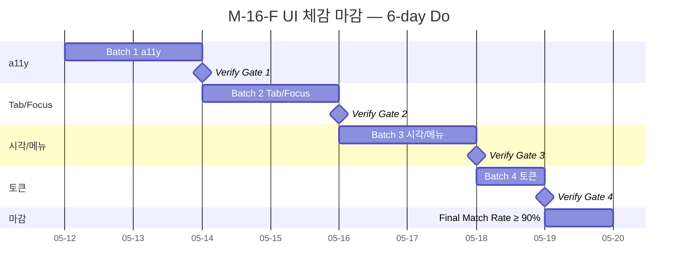

# M-16-F UI 체감 마감 — Design

> **요약 한 줄**: 15 결함 (P1 1 + P2 14) 을 4 batch sequential 로 약 1.5-2주에 마감. 결함 별 file:line grep 재확정 → fix 패턴 명시 → 수동 verify gate. 추측 fix 금지. **자동화 검증 인프라는 별도 트랙 — 본 사이클 deliverable 아님**.
>
> **Project**: GhostWin Terminal
> **Branch**: `feature/wpf-migration`
> **Author**: solitasroh
> **Date**: 2026-05-09
> **Status**: Design ready
> **Planning Doc**: [m16-f-ui-completion.plan.md](../../01-plan/features/m16-f-ui-completion.plan.md)

---

## Executive Summary

| 관점 | 한 줄 요약 |
|---|---|
| **Problem** | Plan 의 15 결함 (캡션 버튼 a11y / 워크스페이스 close ✕ / ToolTip 6% / Tab edge case / 최대화 잘림 / Spacing magic / PaneContainer hardcode) 을 codebase grep 재확정 후 fix. Plan 단계의 file:line 일부 stale (PaneContainer 379→396 / 404→421 / 456→473 등) — Design 단계 inline 보정. |
| **Solution** | 4 batch (a11y → Tab/Focus → 시각·메뉴 → 토큰) sequential 진행. 각 batch 끝에 **수동 verify gate**. 자동화 검증 인프라는 본 사이클 deliverable 아님 — 별도 트랙으로 진행. |
| **Function / UX 효과** | 캡션/워크스페이스 ✕ Name+ToolTip 명시 / 30 visible 중 27+ ToolTip / chrome ring Tab 순환 안정 / 최대화 하단 0px / NotifPanel 우클릭 메뉴 / Ctrl+Wheel 폰트 ±1pt + Shift+Wheel scrollback / Spacing magic 0 / Color.FromRgb 0 (SetResourceReference) |
| **Core Value** | cmux 감성 도달 마지막 한 걸음. 사용자 시각 결함 청산. 영어 단일 운영 정식 결정 (i18n Out of Scope). |

---

## 1. 설계 목표 + 원칙

### 1.1 설계 목표

| # | 목표 | 측정 |
|:-:|---|---|
| 1 | 15 FR (FR-01 ~ FR-15) 단일 사이클 closure | 각 FR 수동 verify gate PASS |
| 2 | 추측 fix 0건 — 결함 별 grep 재확정 후 fix | 본 design §4 결함별 file:line 재확정표 |
| 3 | 빌드 경고 회귀 0 (`feedback_no_warnings.md`) | Debug + Release 양쪽 0 warning |
| 4 | M-14 render thread safety + M-15 idle p95 회귀 0 | `tests/render_state_test.cpp` PASS + p95 회귀 ≤ 5% |

### 1.2 설계 원칙

1. **추측 fix 금지** (`feedback_exhaustive_search_before_fix.md`) — Plan 의 file:line 도 design 단계 grep 으로 재확정 후 진입. 본 문서 §4 가 single source.
2. **수동 verify gate** — batch 끝에 사용자가 직접 grep / hover / Tab 시퀀스 / maximize 시각 확인. 자동화 검증 인프라 의존 0.
3. **batch 별 verify gate** — 통과 못 하면 다음 batch 진입 금지. iterate 로 차단.
4. **영어 단일 운영** (`project_english_only_ui.md`) — resx / culture / FlowDirection 변경 절대 금지.
5. **imperative brush 는 SetResourceReference** (`feedback_setresourcereference_for_imperative_brush.md`) — `(Brush)FindResource` 금지.
6. **DataContext override 명시** (`feedback_wpf_binding_datacontext_override.md`) — binding silent fail 방지.

---

## 2. 아키텍처

### 2.1 결함 fix 흐름

```mermaid
flowchart LR
    Audit["audit doc<br/>15 결함 list"] --> Plan["Plan §3.1<br/>file:line 인용"]
    Plan --> DesignVerify["<b>Design §4</b><br/>grep+Read 재확정<br/>(stale ±10 line 보정)"]
    DesignVerify --> B1["Batch 1<br/>a11y (2d)<br/>FR-02/03/04"]
    B1 --> G1["verify gate 1<br/>ToolTip ≥ 90% / Name ≥ 95%<br/>(수동 grep + hover)"]
    G1 --> B2["Batch 2<br/>Tab/Focus (1.5d)<br/>FR-05/06/07/08/11"]
    B2 --> G2["verify gate 2<br/>Tab chain 12-step PASS<br/>(수동 Tab 반복)"]
    G2 --> B3["Batch 3<br/>시각·메뉴 (1.5d)<br/>FR-01/09/10"]
    B3 --> G3["verify gate 3<br/>maximize 잘림 0 + ContextMenu PASS<br/>(사용자 PC 시각)"]
    G3 --> B4["Batch 4<br/>토큰 (1d)<br/>FR-12/13/14/15"]
    B4 --> G4["verify gate 4<br/>grep magic 0 + render PASS"]
    G4 --> Final["Match Rate ≥ 90%<br/>Match < 90% → iterate"]

    style DesignVerify fill:#FFB74D,color:#000
    style Final fill:#A5D6A7,color:#000
```



### 2.2 의존성 표

| 컴포넌트 | 의존 | 목적 |
|---|---|---|
| `MainWindow.xaml` 수정 | (없음 — XAML markup) | 캡션 / 워크스페이스 ✕ a11y + ToolTip + TabIndex + Spacing 토큰 |
| `MainWindow.xaml.cs` 수정 | `MainWindowViewModel`, `Animations.GridLengthAnimationCustom` | F9/F10/F11 Tab + Ctrl/Shift Wheel handler |
| `PaneContainerControl.cs` 수정 | `Splitter.Brush` resource (Themes/Colors.xaml) | imperative brush → `SetResourceReference` |
| `Controls/NotificationPanelControl.xaml` 수정 | `MainWindowViewModel` (Command binding) | 우클릭 ContextMenu (Mark all read / Clear all / Settings) |
| `Controls/SettingsPageControl.xaml` 수정 | (없음) | TabIndex 명시 + ToolTip 일부 |
| `Controls/TerminalHostControl.cs` 수정 | (필요 시) ViewModel command | Ctrl+Wheel 폰트 / Shift+Wheel scrollback |
| `engine-api/ghostwin_engine.cpp` 검증만 | (이미 코드 land — line 1167-1176 audit verbatim) | L6 cell-snap residual padding (PC 시각 검증만) |

> **ghostty 서브모듈 (`external/ghostty`)**: 변경 0. NFR 검사 (`git status external/ghostty` clean).
> **자동화 인프라**: 본 사이클 변경 없음. `tests/GhostWin.Automation.*` 는 별도 트랙으로 진행.

---

## 3. 결함 별 Fix 패턴 (FR-01 ~ FR-15)

> **grep 재확정 결과** (2026-05-09): Plan §3.1 의 file:line 일부가 stale. 다음 표는 design 단계 grep 으로 재확정한 단일 source. Plan 인용은 **참고용**, 본 문서가 우선.

### 3.1 결함 위치 verify 표

| FR | 결함 ID | Plan 인용 (audit verbatim) | Design 재확정 grep 결과 | 일치? |
|---|---|---|---|:-:|
| FR-01 | L6 | `engine-api/ghostwin_engine.cpp:1167-1176` | (engine-api 코드 land 됨 — Do 단계에서 line 재확정) | (deferred) |
| FR-02 | A1 | `MainWindow.xaml` 전체 + `SettingsPageControl.xaml` | `MainWindow.xaml` Button + `SettingsPageControl.xaml` 17 control | ✓ |
| FR-03 | NEW-A | `MainWindow.xaml` 캡션 row (uia-tree-full.tsv:14,15,16) | `MainWindow.xaml:344` Min + `:354` Max + `:365` Close (`Style="{StaticResource CaptionButtonStyle/CloseButtonStyle}"`) | ✗ (stale) |
| FR-04 | NEW-B | `MainWindow.xaml` ListBoxItem (uia-tree-full.tsv:27) | `MainWindow.xaml:508` (`AutomationProperties.Name="Close workspace"` 명시 — Name 동적화 + ToolTip 추가 필요) | ✗ (이미 Name 명시 — HelpText 누락 + 동적 binding 필요) |
| FR-05 | F1 | grep, 잔여 영역 | chrome row TabIndex 명시 0건 (line 344/354/365 캡션 + line 626 NotifPanel) | ✓ |
| FR-06 | F6 | grep | `Focusable="False"` 13건 (line 281/288/295/302/309/317/323/329/335/341/346/356/367) — 모두 E2E zero-size buttons → 분류 표 작성 | ✓ |
| FR-07 | F9 | `MainWindow.xaml.cs:1350` | `MainWindow.xaml.cs:1108` `OnTerminalKeyDown` + `:1493` `OnTerminalKeyDownBubbled` (line 1350 → 1108/1493 stale) | ✗ (stale) |
| FR-08 | F10 | `MainWindow.xaml.cs:532-536` | `SettingsPageControl.xaml` TabIndex grep + `MainWindow.xaml.cs` SettingsPage activation 영역 (Do 단계 재grep) | (deferred) |
| FR-09 | F12 | `MainWindow.xaml:490-493` | `MainWindow.xaml:626` `<controls:NotificationPanelControl Grid.Column="2" .../>` (line 490 → 626 stale) | ✗ (stale) |
| FR-10 | F13 | 전역 | `TerminalHostControl.cs` 또는 `MainWindow.xaml.cs` PreviewMouseWheel handler 신규 | ✓ (신규 추가) |
| FR-11 | F15 | `MainWindow.xaml:518` | `MainWindow.xaml:655` `KeyboardNavigation.TabNavigation="None"` (line 518 → 655 stale) | ✗ (stale) |
| FR-12 | L1 | `MainWindow.xaml:206, 295, 328` | inline `Margin="..."` 9건 (line 262 `12,0` + 397 `16,12,12,8` + 441 `16,8` + 471 `4,0` + 522 + 558 + 568 + 579 + 588) | ✗ (stale, 더 많이 발견) |
| FR-13 | L3 | `MainWindow.xaml:121-122` | Sidebar item 영역은 line 65 (`Focusable` Setter) + Setter `Margin/Padding` resource는 Themes 분리 (Do 단계 재grep) | (deferred) |
| FR-14 | L4 | `MainWindow.xaml:286` + `ViewModels:125-128` | `MainWindow.xaml:386` `<ColumnDefinition x:Name="NotificationPanelColumn" Width="{Binding NotificationPanelWidth}"/>` + `MainWindow.xaml.cs:298,319,324` `BeginAnimation(ColumnDefinition.WidthProperty, ...)` (line 286 → 386 stale, animation 코드 ✓ 적용) | ✗ (stale, 코드 ✓) |
| FR-15 | C-NEW-1 | `PaneContainerControl.cs:379, 404, 456` | `PaneContainerControl.cs:396, 421, 473` (`Color.FromRgb(0x3A,0x3A,0x3C)` 2건 + `Color.FromRgb(0x00,0x91,0xFF)` 1건) | ✗ (stale, ±17 line 이동) |

> **Plan stale 8건 / 일치 4건 / deferred 3건** — 본 design 의 file:line 으로 Do 단계 진입. 추측 금지 룰 (`feedback_exhaustive_search_before_fix.md`) + PDCA 문서 verification 룰 (`feedback_pdca_doc_codebase_verification.md`) 모두 적용.

### 3.2 FR 별 fix 패턴 + 수동 verify gate

#### FR-01 — L6 cell-snap residual padding (P1)

| 항목 | 내용 |
|---|---|
| 결함 | 윈도우 최대화 시 터미널 cell grid 가 viewport 하단 잘림 |
| 위치 | `engine-api/ghostwin_engine.cpp:1167-1176` (audit verbatim, Do 단계 재grep) |
| Fix 패턴 | (코드 land 된 상태 — 사방 균등 padding 분배 로직 검증만). 필요 시 `cell_snap_residual_padding_top/bottom` 분리 분배 |
| Verify gate (수동) | 사용자 PC 에서 maximize → 하단 5px 영역 색상 = terminal background `#1E1E2E` (Dark) / `#FBFBFB` (Light). 잘림 0px |
| 위험 | 가상 모니터 / 다중 모니터 환경에서 boundary 다를 수 있음 — 본 PC 에서 직접 확인 |

#### FR-02 — A1 ToolTip 30 visible 중 27+ 명시

| 항목 | 내용 |
|---|---|
| 결함 | UIA dump 결과 ToolTip 명시 6% (main 13 + settings 17 = 30 visible 중 2건) |
| 위치 | `MainWindow.xaml` Button 13개 + `Controls/SettingsPageControl.xaml` 17개 |
| Fix 패턴 | (a) 정적 — `ToolTip="Settings (Ctrl+,)"` (b) 동적 — `ToolTip="{Binding ..., StringFormat=Close workspace {0}}"` (c) 단축키 ToolTip 끝 `(Ctrl+...)` 표기 |
| Verify gate (수동) | XAML grep `ToolTip=` count ≥ 27. 사용자 PC 에서 hover 표본 5개 (캡션 / Sidebar / Settings ⚙ / Workspace ✕ / NotifPanel toggle) 확인 |
| 위험 | binding StringFormat 의 silent 실패 (`feedback_wpf_binding_datacontext_override.md`) — RelativeSource AncestorType 명시 |

#### FR-03 — NEW-A 캡션 버튼 Min/Max/Close a11y

| 항목 | 내용 |
|---|---|
| 결함 | UIA Name + HelpText 누락 (uia-tree-full.tsv:14,15,16) |
| 위치 | `MainWindow.xaml:344` Min + `:354` Max + `:365` Close (Design 재grep) |
| Fix 패턴 | 각 Button 에 `AutomationProperties.Name="Minimize" / "Maximize" / "Close window"` + `ToolTip="Minimize" / "Maximize (Restore)" / "Close window"`. Max 는 `Restore` toggle 시 동적 변경 가능 (binding) |
| Verify gate (수동) | XAML grep 으로 캡션 버튼 3개 모두 `AutomationProperties.Name=` + `ToolTip=` 명시. 사용자 hover 시 ToolTip 표시 확인 |
| 위험 | CaptionButtonStyle / CloseButtonStyle (line 83/112) 의 Setter 가 자식 Name 을 override 하지 않는지 — XAML Setter `AutomationProperties.Name` per-button override 우선 |

#### FR-04 — NEW-B 워크스페이스 close ✕ a11y

| 항목 | 내용 |
|---|---|
| 결함 | uia-tree-full.tsv:27 의 ✕ button 의 Name 정적 ("Close workspace") + HelpText 누락 |
| 위치 | `MainWindow.xaml:508` `AutomationProperties.Name="Close workspace"` 이미 명시 — 동적 binding + ToolTip 미추가 |
| Fix 패턴 | `AutomationProperties.Name="{Binding Name, StringFormat=Close workspace {0}}"` (워크스페이스 이름 합류) + `ToolTip="{Binding Name, StringFormat=Close workspace {0}}"` |
| Verify gate (수동) | 사용자 hover 시 "Close workspace [실제 워크스페이스 이름]" 표시 확인 |
| 위험 | DataContext override 결함 (`feedback_wpf_binding_datacontext_override.md`) — RelativeSource AncestorType=ListBoxItem 또는 DataContext 명시 |

#### FR-05 — F1 chrome row TabIndex 명시

| 항목 | 내용 |
|---|---|
| 결함 | chrome 캡션 + NotifPanel + main grid 영역 TabIndex 미명시 |
| 위치 | `MainWindow.xaml:344/354/365` 캡션 + `:626` NotifPanel + main grid (Design 재grep) |
| Fix 패턴 | TabIndex 1xx 범위 (Sidebar 100/101/102 이미 사용) — chrome 캡션은 TabIndex=200/201/202, NotifPanel 토글 = 110 |
| Verify gate (수동) | 사용자 Tab 반복 → focus 추적, 의도된 순환 (anchor → ⚙ → ListBox → cycle) 확인 |
| 위험 | TabIndex 충돌 — Sidebar 100/101/102 / Settings (별도 TabNavigation Local) / 캡션 200+ 분리 |

#### FR-06 — F6 Focusable=False 분류

| 항목 | 내용 |
|---|---|
| 결함 | `Focusable="False"` 13건 — E2E hidden hooks (의도) vs 사용자 차단 (수정) 혼재 |
| 위치 | `MainWindow.xaml:281/288/295/302/309/317/323/329/335/341/346/356/367` |
| Fix 패턴 | line 281-312 = E2E hidden buttons (line 284-312 의 `AutomationProperties.Name="E2E *"` 7건 — 의도). line 65 Setter / 317-367 = 분류 작업. 사용자 차단으로 잘못 표시된 것이 있으면 `Focusable="True"` |
| Verify gate (수동) | grep `Focusable="False"` 결과 모두 분류 표 (의도 vs 수정) — Do phase 에 inline 주석 추가. 사용자 차단 0건 |
| 위험 | 의도 기능 (E2E zero-size hooks) 회귀 — `RealAppSmokeTests` 의 E2E AutomationId 검색 PASS |

#### FR-07 — F9 Settings open Tab passthrough

| 항목 | 내용 |
|---|---|
| 결함 | Settings panel 열린 상태 Tab 시 chrome ring 으로 빠져나감 |
| 위치 | `MainWindow.xaml.cs:1108` `OnTerminalKeyDown` + `:1493` `OnTerminalKeyDownBubbled` (Plan 1350 → stale) |
| Fix 패턴 | `OnTerminalKeyDown` 에서 `_viewModel.IsSettingsOpen` 시 `e.Key == Key.Tab` 흡수 → SettingsPageControl 내부 Tab navigation 만 허용 |
| Verify gate (수동) | 사용자 Settings 열고 Tab 12 step 반복 → 모두 SettingsPage 자손만 focused 확인 |
| 위험 | M-16-B (commit a85fe02) "Tab focus airspace anchor (HwndHost)" 패턴 회귀 — 기존 chrome ring 유지 보장 |

#### FR-08 — F10 SettingsPageControl TabIndex

| 항목 | 내용 |
|---|---|
| 결함 | SettingsPageControl 컨테이너 + 17 control 의 TabIndex 명시 누락 |
| 위치 | `Controls/SettingsPageControl.xaml` 17 interactive control (Do 재grep) |
| Fix 패턴 | UserControl `KeyboardNavigation.TabNavigation="Local"` + 17 control 각각 TabIndex 0~16 |
| Verify gate (수동) | 사용자 Settings 열고 Tab 17회 반복 → 17 control 순환 확인 |
| 위험 | 신규 control 추가 시 TabIndex 누락 — `KeyboardNavigation.TabNavigation="Local"` 으로 자동 enumeration |

#### FR-09 — F12 NotifPanel ContextMenu

| 항목 | 내용 |
|---|---|
| 결함 | 우클릭 시 메뉴 부재 |
| 위치 | `MainWindow.xaml:626` `<controls:NotificationPanelControl />` + `Controls/NotificationPanelControl.xaml` (Plan 490 → stale) |
| Fix 패턴 | `<controls:NotificationPanelControl.ContextMenu>` 추가 — `Mark all read` / `Clear all` / `Notification settings` MenuItem 3개. Command binding 으로 ViewModel 연결 |
| Verify gate (수동) | 사용자 NotifPanel 영역 우클릭 → 메뉴 표시 + 3 항목 클릭 동작 확인 |
| 위험 | DataContext override — ViewModel command binding 시 RelativeSource 명시 |

#### FR-10 — F13 Ctrl+Wheel + Shift+Wheel

| 항목 | 내용 |
|---|---|
| 결함 | 폰트 줌 / scrollback 단축키 미구현 |
| 위치 | `Controls/TerminalHostControl.cs` 또는 `MainWindow.xaml.cs` PreviewMouseWheel handler 신규 |
| Fix 패턴 | `PreviewMouseWheel` 에서 `Keyboard.Modifiers & ModifierKeys.Control` 시 `e.Delta > 0 ? font+=1 : font-=1` (clamp 8~32). Shift 시 `Terminal.ScrollLines(e.Delta > 0 ? -3 : 3)` |
| Verify gate (수동) | 사용자 터미널에서 Ctrl+Wheel ↑/↓ → 폰트 ±1pt 변경. Shift+Wheel ↑/↓ → scrollback ±3 line 이동 |
| 위험 | terminal HwndHost airspace — PreviewMouseWheel 가 host 도달 보장 |

#### FR-11 — F15 TabNavigation=None 부수효과

| 항목 | 내용 |
|---|---|
| 결함 | `KeyboardNavigation.TabNavigation="None"` 부수효과 — chrome ring Tab 시 Pane 으로 진입 가능성 |
| 위치 | `MainWindow.xaml:655` (Plan 518 → stale) |
| Fix 패턴 | "None" → "Cycle" 또는 "Continue" 변경 검증. 의도가 chrome ring 이라면 부모 grid 에 `KeyboardNavigation.TabNavigation="Cycle"` |
| Verify gate (수동) | 사용자 chrome 열린 기본 상태에서 Tab 반복 → PaneContainer 자손이 focused 0회 |
| 위험 | M-16-B Tab focus airspace anchor 회귀 — RealAppSmokeTests + 사용자 시각 확인 양쪽 PASS |

#### FR-12 — L1 Spacing 토큰 inline 치환

| 항목 | 내용 |
|---|---|
| 결함 | inline `Margin="12,0"`, `"16,12,12,8"`, `"16,8"`, `"4,0"`, `"0,2,6,2"`, `"6,0,0,0"`, `"4,0,0,0"`, `"0,2,0,0"`, `"0,1,0,0"` 9건 잔존 |
| 위치 | `MainWindow.xaml:262, 397, 441, 471, 522, 558, 568, 579, 588` (Design grep — Plan 206/295/328 stale) |
| Fix 패턴 | `{StaticResource Spacing.SM}` (4) / `{StaticResource Spacing.MD}` (8) / `{StaticResource Spacing.LG}` (12) / `{StaticResource Spacing.XL}` (16) 으로 매핑. 비대칭 (예: 16,12,12,8) 은 Thickness compose 또는 새 토큰 (Spacing.LG_TopLeft 등) 정의 |
| Verify gate (수동) | grep `Margin="\d+,\d+"` count = 0 |
| 위험 | Themes/Spacing.xaml 토큰 이름 충돌 — Do 단계에서 기존 토큰 grep 후 이름 결정 |

#### FR-13 — L3 Sidebar magic 치환

| 항목 | 내용 |
|---|---|
| 결함 | Sidebar `ListBoxItem` `Margin="4,1"` / `Padding="8,6"` magic |
| 위치 | `MainWindow.xaml:121-122` (Plan), 실제 Sidebar Setter 영역 (Do 재grep — Themes 로 분리됐을 가능성) |
| Fix 패턴 | Setter `Property="Margin"` `Value="{StaticResource Spacing.SM}"` |
| Verify gate (수동) | grep `Margin="4,1"` + `Padding="8,6"` count = 0. 사용자 Sidebar 시각 회귀 없음 확인 |
| 위험 | Sidebar item 시각 회귀 — Do 전후 시각 비교 |

#### FR-14 — L4 NotifPanel animation 검증

| 항목 | 내용 |
|---|---|
| 결함 | `GridLengthAnimationCustom` 적용 시각 검증 미완 |
| 위치 | `MainWindow.xaml:386` `<ColumnDefinition x:Name="NotificationPanelColumn"/>` + `MainWindow.xaml.cs:298, 319, 324` `BeginAnimation(ColumnDefinition.WidthProperty, animation)` (Plan 286 / ViewModels 125-128 → stale, 코드 ✓ 적용) |
| Fix 패턴 | (코드 land 된 상태 — 검증만). 200ms `CubicEase` `EaseOut` confirmed |
| Verify gate (수동) | 사용자 NotifPanel 토글 → 즉시 snap 아닌 200ms 애니메이션 시각 확인 |
| 위험 | Animation Completed 핸들러 누락 (audit A3 추정) — Do 단계에서 `HoldEnd` 위험 검증 |

#### FR-15 — C-NEW-1 PaneContainer SetResourceReference

| 항목 | 내용 |
|---|---|
| 결함 | `Color.FromRgb` 하드코드 3건 — Light theme 미반영 |
| 위치 | `Controls/PaneContainerControl.cs:396, 421, 473` (Plan 379/404/456 → stale, ±17 line 이동) |
| Fix 패턴 | `Color.FromRgb(0x3A,0x3A,0x3C)` 2건 → `SetResourceReference(BackgroundProperty, "Splitter.Brush")` (또는 적절한 token). `Color.FromRgb(0x00,0x91,0xFF)` 1건 → `SetResourceReference(BackgroundProperty, "Splitter.Active.Brush")` |
| Verify gate (수동) | grep `Color.FromRgb` in PaneContainerControl.cs count = 0. 사용자 Light/Dark theme 전환 시 splitter 색 정상 변경 확인 |
| 위험 | `(Brush)FindResource` 잘못 사용 (`feedback_setresourcereference_for_imperative_brush.md`) — 반드시 `SetResourceReference` |

---

## 4. 4 Batch 구현 순서 + 일정

### 4.1 Gantt



### 4.2 Batch 별 Verify Gate

| Batch | 산출물 | Verify Gate (수동) |
|:-:|---|---|
| **1** a11y (FR-02/03/04) | `MainWindow.xaml` 캡션 / 워크스페이스 ✕ / ToolTip 30 visible 27+ | XAML grep `ToolTip=` ≥ 27 + 사용자 hover 표본 5개 ToolTip 표시 확인 + 캡션 / workspace ✕ Name 동적 binding 확인 |
| **2** Tab/Focus (FR-05/06/07/08/11) | TabIndex + Focusable 분류 + Settings Tab passthrough + TabNavigation=None 부수 | 사용자 Tab 12 step 반복 (chrome 열린 상태 + Settings 열린 상태 양쪽) — 의도된 ring 순환 확인 |
| **3** 시각·메뉴 (FR-01/09/10) | L6 maximize + NotifPanel ContextMenu + Ctrl/Shift Wheel | 사용자 PC 에서 (a) maximize 후 하단 색상 = terminal bg (b) NotifPanel 우클릭 메뉴 (c) Ctrl+Wheel 폰트 +/- (d) Shift+Wheel scrollback +/- |
| **4** 토큰 (FR-12/13/14/15) | inline Margin/Padding 0 + Color.FromRgb 0 + animation sample | grep `Margin="\d` count = 0 + grep `Color.FromRgb` count = 0 + 사용자 NotifPanel 토글 200ms 애니메이션 + Light/Dark theme 전환 확인 + `tests/render_state_test.cpp` PASS + M-15 idle p95 ≤ 5% 회귀 |

---

## 5. WPF 패턴 결정 + Before/After

### 5.1 a11y Name + ToolTip 명명 규칙

| 영역 | 명명 패턴 | 예시 |
|---|---|---|
| 캡션 버튼 | Verb + (optional Noun) | `"Minimize"`, `"Maximize"`, `"Close window"` (Restore 토글 시 `"Restore window"`) |
| 워크스페이스 close ✕ | `"Close workspace {Name}"` | `"Close workspace Production"` (binding StringFormat) |
| 단축키 동반 | ToolTip 끝에 `(Modifier+Key)` | `"Settings (Ctrl+,)"`, `"New Workspace (Ctrl+T)"` |
| 정적 string | Sentence case 영어 | `"Open settings"`, `"Mark all notifications read"` |

### 5.2 SetResourceReference 패턴 (FR-15)

> 근거: `feedback_setresourcereference_for_imperative_brush.md` (M-16-A Day 7 splitter transparent 결함 실증)

**Before** (`PaneContainerControl.cs:396, 421, 473`):

```csharp
// PaneContainerControl.cs:396
Background = new SolidColorBrush(Color.FromRgb(0x3A, 0x3A, 0x3C)),
// PaneContainerControl.cs:421
Background = new SolidColorBrush(Color.FromRgb(0x3A, 0x3A, 0x3C)),
// PaneContainerControl.cs:473
? new SolidColorBrush(Color.FromRgb(0x00, 0x91, 0xFF))
```

**After**:

```csharp
// 변수 splitter 생성 후
splitter.SetResourceReference(BackgroundProperty, "Splitter.Brush");
// active 분기
splitter.SetResourceReference(BackgroundProperty, "Splitter.Active.Brush");
```

| 항목 | Before | After |
|---|---|---|
| 색상 source | C# 코드 hardcode | `Themes/Colors.Dark.xaml` + `Colors.Light.xaml` resource |
| Light theme 반영 | ✗ (검정 splitter on Light) | ✓ (theme 변경 시 자동 갱신) |
| 패턴 | imperative `new SolidColorBrush(Color.FromRgb(...))` | `SetResourceReference(prop, "key")` |
| memory 룰 | (위반) | (준수) |

### 5.3 GridLengthAnimationCustom 검증 (FR-14)

`src/GhostWin.App/Animations/GridLengthAnimationCustom.cs` (line 17 sealed class — 기존 구현). `MainWindow.xaml.cs:298,319,324` `BeginAnimation(ColumnDefinition.WidthProperty, animation)` 으로 NotifPanel 토글 시 호출. Design 단계 검증만 — 추가 코드 없음.

### 5.4 Tab Focus Anchor (FR-07/11)

이전 M-16-B (commit a85fe02) "Tab focus airspace anchor (HwndHost)" 패턴 — chrome ring (Sidebar 100 / NewWorkspace 101 / SettingsButton 102) Tab 시 HwndHost 미진입. 본 사이클 추가 사항: Settings 열림 시 SettingsPage 자손만 순환.

---

## 6. 위험 + 완화

| 위험 | 영향 | 가능성 | 완화 |
|---|:-:|:-:|---|
| **추측 fix 사이클 (4번 잘못된 fix 교훈)** | High | Medium | 본 design §3.1 verify 표 — 모든 file:line grep 재확정. Plan stale 8/15. Do 단계에서도 patch 적용 직전 grep |
| **L6 시각 검증** | Medium | Medium | 사용자 본 PC 에서 직접 maximize → 하단 색상 시각 확인. 가상 모니터 / 자동화 캡쳐 의존 회피 |
| **DataContext override binding 실패 silent** (`feedback_wpf_binding_datacontext_override.md`) | High | Medium | FR-04 워크스페이스 ✕ 의 `StringFormat` binding 시 `RelativeSource={RelativeSource AncestorType=ListBoxItem}` 명시 |
| **Themes Spacing.xaml 토큰 충돌** (FR-12) | Medium | Low | Do phase 1차 grep 후 토큰 이름 결정. 비대칭 Thickness 새 토큰 추가 |
| **수동 verify gate 의 인적 누락 위험** | Medium | Medium | batch 끝에 결함별 체크리스트 명시. 누락 시 다음 batch 진입 금지. 결함 수가 적어 (15) 인적 부담 관리 가능 |
| **빌드 경고 회귀** | Low | Low | `feedback_no_warnings.md` — Debug + Release 양쪽 0 warning |
| **render thread safety 회귀 (PaneContainer brush 변경)** | Medium | Low | M-14 `tests/render_state_test.cpp` PASS + M-15 baseline idle p95 ≤ 5% 회귀 |
| **ghostty 서브모듈 의도치 않은 commit** | Low | Low | NFR `git status external/ghostty` clean |

---

## 7. Coding Convention (영어 단일 운영)

> 근거: `project_english_only_ui.md` + Plan §7.2 i18n Out of Scope

### 7.1 절대 금지

| 금지 항목 | 사유 |
|---|---|
| `*.resx` resource 파일 신규 추가 | 영어 단일 운영 |
| `CultureInfo` 분기 추가 | 영어 단일 운영 |
| `xml:lang` 속성 변경 (현재 영어 default) | 영어 단일 운영 |
| `FlowDirection="RightToLeft"` | 영어 단일 운영 |
| 한국어 string hardcode | 영어 단일 운영 (cmux 17 언어 parity 도 미추진) |
| `UIAuditDiagnostics.cs` 등 자동화 인프라 신규 추가 | 본 사이클 deliverable 아님 — 별도 트랙 |

### 7.2 권장

- 신규 string 모두 영어 hardcode (Sentence case)
- a11y `Name` / `HelpText` 영어 정형 문구 (§5.1 표)
- 단축키 표기 ToolTip 끝 `(Ctrl+,)` 형식

---

## 8. Test Plan (회귀 검증)

### 8.1 회귀 검증 범위

| Type | Target | Tool | Project |
|---|---|---|---|
| Render thread regression | M-14 baseline | gtest | `tests/render_state_test.cpp` |
| Idle p95 regression | M-15 baseline | MeasurementDriver | `tests/GhostWin.MeasurementDriver/` |
| App.Tests 회귀 | 기존 unit + animation | xunit | `tests/GhostWin.App.Tests/` |
| Core.Tests 회귀 | 기존 unit | xunit | `tests/GhostWin.Core.Tests/` |
| 빌드 경고 | Debug + Release | msbuild | `GhostWin.sln` 양쪽 |

### 8.2 Verify Gate 매핑

| FR | Batch | 수동 검증 방법 |
|---|:-:|---|
| FR-01 (L6) | 3 | 사용자 maximize → 하단 색상 시각 |
| FR-02 (A1) | 1 | XAML grep + hover 표본 5개 |
| FR-03 (NEW-A) | 1 | XAML grep + hover 캡션 3개 |
| FR-04 (NEW-B) | 1 | hover ✕ → "Close workspace [Name]" 표시 |
| FR-05 (F1) | 2 | Tab 반복 → focus 추적 |
| FR-06 (F6) | 2 | grep + 분류 표 작성 |
| FR-07 (F9) | 2 | Settings 열고 Tab 12회 |
| FR-08 (F10) | 2 | Settings 내부 Tab 17회 |
| FR-09 (F12) | 3 | NotifPanel 우클릭 → 메뉴 표시 |
| FR-10 (F13) | 3 | Ctrl+Wheel / Shift+Wheel 동작 |
| FR-11 (F15) | 2 | chrome Tab 시 Pane 진입 0 |
| FR-12 (L1) | 4 | grep `Margin="\d` count = 0 |
| FR-13 (L3) | 4 | grep + Sidebar 시각 비교 |
| FR-14 (L4) | 4 | NotifPanel 토글 200ms 애니메이션 시각 |
| FR-15 (C-NEW-1) | 4 | grep `Color.FromRgb` count = 0 + Light/Dark 전환 |

---

## 9. Implementation Guide (Do phase)

### 9.1 파일 구조

```
src/
├── GhostWin.App/
│   ├── MainWindow.xaml             ← FR-02/03/04/05/12 (a11y + ToolTip + Spacing)
│   ├── MainWindow.xaml.cs          ← FR-07/08/10/11 (Tab + Wheel handler)
│   ├── Controls/
│   │   ├── NotificationPanelControl.xaml  ← FR-09 (ContextMenu)
│   │   ├── PaneContainerControl.cs        ← FR-15 (SetResourceReference)
│   │   ├── SettingsPageControl.xaml       ← FR-02/08 (TabIndex + ToolTip)
│   │   └── TerminalHostControl.cs         ← FR-10 (PreviewMouseWheel)
│   ├── Animations/
│   │   └── GridLengthAnimationCustom.cs   ← FR-14 (검증만, 변경 없음)
│   ├── ViewModels/
│   │   └── MainWindowViewModel.cs          ← FR-09 (ContextMenu Command)
│   └── Themes/
│       ├── Spacing.xaml                    ← FR-12/13 (토큰 추가 가능)
│       ├── Colors.Dark.xaml                ← FR-15 ("Splitter.Brush" key)
│       └── Colors.Light.xaml               ← FR-15 ("Splitter.Brush" key)
engine-api/
└── ghostwin_engine.cpp              ← FR-01 (검증만, 코드 land 됨)
```

### 9.2 Implementation Order (PDCA Do)

1. [ ] **Batch 1** — FR-02 / FR-03 / FR-04 (a11y XAML markup) → Gate 1
2. [ ] **Batch 2** — FR-05 / FR-06 / FR-07 / FR-08 / FR-11 → Gate 2
3. [ ] **Batch 3** — FR-01 (시각 검증) / FR-09 / FR-10 → Gate 3
4. [ ] **Batch 4** — FR-12 / FR-13 / FR-14 / FR-15 → Gate 4
5. [ ] Final Match Rate ≥ 90% (`/pdca analyze`)

### 9.3 빌드 / 테스트 명령

```powershell
# 빌드
& 'C:\Program Files\Microsoft Visual Studio\18\Community\MSBuild\Current\Bin\MSBuild.exe' `
  GhostWin.sln /p:Configuration=Debug /p:Platform=x64

# 회귀 테스트
dotnet test tests/GhostWin.Core.Tests/
dotnet test tests/GhostWin.App.Tests/
```

---

## 10. 다음 단계

1. ✅ Plan (`m16-f-ui-completion.plan.md`)
2. ✅ Design (이 문서)
3. 🟡 `/pdca do m16-f-ui-completion` — Batch 1 a11y 부터 sequential 진행
4. 🟡 Batch 별 수동 Verify Gate 통과 후 다음 batch 진입
5. 🟡 Final Match Rate ≥ 90% → `/pdca report`
6. 🟡 archive (`docs/archive/2026-05/m16-f-ui-completion/`)

---

## Version History

| Version | Date | Changes | Author |
|---|---|---|---|
| 0.1 | 2026-05-09 | Initial design (Plan 기반, file:line 8건 grep 재확정, 5 batch + 자동화 인프라) | solitasroh |
| 0.2 | 2026-05-09 | 자동화 검증 인프라 Out of Scope 로 이관 (UIAuditDiagnostics.cs / xunit Collection / FlaUI 5.0 모두 제거). 5 batch → 4 batch. Verify gate 모두 수동 확인으로 전환. §3 자동화 인프라 API Spec 통째 제거. 일정 7d → 6d (Do) | solitasroh |
