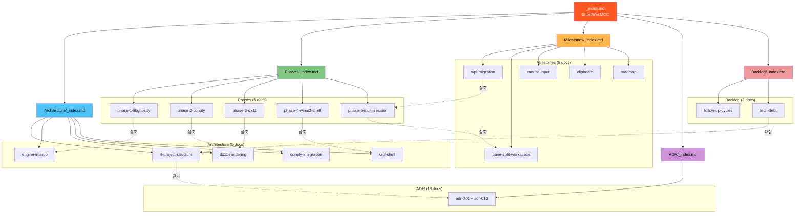
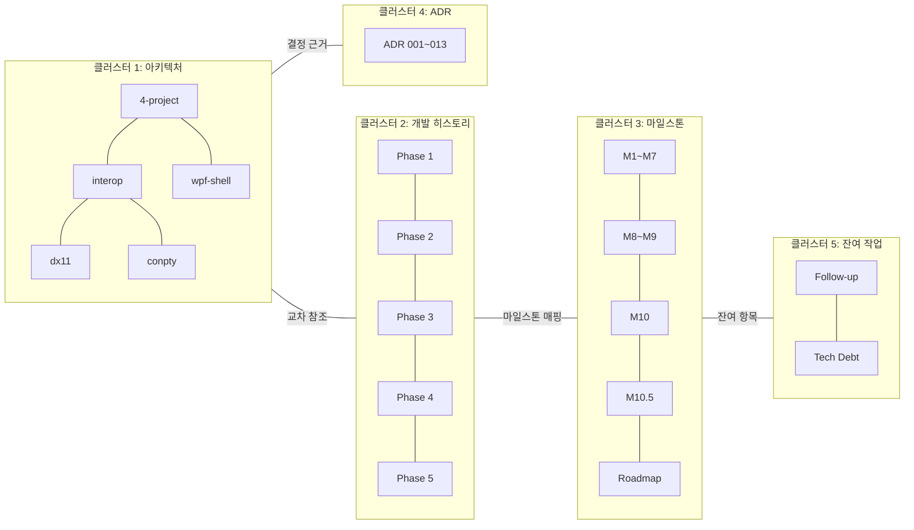
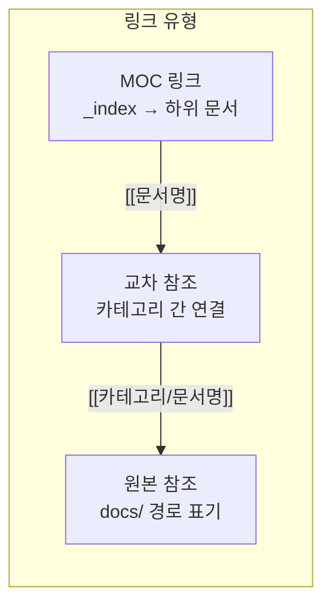
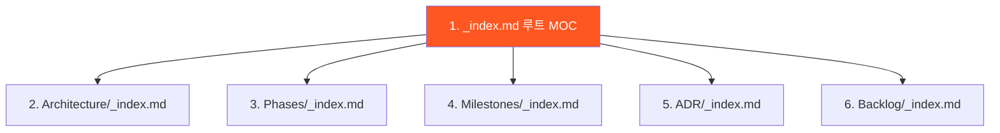

# Obsidian Project Map Design -- GhostWin Knowledge Base

> **Plan**: `docs/01-plan/features/obsidian-project-map.plan.md`
> **Feature**: obsidian-project-map
> **Date**: 2026-04-13
> **Status**: Draft
> **Vault Path**: `C:\Users\Solit\obsidian\note\Projects\GhostWin\`

---

## 1. 전체 구조 개요

### 1.1 Vault 토폴로지



### 1.2 Graph View 예상 클러스터



---

## 2. 문서 상세 설계

### 2.1 파일 목록 (총 37개)

| # | 경로 | 구현 단계 | 예상 링크 수 |
|:-:|------|:---------:|:------------:|
| 1 | `_index.md` | Phase 1 | 5 (MOC 5개) |
| 2 | `Architecture/_index.md` | Phase 1 | 6 (5 docs + 루트) |
| 3 | `Phases/_index.md` | Phase 1 | 6 |
| 4 | `Milestones/_index.md` | Phase 1 | 6 |
| 5 | `ADR/_index.md` | Phase 1 | 14 |
| 6 | `Backlog/_index.md` | Phase 1 | 3 |
| 7 | `Architecture/4-project-structure.md` | Phase 2 | 5 |
| 8 | `Architecture/engine-interop.md` | Phase 2 | 4 |
| 9 | `Architecture/dx11-rendering.md` | Phase 2 | 4 |
| 10 | `Architecture/conpty-integration.md` | Phase 2 | 3 |
| 11 | `Architecture/wpf-shell.md` | Phase 2 | 5 |
| 12 | `Phases/phase-1-libghostty.md` | Phase 3 | 3 |
| 13 | `Phases/phase-2-conpty.md` | Phase 3 | 3 |
| 14 | `Phases/phase-3-dx11.md` | Phase 3 | 4 |
| 15 | `Phases/phase-4-winui3-shell.md` | Phase 3 | 6 |
| 16 | `Phases/phase-5-multi-session.md` | Phase 3 | 5 |
| 17 | `Milestones/wpf-migration.md` | Phase 4 | 4 |
| 18 | `Milestones/pane-split-workspace.md` | Phase 4 | 4 |
| 19 | `Milestones/mouse-input.md` | Phase 4 | 3 |
| 20 | `Milestones/clipboard.md` | Phase 4 | 3 |
| 21 | `Milestones/roadmap.md` | Phase 4 | 5 |
| 22~34 | `ADR/adr-001-simd-gnu.md` ~ `adr-013-embedded-shader.md` | Phase 4 | 2~3 each |
| 35 | `Backlog/follow-up-cycles.md` | Phase 5 | 4 |
| 36 | `Backlog/tech-debt.md` | Phase 5 | 3 |

---

## 3. 문서 템플릿 상세

### 3.1 MOC 템플릿 (_index.md)

```markdown
---
title: "{카테고리명}"
tags: [moc, {category-tag}]
created: 2026-04-13
---

# {카테고리명}

> 한 줄 설명

## 문서 목록

| 문서 | 상태 | 요약 |
|------|:----:|------|
| [[{문서1}]] | done | 한 줄 요약 |
| [[{문서2}]] | done | 한 줄 요약 |

## 관련 카테고리

- [[Architecture/_index|Architecture]] -- 아키텍처 전체
- [[Phases/_index|Phases]] -- 개발 히스토리
```

### 3.2 루트 MOC 템플릿 (_index.md)

```markdown
---
title: "GhostWin Terminal"
tags: [moc, root]
created: 2026-04-13
---

# GhostWin Terminal

> Windows 네이티브 GPU 가속 터미널 에뮬레이터 (ghostty VT + DX11 + WPF)

## 프로젝트 개요

- **엔진**: ghostty libvt (Zig) + ConPTY
- **렌더러**: DX11 + HLSL (2-pass, ClearType)
- **쉘**: WPF (.NET 10) + MVVM + DI
- **현재 상태**: M-10.5 Clipboard 완료, M-11 Session Restore 대기

## 지식맵

| 카테고리 | 설명 | 문서 수 |
|----------|------|:-------:|
| [[Architecture/_index\|Architecture]] | 4-레이어 구조, 렌더링, Interop | 5 |
| [[Phases/_index\|Phases]] | Phase 1~5 개발 히스토리 | 5 |
| [[Milestones/_index\|Milestones]] | WPF M-1~M-13 마일스톤 | 5 |
| [[ADR/_index\|ADR]] | 아키텍처 결정 기록 13건 | 13 |
| [[Backlog/_index\|Backlog]] | 잔여 작업 + 기술 부채 | 2 |

## 아키텍처 레이어

{Mermaid: Plan 6.1 아키텍처 레이어 흐름 다이어그램 삽입}

## 타임라인

{Mermaid: Plan 6 프로젝트 타임라인 gantt 삽입}
```

### 3.3 아키텍처 문서 템플릿

```markdown
---
title: "{컴포넌트명}"
tags: [arch/{layer}, status/done, type/guide]
created: 2026-04-13
related: []
---

# {컴포넌트명}

> 한 줄 요약

## 역할

2~3 문단으로 이 컴포넌트가 무엇이고, 왜 존재하는지 설명.

## 핵심 구조

{Mermaid: 컴포넌트별 내부 구조 다이어그램}

## 주요 파일

| 파일 | 역할 |
|------|------|
| `src/{path}` | 설명 |

## 관련 문서

- [[{관련 Phase}]] -- 이 컴포넌트가 만들어진 Phase
- [[{관련 ADR}]] -- 핵심 설계 결정
- 원본: `docs/archive/...` (프로젝트 내 상세 문서)
```

### 3.4 Phase 문서 템플릿

```markdown
---
title: "Phase {N}: {이름}"
tags: [phase/{n}, status/done, type/guide]
created: 2026-04-13
match_rate: {N}%
---

# Phase {N}: {이름}

> 한 줄 요약

## 목표

이 Phase에서 달성한 핵심 목표 2~3개.

## 결과

| 항목 | 값 |
|------|-----|
| Match Rate | {N}% |
| 기간 | YYYY-MM-DD ~ YYYY-MM-DD |
| 핵심 커밋 | `{hash}` |

## 핵심 결정

이 Phase에서 내린 중요한 기술 결정과 그 이유.
- [[{관련 ADR}]] 참조

## 교훈

이 Phase에서 배운 것 (다음에 반복할 것 / 피할 것).

## 관련 문서

- [[{관련 아키텍처}]] -- 이 Phase가 구축한 컴포넌트
- [[{관련 마일스톤}]] -- 매핑되는 마일스톤
- 원본 Report: `docs/archive/YYYY-MM/{name}/{name}.report.md`
- 원본 Design: `docs/archive/YYYY-MM/{name}/{name}.design.md`
```

### 3.5 마일스톤 문서 템플릿

```markdown
---
title: "{마일스톤명}"
tags: [milestone/{id}, status/{done|pending}, type/guide]
created: 2026-04-13
---

# {마일스톤명}

> 한 줄 요약

## 범위

이 마일스톤이 포함하는 Feature 목록.

## 주요 성과

{Mermaid: 마일스톤별 진행 상태 또는 구조 다이어그램}

## 관련 문서

- [[{관련 Phase}]]
- [[{관련 ADR}]]
- 원본: `docs/01-plan/features/{name}.plan.md`
```

### 3.6 ADR 요약 템플릿

```markdown
---
title: "ADR-{NNN}: {제목}"
tags: [adr, arch/{layer}, status/done, type/decision]
created: 2026-04-13
---

# ADR-{NNN}: {제목}

> **결정**: {한 줄 요약}
> **근거**: {핵심 이유}
> **상태**: Accepted

## 맥락

왜 이 결정이 필요했는지 2~3 문장.

## 대안 검토

| 대안 | 장점 | 단점 | 선택 |
|------|------|------|:----:|
| A | ... | ... | |
| **B** | ... | ... | **O** |

## 영향

이 결정이 미치는 영향 범위.

## 관련 문서

- [[{관련 아키텍처 문서}]]
- [[{관련 Phase}]]
- 원본: `docs/adr/{NNN}-{name}.md`
```

### 3.7 Backlog 문서 템플릿

```markdown
---
title: "{Backlog 카테고리}"
tags: [backlog, status/pending, type/guide]
created: 2026-04-13
---

# {Backlog 카테고리}

> 한 줄 요약

## 항목 목록

| # | 항목 | 우선순위 | 상태 | 관련 |
|:-:|------|:--------:|:----:|------|
| 1 | {항목} | HIGH | pending | [[{관련}]] |

## 관련 문서

- [[{관련 아키텍처}]]
- [[{관련 마일스톤}]]
```

---

## 4. Mermaid 다이어그램 설계

### 4.1 각 문서에 포함할 Mermaid

| 문서 | 다이어그램 유형 | 내용 |
|------|:---------------:|------|
| `_index.md` (루트) | `graph TB` + `gantt` | 아키텍처 레이어 흐름 + 프로젝트 타임라인 |
| `Architecture/_index.md` | `graph TB` | 4-레이어 의존성 |
| `4-project-structure.md` | `graph LR` | Core→Interop→Services→App 의존성 + 각 프로젝트 주요 타입 |
| `engine-interop.md` | `sequenceDiagram` | C# ↔ C++ 호출 흐름 (API call + callback) |
| `dx11-rendering.md` | `graph TD` | 2-pass 렌더링 파이프라인 (배경→텍스트→화면) |
| `conpty-integration.md` | `sequenceDiagram` | ConPTY ↔ VT ↔ Session 데이터 흐름 |
| `wpf-shell.md` | `graph TD` | MVVM 구조 (View→ViewModel→Service→Interop) |
| `Phases/_index.md` | `graph LR` | Phase 1→2→3→4→5 의존성 체인 |
| `phase-4-winui3-shell.md` | `graph TD` | 4-A~4-G 서브 Phase 관계 |
| `phase-5-multi-session.md` | `graph TD` | 5-A~5-E 서브 Phase + M-8/M-9 관계 |
| `Milestones/_index.md` | `gantt` | M-1~M-13 타임라인 |
| `pane-split-workspace.md` | `graph TD` | Window→Workspace→Pane→Surface 계층 |
| `ADR/_index.md` | `graph LR` | ADR 간 의존/관련 관계 |
| `roadmap.md` | `graph TD` | M-11~M-13 의존성 + 병렬 가능 표시 |
| `Backlog/_index.md` | `pie` | 우선순위별 잔여 항목 분포 |

### 4.2 Mermaid 작성 규칙

1. **Obsidian 호환**: Obsidian은 Mermaid를 기본 지원 (` ```mermaid ` 코드 블록)
2. **노드 ID**: 영문 camelCase (한글은 label에만 사용)
3. **subgraph ID**: 반드시 명시 (`subgraph sg1["표시명"]`)
4. **최대 노드 수**: 다이어그램당 15개 이내 (가독성)
5. **색상**: `style` 지시자로 레이어별 일관된 색상 사용
6. **`flowchart` 키워드 금지**: `graph` 사용 (Mermaid v8.8 호환)

### 4.3 레이어별 색상 표준

| 레이어 | 색상 코드 | 용도 |
|--------|-----------|------|
| App (WPF) | `#4FC3F7` (밝은 파랑) | UI 관련 노드 |
| Services | `#81C784` (밝은 초록) | 서비스 레이어 |
| Interop | `#FFB74D` (주황) | C++/C# 브릿지 |
| Core | `#E0E0E0` (회색) | 인터페이스/모델 |
| Native C++ | `#EF9A9A` (밝은 빨강) | 엔진/렌더러 |
| ADR | `#CE93D8` (보라) | 결정 기록 |
| Milestone | `#FFD54F` (노랑) | 마일스톤 |
| Phase | `#A5D6A7` (연초록) | Phase 히스토리 |

---

## 5. Wiki-Link 연결 규칙

### 5.1 링크 유형



| 유형 | 문법 | 예시 |
|------|------|------|
| 같은 폴더 내 | `[[문서명]]` | `[[4-project-structure]]` |
| 다른 폴더 | `[[폴더/문서명\|표시명]]` | `[[Architecture/dx11-rendering\|DX11 렌더링]]` |
| 원본 참조 | 일반 마크다운 경로 | `프로젝트 내: docs/archive/2026-03/dx11-rendering/` |

### 5.2 교차 참조 매핑

| From | To | 관계 |
|------|----|------|
| phase-1-libghostty | engine-interop | "이 Phase가 구축한 컴포넌트" |
| phase-2-conpty | conpty-integration | "이 Phase가 구축한 컴포넌트" |
| phase-3-dx11 | dx11-rendering | "이 Phase가 구축한 컴포넌트" |
| phase-4-winui3-shell | wpf-shell | "이 Phase가 구축한 컴포넌트" |
| phase-5-multi-session | pane-split-workspace | "이 Phase의 핵심 마일스톤" |
| wpf-migration | phase-5-multi-session | "마이그레이션 대상 Phase" |
| 4-project-structure | adr-001~013 | "구조 결정 근거" |
| follow-up-cycles | mouse-input, clipboard | "원인 발생 마일스톤" |
| tech-debt | 4-project-structure | "리팩토링 대상" |
| roadmap | clipboard, wpf-migration | "의존성" |

### 5.3 링크 밀도 목표

- **MOC**: 하위 문서 수 + 관련 MOC 2~3개 = 평균 7~8개
- **상세 문서**: 관련 문서 3~5개 + 원본 참조 1~2개 = 평균 4~6개
- **ADR 요약**: 관련 아키텍처 1~2개 + Phase 1개 = 평균 2~3개

---

## 6. 구현 순서 상세

### 6.1 Phase 1: 뼈대 구축 (6개 파일)



**작업 내용**:
1. `Projects/GhostWin/` 폴더 + 5개 하위 폴더 생성
2. 루트 `_index.md` 작성 (Mermaid 2개: 아키텍처 레이어 + 타임라인)
3. 각 카테고리 `_index.md` 작성 (하위 문서 링크는 placeholder)

### 6.2 Phase 2: 아키텍처 (5개 파일)

실제 소스 코드 구조를 참조하여 작성:

| 문서 | 핵심 Mermaid | 참조할 소스 |
|------|-------------|-------------|
| `4-project-structure` | `graph LR` 4-프로젝트 의존성 | `src/GhostWin.{Core,Interop,Services,App}/` |
| `engine-interop` | `sequenceDiagram` API 호출 흐름 | `src/GhostWin.Interop/EngineService.cs` + `src/engine-api/` |
| `dx11-rendering` | `graph TD` 2-pass 파이프라인 | `src/renderer/` + ADR-007,008,010 |
| `conpty-integration` | `sequenceDiagram` 데이터 흐름 | `src/conpty/` + `src/session/` |
| `wpf-shell` | `graph TD` MVVM 구조 | `src/GhostWin.App/` + `src/GhostWin.Services/` |

### 6.3 Phase 3: Phase 히스토리 (5개 파일)

| 문서 | Match Rate | Archive 경로 |
|------|:----------:|-------------|
| `phase-1-libghostty` | 96% | `docs/archive/2026-03/libghostty-vt-build/` |
| `phase-2-conpty` | 100% | `docs/archive/2026-03/conpty-integration/` |
| `phase-3-dx11` | 96.6% | `docs/archive/2026-03/dx11-rendering/` |
| `phase-4-winui3-shell` | 94~100% | `docs/archive/2026-03/winui3-shell/` + `2026-04/` 하위 |
| `phase-5-multi-session` | 91~99% | `docs/archive/2026-04/` 하위 다수 |

### 6.4 Phase 4: 마일스톤 + ADR (18개 파일)

**마일스톤 5개**: wpf-migration, pane-split-workspace, mouse-input, clipboard, roadmap

**ADR 13개**:

| ADR | 제목 | 관련 아키텍처 |
|-----|------|-------------|
| 001 | windows-gnu + simd=false | engine-interop |
| 002 | C 브릿지 레이어 | engine-interop |
| 003 | DLL 방식 유지 | engine-interop |
| 004 | MSVC /utf-8 강제 | 4-project-structure |
| 005 | SDK 22621 버전 고정 | 4-project-structure |
| 006 | vt_mutex 스레드 안전성 | conpty-integration |
| 007 | R32 QuadInstance (68B) | dx11-rendering |
| 008 | 2-Pass 렌더링 | dx11-rendering |
| 009 | Code-only WinUI3 + CMake | wpf-shell |
| 010 | Composition Swapchain AA | dx11-rendering |
| 011 | TSF + Hidden Win32 HWND | wpf-shell |
| 012 | CJK Advance-Centering | dx11-rendering |
| 013 | 셰이더 소스 임베드 | dx11-rendering |

### 6.5 Phase 5: Backlog (2개 파일)

| 문서 | 항목 수 |
|------|:-------:|
| `follow-up-cycles` | 12건 (4 완료, 8 잔여) |
| `tech-debt` | 3건 (vt_mutex, GPU 실측, SessionManager) |

### 6.6 Phase 6: 정리

- 모든 `[[link]]`가 실제 파일로 resolve 되는지 확인
- 태그 일관성 검증 (frontmatter)
- Graph View 스크린샷 캡처하여 루트 MOC에 첨부 (선택)

---

## 7. 검증 기준

| # | 항목 | 기준 | 검증 방법 |
|:-:|------|------|-----------|
| V-1 | 파일 수 | 35~37개 | `ls -R` 카운트 |
| V-2 | 깨진 링크 없음 | 0개 | Obsidian에서 "Unresolved links" 확인 |
| V-3 | 문서당 링크 수 | 평균 3+ | 수동 샘플링 |
| V-4 | Mermaid 렌더링 | 전체 정상 | Obsidian에서 각 문서 열어 확인 |
| V-5 | Graph View 클러스터 | 5개 식별 | Graph View 스크린샷 |
| V-6 | 태그 일관성 | 모든 문서에 frontmatter | `grep` 확인 |
| V-7 | 독립 가독성 | 각 문서 단독으로 의미 전달 | 사용자 리뷰 |
