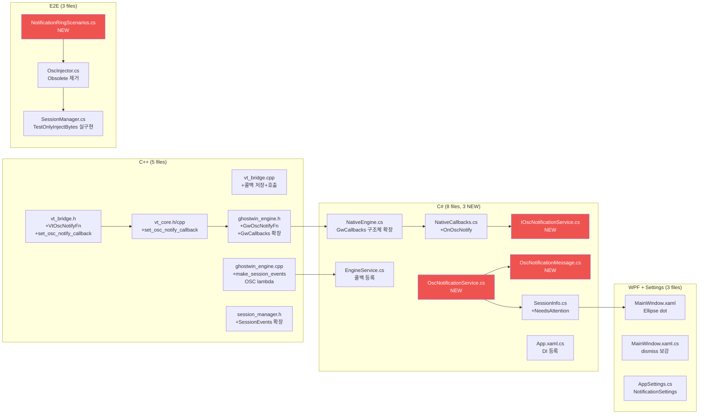

# Design — Phase 6-A: OSC Hook + 알림 링

> **문서 종류**: Design (구현 명세)
> **작성일**: 2026-04-16
> **Plan 참조**: `docs/01-plan/features/phase-6-a-osc-notification-ring.plan.md`
> **PRD 참조**: `docs/00-pm/phase-6-a-osc-notification-ring.prd.md`

---

## 1. 한 줄 요약

ghostty libvt가 이미 파싱하는 OSC 9/99/777 알림을 C++ 콜백 → C# `IOscNotificationService` → WPF 탭 dot + Win32 Toast 까지 연결하는 **4계층 파이프라인** 구현 명세.

---

## 2. 구현 순서 (6 Waves)

| Wave | 범위 | 의존 | 검증 |
|:----:|------|:---:|------|
| **W1** | C++ vt_bridge + GwCallbacks OSC 콜백 추가 | — | C++ 단위: 콜백 호출 확인 |
| **W2** | C# NativeCallbacks + IOscNotificationService + DI | W1 | `echo -e '\033]9;test\033\\'` → 로그 출력 |
| **W3** | WPF 탭 dot + Auto-dismiss + Settings | W2 | 수동: OSC 9 → 점 → 탭 전환 → 소등 |
| **W4** | Win32 Toast | W2 | 수동: 창 비활성 시 Toast |
| **W5** | TestOnlyInjectBytes 실구현 + E2E Tier 3 | W3 | `dotnet test --filter "Tier=3"` |
| **W6** | 통합 검증 | W1-W5 | `dotnet test --filter "Tier!=Slow"` 전체 PASS |

---

## 3. Wave 1 — C++ OSC 콜백 파이프라인

### 3.1 vt_bridge.h — 새 콜백 타입 + 등록 함수

기존 `VtTitleChangedFn` 패턴(L157-164)과 동일 구조:

```c
// Phase 6-A: OSC 9/99/777 notification callback.
// Called from write() context (I/O thread).
// kind: GhosttyOscCommandType value (9 = SHOW_DESKTOP_NOTIFICATION)
// title/body: UTF-8 null-terminated. body may be empty.
typedef void (*VtOscNotifyFn)(VtTerminal terminal, void* userdata,
                              int kind, const char* title, const char* body);

void vt_bridge_set_osc_notify_callback(VtTerminal terminal,
                                       VtOscNotifyFn fn, void* userdata);
```

### 3.2 vt_bridge.cpp — 콜백 저장 + 호출

ghostty stream handler에서 `show_desktop_notification` 액션 발생 시 콜백 호출:

```cpp
// VtTerminalImpl 내부에 저장
VtOscNotifyFn osc_notify_fn_ = nullptr;
void* osc_notify_userdata_ = nullptr;

void vt_bridge_set_osc_notify_callback(VtTerminal t, VtOscNotifyFn fn, void* ud) {
    auto* impl = reinterpret_cast<VtTerminalImpl*>(t);
    impl->osc_notify_fn_ = fn;
    impl->osc_notify_userdata_ = ud;
}
```

ghostty의 `handler.showDesktopNotification(title, body)` 호출 지점에서:

```cpp
if (impl->osc_notify_fn_) {
    impl->osc_notify_fn_(t, impl->osc_notify_userdata_,
                         GHOSTTY_OSC_COMMAND_SHOW_DESKTOP_NOTIFICATION,
                         title_cstr, body_cstr);
}
```

**참고**: ghostty libvt 내부 `osc9.zig`가 OSC 9 원본과 OSC 99/777 모두 `show_desktop_notification` 으로 통합 파싱하므로, 콜백 1개로 3종 모두 처리.

### 3.3 vt_core.h/cpp — C++ 래퍼 메서드

기존 `set_title_callback` 패턴(L116, cpp:176-179)과 동일:

```cpp
// vt_core.h
using OscNotifyFn = void(*)(VtTerminal terminal, void* userdata,
                            int kind, const char* title, const char* body);
void set_osc_notify_callback(OscNotifyFn fn, void* userdata);

// vt_core.cpp
void VtCore::set_osc_notify_callback(OscNotifyFn fn, void* userdata) {
    if (!impl_->terminal) return;
    vt_bridge_set_osc_notify_callback(impl_->terminal, fn, userdata);
}
```

### 3.4 ghostwin_engine.h — GwCallbacks 구조체 확장

기존 `GwCallbacks`(L45-54) 끝에 새 슬롯 추가:

```c
// 새 typedef (L43 뒤)
typedef void (*GwOscNotifyFn)(void* ctx, GwSessionId id,
                              int kind, const wchar_t* title, uint32_t title_len,
                              const wchar_t* body, uint32_t body_len);

// GwCallbacks 확장 (L54 뒤)
typedef struct {
    void* context;
    GwSessionFn      on_created;
    GwSessionFn      on_closed;
    GwSessionFn      on_activated;
    GwTitleFn        on_title_changed;
    GwCwdFn          on_cwd_changed;
    GwExitFn         on_child_exit;
    GwRenderDoneFn   on_render_done;
    GwOscNotifyFn    on_osc_notify;      // Phase 6-A 추가
} GwCallbacks;
```

**주의**: `StructLayout(LayoutKind.Sequential)` — C#측 `GwCallbacks` 도 동일 순서로 확장 필수.

**문자열 변환**: vt_bridge 콜백은 UTF-8 `const char*`을 전달하지만, GwCallbacks는 기존 패턴(title/cwd)에 맞춰 `wchar_t*` + `uint32_t len`으로 변환. 변환은 `make_session_events()` 내부 lambda에서 수행 (`MultiByteToWideChar` 또는 `std::wstring` 변환).

### 3.5 ghostwin_engine.cpp — make_session_events() 확장

기존 `on_title_changed` lambda 패턴(L92-97)과 동일:

```cpp
// make_session_events() 내부, L108 근처
events.on_osc_notify = [eng](uint32_t session_id,
                             int kind, const std::string& title,
                             const std::string& body) {
    if (!eng->callbacks.on_osc_notify) return;
    auto wtitle = utf8_to_wstring(title);
    auto wbody  = utf8_to_wstring(body);
    eng->callbacks.on_osc_notify(
        eng->callbacks.context, session_id, kind,
        wtitle.c_str(), static_cast<uint32_t>(wtitle.size()),
        wbody.c_str(),  static_cast<uint32_t>(wbody.size()));
};
```

### 3.6 session_manager.h — SessionEvents 확장

기존 `SessionEvents`(L29-47)에 OSC 콜백 슬롯 추가:

```cpp
struct SessionEvents {
    // ... 기존 6개 ...
    std::function<void(uint32_t, int, const std::string&, const std::string&)> on_osc_notify;
};
```

VtCore 세션 생성 시 `set_osc_notify_callback()` 등록:

```cpp
vt->set_osc_notify_callback(
    [this, session_id](VtTerminal, void*, int kind, const char* t, const char* b) {
        if (events_.on_osc_notify)
            events_.on_osc_notify(session_id, kind,
                                  t ? std::string(t) : "",
                                  b ? std::string(b) : "");
    }, nullptr);
```

---

## 4. Wave 2 — C# 서비스 계층

### 4.1 NativeEngine.cs — GwCallbacks 구조체 확장

기존 구조체(L5-16) 끝에 추가:

```csharp
[StructLayout(LayoutKind.Sequential)]
internal struct GwCallbacks
{
    public nint Context;
    public nint OnCreated;
    public nint OnClosed;
    public nint OnActivated;
    public nint OnTitleChanged;
    public nint OnCwdChanged;
    public nint OnChildExit;
    public nint OnRenderDone;
    public nint OnOscNotify;     // Phase 6-A 추가
}
```

### 4.2 NativeCallbacks.cs — OnOscNotify 핸들러

기존 `OnTitleChanged` 패턴(L50-57)과 동일:

```csharp
[UnmanagedCallersOnly(CallConvention = typeof(CallConvCdecl))]
internal static unsafe void OnOscNotify(
    nint ctx, uint sessionId, int kind,
    nint titlePtr, uint titleLen,
    nint bodyPtr, uint bodyLen)
{
    var d = _dispatcher;
    if (d is null) return;
    var title = titleLen > 0
        ? new string((char*)titlePtr, 0, (int)titleLen)
        : string.Empty;
    var body = bodyLen > 0
        ? new string((char*)bodyPtr, 0, (int)bodyLen)
        : string.Empty;
    d.BeginInvoke(() =>
    {
        var c = _context;
        if (c is null) return;
        c.OnOscNotify(sessionId, kind, title, body);
    });
}
```

**스레드 안전**: I/O thread에서 호출 → `Dispatcher.BeginInvoke`로 UI thread 전환 (ADR-006).

### 4.3 EngineService.cs — 콜백 등록

기존 콜백 조립 코드(L23-40) 끝에 추가:

```csharp
OnOscNotify = (nint)(delegate* unmanaged[Cdecl]<nint, uint, int, nint, uint, nint, uint, void>)
              &NativeCallbacks.OnOscNotify,
```

`_context` 인터페이스(또는 클래스)에 `OnOscNotify` 메서드 추가 필요.

### 4.4 IOscNotificationService.cs (NEW)

```csharp
namespace GhostWin.Core.Interfaces;

public interface IOscNotificationService
{
    void HandleOscEvent(uint sessionId, int oscKind, string title, string body);
    bool IsNeedsAttention(uint sessionId);
    void DismissAttention(uint sessionId);
}
```

### 4.5 OscNotificationService.cs (NEW)

```csharp
namespace GhostWin.Services;

public class OscNotificationService : IOscNotificationService
{
    private readonly ISessionManager _sessionManager;
    private readonly ISettingsService _settings;
    private readonly IMessenger _messenger;
    private DateTimeOffset _lastNotifyTime = DateTimeOffset.MinValue;

    // debounce: 100ms 이내 연속 알림은 병합
    private static readonly TimeSpan DebounceInterval = TimeSpan.FromMilliseconds(100);

    // OSC 9 (SHOW_DESKTOP_NOTIFICATION) = ghostty enum value 9
    private const int OscShowDesktopNotification = 9;

    public OscNotificationService(
        ISessionManager sessionManager,
        ISettingsService settings,
        IMessenger messenger) { ... }

    public void HandleOscEvent(uint sessionId, int oscKind, string title, string body)
    {
        // 1. 화이트리스트 검사: SHOW_DESKTOP_NOTIFICATION 만 처리
        //    (ghostty가 OSC 9/99/777 모두 이 타입으로 통합)
        if (oscKind != OscShowDesktopNotification) return;

        // 2. 설정 검사
        if (!_settings.Current.Notifications.RingEnabled) return;

        // 3. debounce
        var now = DateTimeOffset.UtcNow;
        if (now - _lastNotifyTime < DebounceInterval) return;
        _lastNotifyTime = now;

        // 4. SessionInfo.NeedsAttention 설정
        var session = _sessionManager.Sessions.FirstOrDefault(s => s.Id == sessionId);
        if (session is null) return;
        if (session.IsActive) return; // 이미 포커스된 탭이면 무시

        session.NeedsAttention = true;
        session.LastOscMessage = string.IsNullOrEmpty(body) ? title : body;
        session.AttentionRaisedAt = now;

        // 5. Messenger 브로드캐스트
        _messenger.Send(new OscNotificationMessage(sessionId, oscKind, title, body));

        // 6. Toast (창 비활성 시만)
        if (_settings.Current.Notifications.ToastEnabled
            && !Application.Current.MainWindow.IsActive)
        {
            ShowToast(title, body);
        }
    }

    public bool IsNeedsAttention(uint sessionId) => ...;

    public void DismissAttention(uint sessionId)
    {
        var session = _sessionManager.Sessions.FirstOrDefault(s => s.Id == sessionId);
        if (session is null) return;
        session.NeedsAttention = false;
        session.LastOscMessage = string.Empty;
    }

    private void ShowToast(string title, string body) { ... }
}
```

### 4.6 OscNotificationMessage.cs (NEW)

```csharp
namespace GhostWin.Core.Events;

public record OscNotificationMessage(
    uint SessionId, int OscKind, string Title, string Body);
```

### 4.7 SessionInfo.cs — 프로퍼티 추가

기존 모델(3개 프로퍼티)에 추가:

```csharp
[ObservableProperty]
private bool _needsAttention;

[ObservableProperty]
private string _lastOscMessage = string.Empty;

public DateTimeOffset AttentionRaisedAt { get; set; }
```

### 4.8 App.xaml.cs — DI 등록

기존 `ServiceCollection` 등록부에 추가:

```csharp
services.AddSingleton<IOscNotificationService, OscNotificationService>();
```

---

## 5. Wave 3 — WPF UI (탭 dot + Auto-dismiss)

### 5.1 MainWindow.xaml — TabItem 템플릿

사이드바 탭 리스트에 cmux 스타일 원형 dot 추가. 기존 TabItem 구조 안:

```xml
<!-- 탭 텍스트 옆 알림 dot (8x8, amber) -->
<Ellipse x:Name="NotificationDot"
         Width="8" Height="8"
         Fill="#FFB020"
         Margin="6,0,0,0"
         VerticalAlignment="Center"
         Visibility="{Binding NeedsAttention,
                      Converter={StaticResource BoolToVisibilityConverter}}"
         AutomationProperties.AutomationId="{Binding Id,
             StringFormat=E2E_NotificationRing_{0}}"
         ToolTip="{Binding LastOscMessage}"/>
```

### 5.2 Auto-dismiss 연결

`SessionManager.ActivateSession()` (L72-84)에서 `IOscNotificationService.DismissAttention()` 호출:

```csharp
public void ActivateSession(uint sessionId)
{
    // ... 기존 로직 ...
    _oscNotificationService.DismissAttention(sessionId);
    // ...
}
```

`SessionManager` 생성자에 `IOscNotificationService` DI 주입 추가.

### 5.3 Settings 모델 확장

```csharp
public class NotificationSettings
{
    public bool RingEnabled { get; set; } = true;
    public bool ToastEnabled { get; set; } = true;
}
```

`AppSettings`에 `Notifications` 프로퍼티 추가.

---

## 6. Wave 4 — Win32 Toast

### 6.1 NuGet 패키지

```xml
<PackageReference Include="Microsoft.Toolkit.Uwp.Notifications" Version="7.1.3" />
```

또는 .NET 10에서 CsWinRT 직접 사용:
```xml
<PackageReference Include="Microsoft.Windows.CsWinRT" Version="2.2.0" />
```

### 6.2 Toast 발사 코드

`OscNotificationService.ShowToast()`:

```csharp
private static void ShowToast(string title, string body)
{
    new ToastContentBuilder()
        .AddText(string.IsNullOrEmpty(title) ? "GhostWin" : title)
        .AddText(string.IsNullOrEmpty(body) ? title : body)
        .Show();
}
```

**Phase 6-B 연결**: Toast 클릭 → 해당 탭 이동 Action은 Phase 6-B에서 `AddArgument("sessionId", ...)` + `ToastNotificationManagerCompat.OnActivated` 핸들러로 확장.

---

## 7. Wave 5 — TestOnlyInjectBytes + E2E Tier 3

### 7.1 TestOnlyInjectBytes 실제 구현

`SessionManager.cs`의 기존 stub(L114-121)을 실동작으로 교체:

```csharp
public void TestOnlyInjectBytes(uint sessionId, byte[] data)
{
    _engine.WriteToSession(sessionId, data);
}
```

`IEngineService`에 `WriteToSession(uint sessionId, byte[] data)` 추가 필요.
→ C++ 측: `gw_session_write(GwEngine, GwSessionId, const uint8_t*, uint32_t)` 함수 추가.
→ ConPTY 입력 파이프에 `WriteFile()`.

### 7.2 E2E Tier 3 — NotificationRingScenarios.cs

```csharp
[Trait("Tier", "3")]
[Trait("Category", "E2E")]
[Collection("GhostWin-App")]
public class NotificationRingScenarios : IClassFixture<GhostWinAppFixture>
{
    [Fact]
    public void OscNotification_ShowsDot()
    {
        // Arrange: 앱 시작 후 세션 확보
        // Act: OscInjector.InjectOsc9(mgr, sessionId, "test notification")
        // Assert: UIA FindDescendant(AutomationId = "E2E_NotificationRing_{id}")
        //         → Visibility == Visible
    }

    [Fact]
    public void TabSwitch_DismissesDot()
    {
        // Arrange: dot이 켜진 상태
        // Act: 해당 탭으로 전환
        // Assert: dot Visibility == Collapsed
    }
}
```

### 7.3 OscInjector.cs — Obsolete 제거

```csharp
// [Obsolete] 제거 — Phase 6-A 구현 완료
public static void InjectOsc9(ISessionManager mgr, uint sessionId, string message)
{
    var sequence = $"\x1b]9;{message}\x1b\\";
    mgr.TestOnlyInjectBytes(sessionId, Encoding.UTF8.GetBytes(sequence));
}
```

---

## 8. 전체 파일 변경 맵



**빨강** = 신규 파일 (4개). 나머지 = 기존 파일 수정.

---

## 9. 스레드 안전 설계

```
I/O Thread (C++)                    UI Thread (C#)
─────────────────                   ──────────────
libvt write() →                     
  osc9.zig parse →                  
  VtOscNotifyFn callback →          
  GwCallbacks.on_osc_notify →       
  NativeCallbacks.OnOscNotify ──→   Dispatcher.BeginInvoke
                                      ↓
                                    OscNotificationService
                                      .HandleOscEvent()
                                      ↓
                                    SessionInfo.NeedsAttention = true
                                      ↓
                                    INotifyPropertyChanged
                                      ↓
                                    XAML DataTrigger
                                      → Ellipse.Visibility
```

**규칙**: `NativeCallbacks.OnOscNotify`에서 C# 상태(SessionInfo, UI)를 절대 직접 건드리지 않음. 반드시 `Dispatcher.BeginInvoke`를 거침 (ADR-006).

---

## 10. debounce 정책

| 조건 | 동작 |
|------|------|
| 같은 세션에서 100ms 이내 연속 OSC | 최초 1회만 처리, 나머지 무시 |
| 이미 NeedsAttention=true인 세션에 재알림 | LastOscMessage만 갱신, dot은 이미 켜져 있음 |
| 활성 탭(IsActive=true)에서 OSC 수신 | 무시 (사용자가 이미 보고 있음) |
| 초당 100회 fuzz 주입 | debounce + 위 규칙으로 UI 프레임 드랍 방지 |

---

## 11. 설정 스키마

`%AppData%/GhostWin/settings.json` 확장:

```json
{
  "terminal": { ... },
  "notifications": {
    "ringEnabled": true,
    "toastEnabled": true
  }
}
```

M-12 Settings UI 이전에는 JSON 직접 편집으로만 변경 가능.

---

## 12. 비교표: Before / After

| 항목 | Before (현재) | After (Phase 6-A) |
|------|-------------|------------------|
| OSC 9 처리 | libvt가 파싱만 하고 버림 | 콜백으로 C#까지 전달 |
| 탭 상태 표시 | 제목만 | 제목 + **알림 dot** + 메시지 툴팁 |
| 병렬 에이전트 인식 | 탭 클릭해서 확인 | 점 한눈에 확인 |
| 창 비활성 시 알림 | 없음 | Win32 Toast |
| E2E 알림 검증 | 불가 (stub) | OscInjector + Tier 3 자동화 |
| 알림 설정 | 없음 | ringEnabled / toastEnabled 토글 |

---

## 13. 위험 완화

| 위험 | 완화 |
|------|------|
| ghostty stream handler 접근 방법 불확실 | vt_bridge 래퍼로 격리. ghostty 소스 직접 수정 최소화 (콜백 훅만) |
| `StructLayout.Sequential` 순서 불일치 | C++/C# GwCallbacks 필드 순서를 코드 리뷰에서 교차 검증 |
| Toast NuGet .NET 10 호환 | 빌드 시 확인. 대안: CsWinRT 직접 사용 |
| oh-my-posh 등 false positive | OSC kind 화이트리스트 (`SHOW_DESKTOP_NOTIFICATION`만) + debounce |

---

*End of Design — Phase 6-A: OSC Hook + Notification Ring*
