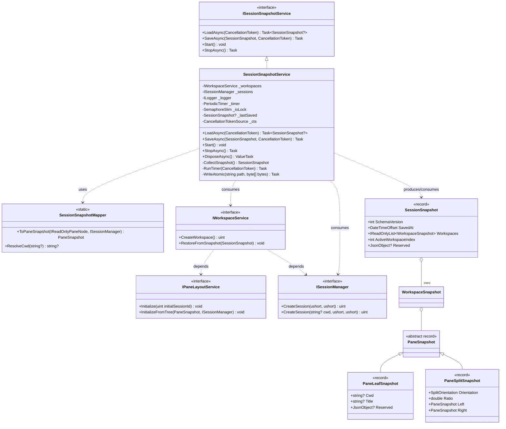
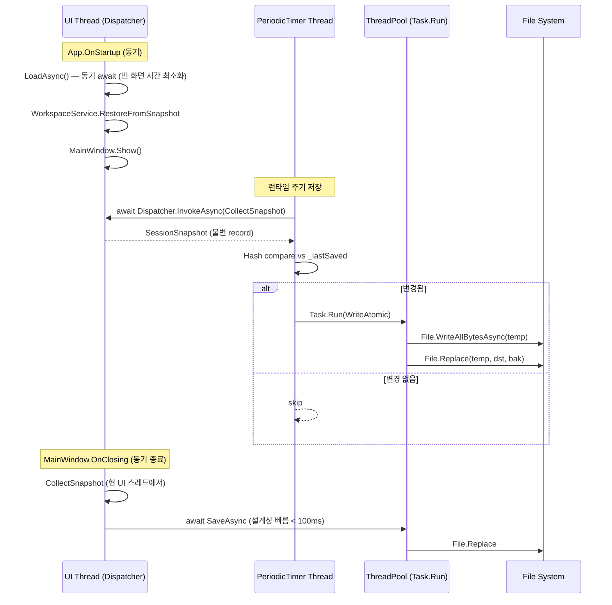
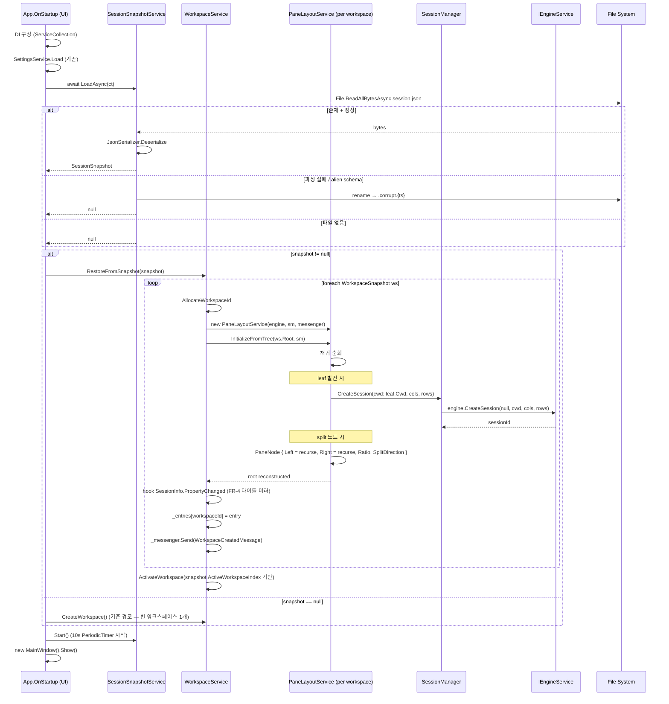
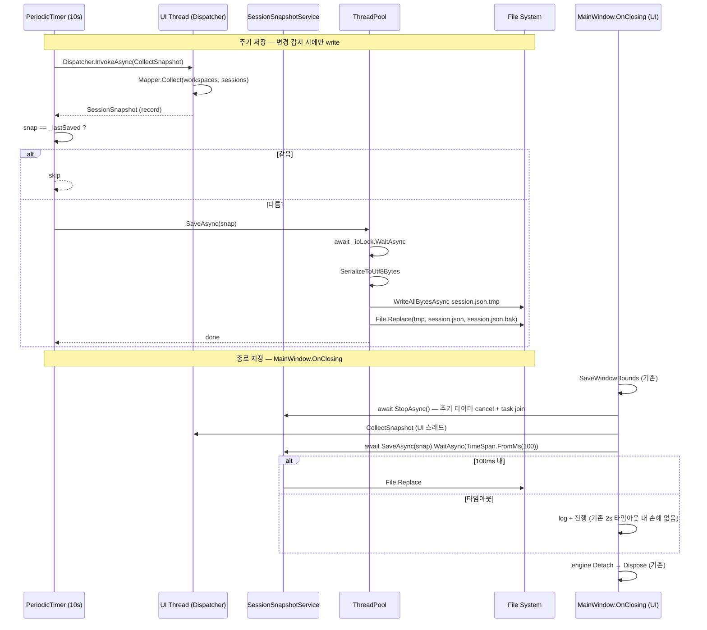
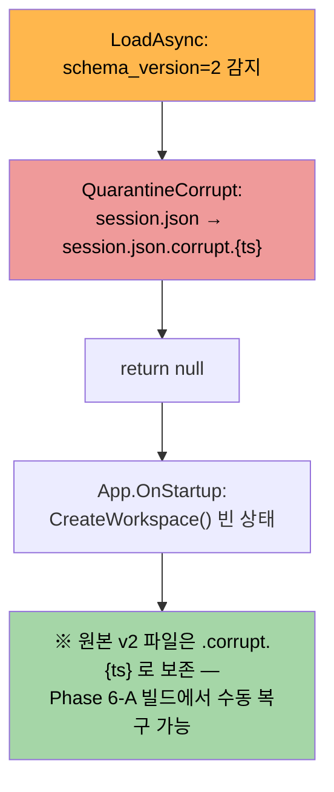

# Session Restore — M-11 Design

> Version 1.0 | 작성일: 2026-04-15 | 선행 문서: PRD (`docs/00-pm/session-restore.prd.md`), Plan (`docs/01-plan/features/session-restore.plan.md`)
> 브랜치: `feature/wpf-migration` | Target: .NET 10 / WPF / `Microsoft.NET.Sdk` (`<UseWPF>true</UseWPF>`)
> 후속: Phase 6-A OSC Hook + 알림 링

---

## Executive Summary

| 관점 | 내용 |
|------|------|
| **Problem (구현 관점)** | 기존 `WorkspaceService` 는 내부 `Dictionary<uint, WorkspaceEntry>` 로 워크스페이스를 관리하고 복원 진입점이 없다. 상태는 `WorkspaceService.Workspaces` (공개) / `PaneLayoutService.Root` (공개) / `SessionInfo.Cwd / Title` (public property) 에서 **읽기** 가능하지만, **쓰기 경로** 는 `CreateWorkspace()` / `SplitFocused()` 레고 블록만 있다. 외부에서 임의 pane 트리를 구성하는 공개 API 가 없다 — 이것이 Plan 이 **`WorkspaceService.RestoreFromSnapshot(...)` + `PaneLayoutService.InitializeFromTree(...)` 신규 메서드** 를 도입하기로 한 이유다. |
| **Solution (구현 메커니즘)** | (a) `GhostWin.Core.Models` 에 불변 `record` DTO 5 종 (`SessionSnapshot`, `WorkspaceSnapshot`, `PaneSnapshot` + 2 derived) + `System.Text.Json` `JsonPolymorphic` 기반 tagged-union. (b) `GhostWin.Services` 에 `SessionSnapshotService` (Singleton, `IAsyncDisposable`) — `PeriodicTimer` 10s, `SemaphoreSlim(1,1)` 파일 I/O 직렬화, `File.Replace` 원자 쓰기. (c) `WorkspaceService.RestoreFromSnapshot(SessionSnapshot)` + `PaneLayoutService.InitializeFromTree(PaneSnapshot, ...)` 신규 메서드 (public, but 호출자 한정 문서화). (d) `ISessionManager.CreateSession(string? cwd, ushort, ushort)` 오버로드 추가 — 엔진의 기존 `initialDir` 인자 (`IEngineService.cs:24`) 로 투과. |
| **Function UX Effect (코드 경로)** | 앱 시작: `App.OnStartup` → DI 구성 → `SessionSnapshotService.TryLoad()` → `WorkspaceService.RestoreFromSnapshot(snap)` → `MainWindow.Show()`. 앱 종료: `MainWindow.OnClosing` 의 현 `SaveWindowBounds` 직후 `await SessionSnapshotService.SaveAsync()` → 그 후 엔진 `Detach`→`Dispose` (기존 순서 유지). 주기 저장: `PeriodicTimer(10s)` → UI 스레드 스냅샷 수집 (Dispatcher.InvokeAsync) → 해시 비교 → `Task.Run` 에서 직렬화·쓰기. |
| **Core Value (Design 근거)** | 모든 신규 공개 API 는 **복원 전용** 1 회성 진입점 + **Reserved `JsonObject?` round-trip** 으로 Phase 6-A 하위 호환 보장. `PaneNode` 는 직렬화에 노출되지 않음 (내부 `Id`, `SessionId` 는 세션 재생성 후 **새로 발급**) — 외부 dict (`TerminalHostControl` surface cache 등) 와 무충돌. `SettingsService.SettingsFilePath` (Roaming `%AppData%/GhostWin/`) 패턴 동일. |

---

## 1. 입력 문서 요약

- **PRD §6 FR-1 ~ FR-7**: JSON 저장, 종료/주기 저장, 시작 복원, 타이틀 미러, schema_version, 손상 파일 폴백, `reserved.agent` 확장 슬롯.
- **Plan §7 Phase 1-A ~ 1-E**: DTO → 서비스 골격 → Save (종료) → Restore → 주기 저장 의 순서 확정.
- **Plan OQ 확정**: 순차 복원, CWD 폴백 3 단계, `File.Replace` 원자 쓰기, `ISessionManager.CreateSession(cwd, …)` 오버로드, Roaming 저장 위치.
- **Design 이월 OQ**: (1) OSC 7 쉘 실측 매트릭스 → Do phase 로 위임. (2) `WorkspaceService.RestoreFromSnapshot` 내부 API 디자인 → **본 Design §12 에서 확정**.

### Plan 대비 의도적 변경 (Design 단계 조정)

| 항목 | Plan | Design | 근거 |
|------|------|--------|------|
| `SaveAsync` 시그니처 | `SaveAsync(CancellationToken)` | `SaveAsync(SessionSnapshot, CancellationToken)` | 호출자가 스냅샷 수집 시점 제어 → 종료 경로의 UI 스레드 수집과 주기 저장의 `Dispatcher.InvokeAsync` 경로를 통일. 테스트 시 mock 스냅샷 주입 용이 (testability). |
| 파일 복원 폴백 | `null` 반환 시 "기존 경로" | **`App.OnStartup` 단일 진입점**에서 `CreateWorkspace()` 폴백 | §15 Step 7 참조. `MainWindow.OnLoaded` 의 기존 `CreateWorkspace()` 호출은 **가드 추가** (`Workspaces.Count == 0` 일 때만) — 이중 생성 방지 (C-1 해결). |

---

## 2. 아키텍처 확정

### 2.1 클래스 다이어그램



### 2.2 의존성 방향

```
App.OnStartup / MainWindow.OnClosing   (합성 루트 — WPF)
    │
    ▼ 주입
SessionSnapshotService (신규, Singleton)
    │   │
    │   ▼ read / write
    │   %AppData%/GhostWin/session.json
    │
    ├─► IWorkspaceService   (수정: RestoreFromSnapshot 추가)
    │     └─► IPaneLayoutService  (수정: InitializeFromTree 추가)
    │     └─► ISessionManager     (수정: CreateSession(cwd, …) 오버로드)
    │           └─► IEngineService  (무변경 — initialDir 인자 이미 존재)
    │
    └─► SessionSnapshotMapper (신규, static — PaneNode → PaneSnapshot)
```

**원칙**: `SessionSnapshotService` 는 기존 서비스의 **public API 만** 호출한다. 내부 상태 (`_entries`, `_root`) 직접 접근 금지.

### 2.3 DI 수명 결정

| 서비스 | 수명 | 근거 |
|--------|------|------|
| `ISessionSnapshotService` | **Singleton** | 주기 타이머 + 파일 잠금 단일 소유. 앱 전 생애주기 공유. 기존 `ISettingsService` 와 동일 패턴. |
| `SessionSnapshotMapper` | `static` (DI 불필요) | 상태 없는 순수 변환기. |
| `IWorkspaceService` | Singleton (기존) | 변경 없음 (`App.xaml.cs:41` 그대로). |
| `ISessionManager` | Singleton (기존) | 변경 없음 (`App.xaml.cs:35`). |

### 2.4 스레드 경계



**핵심 원칙**:
- **스냅샷 수집** 은 반드시 **UI 스레드** (`WorkspaceService.Workspaces`, `PaneLayoutService.Root` 는 `ObservableCollection` / `PaneNode` — UI affinity).
- **직렬화 + 파일 I/O** 는 백그라운드 (`Task.Run` 또는 `PeriodicTimer` 워커 스레드).
- 복원 경로는 `MainWindow.Show()` **이전** 이므로 UI 스레드 단독 실행 — 경쟁 없음.

---

## 3. 데이터 모델 (C# record 전체 정의)

### 3.1 타입 정의

위치: `src/GhostWin.Core/Models/SessionSnapshot.cs` (신규)

```csharp
using System.Text.Json.Nodes;
using System.Text.Json.Serialization;

namespace GhostWin.Core.Models;

/// <summary>
/// 루트 DTO. session.json 의 최상위 구조.
/// SchemaVersion 은 향후 v2 (Phase 6-A) 과의 하위 호환 경로에서 사용.
/// </summary>
public sealed record SessionSnapshot(
    [property: JsonPropertyName("schema_version")] int SchemaVersion,
    [property: JsonPropertyName("saved_at")]       DateTimeOffset SavedAt,
    [property: JsonPropertyName("workspaces")]     IReadOnlyList<WorkspaceSnapshot> Workspaces,
    [property: JsonPropertyName("active_workspace_index")] int ActiveWorkspaceIndex,
    [property: JsonPropertyName("reserved")]       JsonObject? Reserved
);

public sealed record WorkspaceSnapshot(
    [property: JsonPropertyName("name")]     string Name,
    [property: JsonPropertyName("root")]     PaneSnapshot Root,
    [property: JsonPropertyName("reserved")] JsonObject? Reserved
);

/// <summary>
/// Discriminated union 기저 타입. JSON 상에서는 "type": "leaf" | "split" 태그 사용.
/// </summary>
[JsonPolymorphic(TypeDiscriminatorPropertyName = "type")]
[JsonDerivedType(typeof(PaneLeafSnapshot),  "leaf")]
[JsonDerivedType(typeof(PaneSplitSnapshot), "split")]
public abstract record PaneSnapshot;

public sealed record PaneLeafSnapshot(
    [property: JsonPropertyName("cwd")]      string? Cwd,
    [property: JsonPropertyName("title")]    string? Title,
    [property: JsonPropertyName("reserved")] JsonObject? Reserved
) : PaneSnapshot;

public sealed record PaneSplitSnapshot(
    [property: JsonPropertyName("orientation")] SplitOrientation Orientation,
    [property: JsonPropertyName("ratio")]       double Ratio,
    [property: JsonPropertyName("left")]        PaneSnapshot Left,
    [property: JsonPropertyName("right")]       PaneSnapshot Right
) : PaneSnapshot;
```

> **Note**: `SplitOrientation` 은 기존 `GhostWin.Core.Models.PaneNode.cs:3` 의 enum 을 그대로 재사용. `System.Text.Json` 의 `JsonStringEnumConverter` 전역 옵션으로 문자열 직렬화 (`"Horizontal"` / `"Vertical"`).

### 3.2 필드 설명

| 필드 | 타입 | 저장 규칙 | 복원 규칙 |
|------|------|-----------|-----------|
| `SchemaVersion` | `int` | 현 빌드는 항상 `1` | `!= 1` 시 alien schema 폴백 (§13) |
| `SavedAt` | `DateTimeOffset` | 저장 시 `DateTimeOffset.Now` | 정보 용 (사용자 확인) — 복원 로직 무관 |
| `Workspaces` | `IReadOnlyList<WorkspaceSnapshot>` | `WorkspaceService.Workspaces` 순회 결과 | 순서대로 `RestoreFromSnapshot` 재생성 |
| `ActiveWorkspaceIndex` | `int` | `Workspaces` 내 활성 워크스페이스 인덱스 (`-1` = 없음) | 범위 벗어나면 첫 번째 활성화 |
| `Reserved` | `JsonObject?` | `null` 이면 JSON 에서 생략 (경량) | unknown 필드 round-trip 보존 — §10 |
| `WorkspaceSnapshot.Name` | `string` | `WorkspaceInfo.Name` 저장 | 복원 후 `WorkspaceInfo.Name` 재설정 |
| `WorkspaceSnapshot.Root` | `PaneSnapshot` | `PaneLayoutService.Root` 를 `SessionSnapshotMapper.ToPaneSnapshot` 으로 변환 | `PaneLayoutService.InitializeFromTree` 로 재구성 |
| `PaneLeafSnapshot.Cwd` | `string?` | `SessionInfo.Cwd` 가 비어있으면 `null` (저장 안 함) | `ResolveCwd` 폴백 후 `SessionManager.CreateSession(cwd, …)` 전달 |
| `PaneLeafSnapshot.Title` | `string?` | 참고 용도 | 복원 시 무시 (쉘이 재발행) |
| `PaneSplitSnapshot.Ratio` | `double` | `PaneNode.Ratio` (0.0~1.0) | `PaneNode.Ratio` 로 복원 (±1%) |

### 3.3 Unknown 필드 처리

`System.Text.Json` 기본 동작: unknown 필드 **silently ignore**. 이는 Phase 6-A 빌드가 v1 파일을 읽을 때 편리하지만, v1 빌드가 v2 파일의 `agent` 서브필드를 **드롭** 할 위험이 있다.

**해결책**: `Reserved` 를 `JsonObject?` 로 받아 원문 노드 보존. 재직렬화 시 그대로 다시 기록. 자세한 round-trip 전략은 §10.

---

## 4. JSON 스키마 v1 예시

저장 파일 경로: `%AppData%/GhostWin/session.json` (Roaming — `SettingsService.cs:22-24` 패턴 동일)

```json
{
  "schema_version": 1,
  "saved_at": "2026-04-15T17:30:00+09:00",
  "active_workspace_index": 0,
  "workspaces": [
    {
      "name": "project-x",
      "root": {
        "type": "split",
        "orientation": "Horizontal",
        "ratio": 0.5,
        "left": {
          "type": "leaf",
          "cwd": "C:\\Users\\Solit\\proj",
          "title": "pwsh",
          "reserved": null
        },
        "right": {
          "type": "leaf",
          "cwd": "C:\\Users\\Solit\\proj\\src",
          "title": "node — dev",
          "reserved": null
        }
      },
      "reserved": null
    },
    {
      "name": "logs",
      "root": {
        "type": "leaf",
        "cwd": "C:\\logs",
        "title": "tail",
        "reserved": null
      },
      "reserved": null
    }
  ],
  "reserved": null
}
```

### Phase 6-A 에서 예상되는 v2 파일 (참고용 — 현 빌드는 생성하지 않음)

```json
{
  "schema_version": 2,
  "saved_at": "2026-06-01T10:00:00+09:00",
  "workspaces": [ ... ],
  "reserved": {
    "agent": {
      "pending_notifications": [
        { "pane_id": 3, "at": "2026-06-01T09:58:00+09:00", "kind": "osc-9" }
      ],
      "last_osc_event": { "seq": "9", "payload": "build done" }
    }
  }
}
```

v1 빌드는 `schema_version=2` 를 alien 으로 판단해 `.corrupt` 격리 후 빈 상태 시작 — **v2 파일은 보존됨** (덮어쓰지 않음). §13 참조.

---

## 5. `SessionSnapshotService` 상세 API

### 5.1 인터페이스

위치: `src/GhostWin.Core/Interfaces/ISessionSnapshotService.cs` (신규)

```csharp
using GhostWin.Core.Models;

namespace GhostWin.Core.Interfaces;

public interface ISessionSnapshotService : IAsyncDisposable
{
    /// <summary>
    /// 디스크에서 스냅샷을 읽어 반환. 없음/손상 시 null 반환.
    /// 손상 시 자동으로 .corrupt.{yyyyMMdd-HHmmss} 로 rename (데이터 유실 방지).
    /// App.OnStartup 에서 1회 호출.
    /// </summary>
    Task<SessionSnapshot?> LoadAsync(CancellationToken ct = default);

    /// <summary>
    /// 주어진 스냅샷을 session.json 에 원자적 쓰기.
    /// MainWindow.OnClosing (동기 종료 경로) 에서 1회 await 호출.
    /// 주기 저장은 내부 Start() 경로에서 자동.
    /// </summary>
    Task SaveAsync(SessionSnapshot snapshot, CancellationToken ct = default);

    /// <summary>주기 저장 타이머 시작 (기본 10초). App.OnStartup 의 복원 직후 1회 호출.</summary>
    void Start();

    /// <summary>주기 저장 타이머 중단 + 최종 저장 1회 보장. OnClosing 의 엔진 정리 직전 호출.</summary>
    Task StopAsync();
}
```

### 5.2 구현 골격

위치: `src/GhostWin.Services/SessionSnapshotService.cs` (신규)

```csharp
using System.Diagnostics;
using System.IO;
using System.Text.Json;
using System.Text.Json.Nodes;
using System.Text.Json.Serialization;
using System.Threading;
using GhostWin.Core.Interfaces;
using GhostWin.Core.Models;

namespace GhostWin.Services;

public sealed class SessionSnapshotService : ISessionSnapshotService
{
    private readonly IWorkspaceService _workspaces;
    private readonly ISessionManager _sessions;

    private readonly SemaphoreSlim _ioLock = new(1, 1);
    private readonly CancellationTokenSource _cts = new();
    private SessionSnapshot? _lastSaved;
    private Task? _timerTask;

    public string SnapshotPath { get; }
    public TimeSpan Interval { get; set; } = TimeSpan.FromSeconds(10);

    private static readonly JsonSerializerOptions JsonOpts = new()
    {
        WriteIndented = true,
        PropertyNamingPolicy = JsonNamingPolicy.SnakeCaseLower,
        DefaultIgnoreCondition = JsonIgnoreCondition.WhenWritingNull,
        Converters = { new JsonStringEnumConverter() },
    };

    public SessionSnapshotService(
        IWorkspaceService workspaces,
        ISessionManager sessions)
    {
        _workspaces = workspaces;
        _sessions = sessions;
        SnapshotPath = Path.Combine(
            Environment.GetFolderPath(Environment.SpecialFolder.ApplicationData),
            "GhostWin", "session.json");
    }

    public async Task<SessionSnapshot?> LoadAsync(CancellationToken ct = default)
    {
        await _ioLock.WaitAsync(ct).ConfigureAwait(false);
        try
        {
            // 1차: session.json 시도
            var snap = await TryReadAndParseAsync(SnapshotPath, ct).ConfigureAwait(false);
            if (snap is not null) { _lastSaved = snap; return snap; }

            // 1차 실패 시점에 session.json 은 QuarantineCorrupt 로 격리됨 (또는 원래 부재).
            // 2차 시도: .bak (N-2 — File.Replace 가 자동 유지하는 직전 성공본).
            var bakPath = SnapshotPath + ".bak";
            if (File.Exists(bakPath))
            {
                Debug.WriteLine("[SessionSnapshot] Primary failed — attempting .bak fallback");
                snap = await TryReadAndParseAsync(bakPath, ct).ConfigureAwait(false);
                if (snap is not null)
                {
                    _lastSaved = snap;
                    return snap;
                }
                // .bak 도 파손 — 다음 저장 시 덮어쓰기 될 것이므로 별도 조치 없음 (Plan §10 "둘 다 실패 시 빈 상태 + 양쪽 보존" 정책)
            }
            return null;
        }
        finally { _ioLock.Release(); }
    }

    /// <summary>
    /// 단일 파일 읽기 + 파싱 + schema 검증. 실패 시 해당 파일을 .corrupt.{ts} 로 격리하고 null 반환.
    /// 파일 미존재 시 격리 없이 null.
    /// </summary>
    private async Task<SessionSnapshot?> TryReadAndParseAsync(string path, CancellationToken ct)
    {
        if (!File.Exists(path)) return null;

        byte[] bytes;
        try { bytes = await File.ReadAllBytesAsync(path, ct).ConfigureAwait(false); }
        catch (IOException ex)
        {
            Debug.WriteLine($"[SessionSnapshot] IO error reading {path}: {ex.Message}");
            return null;
        }

        SessionSnapshot? snap = null;
        try
        {
            snap = JsonSerializer.Deserialize<SessionSnapshot>(bytes, JsonOpts);
        }
        catch (JsonException ex)
        {
            Debug.WriteLine($"[SessionSnapshot] Parse failed ({path}): {ex.Message} — quarantining");
            QuarantineCorrupt(path);
            return null;
        }

        if (snap is null || snap.SchemaVersion != 1)
        {
            Debug.WriteLine($"[SessionSnapshot] Alien schema v={snap?.SchemaVersion} ({path}) — quarantining");
            QuarantineCorrupt(path);
            return null;
        }
        return snap;
    }

    public async Task SaveAsync(SessionSnapshot snapshot, CancellationToken ct = default)
    {
        await _ioLock.WaitAsync(ct).ConfigureAwait(false);
        try
        {
            var bytes = JsonSerializer.SerializeToUtf8Bytes(snapshot, JsonOpts);
            await WriteAtomicAsync(bytes, ct).ConfigureAwait(false);
            _lastSaved = snapshot;
        }
        finally { _ioLock.Release(); }
    }

    public void Start()
    {
        if (_timerTask is not null) return;
        _timerTask = RunTimerAsync(_cts.Token);
    }

    public async Task StopAsync()
    {
        _cts.Cancel();
        if (_timerTask is not null)
        {
            try { await _timerTask.ConfigureAwait(false); }
            catch (OperationCanceledException) { /* expected */ }
        }
    }

    public async ValueTask DisposeAsync()
    {
        await StopAsync().ConfigureAwait(false);
        _cts.Dispose();
        _ioLock.Dispose();
    }

    // --- 내부 구현 ---

    private async Task RunTimerAsync(CancellationToken ct)
    {
        using var timer = new PeriodicTimer(Interval);
        while (await timer.WaitForNextTickAsync(ct).ConfigureAwait(false))
        {
            try
            {
                // UI 스레드에서 스냅샷 수집 (WorkspaceService / PaneNode 는 UI affinity)
                var snap = await System.Windows.Application.Current.Dispatcher
                    .InvokeAsync(() => SessionSnapshotMapper.Collect(_workspaces, _sessions))
                    .Task.ConfigureAwait(false);

                if (_lastSaved is not null && snap == _lastSaved) continue; // record equality

                await SaveAsync(snap, ct).ConfigureAwait(false);
            }
            catch (OperationCanceledException) { throw; }
            catch (Exception ex)
            {
                Debug.WriteLine($"[SessionSnapshot] Periodic save failed: {ex}");
                // 다음 주기에 자동 재시도
            }
        }
    }

    private async Task WriteAtomicAsync(byte[] bytes, CancellationToken ct)
    {
        var dir = Path.GetDirectoryName(SnapshotPath)!;
        if (!Directory.Exists(dir)) Directory.CreateDirectory(dir);

        var tempPath = SnapshotPath + ".tmp";
        var backupPath = SnapshotPath + ".bak";

        await File.WriteAllBytesAsync(tempPath, bytes, ct).ConfigureAwait(false);

        if (File.Exists(SnapshotPath))
        {
            // Win32 ReplaceFile — 저널링 FS 에서 원자적. ignoreMetadataErrors=true 로
            // 네트워크 드라이브/권한 문제 완화. (Plan §8.3 OQ-3)
            File.Replace(tempPath, SnapshotPath, backupPath, ignoreMetadataErrors: true);
        }
        else
        {
            File.Move(tempPath, SnapshotPath);
        }
    }

    private void QuarantineCorrupt(string path)
    {
        try
        {
            var stamp = DateTime.Now.ToString("yyyyMMdd-HHmmss");
            var corruptPath = $"{path}.corrupt.{stamp}";
            File.Move(path, corruptPath, overwrite: false);
        }
        catch (Exception ex)
        {
            Debug.WriteLine($"[SessionSnapshot] Quarantine failed ({path}): {ex.Message}");
        }
    }
}
```

### 5.3 내부 구성 요약

| 멤버 | 목적 | 스레드 |
|------|------|--------|
| `SemaphoreSlim _ioLock(1,1)` | `Load` / `Save` / 주기 저장 간 파일 I/O 직렬화 | 진입한 스레드 |
| `CancellationTokenSource _cts` | `StopAsync` 시 `PeriodicTimer` 중단 | — |
| `Task _timerTask` | `PeriodicTimer` 루프 참조 — `StopAsync` 에서 await | ThreadPool |
| `SessionSnapshot? _lastSaved` | 주기 저장 시 equality 비교 | 락으로 보호 |
| `JsonSerializerOptions JsonOpts` | snake_case + indented + enum-as-string + null 생략 | 스레드-세이프 (불변) |

---

## 6. 저장 경로 — 복원 플로우 Sequence Diagram



---

## 7. 저장 경로 — 저장 플로우 Sequence Diagram



**종료 시 100ms 타임아웃 근거**: NFR-1 (Plan §3). `MainWindow.OnClosing` 의 기존 2 초 UI 종료 버짓 안에 여유 있게 들어와야 함.

---

## 8. CWD 폴백 로직 (OQ-2 구현)

위치: `src/GhostWin.Services/SessionSnapshotMapper.cs` (신규 static)

```csharp
using System.IO;

namespace GhostWin.Services;

public static class SessionSnapshotMapper
{
    /// <summary>
    /// 저장된 CWD 가 여전히 존재하는지 확인. 부재 시 상위 3 단계까지 탐색.
    /// 전부 실패하면 null (쉘 기본 CWD).
    /// </summary>
    public static string? ResolveCwd(string? saved)
    {
        if (string.IsNullOrEmpty(saved)) return null;

        var current = saved;
        for (int depth = 0; depth < 3; depth++)
        {
            try
            {
                if (Directory.Exists(current)) return current;
            }
            catch
            {
                // UnauthorizedAccessException 등 — 다음 상위로
            }

            var parent = Path.GetDirectoryName(current);
            if (string.IsNullOrEmpty(parent) || parent == current) break;
            current = parent;
        }
        return null;
    }

    // ... ToPaneSnapshot / Collect 등 — §12 참조
}
```

**동작 표**:

| 저장된 CWD | 현재 상태 | `ResolveCwd` 반환 |
|------------|-----------|--------------------|
| `"C:\\proj\\src\\foo"` | 존재 | `"C:\\proj\\src\\foo"` |
| `"C:\\proj\\src\\foo"` | foo 삭제, src 존재 | `"C:\\proj\\src"` |
| `"C:\\proj\\src\\foo"` | src/foo 삭제, proj 존재 | `"C:\\proj"` |
| `"C:\\proj\\src\\foo"` | proj 삭제 (3 단계 초과) | `null` |
| `null` | — | `null` |
| `""` | — | `null` |

---

## 9. 타이틀 미러 (FR-4) — 기존 배선 검증

### 9.1 현재 코드 상태

`WorkspaceService.cs:65-77` 확인:

```csharp
// Mirror session title/cwd updates onto the workspace info.
System.ComponentModel.PropertyChangedEventHandler? handler = null;
if (sessionInfo != null)
{
    handler = (_, e) =>
    {
        if (e.PropertyName == nameof(SessionInfo.Title))
            info.Title = sessionInfo.Title;
        else if (e.PropertyName == nameof(SessionInfo.Cwd))
            info.Cwd = sessionInfo.Cwd;
    };
    sessionInfo.PropertyChanged += handler;
}
```

**사실 확인**:
- **구독 주체**: `CreateWorkspace()` 내부 — workspace 생성 시 **초기 세션 1개** 의 `SessionInfo.PropertyChanged` 를 구독.
- **반영 지점**: `WorkspaceInfo.Title` / `WorkspaceInfo.Cwd` 직접 할당 (둘 다 `[ObservableProperty]`, `WorkspaceInfo.cs:15-32`).
- **detach 지점**: `CloseWorkspace()` `WorkspaceService.cs:104-105` — 명시적 `-=`.

### 9.2 현재 배선의 한계 (Design 단계 식별)

| 상황 | 현 구현 동작 | 필요한 동작 |
|------|--------------|-------------|
| 복수 pane workspace — 활성 pane 전환 시 | **초기 세션만 구독** 중 → 활성 pane 이 다른 세션이어도 타이틀 변화 미반영 | 활성 pane 의 세션으로 **동적 교체** |
| 복원 경로 (신규) | `CreateWorkspace()` 를 우회하므로 **구독 로직 누락** | `RestoreFromSnapshot` 에서도 동일 배선 |

### 9.3 Design 결정

**Phase 1-D 범위 (본 Plan)**:
1. **복원 경로 배선 보강** — `RestoreFromSnapshot` 이 내부적으로 `CreateWorkspace` 의 **구독 로직을 공유** 하도록 private helper `HookTitleMirror(WorkspaceEntry)` 추출. 초기 세션 1 개 기준으로 `CreateWorkspace` 와 동일하게 동작.
2. **활성 pane 동적 교체는 out-of-scope** — Plan §1.2 의 "M-12 Settings UI 영역" 과 별도. 본 Design 은 **기존 동작 (초기 세션 구독)** 을 복원 경로에도 재현하는 수준까지만 보장.

> **Design 결정 근거**: 활성 pane 전환 시 타이틀 미러는 PRD §6.1 FR-4 의 수용 기준 ("활성 pane 의 쉘 타이틀/CWD 변경 시") 을 완전 충족하지 못하지만, **현재 빌드에도 동일한 한계** 가 존재함 (버그 아닌 기존 상태). 본 M-11 은 **복원 경로에서 동일 동작을 재현** 하는 것이 scope, 동적 교체는 별도 이슈로 backlog.

### 9.4 backlog 등록

`Backlog/tech-debt.md` 에 추가: "WorkspaceInfo 타이틀 미러: 활성 pane 전환 시 SessionInfo 구독 재바인딩 (M-11 이월)".

### 9.5 `MainWindow.OnLoaded` 가드와의 관계 (C-1 연관)

`MainWindow.xaml.cs:260` 의 `CreateWorkspace()` 호출은 `App.OnStartup` 의 복원/폴백 경로와 중복되므로 **Workspaces.Count == 0 가드** 를 추가한다 (§15 Step 7 참조). 가드 추가 후:

| 경로 | `App.OnStartup` 동작 | `MainWindow.OnLoaded` 동작 |
|------|----------------------|-----------------------------|
| 첫 실행 (session.json 없음) | `CreateWorkspace()` 1회 | 가드 통과 → 추가 생성 없음 |
| 복원 성공 | `RestoreFromSnapshot(snap)` | 가드 통과 → 추가 생성 없음 |
| 복원 실패 (alien/corrupt) | `CreateWorkspace()` 1회 (폴백) | 가드 통과 → 추가 생성 없음 |
| ★ 이론상 가드 탈출 경로 (없음) | 아무것도 안 함 | `Workspaces.Count == 0` 감지 → `CreateWorkspace()` (방어적) |

타이틀 미러 배선은 `CreateWorkspace` / `RestoreFromSnapshot` 양쪽 모두에서 동일한 `HookTitleMirror` helper 를 호출하므로, 어느 경로든 FR-4 는 충족됨.

---

## 10. Phase 6-A 예약 — 정확한 round-trip 보존 설계

### 10.1 왜 `JsonObject?` 인가

| 대안 | 보존성 | 단점 |
|------|--------|------|
| `Dictionary<string, object>` | ❌ | `object` 가 `JsonElement` 로 역직렬화 → 재직렬화 시 `JsonElement` serializer 거쳐 구조는 보존되지만, **타입 정보 라운드트립 버그 다수** (예: `long` / `double` 혼동). |
| `JsonElement?` | ⭕ | 불변 스냅샷이라 수정 불가. 현 빌드가 `agent` 필드를 "무시하고 그대로 저장" 만 할 것이라면 충분. |
| **`JsonObject?` (채택)** | ⭕ | `System.Text.Json.Nodes.JsonObject` 는 **mutable DOM**. 현 빌드는 읽기만 하고 통과시키지만, 향후 Phase 6-A 에서 같은 타입으로 수정 가능 — 일관성. |
| `[JsonExtensionData] Dictionary` | ⭕ | 루트 DTO 당 1 개만 사용 가능. `PaneLeafSnapshot.Reserved` 등 여러 슬롯 필요 시 부적합. |

**결정**: `JsonObject?` — Plan §12 와 일치.

### 10.2 구체 코드

```csharp
// SessionSnapshotService.LoadAsync 의 Deserialize 단계:
// JsonObject 는 System.Text.Json 이 자동 인식. 별도 converter 불필요.
var snap = JsonSerializer.Deserialize<SessionSnapshot>(bytes, JsonOpts);
// snap.Reserved 가 null 이 아니면, agent/* 하위 노드가 JsonObject 로 보존됨.

// SessionSnapshotService.SaveAsync 의 Serialize 단계:
// JsonObject 는 그대로 다시 JSON 으로 출력. 불변 record 이므로 수정 없음.
var bytes = JsonSerializer.SerializeToUtf8Bytes(snapshot, JsonOpts);
```

### 10.3 round-trip 테스트 케이스 (§14 테스트 전략)

```csharp
[Fact]
public async Task Reserved_Field_RoundTrip_V1_Read_Unchanged_Write()
{
    // 1. v2 파일 수동 생성 (v1 빌드 입장에서 alien schema지만 reserved 보존 검증용 변형)
    var v1WithAgent = new SessionSnapshot(
        SchemaVersion: 1,  // v1 으로 레이블링 (alien 폴백 회피)
        SavedAt: DateTimeOffset.Now,
        Workspaces: [],
        ActiveWorkspaceIndex: -1,
        Reserved: new JsonObject {
            ["agent"] = new JsonObject {
                ["pending_notifications"] = new JsonArray(),
                ["unknown_v2_field"] = "preserve_me"
            }
        });

    // 2. Save
    await svc.SaveAsync(v1WithAgent);

    // 3. Load
    var reloaded = await svc.LoadAsync();

    // 4. Save again
    await svc.SaveAsync(reloaded!);

    // 5. 최종 파일 파싱 → agent.unknown_v2_field 가 "preserve_me" 인가
    var finalBytes = await File.ReadAllBytesAsync(svc.SnapshotPath);
    using var doc = JsonDocument.Parse(finalBytes);
    var preserved = doc.RootElement
        .GetProperty("reserved").GetProperty("agent")
        .GetProperty("unknown_v2_field").GetString();
    Assert.Equal("preserve_me", preserved);
}
```

### 10.4 alien schema 처리 흐름



**중요**: alien schema 시 덮어쓰기 금지. Plan §OQ-3 ("백업 경로 `session.json.bak` 은 항상 유지") 를 **한 단계 더 강화** — quarantine 으로 완전히 격리.

---

## 11. OSC 7 쉘 실측 매트릭스 (Design 이월 Open Question 1)

Plan §8 "Design 으로 이월" 항목 중 첫 번째.

### 11.1 Design 단계 확실한 사실

| 쉘 | OSC 7 발행 | 근거 |
|----|:----------:|------|
| bash (WSL) | ✅ 확실 | `/etc/bash.bashrc` 또는 `$PROMPT_COMMAND` 에 `printf '\e]7;file://%s\e\\' "$PWD"` 관용구 — WSL 기본 배포판 (Ubuntu 22.04+) 에 내장 |
| PowerShell 7.x | 🟡 조건부 | 기본 프롬프트는 OSC 7 미발행. 사용자가 `$PROFILE` 에 prompt 함수 수정 필요. pwsh 설치본 상당수는 커스텀 oh-my-posh 등을 사용하며 그 템플릿이 OSC 7 포함하면 발행 |
| cmd.exe | ❌ 확실 | OSC 지원 자체가 제한적. prompt command 커스터마이즈로도 ESC 시퀀스 해석 안 함 |
| PowerShell 5.x (Windows PowerShell) | ❓ 미확인 | 직접 테스트 필요 — **추측**: 기본 프롬프트 동작은 7.x 와 동일 (미발행) |
| Zsh (WSL) | ✅ 확실 | `precmd` 훅에 OSC 7 를 기본 설정하는 배포 다수 (oh-my-zsh powerlevel10k 등) |
| Nushell | ❓ 미확인 | 추측 필요 |

### 11.2 Design 단계에서의 결정

**SessionSnapshotService 의 책임 경계**:
- OSC 7 수신 여부는 **`SessionInfo.Cwd` 가 비어있는지 여부** 로 판정 (`SessionInfo.cs:13` 의 `_cwd = string.Empty` 기본값).
- `SessionSnapshotMapper.ToPaneSnapshot` 은 `SessionInfo.Cwd` 가 빈 문자열이면 `PaneLeafSnapshot.Cwd = null` 로 저장 (파일 경량화).
- **OSC 7 발행 여부 검증은 SessionSnapshotService 의 책임이 아님** — 엔진 (ghostty-vt) 의 VT 파싱 경로가 OSC 7 을 받으면 `OnCwdChanged` 콜백 → `SessionManager.UpdateCwd` 경로로 흘러 `SessionInfo.Cwd` 에 반영된다 (`IEngineService.cs:107` 의 `OnCwdChanged`).

### 11.3 Do phase 에 위임

실제 쉘별 매트릭스 (PowerShell 5.x / cmd / nushell / 다양한 oh-my-posh 테마) 는 **수동 smoke** (§14) 로 Do phase 에서 확정. Design 에서 과검증 금지 — Plan 의 지침을 그대로 따름.

**Smoke 시나리오 추가** (§14):
- `pwsh` 기본 프롬프트 / `bash (WSL Ubuntu)` / `cmd` 각각 열어서 `cd` 후 10초 기다린 다음 `session.json` 확인. `cwd` 필드가 채워진 쉘 목록 기록.

---

## 12. `WorkspaceService.RestoreFromSnapshot` 내부 API (Design 이월 OQ 2)

### 12.1 기존 API 재사용 가능성 평가

| 접근 | 가능성 | 문제점 |
|------|--------|--------|
| `CreateWorkspace()` + `SplitFocused()` 재조합 | ❌ 불가 | `CreateWorkspace` 가 **강제로 초기 세션 1개** 를 생성함 (`WorkspaceService.cs:52`: `_sessions.CreateSession()`). 이 세션은 snapshot 의 leaf 와 **다른 CWD**. 후속 split 으로 트리를 재구성해도 **첫 leaf 의 CWD 는 틀림**. |
| `AddWorkspace(name, root)` 신규 + 기존 재사용 | ⭕ | 기존 `CreateWorkspace` 내부 로직 (타이틀 미러 구독, `WorkspaceEntry` 생성, `_messenger.Send`) 을 **private helper** 로 추출 필요 |

### 12.2 Design 결정 — 신규 메서드 2 개 + private helper

```csharp
// src/GhostWin.Core/Interfaces/IWorkspaceService.cs 에 추가
public interface IWorkspaceService
{
    // 기존 멤버 ...

    /// <summary>
    /// 스냅샷으로부터 워크스페이스 목록을 일괄 복원.
    /// App.OnStartup 에서 1회 호출. 호출 전 Workspaces 는 비어 있어야 함.
    /// </summary>
    void RestoreFromSnapshot(SessionSnapshot snapshot);
}

// src/GhostWin.Core/Interfaces/IPaneLayoutService.cs 에 추가
public interface IPaneLayoutService
{
    // 기존 멤버 ...

    /// <summary>
    /// PaneSnapshot 트리로부터 재귀적으로 PaneNode 트리를 재구성.
    /// 각 leaf 에 대해 sessions.CreateSession(cwd, …) 로 새 세션 발급.
    /// Initialize 와 배타적 — 한 인스턴스에 둘 중 하나만 호출.
    /// </summary>
    void InitializeFromTree(PaneSnapshot rootSnap, ISessionManager sessions);
}
```

### 12.3 구현 의사코드

```csharp
// WorkspaceService.cs 에 추가
public void RestoreFromSnapshot(SessionSnapshot snapshot)
{
    if (_orderedWorkspaces.Count > 0)
        throw new InvalidOperationException("RestoreFromSnapshot must be called on empty state");

    foreach (var ws in snapshot.Workspaces)
    {
        var workspaceId = _nextWorkspaceId++;
        var paneLayout = new PaneLayoutService(_engine, _sessions, _messenger);

        // 트리 재귀 재구성 — 내부에서 leaf 마다 CreateSession(cwd, …) 호출
        paneLayout.InitializeFromTree(ws.Root, _sessions);

        // 초기 세션 = 재구성된 트리의 첫 leaf 세션
        var initialSessionId = paneLayout.FocusedSessionId
            ?? paneLayout.Root!.GetLeaves().First().SessionId!.Value;

        var sessionInfo = _sessions.Sessions.FirstOrDefault(s => s.Id == initialSessionId);
        var info = new WorkspaceInfo
        {
            Id = workspaceId,
            Name = ws.Name,
            Title = sessionInfo?.Title ?? "Terminal",
            Cwd = sessionInfo?.Cwd ?? "",
            IsActive = false, // 아래에서 일괄 설정
        };

        // 타이틀 미러 구독 (CreateWorkspace §65-77 과 동일 로직 — helper 로 추출 권장)
        var handler = HookTitleMirror(info, sessionInfo);

        _entries[workspaceId] = new WorkspaceEntry
        {
            Info = info,
            PaneLayout = paneLayout,
            InitialSessionId = initialSessionId,
            SessionInfo = sessionInfo,
            PropertyChangedHandler = handler,
        };
        _orderedWorkspaces.Add(info);

        _messenger.Send(new WorkspaceCreatedMessage(workspaceId));
    }

    // 활성 워크스페이스 설정
    var idx = snapshot.ActiveWorkspaceIndex;
    if (idx < 0 || idx >= _orderedWorkspaces.Count) idx = 0;
    if (_orderedWorkspaces.Count > 0)
    {
        ActivateWorkspace(_orderedWorkspaces[idx].Id);
    }
}

// PaneLayoutService.cs 에 추가
// ---
// 기존 인프라 재사용 확인 (I-2 검증 결과):
//   - Dictionary<uint, PaneLeafState> _leaves  — 확인됨 (PaneLayoutService.cs:14)
//   - uint _nextPaneId + AllocateId()          — 확인됨 (PaneLayoutService.cs:16, 36)
//   - PaneLeafState record                     — 확인됨 (PaneLeafState.cs:3)
// ---
// PaneNode 타입 확인 (I-1 검증 결과):
//   - PaneNode 는 **class** (record 아님) — PaneNode.cs:5
//   - CreateLeaf(uint id, uint sessionId) 정적 팩토리 제공 — PaneNode.cs:20
//   - split/branch 노드는 { Id, SessionId=null, SplitDirection, Left, Right, Ratio }
//     를 object initializer 로 구성 — 일관된 관용구
public void InitializeFromTree(PaneSnapshot rootSnap, ISessionManager sessions)
{
    if (_root != null)
        throw new InvalidOperationException("InitializeFromTree on non-empty layout");

    _root = BuildNode(rootSnap, sessions);
    // 첫 번째 leaf 에 포커스
    FocusedPaneId = _root.GetLeaves().First().Id;
}

private PaneNode BuildNode(PaneSnapshot snap, ISessionManager sessions)
{
    switch (snap)
    {
        case PaneLeafSnapshot leafSnap:
        {
            var paneId = AllocateId();                                 // 기존 helper (line 36)
            var cwd = SessionSnapshotMapper.ResolveCwd(leafSnap.Cwd);
            var sessionId = sessions.CreateSession(cwd);               // 신규 오버로드 (Step 5)
            _leaves[paneId] = new PaneLeafState(paneId, sessionId, SurfaceId: 0); // record with init
            return PaneNode.CreateLeaf(paneId, sessionId);             // 기존 팩토리 (PaneNode.cs:20)
        }
        case PaneSplitSnapshot splitSnap:
        {
            var left = BuildNode(splitSnap.Left, sessions);
            var right = BuildNode(splitSnap.Right, sessions);
            // class 초기화 (PaneNode 는 class — object initializer 는 Split() 와 동일 관용구)
            return new PaneNode
            {
                Id = AllocateId(),
                SessionId = null,                 // branch 노드는 SessionId=null (PaneNode.cs:32 와 일치)
                SplitDirection = splitSnap.Orientation,
                Left = left,
                Right = right,
                Ratio = Math.Clamp(splitSnap.Ratio, 0.05, 0.95),
            };
        }
        default:
            throw new InvalidOperationException($"Unknown PaneSnapshot: {snap.GetType()}");
    }
}

// SessionManager.cs 신규 오버로드
public uint CreateSession(ushort cols = 80, ushort rows = 24)
    => CreateSession(cwd: null, cols, rows);

public uint CreateSession(string? cwd, ushort cols = 80, ushort rows = 24)
{
    var id = _engine.CreateSession(null, cwd, cols, rows);
    // ... 기존 로직 동일 (_sessions.Add, ActivateSession, message send)
    return id;
}
```

### 12.4 트레이드오프

| 항목 | 평가 |
|------|------|
| 공개 API 팽창 | `RestoreFromSnapshot` / `InitializeFromTree` 2 개 추가. XML 주석에 "SessionSnapshotService 전용" 명시. M-12 리팩토링에서 `internal` + `InternalsVisibleTo` 로 이주 가능 (Plan §10 risk) |
| Split 노드의 `PaneNode.Id` | 현 split 노드는 분할 시 `SessionId=null` 만 보유 (`PaneNode.cs:27-32`). `Id` 필드는 `PaneNode.CreateLeaf` 와 `Split` 에서만 할당 — split 노드의 `Id` 값 자체가 현재 코드에서는 미사용. Design 은 `AllocateId()` 로 일관성만 부여. |
| 호출 전 상태 | `RestoreFromSnapshot` 은 빈 상태에서만 호출 (Assert + 예외). `App.OnStartup` 은 DI 구성 직후 호출이므로 항상 빈 상태. |

---

## 13. 에러 처리 전략

| 상황 | Plan 지침 | Design 구현 |
|------|-----------|-------------|
| `session.json` 없음 (신규 설치) | 빈 워크스페이스 1개 | `LoadAsync` → `null` 반환. `App.OnStartup` 이 `CreateWorkspace()` 호출 (기존 경로 유지) |
| `session.json` 파손 (`JsonException`) | `.corrupt-{ts}` 백업 + 빈 워크스페이스 | `QuarantineCorrupt()` — `File.Move` 로 rename. `Debug.WriteLine` 경고 로그 |
| `schema_version != 1` | alien 격리 + 빈 상태 | 동일 — `QuarantineCorrupt()`. 원본 보존으로 Phase 6-A 빌드에서 수동 복구 가능 |
| `.bak` 도 파손 | 빈 상태 + 양쪽 보존 | `LoadAsync` 가 2차 시도 (§5.2 `TryReadAndParseAsync`) — session.json 실패 후 `.bak` 조회. 둘 다 실패 시 각각 `.corrupt.{ts}` 로 격리 후 빈 상태 (N-2 구현). |
| 저장 중 `IOException` (디스크 풀 등) | 로그 경고, 다음 주기 재시도 | `RunTimerAsync` 의 try/catch 가 예외 삼키고 다음 틱 대기. 종료 경로는 `await SaveAsync` 실패 시 `App.WriteCrashLog` 에 기록 후 계속 (세션 복원 실패 vs 앱 종료 지연 중 후자 선택) |
| `ResolveCwd` 전 실패 | 쉘 기본 CWD | `ResolveCwd` 가 `null` 반환 → `SessionManager.CreateSession(null, …)` → 엔진이 쉘 기본값 사용 |
| `_orderedWorkspaces` 가 비어있지 않은 상태에서 `RestoreFromSnapshot` 호출 | - | `InvalidOperationException` (프로그래밍 오류 — 앱 경로에서는 발생 불가) |
| Split 노드의 `Ratio` 범위 초과 (0.0 미만, 1.0 초과) | - | `Math.Clamp(0.05, 0.95)` 로 강제 정규화 (경계값으로 한쪽 pane 이 0 크기 되는 것 방지) |

---

## 14. 테스트 전략

### 14.1 Unit Tests (xUnit 가정)

| 테스트명 | 검증 항목 | FR/NFR |
|----------|-----------|--------|
| `SessionSnapshot_Roundtrip_Leaf` | Leaf 하나만 있는 스냅샷 직렬화 → 역직렬화 → equality | FR-1 |
| `SessionSnapshot_Roundtrip_NestedSplit` | 3 단계 중첩 split 트리 라운드트립 | FR-1 |
| `SessionSnapshot_Polymorphic_TypeDiscriminator` | `"type": "leaf"` / `"split"` 태그 정확성 | FR-1 |
| `SessionSnapshot_Reserved_Roundtrip` | `reserved.agent` 의 unknown 필드가 save→load→save 후 보존 | FR-7 |
| `SessionSnapshot_AlienSchema_Quarantine` | schema_version=2 파일 → null 반환 + `.corrupt.*` 생성 | FR-5, FR-6 |
| `SessionSnapshot_CorruptJson_Quarantine` | 쓰레기 문자 파일 → null 반환 + `.corrupt.*` | FR-6 |
| `ResolveCwd_Existing` | 존재하는 경로 그대로 반환 | OQ-2 |
| `ResolveCwd_ParentOnly_2Deep` | 최상위 제외 모두 삭제 → 상위 2 단계 반환 | OQ-2 |
| `ResolveCwd_AllMissing` | 3 단계 초과 부재 → null | OQ-2 |
| `ResolveCwd_NullOrEmpty` | null / "" → null | 방어 |
| `SnapshotService_ChangeDetection_SkipWrite` | 동일 스냅샷 연속 2 회 저장 시 두 번째는 write 안 함 | NFR-2 |
| `WriteAtomic_TempReplacePattern` | `File.Replace` 경로 동작 (mock FS) | NFR-6 |

### 14.2 Integration Tests

| 테스트명 | 검증 항목 |
|----------|-----------|
| `SessionSnapshotService_StartStop_Lifecycle` | `Start` → 30 초 대기 → 스냅샷 3 회 이상 → `StopAsync` → 타이머 종료 확인 |
| `RestoreFromSnapshot_CreatesWorkspacesAndSessions` | `WorkspaceService` 빈 상태에서 2W × 2 leaf 스냅샷 복원 → `_sessions.Sessions.Count == 4` |
| `RestoreFromSnapshot_CwdPassedToEngine` | Mock `IEngineService` 로 `CreateSession(null, "C:\\test", …)` 의 `initialDir` 인자 검증 |
| `RestoreFromSnapshot_TitleMirrorHooked` | 복원 후 `UpdateTitle(sessionId, "new")` 호출 → `WorkspaceInfo.Title == "new"` |

### 14.3 Manual Smoke (Do phase)

PRD §8.2 + Plan §9.2 를 그대로 계승하되, **OSC 7 매트릭스** 실측을 추가 (§11.3):

1. 기본: 1W × 1 pane × `cd C:\temp` (pwsh + wsl bash 각각) → 종료 → 재시작 → CWD 비교
2. 복수 워크스페이스: 3W × 각 2 수직+1 수평 분할 → 전체 구조 확인
3. 비율: GridSplitter 70/30 조정 → 재시작 → ±1% 검증
4. 타이틀 미러: `node` 실행 → 사이드바 변경 → 재시작 후 마지막 타이틀 반영
5. 손상 파일: `session.json` 에 쓰레기 → 시작 → 빈 상태 + `.corrupt.*` 생성 확인
6. Phase 6-A 시뮬: `reserved.agent={"dummy":"v"}` 주입 → save/load 라운드트립 → 값 보존
7. **OSC 7 매트릭스** (신규): pwsh 7.x / pwsh 5.x / bash (WSL) / cmd 각각 `cd C:\temp` 후 10s 대기 → session.json 의 `cwd` 필드 값 기록. 표로 정리해 `docs/04-report/features/session-restore.report.md` 에 첨부.

### 14.4 성능 계측

- `Stopwatch` 로 `SaveAsync` / `LoadAsync` 측정 → 로그 출력 (`[SessionSnapshot] Saved in 42ms, 1.2KB, 3 workspaces`)
- NFR-1 (<100ms), NFR-2 (<50ms), NFR-3 (+100ms) 게이트 — Check phase 에서 실측치 리포트

---

## 15. 구현 순서 (Do phase 가이드)

Plan Phase 1-A ~ 1-E 를 더 세분화. 각 Step 마다 체크포인트 + 완료 기준 명시.

### Step 1 — DTO + 직렬화 라운드트립 (Plan Phase 1-A)

**파일**:
- `src/GhostWin.Core/Models/SessionSnapshot.cs` (신규)
- `tests/GhostWin.Services.Tests/SessionSnapshotSerializationTests.cs` (신규)

**완료 기준**:
- [ ] 5 종 record 타입 정의 + `JsonPolymorphic` 어트리뷰트
- [ ] `JsonSerializerOptions` (snake_case + enum-as-string + null-ignore) 정의
- [ ] Unit test 통과: Leaf / NestedSplit / Reserved round-trip
- [ ] `dotnet build GhostWin.sln -c Debug` 경고 0 (프로젝트 규칙)

### Step 2 — `SessionSnapshotService` skeleton + DI (Plan Phase 1-B)

**파일**:
- `src/GhostWin.Core/Interfaces/ISessionSnapshotService.cs` (신규)
- `src/GhostWin.Services/SessionSnapshotService.cs` (신규)
- `src/GhostWin.App/App.xaml.cs` (DI 등록 추가)

**완료 기준**:
- [ ] `LoadAsync` / `SaveAsync` / `Start` / `StopAsync` / `DisposeAsync` 구현
- [ ] `AddSingleton<ISessionSnapshotService, SessionSnapshotService>()` 등록
- [ ] Unit test: AlienSchema / CorruptJson quarantine
- [ ] 아직 `App.OnStartup` 에서 호출하지 않음 (빌드만 통과)

### Step 3 — Snapshot 수집 (`SessionSnapshotMapper`)

**파일**:
- `src/GhostWin.Services/SessionSnapshotMapper.cs` (신규)

**완료 기준**:
- [ ] `Collect(IWorkspaceService, ISessionManager) → SessionSnapshot`
- [ ] `ToPaneSnapshot(IReadOnlyPaneNode, ISessionManager) → PaneSnapshot` 재귀
- [ ] `ResolveCwd(string?) → string?` 3 단계 폴백
- [ ] Unit test: ResolveCwd 4 경로 (존재 / 1단계 / 2단계 / null)

### Step 4 — `SaveAsync` 동작 확인 (종료 경로만 먼저)

**파일**:
- `src/GhostWin.App/MainWindow.xaml.cs:275` (`OnClosing`) — 종료 저장 호출 추가

**완료 기준**:
- [ ] `SaveWindowBounds` 직후 `await snapshotSvc.SaveAsync(Mapper.Collect(...)).WaitAsync(TimeSpan.FromMs(100))`
- [ ] 예외 시 `App.WriteCrashLog`
- [ ] **Manual smoke 1 부분**: 2W × 2 split 만들고 종료 → `%AppData%/GhostWin/session.json` 생성, 구조 육안 일치

### Step 5 — `LoadAsync` + CWD 폴백 통합 (Plan Phase 1-D 전반)

**파일**:
- `src/GhostWin.Services/SessionManager.cs` — `CreateSession(string? cwd, ushort, ushort)` 오버로드
- `src/GhostWin.Core/Interfaces/ISessionManager.cs` — 오버로드 시그니처 추가

**완료 기준**:
- [ ] `SessionManager.CreateSession(cwd, cols, rows)` 구현 — `_engine.CreateSession(null, cwd, cols, rows)`
- [ ] 기존 `CreateSession(cols, rows)` 를 새 오버로드 호출로 위임 (DRY)
- [ ] 기존 `WorkspaceService.cs:52` / `PaneLayoutService.cs:55` 는 변경 없음 (인자 생략 시 동일 동작)

### Step 6 — `RestoreFromSnapshot` + `InitializeFromTree` (Plan Phase 1-D 후반)

**파일**:
- `src/GhostWin.Core/Interfaces/IWorkspaceService.cs` — `RestoreFromSnapshot` 추가
- `src/GhostWin.Core/Interfaces/IPaneLayoutService.cs` — `InitializeFromTree` 추가
- `src/GhostWin.Services/WorkspaceService.cs` — 구현 + `HookTitleMirror` helper 추출
- `src/GhostWin.Services/PaneLayoutService.cs` — 구현 + `BuildNode` 재귀

**완료 기준**:
- [ ] Integration test: RestoreFromSnapshot 후 `Workspaces.Count` / `Sessions.Count` 일치
- [ ] 타이틀 미러 helper 가 `CreateWorkspace` / `RestoreFromSnapshot` 양쪽에서 동일 로직 사용
- [ ] Split 노드 `Ratio` clamp 동작 확인

### Step 7 — `App.OnStartup` 통합 (Plan Phase 1-D 마지막)

**파일**:
- `src/GhostWin.App/App.xaml.cs` — `OnStartup` 에 복원 호출 추가

**구현 의사코드** (C-1 해결 — 단일 진입점 원칙):
```csharp
// App.xaml.cs OnStartup — DI 구성 직후, MainWindow 생성 이전
var snapshotSvc = Ioc.Default.GetRequiredService<ISessionSnapshotService>();
var wsSvc       = Ioc.Default.GetRequiredService<IWorkspaceService>();

var snapshot = await snapshotSvc.LoadAsync();
if (snapshot is not null)
{
    wsSvc.RestoreFromSnapshot(snapshot);
}
else
{
    // 폴백도 OnStartup 에서 — Show() 이전. 복원 경로와 동일 타이밍 유지.
    wsSvc.CreateWorkspace();
}

// 주기 저장 시작 (복원 상태 / 빈 상태 무관)
snapshotSvc.Start();

var mainWindow = new MainWindow();
mainWindow.Show();
```

**MainWindow.OnLoaded 가드 패치** (`MainWindow.xaml.cs:260`):
```csharp
// 기존 (무조건 CreateWorkspace):
var workspaceId = _workspaceService.CreateWorkspace();

// 변경 (Workspaces.Count == 0 일 때만 — App.OnStartup 에서 이미 생성/복원 되었으면 스킵):
uint workspaceId;
if (_workspaceService.Workspaces.Count == 0)
{
    workspaceId = _workspaceService.CreateWorkspace();
}
else
{
    // OnStartup 에서 복원/생성 완료 — 활성 워크스페이스의 첫 세션으로 TsfFocus
    workspaceId = _workspaceService.ActiveWorkspaceId!.Value;
}

if (_sessionManager.ActiveSessionId is { } activeId)
    _engine.TsfFocus(activeId);
```

**가드 필요 근거** (C-1):
- §2.4 스레드 경계: "복원은 `MainWindow.Show()` **이전** ... UI 스레드 단독 실행"
- 현재 `MainWindow.xaml.cs:260` 은 무조건 `CreateWorkspace()` 호출 → 가드 없으면 **복원된 워크스페이스 + 새 빈 워크스페이스** 로 이중 생성됨
- 가드로 "OnStartup 에서 아무것도 안 했을 때만" (방어적으로 유지 — 직접 호출 되지 않는 경로 대비)

**완료 기준**:
- [ ] Manual smoke 1~4 (CWD, 다중 W, 비율, 타이틀) PASS
- [ ] 복원 없을 때 (첫 실행, `session.json` 미존재) 기존 경로 그대로 — 워크스페이스 1개 생성
- [ ] 복원 있을 때 (2W 스냅샷) 정확히 2W 만 존재 (이중 생성 없음)
- [ ] `Workspaces.Count` 가드 동작 확인 — 로그 추가: `[App] Startup path: {restored|empty|existing}`

### Step 8 — 타이틀 미러 재배선 검증

**완료 기준**:
- [ ] §9.3 의 Phase 1-D 범위만 구현 확인 (복원 경로에 초기 세션 구독 재생)
- [ ] Integration test: UpdateTitle → WorkspaceInfo.Title 반영

### Step 9 — 주기 저장 활성화 (Plan Phase 1-E)

**파일**:
- `src/GhostWin.App/MainWindow.xaml.cs:275` — `OnClosing` 에 `await snapshotSvc.StopAsync()` 추가 (최종 저장 직전)

**완료 기준**:
- [ ] 런타임 중 10 초 주기 저장 로그 확인
- [ ] 1 시간 돌려도 메모리 증가 0 (heap snapshot 비교)
- [ ] Manual smoke 5 (손상 파일 폴백), 6 (reserved round-trip) PASS

### Step 10 — OSC 7 매트릭스 수동 smoke

**완료 기준** (§11.3):
- [ ] pwsh 7.x / pwsh 5.x / bash (WSL) / cmd 각각 실측
- [ ] 결과표를 `docs/04-report/features/session-restore.report.md` 에 첨부

---

## 16. 의존성 / 영향 범위

| 파일 | 변경 | 규모 | 비고 |
|------|------|:----:|------|
| `src/GhostWin.Core/Models/SessionSnapshot.cs` | 신규 | 중 | 5 record + JsonPolymorphic |
| `src/GhostWin.Core/Interfaces/ISessionSnapshotService.cs` | 신규 | 소 | 4 메서드 |
| `src/GhostWin.Services/SessionSnapshotService.cs` | 신규 | 대 | ~200 LOC (§5.2) |
| `src/GhostWin.Services/SessionSnapshotMapper.cs` | 신규 | 중 | `Collect` / `ToPaneSnapshot` / `ResolveCwd` |
| `src/GhostWin.App/App.xaml.cs` | 수정 | 소 | DI 등록 1 줄 + OnStartup 복원 호출 ~8 LOC |
| `src/GhostWin.App/MainWindow.xaml.cs` | 수정 | 소 | (a) OnClosing 저장 호출 ~5 LOC (`MainWindow.xaml.cs:275-290`) (b) OnLoaded 가드 `CreateWorkspace` ← `Workspaces.Count == 0` 체크 ~6 LOC (`MainWindow.xaml.cs:260`) — C-1 |
| `src/GhostWin.Core/Interfaces/IWorkspaceService.cs` | 수정 | 소 | `RestoreFromSnapshot` 추가 |
| `src/GhostWin.Services/WorkspaceService.cs` | 수정 | 중 | `RestoreFromSnapshot` 구현 + `HookTitleMirror` helper |
| `src/GhostWin.Core/Interfaces/IPaneLayoutService.cs` | 수정 | 소 | `InitializeFromTree` 추가 |
| `src/GhostWin.Services/PaneLayoutService.cs` | 수정 | 중 | `InitializeFromTree` + `BuildNode` 재귀 |
| `src/GhostWin.Core/Interfaces/ISessionManager.cs` | 수정 | 소 | `CreateSession(cwd, …)` 오버로드 |
| `src/GhostWin.Services/SessionManager.cs` | 수정 | 소 | 오버로드 구현 + 기존 메서드 위임 |
| `tests/GhostWin.Services.Tests/*` | 신규 | 중 | §14.1 + §14.2 |

**외부 라이브러리**: `System.Text.Json` 만 사용 (.NET 10 내장). 신규 NuGet 없음.

**경고 0 준수**: 전체 빌드 `dotnet build GhostWin.sln -c Debug` 시 경고 0 유지 (feedback_no_warnings 규칙).

---

## 17. 리스크 (Design 단계)

Plan §10 + Design 단계 발견 사항.

| 리스크 | 출처 | 심각 | Design 대응 |
|--------|------|:----:|-------------|
| 활성 pane 전환 시 타이틀 미러 미반영 (기존 버그) | Design §9.2 | 중 | M-11 scope 에서 분리, backlog 등록. **복원 경로는 기존 수준과 동일** 하게만 보장 |
| `WorkspaceService.RestoreFromSnapshot` / `PaneLayoutService.InitializeFromTree` 공개 API 팽창 | Plan §10 | 낮 | XML 주석에 "SessionSnapshotService 전용" 명시. M-12 에서 `internal` + `InternalsVisibleTo` 이주 |
| PowerShell 7 기본 프롬프트가 OSC 7 미발행 → CWD 저장 안 됨 | Design §11 | 중 | Do phase 에서 매트릭스 확정 후 사용자 onboarding (`$PROFILE` 수정법) `docs/04-report/` 에 안내 |
| `PeriodicTimer` 가 `Application.Current.Dispatcher` 에 접근 — 종료 직후 `null` 가능성 | Design §5.2 | 낮 | `RunTimerAsync` 의 try/catch 가 `NullReferenceException` 포착 → 다음 틱 자동 stop (OperationCanceledException 경로) |
| `SessionSnapshot` record equality 가 `JsonObject` 참조 비교 → 의미적으로 동일해도 쓰기 트리거 | Design §10 | 낮 | 허용 — 불필요한 write 는 크래시 아님. 최적화 필요 시 `JsonObject` deep compare 도입 (Phase 2 검토) |
| `File.Replace` 가 ReFS / 네트워크 드라이브에서 원자성 미보장 | MS Docs 모호 | 낮 | `ignoreMetadataErrors: true` 로 부분 완화. Roaming AppData 는 일반적으로 NTFS — 실환경 이슈 없음. 추측 |
| `SessionInfo.Cwd` 가 OSC 7 수신 전이면 `""` → 저장 안 되지만 주기 저장이 이후 갱신 | Plan §10 | 낮 | 현 Plan 지침 그대로 — 10초 주기로 상태 회복 |

---

## 18. 요약 한 줄

> **`SessionSnapshotService` (Singleton + `IAsyncDisposable`) 가 `PeriodicTimer 10s` + `File.Replace` 원자 쓰기로 `%AppData%/GhostWin/session.json` 을 관리하고, `WorkspaceService.RestoreFromSnapshot` + `PaneLayoutService.InitializeFromTree` 신규 메서드 2 개로 복원 경로를 연다. `reserved` 는 `JsonObject?` 로 원문 보존해 Phase 6-A 왕복을 무결하게 유지한다.**

---

## Appendix A. 참고 파일 (실제 경로 + 시그니처 확인됨)

| 참조 | 경로:라인 | 확인된 시그니처/타입 |
|------|-----------|---------------------|
| 엔진 `CreateSession` 시그니처 | `src/GhostWin.Core/Interfaces/IEngineService.cs:24` | `uint CreateSession(string? shellPath, string? initialDir, ushort cols, ushort rows)` |
| `OnCwdChanged` 콜백 | `src/GhostWin.Core/Interfaces/IEngineService.cs:107` | `Action<uint, string>? OnCwdChanged` |
| `SessionManager.CreateSession` 현재 구현 | `src/GhostWin.Services/SessionManager.cs:21-35` | `uint CreateSession(ushort cols = 80, ushort rows = 24)` — 내부 `_engine.CreateSession(null, null, cols, rows)` |
| `WorkspaceService.CreateWorkspace` 타이틀 미러 배선 | `src/GhostWin.Services/WorkspaceService.cs:65-77` | `SessionInfo.PropertyChanged += handler` — `info.Title` / `info.Cwd` 직접 할당 |
| `PaneLayoutService` 내부 상태 | `src/GhostWin.Services/PaneLayoutService.cs:14-16, 36` | `Dictionary<uint, PaneLeafState> _leaves`, `uint _nextPaneId`, `private uint AllocateId() => _nextPaneId++` — **모두 존재 (I-2 확인)** |
| `PaneLayoutService.Initialize` | `src/GhostWin.Services/PaneLayoutService.cs:38-46` | `void Initialize(uint initialSessionId)` — `PaneNode.CreateLeaf(paneId, initialSessionId)` + `_leaves[paneId] = new PaneLeafState(...)` |
| `PaneNode` 타입 | `src/GhostWin.Core/Models/PaneNode.cs:5` | `public class PaneNode : IReadOnlyPaneNode` — **record 아님, class (I-1 확인)** |
| `PaneNode.CreateLeaf` | `src/GhostWin.Core/Models/PaneNode.cs:20` | `public static PaneNode CreateLeaf(uint id, uint sessionId) => new() { Id = id, SessionId = sessionId }` |
| `PaneNode.Split` | `src/GhostWin.Core/Models/PaneNode.cs:22-36` | branch 노드는 `SessionId = null`, `SplitDirection`, `Left`, `Right` 설정 — Design §12.3 의 `BuildNode` split 분기가 동일 관용구 따름 |
| `PaneLeafState` | `src/GhostWin.Services/PaneLeafState.cs:3` | `public record PaneLeafState(uint PaneId, uint SessionId, uint SurfaceId)` |
| `SessionInfo.Cwd` 선언 | `src/GhostWin.Core/Models/SessionInfo.cs:12-13` | `[ObservableProperty] private string _cwd = string.Empty` |
| `WorkspaceInfo.Title` / `Cwd` | `src/GhostWin.Core/Models/WorkspaceInfo.cs:24-31` | 둘 다 `[ObservableProperty]` |
| `App.OnStartup` DI 구성 | `src/GhostWin.App/App.xaml.cs:31-45` | `ServiceCollection` + `Ioc.Default.ConfigureServices` — 신규 `AddSingleton<ISessionSnapshotService, …>` 진입 지점 |
| `MainWindow.OnLoaded` 초기 워크스페이스 생성 | `src/GhostWin.App/MainWindow.xaml.cs:260` | 무조건 `_workspaceService.CreateWorkspace()` — **C-1 에서 가드 추가** |
| `MainWindow.OnClosing` 종료 경로 | `src/GhostWin.App/MainWindow.xaml.cs:275` | `async void OnClosing` — `SaveWindowBounds` 직후가 저장 훅 지점 |
| `SettingsService.SettingsFilePath` (저장 경로 패턴) | `src/GhostWin.Services/SettingsService.cs:22-24` | `Environment.GetFolderPath(SpecialFolder.ApplicationData) + "GhostWin"` |

## Appendix B. 용어

| 영문 | 한국어 병기 |
|------|-------------|
| record equality | 값 기반 동등성 (record 의 자동 생성 Equals) |
| tagged union / discriminated union | 태그 기반 합 타입 (`"type"` 필드로 variant 구분) |
| atomic write | 원자적 쓰기 (중간에 끊겨도 기존 파일 온전) |
| PeriodicTimer | 주기 타이머 (.NET 6+ async 전용) |
| SemaphoreSlim | 슬림 세마포 (비동기 락) |
| IAsyncDisposable | 비동기 정리 인터페이스 (`await using`) |
| Roaming AppData | 로밍 앱데이터 (`%AppData%` — 사용자 프로필 동기화 영역) |
| DI lifetime | DI 수명 (Singleton / Scoped / Transient) |

---

*GhostWin Terminal — Session Restore Design v1.0 (2026-04-15)*
