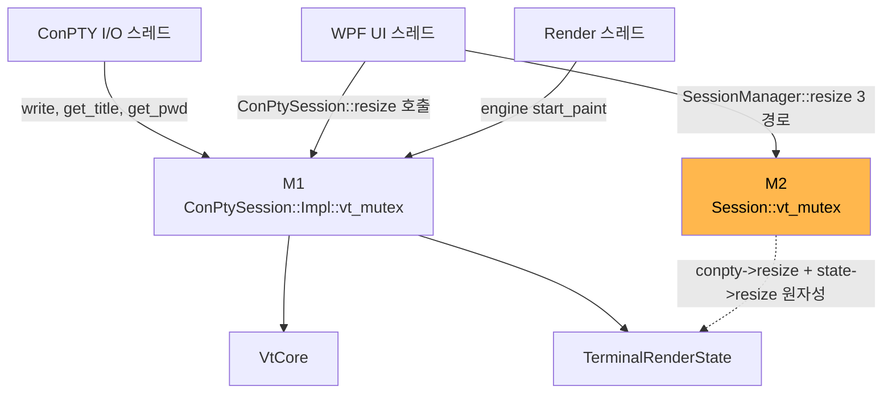
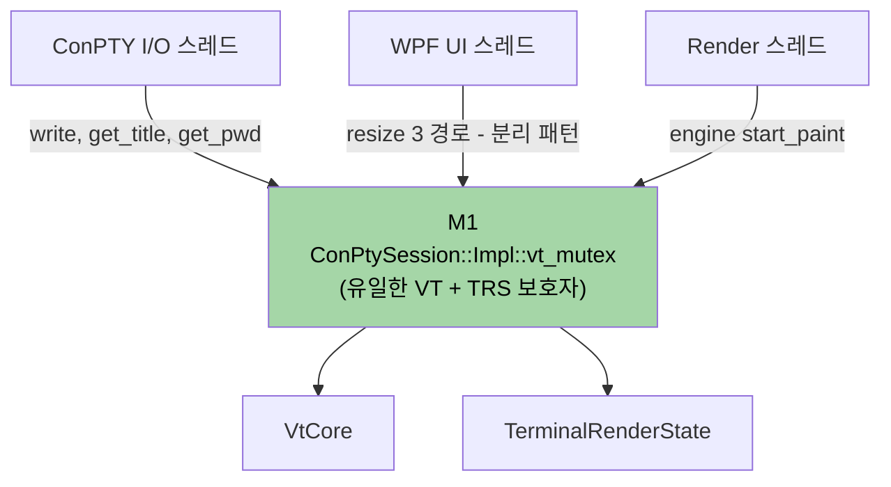
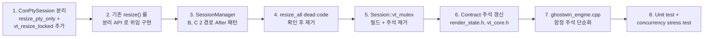

# vt-mutex-redesign Design Document

> **Summary**: `Session::vt_mutex` (M2) 를 제거하고 `ConPtySession::Impl::vt_mutex` (M1) 로 통합. `ConPtySession::resize` 를 PTY syscall 부분과 VT 갱신 부분으로 분리하여 caller 가 M1 아래에서 `vt_core->resize` + `state->resize` 를 묶어 처리하도록 한다.
>
> **Project**: GhostWin Terminal
> **Author**: 노수장
> **Date**: 2026-04-15
> **Status**: **Design 초안** (Plan 갱신: 2026-04-15, ADR-006 개정: 2026-04-15)
> **Plan**: [vt-mutex-redesign.plan.md](../../01-plan/features/vt-mutex-redesign.plan.md)
> **ADR**: [006-vt-mutex-thread-safety.md](../../adr/006-vt-mutex-thread-safety.md)

---

## Executive Summary

| Perspective | Content |
|-------------|---------|
| **Problem** | 자물쇠 3 개 공존 (M1+M2+M3). M2 는 `SessionManager::resize_*` 3 경로 전용 잔존물. ADR 문서와 코드 불일치 + `ghostwin_engine.cpp:139` "NOT Session::vt_mutex" 함정 주석 영구 잔존 |
| **Solution** | M2 제거. `ConPtySession::resize` 를 `resize_pty_only` + `vt_resize_locked` 로 분리. SessionManager 3 경로에서 caller 가 M1 잡고 `vt_resize_locked + state->resize` 를 묶어 호출 |
| **Function/UX Effect** | 사용자 체감 없음. 내부 일관성 개선 |
| **Core Value** | ADR-006 과 코드 간 단일 소스 확보. dual-mutex 분기 주석 삭제 |

---

## 1. 목표와 비목표

### 목표

1. **M2 (`Session::vt_mutex`) 완전 제거**
2. **M1 (`ConPtySession::Impl::vt_mutex`) 가 VT + TerminalRenderState 두 자료구조의 유일한 보호자** 가 되도록 구조 정리
3. **ADR-006 과 코드의 단일 소스 확보** — `ghostwin_engine.cpp:139` 의 "NOT Session::vt_mutex" 함정 주석 제거
4. **회귀 없음** — 기존 unit test 전량 통과 + 새 concurrency stress test 추가

### 비목표

- M3 (`TerminalWindow::Impl::vt_mutex`) 정리 — stand-alone PoC 활용도 확인 후 별도 cycle
- `force_all_dirty()` race (시나리오 D, `ghostwin_engine.cpp:142`) — 기존 부채, 별도
- M1 자체를 다른 동기화 기법 (RwLock, lock-free 큐) 으로 교체 — 원 Placeholder 의 3 후보는 모두 불필요
- ADR-006 의 Alacritty/WezTerm 외부 참조 검증 — 저장소 외 작업

---

## 2. 현재 상태 (Before)

### 2.1 자물쇠 역할



### 2.2 M2 사용처 (정확히 3 곳)

| # | 위치 | 함수 | 호출자 |
|---|------|------|--------|
| A | `session_manager.cpp:328` | `resize_all` | **dead code** |
| B | `session_manager.cpp:396` | `resize_session` | `gw_session_resize`, `gw_surface_create`, `gw_surface_resize` (모두 WPF UI 스레드) |
| C | `session_manager.cpp:414` | `apply_pending_resize` | `SessionManager::activate` (UI 스레드 추정) |

### 2.3 M2 가 현재 보장하는 invariant

```cpp
// Before: SessionManager::resize_session (:392-399 요지)
std::lock_guard lock(sess->vt_mutex);           // M2
sess->conpty->resize(cols, rows);                // 내부에서 M1 획득
sess->state->resize(cols, rows);                 // M2 보호만
```

두 호출 사이에 다른 UI 콜백이 끼어들어 `conpty` 와 `state` 의 cols/rows 가 어긋나는 것을 M2 가 막음. 또한 렌더 스레드 (M1) 가 `state->resize` 도중에 `state` 를 읽는 것도 M2 가 간접 차단 — 다만 이는 **M1 이 아닌 별개 mutex** 이므로 구조적으로는 이상함.

---

## 3. 목표 상태 (After)

### 3.1 자물쇠 역할



### 3.2 After 패턴

```cpp
// After: SessionManager::resize_session
sess->conpty->resize_pty_only(cols, rows);       // ResizePseudoConsole syscall
{
    std::lock_guard lock(sess->conpty->vt_mutex());  // M1
    sess->conpty->vt_resize_locked(cols, rows);      // vt_core->resize + cols/rows 멤버 갱신
    sess->state->resize(cols, rows);                  // 같은 M1 아래
}
```

**핵심 차이**: M1 아래에서 `vt_core->resize` 와 `state->resize` 가 묶여 실행됨. 렌더 스레드가 `start_paint` 에서 M1 을 잡으면 이 묶음 전체가 끝날 때까지 대기 → `cap_cols` / `cell_buffer` 비원자 갱신 도중 진입 불가.

---

## 4. 상세 작업 명세

### 4.1 `ConPtySession` 분리

**파일**: `src/conpty/conpty_session.h`, `src/conpty/conpty_session.cpp`

**신규 public API**:

```cpp
// conpty_session.h (public)
class ConPtySession {
public:
    // ... 기존 ...

    /// PTY syscall only. Does NOT touch VtCore. Caller must NOT hold vt_mutex().
    /// Safe to call from any thread (syscall 자체는 ConPTY 내부 동기화).
    void resize_pty_only(uint16_t cols, uint16_t rows);

    /// Update VtCore + internal cols/rows members.
    /// PRECONDITION: caller MUST hold vt_mutex().
    void vt_resize_locked(uint16_t cols, uint16_t rows);

    /// Backward-compatible wrapper: resize_pty_only + lock + vt_resize_locked.
    /// Exists for callers that do NOT need to atomically pair with other lock-held work.
    void resize(uint16_t cols, uint16_t rows);  // 기존 서명 유지
};
```

**구현** (`conpty_session.cpp:488-508` 재작성):

```cpp
void ConPtySession::resize_pty_only(uint16_t cols, uint16_t rows) {
    COORD size{ static_cast<SHORT>(cols), static_cast<SHORT>(rows) };
    ::ResizePseudoConsole(impl_->hpc.get(), size);
}

void ConPtySession::vt_resize_locked(uint16_t cols, uint16_t rows) {
    // 호출자가 vt_mutex 보유했다고 가정 (assert 불가 — std::mutex 는 owner 질의 못 함)
    impl_->vt_core->resize(cols, rows);
    impl_->cols = cols;
    impl_->rows = rows;
}

void ConPtySession::resize(uint16_t cols, uint16_t rows) {
    resize_pty_only(cols, rows);
    std::lock_guard lock(impl_->vt_mutex);
    vt_resize_locked(cols, rows);
}
```

### 4.2 `SessionManager` 3 경로 패턴 변경

**파일**: `src/session/session_manager.cpp`

| 위치 | 현재 | 변경 |
|------|------|------|
| `:321-337` (`resize_all` 활성 분기) | M2 잡고 `conpty->resize + state->resize` | **dead code 제거** (호출자 0 건) 또는 After 패턴 적용 |
| `:392-399` (`resize_session`) | M2 잡고 `conpty->resize + state->resize` | After 패턴 |
| `:412-418` (`apply_pending_resize`) | M2 잡고 `conpty->resize + state->resize` | After 패턴 |

**예시 — `resize_session` (`:392-399`)**:

```cpp
// Before
{
    std::lock_guard lock(sess->vt_mutex);
    sess->conpty->resize(cols, rows);
    sess->state->resize(cols, rows);
}

// After
sess->conpty->resize_pty_only(cols, rows);
{
    std::lock_guard lock(sess->conpty->vt_mutex());
    sess->conpty->vt_resize_locked(cols, rows);
    sess->state->resize(cols, rows);
}
```

### 4.3 M2 필드 + 주석 정리

**파일**: `src/session/session.h`

| 라인 | 변경 |
|------|------|
| `:8-9` | 주석 "`vt_mutex()`" 참조가 M2 기반이면 M1 으로 수정 |
| `:91` | `SelectionRange` 보호 주석 — "vt_mutex()" → "ConPtySession::vt_mutex()" 로 명시 |
| `:119-120` | `conpty`, `state` 보호 주석 — 동일하게 M1 명시 |
| `:122` | `std::mutex vt_mutex; // ADR-006 extension` **완전 제거** |

### 4.4 Contract 주석 갱신

| 파일:라인 | 현재 | 변경 |
|-----------|------|------|
| `render_state.h:104` (`start_paint`) | "Locks vt_mutex internally" | "Caller passes `ConPtySession::vt_mutex()`. Locks it internally" |
| `render_state.h:112` (`resize`) | "Resize (caller must hold vt_mutex)" | "Resize. PRECONDITION: caller must hold `ConPtySession::vt_mutex()` (same mutex used by `start_paint`)" |
| `render_state.cpp:246` | "Caller contract (unchanged): must hold vt_mutex" | 동일 맥락으로 M1 명시 |
| `vt_core.h:92` | "Caller must hold vt_mutex" | "Caller must hold `ConPtySession::vt_mutex()` (the single VT lock)" |

### 4.5 `ghostwin_engine.cpp` 함정 주석 제거

**파일**: `src/engine-api/ghostwin_engine.cpp`

```cpp
// Before (:139-143)
// Use ConPtySession's internal vt_mutex (NOT Session::vt_mutex).
// I/O thread writes to VT under ConPty mutex; render must use the SAME
// mutex for visibility (design §4.5 — dual-mutex bug fix).
bool dirty = state.start_paint(session->conpty->vt_mutex(), vt);

// After
// Render uses the same vt_mutex as I/O thread — the single VT lock.
bool dirty = state.start_paint(session->conpty->vt_mutex(), vt);
```

### 4.6 Dead code 처리 (`resize_all`)

**파일**: `src/session/session_manager.cpp`, `src/session/session_manager.h`

Agent 1 확인: `resize_all` 의 호출자 0 건. `ghostwin_engine.cpp:400` 주석에도 "old path called `resize_all` … now per-pane via `gw_surface_resize`" 명시.

**결정**: 본 cycle 에서 함께 제거. 이유:
- M2 사용처 3 곳 중 1 곳이라 검증 부담 적음
- 제거하면 After 패턴 적용 경로가 3 → 2 로 줄어 변경 명세 단순화

단, Design review 에서 "dynamic 호출 가능성" 확인 필수.

---

## 5. 구현 순서 (Do phase 체크리스트)



각 단계에서 빌드 성공 + 기존 테스트 통과를 확인. S5 이후부터는 M2 가 참조되는 코드가 있으면 컴파일 에러 — 누락 발견 자동화.

---

## 6. 테스트 계획

### 6.1 기존 테스트 (회귀 방지)

| 테스트 | 현재 | 기대 |
|--------|------|------|
| `tests/VtCoreTests` (10 개) | 통과 | 통과 |
| `tests/PaneNodeTests` (9 개) | 통과 | 통과 |
| `tests/Engine/*` | 통과 | 통과 |
| `GhostWin.Core.Tests` | 통과 | 통과 |

### 6.2 신규 테스트

| 이름 | 목적 | 방식 |
|------|------|------|
| `ConPtySessionResizeSplitTest` | `resize_pty_only` + `vt_resize_locked` 조합이 기존 `resize()` 와 동일 최종 상태인지 | 단위 테스트 — 호출 순서 2 가지 비교 |
| `VtResizeConcurrencyTest` (권장) | resize 중 render 스레드 진입해도 OOB / 부분 적용 잔상 없는지 | 스트레스 — 2 스레드 N 회 반복, ThreadSanitizer |
| `M2RemovalCompileTest` | `Session::vt_mutex` 접근 코드가 남아 있는지 | grep 기반 — CI 에서 `sess->vt_mutex` 등장 시 실패 |

### 6.3 수동 검증

- 창 드래그 리사이즈 중 pane 분할 (Alt+V) → garbage column 없음 확인
- 빠른 반복 리사이즈 (CPU 부하 상태) → 크래시 없음 확인

---

## 7. 마이그레이션 / 호환성

### 7.1 API 호환성

- `ConPtySession::resize(cols, rows)` 기존 서명 **유지**. 호출자 (외부 엔진 API `gw_session_resize` 등) 영향 없음
- `Session::vt_mutex` 는 외부 노출 멤버 — 제거 시 컴파일 영향 확인 필요. 현재 grep 결과 외부 접근 `sess->vt_mutex` 는 `session_manager.cpp` 3 곳 뿐 (Agent 1)

### 7.2 데이터/상태 호환성

없음 (런타임 상태 구조 변경 없음).

---

## 8. 리스크와 완화

| 리스크 | 발생 가능성 | 영향 | 완화 |
|--------|:----------:|:----:|------|
| `ResizePseudoConsole` syscall 을 M1 밖에서 호출 시 ConPTY 내부 cols/rows 와 VtCore cols/rows 가 잠시 불일치 | 중 | 저 (현재 코드도 동일 window 존재) | 기존 동작 유지 + Do phase 에서 I/O 스레드 로그 관찰 |
| `vt_resize_locked` precondition 위반 (caller 가 M1 안 잡고 호출) | 저 | 크래시 | 주석 + 코드 리뷰. ThreadSanitizer 에서 검출 가능 |
| `EngineService.SessionResize` C# dead code 가정 틀림 | 저 | API 동작 변화 없음 (기존 `resize()` 유지) | 영향 없음 — 기존 서명 유지로 자동 커버 |
| M2 제거 후 발견 안 된 사용처 | 저 | 컴파일 에러 (발견 즉시) | S5 단계에서 자동 검출됨 |
| slow path 에서 M1 보유 시간 증가 → I/O 스레드 starvation | 저 | 입력 지연 (일시) | `RenderFrame::reshape` 은 high-water mark 설계라 대부분 fast path. 측정 시 지연 확인 |

---

## 9. 확실하지 않은 부분 — 해소 완료 (2026-04-15 A 단계 재검증)

| 항목 | 해소 결과 | 근거 |
|------|----------|------|
| `ResizePseudoConsole` thread-safety | **M1 밖 호출은 이미 현재 코드의 기정 상태**. 서로 다른 커널 객체 (HPCON vs output_read pipe). ghostty `pty.zig` 도 얇은 래퍼 | `conpty_session.cpp:495` + `external/ghostty/src/pty.zig:462-468` + MSDN Remarks |
| `EngineService.SessionResize` dead 여부 | **이름 혼동 확인** — 실제 이름은 `ResizeSession`. `ResizeSession` 도 호출자 0 건 확정 (9 경로 전수) | `IEngineService.cs:42`, `EngineService.cs:116`, grep 결과 |
| `resize_all` dynamic 호출 | **완전 dead**. 마지막 호출자 제거 commit `e8d7e58` (2026-04-08) diff 확인 | `git show e8d7e58` |

## 9.1 Design 갱신 — 스코프 확장

A 단계 재검증으로 다음이 확정됨:

- `ResizePseudoConsole` 분리 접근은 **신규 race 도입 없는 명시화 리팩토링**
- C# `ResizeSession` + `IEngineService.ResizeSession` 제거 가능 → **본 cycle 에 포함**
- `gw_render_resize` no-op stub 제거는 ABI 호환성 추가 확인 필요 → **별도 cycle**

### 추가 작업 (본 cycle 포함)

| 파일 | 변경 |
|------|------|
| `src/GhostWin.Core/Interfaces/IEngineService.cs:42` | `ResizeSession(uint, ushort, ushort)` 멤버 제거 |
| `src/GhostWin.Interop/EngineService.cs:116` | `ResizeSession` 구현 제거 |

단, `gw_session_resize` native export 자체는 유지 (다른 native 호출자 가능성 확인 필요).

---

## 10. 체크리스트 (Design → Do 진입 전)

- [x] Plan 코드 사실 기반 갱신 완료 (2026-04-15)
- [x] ADR-006 개정 초안 작성 완료 (코드 + Obsidian)
- [x] 본 Design 초안 작성 완료
- [x] 확실하지 않은 3 항목 해소 (A 단계 재검증, §9)
- [x] 스코프 확장 결정 (C# `ResizeSession` 제거 포함)
- [ ] Design review (사용자 승인)
- [ ] `/pdca do vt-mutex-redesign` 진입

---

## 관련 문서

- [Plan](../../01-plan/features/vt-mutex-redesign.plan.md)
- [ADR-006 코드](../../adr/006-vt-mutex-thread-safety.md)
- Obsidian [[ADR/adr-006-vt-mutex]]
- Obsidian [[Backlog/tech-debt]] #1
- Obsidian [[Milestones/pre-m11-backlog-cleanup]] Group 4 #10
