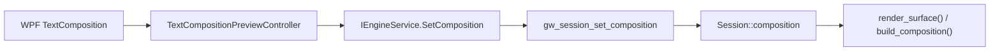

# M-13 IME Backspace 잔상 정리

> **문서 종류**: Debug Summary  
> **작성일**: 2026-04-18  
> **대상 이슈**: 한글 조합 삭제 중 마지막 `ㅎ` preview 잔상  
> **현재 결론**: 증상은 재현되지만, 본질 원인은 아직 확정하지 못함

---

## 1. 문제 요약

현재 WPF 셸에서 한글 조합 preview는 기본적으로 동작한다.  
하지만 `한 -> 하 -> ㅎ -> empty` 순서로 Backspace를 3번 누르면, 마지막 `ㅎ` preview가 화면에 남아 있는 경우가 계속 보고된다.

핵심은 다음 둘 중 하나다.

1. **입력 상태 문제**
   - 실제 composition state가 clear되지 않음
   - 또는 clear된 뒤 다시 같은 preview가 되살아남

2. **렌더 상태 문제**
   - composition state는 clear됐지만, 화면이 이전 overlay를 지우지 못함

현재까지는 1번 가설 위주로 여러 차례 보정했지만, 사용자 수동 테스트 기준으로 문제는 여전히 남아 있다.

---

## 2. 지금까지 완료된 구조 변경

### 2.1 조합 preview 데이터 파이프라인 연결

기존에는 렌더러가 `Session::composition`을 읽을 준비는 되어 있었지만, WPF 쪽에서 조합 문자열을 그 상태로 넘겨주지 않았다.

이를 다음 구조로 연결했다.

### 2.2 설계 정리

| 영역 | 변경 |
|------|------|
| Core | `ImeCompositionPreview`, `ImeCompositionPreviewPolicy` 추가 |
| App | `TextCompositionPreviewController` 추가 |
| MainWindow | WPF 이벤트 중계 + clear/backspace 조정 |
| Interop | `SetComposition(sessionId, text, caretOffset, active)` 추가 |
| Native | `Session::composition`을 `text / caret_offset / active` 구조로 확장 |
| Renderer | composition glyph, underline, caret 렌더 추가 |

### 2.3 렌더 UX 변경

| 항목 | 처리 |
|------|------|
| 조합 중 일반 터미널 cursor | 숨김 |
| composition caret | 조합 문자열 내부 visual width 기준 별도 렌더 |
| wide 문자 | `is_wide_codepoint()` 재사용 |
| surrogate pair | UTF-16 decode helper로 방어 |

---

## 3. Backspace 잔상 문제에 대해 시도한 가설과 처리

### 가설 A. 마지막 Backspace에서 WPF가 빈 composition update를 보내지 않는다

**관측**
- `한 -> 하 -> ㅎ`까지는 업데이트가 오지만
- 마지막 삭제에서 빈 composition update가 빠질 수 있다고 판단

**처리**
- Backspace 직전 preview checkpoint 저장
- `DispatcherPriority.Background`에서 IME 처리 이후 상태 확인
- checkpoint와 현재 preview가 같고, 단독 한글 자모면 clear

**결과**
- 테스트는 통과
- 사용자 실제 테스트에서는 문제 지속

---

### 가설 B. PreviewKeyDown 단계에서 Backspace를 너무 일찍 막고 있었다

**관측**
- 이전 구현은 `Handled=true` 시점이 빨라 IME 자체 삭제 처리 전에 키가 차단될 수 있었다

**처리**
- preview 단계에서는 막지 않음
- bubble 단계에서만 terminal DEL 전송 차단
- 이후 reconcile 수행

**결과**
- 구조는 더 타당해졌음
- 증상은 여전히 남음

---

### 가설 C. WPF IME와 native hidden TSF가 동시에 살아 있어 이중 조합 경로가 있었다

**관측**
- WPF 셸에서 `TextComposition`으로 preview를 처리하면서
- 동시에 native TSF attach/focus도 살아 있으면 같은 세션에 조합이 두 경로로 들어올 수 있음

**처리**
- `MainWindow`에서 native TSF attach/focus 제거
- WPF 셸은 WPF IME 단일 경로만 사용

**결과**
- 구조적으로는 정리됨
- 사용자 실제 테스트에서는 증상 지속

---

### 가설 D. final Backspace 뒤에 IME가 같은 `ㅎ` preview를 늦게 한 번 더 replay한다

**관측**
- clear 직후 동일 preview가 재적용되는 시퀀스를 가정

**처리**
- controller에 one-shot suppression 추가
- final Backspace로 clear된 동일 preview 1회는 무시
- 새 일반 입력이 시작되면 suppression 해제

**결과**
- 테스트는 통과
- 사용자 실제 테스트에서는 증상 지속

---

## 4. 현재 코드 상태

### 핵심 파일

| 파일 | 의미 |
|------|------|
| `src/GhostWin.App/MainWindow.xaml.cs` | WPF 키/조합 이벤트 진입점 |
| `src/GhostWin.App/Input/TextCompositionPreviewController.cs` | preview 상태 적용, clear, backspace reconcile |
| `src/GhostWin.Core/Input/ImeCompositionPreview.cs` | preview 정책 |
| `src/GhostWin.Interop/EngineService.cs` | C# -> native composition bridge |
| `src/engine-api/ghostwin_engine.cpp` | 렌더 루프에서 composition overlay 적용 |
| `src/renderer/quad_builder.cpp` | composition glyph/background/underline/caret 생성 |
| `src/session/session.h` | native composition 상태 |

### 테스트 상태

| 테스트 | 상태 |
|--------|------|
| `GhostWin.Core.Tests / ImeCompositionPreviewPolicyTests` | 통과 |
| `GhostWin.App.Tests / TextCompositionPreviewControllerTests` | 통과 |
| `MSBuild GhostWin.sln /p:Configuration=Debug /p:Platform=x64` | 통과 |

중요한 점은, **현재 통과하는 테스트는 mostly controller/policy 수준**이라는 것이다.  
즉, 실제 사용자 증상과 가장 가까운 WPF runtime event sequence 또는 렌더 최종 화면 상태는 아직 자동 검증으로 잡지 못하고 있다.

---

## 5. 아직 확정되지 않은 것

### 5.1 입력 쪽 미확정

아래 중 무엇이 실제로 일어나는지 아직 로그로 확정하지 못했다.

1. 마지막 Backspace 뒤에 WPF `TextCompositionUpdate`가 실제로 어떻게 들어오는가
2. clear 이후 같은 `compositionText='ㅎ'` 이벤트가 다시 오는가
3. `TextInput` final event와 preview event의 실제 순서가 OS/IME 조합마다 같은가

### 5.2 렌더 쪽 미확정

아래도 아직 직접 증명하지 못했다.

1. native `Session::composition.clear()`는 실제로 호출되는가
2. clear 후 `force_all_dirty()`가 해당 surface를 다시 그리게 하는가
3. 마지막 프레임에서 quad count가 0일 때, swapchain이 이전 overlay를 남기고 있지는 않은가

이 마지막 항목은 특히 중요하다.  
현재 `render_surface()`는 `count > 0`일 때만 `upload_and_draw()`를 호출한다.  
만약 조합 overlay가 사라지는 순간에 다시 그릴 셀이 0이면, **상태는 clear됐는데도 이전 프레임이 그대로 남는 렌더 잔상**일 수 있다.

---

## 6. 지금 시점의 판단

현재까지의 수정은 대부분 **입력 이벤트 해석과 상태 관리 보정**이었다.  
이 방향은 필요한 작업이었지만, 사용자 기준으로 문제가 반복된다는 것은 다음 둘 중 하나를 의미한다.

| 가능성 | 설명 |
|--------|------|
| 가설 1 | 실제 원인이 WPF 조합 이벤트 시퀀스가 아니라 renderer clear/present 쪽에 있음 |
| 가설 2 | 실제 이벤트 시퀀스가 우리가 가정한 것보다 더 다르고, 현재 테스트가 그 시퀀스를 재현하지 못함 |

즉, 지금부터는 추측성 보정이 아니라 **런타임 증거 확보**가 먼저다.

---

## 7. 다음 조사 우선순위

### 1순위: 경계별 런타임 로그 추가

아래 경계에서 같은 Backspace 시나리오를 한 번 추적해야 한다.

| 경계 | 확인할 값 |
|------|-----------|
| WPF `OnTerminalTextComposition` | `CompositionText`, `Text`, event 종류 |
| WPF `OnTerminalTextInput` | final text |
| controller | 현재 preview, checkpoint, clear 여부 |
| native `gw_session_set_composition` | text, active, caret_offset |
| render loop | composition_visible, count, present 여부 |

### 2순위: clear 프레임 강제 present 여부 확인

특히 아래를 검토해야 한다.

- composition이 clear된 프레임에서 quad count가 0이어도 clear/present가 필요한지
- 현재 `count > 0` 조건이 잔상을 만들 수 있는지

### 3순위: 실제 재현 시퀀스를 테스트로 고정

현재 controller 테스트는 있지만, 다음은 아직 없다.

- WPF event sequence 기반 통합 테스트
- render clear/present 관련 회귀 테스트

---

## 8. 정리

현재까지의 작업으로 다음은 확실하다.

1. 한글 조합 preview 기본 경로는 연결되었다
2. 구조는 이전보다 훨씬 명확해졌다
3. 영문 일반 입력 경로와 preview 경로는 분리되었다
4. Backspace 잔상 문제는 아직 해결되지 않았다
5. 이제는 추가 추측보다 **입력 이벤트 경계 로그 + 렌더 clear 검증**이 우선이다

이 문서는 “무엇을 바꿨는가”보다 “무엇이 아직 미확정인가”를 정리하기 위한 중간 정리다.
