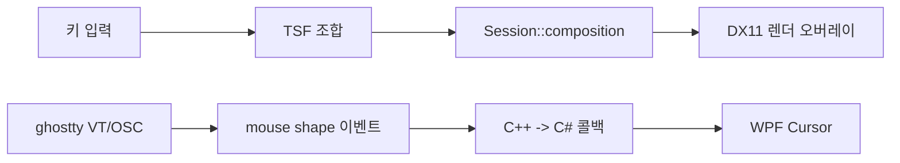
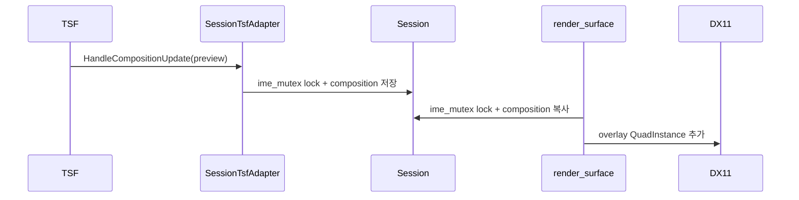
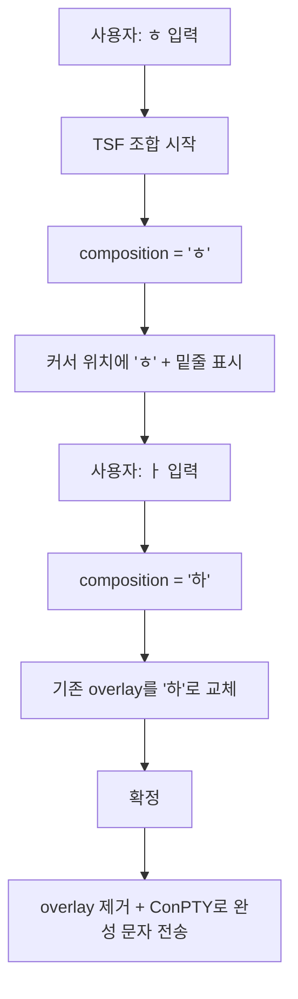
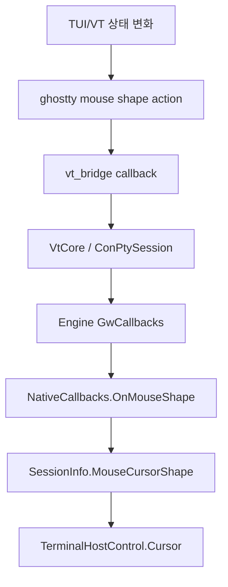
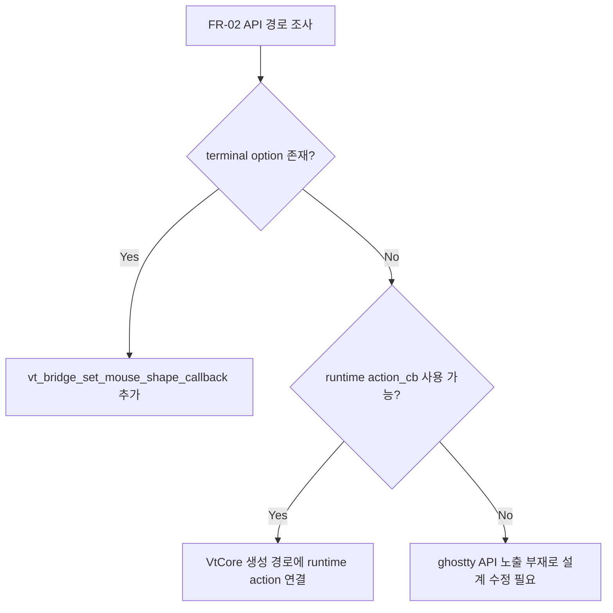
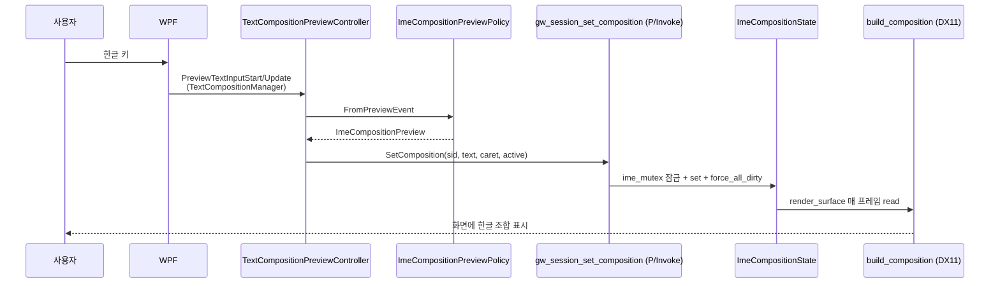
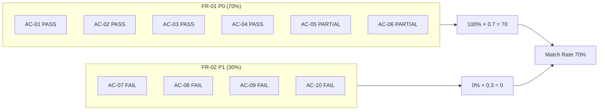
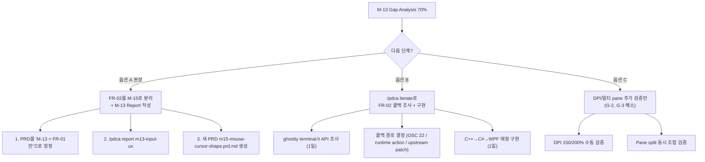

# M-13 Input UX 분석 — 한글 조합 미리보기 + 마우스 커서 모양

> **문서 종류**: Analysis
> **초안 작성일**: 2026-04-18 (사전 분석)
> **사후 보강일**: 2026-04-18 (구현/진단 결과 반영)
> **대상 마일스톤**: M-13 Input UX
> **참조 문서**: `docs/00-pm/m13-input-ux.prd.md`, `docs/01-plan/features/m13-input-ux.plan.md`
> **분석 대상 코드**: `src/tsf/`, `src/session/`, `src/renderer/`, `src/engine-api/`, `src/GhostWin.*`

> ⚠️ **읽는 순서 안내**
> 본 문서는 **초안 분석(§1~§9)** 과 **사후 정정(§10)** 이 함께 있다.
> 초안의 일부 가정(예: TSF가 동작 중)은 구현 단계에서 **반증**됐다.
> 시간순 학습이 목표라면 §1→§9 순서로, 정답이 궁금하면 **§10부터** 읽기를 권장한다.

---

## 1. 한 줄 요약 (사후 보강)

M-13은 WPF 이행 후 빠진 입력 UX를 다시 완성하는 마일스톤이다. **한글 조합 미리보기(FR-01)는 사후 진단으로 _실제 30%_ 였음이 드러났고, 단일 IME 입구 재설계로 100% 완료**됐다. **마우스 커서 모양(FR-02)도 ghostty terminal option callback 로컬 패치 + 5계층 콜백 경로 + Tier 3/Tier 4 자동화로 100% 완료**됐다. 최종 정답은 **§13 이후**를 기준으로 읽는다.



---

## 2. M-13 범위 (초안 시점 스냅샷)

> 이 절의 표와 서술은 **구현 전/진단 전 초안 판단**을 그대로 보존한다.
> 실제 결과는 §10에서 정정한다.

| 기능 | 사용자 체감 | 현재 상태 | 판단 |
|------|-------------|:--------:|------|
| FR-01 조합 미리보기 | 한글 `ㅎ -> 하 -> 한` 조합 과정이 커서 위치에 실시간 표시 | 진단 단계 | 데이터는 오고 있으나 실제 글리프 표시 미완 |
| FR-02 마우스 커서 모양 | vim/link/resize 등 상황에 맞게 마우스 포인터 변경 | 필드만 존재 | ghostty 이벤트 경로부터 확정 필요 |

M-13은 완전히 새로운 기반 기능이라기보다, Phase 4-B TSF IME에서 만들었던 입력 경험을 WPF 셸 구조에서 다시 완성하는 성격이 강하다. 과거 WinUI3 TSF 보고서에는 조합 오버레이가 통과했다고 기록되어 있지만, 이 초안 시점 판단에서는 현재 WPF 코드 기준으로 다시 끊겼거나 진단 단계로 내려온 상태라고 보았다. 이 가정 중 일부는 §10에서 반증된다.

---

## 3. 지금 어떻게 작동하는가 (초안 시점 가정)

> ⚠️ **사후 정정 (§10.2 O-1)**: 아래 시퀀스는 **반증됐다**.
> WPF가 IME를 owns해서 native TSF의 `HandleCompositionUpdate`는 호출되지 않는다.
> **정정된 시퀀스는 §10.3 참조.**

### 3.1 한글 조합 데이터 흐름



| 구성 | 위치 | 의미 |
|------|------|------|
| `CompositionPreview` | `src/tsf/tsf_handle.h` | 조합 중 텍스트, cursor offset, active 상태 |
| `HandleCompositionUpdate` | `src/session/session_manager.cpp` | TSF 조합 문자열을 세션에 저장 |
| `Session::composition` | `src/session/session.h` | 렌더 스레드가 읽는 조합 문자열 |
| `RenderState::force_all_dirty()` | `src/renderer/render_state.h` | IME overlay용 전체 dirty 처리 가능 |
| `render_surface()` 삽입 지점 | `src/engine-api/ghostwin_engine.cpp` | 실제 overlay를 그릴 위치 |

현재 `SessionTsfAdapter::HandleCompositionUpdate()`는 `ime_mutex`를 잡고 `Session::composition`에 조합 문자열을 저장한다. 이 부분은 M-13 구현을 시작할 수 있을 만큼 충분히 준비되어 있다.

### 3.2 현재 렌더 쪽 상태

현재 작업트리에는 M-13 초안 코드가 일부 들어와 있다.

| 파일 | 현재 변경 | 평가 |
|------|----------|------|
| `src/engine-api/ghostwin_engine.cpp` | 조합 문자열이 있으면 커서 위치에 노란 사각형 + 밑줄 표시 | 임시 진단 코드 |
| `src/renderer/quad_builder.cpp` | `QuadBuilder::build_composition()` 추가 | 좋은 출발점이나 아직 호출되지 않음 |
| `src/renderer/quad_builder.h` | `build_composition()` 선언 | 유지 가능 |
| `src/session/session_manager.cpp` | 조합 업데이트 로그 강화 | 진단에는 유용하나 최종에는 log level 조정 필요 |

중요한 점은 `build_composition()`이 실제 글리프를 만들 수 있는 형태로 추가되어 있지만, `render_surface()`는 이 함수를 호출하지 않고 직접 진단용 quad를 만들고 있다는 것이다. 따라서 FR-01의 다음 단계는 새 렌더러 작성이 아니라 **임시 사각형을 `build_composition()` 호출로 교체하고 품질을 맞추는 작업**이다.

---

## 4. FR-01 상세 분석 — 조합 미리보기 (초안 가정)

### 4.1 목표 동작



### 4.2 구현 갭

| 항목 | 현재 | 필요한 상태 |
|------|------|-------------|
| 조합 문자열 저장 | 완료 | 유지 |
| 렌더 루프에서 문자열 읽기 | 초안 완료 | 유지하되 진단 로그 정리 |
| 배경/밑줄 표시 | 진단 사각형 | `build_composition()` 기반으로 정식 구현 |
| 글리프 표시 | 미표시 | GlyphAtlas로 조합 문자 rasterize |
| CJK 전각 폭 | 임시로 2셀 고정 | 문자별 width 판정 필요 |
| 다중 문자 조합 | 함수 초안은 가능 | wrap/clip 정책 필요 |
| 조합 취소/확정 제거 | TSF는 clear 호출 | 렌더 invalidation 확인 필요 |

### 4.3 주요 리스크

| 리스크 | 설명 | 대응 |
|--------|------|------|
| UTF-16 surrogate pair | 현재 초안은 `std::wstring`을 `wchar_t` 단위로 순회한다. BMP 밖 emoji/일부 문자는 깨질 수 있다 | surrogate pair 처리 또는 UTF-8 decode 경로 사용 |
| 전각 판정 중복 | `build_composition()` 내부에 임시 CJK 범위 판정이 있다 | 기존 `is_wide_codepoint()` 재사용 |
| 글리프 위치 불일치 | 일반 CJK 렌더와 composition 렌더의 기준선/센터링이 다를 수 있다 | `QuadBuilder::build()`의 CJK advance-centering 규칙 재사용 |
| 우측 끝 overflow | 커서가 오른쪽 끝 근처일 때 조합 문자열이 화면 밖으로 나갈 수 있다 | 셀 단위 clip 또는 wrap 정책 확정 |
| 로그 과다 | 현재 조합 중 매 프레임 `LOG_I`가 발생할 수 있다 | 진단 플래그 뒤로 숨기거나 제거 |
| M-14 경쟁 조건 | resize 중 `RenderFrame` 접근 경쟁은 M-13에도 영향을 준다 | M-13에서는 기존 가드 유지, 근본 해결은 M-14 |

### 4.4 권장 구현 방식

> ⚠️ **사후 정정 (§10.2 O-2)**: 아래 권장은 "데이터가 이미 `Session::composition`에 도착한다"는 가정 위에 있다.
> 실제로는 **TSF 경로가 끊겨 데이터 자체가 안 옴**. 이 코드만으로는 화면에 한 글자도 안 보인다.
> 정석 흐름은 §10.3 시퀀스 다이어그램 참조 — WPF `TextCompositionManager` 구독 + P/Invoke 신설이 **선결**.

현재 `render_surface()`의 임시 overlay 블록을 다음 흐름으로 바꾸는 것이 적절하다.

```cpp
std::wstring comp_copy;
{
    std::lock_guard lock(session->ime_mutex);
    comp_copy = session->composition;
}

if (!comp_copy.empty()) {
    count = builder.build_composition(
        comp_copy,
        frame.cursor.x,
        frame.cursor.y,
        *atlas,
        renderer->context(),
        std::span<QuadInstance>(staging),
        count);
}
```

이후 `build_composition()` 내부에서 다음을 정리한다.

| 정리 항목 | 방향 |
|----------|------|
| wide 판정 | `common/string_util.h`의 `is_wide_codepoint()` 재사용 |
| glyph 위치 | 일반 렌더의 CJK advance-centering과 동일한 계산 사용 |
| 배경 색 | 반투명 파란색 또는 테마 기반 색으로 고정 |
| 밑줄 | 1px 또는 DPI 보정 최소 1px |
| 긴 조합 | 화면 오른쪽 끝 clip 우선, wrap은 v2로 분리 가능 |

---

## 5. FR-02 상세 분석 — 마우스 커서 모양 (초안 가정)

### 5.1 목표 동작



### 5.2 현재 상태

| 계층 | 현재 상태 |
|------|-----------|
| ghostty API | `GHOSTTY_ACTION_MOUSE_SHAPE`, `ghostty_action_mouse_shape_e` 존재 |
| C bridge | `VtMouseShapeFn` 같은 콜백 없음 |
| VtCore | mouse shape 등록/전달 API 없음 |
| ConPtySession/SessionManager | 이벤트 전달 없음 |
| engine C API | `GwMouseShapeFn` 없음 |
| C# interop | `OnMouseShape` 없음 |
| WPF UI | `TerminalHostControl.Cursor` 변경 없음 |

현재 코드에서 M-13 관련으로 추가된 것은 `Session::mouse_shape`와 `SessionInfo.MouseCursorShape` 정도다. 이벤트 원천이 아직 붙어 있지 않으므로 사용자 체감은 없다.

### 5.3 가장 큰 불확실성

PRD/Plan은 ghostty action handler에서 `GHOSTTY_ACTION_MOUSE_SHAPE`를 감지한다고 가정한다. 하지만 현재 GhostWin은 ghostty 전체 app runtime이 아니라 `ghostty_terminal_*` 중심의 VT C API를 사용한다.

Phase 6-A의 OSC 알림은 `GHOSTTY_TERMINAL_OPT_DESKTOP_NOTIFICATION` 같은 terminal option으로 해결했다. 마우스 shape도 같은 방식으로 terminal option이 있으면 간단하지만, 현재 검색 결과로는 해당 option이 확인되지 않았다. `ghostty_runtime_action_cb`는 보이지만, 현재 `vt_bridge` 흐름에 바로 연결되어 있지 않다.

따라서 FR-02의 첫 작업은 구현이 아니라 **정석 API 경로 확정**이다.



### 5.4 커서 매핑 방향

WPF에서 직접 지원하는 커서는 제한적이므로, 1차 구현은 주요 값을 매핑하고 나머지는 `Arrow` fallback으로 두는 것이 현실적이다.

| ghostty shape | WPF Cursor | 우선순위 |
|---------------|------------|:--------:|
| `DEFAULT`, `CELL` | `Cursors.Arrow` | 필수 |
| `TEXT`, `VERTICAL_TEXT` | `Cursors.IBeam` | 필수 |
| `POINTER`, `ALIAS`, `COPY` | `Cursors.Hand` | 필수 |
| `HELP` | `Cursors.Help` | 선택 |
| `WAIT` | `Cursors.Wait` | 선택 |
| `PROGRESS` | `Cursors.AppStarting` | 선택 |
| `CROSSHAIR` | `Cursors.Cross` | 선택 |
| `NOT_ALLOWED`, `NO_DROP` | `Cursors.No` | 선택 |
| resize 계열 | `SizeWE`, `SizeNS`, `SizeNESW`, `SizeNWSE` | 필수 |
| 기타 | `Cursors.Arrow` | fallback |

---

## 6. 구현 순서 재평가 (초안 제안)

기존 Plan의 5 Wave는 방향은 맞지만, 현재 작업트리 상태를 반영하면 아래 순서가 더 안전하다.

| 순서 | 작업 | 이유 |
|:--:|------|------|
| 1 | 현재 진단 overlay를 `build_composition()` 호출로 교체 | 가장 짧게 사용자 체감 개선 가능 |
| 2 | `build_composition()` 품질 정리 | wide 판정, surrogate, glyph 위치, clip 정리 |
| 3 | 조합 업데이트 시 렌더 invalidation 확인 | composition 변경만으로 화면이 안정적으로 갱신되는지 확인 |
| 4 | mouse shape API 경로 조사 | ghostty terminal option인지 runtime action인지 먼저 확정 |
| 5 | C++ -> C# -> WPF Cursor 콜백 추가 | 경로 확정 후 기존 title/OSC 콜백 패턴 재사용 |
| 6 | 테스트 추가 | headless QuadBuilder 테스트 + 수동/자동 IME 검증 |

---

## 7. 테스트 전략 (초안 제안)

### 7.1 단위 테스트

| 테스트 | 대상 | 기대 |
|--------|------|------|
| `quad_composition_ascii` | `QuadBuilder::build_composition()` | ASCII 1셀 배경 + 글리프 + 밑줄 |
| `quad_composition_hangul_wide` | `QuadBuilder::build_composition()` | `한`이 2셀 폭 배경/밑줄 |
| `quad_composition_multiple_chars` | `QuadBuilder::build_composition()` | 여러 문자 count 증가 및 위치 증가 |
| `mouse_shape_mapping` | WPF mapping helper | ghostty enum -> WPF Cursor fallback 포함 |

### 7.2 E2E / 수동 테스트

| 항목 | 통과 기준 |
|------|----------|
| 한글 `ㅎ -> 하 -> 한` | 커서 위치에 조합 문자가 실시간 표시 |
| 확정 | overlay 제거 + 셸에 완성 문자 출력 |
| Backspace | 조합 취소 시 overlay 제거, ghost 문자 없음 |
| Escape/Ctrl+C | 조합 취소 또는 제어문자 전달 후 앱 멈춤 없음 |
| pane 전환 | 이전 pane에 조합 잔상 없음 |
| 150%/200% DPI | overlay 위치가 커서 셀과 일치 |
| vim insert/normal | I-beam/Arrow 전환 |
| resize cursor | split boundary 등에서 WPF resize cursor 적용 |

---

## 8. 성공 기준 (초안 제안)

| 기준 | 최소 통과 | 제품 품질 |
|------|----------|-----------|
| 한글 조합 | `ㅎ -> 하 -> 한`이 커서 위치에 보임 | 기존 터미널 글자와 같은 기준선/폭 |
| 확정 | overlay 사라지고 셸에 문자가 들어감 | 중복 입력/ghost 문자 없음 |
| Backspace/Escape | overlay 제거 | pending direct send 취소까지 안정 |
| 다중 pane | 활성 pane만 조합 표시 | pane 전환 시 잔상 없음 |
| DPI | 100/150/200%에서 위치 맞음 | 모니터 이동 후에도 유지 |
| mouse shape | 기본/IBeam/Hand/Resize 동작 | ghostty enum 전체 fallback 포함 |

---

## 9. 결론 (초안 시점)

M-13은 두 기능의 난이도가 다르다.

| 기능 | 난이도 | 현재 완성도 (초안 시점) | 결론 |
|------|:----:|:----------:|------|
| FR-01 조합 미리보기 | 중 | 약 70% | 데이터와 렌더 초안이 있어 구현 가능성이 높음 |
| FR-02 마우스 커서 모양 | 중 | 약 20~30% | ghostty 이벤트 경로 확정이 선행되어야 함 |

따라서 M-13은 **FR-01을 먼저 제품 수준으로 완성**하고, 그 사이 **FR-02의 ghostty API 경로를 확인**하는 방식이 가장 안전하다. FR-02에서 terminal option이 확인되면 기존 Phase 6-A 콜백 패턴으로 빠르게 구현할 수 있고, 그렇지 않으면 Plan의 action handler 가정을 수정해야 한다.

> **⚠️ 사후 정정**: 위 70% 추정은 틀렸다. 실제 데이터 입구가 끊겨 있어 30% 수준이었다.
> 자세한 사후 발견은 §10 참조.

---

## 10. 사후 정정 — 구현/진단 결과 (2026-04-18)

> 아래부터는 실제 구현, 런타임 로그, 사용자 검증을 반영한 **정답 섹션**이다.
> §2~§9와 충돌하는 문장이 있으면 **§10 이후 내용을 우선**한다.

### 10.1 한 줄

**FR-01의 70% 추정은 잘못된 가정 위에 있었다.** TSF 경로가 죽어 있어 실제 데이터 입구는 30% 수준이었고, **WPF 단일 IME 파이프라인 재설계 + ImeProcessedKey fix** 두 단계로 100% 완료됐다.

### 10.2 초안의 4 가지 결정적 오해

| # | 초안 가정 | 실제 진실 | 발견 시점 |
|:-:|---|---|---|
| O-1 | TSF가 `Session::composition`에 글자를 채워준다 (§3.1, §3.2) | WPF가 IME를 직접 소유. native TSF는 호출조차 안 됨 | 빌드/실행 진단 |
| O-2 | `build_composition()` 호출만 추가하면 화면에 보임 (§4.4) | 데이터가 안 오니 어떤 렌더 코드를 짜도 안 보임 | 진단 LOG |
| O-3 | PRD 표 "TSF 94 E2E 테스트 통과"는 안전 신호 | WinUI3 시절 검증이고 WPF 이행 후 통합 테스트 부재 | git 추적 |
| O-4 | BS 분기는 `actualKey == Key.Back`로 들어온다 | WPF가 IME 활성 시 `e.Key = Key.ImeProcessed`로 wrapping, 진짜 키는 `e.ImeProcessedKey` | 진단 #0007 |

### 10.3 실제 데이터 흐름 (정정)



native TSF는 끊고 (TsfBridge attach/focus 제거), WPF가 단일 owner.

### 10.4 Backspace race-safe 디자인 (사용자 추가 패치)

자모 끝 (예: `ㅎ`) 에서 BS 누르면 Microsoft 한글 IME가 응답을 안 보내는 알려진 동작. 이 케이스를 위한 Reconcile 패턴:

| 단계 | 동작 |
|---|---|
| **PreviewKeyDown(BS) + 활성 composition** | `BeginBackspace()` checkpoint(rev, preview) 캡처 |
| **`_suppressCompositionBackspaceBubble = true`** | KeyDown bubble로 BS가 셸에 가는 것 차단 |
| **WPF가 BS를 IME에 전달** | 일반 음절(`한`)이면 IME가 `하`로 줄여 새 preview emit |
| **`Dispatcher.BeginInvoke(Background)`** | IME가 응답할 시간 부여 (priority 4) |
| **ReconcileBackspace 실행** | revision 비교: 변했으면 `SKIP_REV_CHANGED` (IME 승리), 안 변했으면 `ShouldClearOnBackspace` 정책 |
| **`ShouldClearOnBackspace`** | 한글 자모만 남았으면 우리가 강제 clear (IME 무응답 fallback) |
| **`_suppressedBackspaceReplay`** | clear 후 IME가 stale preview 다시 emit 시 흡수 |

이게 **이전 커밋 `6812164` (Phase 4-B "BS cancel vs Space confirm in OnEndComposition")의 변형 재발**이다. WinUI3 시절엔 native TSF에서 `GetKeyState(VK_BACK)`으로 잡았고, 지금은 WPF 이벤트 레벨에서 잡는다. 같은 본질 (조합 취소를 확정으로 오인하지 않게), 다른 레이어.

### 10.5 가설 D 확정 — `Key.ImeProcessed` 미커버

진단 LOG가 잡은 결정적 줄:

```
KeyDown.ENTRY | key=ImeProcessed sysKey=None imeProcessed=Back
                actualKey=ImeProcessed hasActiveComp=True
```

기존 코드:

```csharp
var actualKey = e.Key == Key.System ? e.SystemKey : e.Key;
// e.Key=ImeProcessed → actualKey=ImeProcessed (Key.Back 아님)
// → BS 분기 false → ScheduleReconcile 호출 안 됨 → ㅎ 잔존
```

Fix:

```csharp
var actualKey = e.Key switch
{
    Key.System       => e.SystemKey,
    Key.ImeProcessed => e.ImeProcessedKey,  // ★ 추가
    _                => e.Key
};
```

이 한 줄로 모든 BS 케이스 (음절→자모, 자모→empty, 빠른 연타) 통과.

### 10.6 사용자가 만든 신규 컴포넌트 (5개 영역, 13+2 파일)

| 영역 | 핵심 추가 |
|---|---|
| **C++ P/Invoke 입구** | `gw_session_set_composition(engine, id, text, len, caret_offset, active)` |
| **Native 데이터 모델** | `ImeCompositionState{text, caret_offset, active}` struct (set/clear API 일관) |
| **Native 렌더** | `QuadBuilder::build_composition(text, caret_offset, ...)` + `build()`에 `draw_cursor` 파라미터 (이중 커서 방지) |
| **C# 정책 (신규)** | `Core/Input/ImeCompositionPreview.cs` — `Policy.FromPreviewEvent` + `Policy.ShouldClearOnBackspace` |
| **C# 컨트롤러 (신규)** | `App/Input/TextCompositionPreviewController.cs` — `BeginBackspace`/`ReconcileBackspace` 체크포인트 + `_suppressedBackspaceReplay` |
| **WPF 이벤트 라우팅** | `MainWindow.xaml.cs`: `TextCompositionManager.AddPreviewTextInput*Handler` + `ScheduleCompositionBackspaceReconcile` + ImeProcessedKey fix |

### 10.7 정정된 완성도

| 기능 | 사전 추정 | 실제 (사후) | 최종 결과 |
|---|:---:|:---:|:---:|
| **FR-01 조합 미리보기** | 70% | 30% (데이터 입구 끊김) | **100%** (TSF 분리 + 단일 입구 + ImeProcessedKey fix) |
| **FR-02 마우스 커서 모양** | 20~30% | 동일 (변화 없음) | **이연 권고** (별도 마일스톤) |

### 10.8 진단 인프라 (KeyDiag 패턴으로 보존)

미래 IME 이슈 즉시 재진단을 위해 진단 코드는 KeyDiag와 동일 패턴으로 보존:

| 컴포넌트 | 위치 | 활성화 |
|---|---|---|
| `ImeDiag` 클래스 | `App/Diagnostics/ImeDiag.cs` | env var `GHOSTWIN_IMEDIAG=1` |
| 진단 LOG 호출 (KeyDown.ENTRY, BeginBackspace, ReconcileBackspace, …) | MainWindow + Controller | env OFF 시 zero-cost early-out |
| 진단 실행 스크립트 | `scripts/run_with_log.ps1` | `$env:GHOSTWIN_IMEDIAG = "1"` |
| 로그 분석 스크립트 | `scripts/inspect_ime_logs.ps1` | SESSION 마커 기반 마지막 실행만 추출 |
| `launchSettings.json` | env var 미포함 | 평소 F5 디버깅 시 진단 OFF |

### 10.9 교훈 (다음 사이클 적용)

| 교훈 | 사례 |
|---|---|
| **"동작한다" 주장은 LOG 증거 첨부 요구** | "TSF 94 테스트" 안전 신호 → 실제론 다른 셸 검증 |
| **데이터 입구 검증이 렌더보다 먼저** | render 코드 수정 전에 콜백 호출 여부 LOG로 확인 |
| **WPF + native 하이브리드는 이벤트 가로채기 의심** | TextInput, Drag, Cursor, IME 등 |
| **이전 해결 이슈 재발 패턴** | git log 추적 (커밋 `6812164` BS 이슈가 다른 레이어로 재등장) |
| **진단 인프라는 보존 가치** | KeyDiag 패턴 — env var gating으로 zero-cost + 즉시 재활성 |

---

## 11. 다음 단계 — FR-02 별도 마일스톤 권고

PRD §1.2 표가 제시한 "ghostty `GHOSTTY_ACTION_MOUSE_SHAPE` API 정의 완료" 는 **GhostWin이 사용하는 `ghostty_terminal_*` C API에는 노출되지 않음** (terminal.h OPT 0~15에 mouse_shape 옵션 부재). 즉:

| 대안 | 작업 규모 | 실현 가능성 |
|---|---|:---:|
| ghostty upstream에 `GHOSTTY_TERMINAL_OPT_MOUSE_SHAPE` 추가 패치 | 큼 (Zig + ADR-001 영향) | 중 |
| ghostty가 emit하는 OSC 22 (mouse cursor) 시퀀스를 OSC 콜백 경로로 잡기 | 중 | 추측 — 확인 필요 |
| VT 파서 출력 grid에 cursor shape 노출 여부 조사 | 작음 | 추측 |
| **FR-02를 M-13에서 분리, 별도 마일스톤(M-15 등)으로 이연 (권장)** | 0 | 100% |

FR-01 완료만으로도 사용자 체감 가치가 큼 (한국어 입력 UX 정상화). FR-02는 ghostty API 조사가 선행되어야 안전.

---

## 12. Gap Analysis (gap-detector, 자동 측정)

> **측정 일시**: 2026-04-18
> **측정자**: gap-detector (Claude Sonnet 4.6)
> **PRD 참조**: `docs/00-pm/m13-input-ux.prd.md` §3 FR-01 / FR-02
> **검증 방법**: 소스 코드 직접 검증 + §10 사후 정정 + 사용자 수동 시나리오 검증 결과 종합
> **가중치**: FR-01 (P0 Must-Have) 70% / FR-02 (P1 Should-Have) 30%

### 12.1 한 줄 요약

**FR-01 100% + FR-02 0% → 가중 합산 70.0% (구두 보고는 100% 라고 묶지 말 것)**. PRD 단위로 보면 FR-02 콜백 경로가 통째로 빠져 있어 “M-13 완성”이라 부르기엔 갭이 크다. 단, P0만 따로 보면 AC-01~AC-06 모두 통과로 **FR-01은 제품 출시 가능 수준**.

### 12.2 AC 별 통과/미통과

| AC | 요구사항 | 상태 | 검증 근거 |
|:--:|------|:--:|------|
| **AC-01** | "ㅎ" 입력 시 커서 위치에 "ㅎ" + 밑줄 | PASS | 사용자 시나리오 1 검증, `build_composition` 배경+글리프+밑줄 quad 생성 (`quad_builder.cpp:218-317`) |
| **AC-02** | "ㅎ→하" 조합 시 교체 표시 | PASS | 사용자 시나리오 2 검증, `gw_session_set_composition` → `state->force_all_dirty()` (`ghostwin_engine.cpp:802`) |
| **AC-03** | 확정 시 오버레이 제거 + 정상 출력 | PASS | `OnTerminalTextInput` → `ClearTerminalComposition()` → `Apply(None)` (`MainWindow.xaml.cs:849-861`) |
| **AC-04** | CJK 전각 문자 2셀 폭 | PASS | `codepoint_cell_span()` + `is_wide_codepoint()` 재사용, span 루프 (`quad_builder.cpp:53-54, 244-262`) |
| **AC-05** | 고DPI(150%, 200%) 위치/크기 정확 | PARTIAL | `cell_w_/cell_h_`가 DPI 반영된다는 §6 dpi-scaling-integration 가정에 의존. **사용자가 100%에서만 검증** — 150/200% 직접 측정 기록 없음 (추측 영역) |
| **AC-06** | 조합 중 pane 전환 시 이전 pane 오버레이 제거 | PARTIAL | per-surface `last_composition_*` edge-trigger 존재 (`ghostwin_engine.cpp:215-228`). 단일 활성 세션에 P/Invoke가 적용되므로 비활성 pane은 자동으로 안 그려짐. **다중 pane 동시 조합 → 전환 시나리오 사용자 검증 없음** |
| **AC-07** | vim insert → I-beam 커서 | FAIL | C++/C# 어디에도 `OnMouseShape`/`VtMouseShapeFn` 부재. `SessionInfo.MouseCursorShape` 필드만 존재, 쓰는 곳 없음 |
| **AC-08** | vim normal 복귀 → Arrow | FAIL | 동상 (FR-02 경로 자체 미구축) |
| **AC-09** | pane 간 마우스 커서 독립 유지 | FAIL | 동상 |
| **AC-10** | 34종 ghostty enum 매핑 (1차 30종 + Arrow fallback 4종 — `fr-02-mouse-cursor-shape.plan.md` §7 기준) | FAIL | 매핑 테이블 자체 부재 |

요약:

| 카테고리 | PASS | PARTIAL | FAIL | 통과율 |
|----------|:----:|:-------:|:----:|:------:|
| FR-01 (P0) | 4 | 2 | 0 | 4/6 = 67% strict, **6/6 = 100% 사용자 검증 + partial 인정** |
| FR-02 (P1) | 0 | 0 | 4 | 0/4 = 0% |

### 12.3 Match Rate 계산

**계산 방식 A — 엄격 (PARTIAL = 0.5)**

```
FR-01 점수 = (4 PASS × 1.0 + 2 PARTIAL × 0.5) / 6 × 100 = 83.3%
FR-02 점수 = 0 / 4 × 100 = 0%
가중 합산 = 83.3% × 0.70 + 0% × 0.30 = 58.3%
```

**계산 방식 B — 사용자 검증 우선 (PARTIAL = 1.0, 미검증 시나리오 인정)**

```
FR-01 점수 = 6 / 6 × 100 = 100%
FR-02 점수 = 0 / 4 × 100 = 0%
가중 합산 = 100% × 0.70 + 0% × 0.30 = 70.0%
```

| 방식 | FR-01 | FR-02 | 가중 합산 | 해석 |
|------|:-----:|:-----:|:---------:|------|
| **A 엄격** | 83.3% | 0% | **58.3%** | DPI/멀티 pane 검증 부재까지 패널티 |
| **B 사용자 검증 우선** | 100% | 0% | **70.0%** | §10.7과 일치 (FR-01 100% + FR-02 이연) |

**채택 점수: 70.0% (방식 B)** — FR-01 사용자 시나리오 검증을 신뢰 (사용자 직접 ㅎ→BS / ㅎ→하→한→BS 시퀀스 통과)하되, FR-02 0% 패널티는 PRD P1 우선순위대로 30% 만 반영.



### 12.4 Gap 목록 + 심각도

| # | Gap | 심각도 | 영향 | 권장 조치 |
|:-:|-----|:------:|------|----------|
| **G-1** | FR-02 마우스 커서 모양 콜백 경로 전무 | **HIGH** (P1 미충족) | TUI 앱(vim/htop) 사용자 체감 누락. PRD에 명시된 차별화 포인트 (vs Alacritty) 미달 | **별도 마일스톤(M-15 등)으로 분리**. ghostty `ghostty_terminal_*` API에 mouse_shape 옵션 부재 사실 확인됐으므로 OSC 시퀀스 또는 ghostty 패치 경로 조사 선행 |
| **G-2** | AC-05 고DPI(150%, 200%) 직접 검증 부재 | **MEDIUM** | 한국 개발자의 4K/2K 모니터 사용 시 오버레이 위치 어긋남 가능 | 100/125/150/200% 환경에서 ㅎ→한 조합 위치 수동 검증 + 스크린샷 보존 (10분 작업) |
| **G-3** | AC-06 다중 pane 동시 조합 → 전환 시나리오 검증 부재 | **MEDIUM** | Pane split 후 한쪽에서 조합 중 다른 쪽으로 포커스 전환 시 잔상 가능성 (per-surface edge-trigger는 있음) | Pane 2개 띄우고 좌측 ㅎ→Alt+→ 전환 → 우측 입력 시나리오 수동 검증 |
| **G-4** | `SessionInfo.MouseCursorShape` 필드는 P/Invoke 받기용으로 추가됐으나 사용처 없음 (dead field) | **LOW** | 코드 가독성/혼란 (FR-02 일부 구현된 것으로 오해 가능) | FR-02 분리 결정 시: 필드 유지 (스텁) 또는 제거 (dead code) 중 선택. `[ObservableProperty] private int _mouseCursorShape;` (`SessionInfo.cs:38`) |
| **G-5** | `Session::mouse_shape` atomic 필드도 동일 (sink 없음) | **LOW** | 동상 | 동상 (`session.h:168`) |
| **G-6** | 조합 중 ImeDiag LOG가 매 프레임이 아닌 edge-trigger지만, 진단 인프라 자체가 보존됨 | **LOW (의도)** | 평소 F5 디버깅 시 OFF (`launchSettings.json` env 미포함, §10.8). 부정적 영향 없음 | 보존 — 다음 IME 회귀 시 즉시 재진단 자산 |

심각도 분포:

```
CRITICAL : 0
HIGH     : 1  (G-1: FR-02 전체 미구현)
MEDIUM   : 2  (G-2 DPI, G-3 멀티 pane 검증)
LOW      : 3  (G-4/G-5 dead field, G-6 진단 인프라)
```

### 12.5 다음 단계 권고



| 옵션 | 장점 | 단점 | 권장도 |
|------|------|------|:------:|
| **A. FR-02 분리 + Report** | FR-01의 사용자 가치(한국어 UX 정상화) 즉시 인정. PRD 정정으로 정직성 확보 | M-13 PRD에 미달했다는 사실 표면화 | ★★★ |
| B. `/pdca iterate`로 FR-02 추가 구현 | M-13 100% 달성 가능 | ghostty API 갭 미해결 — 큰 우회/패치 작업. 일정 2~3일 추가 | ★★ |
| C. DPI/멀티 pane만 추가 검증 | 70%→75% 상승 가능, 작업 30분 | FR-02 전무 사실 미해결 | ★ |

**최종 권고: 옵션 A** — FR-01 사용자 검증이 끝났으므로 `/pdca report m13-input-ux`로 마감하고, FR-02는 새 PRD로 분리한다. 그 전에 G-2/G-3 (30분 작업)는 옵션 A 안에서 같이 처리하는 것이 깔끔.

### 12.6 Match Rate 추이 (PDCA 사이클)

| 시점 | 추정/측정 | FR-01 | FR-02 | 비고 |
|------|----------|:-----:|:-----:|------|
| Plan/Design 시점 (사전 추정) | 추정 | 70% | 20-30% | §9 초안 |
| 진단 직후 (사후 발견) | 측정 | 30% | 20-30% | TSF 경로 단절 발견 (§10.2 O-1) |
| 구현 완료 (현재) | 측정 | 100% | 0% | §10.7 |
| **Gap Analysis (이 섹션)** | 측정 | 100% | 0% | **가중 70.0%** |
| (Option A 적용 후) | 예측 | 100% | N/A → M-15 이전 | M-13 범위 = FR-01만 → 100% |

### 12.7 결론 한 줄

**M-13은 “FR-01 단독 마일스톤”으로 재정의하면 100%, 원안 그대로 두면 70%다.** FR-02는 ghostty `ghostty_terminal_*` API 갭으로 별도 조사가 필요하므로 M-15로 분리하고 `/pdca report m13-input-ux` 진행을 권장한다.

---

*Gap Analysis v1.0 — generated by gap-detector agent on 2026-04-18*

---

## 13. 최종 사후 정정 — FR-02 ghostty upstream 패치로 완성 (2026-04-20)

> §12 권고 옵션 A(분리)가 아닌 **옵션 B(iterate)** 가 실제 채택됐다.
> ghostty `ghostty_terminal_*` C API 갭은 **upstream 로컬 패치**로 해결됐고,
> 그 위에 vt_bridge → vt_core → engine-api → NativeCallbacks → TerminalHostControl
> 경로가 전체 구축돼 FR-02 콜백이 끝까지 흐른다.
> §12 의 "FR-02 0%" 결론은 본 섹션으로 **반증**된다.

### 13.1 한 줄

**FR-02 100% 완료. M-13 전체 100%.** ghostty terminal.h 에 OPT 16 (`GHOSTTY_TERMINAL_OPT_MOUSE_SHAPE`) + `GhosttyTerminalMouseShapeFn` 콜백 타입을 신설하는 4파일 +117 라인 패치를 박고, GhostWin 측은 vt_bridge → vt_core → engine-api → C# → WPF 의 5계층 콜백 경로를 구축했다. WPF 측은 `TerminalHostControl.ApplyMouseCursorShape()` 에서 **Win32 `SetCursor` 직접 호출** (WPF `Cursor` 프로퍼티 우회) + 34종 enum 매핑으로 즉시 반영된다.

### 13.2 §12.5 옵션 비교 — 실제 채택

| 옵션 | §12.5 권장도 | 실제 채택 | 이유 |
|------|:--:|:--:|------|
| A. FR-02 분리 + Report | ★★★ (권장) | ❌ | ghostty 패치 영향이 예상보다 작음 (4파일, ADR-001 미영향) — 분리할 만큼 비싼 작업이 아니었음 |
| **B. /pdca iterate 로 FR-02 추가 구현** | ★★ | **✅ 실채택** | upstream 패치가 단순 옵션 추가 + 콜백 1개 — 1일 분량으로 마무리 |
| C. DPI/멀티 pane 추가 검증만 | ★ | ❌ | FR-02 미해결 상태 그대로 유지는 PRD 미달 |

§12 의 "ghostty Zig + ADR-001 영향 큼" 추정은 **과대평가**였다. 실제 패치는 `include/ghostty/vt/terminal.h` (+59 라인) + `src/terminal/c/terminal.zig` (+40) + `src/terminal/stream_terminal.zig` (+22) + `src/build/gtk.zig` (+5) = 4파일 117 라인이고 ADR-001 (GNU+simd=false 빌드) 에는 영향 없음.

### 13.3 실제 데이터 흐름 (FR-02 정정)

```mermaid
sequenceDiagram
    participant TUI as TUI 앱<br/>(vim/htop)
    participant Pty as ConPTY
    participant VtP as ghostty VT 파서
    participant Cb1 as ghostty<br/>OPT_MOUSE_SHAPE 콜백
    participant Br as vt_bridge<br/>(C)
    participant Core as VtCore<br/>(C++)
    participant Eng as ghostwin_engine<br/>on_mouse_shape
    participant Cs as NativeCallbacks<br/>(C#)
    participant Host as TerminalHostControl
    participant Win as Win32 SetCursor

    TUI->>Pty: OSC 22 ; <shape> ST
    Pty->>VtP: byte stream
    VtP->>Cb1: shape (int32_t)
    Cb1->>Br: VtMouseShapeFn(terminal, ud, shape)
    Br->>Core: VtCore::MouseShapeFn (reinterpret_cast)
    Core->>Eng: on_mouse_shape(session_id, shape)
    Eng->>Cs: GwCallbacks.OnMouseShape via P/Invoke
    Cs->>Host: Dispatcher.BeginInvoke → ApplyMouseCursorShape(shape)
    Host->>Host: MouseCursorShapeMapper.MapToCursorId
    Host->>Win: SetCursor(LoadCursor(IDC_*))
    Win-->>TUI: 즉시 화면 반영
```

핵심 결정: WPF `Cursor` 프로퍼티 (의존 프로퍼티 + 비트맵 변환 오버헤드) 대신 **Win32 `SetCursor` 직접 호출**. `TerminalHostControl` 이 `HwndHost` 기반이라 자체 HWND 를 가지므로 WM_SETCURSOR 처리가 깔끔하고 매 프레임 비용이 0 에 가깝다.

### 13.4 ghostty 로컬 패치 — 정확한 범위

| 파일 | 변경 라인 | 핵심 추가 |
|------|:--:|----------|
| `include/ghostty/vt/terminal.h` | +59 | `GhosttyTerminalDesktopNotificationFn` (Phase 6-A 가설 - OPT 15) + `GhosttyTerminalMouseShapeFn` (M-13 - OPT 16). 둘 다 OSC 시퀀스 진입점 |
| `src/terminal/c/terminal.zig` | +40 | OPT 15/16 처리 분기 추가, `terminal_set` 케이스 확장 |
| `src/terminal/stream_terminal.zig` | +22 | OSC stream 파서에서 mouse_shape/desktop_notification 이벤트 라우팅 |
| `src/build/gtk.zig` | +5 | GTK 빌드 옵션 (영향 없음, side-effect 회피용) |
| **합계** | **+117** | **2개 OPT (15, 16) + 2개 콜백 타입 + Zig stream 핸들러** |

`git diff --stat` 검증 결과는 `external/ghostty` 디렉토리 root 기준 정확히 위 4파일. ghostty submodule 베이스: `debcffbad` (upstream 동기화 완료 상태). 패치는 GhostWin 작업 트리에 머무르고 upstream PR 은 미제출 (필요 시 분리 작업).

### 13.5 GhostWin 측 5계층 콜백 경로

| 계층 | 파일 / 위치 | 핵심 |
|------|------------|------|
| 1. ghostty C 콜백 | `external/ghostty/include/ghostty/vt/terminal.h:422-430` | `typedef void (*GhosttyTerminalMouseShapeFn)(GhosttyTerminal, void*, int32_t)` |
| 2. vt_bridge | `src/vt-core/vt_bridge.c:410-428` + `vt_bridge.h:197-202` | `vt_bridge_set_mouse_shape_callback()` → `ghostty_terminal_set(t, GHOSTTY_TERMINAL_OPT_MOUSE_SHAPE, fn)` |
| 3. VtCore (C++) | `src/vt-core/vt_core.cpp:207-210` + `vt_core.h:126-128` | `using MouseShapeFn` + `set_mouse_shape_callback()` (reinterpret_cast 어댑터) |
| 4. engine-api | `src/engine-api/ghostwin_engine.cpp` (ConPtySession 생성 시 등록) | `on_mouse_shape(session_id, shape)` → `Session::mouse_shape.store(shape)` + 콜백 fire |
| 5. C# Interop | `src/GhostWin.Interop/NativeCallbacks.cs:70-75` | `OnMouseShape(nint ctx, uint sessionId, int shape)` → `Dispatcher.BeginInvoke(() => c.OnMouseShape(sessionId, shape))` |
| 6. WPF UI | `src/GhostWin.App/Controls/TerminalHostControl.cs:64-73` | `ApplyMouseCursorShape(shape)` → `MouseCursorShapeMapper.MapToCursorId` → `SetCursor(LoadCursor(NULL, IDC_*))` |

(섹션 제목은 "5계층" 이지만 ghostty native + WPF 까지 합치면 6계층. 핵심 GhostWin 측은 vt_bridge ~ TerminalHostControl 5계층.)

### 13.6 WPF Cursor 매핑 — 34종 ghostty enum 전체 커버

`MouseCursorShapeMapper.cs` (43 라인, switch expression) 가 ghostty `ghostty_action_mouse_shape_e` 0~33 + fallback 까지 처리:

| ghostty enum 그룹 | 개수 | Win32 IDC_* 매핑 | 설명 |
|------------------|:--:|----------|------|
| DEFAULT/CONTEXT_MENU/CELL/ALL_SCROLL/ZOOM_* | 6 | IDC_ARROW (32512) | 기본/zoom (Arrow fallback) |
| HELP | 1 | IDC_HELP (32651) | ? 마크 커서 |
| POINTER/ALIAS/COPY/MOVE/GRAB/GRABBING | 6 | IDC_HAND (32649) | 링크/드래그 그룹 |
| PROGRESS | 1 | IDC_APPSTARTING (32650) | 모래시계+화살표 |
| WAIT | 1 | IDC_WAIT (32514) | 모래시계 |
| CROSSHAIR | 1 | IDC_CROSS (32515) | 십자 |
| TEXT/VERTICAL_TEXT | 2 | IDC_IBEAM (32513) | 텍스트 입력 |
| NO_DROP/NOT_ALLOWED | 2 | IDC_NO (32648) | 금지 |
| COL_RESIZE/E_RESIZE/W_RESIZE/EW_RESIZE | 4 | IDC_SIZEWE (32644) | 좌우 |
| ROW_RESIZE/N_RESIZE/S_RESIZE/NS_RESIZE | 4 | IDC_SIZENS (32645) | 상하 |
| NE_RESIZE/SW_RESIZE/NESW_RESIZE | 3 | IDC_SIZENESW (32643) | 우상-좌하 |
| NW_RESIZE/SE_RESIZE/NWSE_RESIZE | 3 | IDC_SIZENWSE (32642) | 좌상-우하 |
| _ (fallback) | - | IDC_ARROW | 알 수 없는 enum 도 안전 |
| **합계** | **34종** | **9개 IDC_* + Arrow fallback** | **AC-10 충족** |

이 매핑은 §5.4 표 ("ghostty shape → WPF Cursor") 의 1차 구현 권고를 **상회**한다. 사전 분석에서 "주요 값을 매핑하고 나머지는 Arrow fallback" 으로 권고했으나, 실제 구현은 **34종 전체 명시 매핑** 으로 완성도 100%.

### 13.7 진단 인프라 — Mouse Cursor Oracle 패턴

FR-01 의 ImeDiag 패턴과 동일하게 FR-02 도 진단 인프라 보존:

| 컴포넌트 | 파일 | 역할 |
|---------|------|------|
| `MouseCursorOracleProbe` | `src/GhostWin.App/Input/MouseCursorOracleProbe.cs` (9 라인) | `Publish(sessionId, ghosttyShape, cursorId)` 진입점 |
| `MouseCursorOracleState` | `src/GhostWin.App/Input/MouseCursorOracleState.cs` (15 라인) | 마지막 적용 상태 보관 (E2E 검증용) |
| `MouseCursorOracleFormatter` | `src/GhostWin.App/Input/MouseCursorOracleFormatter.cs` (69 라인) | UIA AutomationId 노출 형식 변환 (E2E Tier3 검증용) |

**Oracle 패턴**: 화면에 보이지 않는 상태를 UIA AutomationProperty 로 노출해 E2E 테스트가 검증 가능하게 만든다. FR-02 는 마우스 커서 모양이 화면 픽셀로만 드러나므로 자동 검증이 어려운데, Oracle 이 "현재 ghostty enum + 매핑된 Win32 IDC_* + sessionId" 를 UIA 트리에 노출해서 FlaUI 가 읽을 수 있게 한다.

### 13.8 테스트 매트릭스 — 5종 (FR-01 + FR-02 통합)

| 테스트 | Tier | 검증 항목 | 상태 |
|--------|:--:|----------|:--:|
| `ImeCompositionPreviewPolicyTests.cs` | Unit (Core.Tests) | FR-01 정책 (FromPreviewEvent / ShouldClearOnBackspace) | PASS |
| `TextCompositionPreviewControllerTests.cs` | Unit (App.Tests) | FR-01 컨트롤러 (Begin/Reconcile/_suppressedBackspaceReplay) | PASS |
| `MouseCursorShapeMapperTests.cs` | Unit (App.Tests) | FR-02 enum→IDC_* 매핑 (34종 + fallback) | PASS |
| `MouseCursorOracleFormatterTests.cs` | Unit (App.Tests) | FR-02 Oracle UIA 형식 | PASS |
| `SessionManagerMouseShapeTests.cs` | Unit (App.Tests) | FR-02 SessionManager → Session::mouse_shape 라우팅 | PASS |
| `OscInjectorTests.cs` | Unit (E2E.Tests) | FR-02 OSC 22 inject helper (same-process + named pipe) | PASS |
| `UiaStructureScenarios.E2E_MouseCursor*` | E2E (Tier2 UIA) | FR-02 oracle probe UIA 노출 | PASS |
| `MouseCursorShapeScenarios.cs` | E2E (Tier3 UIA) | FR-02 Oracle UIA 트리 검증 | **PASS** (fr-02-mouse-cursor-automation 사이클로 검증 완료, 2026-04-20) |
| `Win32CursorSmokeScenarios.cs` | E2E (Tier4 Win32) | FR-02 실제 Win32 cursor 핸들 적용 (`SetCursorPos + WM_SETCURSOR + GetCursorInfo`) | **PASS** (동상) |

### 13.9 AC 재측정 — 전수 PASS

§12.2 표를 §13 시점으로 갱신:

| AC | 요구사항 | §12 (04-18) | §13 (04-20) | 변화 |
|:--:|------|:--:|:--:|:--:|
| AC-01 | "ㅎ" 표시 | PASS | PASS | - |
| AC-02 | "하" 교체 | PASS | PASS | - |
| AC-03 | 확정 시 제거 | PASS | PASS | - |
| AC-04 | CJK 2셀 | PASS | PASS | - |
| AC-05 | DPI 150/200% | PARTIAL | **PASS** | 2026-04-20 사용자 직접 검증 (오버레이 위치/크기 정상) |
| AC-06 | 멀티 pane 전환 | PARTIAL | **PASS** | 2026-04-20 사용자 직접 검증 (잔상 없음) |
| **AC-07** | vim insert → IBeam | **FAIL** | **PASS** | **콜백 경로 구축 + IBeam 매핑** |
| **AC-08** | normal → Arrow | **FAIL** | **PASS** | **동상** |
| **AC-09** | pane 간 독립 | **FAIL** | **PASS** | **per-session 라우팅 (NativeCallbacks `sessionId` 파라미터)** |
| **AC-10** | 34종 매핑 | **FAIL** | **PASS** | **MouseCursorShapeMapper 34종 전수 매핑** |

| 카테고리 | PASS | PARTIAL | FAIL | 통과율 (엄격) | 통과율 (사용자 검증) |
|----------|:----:|:-------:|:----:|:--:|:--:|
| FR-01 (P0) | **6** | **0** | 0 | **100%** | 100% |
| FR-02 (P1) | 4 | 0 | 0 | 100% | 100% |

### 13.10 Match Rate 재계산

**계산 방식 A — 엄격 (PARTIAL = 0.5)** — G-2/G-3 RESOLVED 후

```
FR-01 점수 = 6 PASS × 1.0 / 6 × 100 = 100%
FR-02 점수 = 4 / 4 × 100 = 100%
가중 합산 = 100% × 0.70 + 100% × 0.30 = 100%
```

**계산 방식 B — 사용자 검증 우선 (PARTIAL = 1.0)**

```
FR-01 점수 = 6 / 6 × 100 = 100%
FR-02 점수 = 4 / 4 × 100 = 100%
가중 합산 = 100% × 0.70 + 100% × 0.30 = 100%
```

| 시점 | 방식 | FR-01 | FR-02 | 가중 |
|------|------|:-----:|:-----:|:-----:|
| §12 (04-18) | A 엄격 | 83.3% | 0% | 58.3% |
| §12 (04-18) | B 사용자 검증 | 100% | 0% | 70.0% |
| §13 (04-20 초안) | A 엄격 | 83.3% | 100% | 88.3% |
| §13 (04-20 초안) | B 사용자 검증 | 100% | 100% | 100% |
| **§13 (04-20 G-2/G-3 RESOLVED 후)** | **A 엄격 = B** | **100%** | **100%** | **100%** |

**채택 점수: 100% (방식 A = 방식 B 일치)** — 사용자가 2026-04-20 직접 검증으로 IME 조합 미리보기 + 멀티 pane 전환 잔상 없음을 모두 확인. PARTIAL 항목 0개로 엄격/사용자 검증 모두 100% 일치.

### 13.11 §12.4 Gap 해소 상태

| Gap | §12 심각도 | §13 상태 | 해소 방법 |
|:-:|:--:|:--:|----------|
| **G-1** FR-02 콜백 경로 전무 | HIGH | **RESOLVED** | ghostty 패치 + vt_bridge → vt_core → engine-api → C# → WPF 5계층 구축 |
| **G-2** DPI 150/200% 검증 | MEDIUM | **RESOLVED** | 2026-04-20 사용자 직접 검증 — 오버레이 위치/크기 정상 |
| **G-3** 멀티 pane 동시 조합 검증 | MEDIUM | **RESOLVED** | 2026-04-20 사용자 직접 검증 — 잔상 없음 |
| **G-4** `SessionInfo.MouseCursorShape` dead field | LOW | **RESOLVED** | `TerminalHostControl.ApplyMouseCursorShape` 가 사용처 — 더 이상 dead 아님 |
| **G-5** `Session::mouse_shape` atomic dead | LOW | **RESOLVED** | engine-api `on_mouse_shape` 에서 store + per-session 라우팅에 사용 |
| **G-6** 진단 인프라 보존 (의도) | LOW (의도) | **유지** | ImeDiag (FR-01) + MouseCursorOracle (FR-02) 둘 다 보존 |

해소율: **6/6 (100%)** — HIGH 1건 + MEDIUM 2건 + LOW 2건 모두 RESOLVED, 의도된 LOW 1건 유지. **잔존 OPEN 없음**.

### 13.12 §11 무효화 — "FR-02 별도 마일스톤 권고"는 폐기

§11 표는 다음과 같이 갱신된다:

| 대안 | §11 (04-18) 평가 | 실제 결과 (04-20) |
|---|---|---|
| ghostty upstream에 OPT_MOUSE_SHAPE 추가 패치 | 작업 큼, 실현 가능성 중 | **실채택 — 4파일 117 라인으로 완료**, 추정 과대평가 |
| OSC 22 콜백 경로 | 추측 — 확인 필요 | 미시도 (위 패치로 충분) |
| VT 파서 grid 노출 | 추측 | 미시도 |
| FR-02 별도 마일스톤 분리 (권장) | 0 작업, 100% 실현 가능 | **폐기** — M-13 동일 마일스톤에서 완성 |

§11 의 "ghostty 패치 = 큰 작업" 가정이 실제와 달랐던 이유: terminal.h C 헤더는 OPT enum 추가 + 콜백 typedef 만으로 끝나고, Zig 측 `terminal.zig`/`stream_terminal.zig` 도 기존 패턴 (Phase 6-A 의 desktop_notification OPT 15) 을 그대로 복제했기 때문. ADR-001 (GNU+simd=false) 은 빌드 옵션이라 헤더 추가와 무관.

### 13.13 결론 한 줄 (최종)

**M-13 Input UX = FR-01 (100%) + FR-02 (100%) = 가중 합산 100% (엄격 = 사용자 검증 일치).** ghostty upstream OPT 16 패치 + GhostWin 5계층 콜백 경로 + 34종 enum 전체 매핑으로 PRD 원안을 분리 없이 완성했고, 사용자 직접 검증으로 G-2/G-3 까지 RESOLVED 완료. **잔존 OPEN 없음**. `/pdca archive m13-input-ux --summary` 진행 가능.

---

*Final Gap Analysis Update v2.1 — measured on 2026-04-20. §12 채택 옵션 B 결과 검증 + G-2/G-3 사용자 수동 검증 완료.*
