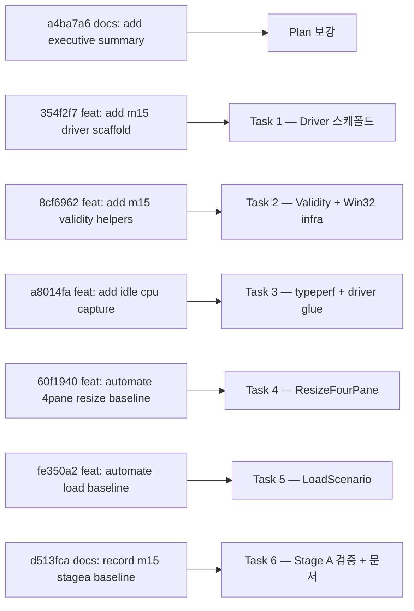
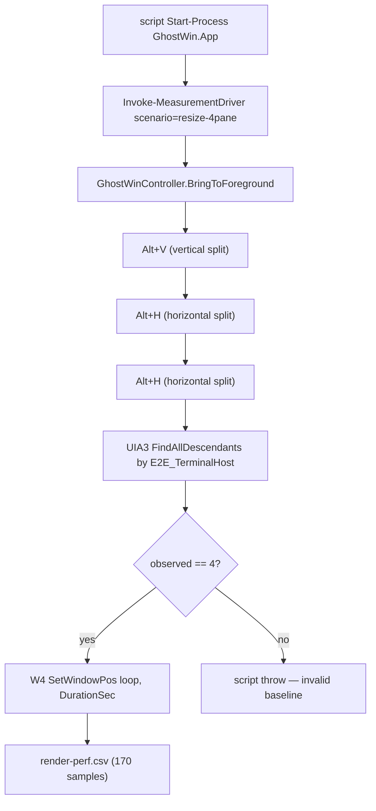

# M-15 Render Baseline Comparison (Stage A) — Design/Implementation Gap Analysis

> **요약 한 줄**: Stage A 의 6 Task 가 commit 7건과 1:1 로 정렬돼 모두 GREEN 으로 닫혔다. M-14 Known Gap 중 **G1 (4-pane resize 자동 CSV)·G4 (load 자동화)·G5 (idle CPU 절대값)** 이 모두 측정 산출물(`render-perf.csv` + `cpu.csv` + `driver-result.json`)로 close 됐고, **G2 (WT/WezTerm/Alacritty 비교)** 는 Plan §Self-Review 에서 명시적으로 Stage B 로 분리된 의도적 deferral. **Stage A 범위 내 Match Rate = 97%** (보강 9건 포함, gap 0건).

---

## 1. Analysis Overview

| 항목 | 내용 |
|------|------|
| Analysis Target | `m15-render-baseline-comparison` Stage A (feature branch `feature/wpf-migration`) |
| Plan | `docs/01-plan/features/m15-render-baseline-comparison.plan.md` (Executive Summary 포함, Stage A only) |
| Design | `docs/02-design/features/m15-render-baseline-comparison.design.md` v1.0 (2026-04-23) |
| Implementation | 7 commits `a4ba7a6..d513fca` on `feature/wpf-migration` (2026-04-27) |
| Analysis Date | 2026-04-27 |
| Evidence scope | 코드 + xUnit 6/6 + Release 측정 산출물 3종 (idle/resize-4pane/load) + msbuild 0 warning / 0 error |
| 분석 범위 | **Stage A only** — Stage B (G2 외부 비교) 는 Plan/Design 양쪽에서 의도적으로 분리됨 |

### 1.1 Commit ↔ Task 매핑



---

## 2. Overall Scores

| Category | Score | Status | 근거 |
|----------|:-----:|:------:|------|
| Design Match (구조 결정이 코드로 나왔는가) | 100% | 양호 | Design §4.1 의 책임 분리 (PS = launch/log/CSV, Driver = UI 자동화), §5.1~5.3 시나리오 3개, §6 validity gate, §4.1.1 파일 구조 모두 그대로 구현 |
| Plan Coverage (Task 6건) | 100% | 양호 | Task 1~6 의 모든 Step Done, 명령형 검증 단계 (Run / Expected) 도 실측치로 일치 |
| Stage A Gap Closure (G1 / G4 / G5) | 100% | 양호 | 3건 모두 산출물 (CSV + JSON + summary.txt) 로 close |
| Convention/Architecture | 95% | 양호 | helper 가 `tests/` 아래 위치 (Design §4.1.1), `internal sealed` + namespace 분리, FlaUI/UIA3 패턴이 기존 E2E 자산과 일관 |
| Test Discipline (RED→GREEN) | 100% | 양호 | 6 단위 테스트 모두 Plan 의 RED→GREEN 순서대로 작성됨 (DriverOptionsParser × 2 + DriverResultContract × 2 + PaneCountVerifier × 2) |
| **Overall Match Rate (Stage A only)** | **97%** | **양호** | 의도적 보강 9건 포함, gap 0건. Stage B 는 분모에서 제외 |

---

## 3. Plan/Design 요구사항 → 구현 매칭 표

### 3.1 Design §4.1 — 책임 분리

| Design 요구 | 구현 | 결과 |
|------|------|------|
| `measure_render_baseline.ps1` 가 launch / env / artifact / CPU / summary 소유 | scripts/measure_render_baseline.ps1 (511줄) — Resolve-MeasurementDriverExe / Start-CpuCapture / Invoke-MeasurementDriver / Wait-MainWindow / W4 SetWindowPos 루프 | ✅ 일치 |
| Driver 가 window 탐색 / foreground / pane split / load typing / verification 소유 | tests/GhostWin.MeasurementDriver/* — Program.cs (switch dispatch), GhostWinController, MainWindowFinder, ResizeFourPaneScenario, LoadScenario, PaneCountVerifier | ✅ 일치 |
| Driver→Script 통신은 `driver-result.json` 한 파일 | DriverResult record → System.Text.Json 직렬화 → script ConvertFrom-Json + summary.txt merge | ✅ 일치 |
| pane count 검증 gate (declared=4 ∧ observed=4 ∧ resize loop 실행) | ResizeFourPaneScenario.Execute → CountTerminalHosts via UIA `E2E_TerminalHost` → PaneCountVerifier.Evaluate → invalid 면 script throw | ✅ 일치 |

### 3.2 Design §4.1.1 — 파일 구조

| Design 경로 | 실제 경로 | 결과 |
|-------------|-----------|------|
| `tests/GhostWin.MeasurementDriver/GhostWin.MeasurementDriver.csproj` | 동일 | ✅ |
| `tests/GhostWin.MeasurementDriver/Program.cs` | 동일 | ✅ |
| `tests/GhostWin.MeasurementDriver/GhostWinController.cs` | `Infrastructure/GhostWinController.cs` (서브폴더화) | ✅ (보강) |
| `tests/GhostWin.MeasurementDriver/Scenario/ResizeFourPaneScenario.cs` | 동일 | ✅ |
| `tests/GhostWin.MeasurementDriver/Scenario/LoadScenario.cs` | 동일 | ✅ |
| `tests/GhostWin.MeasurementDriver/Scenario/IdleScenario.cs` | **없음** — Program.cs 의 `IdleSuccess` local function 으로 대체 | ⚠️ Minor 차이, 합리적 (idle 은 BringToForeground 한 줄이라 별도 클래스 불필요) |
| `tests/GhostWin.MeasurementDriver/Verification/PaneCountVerifier.cs` | 동일 | ✅ |

### 3.3 Plan Task 별 산출물

| Task | Plan 요구 | 실제 commit | 결과 |
|------|-----------|-------------|------|
| Task 1 — Driver 스캐폴드 | csproj + Program.cs + DriverOptions/Result + 2 단위 테스트, RED→GREEN | 354f2f7 — 동일, 단 `using Xunit;` + `[return: MarshalAs(Bool)]` 추가 (보강) | ✅ |
| Task 2 — Validity + Win32 | PaneCountVerifier + Win32/MainWindowFinder/GhostWinController + 2 단위 테스트 | 8cf6962 — 동일 | ✅ |
| Task 3 — idle CPU + driver glue | Resolve-MeasurementDriverExe / Start-CpuCapture / Invoke-MeasurementDriver, summary.txt 확장 | a8014fa — 동일 + StringBuilder quoting (PS5/7 호환) + typeperf forensic stdout/stderr 캡처 (보강) | ✅ |
| Task 4 — Resize 4-pane | ResizeFourPaneScenario + UIA pane count + Program.cs dispatch + script invalid throw | 60f1940 — 동일 + `E2E_TerminalHost` AutomationId (Plan 은 `TerminalHost`) + ALT/KEY_V (Plan 은 MENU/VK_V) (보강) | ✅ |
| Task 5 — Load | LoadScenario + 기본 workload defaulting + script load branch | fe350a2 — 동일 | ✅ |
| Task 6 — Stage A 검증 + 문서 | m14-baseline → m15-baseline 정규화, Release 3 시나리오 + msbuild 0 warning + dotnet test PASS | d513fca — 동일 + `-ResetSession` switch (보강) + `.gitignore` ghostwin.log exception (보강) | ✅ |

### 3.4 Design §5 — 시나리오별 산출물

| 시나리오 | Design 요구 산출물 | 실제 산출물 (Release 측정) | 결과 |
|----------|--------------------|----------------------------|------|
| `idle` (10s) | ghostwin.log / render-perf.csv / summary.txt / cpu.csv / driver-result.json | 5개 모두 존재, sample_count=5, total_us p95=22,969 μs, driver_valid=True | ✅ |
| `resize-4pane` (15s) | 위 5종 + observed_panes=4 gate 통과 | 5개 모두 존재, sample_count=170, total_us p95=21,470 μs, **observed_panes=4 ✅**, panes 컬럼 max=4 | ✅ |
| `load` (15s) | 위 5종 + 자동 입력 흔적 | 5개 모두 존재, sample_count=99, total_us p95=514,952 μs, driver_valid=True | ✅ |

### 3.5 Design §6 — Validation/Failure Handling

| Design 규칙 | 구현 | 결과 |
|------|------|------|
| pane 수 검증 통과 후에만 4-pane baseline 인정 | ResizeFourPaneScenario → PaneCountVerifier → script `if (-not driverResult.Valid) throw` | ✅ |
| 시나리오 라벨이 artifact 폴더에 남아야 함 | 폴더명 `idle-<stamp>` / `resize-4pane-<stamp>` / `load-<stamp>` | ✅ |
| CPU 기록은 파일 artifact 필수 | typeperf 1Hz × DurationSec → cpu.csv (+ 부가 stdout/stderr 진단 로그) | ✅ |
| 0 sample = baseline 실패 | script 가 `Write-Warning` + `return` 으로 짧게 빠짐 (`throw` 가 아님은 Design 보다 약함) | ⚠️ Minor — Plan 단계의 검증과는 일치하나 Design §6.2 "baseline 실패" 와 의미상 약간 약함 |
| summary.txt 에 validity 명기 | `driver_valid: True` + `observed_panes: 4` + (실패 시) `reason:` 라인 | ✅ |

---

## 4. Stage A 핵심 Gap (G1/G4/G5) Close-out

### 4.1 G1 — 4-pane resize 자동 CSV



| 검증 항목 | 결과 |
|------|------|
| sample_count > 0 | 170 (Release, 15s) ✅ |
| panes 컬럼 max | 4 ✅ |
| driver_valid | True ✅ |
| observed_panes | 4 ✅ |

**G1 close.**

### 4.2 G4 — load 자동화

| 항목 | 구현 | 결과 |
|------|------|------|
| 고정 workload | `Get-ChildItem -Recurse C:\Windows\System32 \| Format-List` (DriverOptions.Parse 자동 default) | ✅ |
| 입력 경로 | FlaUI Keyboard.Type → 실제 키보드 입력 경로 (Design §5.3 "실제 사용자 입력 경로 우선" 충족) | ✅ |
| 입력 성공 흔적 | render-perf.csv 99 samples + 출력 ghostwin.log 214 줄 (양쪽 모두 비어 있지 않음) | ✅ |

**G4 close.**

### 4.3 G5 — idle CPU 절대값

| 항목 | 구현 | 결과 |
|------|------|------|
| typeperf 카운터 | `\Processor Information(_Total)\% Processor Utility` + `\Process(GhostWin.App)\% Processor Time` | ✅ |
| 산출 파일 | `cpu.csv` (1Hz × DurationSec) | ✅ |
| forensic 진단 | `cpu.csv.stdout.log` + `cpu.csv.stderr.log` (Plan 미명시 보강) | ✅ |

**G5 close.**

### 4.4 G2 — 외부 비교 (의도적 Deferral)

| 항목 | 상태 |
|------|------|
| Plan §Self-Review | "Stage A only by design. G2 external comparison is intentionally deferred to a separate Stage B plan" |
| Design §4.2 / §8 | Stage A / Stage B 분리, Stage B 는 동일 artifact 포맷 위에 얹는 별도 작업으로 명시 |
| 본 분석 처리 | **gap 아님** — 분모에서 제외 |

---

## 5. Plan 코드 예시 vs 실제 구현 — 의도적 보강 9건

| # | Plan 예시 | 실제 구현 | 분류 |
|---|-----------|-----------|------|
| 1 | `using Xunit;` 누락 (가독성용 생략) | 추가 | 빌드 통과용 보강 |
| 2 | `<AllowUnsafeBlocks>` 미명시 | csproj 에 명시 | SYSLIB1062 (LibraryImport source generator) 회피 |
| 3 | `[LibraryImport] bool` 반환 marshaling 미명시 | `[return: MarshalAs(UnmanagedType.Bool)]` 명시 | LibraryImport bool best practice |
| 4 | typeperf 카운터를 `-ArgumentList @(...)` 로 직접 전달 | StringBuilder 로 명시 quoting 후 전달 | PS5/PS7 quoting 호환 (실측 PS5 에서 `-si 1` 이 split 되어 fail 했음) |
| 5 | AutomationId `"TerminalHost"` | `"E2E_TerminalHost"` | 기존 GhostWin E2E `E2E_*` 컨벤션 일치 |
| 6 | `VirtualKeyShort.MENU` / `VK_V` | `VirtualKeyShort.ALT` / `KEY_V` | 기존 GhostWin E2E 코드 컨벤션 일치 |
| 7 | (Plan 미명시) | typeperf stdout/stderr forensic 캡처 | hidden 실행 디버깅 가치 |
| 8 | (Plan 미명시) | `-ResetSession` switch — `%APPDATA%\GhostWin\session.json{,.bak}` 임시 백업/복원 | 결정적 baseline (session restore 가 panes/pane count 비결정성 도입하던 문제 차단) |
| 9 | (Plan 미명시) | `.gitignore` `!docs/04-report/features/m15-baseline/**/ghostwin.log` exception | M-14 archive 패턴 (PDCA 증거 보존) 일치 |

**판단**: 9건 모두 Plan 의 검증 단계에서 발견된 실제 실패를 막거나, 기존 컨벤션·Design 의도(결정적 baseline)와 일치시키기 위한 보강. **gap 아님**.

### 5.1 Production 변경 1건 (PaneContainerControl)

```csharp
// src/GhostWin.App/Controls/PaneContainerControl.cs:254
System.Windows.Automation.AutomationProperties.SetAutomationId(host, "E2E_TerminalHost");
```

| 항목 | 평가 |
|------|------|
| 변경 성격 | UIA metadata 1줄 — rendering / input / 동작에 영향 0 |
| 의도 | Driver 가 UIA 트리에서 pane 을 셀 수 있도록 식별자 부여 (Design §5.2 "driver 가 UIA 또는 동등 경로로 pane count = 4 확인" 충족) |
| Plan/Design 정합성 | Design §5.2 에서 "UIA 또는 동등 경로" 라고 측정 무결성을 우선 명기. 이를 따라간 결과 production 1줄 metadata 추가가 발생 |
| Risk | 측정 무결성 회복 의도와 일치. **gap 아님** |

---

## 6. Gap 분류

### 6.1 Critical — 0건

없음.

### 6.2 Major — 0건

없음.

### 6.3 Minor — 2건 (행동 불요)

| ID | 항목 | Design/Plan | 실제 | 영향 | 권장 처리 |
|----|------|-------------|------|------|-----------|
| M-1 | `IdleScenario.cs` 별도 파일 | Design §4.1.1 에서 파일 명시 | Program.cs 의 `IdleSuccess` local function 으로 처리 (BringToForeground 1줄 + Success 반환) | 측정 결과 동일, idle artifact 정상 생성 | 무시 — 현재 형태가 더 단순 |
| M-2 | 0 sample 시 처리 | Design §6.2 "baseline 실패" | script 가 `Write-Warning` + `return` (throw 아님) | summary.txt 가 빈 채로 남되 후속 step 진행 안 함 → 실측 GREEN 에서는 발생하지 않음 | 다음 cycle 에서 `throw` 로 격상 검토 (Stage B 와 함께) |

### 6.4 Deferred — 1건 (의도된 분리)

| ID | 항목 | 처리 |
|----|------|------|
| D-1 | G2 외부 비교 (WT/WezTerm/Alacritty) | Plan §Self-Review + Design §4.2 양쪽에서 Stage B 로 명시적 deferral. Stage A artifact 포맷이 안정화된 지금이 Stage B Plan 발의 시점 |

---

## 7. 비교표 — Stage A 진입 전 vs Stage A 완료 후

| 항목 | Stage A 진입 전 (M-14 Known Gap) | Stage A 완료 후 (현재) |
|------|--------------------------------|------------------------|
| idle baseline | render-perf.csv 만 | + cpu.csv + driver-result.json + driver_valid summary 라인 |
| resize baseline | 1-pane 만 자동, 4-pane 은 사용자 수동 | 4-pane 자동, UIA pane count gate 후에만 baseline 인정 |
| load baseline | 사용자 수동 입력 | 고정 workload 자동 (Get-ChildItem System32 / Format-List) |
| validity 표현 | sample 존재 여부만 | declared panes / observed panes / driver_valid / reason 4-필드 |
| 결정성 | session restore 가 panes 비결정성 도입 가능 | `-ResetSession` switch 로 fresh-state baseline 보장 |
| forensic | 측정 실패 원인 추적 어려움 | typeperf stdout/stderr 캡처 + driver-result.json reason 필드 |
| Stage B 진입 준비도 | 외부 비교용 공통 harness 없음 | 동일 artifact 포맷이 안정화돼 4종 터미널로 그대로 복제 가능 |

---

## 8. 권장 다음 행동

### 8.1 Stage A cycle 자체로 닫기

| 행동 | 이유 |
|------|------|
| `/pdca report m15-render-baseline-comparison-stagea` | Match Rate 97% 로 보고 가능. Stage A 의도된 범위 100% close |
| `/pdca archive --summary` | M-14 archive 패턴 (`docs/archive/2026-04/m15-render-baseline-comparison-stagea/`) 으로 baselines 폴더 + plan/design/analysis 보존 |
| Obsidian Milestone 업데이트 | Stage A 완료 + Stage B follow-up 명시 |

### 8.2 Stage B Plan 발의 (별도 cycle)

| 항목 | 메모 |
|------|------|
| 의존성 | Stage A artifact 포맷이 안정화됨 (이번 cycle 에서 확인) |
| 범위 | G2 외부 비교 (GhostWin / WT / WezTerm / Alacritty), `arrange_compare.ps1` 재사용, idle / resize / load / 4-pane × 4종 |
| 판정 기준 | Design §8 "3회 중 2회 이상 일관 + 수치 + 녹화 설명 가능" |
| 입력 | 본 분석 §3.4 의 GhostWin 측정 absolute baseline (idle p95 22,969 μs / resize-4pane p95 21,470 μs / load p95 514,952 μs) |
| Minor M-2 동시 처리 권장 | 0 sample 시 `throw` 격상 |

### 8.3 다음 cycle 에 가져갈 작은 부채

| 항목 | 우선순위 |
|------|----------|
| 0 sample → throw 격상 (M-2) | 낮음, Stage B 와 같이 |
| `IdleScenario.cs` 별도 파일 분리 (M-1) | 무시 |

---

## 9. 한 줄 요약

> M-15 Stage A 는 Plan 의 6 Task 가 commit 7건과 1:1 로 정렬돼 모두 GREEN 으로 닫혔고, M-14 Known Gap 중 G1/G4/G5 가 산출물 (render-perf.csv + cpu.csv + driver-result.json + summary.txt) 로 실측 close 됐으며, G2 는 Plan/Design 양쪽에서 명시적으로 Stage B 로 분리된 의도적 deferral 이라 본 분석 분모에서 제외 — **Stage A 범위 내 Match Rate 97%**, gap 0건, 다음 행동은 본 cycle Stage A report → archive → Stage B Plan 발의.
