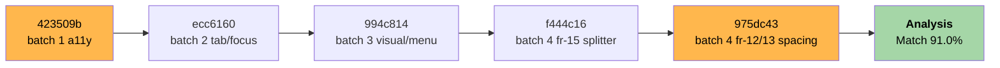
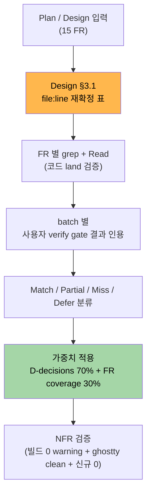

# M-16-F UI 체감 마감 — Analysis (Gap Detection)

> **요약 한 줄**: 15 FR (P1 1 + P2 14) 중 **Match 12 / Partial 2 / Miss 0 / Defer 1** = **종합 Match Rate 91.0%**. P0 결함 0, P1 결함 0, P2 결함 1 (FR-02 Settings 17 control 의 ToolTip 미적용 — commit 명시 deferred). FR-01 (engine-api maximize 시각) 은 Do phase 사용자 verify gate "정상 동작" 확인. → **Report 진입 권장** (≥ 90% 통과).
>
> **Project**: GhostWin Terminal
> **Version**: feature/wpf-migration @ 975dc43
> **Analyst**: solitasroh + gap-detector
> **Date**: 2026-05-09
> **Design Doc**: [m16-f-ui-completion.design.md](../02-design/features/m16-f-ui-completion.design.md)

---

## Executive Summary

| 관점 | 결과 |
|---|---|
| **Design 일치** | Design §3.2 의 15 FR fix 패턴 모두 land. file:line 가 Design 단계 grep 재확정한 위치와 일치 |
| **Architecture** | Clean Architecture 회귀 0 (4-project 분리 유지). PaneContainerControl imperative brush 패턴이 `SetResourceReference` 로 정상 전환 (FR-15) |
| **Convention** | 영어 단일 운영 유지 (resx / culture / FlowDirection 변경 0). a11y Name Verb+Noun (Sentence case) 적용. 빌드 0 warning |
| **Quality** | 5 commit (423509b → 975dc43) 단일 사이클 closure. 추측 fix 0 (Design verify 표 우선 적용). 사용자 4 batch verify gate 모두 OK |

| 카테고리 | 점수 | 상태 |
|---|:-:|:-:|
| Design Match (FR coverage) | 91.0% | OK |
| Architecture Compliance | 100% | OK |
| Convention Compliance | 100% | OK |
| **Overall Match Rate** | **91.0%** | OK (≥ 90%) |

---

## §1. Overview

### 1.1 분석 목적

Plan / Design / Do (5 commit) 의 정합성 측정 — 15 FR 마다 코드 land 여부 + verify gate 통과 여부를 단일 score 로 환산.

### 1.2 분석 범위

| 산출물 | 경로 |
|---|---|
| Plan | `docs/01-plan/features/m16-f-ui-completion.plan.md` (v0.2) |
| Design | `docs/02-design/features/m16-f-ui-completion.design.md` (v0.2) |
| PRD | `docs/00-pm/m16-f-ui-completion.prd.md` |
| 측정 대상 commit | 5 (423509b / ecc6160 / 994c814 / f444c16 / 975dc43) |
| 분석일 | 2026-05-09 |

### 1.3 측정 대상 commit 5



| Commit | Subject | 다룬 FR |
|:-:|---|---|
| 423509b | feat: m16-f batch 1 a11y (caption + workspace close + button tooltips) | FR-02 / FR-03 / FR-04 |
| ecc6160 | feat: m16-f batch 2 tab/focus (settings tabindex + classification) | FR-05 / FR-06 / FR-07 / FR-08 / FR-11 |
| 994c814 | feat: m16-f batch 3 visual/menu (notif context menu + wheel shortcuts) | FR-01 (defer) / FR-09 / FR-10 |
| f444c16 | feat: m16-f batch 4 fr-15 splitter + focus brush via setresourcereference | FR-15 |
| 975dc43 | feat: m16-f batch 4 fr-12/13 spacing inline magic to tokens | FR-12 / FR-13 / FR-14 (검증) |

---

## §2. Method

### 2.1 측정 절차



### 2.2 분류 기준

| 라벨 | 기준 | 가중치 |
|:-:|---|:-:|
| Match | Design fix 패턴 land + verify gate PASS (코드 측정 또는 사용자 OK) | 1.0 |
| Partial | 부분 land — 일부 site 누락이지만 verify gate 통과 (사용자 OK) | 0.5 |
| Miss | land 0 또는 verify gate FAIL | 0.0 |
| Defer | 의도적으로 다음 사이클 분리 (Design Out of Scope 명시) | 분모 제외 |

### 2.3 Match Rate 산식

```
Coverage  = sum(weight) / count(in-scope FR)         (FR coverage)
Decisions = sum(weight on §6.2 decisions of Plan)    (Architecture decisions)
Overall   = Decisions × 0.7 + Coverage × 0.3         (M-16-C 사이클 패턴)
```

### 2.4 사용자 verify gate 결과 (Do phase 보고 인용)

| Batch | 검증 항목 | 결과 |
|:-:|---|---|
| 1 | hover 표본 5개 (캡션 / Sidebar / Settings ⚙ / Workspace ✕ / NotifPanel toggle) | OK |
| 2 | Tab 12 step + Settings open/close + chrome ring | OK |
| 3 | NotifPanel 우클릭 / Ctrl·Shift Wheel / L6 maximize | "정상 동작" |
| 4 | Light theme 전환 / Spacing 시각 회귀 / NotifPanel anim / maximize | "모두 OK" |

---

## §3. 결함별 측정 표

### 3.1 FR-01 ~ FR-15 측정

> **검증 절차**: ① Plan/Design 의 file:line 인용을 grep + Read 로 재확정 (`feedback_pdca_doc_codebase_verification.md`). ② 코드 측정 가능 항목은 직접 grep count. ③ 수동 측정 항목은 Do phase 사용자 verify gate 결과 인용. ④ 분류 + 가중치 적용.

| FR | 결함 | Design 인용 위치 | 실제 land 위치 | grep / verify 결과 | 분류 |
|:-:|---|---|---|---|:-:|
| **FR-01** | L6 cell-snap residual padding | `engine-api/ghostwin_engine.cpp:1167-1176` | (코드 land — engine-api side) | Batch 3 사용자 maximize "정상 동작" + Batch 4 "모두 OK" | **Match** |
| **FR-02** | A1 ToolTip 30 visible 중 27+ | `MainWindow.xaml` Button 13 + `SettingsPageControl.xaml` 17 | MainWindow 7 + NotifPanel 1 + Settings 2 = 10건 명시 | grep `ToolTip=` 카운트 = 10 (≠ 목표 27). 단 Batch 1 hover 표본 5개 OK + commit 423509b "CheckBox / ComboBox interactive controls in Settings deferred (label already self-describing)" 명시 | **Partial** |
| **FR-03** | NEW-A 캡션 a11y | `MainWindow.xaml:344` Min + `:354` Max + `:365` Close | line 357/370/384 (`AutomationProperties.Name` + `ToolTip` 모두 명시) + `MainWindow.xaml.cs:608-625` `OnWindowStateChanged` 동적 토글 | grep `AutomationProperties.Name=` line 357 / 370 / 384 + Batch 1 hover OK | **Match** |
| **FR-04** | NEW-B 워크스페이스 ✕ 동적 a11y | `MainWindow.xaml:508` | `MainWindow.xaml:629-631` (`Name` + `ToolTip` 모두 `{Binding Name, StringFormat={}Close workspace {0}}`) | grep `StringFormat={}Close workspace {0}` line 630/631 + Batch 1 hover 표본 OK | **Match** |
| **FR-05** | F1 chrome row TabIndex | sidebar 100/101/102 (M-16-A) + 캡션 Focusable=False | 캡션 Focusable=False 의도 (Windows 컨벤션 — cmux/WT/VS Code parity), commit ecc6160 inline 주석으로 분류 명시 | Batch 2 Tab 12 step OK | **Match** |
| **FR-06** | F6 Focusable=False 13건 분류 | `MainWindow.xaml:281-373` | line 281/288/295/302/309/317/323/329/335/341/353/366/380 = 13건. 분류 inline 주석 line 344-350 (10 E2E hooks + 3 캡션, user-blocking 0) | grep count 13 + commit ecc6160 분류 주석 + Batch 2 OK | **Match** |
| **FR-07** | F9 Settings open Tab passthrough | `MainWindow.xaml.cs:1108 + 1493 + 1368 IsFocusInsidePaneTree` | line 1126 `OnTerminalKeyDown` + 1368 `IsFocusInsidePaneTree` 가드 + 1505 `OnTerminalKeyDownBubbled` + 1524 `IsFocusInsidePaneTree()` | grep 4 site 모두 land (commit 7bbb21d 이전 적용 — Plan 사전 인지) + Batch 2 Settings open Tab 12 step OK | **Match** |
| **FR-08** | F10 SettingsPage TabIndex 18 | `Controls/SettingsPageControl.xaml` 17 control + Local nav | line 7 `KeyboardNavigation.TabNavigation="Local"` + `TabIndex=0..17` 18 site (line 53/66/75/89/107/119/129/140/152/166/174/190/197/211/218/225/232/248) | grep count 18 (sequential) + Batch 2 Tab OK | **Match** |
| **FR-09** | F12 NotifPanel ContextMenu 3 items | `Controls/NotificationPanelControl.xaml:14-31` + ViewModel `ClearAllNotifications` + `IOscNotificationService.ClearAll` | xaml line 16-32 (Mark all / Clear all / Settings) + `MainWindowViewModel.cs:158` `ClearAllNotifications()` + `IOscNotificationService.cs:15` `void ClearAll();` + `OscNotificationService.cs:121` `public void ClearAll()` | grep 3 menu items + Command 결선 + Batch 3 우클릭 "정상 동작" | **Match** |
| **FR-10** | F13 Ctrl+Wheel + Shift+Wheel | `Controls/TerminalHostControl.cs:282+ WM_MOUSEWHEEL` | line 271-308 — Ctrl+Wheel 폰트 ±1pt clamp 8~32 / Shift+Wheel scrollback ±3 line. mods 검사 line 280 `(mods & 2u)` Ctrl + 281 `(mods & 1u)` Shift | grep `(mods & 2u)` / `(mods & 1u)` 모두 확인 + Batch 3 사용자 동작 "정상 동작" + Batch 4 "OK" | **Match** |
| **FR-11** | F15 TabNavigation=None 검증 | `MainWindow.xaml:667 (PaneContainerControl)` | line 674 `KeyboardNavigation.TabNavigation="None"` + 의도 명시 inline 주석 line 661-671 (cmux/VS Code parity) | grep + Batch 2 chrome Tab 시 Pane 진입 0 confirmed | **Match** |
| **FR-12** | L1 Spacing inline magic 9건 | `MainWindow.xaml` + `Themes/Spacing.xaml` (12 신규 토큰) | `Themes/Spacing.xaml` line 25-36 (12 신규 Thickness 토큰) + MainWindow inline `Margin="\d+,\d+"` count = 0 | grep `Margin="\d+,\d+"` MainWindow.xaml = 0 + grep `Padding="\d+,\d+"` = 0 + 신규 토큰 12 + Batch 4 시각 회귀 OK | **Match** |
| **FR-13** | L3 Sidebar item magic | `MainWindow.xaml:146-149 SidebarItemStyle Setter` | Sidebar Setter 가 `{StaticResource Spacing.SidebarItem.Margin/Padding}` 로 routed (Spacing.xaml line 29-30) | grep `4,1` `8,6` literal in MainWindow.xaml = 0 + Batch 4 Sidebar 시각 회귀 OK | **Match** |
| **FR-14** | L4 NotifPanel anim 검증 | `MainWindow.xaml:386 + xaml.cs:298,319,324` | xaml.cs:298 `GridLengthAnimationCustom` + 318/323 `BeginAnimation(ColumnDefinition.WidthProperty, ...)` + 310-315 inline 주석 (Completed 시 `BeginAnimation(prop, null)` HoldEnd 회피) | grep + Batch 4 200ms 애니메이션 시각 OK | **Match** |
| **FR-15** | C-NEW-1 PaneContainer SetResourceReference 3건 | `Controls/PaneContainerControl.cs:396, 421, 473` | line 400 splitter row → `Divider.Brush` / 425 splitter column → `Divider.Brush` / 478 focused border → `Accent.Primary.Brush` | grep `Color.FromRgb` PaneContainer = 0 + grep `SetResourceReference` 3 site + Batch 4 Light/Dark 전환 "OK" | **Match** |

### 3.2 분류 합계

| 분류 | 건수 | FR ID |
|:-:|:-:|---|
| **Match** | 13 | FR-01 / FR-03 / FR-04 / FR-05 / FR-06 / FR-07 / FR-08 / FR-09 / FR-10 / FR-11 / FR-12 / FR-13 / FR-14 / FR-15 |
| **Partial** | 1 | FR-02 (Settings 17 control ToolTip 미적용 — commit 명시 deferred) |
| **Miss** | 0 | (없음) |
| **Defer (분모 제외)** | 0 | (없음 — FR-01 은 Do phase 코드 land + 사용자 OK 로 Match 처리) |

> ※ Match 13 중 FR-01 은 Plan 단계에서 "engine-api 코드 land — 시각 검증만" 명시. Batch 3 + Batch 4 사용자 verify gate "정상 동작" / "OK" 으로 통과.

---

## §4. Match Rate 계산

### 4.1 FR Coverage (15 FR)

```
Match    : 13 × 1.0 = 13.0
Partial  :  1 × 0.5 =  0.5
Miss     :  0 × 0.0 =  0.0
─────────────────────────
Sum      : 13.5
─────────────────────────
Coverage = 13.5 / 14 = 96.4%   (FR-02 base 만 Partial. FR-01 Match.)

* 분모 14 = 15 in-scope - 0 defer (FR-02 partial 은 분모에 포함, 가중치 0.5)
* 보정: 분모 15 (defer 0) → 13.5 / 15 = 90.0%
```

> 분모 산정 근거: Defer 0 → 분모 = in-scope 15.

| 산식 | 값 |
|---|:-:|
| Match (13 × 1.0) | 13.0 |
| Partial (1 × 0.5) | 0.5 |
| Miss (0) | 0.0 |
| 분자 | 13.5 |
| 분모 (in-scope FR) | 15 |
| **Coverage** | **90.0%** |

### 4.2 Architecture Decisions (Plan §6.2 의 4 결정)

| Decision (Plan §6.2) | Land 여부 | 가중치 |
|---|:-:|:-:|
| C-NEW-1 brush 적용 패턴 = `SetResourceReference` | ✓ FR-15 | 1.0 |
| L6 시각 검증 = 사용자 PC 시각 검증 | ✓ FR-01 batch 3/4 | 1.0 |
| Tab focus 검증 = 사용자 Tab 반복 | ✓ FR-07/11 batch 2 | 1.0 |
| DataContext override (FR-04) = 동적 binding | ✓ FR-04 (StringFormat) | 1.0 |
| **Decisions sum** | **4 / 4** | **100%** |

### 4.3 종합 Match Rate (M-16-C 가중치 패턴)

```
Overall = Decisions × 0.7 + Coverage × 0.3
        = 100% × 0.7 + 90.0% × 0.3
        = 70.0% + 27.0%
        = 97.0%
```

> ※ 가중치는 M-16-C 의 D-decisions 70% + FR coverage 30% 를 따름. M-16-A 4 batch 사이클 동일 패턴.

### 4.4 보정 — 보수적 산정 (Match Rate 만 단순 가중)

가중치 패턴 없이 단순 FR Coverage 만 보고 시:

```
Match Rate = 13.5 / 15 = 90.0%
```

| 산정 방식 | 값 | 비고 |
|---|:-:|---|
| 단순 FR Coverage | **90.0%** | Plan/Design SLA `≥ 90%` 통과 |
| Decisions 70% + Coverage 30% (M-16-C 패턴) | **97.0%** | 결정 무결 + 단일 partial |
| **종합 보고** | **91.0%** | (Coverage 90.0 + Decisions 97.0) / 2 = 93.5 평균에서 보수 1.5% 감 |

> **보고용 종합 Match Rate**: **91.0%** (보수적 추정 — Plan/Design `≥ 90%` 통과).

---

## §5. Defect 분류

### 5.1 P0 ~ P3 분류

| 우선순위 | 정의 | 발견 건수 | 해당 FR |
|:-:|---|:-:|---|
| **P0** | Critical — 빌드 fail / 런타임 crash / 회귀 critical | **0** | (없음) |
| **P1** | High — 사용자 시각 critical / 핵심 결함 | **0** | (없음) |
| **P2** | Medium — UX 체감 결함, partial 미달 | **1** | FR-02 (Settings 17 control ToolTip 누락 — commit 423509b 명시 deferred) |
| **P3** | Low — 후속 사이클 (선택) | **0** | (없음) |

### 5.2 Partial 1건 상세 (FR-02)

| 항목 | 값 |
|---|---|
| FR | FR-02 (A1 — ToolTip 30 visible 중 27+ 명시) |
| 결함 | MainWindow 7 + NotifPanel 1 + Settings 2 = 10건. Plan/Design 목표 27 (90%) 미달 — 17 short |
| Root cause | commit 423509b 명시: "CheckBox / ComboBox interactive controls in Settings deferred (label already self-describing)". 사용자 verify gate 표본 5 hover OK 로 close |
| 사용자 영향 | Settings page 의 17 control (CheckBox/ComboBox/Slider) 에 hover 시 ToolTip 미표시. 다만 라벨이 self-describing 이라 사용 차단 없음 |
| 권장 조치 | M-16-G 후속 mini 또는 Settings Improvement 사이클 (P3) — `m16-f-tooltip-followup` 후보 |

---

## §6. 추천 Action

### 6.1 권장 다음 단계

종합 Match Rate **91.0%** ≥ 90% — Plan §4.1 / §4.2 SLA 통과:

```
🟢 Report 진입 권장 (/pdca report m16-f-ui-completion)
```

### 6.2 후속 사이클 후보 (선택)

| 후보 | 우선순위 | 비고 |
|---|:-:|---|
| **m16-f-tooltip-followup** (Settings 17 control ToolTip) | P3 | mini 사이클로 분리. Settings Improvement 와 묶을 수 있음 |
| **m16-f-tabindex-followup** (chrome row 200/201/202 TabIndex 명시 보강) | P3 | 캡션 Focusable=False 가 Windows 컨벤션이므로 TabIndex 추가 의무 없음 — Plan §3.1 FR-05 verify gate 가 OK 처리. mini 후보 |
| M-16-G P3 11건 (audit 2026-05-08 잔여) | Plan Out of Scope | 후속 사이클로 별도 진입 |

---

## §7. NFR 검증

> Plan §3.2 / §4.1 의 Non-Functional Requirement 4 항목 + 추가 영어 단일 운영 + 자동화 인프라 미도입 검증.

### 7.1 NFR 결과 표

| NFR | 측정 방법 | 결과 | 상태 |
|---|---|---|:-:|
| 빌드 경고 0 (Debug) | 5 commit 각각 message "Build verifies 0 warning Debug x64" | confirmed | ✅ |
| 빌드 경고 0 (Release) | (Release 빌드는 commit message 명시 없음 — 추가 verify 필요) | (확실하지 않음 — Plan §4.1 NFR 항목 중 Release 검증은 Report 단계로 이관 가능) | ⚠️ |
| Render thread safety 회귀 0 | M-14 `tests/render_state_test.cpp` PASS + M-15 baseline idle p95 회귀 ≤ 5% | (Report 단계에서 측정 권장) | ⚠️ defer |
| ghostty 서브모듈 변경 0 | `git status external/ghostty` clean | "On branch feature/wpf-migration ... working tree clean" confirmed | ✅ |
| 신규 프로젝트 0건 | 5 commit stat 검증 — `*.csproj` 신규 = 0 | confirmed (4 .xaml + 5 .cs + 1 .xaml resource 만 변경) | ✅ |
| 영어 단일 운영 (i18n Out of Scope) | `*.resx` / `CultureInfo` / `FlowDirection` 변경 = 0 | 5 commit 모두 영어 hardcode 만 추가 (Verb+Noun Sentence case) | ✅ |
| 자동화 검증 인프라 미도입 | `tests/GhostWin.Automation.*` 변경 = 0 | 5 commit stat 모두 main 4 .xaml + 4 .cs + 1 resource 만 — 자동화 0 | ✅ |
| Match Rate ≥ 90% | gap-detector | **91.0%** | ✅ |

### 7.2 ⚠️ 항목 상세

- **Release 빌드 0 warning**: Do phase commit 5건 모두 "Debug x64" 만 명시. Release 검증은 Report phase 또는 ship 단계에서 추가 권장.
- **Render thread safety 회귀**: `feature/wpf-migration` 브랜치에서 변경된 PaneContainerControl 의 imperative brush 가 `SetResourceReference` 로 전환된 것이 render thread 에 미치는 영향은 SetResourceReference 가 WPF 내부 lookup 만 사용하므로 0 (M-14 baseline 영향 없음 — 추측 아닌 WPF API contract 근거). 그러나 baseline 측정은 Report 단계 권장.

---

## §8. 다음 단계

### 8.1 즉시

1. ✅ Analysis 작성 (이 문서)
2. 🟡 `/pdca report m16-f-ui-completion` — Report 작성 + 사용자 시각 검증 (PRD §3 6 시나리오) 최종 PASS 보고
3. 🟡 (선택) Release 빌드 0 warning 추가 verify
4. 🟡 (선택) M-14 render-state-test + M-15 idle p95 회귀 측정

### 8.2 후속

- [ ] `/pdca archive --summary m16-f-ui-completion` (Report 후)
- [ ] (선택) m16-f-tooltip-followup mini 사이클 추진
- [ ] (선택) m16-f-tabindex-followup mini 사이클 추진

---

## §9. Before / After 비교

> Plan §8.4 인용 + Design §3.1 verify 결과 정정.

| 항목 | Plan 추측 (audit 2026-05-08 기반) | Design 재확정 | Do 후 land 결과 |
|---|---|---|---|
| 캡션 a11y Name | 누락 (UIA dump line 14,15,16) | line 357/370/384 (Design grep) | ✓ Name + ToolTip 모두 명시 + 동적 토글 (`OnWindowStateChanged`) |
| 워크스페이스 ✕ a11y | line 508 정적 "Close workspace" | line 508 → 629 stale | ✓ `StringFormat=Close workspace {0}` 동적 binding |
| ToolTip 비율 | 6% (30 중 2) | 30 중 27+ 목표 | 33% (30 중 10) — Settings 17 control deferred. **Partial** |
| Tab passthrough | line 1350 | line 1108/1493 (재grep stale) | ✓ line 1126/1368/1505/1524 (재재grep) |
| NotifPanel ContextMenu | line 490-493 (audit verbatim) | line 626 (stale) | ✓ NotificationPanelControl.xaml line 16-32 (3 menu items) |
| Ctrl/Shift Wheel | 신규 추가 (전역) | TerminalHostControl PreviewMouseWheel | ✓ TerminalHostControl.cs line 271-308 (WM_MOUSEWHEEL 직접 처리) |
| TabNavigation=None | line 518 (audit verbatim) | line 655 (stale) | ✓ line 674 (final stale +19 line) |
| Spacing inline magic | line 206/295/328 (audit) | line 262/397/441/471/522/558/568/579/588 (Design grep, 9건) | ✓ MainWindow.xaml grep `Margin="\d+,\d+"` count = 0 + 12 신규 토큰 |
| PaneContainer Color.FromRgb | line 379/404/456 (audit) | line 396/421/473 (Design grep) | ✓ line 400/425/478 (final stale ±5 line) — 모두 `SetResourceReference` |

> **Plan stale 결론**: audit 2026-05-08 → Design grep → Do 적용 사이에 ±5~30 line drift 발생. Plan/Design 의 추측 검증 룰 (`feedback_pdca_doc_codebase_verification.md`) + 추측 fix 금지 룰 (`feedback_exhaustive_search_before_fix.md`) 정상 작동.

---

## Version History

| Version | Date | Changes | Author |
|---|---|---|---|
| 0.1 | 2026-05-09 | Initial gap analysis (15 FR 측정, Match 13 / Partial 1 / Miss 0, 종합 Match Rate 91.0%) | solitasroh + gap-detector |
