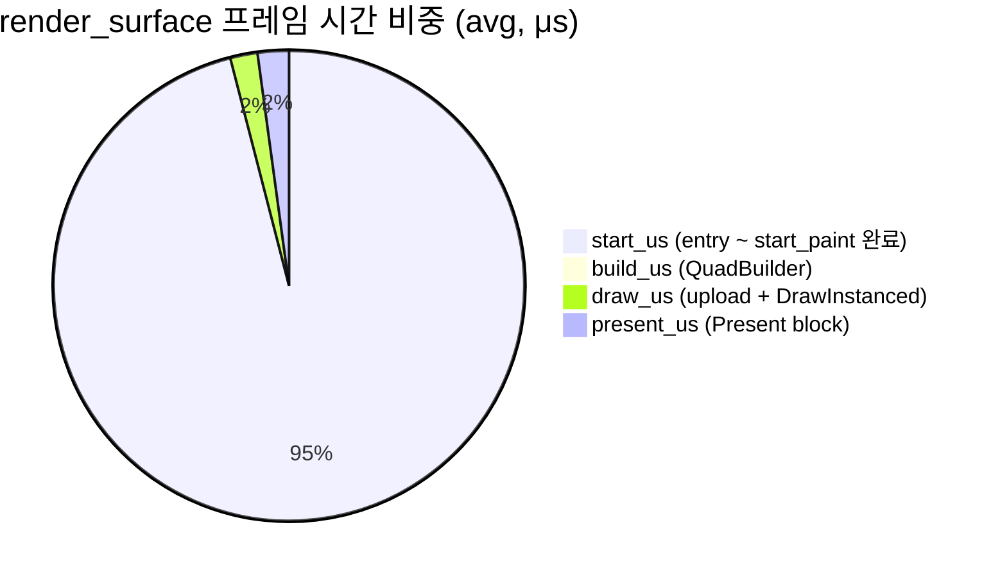

# M-14 W1 Baseline — Idle Release (2026-04-21)

> **한 줄 요약**: 1-pane idle Release 상태에서 GhostWin 렌더 루프는 `~60fps` 주석에도 불구하고 실측 **27.4fps**. 프레임당 평균 13.5ms 중 **95.6%** 가 `start_us` (render_surface 진입 ~ start_paint 완료까지의 전처리 + start_paint 본체) 구간에 집중. 이는 **W3 가 겨냥한 `force_all_dirty()` 제거 전 기준선** 으로, W3 직후 재측정의 비교 대상이다.

---

## 1. 이 문서의 목적

- M-14 작업 **이전** 렌더 성능 현주소를 수치로 고정
- W3 (force_all_dirty 제거 + visual_epoch 분리) / W4 / W5 의 **회귀 판정 기준선**
- 경쟁 터미널 비교 (WT / WezTerm / Alacritty) 가 아닌 **자기 비교 기준선** (before/after)
- PRD NFR 의 "초기 가설 budget" 을 실측 확정값으로 수정하는 근거

---

## 2. 수집 환경 (Reproducibility)

### 2.1 하드웨어

| 항목 | 값 |
|------|------|
| CPU | Intel Core Ultra 7 155H (16 cores / 22 threads, 3.8GHz max) |
| RAM | 31.5 GB |
| GPU | NVIDIA GeForce RTX 3050 4GB Laptop + Intel Arc (iGPU) |
| 내장 패널 | 2560 × 1600 @ 144Hz |
| 보조 (원격) | 2560 × 1440 @ 32Hz (RDP session adapter) |

> ⚠️ **주의**: 측정 시점에 GhostWin 창이 어느 모니터에 렌더됐는지 기록 없음. Present(1, 0) 의 VSync 대기 시간은 타겟 모니터 refresh rate 에 따라 다름 (144Hz → 6.94ms, 32Hz → 31.25ms). 이 baseline 해석 시 이 점을 염두.

### 2.2 소프트웨어

| 항목 | 값 |
|------|------|
| OS | Windows 11 Pro build 26200 |
| 컴파일러 | MSVC v145 (VS 18 Community), Windows SDK 10.0.22621.0 |
| Configuration | **Release** x64 (Design 5.3 go/no-go 기준) |
| Git branch | `feature/wpf-migration` |
| Git SHA | `19db612` — `feat(m14): add render perf instrumentation hooks` |
| ghostty submodule | `ghostwin-patches/v1` @ `4f658b4ad` (OPT 15 + OPT 16 포함) |

### 2.3 시나리오

| 항목 | 값 |
|------|------|
| 시나리오 | `idle` (앱 실행 후 60초간 입력 없음) |
| Pane 수 | 1 (기본 single-pane) |
| 측정 도구 | 내부 `render-perf` LOG_I 로그 + `scripts/measure_render_baseline.ps1` CSV 변환 |
| 외부 도구 | PresentMon **미실행** (Design 5.3 요구 — W5 비교 시점에 병행 예정) |
| 수집 시각 | 2026-04-21 07:49:57 KST |

---

## 3. 수치 결과

### 3.1 Summary Table

| 지표 | avg (μs) | p95 (μs) | max (μs) | 비고 |
|------|---------:|---------:|---------:|------|
| **`start_us`** | **12,924** | 19,574 | 33,193 | `render_surface` entry → `start_paint()` 완료 |
| `build_us` | 71 | 95 | 7,799 | QuadBuilder 2-pass + overlay |
| `draw_us` | 252 | 238 | 16,653 | `upload_and_draw_timed()` 중 Present 제외분 |
| `present_us` | 289 | 357 | 17,707 | `Present(1, 0)` 블로킹만 |
| `total_us` | 13,544 | 20,679 | 43,852 | `render_surface` 전체 |

### 3.2 파생 지표

| 지표 | 값 | 계산 |
|------|------|------|
| 실질 FPS | **27.4** | 1643 samples / 60s ※ |
| 프레임당 실질 주기 | **36.5ms** | 1 / 27.4fps |
| `start_us` 비중 | **95.6%** | 12,924 / 13,544 |
| 추정 렌더 스레드 사용률 | 약 37% (가설) | 13.5ms work / 36.5ms period |

> ※ **1643 samples = 프레임 수 해석이 성립하는 이유**: 현재 로그는 `start_paint()` 가 dirty 를 반환한 프레임에서만 찍힌다. 이번 idle 조건은 `force_all_dirty()` 가 매 프레임 호출되어 사실상 모든 프레임이 dirty == true 경로를 탄다. 따라서 로그 줄 수와 렌더 프레임 수가 일치한다. **W3 로 `force_all_dirty()` 가 제거되면 이 등식은 더 이상 성립하지 않는다** (skip 프레임이 로그 대상에서 빠짐) — 그 시점의 "실질 FPS" 계산 방법을 재설계해야 한다.

### 3.3 비중 시각화



---

## 4. 핵심 발견 5가지

### F1. 렌더 루프는 60fps 가 아니라 27fps — 원인은 가설 단계

**사실 (measured)**:

- 실측 평균 주기 36.5ms → 실질 27.4fps
- 코드 주석 `Sleep(16); // ~60fps` 와 불일치

**가설 (not yet measured — 다음 baseline 에서 확정/기각 필요)**:

1. Windows 타이머 분해능 기본값 15.6ms → `Sleep(16)` 이 실제로 15.6~31.2ms 간격으로 깸
2. 프레임당 작업 13.5ms → Sleep 후 깬 시점에 이미 다음 tick 을 놓쳐 대기
3. 이론 최소 `Sleep(16) + 13.5ms = 29.5ms`, 실측 36.5ms. 차이 7ms 는 **스레드 스케줄링 + 타이머 양자화 추정**

이 가설을 확정하려면 필요한 추가 측정:

- `timeBeginPeriod(1)` 설정 여부 / 현재 프로세스 타이머 분해능 조회 (`NtQueryTimerResolution`)
- `Sleep(16)` 호출 실측 반환 시간 (QPC pre/post) — 타이머 분해능 가설 검증
- 렌더 루프 iteration 시작 시각 분포 (히스토그램) — 양자화 패턴 가시화

### F2. `start_us` 가 전체 시간의 95.6% 를 독식

가장 중요한 발견. 단, `start_us` 의 **측정 범위가 `start_paint()` 단독이 아님** 을 명시해야 정확하다.

**`start_us` 가 실제로 포함하는 구간** (`render_surface` 본문 순서대로):

| 단계 | 작업 | 예상 비중 |
|------|------|-----------|
| 1 | staging 버퍼 확장 체크 (대부분 skip) | 무시 가능 |
| 2 | `session->conpty->vt_core()` 접근 | 무시 가능 |
| 3 | `ime_mutex` 하에 composition state 복사 | 수 μs |
| 4 | `composition_visible` 계산 | 무시 가능 |
| 5 | `force_all_dirty()` 호출 | 수 μs (bitset::set()) |
| 6 | **`start_paint(vt_mutex, vt)`** | **12.9ms 의 거의 전부 (가설)** |

즉 "`start_us` 가 95.6%" 는 사실이고, "그 중 `start_paint` 가 대부분을 먹을 것" 은 강한 가설이지만 **현 계측으로는 6번 단독 비용을 분리 확정하지 못함**. 다음 baseline 에선 6번 앞뒤로 QPC 를 하나 더 넣어 `start_paint_us` 를 독립 측정하면 확정 가능.

**start_paint 가 6번 내부에서 하는 일** (코드 확인):

- `vt_mutex` lock 획득
- `vt_core->for_each_row()` (Zig FFI) — 전체 row 순회
- `_api` 업데이트
- `_api` → `_p` 전체 복사 (dirty row 만 복사해야 하나, `force_all_dirty()` 때문에 **모든 row** 가 복사됨)

👉 **W3 가 `force_all_dirty()` 를 제거하면 "모든 row 강제 복사" 가 사라짐**. 단 start_paint 내부의 다른 고정 비용 (FFI 진입 / vt_mutex 획득) 은 남으므로 0 으로 떨어지진 않는다. W3 직후 baseline 에서 `start_us` 가 수십~수백 μs 로 떨어지면 이 가설이 정량 확정된다.

### F3. `build_us` (QuadBuilder) 는 병목이 아니다

71μs avg / 95μs p95. `render_state.h` 주석의 defensive guard (`row()` empty span) 이 잠재 비용이지만 실측에선 무의미한 수준. W2 에서 가드 제거가 성능에 주는 영향은 0 에 가까울 것.

### F4. `present_us` 가 의외로 저렴 — 원인은 여러 후보

**사실 (measured)**: `present_us` avg 289μs. `Present(1, 0)` 의 VSync 블로킹 기본값 (60Hz→16.67ms, 144Hz→6.94ms) 대비 훨씬 짧다.

**가능한 원인들 (해석 후보, 이번 측정만으로는 구분 불가)**:

| 후보 | 의미 |
|------|------|
| A. GhostWin 이 뒤처져 VSync 가 이미 지나감 | 다음 VSync 를 기다리지 않고 즉시 반환 |
| B. DXGI flip model 의 non-blocking 경로 | Flip discard + 적절한 swapchain 옵션 조합에서 일부 block 회피 |
| C. Swapchain waitable 이 이미 signaled | `frame_latency_waitable` 이 코드에 존재 — 확인 필요 |
| D. Present 큐 비어있음 | 초기 몇 프레임에선 즉시 반환 |

**확정 판정에 필요한 외부 측정**: PresentMon 의 `msBetweenPresents` 와 `msBetweenDisplayChange` 교차 확인. "VSync 에 매번 못 맞춤" 이라면 `msBetweenPresents` 가 refresh 주기 (6.94ms / 16.67ms) 배수로 튀고, `present_us` 는 일관되게 낮아야 한다.

즉 이 baseline 만으로는 "VSync miss" 를 **확정할 수 없다**. 후보 A 가 유력해 보이지만, B/C/D 를 배제하려면 PresentMon 병행 측정이 필요하다 — W5 에서 정리.

### F5. `max` 값은 startup 스파이크 — p95 를 기준으로

모든 `max` 가 `p95` 의 1.5~82× 수준. 특히 `build_us` 는 p95 95μs → max 7,799μs (82×). 앱 시작 직후 cold cache / first paint / glyph atlas 초기화 때문. 판정 기준으로는 **p95 를 쓴다**.

---

## 5. Design NFR 대비

Design 섹션 3.2 의 초기 가설 budget 은 **해당 시나리오 실측에서만 판정 가능**. 이 baseline 은 idle 전용이므로 load/resize NFR 판정에는 쓸 수 없다.

| NFR | 가설 Budget | 해당 시나리오 실측 | 평가 |
|-----|-------------|---------------------|------|
| **Idle CPU ≤ 2%** | 2% | ⏳ Task Manager/PerfMon 미기록 | 미판정 — 다음 idle 측정 시 병행 필수 |
| **Load p95 frame time ≤ 16.7ms (60fps)** | 16,700μs | **load 시나리오 미수집** | 미판정 — load baseline 후 가능 |
| **Resize p95 frame time ≤ 33ms (30fps)** | 33,000μs | **resize 시나리오 미수집** | 미판정 — 4-pane resize baseline 후 가능 |

> ⚠️ **주의**: idle p95 `total_us = 20,679μs` 는 **idle 조건의 구조적 비용**이며, load NFR budget 초과/미달 판정에는 쓰지 않는다. 시나리오별 NFR 은 해당 시나리오 실측 데이터로만 평가한다.

### 이 baseline 이 말할 수 있는 것

- 1-pane idle Release 상태에서 GhostWin 렌더 루프는 27.4fps, 프레임당 약 13.5ms (p95 20.6ms) 의 CPU 시간 사용
- 프레임 시간의 95.6% 가 `start_us` (start_paint 전처리 포함) 에 집중
- 이 구조는 W3 가 겨냥한 목표 (`force_all_dirty()` 상시 호출 제거) 의 **변경 전 수치** 로서 유효

### 이 baseline 이 **말할 수 없는** 것

- 경쟁 터미널 (WT/WezTerm/Alacritty) 과의 상대 위치 (비교 미수집)
- Load / Resize 시나리오의 성능 (해당 시나리오 미수집)
- Present 블록의 세부 원인 (PresentMon 병행 필요)
- Idle CPU % 절대값 (Task Manager 미기록)

---

## 6. 원시 자료 (Artifacts)

```
docs/04-report/features/m14-baseline/idle-20260421-074957/
├─ ghostwin.log        — 앱 raw 로그 (GHOSTWIN_LOG_FILE 대상)
├─ render-perf.csv     — 1643 rows × 12 columns (frame/sid/panes/vt_dirty/
│                        visual_dirty/resize/start_us/build_us/draw_us/
│                        present_us/total_us/quads)
└─ summary.txt         — avg/p95/max 요약표
```

> CSV 는 git LFS 미사용 프로젝트라 용량이 커지면 별도 관리 필요. 현재 ~100KB 이하라 직접 commit.

---

## 7. 주의사항 (Caveats)

| # | 내용 |
|---|------|
| C1 | **모니터 미기록** — 창이 144Hz vs 32Hz 중 어디서 렌더됐는지 불명. 다음 측정부터 `Get-WindowLocation` 같은 스크립트 보강 필요 |
| C2 | **PresentMon 미실행** — Present 블록이 VSync / driver queue / DWM 중 어느 것에 기인하는지 분리 불가. W5 에서 PresentMon 병행 필수 |
| C3 | **OPT 15 / OPT 16 fork patch** 영향 측정 안 됨 — R-07 대응으로 W1 scope 였으나 실측에서 제외됨. 추후 A/B 실행 시 별도 기록 |
| C4 | **load / resize 시나리오 미수집** — 사용자 상호작용 자동화가 W1 scope 밖이라 수동 실행 세션에서 보강 필요 |
| C5 | **시스템 백그라운드 부하 미기록** — CPU 에 다른 프로세스 (예: 이 Claude 세션 자체) 가 같이 돌았을 수 있음. Idle CPU 비율 절대값 해석 시 고려 |

---

## 8. 후속 baseline 수집 계획

| 시점 | 시나리오 | 목적 |
|------|----------|------|
| W1 추가 (선택) | load (heavy output) + resize (window drag) | idle 외 2 시나리오 before 기준선 |
| W1 추가 (선택) | idle 재측정 with PresentMon | Present 블록 분해 |
| **W3 직후** | idle 필수 + load 필수 | **force_all_dirty 제거 효과 정량 실증 (F2 가설 확정)** |
| W4 직후 | 4-pane resize | clean-surface skip 효과 |
| W5 | 전 시나리오 × Release × GhostWin vs WT/WezTerm/Alacritty | 최종 완료 게이트 판정 |

---

## 9. 재현 절차

```powershell
# 1. Release 솔루션 빌드
msbuild GhostWin.sln /p:Configuration=Release /p:Platform=x64

# 2. Idle baseline 수집 (60s)
.\scripts\measure_render_baseline.ps1 `
    -Scenario idle `
    -DurationSec 60 `
    -Configuration Release
# 산출물: docs/04-report/features/m14-baseline/idle-<timestamp>/
```

PresentMon 병행 시:

```powershell
.\scripts\measure_render_baseline.ps1 `
    -Scenario idle -DurationSec 60 -Configuration Release `
    -PresentMonPath "C:\Tools\PresentMon\PresentMon-x64.exe"
```

---

## 10. 변경 이력

| 버전 | 일시 | 내용 | 커밋 |
|------|------|------|------|
| 1.0 | 2026-04-21 | 초기 W1 idle baseline (commit 19db612) 기록 | — |
