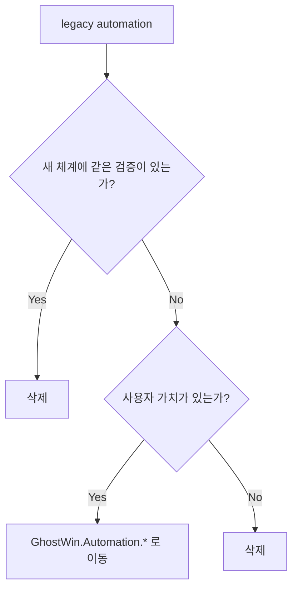

# Legacy Automation Inventory

작성일: 2026-05-09

## 맨 위 요약

이 문서는 테스트 자동화 정리의 삭제 기준이다. 목표는 의미 있는 UI 자동화는 `GhostWin.Automation.*` 체계로 유지하고, 실험용 runner, PoC 프로젝트, 단발성 script는 제거하는 것이다.



## 제거 기준

legacy 파일은 아래 3조건 중 하나를 만족하면 제거한다.

1. 같은 사용자 시나리오가 `GhostWin.Automation.Tests` 또는 `GhostWin.Automation.Runner`에 있다.
2. 실행 성공 이력보다 실패/진단 이력이 더 많고, 현재 `scripts/test_automation.ps1`에서 재현 가능한 대체 경로가 있다.
3. 저장소에 남아 있으면 안 되는 로컬 산출물이다. 예: `scripts/e2e/venv/`, 오래된 run artifact.

삭제하지 않고 이동해야 하는 파일은 아래 2조건을 모두 만족해야 한다.

1. 현재 제품 기능의 회귀를 잡는 사용자 가치가 있다.
2. `scripts/test_automation.ps1`에서 Daily, Interactive, Measurement, Diagnostic 중 하나로 실행할 수 있다.

## 현재 분류

| legacy 경로 | 새 위치 | 처리 |
|---|---|---|
| `tests/GhostWin.E2E.Tests/Tier1_FileState/FileStateScenarios.cs` | `tests/GhostWin.Automation.Tests/StateTests.cs` | 흡수 후 제거 |
| `tests/GhostWin.E2E.Tests/Tier2_UiaRead/UiaStructureScenarios.cs` | `tests/GhostWin.Automation.Tests/StructureTests.cs` | 흡수 후 제거 |
| `tests/GhostWin.E2E.Tests/Tier3_UiaProperty/NotificationRingScenarios.cs` | `tests/GhostWin.Automation.Tests/NotificationTests.cs` | 흡수 후 제거 |
| `tests/GhostWin.E2E.Tests/Tier3_UiaProperty/MouseCursorShapeScenarios.cs` | `tests/GhostWin.Automation.Tests/CursorOracleTests.cs` | 흡수 후 제거 |
| `tests/GhostWin.E2E.Tests/Tier4_Keyboard/Win32CursorSmokeScenarios.cs` | `tests/GhostWin.Automation.Tests/Interactive/Win32CursorSmokeTests.cs` | 이동 |
| `tests/GhostWin.E2E.Tests/MeasurementDriver/*.cs` | `tests/GhostWin.Automation.Runner/Measurement/` contract tests | 이동 |
| `tests/GhostWin.MeasurementDriver/` | `tests/GhostWin.Automation.Runner/Measurement/` | 이동 |
| `tests/e2e-flaui-cross-validation/` | 없음 | 삭제 |
| `tests/e2e-flaui-split-content/` | `tests/GhostWin.Automation.Tests/CommandTests.cs` | 대체 확인 후 삭제 |
| `scripts/e2e/e2e_operator/` | `tests/GhostWin.Automation.Runner/Diagnostics/` | 필요한 readiness/capture 아이디어만 흡수 후 삭제 |
| `scripts/e2e/runner.py` | `scripts/test_automation.ps1` | 삭제 |
| `scripts/e2e/requirements.txt` | 없음 | 삭제 |
| `scripts/e2e/venv/` | 없음 | 삭제 |
| `scripts/repro_first_pane.ps1` | Diagnostic scenario | 대체 후 삭제 |
| `scripts/test_m11_cwd_peb.ps1` | `tests/GhostWin.Automation.Tests/StateTests.cs` | 삭제 |
| `scripts/test_m11_e2e_restore.ps1` | `tests/GhostWin.Automation.Tests/StateTests.cs` | 삭제 |
| `scripts/test_settings_e2e.ps1` | `tests/GhostWin.Automation.Tests/SettingsTests.cs` | 삭제 |
| `scripts/test_settings_all_e2e.ps1` | `tests/GhostWin.Automation.Tests/SettingsTests.cs` | 삭제 |
| `scripts/test_korean_*.ps1` | `tests/GhostWin.Automation.Tests/Interactive/KoreanImeInteractiveTests.cs` | 유효 시나리오만 이동, 나머지 삭제 |
| `scripts/test_kr*.ps1` | `tests/GhostWin.Automation.Tests/Interactive/KoreanImeInteractiveTests.cs` | 유효 시나리오만 이동, 나머지 삭제 |
| `scripts/diag_e2e_*.ps1` | Diagnostic scenario | 대체 후 삭제 |

## 유지 대상

| 경로 | 이유 |
|---|---|
| `tests/GhostWin.Automation.Core/` | 앱 실행, 종료, artifact, wait, Test-Control IPC 공통 기반 |
| `tests/GhostWin.Automation.Core.Tests/` | 자동화 체계 자체의 contract 테스트 |
| `tests/GhostWin.Automation.Tests/` | 의미 있는 UI 자동화의 중심 |
| `tests/GhostWin.App.Tests/` | 제품 단위/계약 테스트 |
| `tests/GhostWin.Core.Tests/` | core model/policy 단위 테스트 |
| `tests/GhostWin.Engine.Tests/` | native engine 테스트 |
| `scripts/test_automation.ps1` | 단일 실행 입구 |
| `scripts/measure_render_baseline.ps1` | Measurement thin wrapper. 최종적으로 runner 위임만 남김 |

## 삭제 순서

| 순서 | 작업 | 이유 |
|---|---|---|
| 1 | PoC FlaUI 프로젝트 삭제 | 새 xUnit UI 자동화가 이미 command/structure를 담당 |
| 2 | Python artifact/venv 삭제 | 실행 코드가 아니라 저장소 오염 |
| 3 | Python runner 삭제 | 기존 실패 이력이 많고 새 runner가 대체 |
| 4 | 개별 PS1 삭제 | `scripts/test_automation.ps1`로 실행 입구 통합 |
| 5 | `GhostWin.E2E.Tests` 흡수 후 삭제 | 유효 커버리지를 새 프로젝트로 이동 |
| 6 | `GhostWin.MeasurementDriver` 이동 후 삭제 | Measurement도 Automation Runner 소유로 통합 |

## 완료 기준

```powershell
rg --files scripts | rg "test_|diag_|repro_|e2e"
```

허용 목록:

```text
scripts/test_automation.ps1
scripts/measure_render_baseline.ps1
scripts/e2e/evaluator_summary.schema.json
```

```powershell
Test-Path tests\GhostWin.E2E.Tests
Test-Path tests\GhostWin.MeasurementDriver
Test-Path tests\e2e-flaui-cross-validation
Test-Path tests\e2e-flaui-split-content
Test-Path scripts\e2e\e2e_operator
Test-Path scripts\e2e\venv
```

최종 결과는 모두 `False`여야 한다.

## 요약 한 줄

의미 있는 UI 자동화는 `GhostWin.Automation.*`로 살리고, 실험용/중복/실패 이력 중심의 테스트 자산은 삭제한다.
