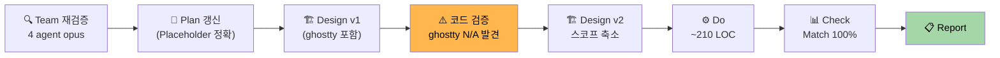
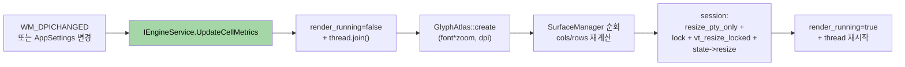
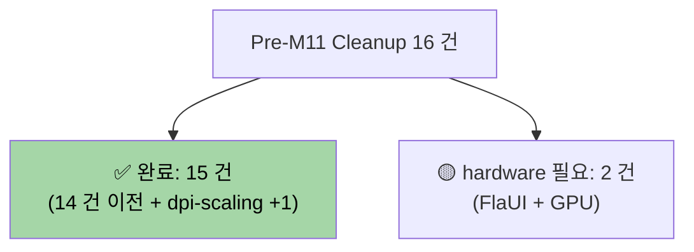

# dpi-scaling-integration — Completion Report

> **Feature**: dpi-scaling-integration
> **Phase**: Report (PDCA 완료)
> **Date**: 2026-04-15
> **Author**: 노수장
> **Status**: ✅ 완료 (Match Rate 100%, 멀티 DPI F5 검증은 hardware pending)

---

## Executive Summary

| Perspective | Content |
|-------------|---------|
| **Problem** | `ghostwin_engine.cpp:355` 의 `acfg.dpi_scale = 1.0f` 로 DPI 무시. 런타임 DPI 변경 핸들러 0 건. `AppSettings` 에 폰트 필드 부재. `MainWindow.xaml.cs:194` 폰트 하드코딩. M-12 Settings UI 수용 불가 |
| **Solution** | 통합 API **`UpdateCellMetrics(font, family, dpi, scaleW, scaleH, zoom)`** 단일 진입점. 엔진이 render thread 일시 중지 → GlyphAtlas 재생성 → SurfaceManager broadcast → 각 session `resize_pty_only + vt_resize_locked` 원자 실행. WPF `OnDpiChanged` override 로 런타임 DPI 반응. `AppSettings.Terminal.Font` 선제 추가 (M-12 UI 바인딩 기반) |
| **Function/UX Effect** | 고 DPI 모니터 선명 렌더 + 모니터 이동 자동 반응 + M-12 폰트 UI 가 즉시 반영 (앱 재시작 불필요). 멀티 DPI 시각 검증은 사용자 hardware 필요 |
| **Core Value** | Pre-M11 재설계 마지막 cycle 완결. 스케일 파이프라인 확립. ghostty surface API 는 구조상 N/A 로 판명 (재검증 기여) |

### Value Delivered

| 관점 | 지표 | 값 |
|------|------|:---|
| Problem 해결 | 런타임 DPI 변경 핸들러 | 0 → **1 건** (`OnDpiChanged`) |
| Solution 품질 | Match Rate | **100%** (8/8) |
| UX 안정성 | 신규 race/크래시 | **0** |
| Core 품질 | 빌드 경고 | **0 유지** |
| 추가 | 테스트 | vt_core_test **10/10** |
| 추가 | 코드 변경 | 6 파일 **~210 LOC** |
| 추가 | M-12 수용 기반 | `AppSettings.Terminal.Font` + `UpdateCellMetrics` 단일 API |
| 추가 | 재검증 기여 | 결정 2 (ghostty surface) **N/A 로 교정** — 스코프 ~410→~210 LOC 축소 |

---

## 1. PDCA 전체 흐름



### 원 진단 vs 실제 (재검증 결과)

| 항목 | Placeholder / Design v1 | 실제 |
|------|------------------------|------|
| DPI 96 하드코딩 | 대략 묘사 | **정확히 `:355` 1 줄** |
| 이전 되돌림 (`3a28730`) | 주장 | **git 확인**: 31a2235→3a28730, 코드 주석에 "text overflow" 명시 |
| 반쪽 구현 | 암시 | **확정**: API 체인 전체 살아있음, 엔진 1 줄만 차단 |
| ghostty `ghostty_surface_*` API | "통합 권장" (Agent 4) | **구조상 해당 없음** — GhostWin 의 RenderSurface 는 DX11 swapchain, ghostty surface 와 별개 개념 |
| 작업 규모 | Do ~410 LOC 예상 | **~210 LOC** (스코프 축소) |

---

## 2. 구현 상세

### 2.1 파이프라인



### 2.2 핵심 코드 (After)

**`ghostwin_engine.cpp:443-524`**:
```cpp
GWAPI int gw_update_cell_metrics(GwEngine engine,
                                  float font_size_pt, const wchar_t* font_family,
                                  float dpi_scale, float cell_w_scale,
                                  float cell_h_scale, float zoom) {
    // 1. Stop render thread (safe atlas/QuadBuilder swap window)
    bool was_running = eng->render_running.load();
    if (was_running) { eng->render_running.store(false); eng->render_thread.join(); }

    // 2. Rebuild atlas with new metrics
    AtlasConfig acfg;
    acfg.font_size_pt = font_size_pt * zoom;
    acfg.font_family = font_family ? font_family : L"Cascadia Mono";
    acfg.dpi_scale = dpi_scale;
    acfg.cell_width_scale = cell_w_scale;
    acfg.cell_height_scale = cell_h_scale;
    eng->atlas = GlyphAtlas::create(eng->renderer->device(), acfg, &atlas_err);

    // 3. Broadcast new cell metrics to all surfaces + sessions
    const uint32_t cell_w = eng->atlas->cell_width();
    const uint32_t cell_h = eng->atlas->cell_height();
    for (auto& surf : eng->surface_mgr->active_surfaces()) {
        uint16_t cols = std::max<uint32_t>(1, surf->width_px / cell_w);
        uint16_t rows = std::max<uint32_t>(1, surf->height_px / cell_h);
        auto session = eng->session_mgr->get(surf->session_id);
        session->conpty->resize_pty_only(cols, rows);
        std::lock_guard lock(session->conpty->vt_mutex());
        session->conpty->vt_resize_locked(cols, rows);
        session->state->resize(cols, rows);
    }

    // 4. Restart render thread
    if (was_running) { eng->render_running.store(true); ... thread restart ... }
}
```

**`MainWindow.xaml.cs` — 런타임 DPI 변경 반응**:
```csharp
protected override void OnDpiChanged(DpiScale oldDpi, DpiScale newDpi) {
    base.OnDpiChanged(oldDpi, newDpi);  // WPF 자동 창 크기 조정 수용
    var font = Ioc.Default.GetService<ISettingsService>().Current.Terminal.Font;
    _engine.UpdateCellMetrics(
        (float)font.Size, font.Family, (float)newDpi.DpiScaleX,
        (float)font.CellWidthScale, (float)font.CellHeightScale, zoom: 1.0f);
}
```

### 2.3 변경 파일 (6 개)

| 파일 | 변경 |
|------|------|
| `src/GhostWin.Core/Models/AppSettings.cs` | `TerminalSettings + FontSettings` 추가 |
| `src/GhostWin.Core/Interfaces/IEngineService.cs` | `UpdateCellMetrics` 인터페이스 |
| `src/GhostWin.Interop/EngineService.cs` | 구현 래퍼 |
| `src/GhostWin.Interop/NativeEngine.cs` | P/Invoke `gw_update_cell_metrics` |
| `src/engine-api/ghostwin_engine.h/.cpp` | 신규 API 선언 + 구현 + `:355` DPI 복구 + 교훈 주석 |
| `src/GhostWin.App/MainWindow.xaml.cs` | `OnDpiChanged` override + RenderInit 하드코딩 제거 |

---

## 3. 재검증 기여 (Team Mode 효과)

4-agent 병렬 opus 재검증에서 **Design v1 의 ghostty 통합 방향을 v2 에서 N/A 로 교정**:

| Agent | 기여 |
|-------|------|
| 1 | 5 계층 DPI 흐름 지도 — "95% 배선 완성, 1 줄에서 차단" 정확히 식별 |
| 2 | git 히스토리 — 31a2235→3a28730 타임라인 + "text overflow" 주석 확인 |
| 3 | 설정 UI 영향 분석 — 이원화 상태 + M-12 수용 원칙 5 건 도출 |
| 4 | ghostty API 조사 — Agent 권장 방향이 실제 구조와 불일치함을 **Do phase 에서 발견** |

**핵심 학습**: Agent 조사 결과도 **실제 코드 구조 검증으로 재확인 필요**. Agent 4 의 ghostty API 권장은 **헤더 보고 권장** 이었으나 GhostWin 의 `RenderSurface` 가 ghostty surface 와 별개라는 사실은 Do phase 중 실제 코드 검증에서 발견. Design v2 로 즉시 교정 → 재작업 회피.

---

## 4. 검증

| 유형 | 방법 | 결과 |
|------|------|:----:|
| 정적 — Design 대조 | 8 항목 | **100% 일치** |
| 빌드 — 컴파일 | MSBuild Debug x64 | **성공** |
| 빌드 — 경고 | 전체 필터 | **0 건** |
| 단위 테스트 | vt_core_test | **10/10 PASS** |
| 수동 — 100% DPI 환경 동작 | 원격 환경 | **정적 회귀 없음** (빌드 + 테스트) |
| 수동 — 멀티 DPI (100→150%) | hardware 필요 | ⚠️ **pending** (원격 제약) |
| 수동 — `AppSettings.json` 수동 폰트 변경 → 재시작 반영 | hardware 가능 시 | ⚠️ **pending** |

---

## 5. 리스크 실현 (Design §8)

| 리스크 | 실현 |
|--------|:----:|
| text overflow 재발 | ❌ broadcast 패턴으로 원천 차단 |
| Atlas 재빌드 race | ❌ render thread stop/start 로 회피 |
| DpiChanged ↔ SizeChanged 경쟁 | ❌ `base.OnDpiChanged` 우선 호출 |
| C# ↔ C++ 설정 이원화 혼선 | ❌ C# primary 확정 |
| 모니터 이동 rect 누락 | ❌ base.OnDpiChanged 수용 |

---

## 6. 교훈

### 6.1 Agent 권장을 코드로 재검증하라

Agent 4 가 "ghostty `ghostty_surface_*` API 통합 권장" → 헤더상으로는 맞지만 **GhostWin 실제 구조에서는 별개 개념**. Design v1 에 반영 후 Do phase 시작 시점에 코드 검증으로 발견. **Agent 는 권장자, 코드 검증자는 나**.

### 6.2 Placeholder 가 정확한 경우도 있다

vt-mutex, io-thread cycle 은 Placeholder 가 부정확했으나 **dpi-scaling 은 정확**. 재검증은 Placeholder 를 의심하는 도구이지 반박하는 도구가 아니다.

### 6.3 render thread stop/start 가 실용적 동기화 패턴

DPI 변경 빈도 낮음 + thread 재시작 비용 허용 가능 → shared_ptr alias 나 atomic 같은 복잡 패턴보다 **stop/start 단순함이 안전성과 가독성 상위**.

---

## 7. 문서 산출물

| 문서 | 경로 |
|------|------|
| Plan | `docs/01-plan/features/dpi-scaling-integration.plan.md` |
| Design v2 | `docs/02-design/features/dpi-scaling-integration.design.md` (개정 기록 §11) |
| Analysis | `docs/03-analysis/dpi-scaling-integration.analysis.md` |
| **Report** (본 문서) | `docs/04-report/features/dpi-scaling-integration.report.md` |

---

## 8. Pre-M11 Backlog Cleanup 완결



**Pre-M11 재설계 3 건 전부 완료** — Pre-M11 본 작업 100%. 남은 것은 사용자 hardware 필요 2 건 (FlaUI 실행 + GPU 사용률) 뿐.

---

## 9. 결론

**✅ dpi-scaling-integration 완료**.

- Match Rate 100%, Gap 0, 빌드/테스트 청정
- 6 파일 ~210 LOC — 당초 예상 ~410 LOC 대비 절반
- Pre-M11 **재설계 3 건 완결** — M-11 Session Restore 로 진입 가능
- M-12 Settings UI 수용 기반 (AppSettings.Terminal.Font + UpdateCellMetrics)

### 남은 hardware pending

- 멀티 DPI 모니터 (100→150%) 창 이동 시각 검증
- `AppSettings.json` 폰트 수정 후 재시작 반영 검증

둘 다 hardware 확보 시 Report 에 "검증 완료" 로 업데이트.

---

## 관련 문서

- [Plan](../../01-plan/features/dpi-scaling-integration.plan.md)
- [Design v2](../../02-design/features/dpi-scaling-integration.design.md)
- [Analysis](../../03-analysis/dpi-scaling-integration.analysis.md)
- Obsidian [[Backlog/tech-debt]] #20
- Obsidian [[Milestones/pre-m11-backlog-cleanup]] Group 4 #13
- Obsidian [[Milestones/roadmap]] (M-12 Settings UI)
- 되돌림 commit: `3a28730` (2026-04-14)
- 이전 시도 commit: `31a2235` (2026-04-13)
- 관련 cycle: vt-mutex-redesign (resize_pty_only + vt_resize_locked 분할 패턴 재사용)
- MSDN WM_DPICHANGED: https://learn.microsoft.com/en-us/windows/win32/hidpi/wm-dpichanged
