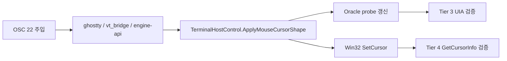

# FR-02 Mouse Cursor Automation 완료 보고서

> **문서 종류**: Completion Report
> **작성일**: 2026-04-20
> **대상 범위**: FR-02 마우스 커서 자동화 (Tier 3 Oracle + Tier 4 Win32 smoke)

---

## 한 줄 요약

FR-02 자동화는 **계획한 핵심 범위를 모두 완료**했다. 기본 경로는 Oracle UIA 로 회귀를 잡고, 보조 경로는 Win32 `GetCursorInfo()` 로 실제 OS 커서를 확인한다.

## 지금 어떻게 검증하나

## 무엇을 구현했나

| 영역 | 파일 | 역할 |
|------|------|------|
| Oracle state | `src/GhostWin.App/Input/MouseCursorOracleState.cs` | 마지막 `shape / cursorId / sessionId` 상태 보관 |
| Oracle publish | `src/GhostWin.App/Input/MouseCursorOracleProbe.cs` | host 적용 시 probe 이벤트 발행 |
| Oracle format | `src/GhostWin.App/Input/MouseCursorOracleFormatter.cs` | `shape=8 (TEXT)` 같은 문자열 직렬화 |
| UIA probe | `src/GhostWin.App/MainWindow.xaml`, `MainWindow.xaml.cs` | 0x0 button + AutomationProperties.Name/HelpText 노출 |
| Host hookup | `src/GhostWin.App/Controls/TerminalHostControl.cs` | `ApplyMouseCursorShape()` 최종 적용 지점에서 oracle publish |
| Injector | `tests/GhostWin.E2E.Tests/Stubs/OscInjector.cs` | same-process test helper + running-app named pipe helper |
| Tier 3 | `tests/GhostWin.E2E.Tests/Tier3_UiaProperty/MouseCursorShapeScenarios.cs` | oracle UIA 검증 |
| Tier 4 | `tests/GhostWin.E2E.Tests/Tier4_Keyboard/Win32CursorSmokeScenarios.cs` | 실커서 smoke |

## 설계와 달라진 점

| 계획 | 실제 구현 | 이유 |
|------|------|------|
| hidden `TextBlock` probe | **0x0 `Button` probe** | WPF/UIA 에서 더 안정적으로 노출됨 |
| `TestOnlyInjectBytes` = stdin write | **direct VT injection** | `OSC 22` 는 VT output parser 가 봐야 함 |
| Win32 smoke = `SetCursorPos + GetCursorInfo` | **`SetCursorPos + WM_SETCURSOR + GetCursorInfo`** | hover 타이밍 불안정성을 줄임 |

## 검증 결과

| 테스트 | 결과 |
|------|------|
| `MouseCursorOracleFormatterTests` | PASS |
| `SessionManagerMouseShapeTests` | PASS |
| `OscInjectorTests` | PASS |
| `UiaStructureScenarios.E2E_MouseCursor*` | PASS |
| `MouseCursorShapeScenarios` | PASS |
| `Win32CursorSmokeScenarios` | PASS |

## 왜 이 구조가 맞나

| 방법 | 장점 | 한계 |
|------|------|------|
| Tier 3 Oracle | deterministic, CI 친화적, root cause 분리 쉬움 | 앱 내부 probe 필요 |
| Tier 4 Win32 smoke | 실제 OS cursor 확인 가능 | interactive desktop 의존, Nightly/Slow 적합 |

## 결론

FR-02 자동화는 이제 두 층으로 닫혔다.

- **Tier 3**: 빠르고 안정적인 기본 회귀망
- **Tier 4**: 실제 OS cursor 를 확인하는 보조 smoke

즉, "수동으로 되는 것 같다" 수준이 아니라 **회귀를 자동으로 잡는 상태**까지 올라왔다.
