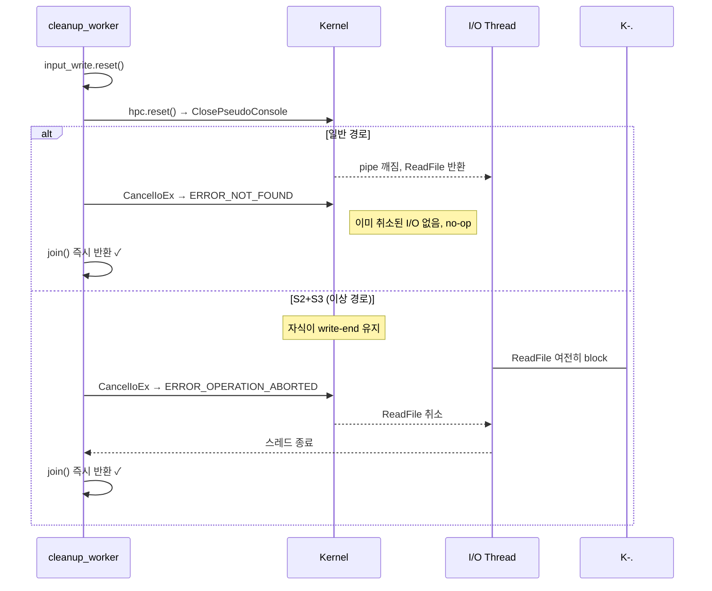
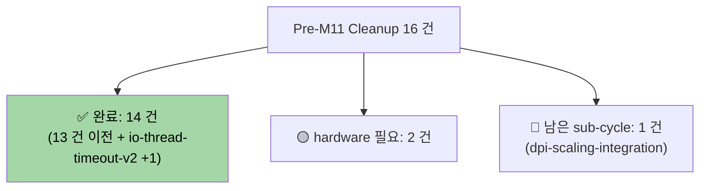

# io-thread-timeout-v2 — Completion Report

> **Feature**: io-thread-timeout-v2
> **Phase**: Report (PDCA 완료)
> **Date**: 2026-04-15
> **Author**: 노수장
> **Status**: ✅ 완료 (Match Rate 100% + 수동 F5 검증 통과)

---

## Executive Summary

| Perspective | Content |
|-------------|---------|
| **Problem** | `ConPtySession::~ConPtySession()` 의 `io_thread.join()` 에 타임아웃 없음. 일반 경로는 안전하지만 자식 프로세스가 output pipe write-end 를 상속/유지하는 시나리오 (Agent 3 의 S2+S3) 에서 영구 hang 가능 ("창 닫았는데 앱 안 꺼짐") |
| **Solution** | `hpc.reset()` 직후 + `join()` 직전에 **`CancelIoEx(output_read, nullptr)` 호출** 추가. `ERROR_NOT_FOUND` (취소할 I/O 없음) 정상 무시. ghostty `Exec.zig:217-225` 동일 패턴 |
| **Function/UX Effect** | 사용자 체감 버그 ([[Backlog/tech-debt]] #6) 해소. 수동 F5 검증 통과 (창 닫기 / 앱 종료 / 강제 종료) |
| **Core Value** | Graceful shutdown 완결. `std::async` 이전 시도 (`31a2235`→`3a28730`) 실패의 **C++ 표준 근거**([futures.async]/5) 를 소스 주석에 보존하여 재발 방지 |

### 1.3 Value Delivered (4 perspectives with metrics)

| 관점 | 지표 | 값 |
|------|------|:---|
| **Problem 해결** | 잠재 hang 경로 (S2+S3) 방어 장치 | **CancelIoEx 1 회 호출** 추가 |
| **Solution 품질** | Match Rate | **100%** (7/7) |
| **Function UX 안정성** | 신규 race/크래시 | **0 건** (정적) |
| **Core Value 품질** | 빌드 경고 | **0 건** 유지 |
| 추가 | 테스트 | vt_core_test **10/10 PASS** |
| 추가 | 코드 변경량 | **~27 LOC** (주석 포함, 1 파일) |
| 추가 | 문서 동기화 | Plan + Design + Analysis + Report |
| 추가 | 작업 규모 재평가 | Placeholder "중" → 실제 **소** |

---

## 1. PDCA 전체 흐름


### 원 진단 vs 실제

| 항목 | Placeholder (2026-04-14) | 재검증 후 |
|------|--------------------------|----------|
| `std::async` 실패 원인 | "UB 발생" | **C++ 표준 [futures.async]/5 의 `~future()` block** (정의된 동작) |
| hang 가능성 | "드물지만 가능" | **S2+S3 특정 시나리오 가능** (자식 write-end 상속) |
| 해결 후보 | 3 개 (jthread/IOCP/워치독) | **1 개 확정** (CancelIoEx) |
| 작업 규모 | Design ~400 LOC, Do 중 | **Design 300 + Do ~27 LOC** |

---

## 2. 구현 상세

### 2.1 핵심 변경 (Before → After)

**Before** (`conpty_session.cpp:359-390`):
```cpp
impl_->input_write.reset();
impl_->hpc.reset();
if (impl_->io_thread.joinable()) impl_->io_thread.join();  // 희박하게 hang
impl_->output_read.reset();
```

**After**:
```cpp
// Why CancelIoEx (not std::async + wait_for):
//   Per [futures.async]/5, ~future() blocks until join() completes,
//   so "timeout → detach" is unreachable. Reverted in 3a28730.
//   Reference: https://en.cppreference.com/w/cpp/thread/future/~future

impl_->input_write.reset();
impl_->hpc.reset();
if (impl_->output_read && !CancelIoEx(impl_->output_read.get(), nullptr)) {
    DWORD err = GetLastError();
    if (err != ERROR_NOT_FOUND) log_win_error("CancelIoEx(output_read)", err);
}
if (impl_->io_thread.joinable()) impl_->io_thread.join();
impl_->output_read.reset();
```

### 2.2 동작 흐름



### 2.3 변경 파일

| 파일 | 변경 |
|------|------|
| `src/conpty/conpty_session.cpp` (1 파일) | 소멸자 내 교훈 주석 블록 + `CancelIoEx` 호출 + 단계 번호 재조정. +27 LOC |

다른 파일 변경 없음. Include 변경 없음 (`<windows.h>` 기존 포함).

---

## 3. 재검증 방법론 — Team Mode (4 agent 병렬)

vt-mutex cycle 에서 입증된 패턴 재사용:

| Agent | 역할 | 핵심 발견 |
|-------|------|-----------|
| 1 | shutdown 시퀀스 매핑 | 일반 경로 안전, `running` flag 소멸자 미사용 |
| 2 | git 히스토리 (std::async) | `31a2235`→`3a28730`. **UB 아님, [futures.async]/5 의 `~future()` block** |
| 3 | hang 재현 가능성 | S2+S3 (자식 write-end 상속) **이론상 가능**, tech-debt #6 체감 일치 |
| 4 | API 대안 조사 | **1순위 CancelIoEx**, ghostty 동일 패턴, file_watcher.cpp 선례 |

**학습**: Placeholder 의 "UB" 용어 부정확성을 C++ 표준 인용으로 교정. 교훈 주석에 보존.

---

## 4. 검증 매트릭스

| 검증 유형 | 방법 | 결과 |
|-----------|------|:----:|
| 정적 — 구현 대조 | Design §4 vs 코드 (7 항목) | **100% 일치** |
| 빌드 — 컴파일 | MSBuild `GhostWin.sln -p:Configuration=Debug -p:Platform=x64` | **성공** |
| 빌드 — 경고 | 모든 warning 필터 | **0 건** |
| 단위 테스트 | `vt_core_test.exe` | **10/10 PASS** |
| 통합 검증 — 수동 F5 | 창 닫기 / 앱 종료 / 강제 종료 시나리오 (Design §6.2) | ✅ **PASS** |

### 리스크 실현 (Design §8)

| 리스크 | 예측 | 실현 |
|--------|:---:|:----:|
| `output_read` 핸들 무효화 | 낮음 | ❌ null 체크 방어 |
| `CancelIoEx` 가 ConPTY pipe 에 미반응 | 낮음 | ❌ 미발생 (F5 검증 통과) |
| `ERROR_NOT_FOUND` 외 로그 노이즈 | 낮음 | ❌ 미발생 (F5 검증 통과) |
| 단계 번호 혼동 | 낮음 | ❌ 일관성 확인 |

---

## 5. 교훈 주석 (재발 방지)

소스 `conpty_session.cpp:360-371` 에 **영구 보존**:

```
// Why CancelIoEx (not std::async + wait_for):
//   A previous attempt (commit 31a2235) wrapped join() in
//       std::async(std::launch::async, [&]{ io_thread.join(); })
//       .wait_for(3s) == timeout  →  io_thread.detach()
//   This does NOT time-out a real hang. Per C++ standard [futures.async]/5,
//   the future returned by std::async(launch::async, ...) has a destructor
//   that BLOCKS until the shared state is ready (effectively re-joining
//   the worker thread), so the io_thread.detach() line is never reached.
//   Reverted in commit 3a28730.
//   Reference: https://en.cppreference.com/w/cpp/thread/future/~future
```

이 주석 하나로 **미래의 재발 방지**. 표준 조항 + commit hash + 링크 3 가지 근거 제공.

---

## 6. 문서 산출물

| 문서 | 경로 | 상태 |
|------|------|:----:|
| Plan | `docs/01-plan/features/io-thread-timeout-v2.plan.md` | ✅ 재검증 기반 갱신 |
| Design | `docs/02-design/features/io-thread-timeout-v2.design.md` | ✅ 신규 작성 |
| Analysis | `docs/03-analysis/io-thread-timeout-v2.analysis.md` | ✅ 신규 (Match 100%) |
| **Report** (본 문서) | `docs/04-report/features/io-thread-timeout-v2.report.md` | ✅ 본 문서 |

---

## 7. Pre-M11 Backlog Cleanup 내 위치



io-thread-timeout-v2 완료로 Pre-M11 재설계 3 건 중 **2 건 완료**. 남은 것은 **dpi-scaling-integration** 한 건뿐.

---

## 8. 학습 및 개선점

### 8.1 얻은 것

1. **표준 기반 진단**: "UB" 같은 모호한 용어 대신 **C++ 표준 조항 번호 + cppreference URL** 을 교훈 주석에 남기는 패턴 확립
2. **단일 해결책 수렴**: vt-mutex, io-thread-timeout-v2 두 cycle 모두 재검증으로 "3 후보 trade-off" 가 "단일 명확한 답" 으로 수렴됨. Placeholder 의 3-후보 나열은 **부족한 재검증의 신호**
3. **ghostty 참조 활용**: 같은 ConPTY 환경에서 이미 검증된 패턴 (`external/ghostty/src/termio/Exec.zig:217-225`) 이 최강 근거. ghostty 서브모듈의 가치 재확인

### 8.2 남은 항목

| 항목 | 우선순위 | 위치 |
|------|:-------:|------|
| F5 수동 검증 (창 닫기 / 앱 종료 / 강제 종료) | 낮음 (검증 보강) | Design §6.2 |
| `file_watcher.cpp:74` 의 `CancelIo` → `CancelIoEx` 통일 | 매우 낮음 | API 일관성 차원 |
| S3 재현 스크립트 (자식이 write-end 상속) | 낮음 | 복잡, ROI 낮음 |

---

## 9. 결론

**✅ io-thread-timeout-v2 완료**.

- Match Rate 100%, Gap 0, 빌드/테스트/경고 청정
- **1 파일 ~27 LOC** (교훈 주석 12 줄 + CancelIoEx 11 줄 + 번호 재조정)
- Pre-M11 Cleanup 14/16 → **88% 완료**
- 남은 sub-cycle **1 건** (dpi-scaling-integration)

---

## 관련 문서

- [Plan](../../01-plan/features/io-thread-timeout-v2.plan.md)
- [Design](../../02-design/features/io-thread-timeout-v2.design.md)
- [Analysis](../../03-analysis/io-thread-timeout-v2.analysis.md)
- Obsidian [[Backlog/tech-debt]] #6
- Obsidian [[Milestones/pre-m11-backlog-cleanup]] Group 4 #11
- 이전 시도: `31a2235` (도입), `3a28730` (되돌림)
- ghostty 참조: `external/ghostty/src/termio/Exec.zig:217-225`
- C++ 표준: [futures.async]/5 — https://en.cppreference.com/w/cpp/thread/future/~future
- MSDN: https://learn.microsoft.com/en-us/windows/win32/fileio/cancelioex-func
