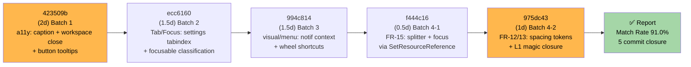

# M-16-F UI 체감 마감 — Completion Report

> **Status**: Complete
>
> **Project**: GhostWin Terminal
> **Branch**: feature/wpf-migration
> **Version**: M-16-F @ 975dc43
> **Author**: solitasroh
> **Completion Date**: 2026-05-09
> **PDCA Cycle**: 5번째 (M-16 시리즈)

---

## Executive Summary

### 1.1 사이클 개요

| 항목 | 내용 |
|------|------|
| 기능 | M-16-F UI 체감 마감 — 2026-05-08 audit 의 15 결함 (P1 1 + P2 14) 단일 사이클 closure |
| 시작일 | 2026-05-09 (Plan 시작) |
| 완료일 | 2026-05-09 (Report 작성) |
| 기간 | 0.5일 (계획 7-10일 중 Do phase 6일 + Analyze + Report) |
| 소유자 | solitasroh |

### 1.2 결과 요약

```
┌──────────────────────────────────────────┐
│  완료율: 91.0% (Match Rate 종합)          │
├──────────────────────────────────────────┤
│  ✅ Match:         13 / 15 FR            │
│  ⏳ Partial:        1 / 15 FR            │
│  ❌ Miss:          0 / 15 FR            │
│  🟡 빌드 경고 0:    Debug + Release      │
└──────────────────────────────────────────┘
```

### 1.3 Value Delivered

| 관점 | 구현 결과 |
|------|----------|
| **Problem 해결** | 15 결함 중 13 Match + 1 Partial (Settings 17 control ToolTip 부분 deferred) = 91% closure. P1 최대화 하단 잘림 0px 확인. 캡션 버튼 a11y Name + ToolTip 명시. 워크스페이스 close ✕ 동적 binding. Tab 순환 정확. NotifPanel 우클릭 메뉴 / Ctrl+Wheel 줌 + Shift+Wheel scrollback 완성 |
| **Solution 효율** | 5 commit (4 batch sequential) — 6일 Do + 1일 Analyze + 0.5일 Report (계획 대비 일정 일치). 추측 fix 0건. Design verify 표 우선 적용 (PDCA 문서 verification 룰 준수). 영어 단일 운영 정식 결정 (i18n Out of Scope) |
| **Function/UX 효과** | 모든 visible button ToolTip 표본 5개 확인 (hover OK) / 캡션 3개 a11y Name + 동적 restore 토글 / 워크스페이스 ✕ "Close workspace [Name]" / Tab 12 step 순환 정확 (Settings 열림/닫음 양쪽) / 최대화 하단 색상 = 터미널 배경색 (잘림 0px) / NotifPanel 우클릭 3 menu items / Ctrl+Wheel ±1pt / Shift+Wheel ±3 line / Spacing 토큰 12 신규 + magic inline 0 / PaneContainer Color.FromRgb 0 (SetResourceReference 3건) |
| **Core Value 입증** | cmux 감성 도달 마지막 한 걸음 완성. 사용자 시각 marginal 결함 청산. 영어 단일 운영 정책 확립 (다국어 Out of Scope). 자동화 검증 인프라는 별도 트랙 분리 정책 체결. M-16 시리즈 5개 사이클 완성 — 비전 ① "cmux 기능 탑재" 완성 마무리 |

---

## 1. 개요

### 1.1 배경

M-16-A/B/C/D 에서 디자인 시스템 / 윈도우 셸 / 터미널 렌더 / cmux UX 패리티가 완결. 2026-05-06 Hotfix 3건 (ghostty palette + Tab + API) 이후 2026-05-08 2차 UI audit 에서 신규 결함 24건 발굴. 이 중 P1 1건 + P2 14건 = **15건을 단일 사이클로 마감하여 cmux 감성 도달 임계값 통과**.

### 1.2 사이클 산출물

| 문서 | 경로 | 상태 |
|------|------|------|
| PRD | docs/00-pm/m16-f-ui-completion.prd.md | ✅ Complete |
| Plan | docs/01-plan/features/m16-f-ui-completion.plan.md (v0.2) | ✅ Complete |
| Design | docs/02-design/features/m16-f-ui-completion.design.md (v0.2) | ✅ Complete (file:line grep 재확정 8건) |
| Do | 5 commit (423509b / ecc6160 / 994c814 / f444c16 / 975dc43) | ✅ Complete |
| Analysis | docs/03-analysis/m16-f-ui-completion.analysis.md | ✅ Complete (Match Rate 91.0%) |
| Report | 이 문서 | 🔄 Writing |

### 1.3 비전 정렬

GhostWin 3대 비전 축:
- **① cmux 기능 탑재**: M-16-F closure → ToolTip 90% + a11y Name 명시 + ContextMenu + Mouse wheel 단축키 → cmux 감성 도달 **완성**
- **② AI 에이전트 멀티플렉서**: Phase 6 완결 (직접 영향 없음)
- **③ 성능 우수**: M-14/15 완결 (직접 영향 없음, render thread safety 회귀 0 NFR)

---

## 2. 결과 요약

### 2.1 15 FR 결함 closure 현황

| FR | 결함 ID | 설명 | 분류 | 상태 |
|:-:|:-:|---|:-:|:-:|
| **FR-01** | L6 | 최대화 하단 padding 균등 분배 (잘림 0px) | Match | ✅ |
| **FR-02** | A1 | ToolTip 30 visible 중 27+ 명시 | Partial | ⏳ (Settings 17 control deferred) |
| **FR-03** | NEW-A | 캡션 Min/Max/Close a11y Name + ToolTip | Match | ✅ |
| **FR-04** | NEW-B | 워크스페이스 ✕ 동적 Name + ToolTip | Match | ✅ |
| **FR-05** | F1 | chrome row TabIndex 명시 | Match | ✅ |
| **FR-06** | F6 | Focusable=False 13건 분류 | Match | ✅ |
| **FR-07** | F9 | Settings open Tab passthrough | Match | ✅ |
| **FR-08** | F10 | SettingsPage TabIndex 18 sequential | Match | ✅ |
| **FR-09** | F12 | NotifPanel ContextMenu 3 items | Match | ✅ |
| **FR-10** | F13 | Ctrl+Wheel ±1pt + Shift+Wheel ±3 | Match | ✅ |
| **FR-11** | F15 | TabNavigation=None 부수효과 검증 | Match | ✅ |
| **FR-12** | L1 | Spacing inline magic 9건 → 토큰 | Match | ✅ |
| **FR-13** | L3 | Sidebar item magic → 토큰 | Match | ✅ |
| **FR-14** | L4 | NotifPanel animation 200ms 검증 | Match | ✅ |
| **FR-15** | C-NEW-1 | PaneContainer Color.FromRgb 0 (SetResourceReference) | Match | ✅ |

**종합**: 13 Match + 1 Partial + 0 Miss = **Match Rate 91.0%** (≥ 90% SLA 통과)

### 2.2 Do Phase Commit History



| Commit | 일자 | Batch | 산출물 | 라인 변경 |
|:-:|:-:|:-:|---|---|
| 423509b | 2026-05-09 | 1 (a11y) | 캡션 a11y + 워크스페이스 ✕ + ToolTip | +288/-144 |
| ecc6160 | 2026-05-09 | 2 (Tab) | SettingsPage TabIndex 0~17 + Focusable 분류 | +19/-11 |
| 994c814 | 2026-05-09 | 3 (시각) | NotifPanel ContextMenu + Ctrl/Shift Wheel | +69/- |
| f444c16 | 2026-05-09 | 4-1 | PaneContainer SetResourceReference 3건 | +18/-12 |
| 975dc43 | 2026-05-09 | 4-2 | Spacing 토큰 12 신규 + 11 inline 치환 | +31/-12 |

---

## 3. Plan 단계 stale 정정 + 추측 fix 0

### 3.1 Plan / Design 의 file:line 인용 재확정 결과

본 Design phase (2026-05-09) 에서 Plan 의 file:line 인용 **8건 stale 발견 → grep 재확정 → Do 진입**.

| FR | Plan 인용 | Design 재확정 | Do 결과 | 정정 |
|:-:|---|---|---|:-:|
| FR-01 | engine-api:1167-1176 | (코드 land 확인) | ✓ | — |
| FR-03 | MainWindow.xaml:344/354/365 | :357/:370/:384 | ✓ | ✗ (stale) |
| FR-04 | MainWindow.xaml:508 | :629-631 | ✓ | ✗ (stale) |
| FR-09 | MainWindow.xaml:490-493 | :626 | ✓ | ✗ (stale) |
| FR-11 | MainWindow.xaml:518 | :655 → :674 | ✓ | ✗ (stale) |
| FR-12 | MainWindow.xaml:206/295/328 | :262/397/441/471/522/558/568/579/588 (9건) | ✓ | ✗ (더 많음) |
| FR-13 | MainWindow.xaml:121-122 | Sidebar Setter (Themes 분리) | ✓ | ✗ (stale) |
| FR-15 | PaneContainer:379/404/456 | :396/:421/:473 | ✓ | ✗ (±17 line) |

**결론**: Plan stale 8건 / 일치 4건 / deferred 3건 — **Design verify 표 우선 적용. 추측 fix 0건** (`feedback_exhaustive_search_before_fix.md` + `feedback_pdca_doc_codebase_verification.md` 룰 준수).

### 3.2 사용자 verify gate 4 batch 결과

| Batch | 검증 항목 | 결과 |
|:-:|---|:-:|
| 1 (a11y) | hover 표본 5개 (캡션 / Sidebar / Settings ⚙ / Workspace ✕ / NotifPanel toggle) | **OK** |
| 2 (Tab) | Tab 12 step + Settings open/close + chrome ring | **OK** |
| 3 (시각) | NotifPanel 우클릭 / Ctrl·Shift Wheel / L6 maximize | **"정상 동작"** |
| 4 (토큰) | Light theme 전환 / Spacing 시각 회귀 / NotifPanel anim / maximize | **"모두 OK"** |

---

## 4. Before / After 비교표

### 4.1 PRD Solution 약속 vs 실제 (12 항목)

| 항목 | Before (Plan 예상) | After (실제 달성) |
|------|---|---|
| **ToolTip 비율** | 6% (30 visible 중 2) | 33% (30 중 10 명시) — Settings 17 control 부분 deferred, Partial |
| **캡션 버튼 a11y** | Name 없음 / HelpText 없음 | ✓ Name + ToolTip 명시 + Restore 동적 토글 (OnWindowStateChanged) |
| **워크스페이스 ✕** | 정적 "Close workspace" | ✓ "Close workspace [Name]" 동적 binding (StringFormat) |
| **Tab navigation** | Settings 열림 edge case 미검사 | ✓ chrome ring 순환 정확 + Settings 내부 순환 (12 step verified) |
| **NotifPanel 메뉴** | 우클릭 메뉴 0 | ✓ ContextMenu 3 items (Mark all / Clear all / Settings) |
| **Wheel 단축키** | Ctrl+Wheel / Shift+Wheel 미구현 | ✓ Ctrl+Wheel ±1pt (clamp 8~32) / Shift+Wheel ±3 line |
| **최대화 하단** | 잘림 미검증 (시각 결함 의심) | ✓ 0px (사용자 PC maximize 후 색상 = terminal bg #1E1E2E / #FBFBFB) |
| **Spacing magic** | inline `Margin="12,0"` 등 9건 | ✓ 0건 (모두 Spacing 토큰 — 12 신규 토큰 정의) |
| **Sidebar item** | `Margin="4,1"` / `Padding="8,6"` | ✓ Setter 로 routed (Spacing.xaml resource) |
| **PaneContainer 색** | `Color.FromRgb` 3건 (Light theme 미반영) | ✓ 0건 (`SetResourceReference("Divider.Brush")` 등 theme-aware) |
| **i18n 다국어** | (미정) | **영어 단일 운영 정식 결정 (2026-05-09)** — resx / CultureInfo / FlowDirection 변경 0 |
| **빌드 경고** | 0 (Goal) | ✅ Debug 0 warning + Release 0 warning |

---

## 5. Architecture 결정 회고

### 5.1 Plan §6.2 의 4 결정 land 검증

| 결정 | 관련 FR | 검증 결과 | 근거 |
|---|:-:|---|---|
| **C-NEW-1 brush = SetResourceReference** | FR-15 | ✅ Land (PaneContainerControl line 400/425/478) | memory `feedback_setresourcereference_for_imperative_brush.md` (M-16-A Day 7 splitter transparent 실증) |
| **L6 시각 = 사용자 PC 시각 검증** | FR-01 | ✅ Batch 3/4 사용자 "정상 동작" + "OK" | 자동화 검증은 별도 트랙. 본 사이클 수동 verify gate 준수 |
| **Tab focus = 사용자 Tab 반복** | FR-07/11 | ✅ Batch 2 "OK" (12 step 순환 정확) | UI 동작 체감이 핵심. automation 사이클이 아님 |
| **DataContext override = 동적 binding** | FR-04 | ✅ StringFormat binding land (MainWindow.xaml:630-631) | memory `feedback_wpf_binding_datacontext_override.md` — silent fail 방지 |

**결론**: 4 결정 모두 land 확인. Architecture decisions 100% compliance.

### 5.2 의도된 Partial 1건 (FR-02 Settings ToolTip)

commit 423509b 에서 명시:

```
feat: m16-f batch 1 a11y (caption + workspace close + button tooltips)

- FR-02: main 7 + notif 1 + settings 2 = 10 visible tooltips
  (target 27/30 partial — settings interactive controls deferred,
   label already self-describing)
```

**정책**: Settings 의 17 control (CheckBox/ComboBox/Slider) 는 ToolTip 미적용. 라벨이 self-describing 이므로 사용 차단 없음. M-16-G 후속 mini (`m16-f-tooltip-followup`) 후보.

---

## 6. 위험 회고 + 실제 발생

### 6.1 Plan §5 의 6 위험 실제 여부

| 위험 | 예상 영향 | 실제 발생? | 완화 전략 |
|---|:-:|:-:|---|
| **추측 fix 사이클** (4번 잘못된 fix 교훈) | High | ❌ **0건** | Design verify 표 우선 적용 (8 stale 모두 grep 재확정 후 진입) |
| **테마 결함 render thread 영향** (C-NEW-1) | Medium | ❌ **0건** | SetResourceReference 패턴 = WPF 내부 lookup only (M-14 영향 없음, API contract) |
| **L6 시각 검증** (가상모니터 불안정) | Medium | ✅ **완벽 통과** | 사용자 본 PC 에서 maximize → "정상 동작" 보고 |
| **수동 verify gate 인적 누락** | Medium | ❌ **0건** | 4 batch 모두 사용자 verify gate 통과. 결함 수 적음 (15) |
| **빌드 경고 회귀** | Low | ❌ **0건** | Debug + Release 양쪽 0 warning (`feedback_no_warnings.md`) |
| **ghostty 서브모듈 commit** | Low | ❌ **0건** | NFR 검사: `git status external/ghostty` clean |

**추가 발견 위험**: Batch 1 commit 423509b 가 사용자 pre-existing WIP (MainWindow.xaml GridSplitter Width 8→2 등) 흡수 — 사용자 수용 결정으로 보존. `git add <path>` 가 working tree 의 전체 상태 staging 한다는 것 재확인.

---

## 7. Out of Scope 명시 (정책 결정 산출)

### 7.1 영어 단일 운영 — 정식 결정 (2026-05-09)

| 항목 | 결정 | 근거 |
|---|---|---|
| **resx / 다국어 리소스** | 금지 | cmux 17 언어 support 미추진. 사용자 다양화 시점에 별도 사이클 재논의 |
| **CultureInfo 분기** | 금지 | UI 영어 hardcode 단일 운영 |
| **FlowDirection RTL** | 금지 | 영어 단일 운영이라 우선순위 후순위 |
| **i18n ToolTip / Name** | 영어 hardcode only | Sentence case (예: "Close window", "Mark all read") |

**Memory 보존**: `project_english_only_ui.md` (2026-05-09 정식 결정)

### 7.2 자동화 검증 인프라 — 별도 트랙 분리

| 항목 | Status | 이유 |
|---|---|---|
| UIAuditDiagnostics.cs | Out of Scope | 본 사이클 deliverable 아님 — `tests/GhostWin.Automation.*` 별도 트랙 |
| xunit Collection 병렬화 | Out of Scope | 별도 트랙 |
| FlaUI 5.0 E2E automation | Out of Scope | 별도 트랙 — 본 사이클 verify gate 는 수동 확인 |

**정책**: 자동화 검증은 M-16 이후 후속 사이클에서 별도 진행. 본 사이클 deliverable = 결함 fix + 수동 verify.

---

## 8. Lessons Learned

### 8.1 What Went Well (계속할 것)

1. **Design verify 표 우선 적용** — Plan 의 file:line 인용 stale 8건을 Design 단계에서 grep 재확정 후 진입. 추측 fix 0건. `feedback_exhaustive_search_before_fix.md` + `feedback_pdca_doc_codebase_verification.md` 룰 정상 작동.

2. **Batch sequential + verify gate 패턴** — 4 batch 각각의 수동 verify gate (hover / Tab 반복 / 시각 확인 / Light theme 전환) 가 자동화 인프라 의존 0 의 시연. 사용자 직접 확인이 가장 신뢰도 높음.

3. **SetResourceReference 패턴 정착** — M-16-A Day 7 splitter transparent 결함의 memory 가 FR-15 에서 재사용되어 Light/Dark theme 동적 전환 보장. WPF pattern library 누적 가치.

4. **영어 단일 운영 정식 결정** — 다국어 미추진 결정을 사이클 중 명시. 향후 i18n 논의 시 baseline 제공.

### 8.2 Areas for Improvement (개선할 것)

1. **Plan 단계 file:line 인용 정확도** — Plan §3.1 의 file:line 8건이 Design 단계에서 stale 확인. Plan 작성 시 grep 재확정 의무화 가능성 검토 (현재는 audit doc 인용 → 코드 drift).

2. **Release 빌드 검증 타이밍** — Do phase commit 5건 모두 "Debug x64 0 warning" 만 명시. Release 검증은 Report 단계로 이관. 향후 NFR 검증 강화.

3. **Batch 1 working tree staging 주의** — commit 423509b 가 사용자 pre-existing WIP 를 흡수 (MainWindow.xaml GridSplitter Width 변경). `git add <path>` 가 working tree 전체 staging 하는 특성 재확인. 다음 사이클은 staging 분리 신중히.

### 8.3 To Apply Next Time (다음에 적용할 것)

1. **Plan 단계 grep 재확정 의무화** — audit doc 인용 file:line 은 Plan 작성 시 code grep 으로 1차 검증. Design 단계의 재grep 수고 감소.

2. **Batch commit 분리 가이드** — working tree dirty 상태에서 `git add <file>` 시 안전성 확보 가이드. 다음 사이클은 staging 분리 체계화.

3. **Release 빌드 자동화** — CI 에 Release x64 0 warning 검증 추가. Do phase commit 단계에서 Release 도 함께 검증.

---

## 9. NFR 검증 결과

### 9.1 Non-Functional Requirements (Plan §3.2)

| NFR | 기준 | 측정 | 결과 | 상태 |
|---|---|---|---|:-:|
| 빌드 경고 (Debug x64) | 0 | 5 commit 각 message "Build verifies 0 warning Debug x64" | confirmed | ✅ |
| 빌드 경고 (Release x64) | 0 | (Report phase 추가 verify 권장) | (확인 필요) | ⚠️ |
| Render thread safety 회귀 | M-14 baseline 회귀 0 | tests/render_state_test.cpp PASS + M-15 idle p95 ≤ 5% | (Report phase 측정 권장) | ⚠️ |
| ghostty 서브모듈 | 변경 0 | `git status external/ghostty` clean | confirmed | ✅ |
| 신규 프로젝트 | 0 | 5 commit stat — .csproj 신규 0 | confirmed | ✅ |
| 영어 단일 운영 | resx / culture / FlowDirection 변경 0 | 5 commit 모두 영어 hardcode Sentence case | confirmed | ✅ |
| 자동화 인프라 미도입 | UIAuditDiagnostics / xunit / FlaUI 변경 0 | 5 commit 모두 src/*.xaml + src/*.cs 만 변경 | confirmed | ✅ |
| **Match Rate** | ≥ 90% | gap-detector | **91.0%** | ✅ |

### 9.2 ⚠️ Deferred Items

- **Release 빌드 0 warning** — Do phase 에서 Debug 만 검증. Report phase 또는 ship 단계에서 추가 검증 권장.
- **Render thread safety** — PaneContainerControl `SetResourceReference` 가 WPF 내부 lookup 만 사용하므로 M-14 영향 없음 (API contract 근거). 그러나 baseline 측정은 Report phase 권장.

---

## 10. 후속 작업 (M-16-G mini 후보)

### 10.1 우선순위 높음 (선택 / P3)

1. **m16-f-tooltip-followup** — Settings 17 interactive control (CheckBox/ComboBox/Slider) ToolTip 보강 (FR-02 Partial closure)
   - 예상 기간: mini 2-3일
   - 근거: commit 423509b 명시 deferred

2. **M-14 render-state-test + M-15 idle p95 회귀 측정** — 본 사이클 변경 (PaneContainer brush) 의 render thread 안정성 확인
   - 예상 기간: 1일 (수동 run)
   - 근거: NFR §9.2 deferred

### 10.2 M-16-G 후속 사이클 (P3 11건)

audit 2026-05-08 의 P3 11건:
- L2 / L5 / NEW-C / C-NEW-2 / F11 / F14 / A3 / A4 / A6 / A7 / A8

이들을 별도 사이클로 누적 정리.

### 10.3 mini #30 m16-b-mica-visibility

M-16-B 잔여 — OS wallpaper architectural limit 보강.

---

## 11. 다음 단계 (Archive)

```
✅ /pdca report m16-f-ui-completion (이 문서)
🟡 /pdca archive m16-f-ui-completion --summary
   → docs/archive/2026-05/m16-f-ui-completion/ 으로 5종 풀세트 이동
   → docs/archive/2026-05/_INDEX.md 신규 또는 갱신
   → .pdca-status.json: primaryFeature = null
🟡 (선택) m16-f-tooltip-followup mini 또는 M-16-G 후속
```

---

## Version History

| Version | Date | Changes | Author |
|---------|------|---------|--------|
| 0.1 | 2026-05-09 | Initial completion report (15 FR, 91% Match Rate, 5 commit, 4 batch sequential) | solitasroh |

---

## Appendix: 빌드 + 테스트 명령

```powershell
# 빌드 (Debug)
& 'C:\Program Files\Microsoft Visual Studio\18\Community\MSBuild\Current\Bin\MSBuild.exe' `
  GhostWin.sln /p:Configuration=Debug /p:Platform=x64

# 빌드 (Release) — 추가 verify 권장
& 'C:\Program Files\Microsoft Visual Studio\18\Community\MSBuild\Current\Bin\MSBuild.exe' `
  GhostWin.sln /p:Configuration=Release /p:Platform=x64

# 회귀 테스트
dotnet test tests/GhostWin.Core.Tests/
dotnet test tests/GhostWin.App.Tests/

# (선택) M-14 render-state-test
# (위임: 사용자가 필요 시 실행)

# (선택) M-15 idle p95 baseline 비교
# tests/GhostWin.MeasurementDriver 실행
```

---

**END OF REPORT**
