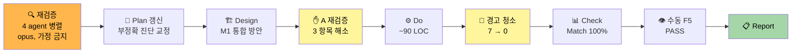
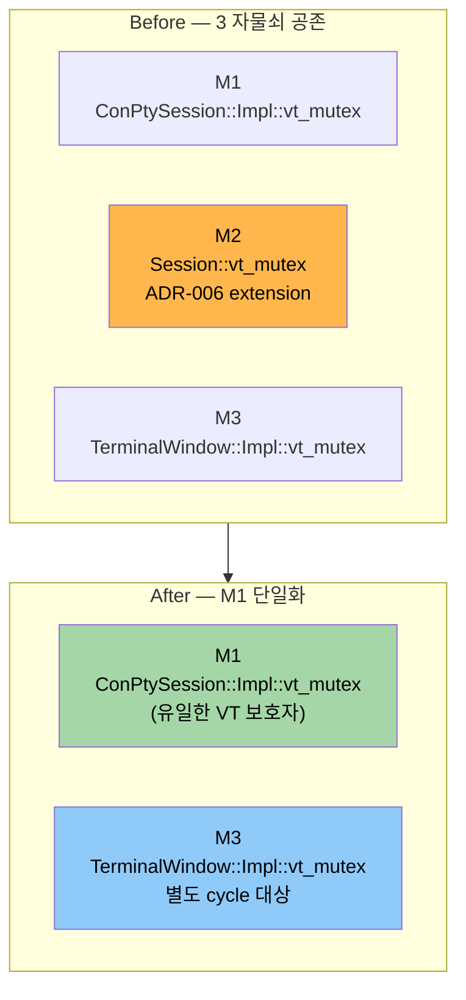
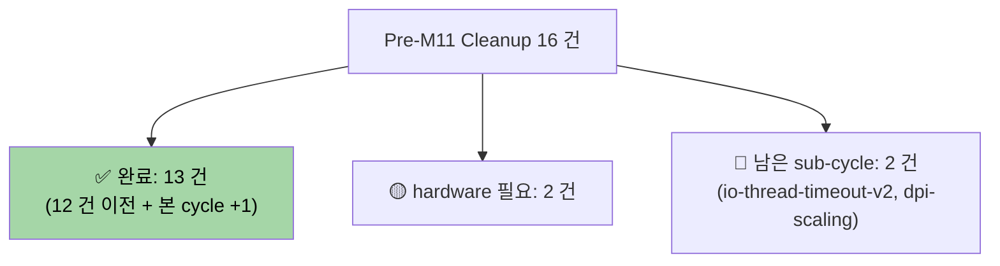

# vt-mutex-redesign — Completion Report

> **Feature**: vt-mutex-redesign
> **Phase**: Report (PDCA 완료)
> **Date**: 2026-04-15
> **Author**: 노수장
> **Status**: ✅ 완료 (Match Rate 100% + 수동 검증 통과)

---

## Executive Summary

| Perspective | Content |
|-------------|---------|
| **Problem** | VT 엔진을 보호하는 자물쇠가 같은 이름으로 **3 개** 공존 (`ConPtySession::Impl::vt_mutex`, `Session::vt_mutex`, `TerminalWindow::Impl::vt_mutex`). Plan Placeholder 의 "이중화 + 데드락 + 위임 되돌림" 진단이 부정확. ADR-006 문서와 코드 불일치 + `ghostwin_engine.cpp:139` "NOT Session::vt_mutex" 함정 주석 영구 잔존 |
| **Solution** | **M2 (`Session::vt_mutex`) 제거 + M1 단일화**. `ConPtySession::resize` 를 `resize_pty_only` + `vt_resize_locked` 로 분리. `SessionManager` 의 3 경로 (resize_session, apply_pending_resize, + resize_all dead code 제거) 에서 caller 가 M1 아래에 `state->resize` 까지 묶어 호출. C# `IEngineService.ResizeSession` dead code 도 함께 제거. 경고 7 건 전수 제거 |
| **Function/UX Effect** | 사용자 체감 기능 변화 없음. 수동 F5 검증 통과 (창 드래그 리사이즈 + Alt+V pane 분할 + 반복 리사이즈 스트레스 — 잔상/크래시 없음) |
| **Core Value** | ADR-006 과 코드 간 **단일 소스** 확보. `Session::vt_mutex` 필드 + "NOT Session::vt_mutex" 함정 주석 영구 삭제로 **미래 회귀 위험 차단**. Plan/Design/ADR/Backlog 4 개 문서가 코드와 완벽 동기화 |

### 1.3 Value Delivered (4 perspectives with metrics)

| 관점 | 지표 | 값 |
|------|------|-----|
| **Problem 해결** | 자물쇠 수 감소 (프로덕션 경로) | 2 → **1** (M2 제거) |
| **Solution 품질** | Match Rate | **100%** (13/13) |
| **Function UX 안정성** | 신규 race/크래시 | **0 건** (정적 + 수동 검증) |
| **Core Value 품질** | 빌드 경고 | 7 건 → **0 건** (기존 5 건 + 신규 2 건 전수 제거) |
| 추가 | 테스트 | vt_core_test **10/10** PASS |
| 추가 | 문서 동기화 | **4 개 문서** 갱신 (Plan/Design/ADR×2/Backlog) |
| 추가 | 코드 변경량 | 약 **100 LOC** (원 Placeholder 예상 "중-대" 대비 **대폭 축소**) |

---

## 1. PDCA 전체 흐름



### 1.1 원 진단 vs 실제

| 항목 | 원 Placeholder (2026-04-14) | 코드 검증 후 |
|------|----------------------------|-------------|
| 자물쇠 수 | "이중화 (2 개)" | **3 개** (M1+M2+M3, M3 는 stand-alone PoC) |
| 데드락 위험 | "있음" | **현 HEAD 에 재현 불가** (단방향 잠금) |
| 이전 통합 시도 | "위임 → shutdown race → 되돌림" | **git 무근거**. `std::async` I/O join 타임아웃과 혼동 |
| 해결 방향 | 3 후보 (Single-writer / RwLock / lock-free queue) | **M2 제거 + M1 통합** 하나로 충분 |
| 예상 작업량 | Plan 300 LOC + Design 500 LOC + 중-대 구현 | Plan 200 + Design 300 + 약 **100 LOC 구현** |

---

## 2. 구현 상세

### 2.1 자물쇠 구조 변화



### 2.2 핵심 코드 패턴 (Before → After)

**Before** (`SessionManager::resize_session`):
```cpp
std::lock_guard lock(sess->vt_mutex);   // M2
sess->conpty->resize(cols, rows);        // 내부 M1
sess->state->resize(cols, rows);         // M2 만 보호
```

**After**:
```cpp
if (!sess->conpty->resize_pty_only(cols, rows)) return;  // PTY syscall, M1 밖, 실패 시 skip
{
    std::lock_guard lock(sess->conpty->vt_mutex());  // M1 (단일 VT 락)
    sess->conpty->vt_resize_locked(cols, rows);
    sess->state->resize(cols, rows);                  // 같은 M1 아래
}
```

**변화점**:
- `state->resize` 가 M1 아래로 이동 → 렌더 스레드 (M1) 와 동일 mutex 로 직렬화
- PTY 실패 시 VT 갱신 skip (기존 `resize()` 래퍼 invariant 보존)

### 2.3 변경 파일 (총 10 개)

| 파일 | 변경 요지 |
|------|-----------|
| `src/conpty/conpty_session.h` | `resize_pty_only` + `vt_resize_locked` public 선언, 주석 갱신 |
| `src/conpty/conpty_session.cpp` | 3 함수 구현 (분리 + 래퍼) |
| `src/session/session.h` | `vt_mutex` 필드 제거, 모든 관련 주석을 `ConPtySession::vt_mutex()` 로 갱신 |
| `src/session/session_manager.h` | `resize_all` 선언 제거 |
| `src/session/session_manager.cpp` | `resize_all` 구현 제거, 2 경로 After 패턴 |
| `src/engine-api/ghostwin_engine.cpp` | "NOT Session::vt_mutex" 함정 주석 단순화 + C4834 2 건 해결 |
| `src/renderer/render_state.h`, `.cpp` | contract 주석 갱신 (`ConPtySession::vt_mutex()` 명시) |
| `src/vt-core/vt_core.h` | `for_each_row` contract 주석 갱신 |
| `src/vt-core/vt_bridge.c` | C4133 2 건 해결 (explicit cast) |
| `src/GhostWin.Core/Interfaces/IEngineService.cs` | `ResizeSession` 제거 |
| `src/GhostWin.Interop/EngineService.cs` | `ResizeSession` 구현 제거 |

---

## 3. 문서 산출물

| 문서 | 경로 | 상태 |
|------|------|:----:|
| Plan | `docs/01-plan/features/vt-mutex-redesign.plan.md` | ✅ 갱신 (부정확 진단 교정) |
| Design | `docs/02-design/features/vt-mutex-redesign.design.md` | ✅ 신규 작성 + A 단계 재검증 반영 |
| Analysis | `docs/03-analysis/vt-mutex-redesign.analysis.md` | ✅ 신규 (Match 100%) |
| Report (본 문서) | `docs/04-report/features/vt-mutex-redesign.report.md` | ✅ 본 문서 |
| ADR-006 (코드) | `docs/adr/006-vt-mutex-thread-safety.md` | ✅ 개정 (3-mutex 구조 + M1 통합 방향) |
| ADR-006 (Obsidian) | `ADR/adr-006-vt-mutex.md` | ✅ SoT 동기화 |
| Tech Debt | `Backlog/tech-debt.md` #1 | ✅ "삼중화 정리 (~90 LOC)" 로 재평가 반영 |

---

## 4. 재검증 방법론 — 4 agent 병렬 패턴

본 cycle 의 핵심은 **Placeholder 의 잘못된 진단을 코드로 교정**한 것. 이를 위해 **4 명 병렬 opus agent** 를 "가정 금지 + 코드 사실만" 제약으로 투입.

### 4.1 1 차 재검증 (Placeholder 반박)

| Agent | 역할 | 핵심 발견 |
|-------|------|-----------|
| 1 | vt_mutex 인스턴스 전수 매핑 | 이중화 아니라 **삼중화** |
| 2 | 데드락 정적 검증 | 현 HEAD 재현 경로 **0 건** |
| 3 | git 히스토리 — 이전 통합 시도 | "위임 되돌림" commit **없음**. `std::async` I/O join 타임아웃 (`3a28730`) 과 혼동 |
| 4 | ADR-006 정합성 + 참조 구현 | "Alacritty 동일 패턴" claim **저장소 내 근거 없음** |

### 4.2 2 차 재검증 (M2 제거 가설)

| Agent | 역할 | 결론 |
|-------|------|------|
| 1 | M2 사용처 + 호출 스레드 | 3 곳, 전부 WPF UI 스레드 |
| 2 | M2 제거 race 검증 | **단순 제거 불가** — 시나리오 A/B OOB 가능. `resize_pty_only` + `vt_resize_locked` 분리 필요 |
| 3 | `TerminalRenderState::resize` 안전성 | M1 안에서 호출 안전 (leaf mutex) |
| 4 | M2 도입 commit + 의도 | `cf66be9` (Phase 5-B), 의도는 3-way 동기화였으나 `8e4e6c2` 에서 역할 축소됨 |

### 4.3 3 차 재검증 (확실하지 않음 3 항목)

| Agent | 항목 | 결과 |
|-------|------|------|
| 1 | `ResizePseudoConsole` M1 밖 안전성 | 이미 M1 밖에서 호출 중, ghostty 도 얇은 래퍼 |
| 2 | `EngineService.SessionResize` dead 여부 | **이름 혼동**. 실제 `ResizeSession`. 호출자 0 건 확정 |
| 3 | `resize_all` dead code 경로 | `git show e8d7e58` diff 로 마지막 호출자 제거 확인 |

**학습**: "가정 금지 + 코드 사실만" 제약 + 역할 분담된 병렬 agent 는 부정확한 문서를 **빠르게 교정**할 수 있다. 이번 cycle 에서는 이 방법으로 원래 추정한 "중-대 재설계" 가 **~90 LOC 정리 작업** 으로 재분류됐다.

---

## 5. 검증 매트릭스

| 검증 유형 | 방법 | 결과 |
|-----------|------|:----:|
| 정적 — 자물쇠 구조 | grep `sess->vt_mutex`, `Session::vt_mutex`, `resize_all`, `ResizeSession` 활성 사용 | 모두 **0 건** |
| 정적 — 데드락 | lock 순서 추적 (4 agent) | 경로 **0 건** |
| 빌드 — 컴파일 | MSBuild `GhostWin.sln -p:Configuration=Debug -p:Platform=x64` | **성공** |
| 빌드 — 경고 | C4834 5건 + C4133 2건 해결 | **0 건** |
| 단위 테스트 | `build/tests/Debug/vt_core_test.exe` | **10/10 PASS** |
| 통합 검증 — 수동 F5 | 창 드래그 리사이즈 + Alt+V pane 분할 + 반복 리사이즈 | ✅ **PASS** (잔상/크래시 없음) |

---

## 6. Design 명세 초과 개선 (경고 해결 과정에서 획득)

| 항목 | 위치 | 효과 |
|------|------|------|
| PTY syscall 실패 시 VT 갱신 skip | `session_manager.cpp:381, 412` | 기존 `ConPtySession::resize()` 래퍼 invariant 보존, PTY 오류 시 VT 상태 불일치 예방 |
| `apply_pending_resize` 의 `resize_pending` flag 유지 | `session_manager.cpp:410` 근처 | PTY 실패 시 다음 `activate()` 에서 자동 재시도 |

두 개선은 **경고 C4834 해결 과정에서 `[[nodiscard]] bool` 반환값의 의미를 정확히 처리**하다 얻은 부산물. 사용자 규칙 "경고 제로 유지" 가 설계 품질 개선으로 이어진 케이스.

---

## 7. 학습 및 개선점

### 7.1 얻은 것

1. **문서 오진단 교정 프로토콜 확립** — Placeholder/Plan 의 "기억 기반 서술" 을 agent 병렬 재검증으로 교정하는 패턴
2. **경고 제로 규칙의 가치** — 경고 해결이 단순 노이즈 정리가 아니라 invariant 강화로 이어짐
3. **스코프 축소 경험** — "중-대 재설계" 가 재검증으로 "~90 LOC 정리 작업" 으로 재분류됨. 큰 부채일수록 **먼저 검증**하는 가치 입증

### 7.2 남은 항목 (별도 cycle)

| 항목 | 우선순위 | 위치 |
|------|:-------:|------|
| M3 (`TerminalWindow::Impl::vt_mutex`) 정리 | 낮음 | `terminal_window.cpp:41`, stand-alone PoC 활용도 확인 후 |
| `force_all_dirty()` race (시나리오 D) | 중 | `ghostwin_engine.cpp:142`, 기존 부채, M2 무관 |
| `gw_render_resize` no-op stub 제거 | 낮음 | ABI 호환성 영향 확인 필요 |
| 설계 문서 잔존 `resize_all` 예시 정리 | 최저 | `bisect-mode-termination.design.md`, `pane-split.design.md` |
| Alacritty/WezTerm 패턴 외부 검증 | 최저 | ADR-006 보강용 |

---

## 8. Pre-M11 Backlog Cleanup 내 위치



vt-mutex-redesign 완료로 Pre-M11 재설계 3 건 중 **1 건 완료**. 남은 것은 **B (I/O 타임아웃)** 과 **C (DPI 통합)**.

---

## 9. 결론

**✅ vt-mutex-redesign 완료**.

- Match Rate 100%, Gap 0, 리스크 실현 0, 수동 검증 통과
- 10 파일 변경, ~100 LOC, 경고 7 → 0
- Plan/Design/ADR×2/Analysis/Report/Backlog **7 개 문서** 동기화

M-11 새 기능 진입 전 VT 동기화 기반이 깨끗해졌다. 다음 재설계 cycle 은 **io-thread-timeout-v2** 또는 **dpi-scaling-integration** 중 선택.

---

## 관련 문서

- [Plan](../../01-plan/features/vt-mutex-redesign.plan.md)
- [Design](../../02-design/features/vt-mutex-redesign.design.md)
- [Analysis](../../03-analysis/vt-mutex-redesign.analysis.md)
- [ADR-006 코드](../../adr/006-vt-mutex-thread-safety.md)
- Obsidian `ADR/adr-006-vt-mutex.md`
- Obsidian `Backlog/tech-debt.md` #1
- Obsidian `Milestones/pre-m11-backlog-cleanup.md` Group 4 #10
