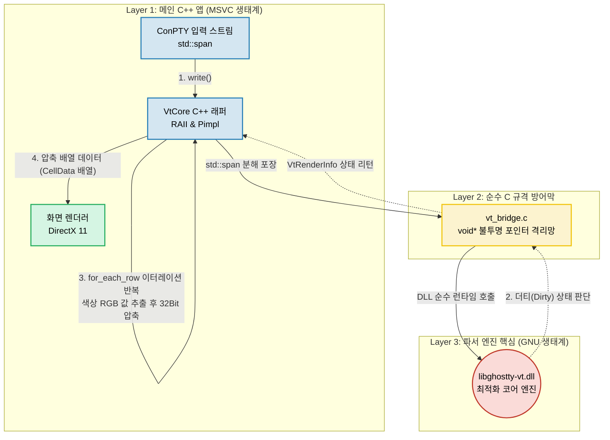

# 학습 노트 01: 터미널 파서의 기초와 Phase 1 아키텍처 결합 (SIMD 포함)

**날짜:** 2026-04-04
**주제:** 터미널 모듈(libghostty-vt)의 역할과 C++ 연동(Bridge) 구조, 그리고 SIMD 최적화의 이해

---

## 1. 터미널의 '비밀 언어'와 파서(Parser)의 원리

### 1.1. 가상 터미널(VT) 암호 체계
보통 커맨드라인 앱(`ls`, `git`, AI 에이전트 등)은 단순히 터미널 창에 글자만 보내지 않습니다. 글자의 색을 바꾸거나 화면을 지우고, 커서를 옮기기 위해 컴퓨터만의 약속된 암호를 보냅니다.
*   **예시**: `\x1b[31mHello\x1b[0m` (빨간색으로 Hello 출력 후 색상 롤백)
*   이러한 문자열을 **ANSI Escape Sequence** 혹은 **Virtual Terminal(VT) 시퀀스**라고 부릅니다. `\x1b`는 키보드의 ESC 키에 해당합니다.

### 1.2. 터미널 파서 모듈의 역할
터미널 파서는 쏟아지는 방대한 텍스트 더미 속에서 **일반 글자와 명령용 암호를 칼같이 분리 및 해석하는 '두뇌' 연산기**입니다.
이 파서가 암호를 해석하여 자체적인 **'2D 모눈종이 메모장(Render State)'**에 [색상, 좌표, 글자] 상태를 계속 최신화해 두면, 화면 그리기 엔진(DirectX)이 이 메모장을 바탕으로 화면에 그림(픽셀)을 출력하는 구조입니다.

---

## 2. GhostWin이 `libghostty-vt`를 엔진으로 선택한 이유

GhostWin 프로젝트는 현대 최고 성능으로 꼽히는 **Ghostty** 터미널의 핵(코어 파서)인 `libghostty-vt` 라이브러리를 사용합니다.

1.  **압도적 속도**: 대용량 텍스트 출력 시 버벅이지 않도록 텍스트를 묶음으로 처리하는 능력이 최상급입니다.
2.  **완벽한 정확성**: 40여 년간 누적된 구형 애플리케이션 화면 분할/색상 규칙의 꼬인 부분까지 오류 없이 번역해 내는 기네스북 급의 표준 해석력을 갖췄습니다.
3.  **의존성 제로 (Zero-Dependency)**: 외부 무거운 라이브러리를 요구하지 않는 순수 코드로 이뤄져 있어 가볍습니다.

---

## 3. Phase 1 아키텍처: Zig엔진을 Windows C++에 이식한 험난한 여정

최고의 엔진을 얻어왔음에도, 이 엔진(Zig+GNU 생태계)을 Windows 네이티브 환경(C++ MSVC 생태계)에 이식하는 과정에서 큰 충돌들이 있었고, 3가지 구조적 결정(ADR)을 통해 해결했습니다.

### 3.1. 컴파일 에러와 SIMD 끄기 (ADR-001)
*   **문제**: 터미널 엔진을 Windows MSVC 타겟용으로 빌드하니 런타임(CRT) 충돌로 시동을 걸자마자 크래시가 났습니다.
*   **해결**: 타겟을 GNU(`x86_64-windows-gnu`)로 우회하고, 안전성을 위해 강제 성능 부스터인 SIMD를 껐습니다(`-Dsimd=false`).

### 3.2. C 브릿지 (통역사) 계층 설계 (ADR-002)
*   **문제**: C++ 메인 앱이 파서 엔진의 헤더(설명서)를 읽으려 하니 문법(`typedef struct...`)이 맞지 않아 컴파일이 거부되었습니다.
*   **해결**: 순수 C 언어로 짠 중간 브릿지 계층(`vt_bridge.c` / `vt_bridge.h`)을 세우고, 구조체를 내부가 보이지 않는 불투명 포인터(`void*`)로 감싸 C++ 환경 오염을 완벽히 격리하는 **FFI 패턴**을 도입했습니다.

### 3.3. DLL 동적 격리망 구축 (ADR-003)
*   **문제**: 파서 코드를 C++ 메인 앱에 정적으로 한 파일로 합치려(Static Link) 했으나 두 컴파일러의 오브젝트 포맷 불일치로 링크 에러(`LNK1143`)가 발생했습니다.
*   **해결**: 파서 엔진을 `ghostty-vt.dll` 이라는 별개의 파일로 분리수거하여, C++ 앱이 런타임에 외부에서 불러다 쓰는 방식으로 두 컴파일러 간 마찰을 없앴습니다.

---

## 4. 번외: SIMD 가속 기술 파헤치기

### 4.1. SIMD란? (Single Instruction, Multiple Data)
우리가 아쉬움을 머금고 꺼두었던 SIMD는 **CPU가 명령어 한 번에 여러 개의 데이터를 동시에 처리하는 마법 같은 하드웨어 가속 기술** (예: AVX2 레지스터)입니다.
*   일반 방식(SISD)이 계산원이 바코드를 1개씩 찍는 개념이라면, SIMD는 스캐너가 지나가면서 물건 32개의 바코드를 0.001초 만에 한 번에 찍는 것과 같습니다.

### 4.2. 터미널 파서에서의 SIMD 위력
터미널 파서는 엄청난 양의 "일반 글자" 틈새에 숨겨진 "명령어용 특수문자(`\x1b`)"를 수색하는 일을 쉴 새 없이 반복합니다. 
SIMD가 작동하면 글자를 한 자원씩 읽지 않고, 레지스터에 16~32글자를 통째로 올려놓고 단 1번의 연산으로 *"여기에 암호(ESC) 문자 있어?"*를 동시에 찾아냅니다. 
따라서 SIMD를 켜면 터미널 출력에 엄청난 폭포수 데이터가 들어와도 CPU 사용량을 거의 바닥에 맞춘 채 스캔이 가능합니다.

### 4.3. Phase 1에서의 전략적 결단 
비록 Phase 1 에서는 엔진 붕괴(Crash)를 막고 Windows 결합 기초 공사를 성공시키기 위해 **"최고 성능 100점" 대신 "완전한 구동 안정성 80점"**을 택해 SIMD를 임시로 꺼두었습니다. 이 기본 구조 자체가 매우 튼튼하게 세워졌기 때문에, 향후 프로젝트가 성숙해지는 Phase 후반부의 성능 최적화 단계에서 다시 튜닝을 통해 살려낼 수 있는 잠재력으로 남아 있습니다.

---

## 5. Phase 1의 숨겨진 엔지니어링 디테일

### 5.1. 렌더링 최적화의 핵심: 더티 트래킹 (Dirty Tracking)
터미널 파서는 화면 전체를 매번 다시 그리도록 놔두지 않습니다. 파서 내부의 `DirtyState` 개념을 통해 "글자가 바뀌지 않음(Clean)", "일부 줄만 바뀜(Partial)", "전체가 바뀜(Full)" 상태를 반환합니다. 이를 '더티 트래킹'이라 부르며, 덕분에 렌더링 엔진(DirectX)과 GPU 리소스를 극한으로 아끼고 화면 전력 소모를 최소화할 수 있습니다.

### 5.2. 한국어 윈도우 환경 특유의 로캘(Locale) 충돌 회피
* **문제**: 빌드 과정 중 MSVC 컴파일러가 출력하는 한글 로그(`참고: 포함 파일:`)를 최신 빌드 자동화 도구인 Ninja의 영문 전용 파서가 읽다가 크래시가 발생했습니다 (CP949 인코딩 충돌).
* **해결**: `build_ghostwin.ps1` 빌드 스크립트 내부에서, CMake가 캐싱해 둔 한글 로그 문자열을 찾아서 강제로 영어(`Include:`) 텍스트로 치환해버리는 꼼수 패치를 적용하여 문제를 우회했습니다. 한국어 윈도우 한정 고질적인 에러를 유연하게 대처한 사례입니다.

### 5.3. 가혹한 릴레이 테스트: 메모리 누수(Leak) 검증
에이전트 멀티플렉서로서 향후 탭(Tab)이 무수히 열리고 닫힐 것을 대비해야 했습니다. 그러기 위해 `tests/vt_core_test.cpp` 에는 아주 짧은 시간 동안 **터미널 메모리를 생성하고, 무작위 글자를 쑤셔 넣고, 다시 파괴하는 과정을 50번 연속 강제 실행**하는 라이프사이클 테스트가 있습니다. 엔진의 뼈대와 브릿지(FFI) 사이에서 단 한 방울의 메모리도 누수되지 않음을 철저히 수학적으로 검증한 뒤 다음 단계로 넘어갔습니다.

---

## 6. 코드 아키텍처 흐름과 데이터 파이프라인

어플리케이션 내에서 데이터가 입력되고 화면 데이터로 바뀌기까지의 내부 구조 흐름을 도식화하면 다음과 같습니다. 
아래 구조는 서로 다른 언어 생태계(MSVC 호환 C++과, 배포용 DLL 파일 등)를 넘나들면서도 데이터가 폭발적으로 압축 전송됨을 보여줍니다.

### 6.1. 동작 단계별 흐름 
1. **데이터 유입**: `VtCore::write(std::span<const uint8_t> data)` 
   * 최신 C++ 기능인 `span`을 사용하여 메모리 길이 오류를 예방하며 원시 Byte 텍스트를 받습니다.
2. **상태 계산 및 더티 체크**: `update_render_state()`
   * 파서 엔진이 내부적으로 화면 상태를 최신화하고, "화면이 변했어?(Dirty)"를 판단합니다.
3. **세포 분열(이터레이터 순회)**: `for_each_row`
   * 변경된 화면에 대해 `RowIterator`와 `CellIterator`로 모눈종이를 단칸씩 스캔합니다. 데이터의 불필요한 전체 복사를 막기 위한 패턴입니다.
4. **데이터 압축(비트 시프트)**
   * 각 칸에 담긴 색상(RGB) 데이터를 32비트 정수 공간 안에 좌측 시프트 연산(`<<`)으로 빈틈없이 우겨 넣어 압축(Packing)합니다. GPU로 데이터를 쏠 때 병목이 안 생기도록 데이터 경량화를 돕습니다.

### 6.2. 핵심 설계 기법 3가지
* **Pimpl 패턴**: C++ 클래스 내부를 포인터 뒤에 치워두어 C 생태계 변수를 완벽히 캡슐화.
* **RAII 패턴**: C 언어의 `free()` 같은 동적 메모리 해제를 C++ 객체 소멸자(`~Impl`)가 자동으로 수행하여 누수 차단.
* **불투명 포인터 (Opaque Pointers)**: 원본 C 스타일의 타입을 전부 숨기고 `void*`로 주고받아 깐깐한 MSVC 컴파일러의 에러를 방지.

---

## 7. 심화: Modern C++ 기준 코드 리팩터링 리뷰안

현재 코드의 품질(최적화)은 이미 프로덕션 급입니다. 하지만 C++20과 모던 패러다임 기준에서 굳이 개선의 여지를 짚는다면 다음 4가지 포인트를 검토해 볼 수 있습니다.

1. **`std::string_view` 미활용 (Zero-Copy 낭비)**
   * 터미널 제목(Title)을 가져올 때 `get_title()`에서 값을 얻기 위해 무거운 `std::string` 개체를 복사 할당(Allocation)합니다. 이미 버퍼 주소가 메모리상에 유효하다면 복사 비용이 0인 `std::string_view`로 반환하는 것이 낫습니다.
2. **데이터 강제 맞춤 변수 `_pad[6]` 배열 선언**
   * 렌더링에 사용할 모눈종이 단위인 구조체 `CellData`를 32바이트 크기로 끼워 맞추려고 의미 없는 더미 변수인 `_pad[6]`를 넣었습니다. 대신 요즘의 C++ 표준 문법인 `alignas(32)` 키워드를 구조체 앞에 붙이면 깔끔하게 해결됩니다.
3. **원시 Ptr 형식의 불안한 콜백 이벤트 노출**
   * `set_title_callback()` 메소드를 보면 인자로 쓰이는 함수 포인터가 여전히 날것의 포인터 형식(`void(*)(void*)`)을 요구합니다. 내부적으로 이벤트를 포장(Thunking)해서, 메인 앱에서는 익숙한 `std::function`이나 `람다(Lambda)`를 던질 수 있게 만들면 C++의 취상에 더 맞습니다.
4. **리턴 값 검증 누락 방지 속성 부족**
   * 함수 `update_render_state()`를 실행했는데 그 결괏값(상태가 변했는지 여부)을 호출한 곳에서 버리고 무시해 버리면 앱의 화면 처리가 꼬일 수 있습니다. C++의 `[[nodiscard]]` 속성을 함수 앞에 붙여주면 이런 논리적 휴먼 에러를 방지할 수 있습니다.
