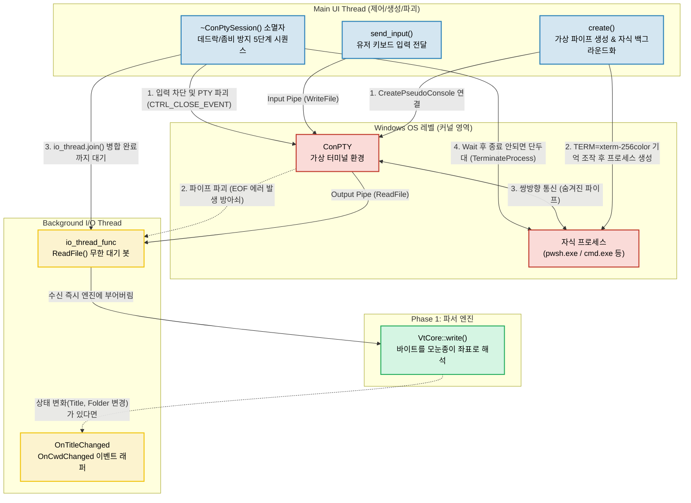

# 학습 노트 02: Phase 2 - ConPTY 연동과 스레드 종료(Shutdown) 시퀀스의 예술

**날짜:** 2026-04-04
**주제:** Windows ConPTY의 개념, 파이프라인 설계 방식 및 데드락(Deadlock)/좀비 프로세스 방지를 위한 정밀한 종료 시퀀스, 그리고 환경변수 메모리 조작술.

---

## 1. ConPTY (Console Pseudo-Terminal)의 개념과 필요성

### 1.1 과거의 윈도우 터미널 한계점
과거 Windows 환경에서는 리눅스와 같이 표준화된 가상 터미널 통신 규격이 없어, 서드파티 터미널 앱들이 화면 메모리를 직접 긁어오거나 화면을 캡처하는 식의 해킹(Hacking)에 가까운 방식으로 콘솔 프로그램(cmd.exe 등)과 소통했습니다.

### 1.2 ConPTY의 등장과 역할
Windows 10부터 마이크로소프트가 도입한 공식 API인 **ConPTY**는, 터미널 에뮬레이터(GhostWin)와 뒷단의 셸 앱(PowerShell, WSL) 사이의 공식 '통역사' 역할을 수행합니다.
* 사용자의 키보드 입력 ➡️ ConPTY ➡️ 셸 프로그램
* 셸 프로그램 결과물 ➡️ ConPTY ➡️ 표준 VT 암호문(`\x1b[31m` 등)으로 번역 ➡️ 메인 앱(파서 엔진)

---

## 2. 윈도우 파이프(Pipe) 통신과 I/O 스레드 설계

Phase 2에서 GhostWin이 시스템과 대화하는 구조는 4단계로 구성됩니다.

1. **파이프 구축**: 입력 파이프(키보드 ➡️ 셸)와 출력 파이프(셸 ➡️ 터미널 화면)라는 2개의 파이프를 `CreatePipe()`로 운영체제로부터 얻어냅니다.
2. **프로세스 감금**: 셸 프로그램(예: `pwsh.exe`)을 단순히 실행하지 않고, 1번에서 만든 ConPTY 파이프 환경 안에 가두어 실행합니다.
3. **독립된 백그라운드 스레드 (`io_thread_func`)**: 셸의 출력을 기다리다가 메인 UI가 멈추는(프리징) 현상을 막기 위해, 별도의 독립 스레드가 무한 루프를 돌며 출력 파이프 앞에 서서 데이터가 떨어지기를 기다립니다 (`ReadFile()`).
4. **파서 엔진으로 직행**: 물(데이터)이 나오는 즉시 Phase 1에서 탑재한 두뇌 엔진인 `VtCore::write()`로 부어버립니다. 

---

## 3. 심화 학습 1: 완벽한 종료(Shutdown) 시퀀스의 예술

시스템 프로그래밍에서 터미널 세션을 '여는' 것보다 어려운 것이 **안전하게 '죽이는' 것**입니다. 사용자가 화면을 강제 종료했을 때 그냥 객체를 파괴해 버리면 두 가지 재앙이 발생합니다.
* **좀비 프로세스**: 주인이 죽은 걸 몰라 백그라운드에 남아 영원히 자원을 먹는 `pwsh.exe` 발생.
* **스레드 데드락(Deadlock)**: I/O 스레드가 출력 파이프를 영원히 기다리는 교착 상태에 빠짐.

### 3.1. 정확하게 계산된 5단계 철수 작전 (소멸자)
코드(`conpty_session.cpp`의 소멸자)는 이를 막기 위해 한 치의 오차 없는 순서로 셧다운을 진행합니다.

1. **입력 파이프 닫기**: 자식 프로그램에게 "더 이상 입력은 없다 (EOF)"고 선언합니다.
2. **가상 터미널(ConPTY) 폭파**: 윈도우 OS가 파워셸에게 `CTRL_CLOSE_EVENT` 라는 치명적 시그널을 강제로 보냅니다. 파워셸은 이를 맞고 유언을 남기며 출력을 멈춥니다.
   * *이 과정이 실행되면 비로소 출력 파이프에 에러(`ERROR_BROKEN_PIPE`)가 뜨면서 무한 대기하던 I/O 스레드가 족쇄를 풀고 깨어납니다.*
3. **I/O 스레드 합류 기다리기 (Thread Join)**: 깨어난 I/O 스레드가 일을 모두 마치고 안전하게 메인 프로세스로 합류할 때까지 잠시 대기합니다.
4. **출력 파이프 닫기**: 스레드가 완전히 퇴근했으므로 이제 물이 나오던 파이프를 잠급니다. (미리 잠그면 데드락 우려가 있음)
5. **자식 프로세스 동반 종료 확인 및 단두대 (TerminateProcess)**: 정확히 5초(`shutdown_timeout_ms = 5000`)동안 죽기를 기다려 주고, 그래도 안 죽고 버티면 OS 권한으로 목을 쳐 호흡기를 강제로 제거합니다.

---

## 4. 심화 학습 2: 환경변수 조작을 통한 기능 해제 (`TERM=xterm-256color`)

리눅스 및 WSL 프로그램들은 Windows 환경에서 자신이 구형 터미널에서 구동되는 줄 알고 고해상도 색상(256 Color) 등의 기능을 스스로 봉인해 버립니다.
우리의 훌륭한 터미널 파서 기능을 100% 이끌어내기 위해 `build_environment_block()` 코드 안에서 윈도우 API의 메모리 구조 취약점(?)을 파고든 "환경변수 끼워 넣기" 해킹 기술을 사용했습니다.

1. `GetEnvironmentStringsW()` 로 기존 윈도우 환경 변수를 일렬의 긴 메모리 덩어리로 통째로 가져옵니다.
2. C 언어 메모리 배열 구조의 특징인 "문자열의 끝은 `\0` (널 포인터), 총 환경변수의 끝은 `\0\0` (더블 널 포인터)"라는 사실을 이용하여 메모리의 끝자락을 찾습니다.
3. 메모리 끝의 마지막 `\0` 자리 앞에 `"TERM=xterm-256color\0"` 이라는 가짜 편지를 슬쩍 붙여 넣고 새로운 더블 널 뚜껑(`\0\0`)을 닫아 포장합니다.
4. 이 조작된 메모리를 `CreateProcessW` 에 넘기면, 자식 앱이 자신이 세상에서 제일 좋은 터미널 안에 있다고 착각하여 최고급 색상 코드를 뱉어내기 시작합니다.

---

## 5. 전체 아키텍처 흐름 및 도식화 (Mermaid)

위에서 배운 ConPTY 파이프들의 연결 관계, 스레드의 비동기 동작, 그리고 종료 시퀀스가 얽혀있는 구조를 도식화하면 다음과 같습니다.

---

## 6. 심화 학습 3: 아키텍처 스케일링 진단 (Code Review)

현재의 구성은 '단일 터미널'을 안전하게 구동하기에는 정석적이고 견고한 완성도를 보여주지만, 궁극적 목표인 **'수십 개의 탭이 돌아가는 멀티플렉서 환경'**으로 확장(Scaling)하기 위해선 다음과 같이 개선해야 할 잠재적 아킬레스건들이 존재합니다.

### 6.1. UI 스레드를 5초간 멈추게 하는 '시한폭탄' (소멸자 대기)
* **상황**: 창을 닫을 때 프로세스가 꺼졌는지 부모 스레드에서 최대 5초간 대기(`WaitForSingleObject`).
* **치명성**: 이 함수가 메인 UI 스레드를 잡고 있다면, 프로세스가 뻗었을 때 5초간 마우스를 비롯한 앱의 모든 UI 렌더링이 얼어버리는 무응답 프리징(ANR) 현상을 유발합니다. 
* **해결 제안**: 강제 종료를 기다리고 킬(Kill)하는 카운트다운 작업은 철저히 메인 스레드에서 떼어내어 백그라운드 스레드나 타이머 풀로 위임(Fire & Forget)해야 사용자 경험(UX)이 매끄럽게 유지됩니다.

### 6.2. 글로벌(전역) 변수에 의존한 콜백의 한계
* **상황**: `g_tap_input` 등의 IME 테스트용 전역 상태(Global Variable)를 사용하여 모든 파이프 읽기/쓰기에 엮어 두었습니다.
* **치명성**: 창이 하나일 때는 가능하지만 여러 개의 멀티 탭 창을 좌우로 열면, 각 탭이 하나의 글로벌 변수를 향해 글자들을 쑤셔 넣으면서 테스트 데이터가 모조리 오염되고 충돌하게 됩니다.
* **해결 제안**: 전역 상태를 없애고 각각의 터미널이 태어날 때 `SessionConfig` 구조체의 인스턴스 전용 멤버 안으로 격리 배치해야 합니다.

### 6.3. Heavy 1:1 매핑 스레드 부담
* **상황**: 각 탭이 켜질 때마다 무조건 파이프 리딩을 담당하는 `std::thread(OS 무거운 스레드)`를 하나씩 1:1로 찍어내고 있습니다.
* **진단**: 당장 안정적이고 코드가 단순해진다는 장점은 있으나, 에이전트 탭이 50개 켜지면 OS의 헤비 스레드가 50개 생성되어 기민성이 떨어집니다. 추후 극강 최적화가 필요하다면, 수백 개의 파이프를 더 적은 OS 스레드 여러 명이서 전담 구역 마크하듯 가벼이 다룰 수 있는 **IOCP(I/O Completion Port)** 방식의 비동기 모델로 진화해야 합니다.

### 6.4. [모범적 설계] Custom Deleter를 결합한 RAII 활용
* 시스템 핸들 자원(파이프 제어권, 콘솔 객체 등)을 관리함에 있어, 잊기 쉬운 원시 포인터에 의존하지 않고 C++의 `std::unique_ptr`과 커스텀 삭제자 메커니즘을 융합시켜 설계했습니다. (예: `UniqueHandle`, `UniquePcon`) 자원 반납 오류(Resource Leak)를 현대 C++ 문법의 기본 기능만으로 완벽하게 방어해낸 훌륭한 아키텍처입니다. 
