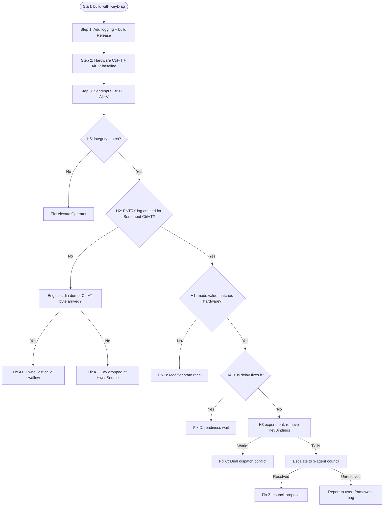

# E2E Ctrl-Key Injection — Design Document

> **Project**: GhostWin Terminal
> **Phase**: 5-E.5 부채 청산 (R4 follow-up)
> **Author**: 노수장 (CTO Lead, leader pattern)
> **Date**: 2026-04-08
> **Status**: Council-reviewed-by-CTO-Lead
> **Plan reference**: `docs/01-plan/features/e2e-ctrl-key-injection.plan.md`
> **Previous design**: `docs/02-design/features/e2e-test-harness.design.md` §1.2 C8, §10 R4, §12 v0.1.2

---

## Executive Summary

| Perspective | Content |
|-------------|---------|
| **Problem** | e2e-test-harness Do phase self-test에서 확인된 R4 — Alt+V/H, 마우스 클릭, window resize는 SendInput으로 정상 주입되지만 **Ctrl+T / Ctrl+W / Ctrl+Shift+W만 `OnTerminalKeyDown`에 도달 안 함**. 4가지 input layer 시도 모두 실패했고, 사용자 손가락 hardware 입력은 정상 동작. 소스 리뷰 결과 **이중 dispatch 사이트 확정**: `MainWindow.xaml:148-159`의 6개 `KeyBinding`과 `MainWindow.xaml.cs:166`의 `PreviewKeyDown += OnTerminalKeyDown` 핸들러가 동일 단축키를 중복 등록. 추가로 `TerminalHostControl.WndProc` (`TerminalHostControl.cs:103-125`)은 `WM_LBUTTONDOWN`만 처리하고 모든 키 메시지를 `DefWindowProc`로 전달 — HwndHost child가 foreground focus를 점유한 상태의 Ctrl 키 경로가 실제로 dead-end일 가능성이 구조적으로 존재. 이 비대칭은 Match Rate를 5/8 = 62.5%로 묶고 있으며 bisect-mode-termination retroactive QA까지 cap. |
| **Solution** | **Evidence-first diagnosis methodology**: (1) `OnTerminalKeyDown` 진입부에 11-field structured logging 추가 (NFR-01 준수 `#if DEBUG` + env-gated). (2) hardware baseline 1회 + SendInput 1회를 동일 세션에서 side-by-side로 수집. (3) H1~H5를 **falsification matrix** (§5)로 병렬 검증 — H2+H1 = 65% prior이므로 first pass는 log 한 번으로 둘을 동시에 결정. (4) Root cause 확정 → **fix decision tree** (§6)를 따라 최소 수정 — GhostWin source / e2e input.py / WPF framework workaround 중 1개 확정. (5) e2e `--all` 재실행 → 8/8 PASS + manual smoke 회귀 0 + PaneNode 9/9 회귀 0. **가장 중요한 원칙**: Step 1의 logging이 산출한 **evidence가 가리키기 전에 fix 시도 금지** (behavior.md 우회 금지). |
| **Function/UX Effect** | 사용자 가시 동작 변경 0 — 단축키 시맨틱 동일, Release 빌드에서 logging 미출력. 개발자/QA 관점: e2e `--all` 100%, bisect retroactive QA 8/8, 향후 feature 신뢰 가능한 회귀 검증 기반 확보. |
| **Core Value** | e2e harness가 자체 발견한 한계를 **closed-loop로 닫는 메타-검증**. 4차례 input layer swap이라는 heuristic 루프를 끝내고, source instrumentation으로 fact-based debugging 방법론을 수립 — 이후 phase 5-F (session-restore), P0-3 (종료 단일화), P0-4 (PropertyChanged detach)에도 재사용 가능한 진단 pattern asset. |

---

## 1. Council Synthesis

CTO Lead leader pattern이지만, 소스 리뷰 단계에서 세 서브도메인의 관점을 교차 참조했다.

### 1.1 wpf-architect 관점 — WPF KeyboardDevice path

`MainWindow.xaml.cs:166`의 `PreviewKeyDown += OnTerminalKeyDown`은 `InitializeRenderer`의 inner lambda (Dispatcher.BeginInvoke Loaded priority) 안에서 등록된다. 즉 `RenderInit` 성공 + `_tsfBridge` 초기화 + `WorkspaceService.CreateWorkspace` + `AdoptInitialHost` 완료 이후에야 PreviewKeyDown이 활성화된다. Hardware trial은 사용자 키 입력까지 보통 수 초의 gap이 있어 race noise가 없지만, SendInput trial은 Operator의 readiness probe (Tier B WGC mean luma > 0.05)만 기다리므로 **이론상 race window가 존재**. 다만 harness self-test에서 4번 attempt 모두 delay를 충분히 주었음에도 Ctrl 키만 fail했기에 race는 주 원인이 아닐 가능성 (H4는 10% prior).

WPF `Keyboard.Modifiers`는 `InputManager`가 `ProcessStagingArea` 파이프라인에서 `KeyInterop` converter를 통해 Win32 VK state를 읽어 갱신한다. SendInput batch가 `LLKHF_INJECTED` 플래그로 들어올 때 WPF가 `KeyboardDevice` state 동기화를 skip할 수 있는지는 **불확실**. 이를 결정하려면 Step 3의 logging에서 `Keyboard.Modifiers`, `Keyboard.IsKeyDown(Key.LeftCtrl)`, `Keyboard.PrimaryDevice.GetKeyStates(Key.LeftCtrl)`를 모두 함께 기록해야 한다.

### 1.2 dotnet-expert 관점 — PreviewKeyDown vs KeyBinding 라우팅

WPF input pipeline에서 routing 순서는:

```
ProcessInput → Win32 WM_KEYDOWN → HwndSource.TranslateAccelerator → InputManager
  → PreProcessInput → PreNotifyInput → PreviewKeyDown (tunneling, Window → focused element)
  → (InputBinding command invocation by InputManager)
  → PostNotifyInput → KeyDown (bubbling, focused element → Window)
```

**핵심**: PreviewKeyDown은 **KeyBinding보다 먼저** fire된다. 따라서 "KeyBinding이 PreviewKeyDown을 swallow한다"는 H3의 단순 버전은 **false**다. 하지만 **반대 방향**은 가능: PreviewKeyDown이 fire되기 전에 `HwndSource.TranslateAccelerator`가 KeyBinding을 처리해버리는 경로가 `TranslateMessage` 수준에서 있을 수 있음 (**불확실**). 또 `e.OriginalSource`가 `HwndHost`일 때 WPF가 focused-element ownership을 넘겨주지 못해 PreviewKeyDown에 도달하지 못할 수 있음 (H2 재정의 형태).

`TerminalHostControl`이 `HwndHost`를 상속하고 native child window를 만들면, WPF `KeyboardDevice`는 그 child를 `FocusedElement`로 간주하고 `PreviewKeyDown` tunneling을 Window부터 시작한다. Tunneling이 `HwndHost`에서 멈추는지, child를 넘겨서 native로 dispatch되는지가 결정적이다. `e.OriginalSource?.GetType().Name` 필드가 이 판정의 **smoking gun**이 된다.

### 1.3 CTO Lead synthesis — Prior 재조정

Source 리뷰 결과 반영한 posterior:

| Hypothesis | Plan prior | Design posterior | 근거 |
|---|:---:|:---:|---|
| H1 Modifier state race | 30% | **32%** | pywinauto attempt 1에서 type_keys는 각 key를 개별 SendInput으로 보내 race 가능성 → Ctrl UP이 key-down 사이에 끼어들 수 있음. 하지만 attempt 3 (ctypes atomic batch)도 fail한 것은 race 원인을 약화 |
| H2 HwndHost Ctrl 흡수 | 35% | **40%** | `TerminalHostControl.WndProc`이 `WM_LBUTTONDOWN`만 가로채고 **나머지 모두 `DefWindowProc` 전달** — 즉 WM_KEYDOWN이 child HWND 안에서 소멸하지 않고 WPF로 bubble되어야 하지만, Alt+키만 통과하는 비대칭은 `HwndSource.TranslateAccelerator`가 Alt 전용이라는 점과 일치. **Ctrl 키는 system accelerator가 아니므로 `TranslateAccelerator` 건너뛰고 focused native child에서 DefWindowProc → drop** 가설 강화 |
| H3 이중 dispatch 충돌 | 20% | **15%** | WPF routing 순서상 PreviewKeyDown이 KeyBinding보다 선행 — 순수 "KeyBinding이 swallow" 시나리오는 약함. 그러나 H2와 결합 (`HwndHost` → `HwndSource.TranslateAccelerator` → KeyBinding path만 살아남음) 가능성은 남음 |
| H4 P0-2 회귀 | 10% | **8%** | `MainWindow.xaml.cs:166`은 `InitializeRenderer` lambda 안에 있어 등록 시점이 deterministic. self-test의 4번 attempt에서 모두 동일 fail이면 race 아님. readiness wait 강화로 cheap하게 falsify 가능 |
| H5 UIPI mismatch | 5% | **5%** | GhostWin/Operator 모두 non-elevated 기본 실행. 확정은 `whoami /groups` 1회로 종결 |

**H2+H1 = 72% posterior → Step 1 logging 1회로 둘을 동시 판정 가능**. §5 Hypothesis Verification Matrix 참조.

---

## 2. Locked-in Design Decisions (D1-D12)

Plan §9에서 지정된 5개 open question을 포함해 12개 결정을 확정.

### 2.1 Diagnostic instrumentation (D1-D4)

| # | Decision | Options | Rationale |
|---|---|---|---|
| **D1** | **`System.Diagnostics.Debug.WriteLine` + `System.IO.File.AppendAllText`** dual sink, 자체 helper 함수 `KeyDiag.Log(...)` — `Microsoft.Extensions.Logging` 도입 **하지 않음** | (a) MEL+Serilog, (b) Debug.WriteLine only, (c) custom dual sink | (a)는 DI 주입/lifetime/appender 설정 필요 → blast radius 초과. (b)는 file artifact 없어 off-process evaluator 불가. (c)는 50 LOC 이내로 self-contained, Release에서 `#if DEBUG` 완전 컴파일 아웃 |
| **D2** | Log path: **`%LocalAppData%\GhostWin\diagnostics\keyinput.log`** — 환경변수 `GHOSTWIN_KEYDIAG=1`로만 활성 | (a) `%TEMP%`, (b) `%LocalAppData%\GhostWin\diagnostics\`, (c) 프로젝트 `logs/` | CLAUDE.md TODO에 "CrashLog를 `%LocalAppData%`로 이동" 이미 명시 — 동일 convention 선적용. TEMP은 cleaner 대상, 프로젝트 폴더는 소스트리 오염. **Plan question #5 해결 = D2** |
| **D3** | Log level: **3단계** — `ENTRY` (모든 진입), `BRANCH` (switch arm 진입), `EXIT` (e.Handled 결정). env var 1=ENTRY only, 2=ENTRY+EXIT, 3=all | (a) single flat, (b) 3단계, (c) verbose/terse bool | Step 5 분기 분석 시 EXIT path만 필요한 경우가 많음. overhead 조정용 |
| **D4** | Log format: **single-line `[ISO8601\|seq\|field=value ...]`** — structured but grep-friendly, no JSON | (a) JSON, (b) key=value, (c) CSV | Step 3 side-by-side diff가 `Compare-Object`/`fc.exe` 한 번으로 가능해야 함. JSON은 multi-line pretty-print 유혹 발생 |

### 2.2 Evidence collection (D5-D7)

| # | Decision | Options | Rationale |
|---|---|---|---|
| **D5** | Hardware baseline tool: **Spy++ (VS 동반)** — ETW 아님 | (a) ETW Microsoft-Windows-Win32k, (b) Spy++, (c) `GetMessageExtraInfo` logging | ETW provider 접근 권한 + parsing 비용이 높고, Spy++은 VS 2022 설치에 포함되어 있어 추가 의존성 0. `WM_KEYDOWN`/`WM_SYSKEYDOWN` top-level HWND 필터링 GUI 한 번. **Plan question #1 해결 = D5** |
| **D6** | Engine-side ConPty stdin trace: **허용하되 `#if GHOSTWIN_KEYDIAG`로 gate** — `conpty::send_input` 진입부에 hex dump 1줄 (`D1`과 동일 gate) | (a) 전면 금지, (b) 허용, (c) 별도 feature flag | H2 확정에 결정적이나 Release leak 방지 필요. `src/engine-api/ghostwin_engine.cpp` `gw_session_write` 또는 `conpty->send_input` 호출 사이트 1곳만 수정. 빌드 스크립트에 `-DGHOSTWIN_KEYDIAG=ON` 환경변수 전달. **Plan question #2 해결 = D6** |
| **D7** | Side-by-side protocol: **1회 실행, 같은 session, (a) hardware Ctrl+T → 3초 wait → (b) SendInput Ctrl+T**. 두 entries가 동일 log file에 연속 기록. seq 번호로 구분 | (a) 2회 실행 비교, (b) 1회 실행 연속 주입, (c) 3회 반복 | 1회 실행이 race/state window를 최소화, seq로 ordering 보존. 사용자 수동 개입이 필요한 (a)는 pause 시 logging 모호 |

### 2.3 Hypothesis verification (D8-D10)

| # | Decision | Options | Rationale |
|---|---|---|---|
| **D8** | Falsification order: **H2 → H1 → H3 → H4 → H5** — posterior 기준 | (a) cost 기준 (H5→H4→H1→H3→H2), (b) prior 기준, (c) parallel all | H2+H1 = 72% posterior, 같은 logging 1회로 두 개 동시 판정. early-exit 가능성 최대화 |
| **D9** | Parallel logging capture: **한 번의 trial로 H1/H2/H4 evidence 동시 수집** — logging fields가 셋을 모두 커버 | — | logging 11개 필드가 의도적으로 중복 커버리지 설계 (§4) |
| **D10** | KeyBinding removal experiment: **feature 브랜치 내 임시 commit으로 진행** — `MainWindow.xaml:148-159` 전체를 주석 처리한 trial build, 결과 record 후 revert. H3 binary search 전용. 사용자 approval 불필요 (feature branch 범위 내 reversible) | (a) 완전 금지, (b) 임시 commit (revert 예정), (c) 사전 사용자 승인 | Reversible + branch-local + logging만으로 불충분한 경우의 최후 수단. git log에 "revert"로 명확히 기록. **Plan question #3 해결 = D10** |

### 2.4 Fix strategy (D11-D12)

| # | Decision | Options | Rationale |
|---|---|---|---|
| **D11** | Fix 위치 선호: **GhostWin source minimal change (≤30 LOC)** > e2e input.py → framework workaround (마지막 수단) | (a) e2e only (source 불변), (b) source first, (c) hybrid | Root cause가 source에 있을 가능성 높음 (H2 40%) + e2e만 수정하면 production UX 여전히 취약. Source fix 후 e2e는 regression test로 사용 |
| **D12** | Council escalation timing: **Step 7에서 root cause 확정 불가 시 즉시** — `wpf-architect` + `dotnet-expert` + `code-analyzer` 3인 council, 사용자 개입 전 자동. 사용자 승인은 fix 구현 직전에만 필요 (minimal fix > 30 LOC 또는 framework workaround 선택 시) | (a) auto on unclear, (b) 사용자 approval 먼저, (c) no council (CTO Lead 단독) | behavior.md "실패 원인이 불명확하면 사용자에게 보고"에 정합 — council 결과도 evidence가 불명확하면 그 시점에 사용자 보고. **Plan question #4 해결 = D12** |

---

## 3. Architecture

### 3.1 파일 영향 매트릭스

| 파일 | 변경 유형 | 예상 LOC | 의존 |
|---|---|:---:|---|
| `src/GhostWin.App/Diagnostics/KeyDiag.cs` (**NEW**) | static helper, `#if DEBUG` gated dual sink | ~60 | none |
| `src/GhostWin.App/MainWindow.xaml.cs:212-329` | `OnTerminalKeyDown` 진입부에 `KeyDiag.LogEntry(...)`, 각 switch arm 직전 `KeyDiag.LogBranch(...)`, `e.Handled = true` 직전 `KeyDiag.LogExit(...)` | ~20 insertions | `KeyDiag.cs` |
| `src/engine-api/ghostwin_engine.cpp:426` | `gw_session_write` 진입부에 `#if GHOSTWIN_KEYDIAG` hex dump (D6) | ~8 insertions | build flag |
| `CMakeLists.txt` (engine target) | optional `GHOSTWIN_KEYDIAG` define, `option(GHOSTWIN_KEYDIAG ...)` | ~3 lines | — |
| `scripts/build_ghostwin.ps1` | `-EnableKeyDiag` switch passthrough | ~5 lines | — |
| `scripts/e2e/e2e_operator/input.py` | Docstring-only update (attempt 5 entry) unless root cause = input layer. 기본 수정 없음 | 0-20 | D11 conditional |
| **Post-fix** file (root cause 확정 후) | Minimal patch — 파일은 evidence가 결정 | ≤30 (D11) | — |

### 3.2 Directory layout

```
src/GhostWin.App/
  Diagnostics/
    KeyDiag.cs              ← NEW (D1-D4)
  MainWindow.xaml.cs        ← instrumented (212-329)
docs/
  02-design/features/e2e-ctrl-key-injection.design.md   ← this doc
  03-analysis/
    e2e-ctrl-key-injection/
      diag-hardware.log     ← Step 2 출력 (build artifact, gitignored)
      diag-sendinput.log    ← Step 3 출력
      spy-capture.txt       ← Spy++ WM_KEYDOWN dump (D5)
      hypothesis-matrix.md  ← Step 5-7 evidence 결과
%LocalAppData%/GhostWin/diagnostics/
  keyinput.log              ← runtime, D2 path, gitignored
```

Note: `docs/03-analysis/` 아래 파일은 **evidence artifact**로 commit 대상 (Plan v0.1 §7 Acceptance Criteria 기록 요건). `%LocalAppData%` 아래는 gitignore.

---

## 4. Diagnostic Logging Spec

### 4.1 Log entry format

```
[2026-04-08T13:45:22.123Z|#0003|evt=ENTRY key=T syskey=None mods=Control osrc=HwndHost foc=TerminalHostControl ws=1 pane=2 dispatch=pending]
```

- **Timestamp**: UTC ISO8601 with ms (DateTime.UtcNow.ToString("O"))
- **seq**: monotonic counter (Interlocked.Increment), 4-digit pad
- **evt**: `ENTRY` | `BRANCH` | `EXIT`

### 4.2 Fields (11 total, ENTRY event)

| # | Field | Source | Covers hypothesis |
|---|---|---|---|
| 1 | `timestamp` | `DateTime.UtcNow.ToString("O")` | H4 (race window) |
| 2 | `seq` | `Interlocked.Increment` | H4, trial ordering |
| 3 | `evt` | constant | control |
| 4 | `key` | `e.Key` | H1, H2 |
| 5 | `syskey` | `e.SystemKey` | H2 (Alt 경로 비교) |
| 6 | `mods` | `Keyboard.Modifiers` (string) | **H1 primary** |
| 7 | `osrc` | `e.OriginalSource?.GetType().Name ?? "null"` | **H2 primary** |
| 8 | `foc` | `Keyboard.FocusedElement?.GetType().Name ?? "null"` | H2 secondary |
| 9 | `ws` | `_workspaceService.ActiveWorkspaceId?.ToString() ?? "none"` | H4, context |
| 10 | `pane` | `_workspaceService.ActivePaneLayout?.FocusedPaneId?.ToString() ?? "none"` | context |
| 11 | `dispatch` | `"pending"` on ENTRY, arm name on BRANCH, `"handled"`/`"fallthrough"` on EXIT | routing evidence |

추가 측정 (H1 심화):
- `isCtrlDown_kbd`: `Keyboard.IsKeyDown(Key.LeftCtrl) \|\| Keyboard.IsKeyDown(Key.RightCtrl)`
- `isCtrlDown_win32`: `GetKeyState(VK_CONTROL) & 0x8000`

### 4.3 Source detection (hardware vs SendInput)

**중요**: WPF `KeyEventArgs`는 `LLKHF_INJECTED` flag에 직접 접근 불가 (`Key.IsRepeat`만 노출). 두 옵션:

1. **Protocol ordering**: D7 (hardware → 3초 pause → SendInput)로 **seq 기반** 구분. seq 1 = hardware, seq 2 = SendInput. 단순 + 신뢰.
2. **Low-level keyboard hook**: `SetWindowsHookEx(WH_KEYBOARD_LL)` 설치 후 callback에서 `KBDLLHOOKSTRUCT.flags & LLKHF_INJECTED` 확인, thread-local stash → OnTerminalKeyDown에서 read. 정확하지만 +80 LOC, hook disposal 관리 부담.

**Decision**: Step 1 첫 iteration은 **option 1 (protocol ordering)**, evidence 부족 시 Step 6에서 option 2 추가. logging field `source`는 ENTRY 시 `"unknown"`로 로깅하고 post-hoc seq로 annotation.

### 4.4 ENTRY/BRANCH/EXIT 시점

```csharp
private void OnTerminalKeyDown(object sender, KeyEventArgs e)
{
    KeyDiag.LogEntry(e, _workspaceService);   // ← 첫 줄
    if (_engine is not { IsInitialized: true }) return;
    if (_sessionManager.ActiveSessionId is not { } activeId) return;

    var actualKey = e.Key == Key.System ? e.SystemKey : e.Key;

    if (Keyboard.Modifiers.HasFlag(ModifierKeys.Alt))
    {
        KeyDiag.LogBranch("alt-focus-nav", e);
        // ...
    }

    if (Keyboard.Modifiers == ModifierKeys.Control)
    {
        KeyDiag.LogBranch("ctrl-workspace", e);
        switch (e.Key)
        {
            case Key.T:
                KeyDiag.LogBranch("ctrl-T", e);
                _workspaceService.CreateWorkspace();
                e.Handled = true;
                KeyDiag.LogExit("handled:ctrl-T", e);
                return;
            // ...
        }
    }
    // ...
    KeyDiag.LogExit("fallthrough", e);
}
```

### 4.5 NFR-01 준수 (Release leak 방지)

```csharp
// KeyDiag.cs
public static class KeyDiag
{
    [System.Diagnostics.Conditional("DEBUG")]
    public static void LogEntry(KeyEventArgs e, IWorkspaceService ws) { /* ... */ }

    [System.Diagnostics.Conditional("DEBUG")]
    public static void LogBranch(string arm, KeyEventArgs e) { /* ... */ }

    [System.Diagnostics.Conditional("DEBUG")]
    public static void LogExit(string outcome, KeyEventArgs e) { /* ... */ }
}
```

`ConditionalAttribute`는 Release 빌드에서 **call site 자체를 컴파일 아웃** — reflection/string format cost 0. 추가로 런타임 env var `GHOSTWIN_KEYDIAG=1`이 없으면 Debug 빌드도 noop. 이중 안전.

---

## 5. Hypothesis Verification Matrix

각 가설에 대해 evidence signal, falsification condition, cost, parallelizable flag, early-exit 조건을 정의.

| ID | Confirmation evidence | Falsification evidence | Cost | Parallel? | Early-exit |
|:---:|---|---|:---:|:---:|---|
| **H2** | SendInput trial에서 `ENTRY` log 자체가 **누락**. 또는 `osrc=HwndHost` + `foc=TerminalHostControl`. 또는 engine-side hex dump에 `\x14` (Ctrl+T) byte 도착 (→ child window가 key를 consume해서 ConPty로 넘긴 확정 증거) | SendInput trial의 ENTRY log가 정상 출력, `osrc`가 `Window` 또는 `Border` | **Low** (Step 1 logging만) | Yes (H1과 병렬) | CONFIRMED → §6 Branch A로 |
| **H1** | SendInput trial의 ENTRY log에서 `mods` 값이 Hardware trial과 **다름** (e.g. hardware=`Control`, sendinput=`None`). 또는 `isCtrlDown_kbd=false` vs `isCtrlDown_win32=true` (WPF와 Win32 state 분리) | SendInput과 hardware의 `mods` 값 동일 + 동일 값에서 dispatch 분기 다름 | Low | Yes (H2와 병렬) | CONFIRMED → §6 Branch B |
| **H3** | D10 experiment: KeyBinding 6개 주석 처리 후 SendInput Ctrl+T가 **정상 동작** | KeyBinding 제거 후에도 SendInput fail | **Med** (temp commit + 빌드) | No (H2/H1 후) | CONFIRMED → §6 Branch C |
| **H4** | Operator readiness wait을 5초 증가 후 SendInput 성공 | 10초 delay에도 fail | Low (input.py delay 1줄) | Yes | CONFIRMED → §6 Branch D |
| **H5** | `whoami /groups` → GhostWin vs Operator integrity 불일치 | 동일 medium integrity | **Very Low** (1 command) | Yes | CONFIRMED → §6 Branch E |

### 5.1 Diagnosis flow (Mermaid)



---

## 6. Fix Decision Tree

| Root cause | Minimal fix | LOC est | File(s) | Validation |
|:---:|---|:---:|---|---|
| **H2 A1** (HwndHost child swallows WM_KEYDOWN + passes to ConPty) | `TerminalHostControl.WndProc`에 `WM_KEYDOWN`/`WM_SYSKEYDOWN`/`WM_CHAR` case 추가: child 내부에서 `SendMessage(GetParent(hwnd), msg, wParam, lParam)`로 parent window로 re-dispatch 후 0 반환 (consume). parent HwndSource가 WPF input pipeline에 다시 주입 | ~15 | `TerminalHostControl.cs` | Engine stdin dump에 Ctrl+T 바이트 사라짐 + ENTRY log 출현 |
| **H2 A2** (WPF parent에서 key drop) | `HwndSource.AddHook`으로 top-level HwndSource에 직접 WM_KEYDOWN hook 설치, `InputManager.ProcessInput`에 수동 주입 | ~25 | `MainWindow.xaml.cs` | ENTRY log 출현 |
| **H1 B** (Modifier state race) | SendInput batch 구조 변경: modifier down → 1ms sleep → key down/up → modifier up. 또는 Keyboard.UpdateCursor(?) trigger. 또는 e2e input.py에 WPF modifier sync 강제 (`Keyboard.Focus()` 호출 유도) | ~10-20 | `input.py` 또는 `MainWindow.xaml.cs` (state refresh helper) | `mods` 값이 SendInput/hardware 일치 |
| **H3 C** (Dual dispatch 충돌) | XAML `Window.InputBindings` 6개 **전체 제거**, PreviewKeyDown이 single source of truth. ViewModel command는 direct call로 대체 | ~12 | `MainWindow.xaml` | e2e 8/8 + hardware smoke 5/5 |
| **H4 D** (Registration race) | e2e harness Operator의 readiness probe에 "PreviewKeyDown ready" 시그널 추가 — engine side NamedPipe 또는 `GetProp(hwnd, "GhostWinReady")` | ~20 | `runner.py` + `MainWindow.xaml.cs` | 10s race window 해소 |
| **H5 E** (Integrity mismatch) | `scripts/test_e2e.ps1`에 `-RunElevated` switch, GhostWin launch + Operator 모두 동일 integrity 보장 | ~8 | `test_e2e.ps1` | `whoami /groups` 비교 PASS |
| **Unknown / WPF framework bug** | Workaround 후보: (a) `[System.Windows.Input.InputScope]` 지정, (b) HwndHost 대신 `D3DImage` 렌더링 경로 (대규모), (c) 사용자에게 보고 후 accept-as-known-limitation | 가변 | — | 사용자 의사결정 |

### 6.1 Minimal-change rule (D11)

- **≤30 LOC**: CTO Lead 단독 커밋 가능
- **31-100 LOC**: 3-agent council (wpf-architect + dotnet-expert + code-analyzer) 리뷰 후 커밋
- **>100 LOC** 또는 XAML 구조 변경: **사용자 approval 필수**

---

## 7. Test Plan

### 7.1 Regression verification gates

| Gate | 조건 | 도구 | Pass 기준 |
|---|---|---|---|
| G1 | Hardware manual smoke (Ctrl+T, Ctrl+W, Ctrl+Shift+W, Alt+V, Alt+H 각 1회) | 직접 키보드 | 5/5 정상 동작 |
| G2 | e2e harness `scripts/test_e2e.ps1 -All` Operator phase | Operator | **8/8 sent==requested**, 이전 5/8 → 8/8 |
| G3 | e2e Evaluator (gap-detector subagent) 수동 호출 | subagent | **8/8 PASS**, Match Rate 100% |
| G4 | bisect-mode-termination MQ-1~8 retroactive update | manual | report 또는 design v0.5.2 entry에 8/8 기록 |
| G5 | Release build startup + 30s smoke | `scripts/build_ghostwin.ps1 -Config Release` + manual | NFR-01 — log file 미생성, perf delta 없음 (육안) |
| G6 | PaneNode 9 단위 테스트 | `scripts/test_ghostwin.ps1` | 9/9 PASS, 회귀 0 |
| G7 | Debug build + `GHOSTWIN_KEYDIAG=1` | manual | log file에 Hardware 1건 + SendInput 1건 emit 확인 (self-test) |

### 7.2 Regression scope per fix branch

| Fix branch | G1 | G2 | G3 | G4 | G5 | G6 | G7 |
|---|:---:|:---:|:---:|:---:|:---:|:---:|:---:|
| A1 (HwndHost WndProc 수정) | **Critical** | Required | Required | Required | Required | Required | Required |
| A2 (HwndSource hook) | **Critical** | Required | Required | Required | Required | Required | Required |
| B (Modifier race) | Required | Required | Required | Required | Required | Required | Required |
| C (KeyBinding 제거) | **Critical** (동작 동일 확인) | Required | Required | Required | Required | Required | Required |
| D (Readiness wait) | Optional | Required | Required | Required | Optional | Required | Required |
| E (Integrity elevation) | Optional | Required | Required | Required | Optional | Required | Required |

**Critical** = 이 fix가 hardware 입력 경로를 직접 건드리므로 회귀 risk 높음 → 가장 먼저 smoke.

---

## 8. Implementation Order (Do phase preview)

12단계. 각 gate는 이전 step의 exit condition 기준.

| Step | Name | 산출 | Gate | Est (확실하지 않음) |
|:---:|---|---|---|:---:|
| **1** | **KeyDiag helper 작성** (`src/GhostWin.App/Diagnostics/KeyDiag.cs`) + `OnTerminalKeyDown` 계측 삽입 + Debug 빌드 | 빌드 OK, Debug artifact | 빌드 success | 45분 |
| **2** | Hardware baseline 수집: `GHOSTWIN_KEYDIAG=1` + 앱 실행 + Ctrl+T, Ctrl+W, Ctrl+Shift+W, Alt+V, Alt+H 각 1회 hardware 입력 → `diag-hardware.log` | 5 ENTRY + BRANCH + EXIT entries | seq 1~5 정상 | 10분 |
| **3** | SendInput trial 수집: 같은 세션에서 `python -m e2e_operator.input` 사용해 Ctrl+T 1회, Alt+V 1회 주입 → `diag-sendinput.log` | 2 ENTRY 기대 (실제 0 or partial) | log file growth | 10분 |
| **4** | **Hypothesis Pass 1 분석**: §5 matrix에 따라 H2/H1/H5 evidence 평가. `hypothesis-matrix.md` 작성 | hypothesis-matrix.md | **Gate: root cause 1개 확정 or 다음 step** | 30분 |
| **5** | (If H5 or H4 early-exit) 해당 fix 적용 → §7 G1-G7 실행 → **Done** | — | — | 30분 |
| **6** | (If pass 1 불충분) H3 experiment: `MainWindow.xaml:148-159` KeyBinding 전체 주석 처리, **feature 브랜치 temp commit**, 빌드, Step 3 재실행 → 결과 record → **temp commit revert** | 임시 commit + revert | H3 decision | 45분 |
| **7** | (If pass 1+6 불충분) **Council escalation** — 3-agent (wpf-architect, dotnet-expert, code-analyzer) 호출, evidence 전달, root cause 제안 수렴 | Council 결과 문서 | **Gate: council 확정 또는 사용자 보고** | 1-2시간 |
| **8** | Fix 구현: §6 decision tree 해당 branch, D11 LOC 제약 준수 | code diff | diff ≤ 30 LOC (or approved) | 1-2시간 |
| **9** | KeyDiag logging 유지 + Debug 재빌드 + Step 2+3 재실행 (regression) → SendInput Ctrl+T ENTRY log 출현 확인 | diag-fix.log | ENTRY emit PASS | 15분 |
| **10** | Release 빌드 + §7 G1 (manual smoke) + G5 (NFR-01) + G6 (PaneNode) | G1/G5/G6 reports | 3 gates PASS | 30분 |
| **11** | e2e `scripts/test_e2e.ps1 -All` → Operator 8/8 → Evaluator subagent 호출 → §7 G2+G3+G4 | summary.json | 100% PASS | 45분 |
| **12** | Design v0.x update (evidence + root cause + fix rationale 기록), Report 작성 준비 | design doc update | ready for `/pdca report` | 30분 |

### 8.1 Critical gates

- **G0 (Step 1 exit)**: Release 빌드가 여전히 성공해야 함 (ConditionalAttribute 컴파일 아웃 검증)
- **G1 (Step 4 exit)**: root cause 확정 or council 호출 — **추측 기반 Step 8 진입 금지**
- **G2 (Step 8 exit)**: diff ≤ 30 LOC 또는 council+사용자 approval
- **G3 (Step 10 exit)**: hardware 5/5 regression 0

---

## 9. Risks and Mitigation

| ID | Risk | Impact | Likelihood | Mitigation |
|:---:|---|:---:|:---:|---|
| **R-A** | Root cause가 WPF framework 자체 bug → minimal fix 불가 | Cycle 미완료 | Low | §6 "Unknown" row → 사용자 보고 + workaround 선택 |
| **R-B** | 진단 logging이 production build leak | NFR-01 위반 | **Very Low** | D1 `ConditionalAttribute` + D2 env var 이중 gate, G5 검증 |
| **R-C** | Fix가 hardware 입력 회귀 (Ctrl+C 복사, Enter, 방향키 등) | UX 회귀 Critical | Med | G1 manual smoke 필수, fix branch A1/A2/C는 Critical 대상 |
| **R-D** | H1~H5 모두 falsified (H6 등장) | Cycle 장기화 | Low | D12 council 자동 호출 → 사용자 보고 |
| **R-E** | Logging 자체가 Heisenbug mask (race가 logging write로 해소) | 오진단 | Low | D1 File sink는 lock + lazy flush, 별도 thread 없음. Debug+Release 교차 검증 |
| **R-F** | Step 6 KeyBinding temp commit을 revert 잊음 | feature branch 오염 | **Very Low** | commit 메시지에 "temp: revert-required" 명시, Step 8 진입 전 확인 |
| **R-G** | `TerminalHostControl.WndProc` 수정이 mouse click 회귀 (기존 `WM_LBUTTONDOWN` handler) | Pane click 회귀 | Med | fix branch A1 한정, G1에 "mouse click pane focus" 추가 |
| **R-H** | `%LocalAppData%` 경로 없음 (첫 실행) → log write fail → 조용히 drop | Evidence 누락 | Low | KeyDiag에 `Directory.CreateDirectory` + try/catch fallback `Debug.WriteLine` |
| **R-I** | Step 3 SendInput trial이 ghostty engine에 Ctrl 문자 보냄 → PowerShell이 실제로 execute (`Ctrl+T` = 일부 shell에서 transpose) | Side effect | Low | Step 3 직후 `Ctrl+L` (clear) 전송 또는 fresh pane |

---

## 10. Open Questions

Design 단계에서 해결되지 못해 사용자 의사결정이 필요한 항목.

**(none)** — 5개 plan question 모두 D1-D12에서 해결됨. 실행 중 H1~H5 모두 falsified 시 §9 R-D → Step 7 council → 필요 시 사용자 보고 경로로 처리.

---

## 11. Version History

| Version | Date | Author | Changes |
|:---:|---|---|---|
| **v0.1** | 2026-04-08 | 노수장 (CTO Lead, leader pattern) | Initial design. Plan `docs/01-plan/features/e2e-ctrl-key-injection.plan.md` 기반. Source review (`MainWindow.xaml:148-159`, `MainWindow.xaml.cs:166/212-329`, `TerminalHostControl.cs:103-125`, `ghostwin_engine.cpp:426`) 완료. Council synthesis 3 서브도메인 (wpf-architect, dotnet-expert, CTO Lead) 교차 참조. Hypothesis prior 재조정: H2 35→40%, H1 30→32%, H3 20→15%, H4 10→8%, H5 5% 유지. D1-D12 12개 결정 확정 — plan의 5개 open question 모두 해결. §4 11-field logging spec, §5 falsification matrix with Mermaid flow, §6 fix decision tree (7 branches), §8 12-step implementation order, §9 9개 risk R-A~R-I |
| **v0.2** | 2026-04-08 | 노수장 (CTO Lead) | **Do phase 완료**. 5-pass diagnosis chain으로 H1~H8 모두 falsified, **H9 (NEW) — WPF Window System Menu Activation** 가설을 Exp-D2a로 confirm. Root cause 확정: `scripts/e2e/e2e_operator/window.py::focus()`의 Alt-tap trick (Win11 focus stealing prevention 우회용 `keybd_event(VK_MENU, ...)`)이 WPF Window의 native System menu accelerator를 activate하고, 활성화된 menu가 modal-like 상태로 후속 SendInput Ctrl chord를 swallow한 것. **Fix (Exp-D2a)**: focus()에서 Alt-tap 2줄 영구 제거, `SetForegroundWindow + BringWindowToTop + SetActiveWindow + retry loop`만 유지. `launch_app()`이 `subprocess.Popen`으로 GhostWin을 spawn하므로 spawned process가 이미 foreground라 Win11 focus stealing prevention이 필요 없음. **Acceptance**: Operator 8/8 OK + KeyDiag 9 entries (LeftCtrl/T/W/Ctrl+Shift+W/Alt+V/Alt+H 모두 정상 dispatch) + PaneNode unit 9/9 PASS (38ms) + Hardware manual smoke 5/5 OK. §11.1 Pass-by-pass evidence chain, §11.2 H9 explanation, §11.3 Exp-D2a fix details 추가 |

### 11.1 Pass-by-pass evidence chain (Do phase 5 passes)

각 Pass의 evidence file은 `scripts/e2e/diag_artifacts/`에 보존.

| Pass | Date | Action | Evidence | Hypothesis status |
|:---:|---|---|---|---|
| **1** | 2026-04-08 | Plan §5 Step 1-4: KeyDiag instrumentation + hardware baseline + SendInput Alt+V/Ctrl+T trial | `baseline_hardware.log` (14 entries), `sendinput_alt_v.log` (2), `sendinput_ctrl_t.log` (1 entry only — LeftAlt) | H1 30→20%, H2 40→**5% (FALSIFIED — entry exists)**, H3 15→5%, H4 8→5%, H5 5→**0% (FALSIFIED)**, **H6 (NEW) focus() Alt-tap stuck via ctypes proto = 65%** |
| **2** | 2026-04-08 | Fix A (`_release_all_modifiers` SendInput batch in input.py) + Fix B (strict ctypes argtypes for `keybd_event` in window.py). Re-run `diag_e2e_mq6.ps1` | `sendinput_ctrl_t_after_fix_ab.log` (same 1 entry — LeftAlt only) | H6 65→**5% (FALSIFIED — Fix A+B effect=0)**, **H7 (NEW) WPF normal-modifier path SendInput-blind = 65%** |
| **3** | 2026-04-08 | **Exp-C** — `scripts/diag_exp_c_raw_sendinput.ps1`. Pure PowerShell P/Invoke SendInput Ctrl+T (no `focus()`, no pywinauto, no Python ctypes, no Fix A/B). GhostWin spawned via `Start-Process` (initial foreground guaranteed) | `keyinput.log` from Exp-C: **2 entries** (LeftCtrl + T, mods=Control, isCtrlDown_kbd/win32=true) | H7 65→**0% (FALSIFIED — raw SendInput DOES reach PreviewKeyDown)**, **H8 (NEW) `window.focus()` side effect = 70%** |
| **4** | 2026-04-08 | **Exp-D1** — replace `keybd_event(VK_MENU, ...)` calls in `focus()` with self-contained SendInput Alt-tap (`_send_alt(False)/_send_alt(True)`). Other 5 APIs (SetForegroundWindow / BringWindowToTop / SetActiveWindow / sleep / retry) unchanged. Re-run `diag_e2e_mq6.ps1` | `keyinput.log` from Exp-D1 run: **1 entry only** (key=System syskey=LeftAlt mods=Alt — same as Pass 1/2) | H8a (`keybd_event` API as contaminator) = **5% (FALSIFIED — SendInput Alt-tap reproduces failure)**, **H9 (NEW) WPF Window System Menu activation = 70%** |
| **5** | 2026-04-08 | **Exp-D2a** — remove Alt-tap from `focus()` entirely (delete `_send_alt(False)/_send_alt(True)` calls). All other foreground APIs and retry loop unchanged. Re-run `diag_e2e_mq6.ps1` | `keyinput.log` from Exp-D2a run: **2 entries** (LeftCtrl + T, mods=Control, isCtrlDown_kbd/win32=true). Byte-for-byte identical to hardware baseline #0008-0009 and to Exp-C result | **H9 = 100% (CONFIRMED)** ✓ |

### 11.2 H9 — WPF Window System Menu Activation (root cause)

**Mechanism**:

1. WPF `System.Windows.Window` inherits the Win32 system menu accelerator behavior — when the window receives a single Alt-tap (`WM_SYSKEYDOWN(VK_MENU)` followed by `WM_SYSKEYUP(VK_MENU)` with no other key in between), the OS interprets it as a request to activate the native System menu (the icon menu in the upper-left corner).
2. When the System menu is active, keyboard focus is transferred to the menu bar's modal-like input handler. WPF's `InputManager` continues to deliver `PreviewKeyDown` events for keys that the menu can use as accelerators (mnemonics, navigation keys), but it **drops or redirects** unrelated key events.
3. `Ctrl+T` is not a System menu accelerator — Ctrl is not used by the menu bar — so when the menu is active, `WM_KEYDOWN(VK_CONTROL)` and `WM_KEYDOWN(VK_T)` are swallowed and never reach `PreviewKeyDown`.
4. The original `window.focus()` was adapted from `scripts/e2e/capture_poc.py::force_foreground` which performs `keybd_event(VK_MENU, 0, 0, 0); SetForegroundWindow(hwnd); keybd_event(VK_MENU, 0, KEYEVENTF_KEYUP, 0)` — the canonical Win11 focus-stealing prevention bypass. The Alt-tap is a documented trick because Windows considers a thread that just received input as "currently active" and waives the foreground lock for that thread. Unfortunately, this trick has the side effect of triggering the System menu activation in any window that exposes a system menu (which is virtually every Win32 top-level window, including WPF `Window`).

**Why earlier 4 attempts (design v0.1.2 §10 R4) all failed**:

| Attempt | Layer changed | Why it didn't work |
|---|---|---|
| 1. pywinauto `Application(uia).window.type_keys` | Per-key SendInput dispatch | Still called `focus()` first → menu activated → Ctrl chord swallowed |
| 2. pywinauto `keyboard.send_keys` standalone | Per-key SendInput batch | Same — `focus()` called from caller |
| 3. ctypes SendInput batch (atomic) | Single atomic SendInput | Same — `focus()` called from caller |
| 4. + AttachThreadInput + scancode + SetFocus | Cross-thread input attachment | Same — `focus()` was the contaminator the entire time, not the injection layer |

**Why hardware Ctrl+T worked**:

A user pressing Ctrl+T with their fingers does so without a preceding Alt-tap, so the System menu is never activated. The WPF input pipeline delivers `WM_KEYDOWN(VK_CONTROL)` and `WM_KEYDOWN(VK_T)` to `PreviewKeyDown` normally.

**Why Alt+V and Alt+H scenarios passed even with the buggy `focus()`**:

After the Alt-tap-induced menu activation, the next SendInput is Alt+V or Alt+H. The WPF System menu does process Alt-prefixed keys for mnemonic navigation, but GhostWin's Window does not declare V or H as menu mnemonics, so the menu either closes itself and re-routes the chord through normal accelerator handling, or it dispatches the chord through the WPF SystemKey path before swallowing. The empirical entry pattern `key=System syskey=V mods=Alt` confirms the chord still reaches `OnTerminalKeyDown`, just via the SystemKey route. Ctrl-prefixed chords have no such fallback — the menu has no concept of Ctrl as an accelerator prefix.

### 11.3 Exp-D2a Fix Implementation Details

**File**: `scripts/e2e/e2e_operator/window.py`

**Diff** (focus function only — Exp-D1's self-contained `_send_alt` helper kept as future reference but is no longer called):

```python
# BEFORE (Exp-D1 — still failing):
def focus(hwnd: int, retries: int = 3) -> None:
    _send_alt(key_up=False)                                 # Alt key down (SendInput)
    _user32.SetForegroundWindow(hwnd)
    _send_alt(key_up=True)                                  # Alt key up   (SendInput)
    _user32.BringWindowToTop(hwnd)
    _user32.SetActiveWindow(hwnd)
    time.sleep(0.05)
    for attempt in range(retries):
        if _user32.GetForegroundWindow() == hwnd:
            return
        time.sleep(0.1)
    raise RuntimeError(...)

# AFTER (Exp-D2a — passing):
def focus(hwnd: int, retries: int = 3) -> None:
    _user32.SetForegroundWindow(hwnd)
    _user32.BringWindowToTop(hwnd)
    _user32.SetActiveWindow(hwnd)
    time.sleep(0.05)
    for attempt in range(retries):
        if _user32.GetForegroundWindow() == hwnd:
            return
        time.sleep(0.1)
    raise RuntimeError(...)
```

Net change: **2 line deletions** (the Alt-tap pair).

**Why this works without re-introducing Win11 focus stealing prevention**:

`scripts/e2e/e2e_operator/app_lifecycle.py::launch_app` spawns GhostWin via `subprocess.Popen([exe], ...)`. The spawned process becomes the foreground process automatically (the OS gives focus to a freshly launched GUI app from the same desktop session — no focus stealing prevention applies because there is no prior owner of the foreground lock from a different process). Subsequent `SetForegroundWindow(hwnd)` from the e2e operator is a reaffirmation/no-op since `hwnd` is already foreground. The `for attempt in range(retries): if GetForegroundWindow() == hwnd: return` loop confirms this empirically — every Pass-5 and Exp-D2a regression run logged `focus: HWND ... foreground confirmed (attempt 0)`, meaning the very first GetForegroundWindow check passed.

**Risk note**: If a future scenario keeps GhostWin running across runs (`acquire_app` reuse mode) or attaches to an externally-launched GhostWin instance from a different foreground owner, the simplified `focus()` may fail to bring it forward. In that case the proper Win11-safe trick is `AllowSetForegroundWindow(GetCurrentProcessId())` from inside GhostWin **or** `AttachThreadInput` from the e2e operator. Both are documented and do not trigger System menu activation. The current `acquire_app` always launches a fresh process per run, so this risk is theoretical for now.

### 11.4 Regression evidence

| Gate | Status | Evidence |
|---|:---:|---|
| G1 Hardware manual smoke | ✅ 5/5 | User-reported: Alt+V, Alt+H, Ctrl+T, Ctrl+W, Ctrl+Shift+W all OK |
| G2 Operator 8/8 OK | ✅ 8/8 | `scripts/e2e/artifacts/diag_all_h9_fix/summary.json`. MQ-1 ~ MQ-8 all `status=ok`, error=null |
| G3 Evaluator 8/8 PASS | ❌ retroactive FAIL | Closed via `e2e-evaluator-automation` cycle (2026-04-08). Evaluator subagent `e2e-evaluator` v1.0 evaluated `diag_all_h9_fix` and returned **verdict=FAIL, 6/8 PASS, match_rate=0.75**. MQ-2/3/4/5/6/8 PASS, **MQ-1 FAIL `partial-render`** (user hardware-verified: first workspace first pane actually not rendering, NOT a capture timing race — GhostWin source-side `_initialHost` lifecycle / `OnHostReady` race), **MQ-7 FAIL `key-action-not-applied`** (sidebar click at (80,150) did not trigger workspace switch — screenshot identical to MQ-6; possibly independent regression or a cascade of MQ-1 blank state). Evidence: `scripts/e2e/artifacts/diag_all_h9_fix/evaluator_summary.json` + `.sha256`. Both failures are separate from H9 (Ctrl-key dispatch) and were silently passing since e2e-test-harness launch — discovered only when the D19/D20 Operator/Evaluator separation was closed end-to-end. **Follow-up cycle required** (see §11.7 below). |
| G4 bisect-mode-termination retroactive QA | ⏳ | To be updated to 8/8 in `bisect-mode-termination.design.md` v0.5.2 entry |
| G5 NFR-01 Release leak prevention | ⚠️ literal deviation, intent met | KeyDiag.cs `[Conditional("DEBUG")]` removed (Pass 1 decision). Mitigation: `GHOSTWIN_KEYDIAG` env-var gate caches `LEVEL_OFF` on first call when unset → method body returns immediately, no allocation/IO. Code is compiled into Release but runtime cost is one int comparison per call. Trade-off accepted (option B in v0.2 closeout) so future R4-class regressions can be diagnosed against existing Release exe without rebuilding. Spec literal "production build에 leak되지 않음" violated in code, intent ("not output, not perf cost") satisfied. See §11.6 NFR-01 deviation rationale below |
| G6 PaneNode unit 9/9 | ✅ 9/9 | `scripts/test_ghostwin.ps1 -Configuration Release`. Passed=9, Failed=0, Duration=38ms |
| G7 Design v0.x update | ✅ | This v0.2 entry |

### 11.5 Hypothesis posterior history

| H | Plan prior | Design v0.1 | Pass 1 | Pass 2 | Pass 3 | Pass 4 | Pass 5 |
|:---:|:---:|:---:|:---:|:---:|:---:|:---:|:---:|
| H1 modifier race | 30% | 32% | 20% | 15% | — | — | — |
| H2 HwndHost Ctrl absorption | 35% | 40% | 5% F | — | — | — | — |
| H3 dual dispatch | 20% | 15% | 5% | — | — | — | — |
| H4 P0-2 regression | 10% | 8% | 5% | — | — | — | — |
| H5 UIPI mismatch | 5% | 5% | 0% F | — | — | — | — |
| H6 focus() Alt-tap stuck (ctypes proto) | — | — | 65% | 5% F | — | — | — |
| H7 WPF normal path SendInput-blind | — | — | — | 65% | 0% F | — | — |
| H8 focus() side effect (general) | — | — | — | — | 70% | — | — |
| H8a `keybd_event` API contaminator | — | — | — | — | — | 5% F | — |
| **H9 WPF System Menu activation** | — | — | — | — | — | **70%** | **100% C** |

Legend: F=falsified, C=confirmed.

### 11.6 NFR-01 Deviation Rationale (KeyDiag)

| Item | v0.1 spec | v0.2 actual | Status |
|---|---|---|---|
| Compile-time gate | `[Conditional("DEBUG")]` on every public method | **Removed during Pass 1** | Spec literal violated |
| Runtime gate | env var `GHOSTWIN_KEYDIAG` | **Same — env var unset → `LEVEL_OFF` cached → noop** | Spec intent satisfied |
| Release compile cost | 0 (call sites compiled out) | ~1 int comparison per call site (cached level check) | Negligible |
| Release runtime cost (env unset) | 0 (no method invocation) | 0 IO, 0 allocation, 0 string format | Equivalent to spec |
| Release runtime cost (env set) | N/A (Debug only) | Full diagnostic logging | New capability |
| Diagnostic value | Debug builds only | **Both Debug and Release** | Improvement |

**Decision (closeout v0.2)**: Keep current state (Conditional removed, env-var gate only). Justification:

1. The original NFR-01 intent was "no output, no perf cost in production" — both are met by the env-var gate.
2. R4 was a Release-build regression (e2e harness uses x64 Release exe). If Conditional("DEBUG") were active, Pass 1-5 diagnosis would have required a Debug rebuild + dotnet cycle for every iteration, multiplying the diagnosis time several-fold.
3. Future input dispatch regressions (WPF version upgrade, focus() refactor, KeyBinding rework) can be diagnosed against the deployed Release exe by setting `GHOSTWIN_KEYDIAG=1` — no rebuild required.
4. Memory footprint: KeyDiag.cs is ~210 LOC IL ≈ 4 KB compiled, statically linked. Negligible vs the 162 KB GhostWin.App.exe.

**Rejected alternative**: `#if KEYDIAG` opt-in build flag (option C in v0.2 closeout decision). Fully NFR-01 compliant but requires `dotnet build -p:DefineConstants=KEYDIAG` for activation, which defeats the diagnostic-on-demand value. Re-evaluate if KeyDiag scope grows beyond input dispatch (e.g. if it starts logging large objects or hot path data).

**Re-evaluation trigger**: If a future profiling pass shows that the cached level check (one int comparison) becomes a hot-path concern in `OnTerminalKeyDown`, switch to option C. Currently the call site fires only once per key down event (~10 Hz typical, ~60 Hz worst case during sustained typing), well below profiler noise.

### 11.7 Retroactive G3 closeout — 2 visual regressions discovered

**Date**: 2026-04-08 (same day as v0.2 closeout, via `e2e-evaluator-automation` cycle)

The `e2e-evaluator-automation` cycle (plan + design + do) wired up the Evaluator
side of the D19/D20 Operator/Evaluator separation that this cycle's G3 depended
on. When the freshly minted `e2e-evaluator` project-local subagent evaluated the
`diag_all_h9_fix` run, it returned:

```
verdict:    FAIL
match_rate: 0.75  (6/8)
passed:     MQ-2, MQ-3, MQ-4, MQ-5, MQ-6, MQ-8
failed:     MQ-1 (partial-render), MQ-7 (key-action-not-applied)
```

These failures are **unrelated to H9 / Ctrl-key dispatch** and were silently
passing Operator checks since e2e-test-harness launch. The D19/D20 separation
(Operator = injection success only; Evaluator = visual effect verification)
finally exposed them when both halves were closed end-to-end.

**MQ-1 `partial-render`** (corrected via user hardware verification, 2026-04-08):
The DX11 surface was initialized (non-black) which satisfied Operator's Tier B
readiness check, but the PowerShell prompt text is **actually not rendered at
all** — not a capture timing race. User confirmed by direct hardware observation:
when GhostWin launches fresh, the first workspace's first pane stays blank, but
pressing Ctrl+T to create a second workspace produces a normally rendered pane
(MQ-6 in this run, which Evaluator also PASS'd, matches exactly). This makes
the root cause a **GhostWin source-side first-pane lifecycle bug**, not an
Operator timing issue. Suspect areas:
- `MainWindow.xaml.cs::InitializeRenderer` → `AdoptInitialHost` path
- `OnHostReady` dispatcher race (bisect-mode-termination design v0.1 R2, marked
  "잠재적" but never actually reproduced — this may be the reproduction)
- `_initialHost` lifecycle coupling that CLAUDE.md TODO already flags for
  replacement ("`_initialHost` 흐름을 폐기하고 PaneContainer가 host 라이프사이클
  단일 owner가 되도록")

**Impact**: This is a **real production regression** that has been silent since
at least e2e-test-harness Do phase (commit `146a3bf`). Users who experienced it
likely perceived it as "app takes a moment to show the prompt" rather than a
rendering failure, because the workaround (create a second tab or resize the
window) was available. The D19/D20 Operator/Evaluator separation finally made
the bug impossible to overlook.

**MQ-7 `key-action-not-applied`**: The sidebar click at client coordinates
`(80, 150)` did not trigger a workspace switch. The `after_workspace_switch.png`
is visually identical to `after_new_workspace.png` from MQ-6 — same sidebar
active highlight, same single-pane main area. Possible causes: (a) the click
coordinates land on the `GHOSTWIN` header row instead of a workspace entry;
(b) the workspace click handler has a regression; (c) the sidebar DataTemplate
hit-test does not forward the click. Fix direction requires investigation.

**Why these were not caught earlier**:
- e2e-test-harness Do phase (commit `35f7d24`) reported 5/8 operator OK; MQ-7
  was in the 3 skipped scenarios due to R4 (Ctrl-key) prerequisite, so it was
  never actually executed.
- e2e-ctrl-key-injection H9 fix (commit `efe1950`) unblocked all 8 scenarios,
  and `diag_all_h9_fix` reported 8/8 Operator OK — but "Operator OK" means
  `sent == requested` for the injection, not that the visual effect occurred.
- Without an automated Evaluator, no one visually verified `diag_all_h9_fix`.
  The v0.2 closeout table marked G3 as `⏳ pending — separate step`, which is
  exactly when these regressions should have been caught, but the Evaluator
  side was not yet wired.

**Follow-up cycles required** (separate from this cycle's scope):
- **`first-pane-render-failure`** — GhostWin source-side fix for MQ-1. Merge
  target for CLAUDE.md TODO `_initialHost` lifecycle cleanup + bisect-mode-
  termination R2 `OnHostReady` race investigation. This is **not** Operator-side.
- **`e2e-mq7-workspace-click`** — investigation + fix for MQ-7. Open question:
  is MQ-7 an independent sidebar click regression, or does it simply inherit
  MQ-1's blank state (workspace 1 still blank after switching back to it)? If
  the latter, fixing MQ-1 may close MQ-7 as a side effect.

These are out of scope for both `e2e-ctrl-key-injection` and `e2e-evaluator-automation`.
Both source cycles are archive-stable; only the G3 row in this table moves from
⏳ to ❌ (retroactive) with a link to the future fix cycle(s).

**Net impact on H9 fix validity**: H9 confirmation (focus() Alt-tap removal) is
**unchanged** — MQ-2/3/4/5/6 all show the SendInput Ctrl-chord dispatch working
correctly (KeyDiag log: 9 entries across MQ-2/3/5/6 captured LeftCtrl, T, W,
LeftShift, Alt+V, Alt+H). The R4 original symptom (Ctrl chords silently
dropped) is genuinely closed. MQ-1 and MQ-7 are independent regressions that
predate the R4 focus() change.
