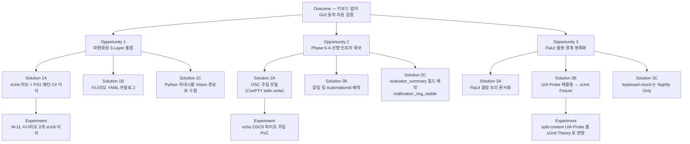
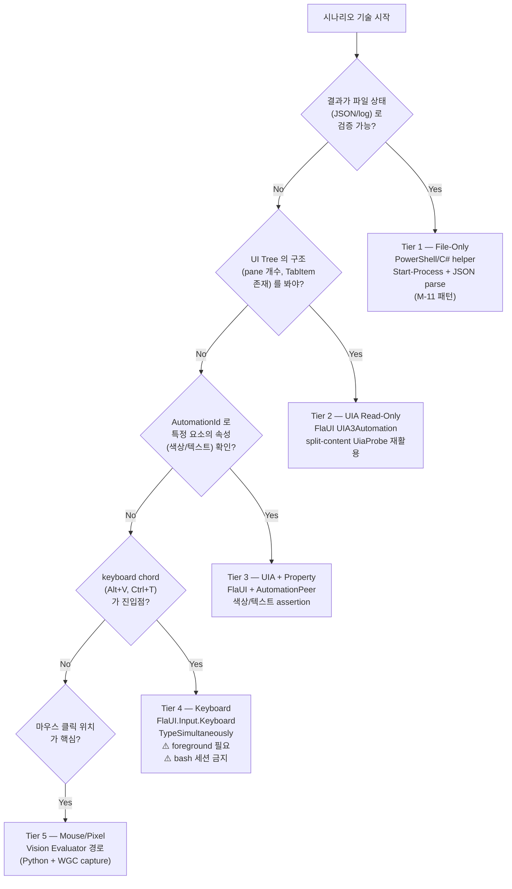
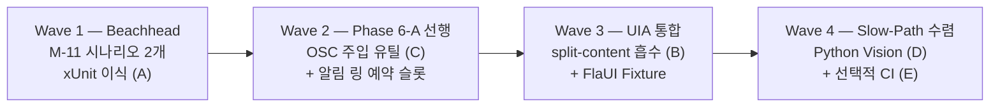

# PRD — M-11.5 E2E Test Harness 체계화

> **Feature**: M-11.5 E2E Test Harness 체계화
> **Author**: PM Agent Team (pm-lead 통합)
> **Date**: 2026-04-16
> **Status**: Draft v1.0
> **Previous PRD**: `docs/00-pm/session-restore.prd.md` (M-11)
> **Previous Plan** (이 피처): `docs/01-plan/features/e2e-test-harness.plan.md` v0.1 (2026-04-07)

---

## Executive Summary

| 관점 | 내용 |
|------|------|
| **Problem** | GhostWin E2E 테스트 자산이 3개 레이어로 **파편화**: (A) `scripts/e2e/` Python 하네스 (runner.py 392줄 + operator 모듈 + evaluator JSON 스키마), (B) FlaUI C# 프로젝트 2개 (cross-validation 131줄 + split-content 411줄), (C) ad-hoc PowerShell (`test_m11_*.ps1` 2개). 세 레이어 중 **가장 최근이고 가장 단순한 PS1 스크립트가 가장 잘 작동**했는데, 공통 규약이 없어 M-11 다음 사이클에도 또 ad-hoc 하게 쓸 가능성이 높다. 게다가 Phase 6-A OSC hook 검증에 필요한 "stdin 에 임의 OSC 시퀀스 주입" 유틸이 어느 레이어에도 없다. |
| **Solution** | 새 xUnit 프로젝트 `tests/GhostWin.E2E.Tests` 를 **체계화 허브**로 도입. M-11 PS1 성공 패턴(`Start-Process -WorkingDirectory` + 파일 상태 검증)을 C# helper 로 이식, 시나리오를 YAML 카탈로그로 선언적 기술. FlaUI 는 **UIA Tree 검증 전용**으로 재활용하고 chord/keyboard 는 "최후 수단" 으로 격하. Python 하네스는 **캡처 + Vision Evaluator 경로**로 수렴, PS1 M-11 스크립트는 C# 이식 후 archive. Phase 6-A 를 위해 **OSC 주입 유틸 + 알림 링 AutomationId 예약 슬롯** 을 선행 확립. |
| **Function / UX Effect** | 사용자 가시 변경 0. 개발자 관점: (a) `dotnet test tests/GhostWin.E2E.Tests --filter Speed=Fast` 한 명령으로 M-11 두 시나리오 재실행, (b) 새 시나리오 추가 비용 30분 이하 (YAML + C# skeleton), (c) Phase 6-A 진입 시 OSC 주입 + UIA 색상 검증 패턴이 이미 **예약 슬롯** 으로 준비됨, (d) FlaUI 가 필요한 상황과 아닌 상황이 결정 트리로 문서화되어 판단 비용 절감. |
| **Core Value** | "GUI 동작을 키보드 없이 자동 검증" 의 표준화. M-11 에서 증명된 파일-상태 검증 패턴 (Match Rate 96%) 을 프로젝트 전체 규약으로 승격. **Phase 6-A 의 핵심 가설(OSC 9 알림 링)이 본 인프라 위에서만 검증 가능** — 본 피처는 비전 3대 축 중 ②AI 에이전트 멀티플렉서 기반 구조의 **검증 게이트**. |

---

## 1. Product Overview

### 1.1 왜 이 피처가 지금 필요한가

GhostWin 3대 비전 (`onboarding.md` + Obsidian `_index.md`):

1. cmux 기능 탑재
2. **AI 에이전트 멀티플렉서 기반 구조** ← Phase 6-A 가 핵심 가설
3. 타 터미널 대비 성능

M-11.5 는 비전에 **직접 기여하지 않는 기반 인프라**. 그러나 Phase 6-A OSC hook + 알림 링 가설은 "**쉘이 `\e]9;` 를 보냈을 때 탭에 알림 링이 뜨는가**" 를 반복적으로 재현 검증해야 하며, 이를 수동으로 하면 비전 검증 자체가 느려진다.

> M-11 에서 cwd 복원이라는 단순 기능조차 "Run 1 → Run 2 상태 전이" 를 수동으로 검증하면 번거로웠고, PS1 자동 스크립트가 즉시 3회 반복 검증을 가능하게 했다. Phase 6-A 는 "셸 출력 → 비동기 알림 UI" 라는 더 복잡한 경로이므로 자동화 없이는 사실상 검증 불가능하다.

### 1.2 현재 상태 (3-Layer 파편화)

```
Layer A : Python 하네스 (scripts/e2e/)
          runner.py (392 lines) + capture_poc.py (423) + e2e_operator/
          역할: 스크린샷 캡처 + Claude Code Task Evaluator 연계 + MQ-1~8 시나리오
          강점: Vision LLM 판독, DX11 HwndHost 캡처 연구 완료
          약점: Python venv 부트스트랩, UTF-8 이슈, Evaluator 수동 호출

Layer B : FlaUI C# 도구 (tests/e2e-flaui-*)
          cross-validation (131 lines) — Alt+V / Ctrl+T / Ctrl+Shift+W 주입
          split-content   (411 lines) — UIA Tree 탐색 + split 검증
          강점: UIA Probe 검증됨, AutomationId 기반 assertion, xUnit 친화
          약점: foreground focus 필요 (bash 세션 불가), 3초 grace window 수동 클릭

Layer C : ad-hoc PowerShell (scripts/test_m11_*.ps1)
          test_m11_cwd_peb.ps1 (202 lines), test_m11_e2e_restore.ps1 (120)
          역할: 빌드 → 실행 → WM_CLOSE → session.json 검증
          강점: 키보드/포커스 무관, bash 세션 실행 가능, 단일 파일, 쉬움
          약점: 공통 헬퍼 없음 (Find-FirstLeaf / Stop-RunningApp 중복), PS 한정
```

### 1.3 성공 사례에서 추출한 패턴

`test_m11_*.ps1` 2개가 **M-11 검증에서 유일하게 성공** 한 이유 (근거: `docs/04-report/features/session-restore.report.md` Match Rate 96%):

| 성공 요소 | M-11 실측 | 재사용 가능성 |
|---------|---------|-------------|
| `Start-Process -WorkingDirectory $cwd` 로 CWD 제어 | 키보드 없이 상태 유도 | 매우 높음 (대부분 시나리오) |
| `Remove-Item $sessionPath` + 실행 + 종료 후 JSON 파싱 | 파일-상태 Arrange-Act-Assert | 매우 높음 |
| `$proc.CloseMainWindow()` + `WaitForExit(8000)` + Kill fallback | WM_CLOSE 경로 검증 | 매우 높음 |
| Find-FirstLeaf 재귀 헬퍼 | 트리 탐색 | 중간 (시나리오별 다름) |
| MSBuild + vswhere 동적 탐색 | 빌드 표준화 | 매우 높음 |

→ 이 5가지 패턴을 C# xUnit helper 로 이식하면 대부분의 future 시나리오가 키보드 없이 작성 가능.

---

## 2. Opportunity Analysis (OST — Opportunity Solution Tree)

### 2.1 Desired Outcome

**"GhostWin 의 GUI 동작을 키보드 입력 없이 `dotnet test` 한 번에 반복 가능하게 검증한다"**

### 2.2 Opportunity Solution Tree



### 2.3 트레이드오프 — "통합" vs "새 레이어 도입"

| 옵션 | 장점 | 단점 | 결정 |
|------|------|------|------|
| **A. 기존 Python 하네스 확장** | 이미 capture/evaluator 완비 | Python 부트스트랩, UTF-8, subagent 수동 호출. C# 엔진과 괴리 | 부분 채택 (Vision 경로만) |
| **B. FlaUI C# 를 허브로** | xUnit 친화, C# 엔진과 동일 스택 | foreground 의존 — bash 세션 실패 전력 (`e2e-bash-session-capabilities.md`) | 부분 채택 (UIA 검증만) |
| **C. 새 xUnit 프로젝트 + PS1 패턴 이식** ✅ | M-11 성공 패턴 재사용, 파일-상태 검증은 foreground 불필요 | 신규 레이어 추가 (일시적 4-Layer 기간 발생) | **채택** |
| **D. PS1 만 표준화 (C# 포기)** | 가장 단순 | .NET test infra 와 분리, CI trait 체계 부재 | 비채택 |

**결론**: C 선택. Python 하네스와 FlaUI 는 **폐기 아닌 수렴** — 각자 강점 영역(Vision / UIA) 으로 역할 축소. 일시적 4-Layer 는 마이그레이션 완료 후 2-Layer (xUnit Hub + Vision Add-on) 로 수렴.

---

## 3. Value Proposition + Lean Canvas

### 3.1 JTBD (Jobs-To-Be-Done, 6-part)

> **When** I finish a PDCA Do phase and need to enter Check phase,
> **I am trying to** verify that the feature actually works end-to-end including UI side effects,
> **But** manual smoke test는 매번 동일한 키보드 시퀀스를 손으로 반복해야 하고 놓치는 엣지 케이스가 있음,
> **Because** 키보드/포커스 의존 자동화는 bash 세션에서 실패하고 Python 하네스는 Evaluator 를 수동으로 불러야 함,
> **Makes me feel** 검증이 개발보다 오래 걸리고 회귀를 놓칠까 불안함,
> **Help me** 파일 상태와 UIA Tree 만으로 GUI 동작을 자동 판정하는 xUnit 기반 표준 하네스.

### 3.2 Lean Canvas

| 영역 | 내용 |
|------|------|
| **Problem** | 3-Layer 파편화 / 키보드 의존 자동화의 취약성 / Phase 6-A 검증 인프라 부재 |
| **Solution** | xUnit 허브 + YAML 시나리오 카탈로그 + OSC 주입 유틸 + FlaUI 결정 트리 |
| **UVP** | "키보드 없이, 30분 안에 새 E2E 시나리오를 추가할 수 있는 Windows 터미널용 xUnit 하네스" |
| **Unfair Advantage** | M-11 에서 실증된 PS1 패턴 + WGC/DXCam PoC 완료된 Vision 캡처 경로 |
| **Channels** | `dotnet test` CLI, VS Test Explorer, (선택) GitHub Actions self-hosted runner |
| **Customer Segments** | 1차: 본인(개발자 = 사용자), 2차: Phase 6-A 검증하는 미래의 자신, 3차: 향후 합류할 컨트리뷰터 |
| **Cost** | 공수 3~5일 추정 (PS1 이식 1일, YAML 카탈로그 1일, OSC 유틸 PoC 1일, FlaUI 정리 1일, 문서화 1일) |
| **Metrics** | M-11 2개 시나리오 xUnit 실행 성공, 새 시나리오 추가 시간 < 30분, Phase 6-A 진입 시 OSC 예약 슬롯 존재 |
| **Key Metrics** | `dotnet test` 실행 시간 (Fast < 30초 목표) / 시나리오 수 / Flake rate (재시도 빈도) |

---

## 4. Personas

### Persona 1: **"혼자 개발 중인 GhostWin 저자" (1차 타겟)**
- **역할**: PDCA 사이클 Plan → Design → Do → **Check** → Report
- **Pain**: Check 단계에서 매번 손으로 앱 실행 + 분할 + 입력 + 종료 → session.json 열어보기
- **Goal**: Check 를 `dotnet test` 한 줄로 마치고 바로 Report 로 진행
- **입력 채널 선호도**: file > UIA > keyboard (키보드는 최후 수단)

### Persona 2: **"Phase 6-A 를 검증하는 3주 뒤의 자신"**
- **역할**: OSC 9 시퀀스가 실제로 알림 링을 그리는지 검증
- **Pain**: 쉘에 `\e]9;...` 를 보내는 프로그래밍적 방법이 표준화 안 됨 / 알림 링 UI element 를 어떻게 식별할지 불명
- **Goal**: 예약 슬롯 API (OSC 주입 + AutomationId lookup + 색상 검증) 를 즉시 활용
- **선호도**: 인프라가 이미 있기를 원함, 당시에 새로 만들 시간 없음

### Persona 3: **"회귀 버그를 찾는 미래의 자신" (야간 실행)**
- **역할**: Nightly 전체 시나리오 실행 + 실패 시 git bisect
- **Pain**: Flake 심한 테스트로 bisect 불가
- **Goal**: `[Trait("Speed", "Slow")]` 시나리오도 3회 재실행 시 2회 이상 PASS 해야 (< 10% flake)
- **선호도**: 결정론 > 커버리지

---

## 5. Competitive Matrix

| 참조 | 하네스 스택 | 키보드 의존 | 파일-상태 검증 | UIA/접근성 | OSC 주입 | GhostWin 적용성 |
|------|------------|-------------|---------------|-----------|---------|---------------|
| **Windows Terminal** | TAEF + C++ unit, UIA TestApp 별도 | 일부 | 없음 (in-memory) | 있음 | 부분 | ★★☆ UIA 패턴 참고 |
| **VS Code** | Playwright + Electron DevTools Protocol | 거의 없음 (DOM query) | JSON state 경유 | DOM | webview 내 ANSI | ★☆☆ Web 스택이라 직접 적용 불가 |
| **cmux (macOS)** | CLI / OSC 메시지 기반 검증 | 없음 | socket + ANSI parse | N/A (TUI) | ★★★ 핵심 패턴 | ★★★ OSC 주입 철학 차용 |
| **Alacritty** | Rust cargo test + headless integration | 없음 | stdout/stderr diff | N/A | 있음 (vte test) | ★★☆ headless 사상 참고 |
| **FlaUI 자체** | .NET xUnit + UIA | 선택적 | 없음 | ★★★ | 없음 | ★★★ 본 프로젝트 UIA 레이어로 편입 |

**인사이트**:
- cmux 의 "OSC 메시지가 검증 프로토콜 자체" 철학이 Phase 6-A 와 정확히 일치 → OSC 주입 유틸을 1급 시민으로
- VS Code 처럼 DOM 대응물이 없으므로 UIA + 파일-상태 이중 검증 불가피
- Windows Terminal 의 TAEF + UIA 분리 패턴 → "Fast trait(파일) / Slow trait(UIA)" 구분에 근거 제공

---

## 6. FlaUI Activation Decision Tree

### 6.1 결정 트리



### 6.2 Tier 별 특징

| Tier | 예시 시나리오 | 실행 환경 | 예상 빈도 | M-11.5 범위 |
|------|-------------|----------|---------|-----------|
| 1 File-Only | cwd 복원, session.json 복원, PEB 폴링 | bash 세션 OK | **80%** (권장 기본) | 핵심 이식 |
| 2 UIA Read-Only | pane split 후 element 개수, tab 제목 | bash 세션 OK (no focus) | 10% | FlaUI Fixture 도입 |
| 3 UIA + Property | 알림 링 색상, focused border | bash 세션 OK | 5% (Phase 6-A) | 예약 슬롯 |
| 4 Keyboard | Alt+V 입력 자체 검증 | **사용자 세션만** | 3% | 기존 FlaUI 그대로 유지, Nightly trait |
| 5 Mouse/Pixel | DirectWrite 한글 렌더 | **사용자 세션만** | 2% | Python + WGC 유지 |

### 6.3 언제 FlaUI 가 필요한가 / 위험한가

**필요**:
- UIA Tree 로 AutomationId 기반 요소 참조 (예: `TabItem[AutomationId="workspace-1"]`)
- WPF DependencyProperty 를 UIA PropertyValue 로 관찰 (예: 알림 링 배경색)
- 앱의 visual state 를 외부에서 JSON 없이 읽어야 할 때

**위험**:
- `Keyboard.TypeSimultaneously` 는 foreground 필요 — bash 세션에서 실패 (`e2e-bash-session-capabilities.md` H-RCA4)
- `Application.Launch` 가 3~4초 대기 내장 → Fast trait 위반
- UIA 가 한국어 Windows 에서 Name 프로퍼티 반환 지연

---

## 7. 기존 자산 재활용 매트릭스

| 자산 | 현재 역할 | 라인수 | M-11.5 재활용 | 변경/삭제 |
|------|----------|:----:|--------------|----------|
| `scripts/e2e/runner.py` | Python Operator, MQ 시나리오 실행, 스크린샷 + metadata.json | 392 | **Vision 캡처 경로만 유지**. Fast E2E 에서는 호출하지 않음 | 유지 (Slow trait 전용으로 격리) |
| `scripts/e2e/capture_poc.py` | WGC/DXCam/PrintWindow PoC | 423 | WGC 캡처 로직을 `GhostWin.E2E.Tests/Capture/` 로 일부 이식 검토 (또는 Python 유지) | 유지 |
| `scripts/e2e/evaluator_prompt.md` + schema | Claude Task Evaluator 프로토콜 | - | **재활용** + `notification_ring_visible` 필드 예약 추가 | 스키마 확장 |
| `scripts/e2e/e2e_operator/` (lifecycle/input/window/dpi) | Python 조작자 모듈 | - | DPI / window 모듈은 참조용, lifecycle 은 C# helper 로 재구현 | 부분 유지 |
| `tests/e2e-flaui-cross-validation/Program.cs` | Alt+V / Ctrl+T chord 주입 RCA | 131 | **Tier 4 Nightly-only 시나리오로 편입**. Keyboard chord 검증 유일한 수단 | 유지 + xUnit wrapper 추가 |
| `tests/e2e-flaui-split-content/Program.cs` | split 후 UIA + PrintWindow 검증 | 237 | **분해 후 `GhostWin.E2E.Tests` 로 흡수**. Tier 2/3 시나리오의 모태 | Refactor — UIA 로직은 살리고 main 루프는 제거 |
| `tests/e2e-flaui-split-content/UiaProbe.cs` | UIA Read API 검증 (Launch/Probe/Properties) | 174 | **xUnit Fixture 기반**으로 재작성 (ClassFixture<GhostWinAppFixture>) | Refactor |
| `scripts/test_m11_cwd_peb.ps1` | PEB 폴링 Run1 검증 | 202 | **C# 이식 → `FileStateScenarios.PebCwdPolling_Fill()` Fast trait** | Deprecate (이식 후) |
| `scripts/test_m11_e2e_restore.ps1` | Run1→Run2 복원 전이 검증 | 120 | **C# 이식 → `FileStateScenarios.CwdRestore_RoundTrip()` Fast trait** | Deprecate (이식 후) |
| `scripts/test_e2e.ps1` | venv bootstrap + runner dispatch + evaluator handoff | 361 | **유지** — Python 하네스 wrapper 로 축소 역할 (Slow trait) | 유지 |
| `scripts/e2e/evaluator_summary.schema.json` | Evaluator JSON 스키마 | - | `notification_ring_visible`, `osc_sequence_injected` 필드 예약 추가 | 확장 |

### 통합 전 ↔ 후

| 항목 | 통합 전 (현재) | 통합 후 (M-11.5 완료) |
|------|---------------|--------------------|
| 진입점 | PS1 3개 + Python runner + FlaUI exe 2개 = **6개** | `dotnet test --filter Speed=Fast` (1) + `scripts/test_e2e.ps1 -Slow` (1) = **2개** |
| 새 시나리오 추가 비용 | 1~3시간 (어느 레이어? / 템플릿 부재) | < 30분 (YAML + C# skeleton) |
| Phase 6-A 준비도 | 0% | OSC 주입 유틸 + 예약 슬롯 존재 |
| 키보드 의존 비율 | 불명 (ad-hoc) | < 5% (Nightly only) |

---

## 8. Beachhead Segment + GTM Strategy

### 8.1 Beachhead 선정 (4-criteria scoring)

| 후보 세그먼트 | 긴급도 | ROI | 구현 복잡도 | 비전 연결 | 합계 |
|-------------|:-----:|:---:|:-------:|:-------:|:---:|
| **A. M-11 두 시나리오 xUnit 이식** | 5 | 5 | 2 (쉬움) | 3 | **15** ★ |
| B. FlaUI UIA 를 xUnit Fixture 로 통합 | 3 | 4 | 3 | 3 | 13 |
| C. OSC 주입 유틸 + 알림 링 예약 슬롯 | 4 | 3 | 4 | **5** | **16** ★ |
| D. Python Vision 경로 수렴 | 2 | 2 | 3 | 2 | 9 |
| E. CI (GitHub Actions self-hosted) | 2 | 4 | 5 | 2 | 13 |

### 8.2 GTM 단계 (3-Wave 출시)



- **Wave 1 (필수, 1일)**: PS1 → C# helper 이식, xUnit `[Fact]` 2개로 실행. 성공 기준 = `dotnet test --filter Class=FileStateScenarios` PASS
- **Wave 2 (필수, 1일)**: `OscInjector.SendOsc9(pid, text)` 유틸 + `AutomationIds.NotificationRing` 상수 선언 (UI 구현은 Phase 6-A 에서)
- **Wave 3 (권장, 1일)**: UiaProbe 를 `GhostWinAppFixture` 로 재구성, split-content 시나리오 1개를 xUnit 로 이식
- **Wave 4 (선택, 1일)**: Python 하네스를 `[Trait("Speed","Slow")]` 로 분리, CI 는 명시적 비목표 유지

### 8.3 채널 / 메트릭

- **주 채널**: `dotnet test` CLI (VS Test Explorer 동반)
- **보조 채널**: `scripts/test_e2e.ps1 -Slow` (Python Vision 경로)
- **메트릭**:
  - M1: `dotnet test --filter Speed=Fast` 벽시계 시간 < 30초 (M-11 기준 ~10초×2)
  - M2: 신규 시나리오 추가 평균 시간 < 30분 (측정: 3회 평균)
  - M3: Fast trait Flake rate < 2% (3회 연속 실행 기준)
  - M4: Phase 6-A 진입 시 OSC 주입 유틸 API 존재 여부 (Boolean, 필수)

---

## 9. Phase 6-A 연결 설계 (전용 섹션)

### 9.1 OSC 9 시퀀스 주입 방법 4가지 비교

| 방법 | 구현 난이도 | ConPTY 호환 | 쉘 무관 | 테스트 제어성 | M-11.5 선택 |
|------|:---------:|:----------:|:-----:|:-----------:|:----------:|
| (1) Python subprocess 가 `print("\e]9;test\e\\")` | 1 쉬움 | ✓ (쉘이 echo) | × (쉘별 echo 다름) | 중 | 보조 |
| (2) 세션 stdin 에 직접 write (C# via ConPTY handle) | 3 중간 | ✓ | ✓ | **최고** | **권장 primary** |
| (3) 테스트용 helper 바이너리 embed (ghostwin-test-emit.exe) | 4 어려움 | ✓ | ✓ | 고 | 장기 옵션 |
| (4) ghostty-vt 에 "inject OSC" test API 추가 | 5 매우 어려움 | ✓ | ✓ | 최고 | 비채택 (ghostty 오염) |

**결정**: (2) 채택. GhostWin.Services 의 `ISessionManager` 에 `TestOnlyInjectBytes(sessionId, byte[])` internal API 예약.

### 9.2 알림 링 UI AutomationId 예약 (Phase 6-A 담당자에게 요청)

```csharp
// tests/GhostWin.E2E.Tests/AutomationIds.cs (M-11.5 에서 선언)
public static class AutomationIds
{
    public const string TabItem(int index) => $"ghostwin.tab.{index}";
    public const string NotificationRing(int tabIndex) => $"ghostwin.tab.{tabIndex}.notification-ring";
    // Phase 6-A 구현 시 이 ID 로 WPF 컨트롤에 AutomationProperties.AutomationId 부여 필요
}
```

### 9.3 evaluator_summary.json 필드 예약

```jsonc
{
  "scenario": "phase6a.osc9_notification_ring",
  "ok": true,
  "notification_ring_visible": true,      // 신규 예약 (Phase 6-A)
  "osc_sequence_injected": "\u001b]9;test\u001b\\",  // 신규 예약
  "uia_ring_color_hex": "#FFCC00",        // Tier 3 assertion (옵션)
  "screenshots": ["phase6a.osc9_before.png", "phase6a.osc9_after.png"]
}
```

스키마 파일: `scripts/e2e/evaluator_summary.schema.json` 확장.

---

## 10. Non-Goals (명시적)

- ✗ 크로스 플랫폼 (Windows 전용)
- ✗ 시각적 회귀의 완전 자동화 (pixel-perfect diff)
- ✗ 성능 벤치마크 (별도 트랙)
- ✗ GitHub Actions Windows-latest runner 사용 (GPU/IME 제약으로 self-hosted 만 유효. 본 cycle 에선 **CI 자체 비목표**)
- ✗ Python 하네스 폐기 (Vision 경로로 수렴 유지)
- ✗ FlaUI 폐기 (UIA Tier 2/3 에 필수)
- ✗ Phase 6-A 기능 구현 (본 cycle 은 **선행 인프라** 만)

---

## 11. Success Metrics

| ID | 지표 | 목표 | 측정 |
|----|------|------|------|
| SM-1 | M-11 두 시나리오 xUnit 실행 | PASS (2/2) | `dotnet test --filter Class=FileStateScenarios` |
| SM-2 | Fast trait 전체 실행 시간 | < 30초 | `Measure-Command` |
| SM-3 | 신규 시나리오 추가 시간 | < 30분 (중앙값) | 다음 피처 3개에서 측정 |
| SM-4 | OSC 주입 API 존재 | Yes | `ISessionManager.TestOnlyInjectBytes` 컴파일 성공 |
| SM-5 | 알림 링 AutomationId 상수 존재 | Yes | `AutomationIds.NotificationRing` 참조 가능 |
| SM-6 | Fast trait Flake rate | < 2% | 3회 연속 실행 × 3일 |
| SM-7 | FlaUI 결정 트리 문서 | docs 에 존재 | 본 PRD §6 + Design 단계에서 재수록 |

---

## 12. Risks

| # | Risk | 영향 | 가능성 | 완화 |
|---|------|:----:|:-----:|------|
| R1 | C# 이식이 PS1 보다 verbose 해져 "30분 내 추가" 목표 미달 | 중 | 중 | Helper 라이브러리 적극 추출 (`E2ETestHost`, `SessionJsonReader`) |
| R2 | `TestOnlyInjectBytes` API 가 프로덕션 코드를 오염 | 높음 | 낮음 | `internal` + `[assembly: InternalsVisibleTo("GhostWin.E2E.Tests")]` 로 격리 |
| R3 | FlaUI Fixture 가 한국어 Windows 에서 UIA Name 반환 지연 | 중 | 중 | AutomationId 기반만 사용, Name 프로퍼티 의존 금지 |
| R4 | Python 하네스를 완전히 방치하여 Vision 경로가 bitrot | 중 | 중 | Slow trait 를 weekly 1회 수동 실행하는 규약 |
| R5 | Phase 6-A 에서 예약 슬롯이 실제 UI 와 맞지 않아 재설계 | 중 | 중 | 본 cycle 에서 "예약" 만 하고 **값은 Phase 6-A 에서 확정** |
| R6 | xUnit `[Collection]` 직렬화가 과도해 테스트 느려짐 | 낮음 | 낮음 | 앱 lifecycle 공유하는 Fixture 패턴 (Launch 1회, teardown 1회) |

---

## 13. Open Questions (Design 단계에서 해소)

1. **xUnit 프로젝트 위치**: `tests/GhostWin.E2E.Tests` vs `tests/GhostWin.App.E2E.Tests` — 기존 명명 관습 확인 필요
2. **Fixture 생명주기**: 시나리오마다 앱 재시작 (M-11 패턴) vs 한 번 띄우고 재사용 (FlaUI split-content 패턴) — **M-11 패턴 선호** (상태 격리) 하나 실행 시간 고려 필요
3. **OSC 주입 API 노출 범위**: internal + InternalsVisibleTo vs #if DEBUG — **InternalsVisibleTo 선호** (Release 빌드도 테스트 가능)
4. **YAML 카탈로그 실체**: 진짜 YAML vs C# Attribute — Attribute 가 refactor 친화적, YAML 은 non-dev 편집 가능. **C# Attribute + 문서화된 메타데이터 표** 가 현실적
5. **Python 하네스의 Slow trait 집계**: `dotnet test` 에서 외부 프로세스 호출할지, 별도 orchestrator 유지할지 — 후자 선호
6. **알림 링 AutomationId 명명 규약**: `ghostwin.tab.{index}.notification-ring` vs `tab-{id}-ring` — Phase 6-A 전에 convention 문서 필요

---

## 14. Attribution

- PM framework: [pm-skills](https://github.com/phuryn/pm-skills) by Pawel Huryn (MIT License)
- OST: Teresa Torres, "Continuous Discovery Habits"
- JTBD 6-part: Intercom 변형
- Lean Canvas: Ash Maurya
- 프로젝트 컨텍스트: `CLAUDE.md`, `onboarding.md`, `docs/00-research/e2e-bash-session-capabilities.md`, `docs/00-research/wpf-winexe-test-reference.md`, `docs/01-plan/features/e2e-test-harness.plan.md` v0.1, `docs/04-report/features/session-restore.report.md`

---

## 15. Version History

| Version | Date | Author | Notes |
|---------|------|--------|-------|
| 1.0 | 2026-04-16 | PM Agent Team (pm-lead) | Initial PRD. M-11 성공 패턴 기반 재구성, 기존 plan v0.1 의 Python-first 방향을 xUnit-first 로 전환 |
