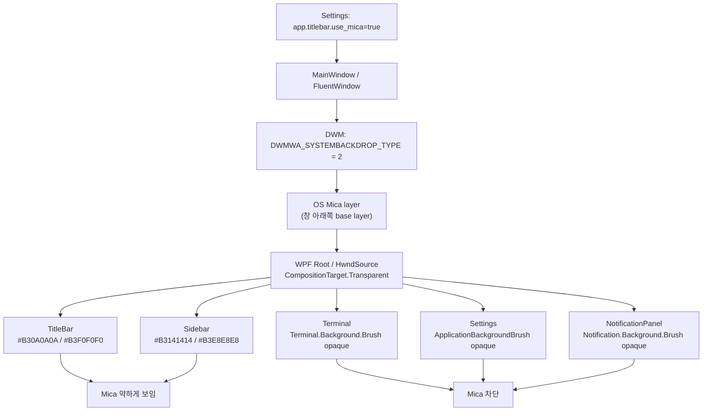
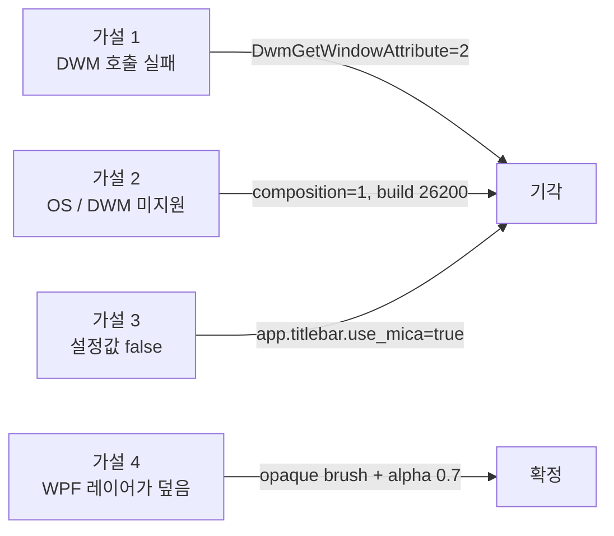

# M-16-B Mica 미체감 원인 분석

> **한 줄 요약**: Mica 는 OS/DWM 레벨에서 이미 적용되어 있다. 문제는 `DwmSetWindowAttribute` 실패가 아니라, Mica 위에 올라간 WPF 배경 레이어가 대부분 불투명하거나 70% 불투명 반투명이라 사용자가 변화를 거의 느끼지 못하는 구조다.

## 결론

사용자 PC에서 "Mica backdrop 토글을 켜도 변화 없음"으로 관측된 문제는 **Mica API 호출 실패가 아니다**.

실행 중인 GhostWin 창의 Win32 핸들에 대해 `DwmGetWindowAttribute(DWMWA_SYSTEMBACKDROP_TYPE)`를 외부에서 조회한 결과:

```text
pid=47804 title=GhostWin hwnd=0x14708F8 composition=1
DWMWA_SYSTEMBACKDROP_TYPE(38): hr=0x00000000 value=2
DWMWA_USE_IMMERSIVE_DARK_MODE(20): hr=0x00000000 value=1
```

`value=2`는 `DWMSBT_MAINWINDOW`, 즉 Windows 11 Mica 이다. 따라서 DWM 백드롭은 실제로 켜져 있다.

사용자가 변화를 못 보는 직접 원인은 아래 두 가지다.

1. **Mica가 보일 수 있는 영역이 너무 작거나 약하다**
   - TitleBar / Sidebar 는 `#B3...` 색상으로 약 70% 불투명이다.
   - Mica는 남은 30% 정도만 비친다.
   - 어두운 테마에서는 단색 배경과 차이가 작아 "변화 없음"처럼 보인다.

2. **큰 면적은 완전 불투명 WPF 배경이 덮는다**
   - Terminal 영역은 의도적으로 `Terminal.Background.Brush`가 불투명하다.
   - Settings 화면은 `ApplicationBackgroundBrush`가 불투명하다.
   - NotificationPanel 은 `Notification.Background.Brush`가 불투명하다.
   - 그래서 사용자가 토글을 조작하는 화면 자체에서는 Mica가 거의 보이지 않는다.

## 지금 어떻게 작동하는가



핵심은 **Mica는 창 아래에 깔렸지만, 앱이 그 위를 다시 칠하고 있다**는 점이다.

## 증거

### 1. DWM 속성은 이미 Mica

외부 PowerShell 진단으로 실행 중인 `GhostWin.App`의 메인 HWND를 읽었다.

| 항목 | 값 | 해석 |
|---|---:|---|
| `DwmIsCompositionEnabled` | `1` | DWM 합성 켜짐 |
| `DWMWA_SYSTEMBACKDROP_TYPE` | `2` | Mica (`DWMSBT_MAINWINDOW`) |
| `DWMWA_USE_IMMERSIVE_DARK_MODE` | `1` | Dark caption mode |
| `DWMWA_WINDOW_CORNER_PREFERENCE` | `2` | Round corner |

이 결과로 **DWM 호출 실패 / OS 미지원 / HWND 0 문제는 배제**된다.

### 2. 코드 경로상 직접 DWM 호출도 존재

`src/GhostWin.App/MainWindow.xaml.cs`:

- `OnSourceInitialized()`에서 `WindowChrome`을 재설정한다.
- `GlassFrameThickness = new Thickness(-1)`을 유지한다.
- 곧바로 `ApplyMicaDirectly()`를 호출한다.
- `ApplyMicaDirectly()`는 `DWMWA_SYSTEMBACKDROP_TYPE=38`에 `DWMSBT_MAINWINDOW=2`를 넣는다.

즉 현재 코드는 원래 PRD에 적힌 "DwmSetWindowAttribute 0건" 상태가 아니다. 그 문제는 해소되었다.

### 3. 사용자 검증 실패 위치는 "시각 변화 없음"

`docs/03-analysis/m16-b-window-shell.verification.md`의 Step 2 결과:

| 항목 | 기대 | 실제 |
|---|---|---|
| 2-2 | Mica 토글 시 Sidebar / NotificationPanel / TitleBar 영역에 즉시 Mica 합성 | 변화 없음 |
| 2-3 | Mica off 시 단색 background 복귀 | 2-2 실패로 테스트 불가 |
| 2-5~2-7 | Light/Dark + 터미널 영역 합성 확인 | Mica 변화 없음으로 실패 |

이 실패는 DWM 값과 모순되지 않는다. **DWM은 켜졌지만 보이는 픽셀 대부분이 WPF brush에서 나온다**.

## 영역별 분석

| 영역 | 현재 배경 | Mica 노출 정도 | 판정 |
|---|---|---:|---|
| TitleBar | `Window.TitleBar.Background.Brush = #B30A0A0A` 또는 `#B3F0F0F0` | 약 30% | 너무 약함 |
| Sidebar | `Sidebar.Background.Brush = #B3141414` 또는 `#B3E8E8E8` | 약 30% | 너무 약함 |
| Terminal | `Terminal.Background.Brush` | 0% | 의도적으로 차단 |
| Settings | `ApplicationBackgroundBrush` | 0% | 토글 조작 화면에서 변화 안 보임 |
| NotificationPanel | `Notification.Background.Brush` | 0% | PRD 기대와 구현 불일치 |
| GridSplitter | Transparent outer + 1px divider | 일부 | 면적이 너무 작음 |

## 설정 스키마 주의점

현재 `%APPDATA%\GhostWin\ghostwin.json`에는 과거 스키마와 현재 스키마가 함께 남아 있다.

```json
"terminal": {
  "window": {
    "mica_enabled": true
  }
},
"app": {
  "titlebar": {
    "use_mica": true
  }
}
```

현재 C# 코드는 `app.titlebar.use_mica`만 사용한다.

따라서 사용자가 예전 `terminal.window.mica_enabled` 값을 보고 "Mica가 켜져 있다"고 판단하면 실제 앱 설정과 어긋날 수 있다. 이번 진단 시점에는 `app.titlebar.use_mica=true`였고, DWM 값도 `2`였으므로 최종 원인은 스키마 불일치가 아니라 **시각 레이어 차단**이다. 다만 혼동 방지를 위해 구 스키마 정리 또는 migration 문서화가 필요하다.

## 토글 경로 분리 문제

현재 Mica 적용 경로가 둘로 나뉘어 있다.

| 시점 | 코드 | 동작 |
|---|---|---|
| 창 생성 직후 | `MainWindow.OnSourceInitialized()` → `ApplyMicaDirectly()` | 직접 `DwmSetWindowAttribute` 호출 + 진단 로그 |
| Settings 토글 후 | `App.xaml.cs` `SettingsChangedMessage` 핸들러 | `fw.WindowBackdropType = Mica/None`만 변경 |

이 구조 때문에 **시작 시 진단 로그는 직접 경로를 검증하지만, 사용자가 토글할 때의 경로는 wpfui 래퍼만 검증**한다.

wpfui 3.1.1 디컴파일 결과, `WindowBackdropType=Mica`는 내부적으로 다음을 수행한다.

```text
WindowBackdrop.RemoveBackground(window)
→ HwndSource.CompositionTarget.BackgroundColor = Transparent
→ DwmSetWindowAttribute(DWMWA_SYSTEMBACKDROP_TYPE, DWMSBT_MAINWINDOW)
```

이론상 동작은 맞다. 그러나 GhostWin은 이미 시작 시 직접 경로로 DWM 값을 `2`로 만들어 둔다. 이후 사용자가 체크박스를 다시 켜도 픽셀을 바꾸는 요인은 DWM 값이 아니라 위에 칠해진 WPF brush다.

## 원인 판정



**확정 원인**: Mica는 적용되어 있지만, 사용자가 보는 주요 픽셀은 Mica가 아니라 WPF 배경 brush에서 온다.

## 후속 수정 방향

### 방향 A: Mica를 chrome 영역만의 효과로 정의

Mica가 보이는 범위를 TitleBar + Sidebar 정도로 제한한다.

필요 작업:

- PRD/검증표 기대 문구 수정: NotificationPanel / Settings 는 Mica 대상에서 제외
- TitleBar/Sidebar alpha를 더 낮춰 시각 변화가 분명하게 보이게 조정
- Settings 토글 옆에 "(chrome only)" 같은 설명은 앱 안 텍스트로 넣지 말고, 문서와 테스트 기준만 정리

장점:

- Terminal/DX11 child HWND와 충돌 위험이 가장 낮다.
- 터미널 가독성이 흔들리지 않는다.

단점:

- 사용자가 기대한 "앱 전체 Windows 11 Mica 느낌"은 약하다.

### 방향 B: Mica-on 전용 반투명 토큰 도입

`UseMica=true`일 때만 chrome/panel 계열 background를 반투명 토큰으로 바꾼다.

예시:

| 토큰 | Mica off | Mica on 후보 |
|---|---|---|
| `Sidebar.Background.Brush` | `#141414` | `#80141414` |
| `Window.TitleBar.Background.Brush` | `#0A0A0A` | `#660A0A0A` |
| `Notification.Background.Brush` | `#1C1C1E` | `#CC1C1C1E` 또는 `#B31C1C1E` |
| `ApplicationBackgroundBrush` | `#1A1A1A` | 유지 또는 별도 실험 |

장점:

- 사용자가 토글 시 변화를 실제로 볼 가능성이 높다.

단점:

- LightMode 대비, 텍스트 contrast, Settings 카드 배경, Notification list hover까지 다시 검증해야 한다.
- M-16-A 토큰 체계에 `MicaOn/MicaOff` 상태가 추가된다.

### 방향 C: Settings/NotificationPanel은 불투명 유지, TitleBar/Sidebar만 강하게 조정

가장 작은 수정이다.

필요 작업:

- TitleBar/Sidebar alpha를 0.7에서 0.4~0.55 범위로 낮춰 비교
- Mica off 상태에서는 fallback background가 어색하지 않도록 별도 fallback layer 확인
- 검증표 Step 2 기대를 "TitleBar/Sidebar에서 변화"로 축소

## 권장 판단

이번 M-16-B에서는 **방향 C → 필요 시 B** 순서가 가장 안전하다.

이유:

1. Terminal 영역은 현재처럼 불투명 유지가 맞다. DX11 child HWND + ClearType 가독성을 Mica 실험으로 흔들면 안 된다.
2. Settings 화면 전체를 반투명화하면 카드/폼 contrast 검증 범위가 커진다.
3. 현재 실패의 핵심은 "DWM 미적용"이 아니라 "변화가 너무 약함"이므로, 먼저 chrome 영역의 시각 차이를 분명하게 만드는 것이 맞다.

## 다음 확인 체크리스트

| 확인 | 방법 | 기대 |
---|---|---|
| DWM 값 유지 | `DwmGetWindowAttribute(38)` | Mica on: `2`, off: `1` 또는 `0/None` |
| TitleBar 변화 | Mica on/off 토글 | 배경 톤 차이가 육안으로 보임 |
| Sidebar 변화 | Mica on/off 토글 | 배경 톤 차이가 육안으로 보임 |
| Terminal 차단 | 터미널 영역 확인 | Mica 영향 없음, 텍스트 가독성 유지 |
| Settings 화면 | 토글 조작 중 확인 | 불투명 유지 시 "토글 화면 자체는 변하지 않음"을 검증 기준에 반영 |

## 참고 자료

- Microsoft Learn: `DWM_SYSTEMBACKDROP_TYPE` / `DWMSBT_MAINWINDOW = Mica`
  - https://learn.microsoft.com/en-us/windows/win32/api/dwmapi/ne-dwmapi-dwm_systembackdrop_type
- Microsoft Learn: Mica material guidance
  - https://learn.microsoft.com/en-us/windows/apps/design/style/mica
- WPF UI 3.1.1 `WindowBackdrop` 디컴파일 확인
  - `WindowBackdrop.RemoveBackground()`
  - `WindowBackdrop.ApplyBackdrop()`
  - `FluentWindow.OnBackdropTypeChanged()`

